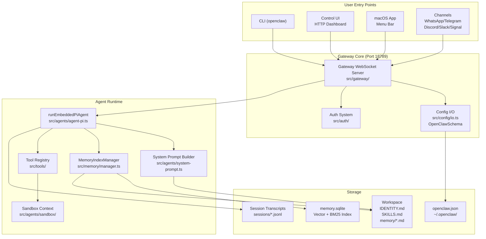
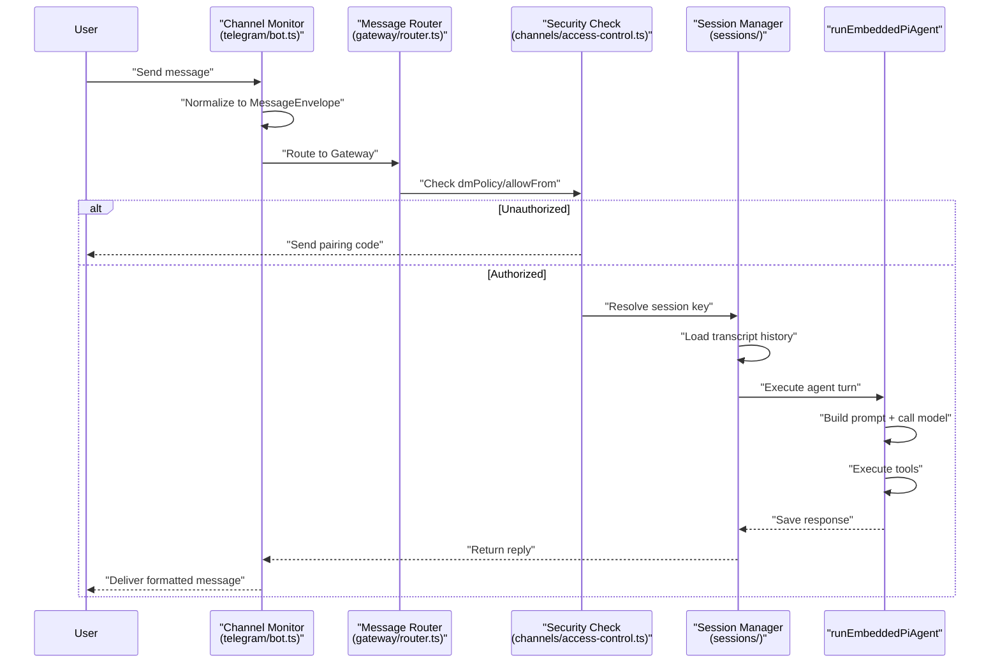

# Page: Overview

# Overview

<details>
<summary>Relevant source files</summary>

The following files were used as context for generating this wiki page:

- [CHANGELOG.md](CHANGELOG.md)
- [README.md](README.md)
- [assets/avatar-placeholder.svg](assets/avatar-placeholder.svg)
- [docs/channels/zalo.md](docs/channels/zalo.md)
- [docs/channels/zalouser.md](docs/channels/zalouser.md)
- [docs/cli/memory.md](docs/cli/memory.md)
- [docs/cli/sandbox.md](docs/cli/sandbox.md)
- [docs/concepts/memory.md](docs/concepts/memory.md)
- [docs/gateway/configuration.md](docs/gateway/configuration.md)
- [docs/gateway/sandbox-vs-tool-policy-vs-elevated.md](docs/gateway/sandbox-vs-tool-policy-vs-elevated.md)
- [docs/gateway/sandboxing.md](docs/gateway/sandboxing.md)
- [docs/platforms/mac/skills.md](docs/platforms/mac/skills.md)
- [docs/tools/elevated.md](docs/tools/elevated.md)
- [docs/tools/index.md](docs/tools/index.md)
- [docs/tools/skills-config.md](docs/tools/skills-config.md)
- [extensions/copilot-proxy/package.json](extensions/copilot-proxy/package.json)
- [extensions/google-antigravity-auth/package.json](extensions/google-antigravity-auth/package.json)
- [extensions/google-gemini-cli-auth/package.json](extensions/google-gemini-cli-auth/package.json)
- [extensions/matrix/CHANGELOG.md](extensions/matrix/CHANGELOG.md)
- [extensions/matrix/package.json](extensions/matrix/package.json)
- [extensions/memory-lancedb/package.json](extensions/memory-lancedb/package.json)
- [extensions/msteams/CHANGELOG.md](extensions/msteams/CHANGELOG.md)
- [extensions/msteams/package.json](extensions/msteams/package.json)
- [extensions/voice-call/CHANGELOG.md](extensions/voice-call/CHANGELOG.md)
- [extensions/voice-call/package.json](extensions/voice-call/package.json)
- [extensions/zalo/CHANGELOG.md](extensions/zalo/CHANGELOG.md)
- [extensions/zalo/package.json](extensions/zalo/package.json)
- [extensions/zalouser/package.json](extensions/zalouser/package.json)
- [package.json](package.json)
- [pnpm-lock.yaml](pnpm-lock.yaml)
- [scripts/clawtributors-map.json](scripts/clawtributors-map.json)
- [scripts/update-clawtributors.ts](scripts/update-clawtributors.ts)
- [scripts/update-clawtributors.types.ts](scripts/update-clawtributors.types.ts)
- [src/agents/memory-search.test.ts](src/agents/memory-search.test.ts)
- [src/agents/memory-search.ts](src/agents/memory-search.ts)
- [src/agents/sandbox-explain.test.ts](src/agents/sandbox-explain.test.ts)
- [src/agents/sandbox.ts](src/agents/sandbox.ts)
- [src/cli/memory-cli.test.ts](src/cli/memory-cli.test.ts)
- [src/cli/memory-cli.ts](src/cli/memory-cli.ts)
- [src/cli/models-cli.test.ts](src/cli/models-cli.test.ts)
- [src/config/config.ts](src/config/config.ts)
- [src/config/schema.ts](src/config/schema.ts)
- [src/config/types.tools.ts](src/config/types.tools.ts)
- [src/config/types.ts](src/config/types.ts)
- [src/config/zod-schema.agent-runtime.ts](src/config/zod-schema.agent-runtime.ts)
- [src/config/zod-schema.ts](src/config/zod-schema.ts)
- [src/index.test.ts](src/index.test.ts)
- [src/index.ts](src/index.ts)
- [src/memory/embeddings.test.ts](src/memory/embeddings.test.ts)
- [src/memory/embeddings.ts](src/memory/embeddings.ts)
- [src/memory/manager.ts](src/memory/manager.ts)
- [tsconfig.json](tsconfig.json)
- [ui/src/styles.css](ui/src/styles.css)
- [ui/src/styles/layout.mobile.css](ui/src/styles/layout.mobile.css)

</details>


## Purpose and Scope

This page introduces **OpenClaw**, a self-hosted multi-channel AI gateway that connects AI agents to messaging platforms (WhatsApp, Telegram, Discord, Slack, Signal, etc.) through a centralized control plane. It explains the system's core architecture, key components, and how they interact.

For detailed terminology definitions, see [Key Concepts](#1.1). For installation and first-run instructions, see [Quick Start](#1.2). For in-depth architecture diagrams, see [Architecture Diagrams](#1.3).

---

## What is OpenClaw

OpenClaw is a **personal AI assistant framework** that runs on your own infrastructure. It provides:

- **Multi-channel messaging**: Connect one AI agent to multiple messaging platforms simultaneously
- **Centralized control**: Single Gateway server (`ws://127.0.0.1:18789`) coordinates all channels, agents, and tools
- **Hot-reload configuration**: Change settings without restarting the Gateway
- **Sandboxed execution**: Run agent tools in isolated Docker containers for security
- **Extension system**: Add new channels and capabilities via npm-installable plugins
- **Session management**: Isolated conversation contexts per user/channel/group

The system is built around a **hub-and-spoke architecture**: the Gateway acts as the central control plane, with channels, clients, and agents connecting via WebSocket RPC.

**Sources**: [README.md:1-498](), [package.json:1-217]()

---

## System Architecture Overview



**Key Code Entities**:
- **Gateway Server**: [src/gateway/server.ts]()
- **Agent Executor**: [src/agents/agent-pi.ts]()
- **Config Schema**: [src/config/zod-schema.ts]()
- **Memory Manager**: [src/memory/manager.ts]()
- **Tool System**: [src/tools/]()

**Sources**: [src/index.ts:1-94](), [src/config/zod-schema.ts:1-470](), [README.md:180-197]()

---

## Core Components

### Gateway Server

The **Gateway** is the central WebSocket server (port `18789` by default) that coordinates all system components. It exposes an RPC protocol defined in [src/gateway/protocol.ts]() for:

- **Configuration management**: `config.get`, `config.set`, `config.apply`, `config.patch`
- **Agent control**: `agent.send`, `agent.execute`
- **Session operations**: `sessions.list`, `sessions.history`, `sessions.send`
- **Channel management**: `channels.status`, `channels.login`
- **System diagnostics**: `gateway.health`, `gateway.status`

The Gateway runs as a **background service** via platform-specific supervisors:
- macOS: `launchd` (LaunchAgent)
- Linux: `systemd` (user service)
- Windows: Task Scheduler

**Configuration**: Gateway behavior is controlled by `gateway.*` config keys:

| Field | Purpose | Default |
|-------|---------|---------|
| `gateway.port` | WebSocket listen port | `18789` |
| `gateway.bind` | Network binding mode | `"loopback"` |
| `gateway.auth.mode` | Authentication type | `"token"` |
| `gateway.reload.mode` | Config hot-reload behavior | `"hybrid"` |
| `gateway.controlUi.enabled` | Serve web dashboard | `true` |

**Sources**: [src/config/types.gateway.ts](), [docs/gateway/configuration.md:1-480]()

---

### Configuration System

OpenClaw uses a **strict, hot-reloadable** configuration system:

1. **Schema**: Defined via Zod schemas in [src/config/zod-schema.ts](). All config keys must match the schema or the Gateway refuses to start.
2. **File**: `~/.openclaw/openclaw.json` (JSON5 format supporting comments and trailing commas)
3. **Validation**: [src/config/validation.ts]() validates config on load and plugin registration
4. **Hot Reload**: [src/config/io.ts]() watches the config file and applies changes automatically

**Reload Modes** (`gateway.reload.mode`):

| Mode | Behavior |
|------|----------|
| `hybrid` (default) | Hot-apply safe changes; auto-restart for infrastructure changes |
| `hot` | Hot-apply only; log warnings for restart-needed changes |
| `restart` | Restart Gateway on any config change |
| `off` | No file watching; manual restart required |

**Hot-Apply vs Restart**:
- **Hot-apply**: `channels.*`, `agents.*`, `tools.*`, `cron.*`, `hooks.*`, `session.*`, `messages.*`
- **Restart required**: `gateway.port`, `gateway.bind`, `gateway.auth`, `gateway.tailscale`, `gateway.tls`

**Include System**: Configs support `$include` directives to split large configs:
```json5
{
  gateway: { port: 18789 },
  agents: { $include: "./agents.json5" },
  channels: { $include: ["./channels/telegram.json5", "./channels/discord.json5"] }
}
```

**Sources**: [src/config/config.ts:1-15](), [src/config/zod-schema.ts:95-470](), [docs/gateway/configuration.md:327-366]()

---

### Agent Runtime

The **Agent Runtime** executes AI agent turns via [runEmbeddedPiAgent]() in [src/agents/agent-pi.ts](). It orchestrates:

1. **System Prompt Construction**: [src/agents/system-prompt.ts]() assembles prompts from workspace files (`IDENTITY.md`, `SKILLS.md`, `MEMORY.md`)
2. **Tool Creation**: [src/tools/registry.ts]() provides tools based on policy resolution
3. **Memory Search**: [src/memory/manager.ts]() handles semantic search via `memory_search` tool
4. **Model Provider Calls**: Integrates with Anthropic, OpenAI, Gemini, etc. via [pi-ai SDK]()
5. **Session Persistence**: [src/config/sessions/store.ts]() writes JSONL transcripts

**Tool Policy Resolution Chain**:
```
Global tools.allow/deny
  → tools.byProvider[provider]
    → agents.list[agentId].tools
      → session-specific overrides (groups)
        → sandbox.tools (if sandboxed)
```

Deny always wins. Tool groups like `group:fs`, `group:runtime` expand to multiple tools.

**Sources**: [src/agents/agent-pi.ts](), [src/agents/system-prompt.ts](), [src/tools/index.ts](), [docs/tools/index.md:1-227]()

---

### Memory System

OpenClaw provides **semantic memory search** over workspace Markdown files and session transcripts via a hybrid vector + BM25 index.

**Architecture**:
- **Backend**: `MemoryIndexManager` in [src/memory/manager.ts:111-1128]()
- **Storage**: SQLite database with `sqlite-vec` extension (vector tables) + FTS5 (keyword search)
- **Embedding Providers**: OpenAI, Gemini, Voyage, or local `node-llama-cpp`
- **Chunking**: 400-token chunks with 80-token overlap
- **Hybrid Search**: Combines vector similarity (70% weight) and BM25 keyword (30% weight)

**Configuration Example**:
```json5
{
  agents: {
    defaults: {
      memorySearch: {
        enabled: true,
        provider: "openai",  // or "gemini", "voyage", "local", "auto"
        sources: ["memory", "sessions"],
        sync: {
          watch: true,
          onSearch: true,
          intervalMinutes: 60
        }
      }
    }
  }
}
```

**Memory Sources**:
1. **`memory`**: `MEMORY.md` + `memory/*.md` in workspace
2. **`sessions`**: Session transcripts from `~/.openclaw/agents/<agentId>/sessions/*.jsonl`

**Tools**:
- `memory_search(query)`: Semantic search with hybrid ranking
- `memory_get(path)`: Read specific memory file by path

**Alternative Backend**: QMD (`memory.backend = "qmd"`) uses external [qmd CLI]() for BM25 + vector + reranking.

**Sources**: [src/memory/manager.ts:1-1128](), [src/agents/memory-search.ts:1-250](), [docs/concepts/memory.md:1-250]()

---

### Channel System

Channels connect the Gateway to messaging platforms. OpenClaw includes **built-in channels** and supports **extension channels** via plugins.

**Built-in Channels**:
- WhatsApp ([Baileys]()), Telegram ([grammY]()), Discord ([discord.js]()), Slack ([Bolt]()), Signal ([signal-cli]()), Google Chat, BlueBubbles (iMessage), iMessage (legacy), WebChat

**Extension Channels** (npm plugins):
- Matrix (`@openclaw/matrix`), Zalo (`@openclaw/zalo`), Zalo Personal (`@openclaw/zalouser`), MS Teams (`@openclaw/msteams`)

**Channel Lifecycle**:


**Access Control** (`dmPolicy`):
- `pairing` (default): Require one-time approval code
- `allowlist`: Only users in `allowFrom` array
- `open`: Allow all DMs (requires `allowFrom: ["*"]`)
- `disabled`: Ignore all DMs

**Sources**: [src/channels/](), [docs/channels/](), [README.md:336-399]()

---

### Tool System

Tools expose capabilities to agents. The system includes:

**Core Tools** (always available unless denied):
- **File I/O**: `read`, `write`, `edit`, `apply_patch`
- **Execution**: `exec`, `bash`, `process`
- **Sessions**: `sessions_list`, `sessions_history`, `sessions_send`, `sessions_spawn`, `session_status`
- **Memory**: `memory_search`, `memory_get`
- **Web**: `web_search`, `web_fetch`
- **UI**: `browser`, `canvas`
- **Automation**: `cron`, `gateway`
- **Messaging**: `message`
- **Nodes**: `nodes` (device control)
- **Media**: `image` (understanding)

**Tool Profiles** (base allowlists):
- `minimal`: `session_status` only
- `coding`: File I/O + execution + sessions + memory
- `messaging`: Messaging tools + session tools
- `full`: No restrictions

**Tool Groups** (shorthands):
- `group:runtime`: `exec`, `bash`, `process`
- `group:fs`: `read`, `write`, `edit`, `apply_patch`
- `group:sessions`: All session tools
- `group:memory`: `memory_search`, `memory_get`
- `group:web`: `web_search`, `web_fetch`
- `group:ui`: `browser`, `canvas`

**Policy Example**:
```json5
{
  tools: {
    profile: "coding",
    deny: ["browser", "canvas"],  // Disable UI tools
    byProvider: {
      "google-antigravity": {
        allow: ["group:fs", "sessions_list"]  // Restrict specific provider
      }
    }
  }
}
```

**Sources**: [src/tools/](), [src/config/types.tools.ts:1-350](), [docs/tools/index.md:1-227]()

---

### Sandbox System

The **Sandbox System** isolates agent tool execution in Docker containers to reduce security risk.

**Configuration**:
```json5
{
  agents: {
    defaults: {
      sandbox: {
        mode: "non-main",  // off | non-main | all
        scope: "session",  // session | agent | shared
        workspaceAccess: "rw",  // none | ro | rw
        tools: {
          allow: ["bash", "process", "read", "write", "sessions_list"],
          deny: ["browser", "canvas", "cron", "gateway"]
        }
      }
    }
  }
}
```

**Modes**:
- `off`: No sandboxing (all tools on host)
- `non-main`: Sandbox non-DM sessions (groups, channels)
- `all`: Sandbox all sessions

**Scopes**:
- `session`: One container per session (isolated)
- `agent`: One container per agent (shared across sessions)
- `shared`: One container shared by all agents

**Workspace Access**:
- `none`: No workspace mount
- `ro`: Read-only workspace
- `rw`: Read-write workspace

**Image**: Default is `openclaw-sandbox:latest`. Build with `scripts/sandbox-setup.sh`.

**Sources**: [src/agents/sandbox/](), [docs/gateway/sandboxing.md:1-120]()

---

## Extension and Plugin Model

OpenClaw supports **extensions** via npm packages that declare channel or capability plugins.

**Plugin Metadata** (`package.json`):
```json5
{
  "openclaw": {
    "extensions": ["./index.ts"],
    "channel": {
      "id": "matrix",
      "label": "Matrix",
      "docsPath": "/channels/matrix",
      "order": 70
    }
  }
}
```

**Plugin Discovery**:
1. Core scans `node_modules/@openclaw/*` and `extensions/*/package.json`
2. Loads extensions via [src/plugins/loader.ts]()
3. Merges plugin schemas into `OpenClawSchema` via [src/config/schema.ts:209-248]()

**Channel Extensions**:
- [extensions/matrix/package.json:1-37](): Matrix protocol
- [extensions/zalo/package.json:1-36](): Zalo Bot API
- [extensions/zalouser/package.json:1-38](): Zalo personal accounts
- [extensions/msteams/package.json:1-32](): Microsoft Teams

**Capability Extensions**:
- [extensions/voice-call/package.json:1-20](): Twilio/Telnyx voice calls
- [extensions/memory-lancedb/package.json:1-21](): LanceDB memory backend

**Plugin SDK**: Exported via [dist/plugin-sdk/]() (`openclaw/plugin-sdk` in package exports).

**Sources**: [extensions/](), [src/plugins/](), [src/config/schema.ts:91-165]()

---

## Data Flow: Message Processing

```mermaid
graph LR
    Inbound["Inbound Message<br/>channels/*/monitor.ts"]
    Normalize["Normalize Envelope<br/>MessageEnvelope"]
    Router["Route to Gateway<br/>gateway/router.ts"]
    AccessCheck["Access Control<br/>dmPolicy check"]
    SessionKey["Resolve Session Key<br/>deriveSessionKey()"]
    LoadHistory["Load Transcript<br/>sessions/*.jsonl"]
    BuildPrompt["Build System Prompt<br/>system-prompt.ts"]
    CallModel["Call AI Model<br/>runEmbeddedPiAgent"]
    ToolExec["Execute Tools<br/>tools/registry.ts"]
    Sandbox{"Sandboxed?"}
    DockerExec["Docker Container<br/>sandbox/context.ts"]
    HostExec["Host Execution"]
    SaveSession["Save Transcript<br/>JSONL append"]
    FormatReply["Format Reply<br/>channel-specific"]
    Deliver["Deliver to User"]
    
    Inbound --> Normalize
    Normalize --> Router
    Router --> AccessCheck
    AccessCheck -->|Denied| Deliver
    AccessCheck -->|Allowed| SessionKey
    SessionKey --> LoadHistory
    LoadHistory --> BuildPrompt
    BuildPrompt --> CallModel
    CallModel --> ToolExec
    ToolExec --> Sandbox
    Sandbox -->|Yes| DockerExec
    Sandbox -->|No| HostExec
    DockerExec --> SaveSession
    HostExec --> SaveSession
    SaveSession --> FormatReply
    FormatReply --> Deliver
```



**Key Functions**:
- **Normalization**: [src/channels/envelope.ts]()
- **Session Key**: [src/config/sessions.ts:deriveSessionKey]()
- **Agent Execution**: [src/agents/agent-pi.ts:runEmbeddedPiAgent]()
- **Tool Registry**: [src/tools/registry.ts]()
- **Sandbox Context**: [src/agents/sandbox/context.ts]()

**Sources**: [src/gateway/router.ts](), [src/channels/](), [src/agents/agent-pi.ts]()

---

## Key File Structure

```
openclaw/
├── src/
│   ├── gateway/           # Gateway server, RPC protocol, router
│   ├── config/            # Schema (zod-schema.ts), validation, I/O
│   ├── agents/            # Agent runtime, system prompt, sandbox
│   ├── channels/          # Built-in channels (telegram, discord, etc.)
│   ├── memory/            # Memory index manager, embeddings, hybrid search
│   ├── tools/             # Tool registry, built-in tools (exec, read, etc.)
│   ├── sessions/          # Session management, transcript store
│   ├── cli/               # CLI commands (program.ts, agent-cli.ts, etc.)
│   └── infra/             # Infrastructure (env, errors, ports, dotenv)
├── extensions/            # Extension plugins (matrix, zalo, msteams)
│   ├── matrix/
│   ├── zalo/
│   ├── zalouser/
│   ├── msteams/
│   └── voice-call/
├── docs/                  # Documentation (configuration, channels, tools)
├── ui/                    # Control UI (Lit web components)
├── apps/                  # Native apps (macos, ios, android)
├── skills/                # Bundled skills (markdown files)
├── scripts/               # Build and maintenance scripts
└── openclaw.json          # User configuration file (~/.openclaw/)
```

**Configuration Paths**:
- Config: `~/.openclaw/openclaw.json`
- State dir: `~/.openclaw/` (or `$OPENCLAW_STATE_DIR`)
- Workspace: `~/.openclaw/workspace/` (or `agents.defaults.workspace`)
- Sessions: `~/.openclaw/agents/<agentId>/sessions/*.jsonl`
- Memory DB: `~/.openclaw/agents/<agentId>/memory.sqlite`

**Sources**: [src/](), [extensions/](), [README.md:309-311]()

---

## Summary

OpenClaw is a **hub-and-spoke AI gateway** where:
- The **Gateway** (port 18789) is the central control plane
- **Agents** execute AI turns via `runEmbeddedPiAgent` with tool support
- **Channels** normalize messaging platform protocols into unified envelopes
- **Configuration** is schema-validated and hot-reloadable
- **Memory** provides semantic search over workspace Markdown and transcripts
- **Sandboxing** isolates tool execution in Docker containers
- **Extensions** add new channels and capabilities via npm plugins

All system state lives in **files**: config in `openclaw.json`, sessions in `*.jsonl` transcripts, memory in Markdown + SQLite, and workspace context in `IDENTITY.md`, `SKILLS.md`, etc.

**Sources**: [README.md:1-498](), [package.json:1-217](), [src/config/zod-schema.ts:95-470]()

---