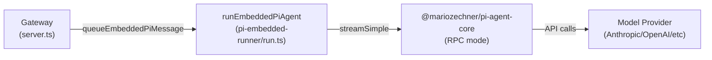
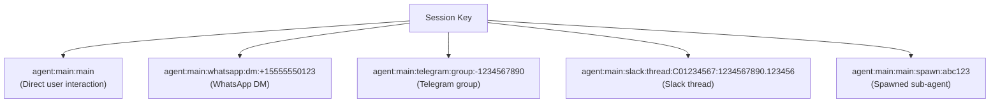
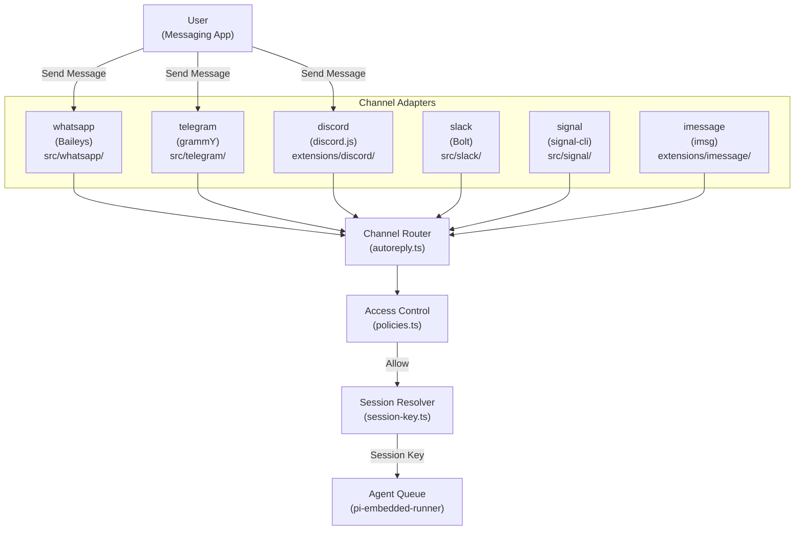
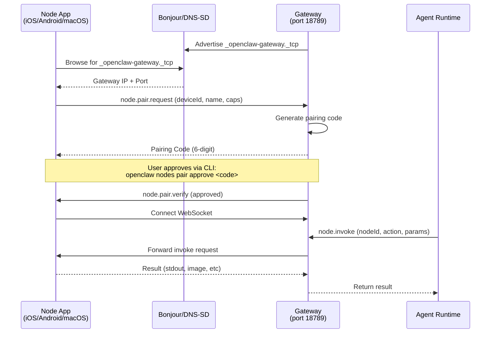
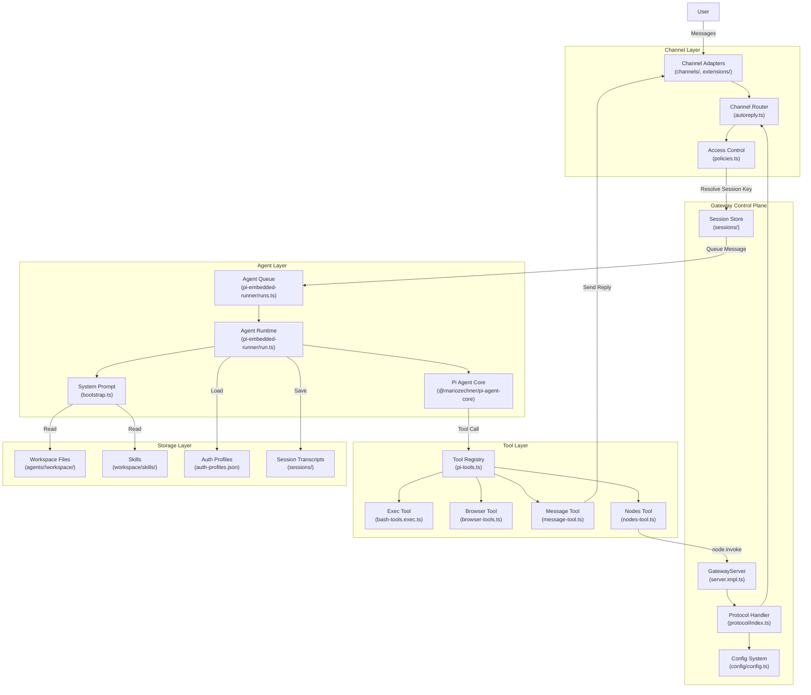

# Page: Key Concepts

# Key Concepts

<details>
<summary>Relevant source files</summary>

The following files were used as context for generating this wiki page:

- [CHANGELOG.md](CHANGELOG.md)
- [README.md](README.md)
- [assets/avatar-placeholder.svg](assets/avatar-placeholder.svg)
- [docs/channels/zalo.md](docs/channels/zalo.md)
- [docs/channels/zalouser.md](docs/channels/zalouser.md)
- [docs/cli/memory.md](docs/cli/memory.md)
- [docs/cli/sandbox.md](docs/cli/sandbox.md)
- [docs/concepts/memory.md](docs/concepts/memory.md)
- [docs/gateway/configuration.md](docs/gateway/configuration.md)
- [docs/gateway/sandbox-vs-tool-policy-vs-elevated.md](docs/gateway/sandbox-vs-tool-policy-vs-elevated.md)
- [docs/gateway/sandboxing.md](docs/gateway/sandboxing.md)
- [docs/platforms/mac/skills.md](docs/platforms/mac/skills.md)
- [docs/tools/elevated.md](docs/tools/elevated.md)
- [docs/tools/index.md](docs/tools/index.md)
- [docs/tools/skills-config.md](docs/tools/skills-config.md)
- [scripts/clawtributors-map.json](scripts/clawtributors-map.json)
- [scripts/update-clawtributors.ts](scripts/update-clawtributors.ts)
- [scripts/update-clawtributors.types.ts](scripts/update-clawtributors.types.ts)
- [src/agents/memory-search.test.ts](src/agents/memory-search.test.ts)
- [src/agents/memory-search.ts](src/agents/memory-search.ts)
- [src/agents/sandbox-explain.test.ts](src/agents/sandbox-explain.test.ts)
- [src/agents/sandbox.ts](src/agents/sandbox.ts)
- [src/cli/memory-cli.test.ts](src/cli/memory-cli.test.ts)
- [src/cli/memory-cli.ts](src/cli/memory-cli.ts)
- [src/cli/models-cli.test.ts](src/cli/models-cli.test.ts)
- [src/config/config.ts](src/config/config.ts)
- [src/config/schema.ts](src/config/schema.ts)
- [src/config/types.tools.ts](src/config/types.tools.ts)
- [src/config/types.ts](src/config/types.ts)
- [src/config/zod-schema.agent-runtime.ts](src/config/zod-schema.agent-runtime.ts)
- [src/config/zod-schema.ts](src/config/zod-schema.ts)
- [src/index.test.ts](src/index.test.ts)
- [src/index.ts](src/index.ts)
- [src/memory/embeddings.test.ts](src/memory/embeddings.test.ts)
- [src/memory/embeddings.ts](src/memory/embeddings.ts)
- [src/memory/manager.ts](src/memory/manager.ts)
- [tsconfig.json](tsconfig.json)
- [ui/src/styles.css](ui/src/styles.css)
- [ui/src/styles/layout.mobile.css](ui/src/styles/layout.mobile.css)

</details>


This page defines the core architectural concepts in OpenClaw: **Gateway**, **Agents**, **Sessions**, **Channels**, **Nodes**, **Tools**, and **Skills**. Understanding these concepts and their relationships is essential for configuring, deploying, and extending OpenClaw.

For installation and initial setup, see [Quick Start](#1.2). For detailed configuration of these components, see [Configuration File Structure](#4.1). For operational management, see [Gateway Service Management](#3.3).

---

## Gateway: The Control Plane

The **Gateway** is OpenClaw's central coordination hub—a WebSocket server that orchestrates all system components. It runs as a single process (typically on port 18789) and manages agents, sessions, channels, tools, and nodes.

**Gateway Control Plane** (`startGatewayServer`)
```
ws://127.0.0.1:18789  (default loopback bind)
```

The Gateway exposes a JSON-RPC-style protocol over WebSockets for:
- **Client connections**: CLI, Control UI, TUI, mobile apps
- **Channel adapters**: WhatsApp, Telegram, Discord, Slack, Signal, etc.
- **Device nodes**: iOS, Android, macOS companion apps
- **Configuration management**: `config.get`, `config.patch`, `config.apply`
- **Agent orchestration**: message routing, session lifecycle, tool invocation

**Key responsibilities:**
| Responsibility | Description |
|----------------|-------------|
| **Protocol Handler** | Validates and routes RPC requests ([src/gateway/protocol/index.ts:1-400]()) |
| **Session Management** | Tracks conversation state per session key ([src/config/sessions.ts]()) |
| **Channel Routing** | Routes inbound messages to agents ([src/web/autoreply.ts]()) |
| **Configuration System** | Loads and validates `openclaw.json` ([src/config/config.ts]()) |
| **Presence & Health** | Monitors channel connectivity and agent status |
| **Cron Scheduler** | Executes scheduled tasks ([src/cron/]()) |

**Gateway bind modes:**
- `loopback` (127.0.0.1) - Local access only, requires SSH tunnel or proxy for remote clients
- `tailnet` - Binds to Tailscale IP, authenticated via Tailscale identity
- `lan` - Binds to 0.0.0.0, requires strong token/password authentication
- `auto` - Chooses loopback by default, switches to tailnet if Tailscale is configured

**Sources:** [src/gateway/server.ts](), [src/gateway/server.impl.ts](), [docs/gateway/configuration.md:304-350](), Diagram 1 (Overall System Architecture)

---

## Agents: The AI Execution Runtime

An **Agent** is an AI assistant instance backed by the **Pi Agent Core** runtime (`@mariozechner/pi-agent-core`). Each agent has its own workspace, model configuration, tool policies, and authentication profiles.

**Agent Runtime Chain**


**Agent configuration hierarchy:**
1. `agents.defaults` - Global defaults for all agents
2. `agents.list[].` - Per-agent overrides (workspace, model, tools, sandbox)
3. Runtime directives - Per-session overrides (`/model`, `/think`, `/elevated`)

**Agent identity and routing:**
- Each agent has an `id` (e.g., `"main"`, `"work"`, `"support"`)
- Default agent: `agents.list[].default: true` (fallback is first agent or agent with id `"main"`)
- Agents can have dedicated `workspace`, `agentDir`, and `auth-profiles.json`
- Bindings route messages to specific agents: `bindings[].agentId`

**Agent workspace structure:**
```
~/.openclaw/agents/<agentId>/
├── agent/
│   ├── auth-profiles.json     # OAuth + API key credentials
│   └── auth.json               # Runtime cache (managed by Pi Core)
├── sessions/
│   └── agent-<agentId>.json   # Session transcripts
└── workspace/                  # Files accessible to the agent
    ├── AGENTS.md               # System prompt bootstrap
    ├── SOUL.md                 # Identity/personality
    ├── TOOLS.md                # Tool guidance
    └── skills/                 # Skill bundles
```

**Agent tool execution:**
Agents execute tools through `createOpenClawCodingTools` which assembles:
- **File system tools**: `read`, `write`, `edit`, `apply_patch` ([src/agents/pi-tools.ts:229-251]())
- **Runtime tools**: `exec`, `process` ([src/agents/bash-tools.ts]())
- **OpenClaw tools**: `browser`, `canvas`, `nodes`, `message`, `sessions_*`, `cron`, `gateway` ([src/agents/openclaw-tools.ts]())
- **Plugin tools**: Optional tools from extensions ([src/plugins/tools.ts]())

**Sources:** [src/agents/pi-embedded-runner/run.ts](), [src/agents/pi-tools.ts:152-367](), [docs/gateway/configuration.md:214-249](), Diagram 1 (Overall System Architecture), Diagram 6 (Agent Processing and Tool Execution Pipeline)

---

## Sessions: Conversation State Management

A **Session** represents a single conversation context with its own message history, model settings, and tool execution state. Sessions are identified by **session keys** that encode routing information.

**Session Key Patterns**


**Session key format:**
```
agent:{agentId}:{provider}:{scope}:{identifier}
```

Examples from code:
- `"agent:main:main"` - Main session ([src/routing/session-key.ts]())
- `"agent:main:whatsapp:dm:+15555550123"` - WhatsApp DM
- `"agent:work:telegram:group:-1234567890"` - Telegram group bound to "work" agent
- `"agent:main:slack:thread:C01234567:1234567890.123456"` - Slack thread

**Session scope resolution:**
Per-channel DM scoping via `session.dmScope`:
- `"global"` (default) - One session per sender across all accounts
- `"per-account"` - Separate sessions per account (multi-account isolation)

**Session lifecycle:**
| State | Description | Storage |
|-------|-------------|---------|
| **Active** | Has message history, in-memory or on disk | `~/.openclaw/agents/<agentId>/sessions/` |
| **Idle** | No recent activity, may be compacted | Transcript persisted |
| **Reset** | History cleared (manual `/reset` or policy trigger) | Transcript archived or deleted |

**Session reset policies** (`session.reset`):
- `mode: "idle"` - Reset after N minutes of inactivity
- `mode: "daily"` - Reset daily at a specific hour (local time)
- `mode: "off"` - Manual reset only
- Per-channel overrides: `session.resetByChannel`

**Session queue modes** (`routing.queue.mode`):
- `"sequential"` - Process messages one at a time (blocks concurrent runs)
- `"concurrent"` - Allow overlapping agent runs
- `"collect"` - Debounce and batch messages before processing

**Session state management:**
Sessions maintain per-session overrides for:
- `model` - Active model (overrides agent default)
- `thinkingLevel` - Reasoning verbosity (`off`, `minimal`, `low`, `medium`, `high`, `xhigh`)
- `verboseLevel` - Tool output detail (`off`, `on`)
- `sendPolicy` - Reply delivery behavior
- `groupActivation` - Group mention requirements
- `elevated` - Host execution mode (`off`, `on`, `ask`, `full`)

**Sources:** [src/routing/session-key.ts](), [src/config/sessions.ts](), [src/sessions/](), [docs/gateway/configuration.md:880-960](), Diagram 2 (Message Processing Data Flow)

---

## Channels: Messaging Platform Integrations

**Channels** are adapters that connect OpenClaw to messaging platforms. Each channel handles platform-specific authentication, message formats, and delivery.

**Channel Architecture**


**Built-in channels:**
| Channel | Library | Location | Multi-Account |
|---------|---------|----------|---------------|
| WhatsApp | `@whiskeysockets/baileys` | [src/whatsapp/]() | ✓ |
| Telegram | `grammy` | [src/telegram/]() | ✓ |
| Discord | `discord.js` | [extensions/discord/]() | ✓ |
| Slack | `@slack/bolt` | [src/slack/]() | ✓ |
| Signal | `signal-cli` | [src/signal/]() | ✗ |
| iMessage | `imsg` | [extensions/imessage/]() | ✗ |
| Google Chat | Chat API | [extensions/googlechat/]() | ✓ |
| MS Teams | Bot Framework | [extensions/msteams/]() | ✓ |

**Extension channels:**
- BlueBubbles ([extensions/bluebubbles/]())
- Matrix ([extensions/matrix/]())
- Nostr ([extensions/nostr/]())
- LINE ([extensions/line/]())
- Tlon/Urbit ([extensions/tlon/]())
- Zalo ([extensions/zalo/]())
- 15+ more in [extensions/]()

**Channel access control:**

**DM policies** (`channels.<channel>.dmPolicy`):
- `"pairing"` (default) - Unknown senders receive a pairing code, owner must approve
- `"allowlist"` - Only allow senders in `allowFrom` list
- `"open"` - Allow all DMs (requires `allowFrom: ["*"]`)
- `"disabled"` - Ignore all DMs

**Group policies** (`channels.<channel>.groupPolicy` / `groups`):
- Allowlist-based: Only groups in `groups` config are active
- Per-group `requireMention` controls whether @-mentions are required
- `mentionPatterns` allows custom trigger phrases (e.g., `["@bot", "hey bot"]`)

**Channel routing flow:**
1. Message arrives at channel adapter
2. Adapter extracts sender, content, attachments, thread context
3. Router checks access policy (`allowFrom`, `groupAllowFrom`, pairing)
4. Session key is resolved (`resolveSessionKey`)
5. Message is queued for agent processing (`queueEmbeddedPiMessage`)

**Sources:** [src/web/autoreply.ts](), [src/channels/](), [extensions/](), [docs/gateway/configuration.md:486-565](), Diagram 2 (Message Processing Data Flow)

---

## Nodes: Device Capability Providers

**Nodes** are companion apps (iOS, Android, macOS) that pair with the Gateway and expose device-local capabilities to agents via the `node.invoke` protocol.

**Node Discovery and Pairing**


**Node capabilities:**

| Capability | iOS | Android | macOS | Description |
|------------|-----|---------|-------|-------------|
| `system.run` | ✗ | ✗ | ✓ | Execute shell command on macOS host |
| `system.which` | ✗ | ✗ | ✓ | Check if binary exists |
| `system.notify` | ✓ | ✓ | ✓ | Display notification |
| `camera.snap` | ✓ | ✓ | ✓ | Capture photo |
| `camera.clip` | ✓ | ✓ | ✗ | Record video clip |
| `screen.record` | ✓ | ✓ | ✗ | Screen recording |
| `location.get` | ✓ | ✓ | ✓ | GPS coordinates |
| `canvas.*` | ✓ | ✓ | ✓ | A2UI canvas control |

**Node invocation from tools:**

The `nodes` tool allows agents to target specific nodes:
```typescript
// exec tool with node targeting
exec({
  command: "ls -la",
  host: "node",
  node: "macbook-pro"  // Node id or name
})

// Direct node invocation
node.invoke({
  nodeId: "iphone-15",
  action: "camera.snap",
  params: { quality: "high" }
})
```

**Node management:**
- List nodes: `openclaw nodes list`
- Describe capabilities: `openclaw nodes describe <nodeId>`
- Approve pairing: `openclaw nodes pair approve <code>`
- Rename node: `openclaw nodes rename <nodeId> <newName>`

**Node host mode:**

macOS and Linux can run as "node hosts" via `openclaw node start`, exposing `system.run`/`system.which` for remote execution without the full macOS app.

**Sources:** [src/gateway/protocol/schema/nodes.ts](), [docs/nodes/](), [README.md:222-229](), Diagram 1 (Overall System Architecture)

---

## Tools: Agent Capabilities

**Tools** are functions that agents can invoke during execution. OpenClaw provides built-in tools for file operations, shell execution, browser control, messaging, and system integration.

**Tool Registration and Execution**

```mermaid
graph TB
    CreateTools["createOpenClawCodingTools<br/>(pi-tools.ts:153)"]
    
    subgraph "Core Tools"
        FSTools["File System<br/>read, write, edit"]
        RuntimeTools["Runtime<br/>exec, process"]
        MemoryTools["Memory<br/>memory_search, memory_get"]
        WebTools["Web<br/>web_search, web_fetch"]
    end
    
    subgraph "OpenClaw Tools"
        BrowserTool["browser<br/>(browser-tools.ts)"]
        CanvasTool["canvas<br/>(canvas-tool.ts)"]
        NodesTool["nodes<br/>(nodes-tool.ts)"]
        MessageTool["message<br/>(message-tool.ts)"]
        SessionTools["sessions_*<br/>(sessions-tools.ts)"]
        CronTool["cron<br/>(cron-tool.ts)"]
        GatewayTool["gateway<br/>(gateway-tool.ts)"]
    end
    
    subgraph "Plugin Tools"
        LobsterTool["lobster<br/>(extensions/lobster)"]
        LLMTaskTool["llm-task<br/>(extensions/llm-task)"]
        ChannelTools["Channel tools<br/>(login, send, etc)"]
    end
    
    CreateTools --> FSTools
    CreateTools --> RuntimeTools
    CreateTools --> MemoryTools
    CreateTools --> WebTools
    CreateTools --> BrowserTool
    CreateTools --> CanvasTool
    CreateTools --> NodesTool
    CreateTools --> MessageTool
    CreateTools --> SessionTools
    CreateTools --> CronTool
    CreateTools --> GatewayTool
    CreateTools --> LobsterTool
    CreateTools --> LLMTaskTool
    CreateTools --> ChannelTools
    
    AgentRuntime["Agent Runtime"] -->|"Assemble tools"| CreateTools
    CreateTools -->|"Filtered tools"| ModelProvider["Model Provider"]
```


**Tool policy system:**

Tools are filtered by multiple policy layers:
1. **Tool profiles** (`tools.profile`): Base allowlist presets
   - `"minimal"` - session_status only
   - `"coding"` - File system + runtime + memory
   - `"messaging"` - Messaging + session tools
   - `"full"` - All tools (default)

2. **Global allow/deny** (`tools.allow`, `tools.deny`): Top-level filters

3. **Provider-specific policies** (`tools.byProvider`): Per-provider restrictions
   ```json5
   {
     tools: {
       byProvider: {
         "google-antigravity": { profile: "minimal" },
         "openai/gpt-5.2": { allow: ["group:fs", "sessions_list"] }
       }
     }
   }
   ```

4. **Agent overrides** (`agents.list[].tools`): Per-agent policy

5. **Group policies** (`channels.<channel>.groups.<groupId>.tools`): Per-group restrictions

6. **Sandbox policies** (`tools.sandbox.tools`): Tools available in sandboxes

**Tool groups** (shorthands for multiple tools):
- `group:runtime` → `exec`, `bash`, `process`
- `group:fs` → `read`, `write`, `edit`, `apply_patch`
- `group:sessions` → `sessions_list`, `sessions_history`, `sessions_send`, `sessions_spawn`, `session_status`
- `group:memory` → `memory_search`, `memory_get`
- `group:web` → `web_search`, `web_fetch`
- `group:ui` → `browser`, `canvas`
- `group:automation` → `cron`, `gateway`
- `group:messaging` → `message`
- `group:nodes` → `nodes`

**Tool execution security:**

**Exec tool host targeting** ([src/agents/bash-tools.exec.ts]()):
- `host: "sandbox"` - Run in Docker container (when sandboxed)
- `host: "gateway"` - Run on Gateway host
- `host: "node"` - Run on paired device node

**Exec security modes**:
- `security: "deny"` - Block all commands
- `security: "allowlist"` - Require approval for non-allowlisted commands
- `security: "full"` - Allow all commands

**Exec approval flow** ([src/agents/bash-tools.exec.ts:300-450]()):
- `ask: "off"` - No approval prompts
- `ask: "on-miss"` - Prompt when command not in allowlist
- `ask: "always"` - Prompt for every command

**Sources:** [src/agents/pi-tools.ts:152-367](), [src/agents/bash-tools.ts](), [src/agents/openclaw-tools.ts](), [docs/tools/index.md](), Diagram 6 (Agent Processing and Tool Execution Pipeline)

---

## Skills: Bundled Knowledge and Capabilities

**Skills** are self-contained bundles of prompts, scripts, and metadata that extend agent capabilities. They live in the agent's workspace and are automatically discovered and injected into system prompts.

**Skill Structure**
```
~/.openclaw/agents/<agentId>/workspace/skills/
├── github/
│   ├── SKILL.md           # Skill documentation (injected into prompt)
│   ├── package.json       # Metadata (name, description, dependencies)
│   └── bin/               # Optional binaries/scripts
├── slack/
│   ├── SKILL.md
│   └── package.json
└── custom-skill/
    ├── SKILL.md
    └── package.json
```

**Skill types:**

1. **Bundled skills** - Shipped with OpenClaw, installed during onboarding
   - Located in repository: [skills/]()
   - Examples: `github`, `slack`, `discord`, `notion`, `figma`

2. **Managed skills** - Downloaded from ClawdHub registry
   - Installable via: `openclaw skills install <skillName>`
   - Registry: https://ClawdHub.com

3. **Workspace skills** - Custom skills in agent workspace
   - Created manually in `workspace/skills/`
   - Full control over prompt content and dependencies

**Skill discovery and injection:**

Skills are discovered by scanning `workspace/skills/` for directories containing:
- `SKILL.md` - Markdown documentation (injected into `TOOLS.md` section of system prompt)
- `package.json` - Metadata (name, description, version, dependencies)

**Skill metadata** (`package.json`):
```json5
{
  "name": "github",
  "version": "1.0.0",
  "description": "GitHub API integration",
  "openclaw": {
    "skills": {
      "dependencies": {
        "tools": ["exec"],           // Required tools
        "binaries": ["gh"],          // Required binaries
        "envVars": ["GITHUB_TOKEN"]  // Required env vars
      }
    }
  }
}
```

**Skill installation:**

Skills can include install instructions that run when the skill is first enabled:
- Download binaries (e.g., `gh` CLI, `terraform`)
- Install via package managers (Homebrew, apt, npm)
- Configure environment variables
- Set up authentication

**Skill management commands:**
- `openclaw skills list` - Show installed skills
- `openclaw skills status` - Check dependencies and health
- `openclaw skills install <name>` - Install from ClawdHub
- `openclaw skills update` - Update all skills
- `openclaw skills refresh` - Reload skill metadata

**Skill injection into system prompt:**

When building the system prompt ([src/agents/pi-embedded-helpers/bootstrap.ts]()), OpenClaw:
1. Scans `workspace/skills/` for `SKILL.md` files
2. Reads each file (up to `bootstrapMaxChars` per skill)
3. Concatenates skill docs into `TOOLS.md` section
4. Injects `TOOLS.md` into the full system prompt

This gives agents awareness of available skills without manual prompt editing.

**Sources:** [src/agents/pi-embedded-helpers/bootstrap.ts](), [docs/tools/skills.md](), [README.md:247-250](), [skills/]()

---

## Component Relationships

**System Integration Map**


**Key data flows:**

1. **Inbound message flow:**
   - User sends message → Channel adapter receives
   - Router checks access policy (allowlist/pairing/dm policy)
   - Session key resolved (`resolveSessionKey`)
   - Message queued for agent (`queueEmbeddedPiMessage`)
   - Agent processes with tools and model
   - Response sent back through channel

2. **Configuration flow:**
   - `~/.openclaw/openclaw.json` loaded by `loadConfig`
   - Validated against Zod schema ([src/config/zod-schema.ts]())
   - Distributed to subsystems (channels, agents, gateway)
   - Runtime updates via `config.patch` RPC method

3. **Tool execution flow:**
   - Agent runtime calls tool via Pi Agent Core
   - Tool policies filter available tools
   - Sandbox config determines execution location (Docker vs host)
   - Tool executes and returns result
   - Result streamed back to user

4. **Session persistence flow:**
   - Message history stored in `~/.openclaw/agents/<agentId>/sessions/`
   - Session state includes: transcript, model settings, tool results
   - Compaction triggered on context overflow
   - Reset policies clear history based on idle time or schedule

**Sources:** [src/gateway/server.impl.ts](), [src/web/autoreply.ts](), [src/agents/pi-embedded-runner/run.ts](), [src/agents/pi-tools.ts](), Diagram 1-6 (All high-level architecture diagrams)

---

## Configuration Mapping

**Core Configuration Domains** (all under `~/.openclaw/openclaw.json`)

| Config Section | Controls | File Reference |
|----------------|----------|----------------|
| `agents.defaults` | Global agent settings (workspace, model, tools) | [src/config/types.agents.ts]() |
| `agents.list[]` | Per-agent configurations | [src/config/types.agents.ts]() |
| `bindings[]` | Agent routing rules | [src/config/types.agents.ts]() |
| `channels.*` | Channel-specific settings | [src/config/types.channels.ts]() |
| `tools.*` | Tool policies and restrictions | [src/config/types.tools.ts]() |
| `session.*` | Session lifecycle and reset policies | [src/config/types.base.ts]() |
| `gateway.*` | Gateway port, bind, auth | [src/config/types.gateway.ts]() |
| `models.*` | Model providers and failover | [src/config/types.models.ts]() |
| `browser.*` | Browser control configuration | [src/config/types.browser.ts]() |
| `cron.*` | Scheduled task settings | [src/config/types.cron.ts]() |

**Example minimal configuration:**
```json5
{
  agents: {
    defaults: {
      workspace: "~/.openclaw/workspace",
      model: { primary: "anthropic/claude-sonnet-4-5" }
    }
  },
  channels: {
    whatsapp: {
      allowFrom: ["+15555550123"]
    }
  }
}
```

**Sources:** [src/config/types.ts](), [docs/gateway/configuration.md:100-565](), [docs/gateway/configuration-examples.md]()

---