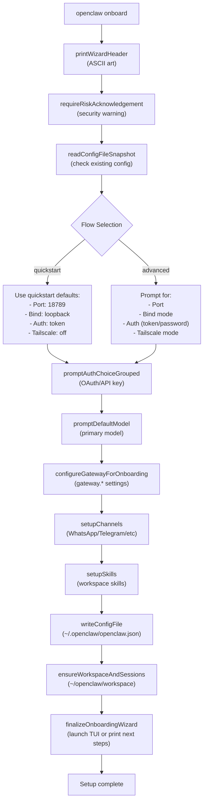
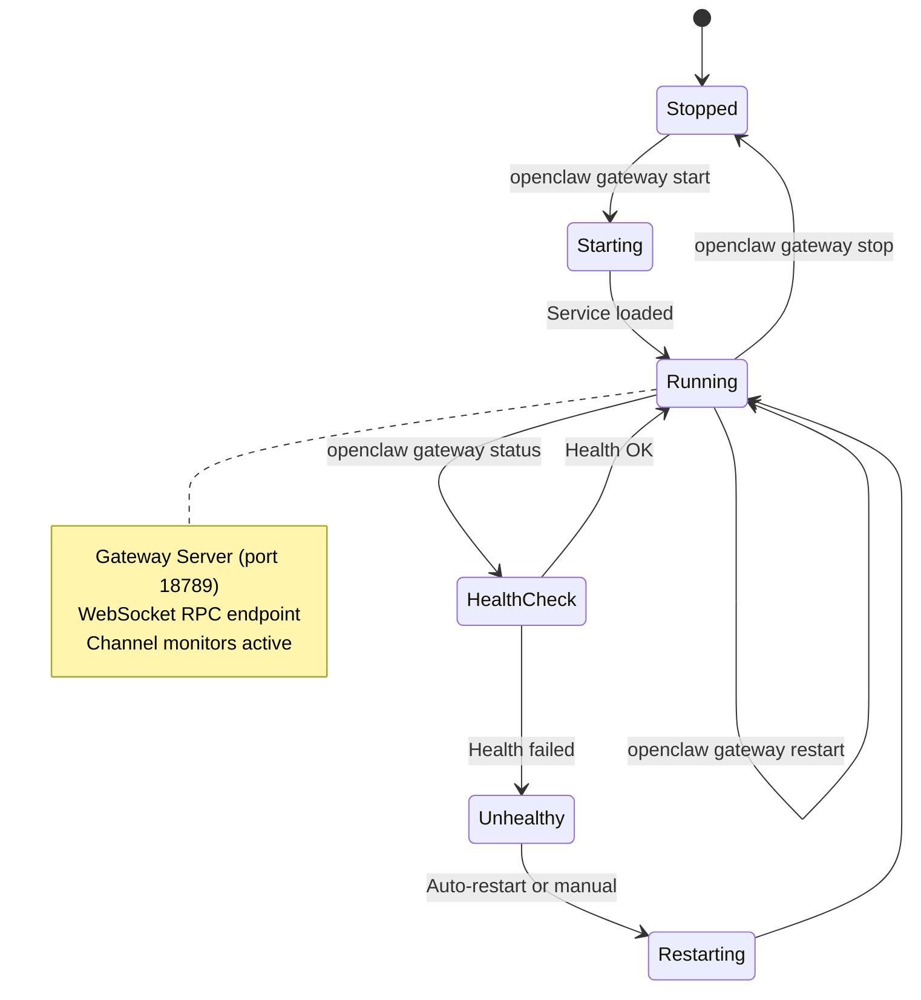
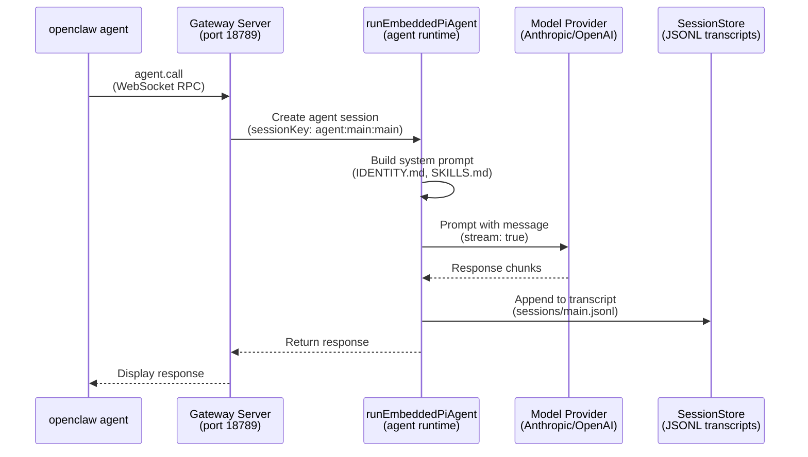
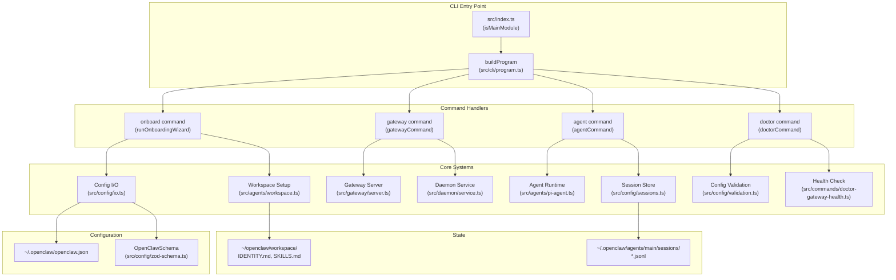

# Page: Quick Start

# Quick Start

<details>
<summary>Relevant source files</summary>

The following files were used as context for generating this wiki page:

- [README.md](README.md)
- [assets/avatar-placeholder.svg](assets/avatar-placeholder.svg)
- [docs/channels/zalo.md](docs/channels/zalo.md)
- [docs/channels/zalouser.md](docs/channels/zalouser.md)
- [docs/gateway/doctor.md](docs/gateway/doctor.md)
- [scripts/clawtributors-map.json](scripts/clawtributors-map.json)
- [scripts/update-clawtributors.ts](scripts/update-clawtributors.ts)
- [scripts/update-clawtributors.types.ts](scripts/update-clawtributors.types.ts)
- [src/agents/bash-tools.test.ts](src/agents/bash-tools.test.ts)
- [src/agents/pi-tools-agent-config.test.ts](src/agents/pi-tools-agent-config.test.ts)
- [src/agents/sandbox-skills.test.ts](src/agents/sandbox-skills.test.ts)
- [src/commands/configure.gateway.test.ts](src/commands/configure.gateway.test.ts)
- [src/commands/configure.gateway.ts](src/commands/configure.gateway.ts)
- [src/commands/configure.ts](src/commands/configure.ts)
- [src/commands/doctor.ts](src/commands/doctor.ts)
- [src/commands/onboard-helpers.test.ts](src/commands/onboard-helpers.test.ts)
- [src/commands/onboard-helpers.ts](src/commands/onboard-helpers.ts)
- [src/commands/onboard-interactive.ts](src/commands/onboard-interactive.ts)
- [src/config/config.ts](src/config/config.ts)
- [src/config/merge-config.ts](src/config/merge-config.ts)
- [src/index.test.ts](src/index.test.ts)
- [src/index.ts](src/index.ts)
- [src/wizard/onboarding.gateway-config.test.ts](src/wizard/onboarding.gateway-config.test.ts)
- [src/wizard/onboarding.gateway-config.ts](src/wizard/onboarding.gateway-config.ts)
- [src/wizard/onboarding.ts](src/wizard/onboarding.ts)
- [src/wizard/onboarding.types.ts](src/wizard/onboarding.types.ts)
- [tsconfig.json](tsconfig.json)
- [ui/src/styles.css](ui/src/styles.css)
- [ui/src/styles/layout.mobile.css](ui/src/styles/layout.mobile.css)

</details>


This page provides the minimal path to install OpenClaw, run the onboarding wizard, and send your first message. For detailed installation options, see [Installation](#2). For comprehensive configuration, see [Configuration System](#4).

---

## Prerequisites

OpenClaw requires **Node.js ≥ 22**. Verify your version:

```bash
node --version
```

Supported platforms: **macOS**, **Linux**, and **Windows (via WSL2)**. Windows native support is limited; WSL2 is strongly recommended.

**Sources:** [README.md:47-48](), [src/infra/runtime-guard.ts]()

---

## Installation

Install OpenClaw globally via npm or pnpm:

```bash
npm install -g openclaw@latest
# or
pnpm add -g openclaw@latest
```

Verify installation:

```bash
openclaw --version
```

**Sources:** [README.md:49-54](), [src/index.ts:1-93]()

---

## Onboarding Wizard

The onboarding wizard guides you through initial setup: authentication, model selection, gateway configuration, and channel setup.

### Run the Wizard

```bash
openclaw onboard --install-daemon
```

The `--install-daemon` flag installs the Gateway as a system service (launchd on macOS, systemd on Linux, schtasks on Windows).

**Sources:** [README.md:53-56](), [src/wizard/onboarding.ts:90-483]()

### Wizard Flow



**Wizard modes:**

| Mode         | Description                                          |
|--------------|------------------------------------------------------|
| `quickstart` | Minimal prompts; uses sensible defaults              |
| `advanced`   | Full control over gateway, channels, and skills      |

Specify mode explicitly:

```bash
openclaw onboard --flow quickstart
openclaw onboard --flow advanced
```

**Sources:** [src/wizard/onboarding.ts:90-483](), [src/wizard/onboarding.types.ts:1-26](), [src/wizard/onboarding.gateway-config.ts:42-286]()

### Configuration Output

The wizard writes `~/.openclaw/openclaw.json` with your settings. Minimal example:

```json5
{
  "agents": {
    "defaults": {
      "workspace": "~/openclaw/workspace",
      "model": "anthropic/claude-opus-4-6"
    }
  },
  "gateway": {
    "mode": "local",
    "port": 18789,
    "bind": "loopback",
    "auth": {
      "mode": "token",
      "token": "<generated-token>"
    }
  }
}
```

**Sources:** [src/wizard/onboarding.ts:355-368](), [src/config/config.ts:1-15](), [README.md:315-324]()

---

## Starting the Gateway

After onboarding, the Gateway is installed as a system service. Start it:

```bash
openclaw gateway start
```

Check status:

```bash
openclaw gateway status
```

Expected output:

```
Gateway: running (PID 12345)
Port: 18789
Bind: loopback (127.0.0.1)
Auth: token
```

For manual startup (foreground, verbose logs):

```bash
openclaw gateway run --verbose
```

**Sources:** [README.md:67](), [src/daemon/service.ts](), [src/cli/program.ts]()

### Gateway Lifecycle



**Sources:** [src/daemon/service.ts](), [src/gateway/server.ts](), [src/commands/gateway-start.ts]()

---

## First Message

Send a message to the agent via the CLI:

```bash
openclaw agent --message "Hello, what can you do?"
```

Or use the `message send` command to deliver via a channel:

```bash
openclaw message send --to +15555550123 --message "Ship checklist"
```

### Message Flow



**Key components:**

- **`openclaw agent`**: CLI command for direct agent interaction ([src/cli/program.ts]())
- **Gateway Server**: WebSocket RPC endpoint at `ws://127.0.0.1:18789` ([src/gateway/server.ts]())
- **`runEmbeddedPiAgent`**: Core agent execution pipeline ([src/agents/pi-agent.ts]())
- **SessionStore**: Persists conversation history to `~/.openclaw/agents/main/sessions/main.jsonl` ([src/config/sessions.ts]())

**Sources:** [README.md:69-74](), [src/agents/pi-agent.ts](), [src/gateway/server.ts](), [src/config/sessions.ts]()

---

## Basic Commands

OpenClaw provides in-chat commands (send via messaging channels) and CLI commands (run in terminal).

### In-Chat Commands

Send these in WhatsApp, Telegram, or any connected channel:

| Command     | Description                               |
|-------------|-------------------------------------------|
| `/status`   | Show session model, token count, and cost |
| `/help`     | List available commands                   |
| `/new`      | Reset session (clear history)             |
| `/compact`  | Compact session (summarize history)       |
| `/verbose`  | Toggle verbose mode                       |

Example:

```
/status
```

Response:

```
Model: anthropic/claude-opus-4-6
Tokens: 1,234 / 200,000
Cost: $0.05
```

**Sources:** [README.md:265-277](), [src/commands/message-commands.ts]()

### CLI Commands

Run these in your terminal:

| Command                          | Description                          |
|----------------------------------|--------------------------------------|
| `openclaw gateway status`        | Check Gateway health                 |
| `openclaw agent --message "..."`  | Send message to agent                |
| `openclaw channels status`       | List active channels                 |
| `openclaw sessions list`         | List active sessions                 |
| `openclaw logs --follow`         | Tail Gateway logs                    |
| `openclaw doctor`                | Run health checks and repairs        |

Example:

```bash
openclaw channels status
```

**Sources:** [src/cli/program.ts](), [README.md:265-277]()

---

## Command Execution Map



**Sources:** [src/index.ts:1-93](), [src/cli/program.ts](), [src/wizard/onboarding.ts:90-483](), [src/commands/gateway-start.ts](), [src/commands/doctor.ts:65-313]()

---

## Next Steps

You now have OpenClaw running with a configured Gateway. Explore these topics next:

- **[Key Concepts](#1.1)**: Understand Agents, Sessions, Channels, and Tools
- **[Gateway Configuration](#3.1)**: Customize port, bind mode, and authentication
- **[Channel Setup](#8)**: Connect WhatsApp, Telegram, Discord, and other channels
- **[Tool System](#6)**: Enable file operations, shell execution, and memory search
- **[Multi-Agent Configuration](#4.3)**: Route channels to isolated agent workspaces

For troubleshooting, run:

```bash
openclaw doctor
```

This checks configuration health, migrates legacy settings, and suggests repairs.

**Sources:** [README.md:410-427](), [docs/gateway/doctor.md:1-283]()

---