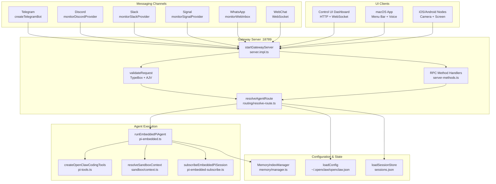
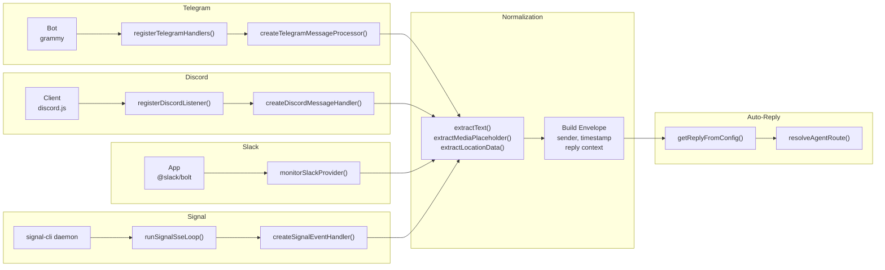
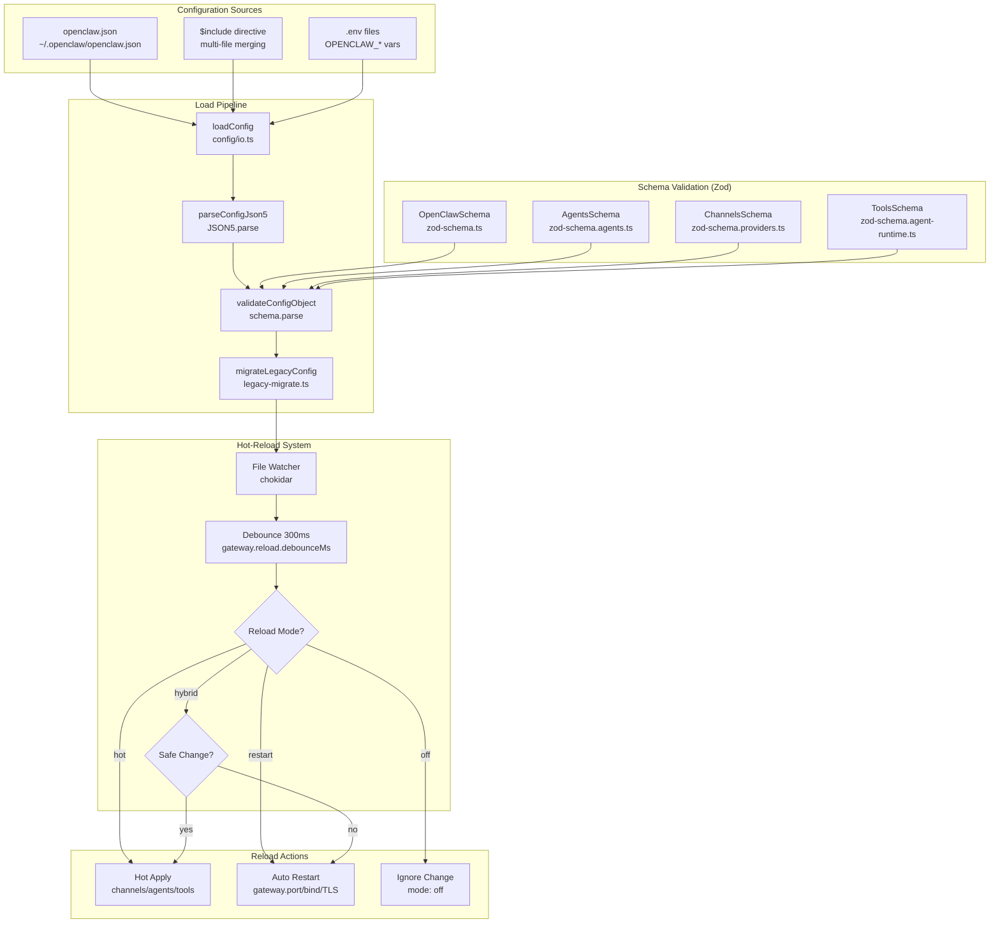
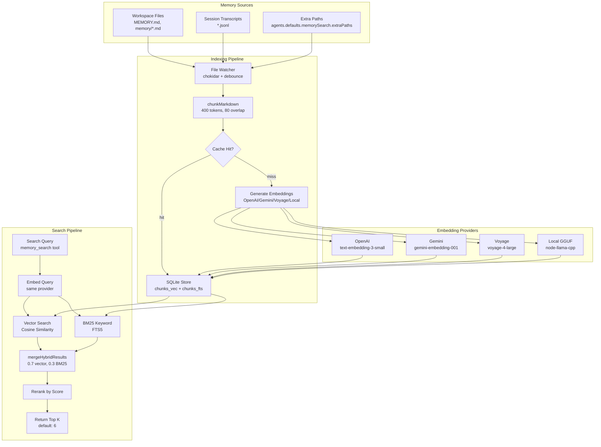
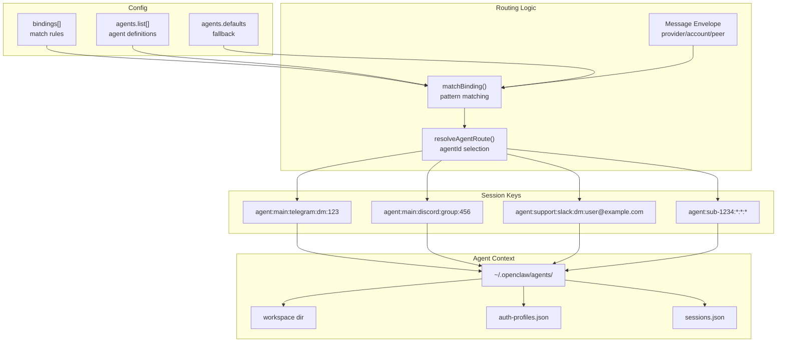

# Page: Architecture Diagrams

# Architecture Diagrams

<details>
<summary>Relevant source files</summary>

The following files were used as context for generating this wiki page:

- [CHANGELOG.md](CHANGELOG.md)
- [README.md](README.md)
- [assets/avatar-placeholder.svg](assets/avatar-placeholder.svg)
- [docs/channels/zalo.md](docs/channels/zalo.md)
- [docs/channels/zalouser.md](docs/channels/zalouser.md)
- [docs/cli/memory.md](docs/cli/memory.md)
- [docs/cli/sandbox.md](docs/cli/sandbox.md)
- [docs/concepts/memory.md](docs/concepts/memory.md)
- [docs/gateway/configuration.md](docs/gateway/configuration.md)
- [docs/gateway/sandbox-vs-tool-policy-vs-elevated.md](docs/gateway/sandbox-vs-tool-policy-vs-elevated.md)
- [docs/gateway/sandboxing.md](docs/gateway/sandboxing.md)
- [docs/platforms/mac/skills.md](docs/platforms/mac/skills.md)
- [docs/tools/elevated.md](docs/tools/elevated.md)
- [docs/tools/index.md](docs/tools/index.md)
- [docs/tools/skills-config.md](docs/tools/skills-config.md)
- [scripts/clawtributors-map.json](scripts/clawtributors-map.json)
- [scripts/update-clawtributors.ts](scripts/update-clawtributors.ts)
- [scripts/update-clawtributors.types.ts](scripts/update-clawtributors.types.ts)
- [src/agents/memory-search.test.ts](src/agents/memory-search.test.ts)
- [src/agents/memory-search.ts](src/agents/memory-search.ts)
- [src/agents/sandbox-explain.test.ts](src/agents/sandbox-explain.test.ts)
- [src/agents/sandbox.ts](src/agents/sandbox.ts)
- [src/cli/memory-cli.test.ts](src/cli/memory-cli.test.ts)
- [src/cli/memory-cli.ts](src/cli/memory-cli.ts)
- [src/cli/models-cli.test.ts](src/cli/models-cli.test.ts)
- [src/commands/agent.test.ts](src/commands/agent.test.ts)
- [src/commands/agent.ts](src/commands/agent.ts)
- [src/config/config.ts](src/config/config.ts)
- [src/config/schema.ts](src/config/schema.ts)
- [src/config/types.tools.ts](src/config/types.tools.ts)
- [src/config/types.ts](src/config/types.ts)
- [src/config/zod-schema.agent-runtime.ts](src/config/zod-schema.agent-runtime.ts)
- [src/config/zod-schema.ts](src/config/zod-schema.ts)
- [src/cron/isolated-agent.ts](src/cron/isolated-agent.ts)
- [src/cron/run-log.test.ts](src/cron/run-log.test.ts)
- [src/cron/run-log.ts](src/cron/run-log.ts)
- [src/cron/store.ts](src/cron/store.ts)
- [src/gateway/protocol/index.ts](src/gateway/protocol/index.ts)
- [src/gateway/protocol/schema.ts](src/gateway/protocol/schema.ts)
- [src/gateway/protocol/schema/agents-models-skills.ts](src/gateway/protocol/schema/agents-models-skills.ts)
- [src/gateway/protocol/schema/protocol-schemas.ts](src/gateway/protocol/schema/protocol-schemas.ts)
- [src/gateway/protocol/schema/types.ts](src/gateway/protocol/schema/types.ts)
- [src/gateway/server-methods-list.ts](src/gateway/server-methods-list.ts)
- [src/gateway/server-methods.ts](src/gateway/server-methods.ts)
- [src/gateway/server-methods/agents.ts](src/gateway/server-methods/agents.ts)
- [src/gateway/server.ts](src/gateway/server.ts)
- [src/index.test.ts](src/index.test.ts)
- [src/index.ts](src/index.ts)
- [src/memory/embeddings.test.ts](src/memory/embeddings.test.ts)
- [src/memory/embeddings.ts](src/memory/embeddings.ts)
- [src/memory/manager.ts](src/memory/manager.ts)
- [tsconfig.json](tsconfig.json)
- [ui/src/styles.css](ui/src/styles.css)
- [ui/src/styles/layout.mobile.css](ui/src/styles/layout.mobile.css)

</details>


OpenClaw implements a hub-and-spoke architecture with the Gateway ([src/gateway/server.impl.ts]()) as the central control plane. This page presents system diagrams that map architectural concepts to concrete code entities—function names, class names, and file paths—enabling readers to navigate from high-level design to implementation.

The Gateway coordinates all messaging channels, agent execution, configuration management, and client connections through a unified WebSocket/HTTP protocol ([src/gateway/protocol/index.ts]()). Configuration is validated via Zod schemas ([src/config/zod-schema.ts]()), and agents execute in isolated sessions with optional Docker sandboxing ([src/agents/sandbox.ts]()).

**Navigation:**
- Configuration: See [Configuration](#4.1)
- Agent runtime: See [Agent Execution Flow](#5.1)
- Security model: See [Security](#14)
- Memory system: See [Memory System](#7)

---

## System Topology: Hub-and-Spoke Architecture

**Gateway as Control Plane**

The Gateway ([src/gateway/server.impl.ts]()) serves as the central control plane, binding to `ws://127.0.0.1:18789` by default. All messaging channels, UI clients (WebChat, macOS app, Control UI), and device nodes connect through this single WebSocket/HTTP server. The Gateway validates all requests via `TypeBox` schemas ([src/gateway/protocol/schema.ts]()), routes messages to agent sessions ([src/routing/resolve-route.ts]()), and broadcasts events to subscribed clients.



**Sources:** [src/gateway/server.impl.ts:1-50](), [src/gateway/protocol/index.ts:1-200](), [src/gateway/server-methods.ts:1-50](), [src/routing/resolve-route.ts:1-100](), [src/agents/pi-embedded.ts:1-50](), [src/agents/pi-tools.ts:166-271](), [src/agents/sandbox/context.ts:1-50](), [src/config/config.ts:1-20](), [src/config/sessions.ts:1-50](), [src/memory/manager.ts:1-100]()

---

## Channel Integration: Message Normalization Pipeline

Each channel implements a monitor pattern that normalizes inbound messages into a common envelope format before routing to the Gateway.



**Sources:** [src/telegram/bot.ts:112-150](), [src/telegram/bot-handlers.ts](), [src/telegram/bot-message.ts](), [src/discord/monitor.ts:22](), [src/discord/monitor/listeners.ts](), [src/discord/monitor/message-handler.ts](), [src/slack/monitor.ts:3](), [src/slack/monitor/provider.ts](), [src/signal/monitor.ts:58-70](), [src/signal/sse-reconnect.ts](), [src/signal/monitor/event-handler.ts](), [src/web/inbound.ts:2-3](), [src/web/inbound/extract.ts](), [src/auto-reply/reply.ts](), [src/routing/resolve-route.ts]()

---

## Agent Execution Pipeline with Tool Policy Resolution

**Execution Phases: Prompt Assembly → Model Call → Tool Execution → Streaming**

The agent pipeline ([src/agents/pi-embedded.ts]()) orchestrates prompt assembly, model API calls, tool execution, and response streaming. Tool policy resolution applies a cascading filter chain (global → provider → agent → group → sandbox) where each stage can only restrict tools, never expand. Sandboxed sessions run tools in Docker; trusted sessions execute on the host.

```mermaid
graph TB
    subgraph Inbound["Inbound Message"]
        Msg[Message Envelope<br/>channel/account/peer]
        Access[Access Control<br/>DM pairing/allowlist]
        Session[resolveAgentRoute<br/>agent:ID:channel:peer]
    end
    
    subgraph ContextAssembly["Context Assembly"]
        LoadAgent[resolveAgentConfig<br/>agent-scope.ts]
        BuildPrompt[createSystemPromptOverride<br/>system-prompt.ts]
        LoadHistory[loadSessionMessages<br/>limitHistoryTurns]
        LoadSkills[buildWorkspaceSkillSnapshot<br/>skills.ts]
    end
    
    subgraph ToolPolicy["Tool Policy Chain"]
        Global[tools.allow/deny<br/>tools.profile]
        Provider[tools.byProvider<br/>per-provider restrict]
        Agent[agents.list[].tools]
        Group[group.toolPolicy]
        SandboxPolicy[sandbox.tools<br/>deny wins]
        FinalTools[Final Tool Set]
    end
    
    subgraph Execution["Agent Execution"]
        Runner[runEmbeddedPiAgent<br/>pi-embedded.ts]
        Auth[resolveAuthProfile<br/>model-auth.ts]
        Model[Model API Call<br/>pi-ai SDK]
        ToolExec[Tool Execution<br/>exec/read/write]
    end
    
    subgraph Sandbox["Sandbox System"]
        CheckSandbox{Sandboxed?}
        DockerExec[Docker Container<br/>sandbox/docker.ts]
        HostExec[Host Execution<br/>full workspace]
    end
    
    subgraph Streaming["Response Streaming"]
        Subscribe[subscribeEmbeddedPiSession<br/>pi-embedded-subscribe.ts]
        Chunker[EmbeddedBlockChunker<br/>block-chunker.ts]
        Stream[Channel Send<br/>onBlockReply]
    end
    
    Msg --> Access
    Access --> Session
    Session --> LoadAgent
    LoadAgent --> BuildPrompt
    LoadAgent --> LoadHistory
    LoadAgent --> LoadSkills
    
    Global --> Provider
    Provider --> Agent
    Agent --> Group
    Group --> SandboxPolicy
    SandboxPolicy --> FinalTools
    
    BuildPrompt --> Runner
    LoadHistory --> Runner
    LoadSkills --> Runner
    FinalTools --> Runner
    
    Runner --> Auth
    Auth --> Model
    Model --> ToolExec
    
    ToolExec --> CheckSandbox
    CheckSandbox -->|yes| DockerExec
    CheckSandbox -->|no| HostExec
    DockerExec --> Model
    HostExec --> Model
    
    Runner --> Subscribe
    Subscribe --> Chunker
    Chunker --> Stream
```

**Sources:** [src/agents/pi-embedded.ts:1-50](), [src/agents/pi-embedded-runner/run.ts:1-200](), [src/agents/pi-embedded-runner/system-prompt.ts:1-100](), [src/agents/skills.ts:1-50](), [src/agents/pi-tools.policy.ts:28-54](), [src/agents/tool-policy.ts:47-100](), [src/agents/sandbox/context.ts:1-50](), [src/agents/sandbox/docker.ts:1-100](), [src/agents/pi-embedded-subscribe.ts:30-100](), [src/agents/pi-embedded-block-chunker.ts:1-50]()

---

## Tool System and Sandbox Isolation

**Tool Policy Resolution: Cascading Deny-Wins Filter**

The tool system ([src/agents/pi-tools.ts:166-271]()) provides core tools (`exec`, `read`, `write`, `edit`, `process`, `bash`, `memory_search`, etc.) and applies a cascading policy filter where deny always wins. Policy stages: global (`tools.allow`/`tools.deny`) → provider-specific (`tools.byProvider`) → agent-specific (`agents.list[].tools`) → group policy → sandbox policy. Each stage can only restrict, never expand, the tool set.

**Sandbox Modes:**
- `off`: All tools run on host
- `non-main`: Non-main sessions (groups) run in Docker
- `all`: All sessions sandboxed

**Sandbox Scopes:**
- `session`: One container per session
- `agent`: One container per agent
- `shared`: Single shared container

```mermaid
graph TB
    subgraph ToolCreation["Tool Registry"]
        Create[createOpenClawCodingTools<br/>pi-tools.ts]
        Exec[createExecTool<br/>bash-tools.exec.ts]
        Process[createProcessTool<br/>bash-tools.process.ts]
        Read[createReadTool<br/>pi-tools.ts]
        Write[createWriteTool<br/>pi-tools.ts]
        Memory[memory_search<br/>memory-tools.ts]
    end
    
    subgraph PolicyLayers["Policy Layers (Deny Wins)"]
        Profile[tools.profile<br/>minimal/coding/messaging]
        Global[tools.allow/deny<br/>global config]
        Provider[tools.byProvider<br/>per-provider restrict]
        Agent[agents.list[].tools]
        Group[group.toolPolicy]
        SandboxPol[sandbox.tools]
    end
    
    subgraph Resolution["Policy Resolution"]
        Resolve[resolveEffectiveToolPolicy<br/>tool-policy.ts]
        Filter[filterToolsByPolicy<br/>pi-tools.policy.ts]
        Check[isToolAllowedByPolicies]
        Final[Final Tool Set]
    end
    
    subgraph SandboxSystem["Sandbox System"]
        Config[resolveSandboxConfigForAgent<br/>sandbox/config.ts]
        Context[resolveSandboxContext<br/>sandbox/context.ts]
        Docker[buildSandboxCreateArgs<br/>sandbox/docker.ts]
        Container[Docker Container<br/>per-session/agent/shared]
        Workspace[Workspace Access<br/>none/ro/rw]
    end
    
    Create --> Exec
    Create --> Process
    Create --> Read
    Create --> Write
    Create --> Memory
    
    Profile --> Resolve
    Global --> Resolve
    Provider --> Resolve
    Agent --> Resolve
    Group --> Resolve
    SandboxPol --> Resolve
    
    Resolve --> Filter
    Filter --> Check
    Check --> Final
    
    Config --> Context
    Context --> Docker
    Context --> Workspace
    Docker --> Container
    
    Final --> Exec
    Final --> Process
    Context --> Exec
    Context --> Process
```

**Sources:** [src/agents/pi-tools.ts:166-271](), [src/agents/bash-tools.ts:6-9](), [src/agents/bash-tools.exec.ts:1-100](), [src/agents/bash-tools.process.ts:1-100](), [src/agents/pi-tools.policy.ts:28-54](), [src/agents/tool-policy.ts:47-100](), [src/agents/sandbox.ts:1-45](), [src/agents/sandbox/config.ts:1-100](), [src/agents/sandbox/context.ts:1-100](), [src/agents/sandbox/docker.ts:1-100](), [src/config/types.tools.ts:1-200](), [docs/gateway/sandboxing.md:1-60]()

---

## Configuration Lifecycle and Hot-Reload

**Strict Validation + Hot-Reload**

OpenClaw enforces strict configuration validation via Zod schemas ([src/config/zod-schema.ts]()). Invalid configs prevent Gateway startup. The Gateway watches `~/.openclaw/openclaw.json` and applies changes automatically via three reload modes: `hybrid` (default), `hot`, and `restart`. Safe changes (channels, agents, tools) hot-apply without restart; infrastructure changes (port, bind, TLS) trigger auto-restart in `hybrid` mode.



**Sources:** [src/config/config.ts:1-15](), [src/config/io.ts:1-100](), [src/config/zod-schema.ts:95-632](), [src/config/validation.ts:1-50](), [src/config/legacy-migrate.ts:1-50](), [src/gateway/reload.ts:1-100](), [docs/gateway/configuration.md:327-366]()

---

## Security Model: DM Pairing, Sandboxing, and Credential Isolation

**Defense-in-Depth Layers**

OpenClaw implements layered security: DM pairing ([src/pairing/pairing-store.ts]()), optional Docker sandboxing ([src/agents/sandbox.ts]()), tool policy enforcement ([src/agents/tool-policy.ts]()), exec approvals ([src/config/types.approvals.ts]()), and per-agent credential isolation ([src/agents/auth-profiles.ts]()). Main sessions (1:1 DMs) execute on host by default; group sessions can be sandboxed via `sandbox.mode: "non-main"`.

**DM Pairing Flow:**
1. Unknown sender DMs bot
2. Gateway calls `upsertChannelPairingRequest()` ([src/pairing/pairing-request.ts]())
3. Bot sends pairing code
4. Operator runs `openclaw pairing approve <channel> <code>`
5. Sender added to `<channel>-allowFrom.json` ([src/pairing/pairing-store.ts]())

```mermaid
graph TB
    subgraph ChannelAccess["Channel Access Control"]
        DM[dmPolicy<br/>pairing/allowlist/open]
        Pairing[upsertChannelPairingRequest<br/>pairing-request.ts]
        AllowFrom[readChannelAllowFromStore<br/>pairing-store.ts]
        Approve[openclaw pairing approve]
    end
    
    subgraph SessionTypes["Session Isolation"]
        Main[Main Session<br/>agent:main:channel:dm:peer]
        Group[Group Session<br/>agent:main:channel:group:id]
        Subagent[Subagent Session<br/>agent:sub-*:*:*:*]
    end
    
    subgraph SandboxModes["Sandbox Modes"]
        Mode[sandbox.mode<br/>off/non-main/all]
        Scope[sandbox.scope<br/>session/agent/shared]
        Container[Docker Container<br/>isolated execution]
        WorkspaceAccess[workspace access<br/>none/ro/rw]
    end
    
    subgraph ToolSecurity["Tool Security"]
        Policy[Tool Policy Chain<br/>tool-policy.ts]
        Elevated[Elevated Mode<br/>/elevated on|full]
        Approval[Exec Approval<br/>approvals.exec]
    end
    
    subgraph CredentialIsolation["Credential Isolation"]
        AgentDir[~/.openclaw/agents/<agentId>]
        AuthProfiles[auth-profiles.json<br/>OAuth/API keys]
        Rotation[Profile Rotation<br/>cooldown tracking]
    end
    
    DM --> Pairing
    Pairing --> Approve
    Approve --> AllowFrom
    AllowFrom --> Main
    AllowFrom --> Group
    
    Main --> Mode
    Group --> Mode
    Subagent --> Mode
    
    Mode --> Scope
    Scope --> Container
    Container --> WorkspaceAccess
    
    Policy --> Elevated
    Elevated --> Approval
    
    Main --> AgentDir
    Group --> AgentDir
    AgentDir --> AuthProfiles
    AuthProfiles --> Rotation
```

**Sources:** [src/pairing/pairing-store.ts:1-100](), [src/pairing/pairing-request.ts:1-50](), [src/config/types.channels.ts:1-100](), [src/agents/sandbox.ts:1-45](), [src/agents/sandbox/config.ts:1-100](), [src/agents/tool-policy.ts:1-100](), [src/config/types.approvals.ts:1-50](), [src/agents/auth-profiles.ts:1-100](), [docs/gateway/sandboxing.md:1-60](), [docs/gateway/sandbox-vs-tool-policy-vs-elevated.md:1-50]()

---

## Memory System: Hybrid Vector + BM25 Search

**SQLite-based Index with Hybrid Retrieval**

The memory system ([src/memory/manager.ts]()) maintains a SQLite index ([src/memory/memory-schema.ts]()) over workspace Markdown files (`MEMORY.md`, `memory/*.md`) and optional session transcripts. Embeddings are generated via OpenAI, Gemini, Voyage, or local models ([src/memory/embeddings.ts]()). Search combines vector similarity (cosine) with BM25 keyword matching ([src/memory/hybrid.ts]()), weighted 70/30 by default.

**Indexing Pipeline:**
1. File watcher detects changes ([src/memory/manager.ts:ensureWatcher]())
2. Files chunked into ~400-token segments with 80-token overlap ([src/memory/internal.ts:chunkMarkdown]())
3. Embeddings cached by content hash ([src/memory/manager.ts:EMBEDDING_CACHE_TABLE]())
4. Stored in `chunks_vec` (vector) and `chunks_fts` (full-text) tables

**Search Pipeline:**
1. Query embedded ([src/memory/manager.ts:embedQueryWithTimeout]())
2. Vector search via cosine distance ([src/memory/manager-search.ts:searchVector]())
3. BM25 keyword search ([src/memory/manager-search.ts:searchKeyword]())
4. Results merged and reranked ([src/memory/hybrid.ts:mergeHybridResults]())



**Sources:** [src/memory/manager.ts:1-1000](), [src/memory/memory-schema.ts:1-100](), [src/memory/embeddings.ts:1-200](), [src/memory/embeddings-openai.ts:1-100](), [src/memory/embeddings-gemini.ts:1-100](), [src/memory/embeddings-voyage.ts:1-100](), [src/memory/internal.ts:200-300](), [src/memory/manager-search.ts:1-100](), [src/memory/hybrid.ts:1-100](), [docs/concepts/memory.md:79-230]()

---

## Multi-Agent Routing: Bindings and Session Resolution

OpenClaw supports multiple agents with channel/account/peer-based routing rules via the `bindings` configuration.



**Sources:** [src/routing/resolve-route.ts](), [src/routing/session-key.ts](), [src/config/types.agents.ts](), [src/config/sessions.ts](), [docs/gateway/configuration.md:425-480](), [docs/multi-agent-sandbox-tools.md:1-40]()

---