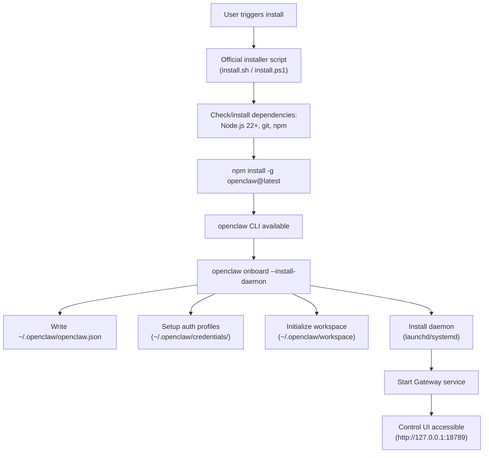
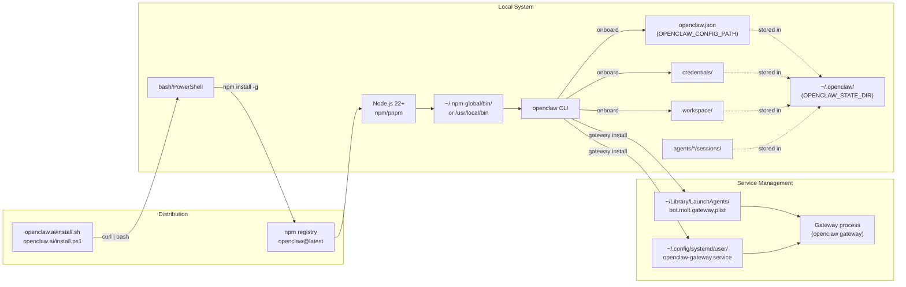
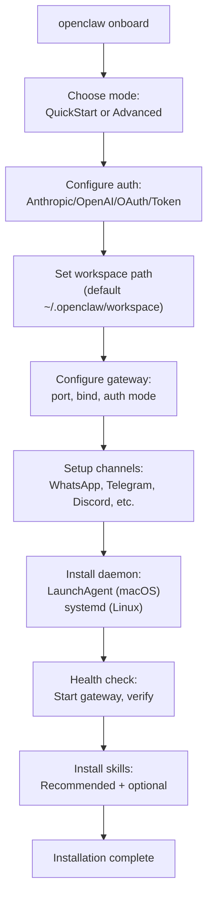

# Page: Installation

# Installation

<details>
<summary>Relevant source files</summary>

The following files were used as context for generating this wiki page:

- [README.md](README.md)
- [assets/avatar-placeholder.svg](assets/avatar-placeholder.svg)
- [docs/channels/zalo.md](docs/channels/zalo.md)
- [docs/channels/zalouser.md](docs/channels/zalouser.md)
- [docs/gateway/doctor.md](docs/gateway/doctor.md)
- [scripts/clawtributors-map.json](scripts/clawtributors-map.json)
- [scripts/update-clawtributors.ts](scripts/update-clawtributors.ts)
- [scripts/update-clawtributors.types.ts](scripts/update-clawtributors.types.ts)
- [src/agents/bash-tools.test.ts](src/agents/bash-tools.test.ts)
- [src/agents/pi-tools-agent-config.test.ts](src/agents/pi-tools-agent-config.test.ts)
- [src/agents/sandbox-skills.test.ts](src/agents/sandbox-skills.test.ts)
- [src/commands/configure.gateway.test.ts](src/commands/configure.gateway.test.ts)
- [src/commands/configure.gateway.ts](src/commands/configure.gateway.ts)
- [src/commands/configure.ts](src/commands/configure.ts)
- [src/commands/doctor.ts](src/commands/doctor.ts)
- [src/commands/onboard-helpers.test.ts](src/commands/onboard-helpers.test.ts)
- [src/commands/onboard-helpers.ts](src/commands/onboard-helpers.ts)
- [src/commands/onboard-interactive.ts](src/commands/onboard-interactive.ts)
- [src/config/config.ts](src/config/config.ts)
- [src/config/merge-config.ts](src/config/merge-config.ts)
- [src/index.test.ts](src/index.test.ts)
- [src/index.ts](src/index.ts)
- [src/wizard/onboarding.gateway-config.test.ts](src/wizard/onboarding.gateway-config.test.ts)
- [src/wizard/onboarding.gateway-config.ts](src/wizard/onboarding.gateway-config.ts)
- [src/wizard/onboarding.ts](src/wizard/onboarding.ts)
- [src/wizard/onboarding.types.ts](src/wizard/onboarding.types.ts)
- [tsconfig.json](tsconfig.json)
- [ui/src/styles.css](ui/src/styles.css)
- [ui/src/styles/layout.mobile.css](ui/src/styles/layout.mobile.css)

</details>


This document covers the installation methods, system requirements, and initial setup flow for OpenClaw across different platforms. For detailed configuration after installation, see [Configuration System](#4). For platform-specific details, see [System Requirements](#2.1) and [Installation Methods](#2.2).

## Purpose and Scope

This page introduces the available installation approaches and the overall installation architecture. Detailed instructions for each method, system requirements, and the onboarding wizard are covered in the child pages:

- [System Requirements](#2.1) - Node.js versions, OS support, hardware recommendations
- [Installation Methods](#2.2) - Official installer, npm/pnpm, Docker, source builds
- [Onboarding Wizard](#2.3) - Interactive setup for auth, workspace, gateway, channels
- [macOS App Installation](#2.4) - Native app bundle and permissions

## Installation Overview

OpenClaw installation follows this sequence:

1. **Prerequisites** - Node.js 22+, package manager
2. **Install** - Official installer script or npm global install
3. **Onboarding** - Interactive wizard configures auth, gateway, workspace
4. **Service setup** - Daemon installed (optional) via LaunchAgent (macOS) or systemd (Linux)
5. **Verification** - Gateway starts, Control UI accessible

The official installer handles dependency installation (Node.js, git) if missing and defaults to npm global install.

### Installation Flow



**Sources:** docs/start/getting-started.md:29-72, docs/start/wizard.md:61-71, scripts/docker/install-sh-smoke/run.sh:3-52

### Installer Architecture



**Sources:** docs/start/getting-started.md:31-44, docs/gateway/index.md:200-243, scripts/docker/install-sh-smoke/run.sh:1-52, AGENTS.md:13-13

## Installation Methods Summary

| Method | Use Case | Command |
|--------|----------|---------|
| **Official Installer** | Recommended for most users | `curl -fsSL https://openclaw.ai/install.sh \| bash` (macOS/Linux)<br/>`iwr -useb https://openclaw.ai/install.ps1 \| iex` (Windows) |
| **npm Global** | Manual install or CI/CD | `npm install -g openclaw@latest` |
| **pnpm Global** | Alternative package manager | `pnpm add -g openclaw@latest` |
| **Docker** | Containerized deployment | See [Docker](#2.2) |
| **macOS App** | Native UI with bundled gateway | Download from releases, see [macOS App](#2.4) |
| **Source Build** | Development or custom builds | `git clone && pnpm install && pnpm build` |

The official installer automatically handles dependency installation (Node.js, git) on supported platforms. Manual npm/pnpm install requires Node.js 22+ pre-installed.

**Sources:** docs/index.md:31-44, docs/start/getting-started.md:31-44, AGENTS.md:13-13

## Quick Start Examples

### macOS / Linux

```bash
# Install via official installer
curl -fsSL https://openclaw.ai/install.sh | bash

# Run onboarding wizard
openclaw onboard --install-daemon

# Check gateway status
openclaw gateway status

# Open Control UI
openclaw dashboard
```

### Windows (PowerShell)

```powershell
# Install via official installer
iwr -useb https://openclaw.ai/install.ps1 | iex

# Run onboarding wizard
openclaw onboard --install-daemon

# Check gateway status
openclaw gateway status
```

### Manual npm Install

```bash
# Requires Node.js 22+ already installed
npm install -g openclaw@latest

# Verify installation
openclaw --version

# Run onboarding
openclaw onboard
```

**Sources:** docs/index.md:100-115, docs/start/getting-started.md:31-72

## Directory Structure After Installation

```
~/.openclaw/                          # State directory (OPENCLAW_STATE_DIR)
├── openclaw.json                     # Main configuration (OPENCLAW_CONFIG_PATH)
├── credentials/                      # Auth profiles (encrypted)
│   └── profiles.json                 # Auth profile store
├── workspace/                        # Default agent workspace
│   ├── AGENTS.md                     # Agent identity
│   ├── IDENTITY.md                   # User identity
│   ├── USER.md                       # User context
│   ├── SOUL.md                       # Agent personality
│   ├── TOOLS.md                      # Tool documentation
│   ├── MEMORY.md                     # Memory index
│   └── memory/                       # Memory documents
├── agents/                           # Per-agent state
│   └── main/                         # Main agent
│       └── sessions/                 # Session transcripts (*.jsonl)
└── logs/                             # Log files (if file logging enabled)
```

On macOS, the LaunchAgent plist is written to `~/Library/LaunchAgents/bot.molt.gateway.plist`. On Linux, the systemd unit is written to `~/.config/systemd/user/openclaw-gateway.service`.

**Sources:** docs/start/wizard.md:66-67, docs/gateway/index.md:200-298, AGENTS.md:122-122

## Onboarding Flow

After installation, the onboarding wizard (`openclaw onboard`) configures the system:



**QuickStart mode** uses sensible defaults:
- Local gateway (loopback bind)
- Port 18789
- Token auth (auto-generated)
- Tailscale off
- Allowlist DM policy for Telegram/WhatsApp

**Advanced mode** prompts for every option.

**Sources:** docs/start/wizard.md:42-71, scripts/docker/install-sh-e2e/run.sh:340-378

## Post-Installation Verification

```bash
# Check CLI version
openclaw --version

# Check gateway status
openclaw gateway status

# View configuration
openclaw status

# Check model auth
openclaw models status

# Open Control UI
openclaw dashboard
```

The Control UI should be accessible at `http://127.0.0.1:18789/` if the gateway is running locally.

**Sources:** docs/start/getting-started.md:59-72, docs/gateway/troubleshooting.md:18-29

## Installation Testing

The CI pipeline includes comprehensive installer tests:

```mermaid
graph TB
    subgraph "Smoke Tests"
        SmokeBuild["Build Docker image<br/>(node:22-bookworm-slim)"]
        SmokeRoot["Run as root:<br/>install.sh -> npm -g"]
        SmokeVerify["Verify openclaw --version"]
        SmokeNonroot["Run as non-root:<br/>~/.npm-global prefix"]
        SmokeCLI["Test CLI installer:<br/>install-cli.sh"]
    end
    
    subgraph "E2E Tests"
        E2EBuild["Build Docker image"]
        E2EPreinstall["Pre-install previous version"]
        E2EInstall["Run installer (upgrade path)"]
        E2EOnboard["openclaw onboard --non-interactive"]
        E2EModels["Configure OpenAI/Anthropic"]
        E2EAgent["Run agent turns:<br/>exec tool, write tool"]
        E2EVerify["Verify session transcripts"]
    end
    
    SmokeBuild --> SmokeRoot
    SmokeRoot --> SmokeVerify
    SmokeVerify --> SmokeNonroot
    SmokeNonroot --> SmokeCLI
    
    E2EBuild --> E2EPreinstall
    E2EPreinstall --> E2EInstall
    E2EInstall --> E2EOnboard
    E2EOnboard --> E2EModels
    E2EModels --> E2EAgent
    E2EAgent --> E2EVerify
```



Smoke tests verify basic install/upgrade flow. E2E tests validate full onboarding and agent execution with real model providers.

**Sources:** .github/workflows/install-smoke.yml:1-42, scripts/test-install-sh-docker.sh:1-71, scripts/docker/install-sh-e2e/run.sh:1-100

## System Requirements

OpenClaw requires:

- **Node.js**: 22 or newer (verified in CI via [.github/workflows/ci.yml:32]())
- **Package Manager**: npm (bundled with Node) or pnpm 10.23.0+
- **Operating System**: macOS, Linux, Windows (WSL2 recommended)
- **Network**: Internet access for model APIs and installer downloads
- **Storage**: ~500MB for installation, additional for sessions/memory

For detailed requirements and platform-specific notes, see [System Requirements](#2.1).

**Sources:** .github/workflows/ci.yml:29-40, docs/start/wizard.md:17-23, AGENTS.md:52-52

## Troubleshooting Common Install Issues

| Issue | Cause | Fix |
|-------|-------|-----|
| `openclaw: command not found` | CLI not on PATH | Add npm global bin to PATH: `export PATH="$HOME/.npm-global/bin:$PATH"` (Linux) or restart shell (macOS) |
| `npm ERR! code EACCES` | Permission denied (global install) | Use official installer (auto-configures npm prefix) or `npm config set prefix ~/.npm-global` |
| `Node version mismatch` | Node < 22 | Install Node 22+ via nvm, volta, or system package manager |
| `Git not found` | Git missing (required for install) | Official installer auto-installs git; manual: `apt install git` / `brew install git` |
| Gateway won't start | Config invalid or port busy | Run `openclaw doctor` to repair config; check port with `lsof -i :18789` |

For comprehensive troubleshooting, see [Gateway Troubleshooting](#14.3).

**Sources:** docs/gateway/troubleshooting.md:1-665, scripts/docker/install-sh-nonroot/run.sh:8-51

## Related Documentation

- [Installation Methods](#2.2) - Detailed instructions for each install method
- [Onboarding Wizard](#2.3) - Interactive setup walkthrough
- [macOS App Installation](#2.4) - Native app setup and permissions
- [Configuration System](#4) - Post-install configuration reference
- [Gateway Service Management](#12.1) - Service lifecycle commands
- [Gateway Troubleshooting](#14.3) - Common runtime issues

**Sources:** docs/docs.json:798-835

---