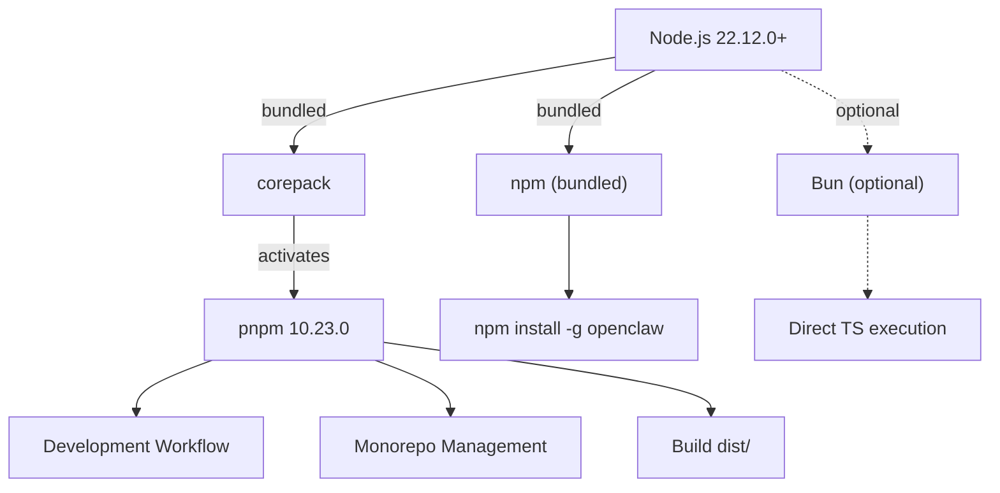
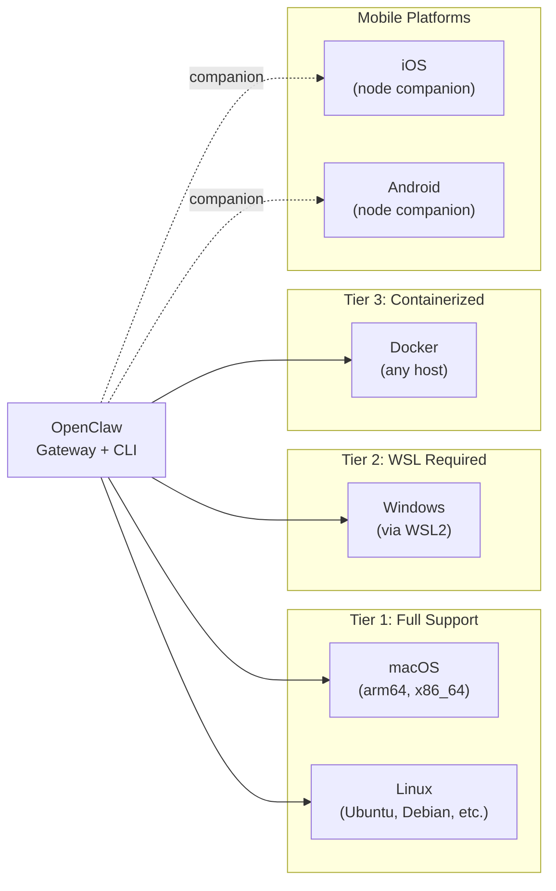
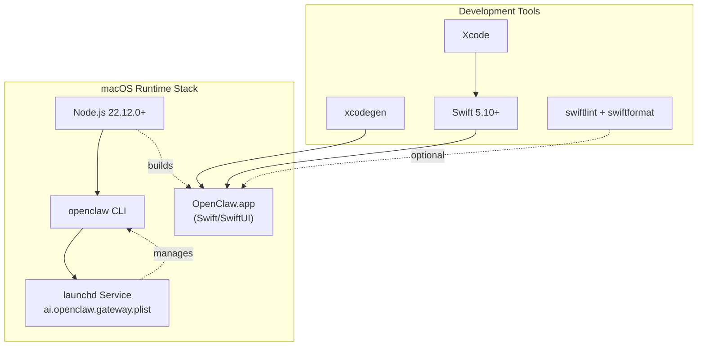
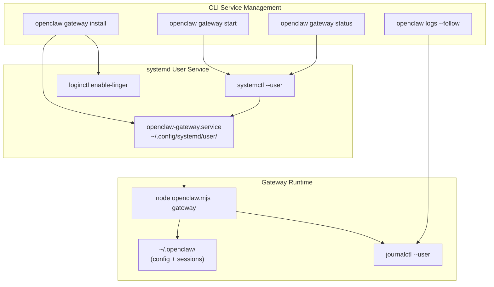
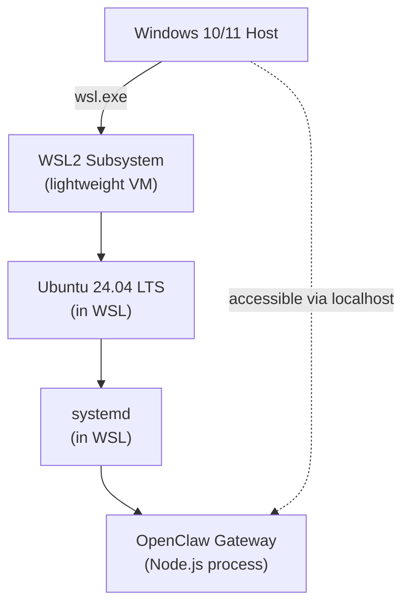
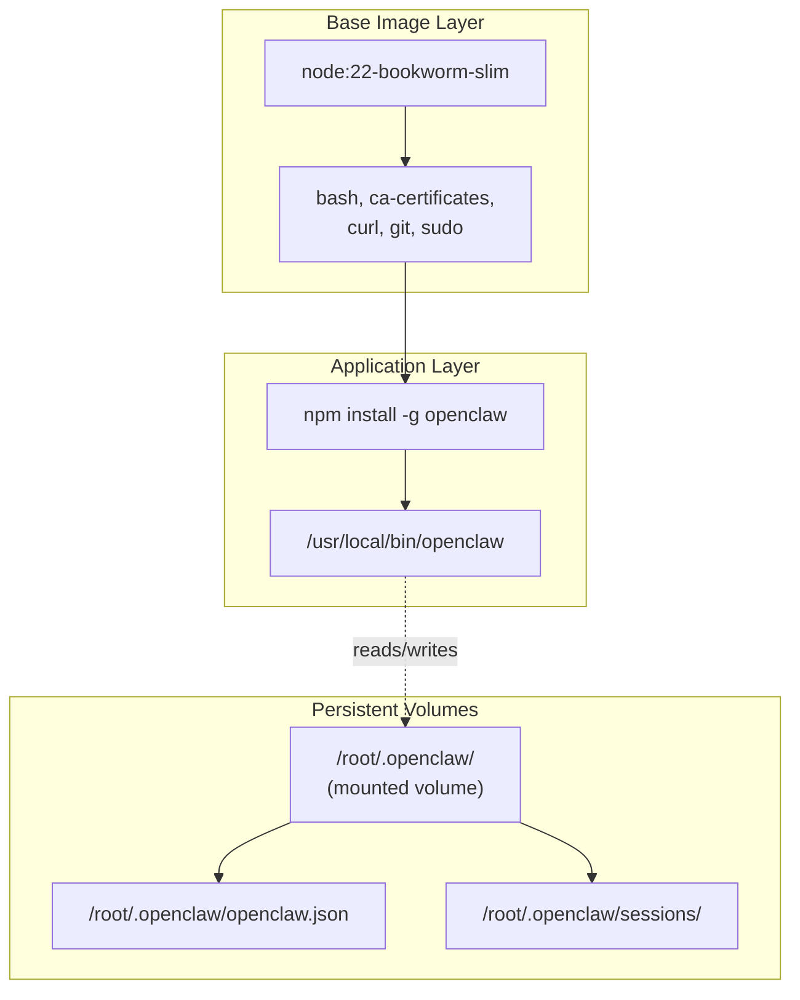
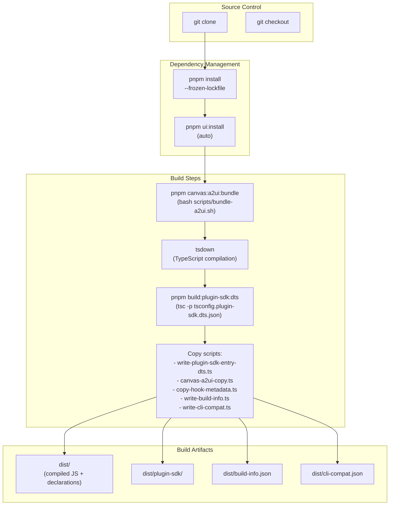
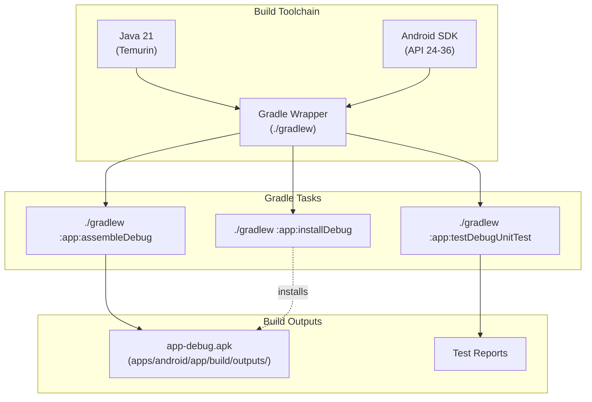
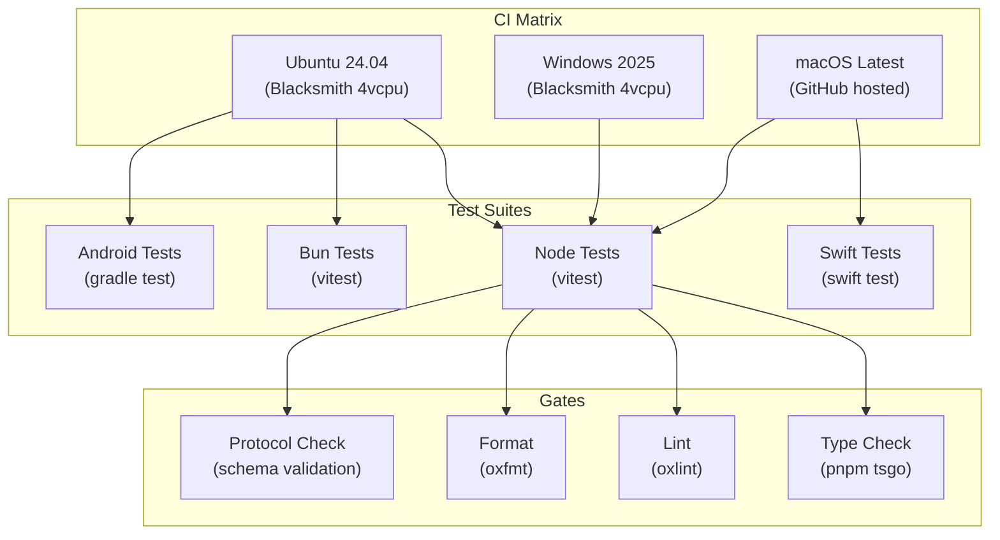
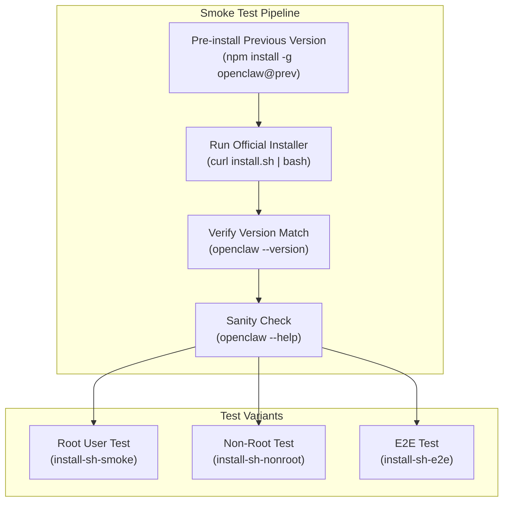

# Page: System Requirements

# System Requirements

<details>
<summary>Relevant source files</summary>

The following files were used as context for generating this wiki page:

- [README.md](README.md)
- [assets/avatar-placeholder.svg](assets/avatar-placeholder.svg)
- [docs/channels/zalo.md](docs/channels/zalo.md)
- [docs/channels/zalouser.md](docs/channels/zalouser.md)
- [extensions/copilot-proxy/package.json](extensions/copilot-proxy/package.json)
- [extensions/google-antigravity-auth/package.json](extensions/google-antigravity-auth/package.json)
- [extensions/google-gemini-cli-auth/package.json](extensions/google-gemini-cli-auth/package.json)
- [extensions/matrix/CHANGELOG.md](extensions/matrix/CHANGELOG.md)
- [extensions/matrix/package.json](extensions/matrix/package.json)
- [extensions/memory-lancedb/package.json](extensions/memory-lancedb/package.json)
- [extensions/msteams/CHANGELOG.md](extensions/msteams/CHANGELOG.md)
- [extensions/msteams/package.json](extensions/msteams/package.json)
- [extensions/voice-call/CHANGELOG.md](extensions/voice-call/CHANGELOG.md)
- [extensions/voice-call/package.json](extensions/voice-call/package.json)
- [extensions/zalo/CHANGELOG.md](extensions/zalo/CHANGELOG.md)
- [extensions/zalo/package.json](extensions/zalo/package.json)
- [extensions/zalouser/package.json](extensions/zalouser/package.json)
- [package.json](package.json)
- [pnpm-lock.yaml](pnpm-lock.yaml)
- [scripts/clawtributors-map.json](scripts/clawtributors-map.json)
- [scripts/update-clawtributors.ts](scripts/update-clawtributors.ts)
- [scripts/update-clawtributors.types.ts](scripts/update-clawtributors.types.ts)
- [src/config/config.ts](src/config/config.ts)
- [src/index.test.ts](src/index.test.ts)
- [src/index.ts](src/index.ts)
- [tsconfig.json](tsconfig.json)
- [ui/src/styles.css](ui/src/styles.css)
- [ui/src/styles/layout.mobile.css](ui/src/styles/layout.mobile.css)

</details>


This document specifies the software and hardware requirements for running and developing OpenClaw. For installation instructions, see [Installation Methods](#2.2). For platform-specific setup details, see the individual platform guides: [macOS](#2.4), Linux, and Windows.

---

## Core Runtime Requirements

### Node.js

OpenClaw requires **Node.js 22.12.0 or newer** as the primary runtime.

| Component | Minimum Version | Recommended | Validation |
|-----------|----------------|-------------|------------|
| Node.js | 22.12.0 | 22.12.0+ (latest stable) | `node --version` |
| npm | Bundled with Node | Bundled | `npm --version` |

**Sources:**
- [package.json:192]()
- [README.md:47]()
- [README.md:60]()

### Package Managers

The project uses **pnpm** as the primary package manager for development and monorepo management. npm and bun are also supported.

**Package Manager Support Matrix**

| Manager | Version | Use Case | Install Method |
|---------|---------|----------|----------------|
| pnpm | 10.23.0 | Development, monorepo, builds | `corepack enable && corepack prepare pnpm@10.23.0 --activate` |
| npm | Bundled | Production installs, works everywhere | Bundled with Node.js |
| Bun | Latest | Optional runtime, dev execution | Manual install or `setup-bun` action |



**Sources:**
- [package.json:194]()
- [README.md:30]()
- [README.md:89]()

---

## Platform Support Matrix

OpenClaw runs on multiple operating systems with varying levels of integration:



### Supported Operating Systems

| Platform | Status | Service Manager | Notes |
|----------|--------|-----------------|-------|
| macOS | ✅ Full | launchd (LaunchAgent) | Native app available |
| Linux | ✅ Full | systemd (user service) | Requires `loginctl enable-linger` |
| Windows | ⚠️ WSL2 Required | systemd (via WSL) | WSL2 strongly recommended |
| Docker | ✅ Container | Direct process or supervisor | Platform-agnostic |
| iOS | 📱 Node | N/A | Companion app, pairs via Bonjour/WS |
| Android | 📱 Node | N/A | Companion app, pairs via WS |

**Sources:**
- [README.md:29]()
- [README.md:122-129]()

---

## Platform-Specific Requirements

### macOS

**Minimum Version:** macOS 11.0 (Big Sur) or newer

**Runtime Requirements:**
- Node.js 22.12.0+
- Xcode Command Line Tools (for native module compilation)

**Development Requirements (building from source):**
- Xcode (latest)
- Swift 5.10+
- XcodeGen (for project generation)
- SwiftLint (optional, for linting)
- SwiftFormat (optional, for formatting)

**macOS-Specific Components**



**Sources:**
- [README.md:284-291]()
- [package.json:54]()
- [package.json:69]()

### Linux

**Supported Distributions:** Ubuntu 24.04 LTS, Debian, RHEL family, and derivatives

**Runtime Requirements:**
- Node.js 22.12.0+
- systemd (for service management)
- lsof or ss (for port conflict detection)

**System Dependencies:**
- bash, curl, git (for installer script)
- ca-certificates (for HTTPS connections)
- sudo (for `loginctl enable-linger` during service install)

**Linux Service Architecture**



**Lingering Requirement:**
- `loginctl enable-linger $USER` must be run to keep user services active after logout
- User services live in `~/.config/systemd/user/`
- Service state persists in `~/.openclaw/`

**Sources:**
- [README.md:29]()
- [README.md:56]()

### Windows (WSL2 Required)

**Minimum Version:** Windows 10 version 2004 or Windows 11 (for WSL2 support)

**Requirements:**
- WSL2 enabled and configured
- Ubuntu 24.04 LTS or Debian distribution installed in WSL
- systemd enabled in WSL (default in recent WSL versions)

**Not Supported:**
- Native Windows (PowerShell/cmd) execution is experimental and not recommended
- Task Scheduler service management is experimental

**WSL2 Architecture**



**Setup Notes:**
- OpenClaw runs entirely within the WSL2 Linux environment
- Gateway is accessible from Windows via `localhost` on the configured port
- All Linux requirements and service management apply within WSL

**Sources:**
- [README.md:29]()

### Docker

**Minimum Docker Version:** Docker 20.10+

**Official Base Images:**
- `node:22-bookworm-slim` (Debian Bookworm with Node.js 22)
- `ubuntu:24.04` (for testing workflows)

**Container Resource Requirements:**
- **RAM:** 512MB minimum, 2GB+ recommended
- **Disk:** 1GB minimum for base image + OpenClaw install
- **Network:** Outbound HTTPS access required for AI model providers

**Docker Container Architecture**



**Volume Mount Recommendations:**
- `/root/.openclaw` or `/home/node/.openclaw` should be mounted for persistence
- Configuration and session history persist across container restarts

**Sources:**
- [README.md:177]()

---

## Development Requirements

### Building from Source

**Required Development Tools**

| Tool | Version | Purpose |
|------|---------|---------|
| Git | 2.0+ | Repository clone and version control |
| Node.js | 22.12.0+ | Runtime environment |
| pnpm | 10.23.0 | Monorepo dependency management |
| TypeScript | ^5.9.3 | Type checking and compilation |

**Standard Development Workflow**

```bash
# Clone repository
git clone https://github.com/openclaw/openclaw.git
cd openclaw

# Install dependencies (with lockfile)
pnpm install --frozen-lockfile

# Build UI (auto-installs UI dependencies)
pnpm ui:build

# Build distribution
pnpm build

# Type check (no emit)
pnpm tsgo

# Lint and format
pnpm check

# Run tests
pnpm test
```

**Build Pipeline Architecture**



**Sources:**
- [package.json:38]()
- [package.json:94-96]()
- [README.md:89-102]()

### Mobile Development

#### iOS Requirements

**Minimum iOS Version:** iOS 15.0 or newer

**Development Tools:**
- Xcode (latest stable version recommended)
- Swift 5.10+
- XcodeGen (for project file generation)
- iOS Simulator or physical device for testing
- Apple Developer account (required for device deployment and signing)

**iOS Build Commands:**
```bash
# Generate Xcode project from project.yml
cd apps/ios
xcodegen generate

# Open in Xcode
open OpenClaw.xcodeproj

# Build from command line
xcodebuild -project OpenClaw.xcodeproj -scheme OpenClaw \
  -destination 'platform=iOS Simulator,name=iPhone 17' build
```

**Sources:**
- [package.json:58-61]()
- [README.md:293-299]()

#### Android Requirements

**Minimum SDK:** Android API 24 (Android 7.0)

**Development Tools:**
- Java 21 (Temurin distribution recommended)
- Android SDK with:
  - platform-tools
  - platforms;android-36
  - build-tools;36.0.0
- Gradle wrapper (included in project)

**Android Build Commands:**
```bash
cd apps/android

# Assemble debug APK
./gradlew :app:assembleDebug

# Install on connected device
./gradlew :app:installDebug

# Run unit tests
./gradlew :app:testDebugUnitTest

# Build, install, and launch
./gradlew :app:installDebug && \
  adb shell am start -n ai.openclaw.android/.MainActivity
```

**Android Build Chain**



**Sources:**
- [package.json:34-37]()
- [README.md:301-305]()

---

## Hardware Recommendations

### Minimum Specifications

| Component | Minimum | Recommended |
|-----------|---------|-------------|
| CPU | 2 cores | 4+ cores |
| RAM | 2GB | 4GB+ |
| Disk | 2GB free | 10GB+ free |
| Network | 1 Mbps | 10 Mbps+ |

### Memory Usage Patterns

- **Gateway process:** ~200-400MB baseline
- **Per-session memory:** ~50-100MB (with conversation history)
- **Browser automation (Playwright):** +500MB when active
- **Sandbox containers (Docker):** +100-200MB per container

**Configuration Options for Memory:**

```json5
{
  "session": {
    "historyLimit": 100  // Max messages to keep in memory
  },
  "reply": {
    "timeoutSeconds": 1800  // Prevent infinite runs
  }
}
```

**Sources:**
- [docs/gateway/troubleshooting.md:446-458]()

---

## CI/CD Pipeline Requirements

The project's continuous integration validates builds across multiple platforms:



**CI Environment Variables:**

| Variable | Purpose | Default |
|----------|---------|---------|
| `NODE_OPTIONS` | Memory limits | `--max-old-space-size=4096` |
| `CI` | CI mode flag | `true` |
| `CLAWDBOT_TEST_WORKERS` | Vitest workers | `1` (Windows only) |

**Sources:**
- [.github/workflows/ci.yml:1-642]()
- [.github/workflows/install-smoke.yml:1-42]()

---

## Installer Smoke Tests

The project includes Docker-based smoke tests to validate installer functionality:



**Test Environments:**

| Test Type | Base Image | Purpose |
|-----------|------------|---------|
| Root Smoke | `node:22-bookworm-slim` | Validates upgrade path with sudo |
| Non-Root Smoke | `ubuntu:24.04` | Validates non-privileged install |
| E2E | `node:22-bookworm-slim` | Full onboard + agent execution |

**Sources:**
- [scripts/docker/install-sh-smoke/run.sh:1-74]()
- [scripts/docker/install-sh-nonroot/run.sh:1-52]()
- [scripts/docker/install-sh-e2e/run.sh:1-387]()

---

## Optional Components

### Browser Automation

**Playwright (for `browser` tool):**
- Playwright Core version pinned at 1.58.2
- Chromium browser binaries auto-downloaded on first use
- ~500MB additional disk space required
- Linux: requires X11/Wayland display server (headless mode available)

**Sources:**
- [package.json:142-143]()

### Peer Dependencies (Optional)

OpenClaw defines peer dependencies that are **not required** but enable additional functionality:

| Package | Version | Purpose |
|---------|---------|---------|
| `@napi-rs/canvas` | ^0.1.89 | Canvas rendering (node-canvas alternative) |
| `node-llama-cpp` | 3.15.1 | Local LLM inference with llama.cpp |

**Installation:**
```bash
# Install canvas support (optional)
npm install @napi-rs/canvas

# Install local LLM support (optional)
npm install node-llama-cpp
```

**Sources:**
- [package.json:188-189]()

### Sandbox Execution (Docker)

**Docker Engine (for sandboxed tool execution):**
- Docker Engine 20.10+
- Optional: docker-compose for multi-container orchestration
- Container images consume ~200-500MB each
- Required for `sandbox.mode: "non-main"` or `sandbox.mode: "all"`

**Sources:**
- [README.md:330-332]()

### Signal CLI (for Signal channel)

**signal-cli (for Signal messaging integration):**
- signal-cli binary in PATH
- Required only if `channels.signal.enabled: true`
- See Signal channel documentation for installation

### OAuth CLI Tools

**Google Gemini CLI Auth Extension:**
- `@google/gemini-cli` installed globally (if using Gemini CLI auth plugin)
- OAuth credentials automatically extracted from installed CLI
- Optional extension: `@openclaw/google-gemini-cli-auth`

**Sources:**
- [extensions/google-gemini-cli-auth/package.json:1-15]()

---

## Validation Commands

Use these commands to verify your environment meets requirements:

```bash
# Check Node.js version (must be 22.x)
node --version

# Check npm (bundled with Node)
npm --version

# Verify pnpm (if using from source)
corepack enable
corepack prepare pnpm@10.23.0 --activate
pnpm --version

# Test OpenClaw CLI (after install)
openclaw --version
openclaw status

# Check system prerequisites (Linux)
command -v systemctl  # systemd
command -v lsof       # port detection
loginctl show-user $USER | grep Linger  # persistence

# Check Docker (if using containers)
docker --version
docker info
```

**Sources:**
- [.github/workflows/ci.yml:49-53]()
- [docs/start/getting-started.md:24-26]()

---