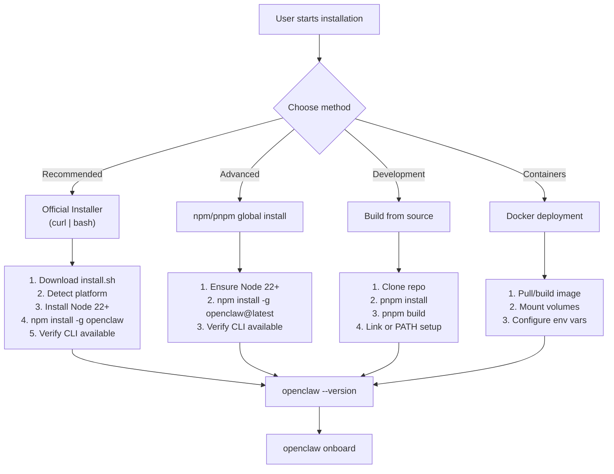
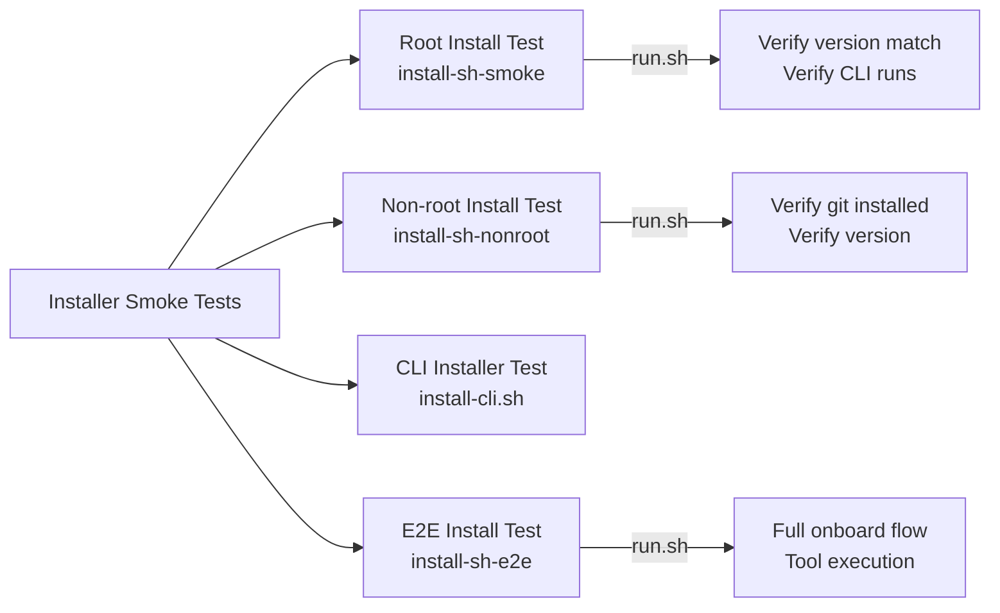
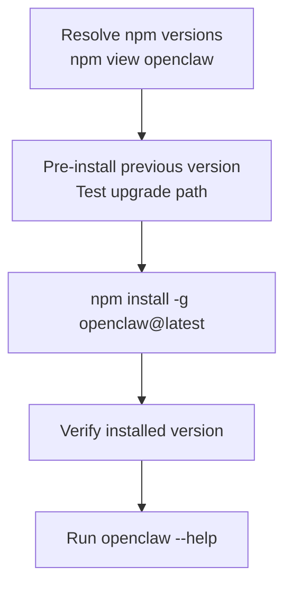
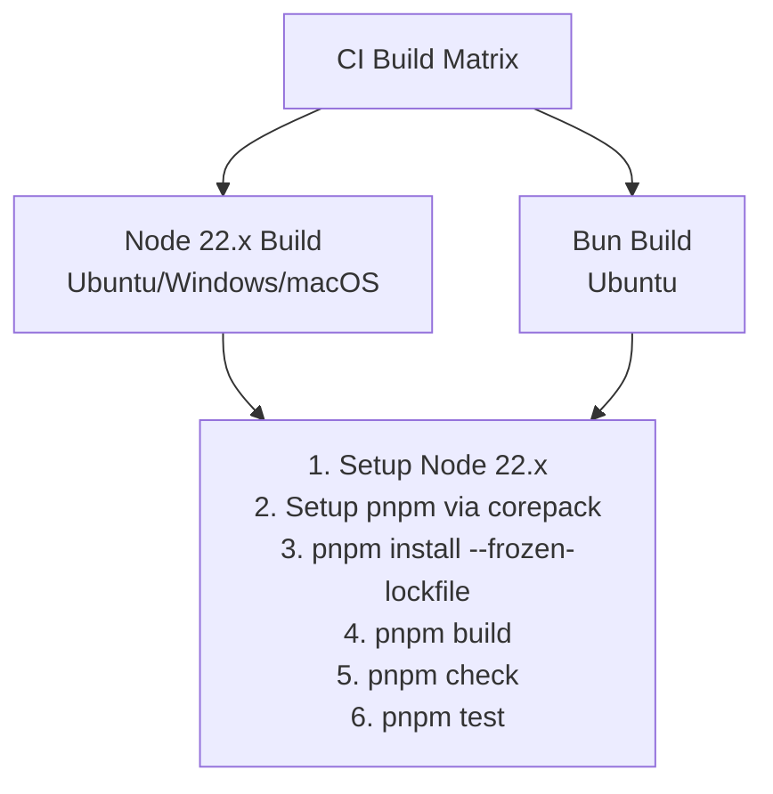
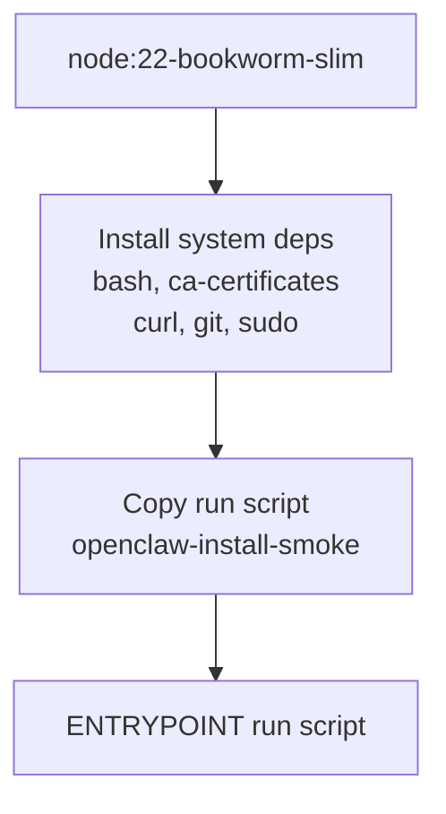
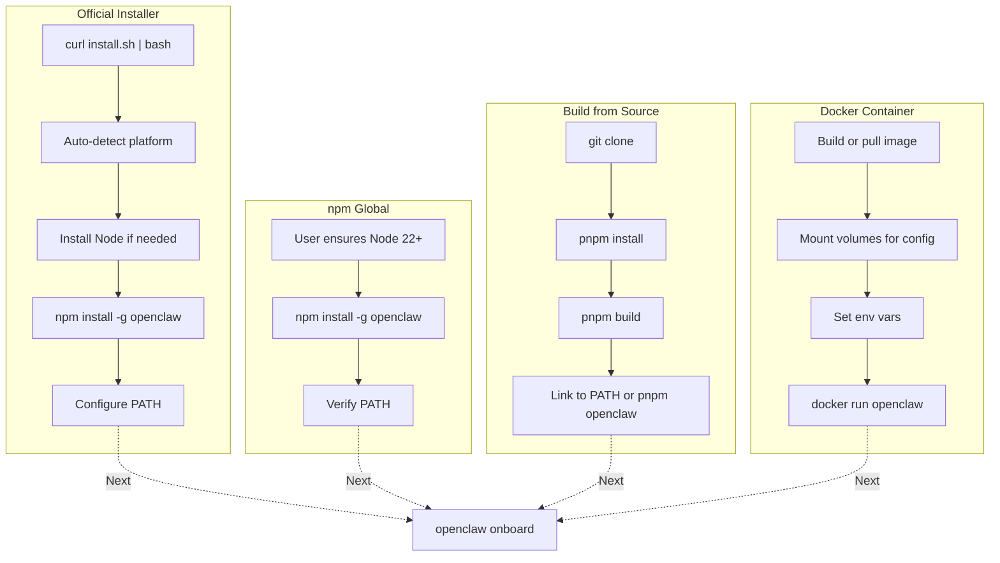

# Page: Installation Methods

# Installation Methods

<details>
<summary>Relevant source files</summary>

The following files were used as context for generating this wiki page:

- [.agents/skills/mintlify/SKILL.md](.agents/skills/mintlify/SKILL.md)
- [.github/ISSUE_TEMPLATE/bug_report.md](.github/ISSUE_TEMPLATE/bug_report.md)
- [.github/ISSUE_TEMPLATE/config.yml](.github/ISSUE_TEMPLATE/config.yml)
- [.github/ISSUE_TEMPLATE/feature_request.md](.github/ISSUE_TEMPLATE/feature_request.md)
- [.github/labeler.yml](.github/labeler.yml)
- [.github/workflows/auto-response.yml](.github/workflows/auto-response.yml)
- [.github/workflows/labeler.yml](.github/workflows/labeler.yml)
- [.github/workflows/stale.yml](.github/workflows/stale.yml)
- [AGENTS.md](AGENTS.md)
- [README.md](README.md)
- [assets/avatar-placeholder.svg](assets/avatar-placeholder.svg)
- [docs/channels/index.md](docs/channels/index.md)
- [docs/channels/zalo.md](docs/channels/zalo.md)
- [docs/channels/zalouser.md](docs/channels/zalouser.md)
- [docs/zh-CN/channels/index.md](docs/zh-CN/channels/index.md)
- [scripts/clawtributors-map.json](scripts/clawtributors-map.json)
- [scripts/sync-labels.ts](scripts/sync-labels.ts)
- [scripts/update-clawtributors.ts](scripts/update-clawtributors.ts)
- [scripts/update-clawtributors.types.ts](scripts/update-clawtributors.types.ts)
- [src/config/config.ts](src/config/config.ts)
- [src/index.test.ts](src/index.test.ts)
- [src/index.ts](src/index.ts)
- [tsconfig.json](tsconfig.json)
- [ui/src/styles.css](ui/src/styles.css)
- [ui/src/styles/layout.mobile.css](ui/src/styles/layout.mobile.css)

</details>


This document describes the available methods for installing OpenClaw and their respective workflows. For system requirements before installation, see [System Requirements](#2.1). For post-installation setup including authentication and workspace configuration, see [Onboarding Wizard](#2.3).

## Overview

OpenClaw can be installed through four primary methods:

| Method | Recommended For | Updates | Gateway Service |
|--------|----------------|---------|----------------|
| Official Installer | Most users | Automatic | Auto-configured |
| npm/pnpm Global | CI/CD, advanced users | Manual (`npm update`) | Manual setup |
| Build from Source | Contributors, development | Manual (`git pull`) | Manual setup |
| Docker | Container deployments | Image rebuild | Container lifecycle |

**Sources:** [docs/index.md:98-115](), [docs/start/getting-started.md:30-48]()

## Installation Flow Overview



**Sources:** [docs/start/getting-started.md:30-72](), [docs/start/wizard.md:17-19]()

## Method 1: Official Installer (Recommended)

The official installer script automates the complete installation process including platform detection, dependency installation, and CLI setup.

### macOS and Linux

```bash
curl -fsSL https://openclaw.ai/install.sh | bash
```

The installer script (`install.sh`) performs the following steps:

1. Detects platform (macOS, Linux, WSL2)
2. Verifies or installs Node.js 22+
3. Installs `openclaw` package globally via npm
4. Verifies CLI availability in PATH
5. Optionally runs onboarding wizard

### Windows

```powershell
iwr -useb https://openclaw.ai/install.ps1 | iex
```

The PowerShell installer performs equivalent steps for Windows environments.

### Installer Script Testing



The installer is tested in CI through Docker-based smoke tests:

- **Root install test**: [scripts/docker/install-sh-smoke/run.sh:1-74]() verifies upgrade path from previous version to latest
- **Non-root install test**: [scripts/docker/install-sh-nonroot/run.sh:1-52]() validates installation without sudo and git installation
- **E2E install test**: [scripts/docker/install-sh-e2e/run.sh:1-500]() runs full onboarding with real API keys and tool execution

**Sources:** [docs/index.md:32-42](), [docs/start/getting-started.md:32-48](), [scripts/test-install-sh-docker.sh:1-71](), [scripts/test-install-sh-e2e-docker.sh:1-30](), [.github/workflows/install-smoke.yml:1-42]()

## Method 2: npm/pnpm Global Install

Direct package manager installation provides manual control over the installation process.

### npm Installation

```bash
npm install -g openclaw@latest
```

### pnpm Installation

```bash
pnpm add -g openclaw@latest
```

### Version Management

```bash
# Install specific version
npm install -g openclaw@2026.1.29

# Install beta channel
npm install -g openclaw@beta

# Update to latest
npm update -g openclaw

# Verify installation
openclaw --version
```

### Installation Verification

The smoke tests verify CLI availability and version matching:



**Sources:** [scripts/docker/install-sh-smoke/run.sh:10-52](), [docs/index.md:98-103]()

## Method 3: Build from Source

Building from source is intended for contributors and development workflows.

### Clone and Build

```bash
# Clone repository
git clone https://github.com/openclaw/openclaw.git
cd openclaw

# Install dependencies (requires pnpm)
pnpm install

# Build TypeScript
pnpm build

# Run CLI in development
pnpm openclaw --help
```

### Development Commands

| Command | Purpose |
|---------|---------|
| `pnpm build` | Compile TypeScript to `dist/` |
| `pnpm check` | Run lint and format checks |
| `pnpm test` | Run vitest test suite |
| `pnpm openclaw ...` | Execute CLI via bun |
| `pnpm dev` | Run CLI in watch mode |

### CI Build Validation

The CI pipeline validates builds across platforms:



**Sources:** [.github/workflows/ci.yml:68-157](), [AGENTS.md:50-64]()

## Method 4: Docker Deployment

Docker installations use containerized OpenClaw deployments.

### Dockerfile Structure

Docker images are built for testing and deployment:



### Docker Testing Images

The project maintains several Docker test images:

| Image | Purpose | Dockerfile |
|-------|---------|------------|
| `openclaw-install-smoke:local` | Root install smoke test | [scripts/docker/install-sh-smoke/Dockerfile:1-22]() |
| `openclaw-install-nonroot:local` | Non-root user test | [scripts/docker/install-sh-nonroot/Dockerfile:1-32]() |
| `openclaw-install-e2e:local` | Full E2E onboarding | [scripts/docker/install-sh-e2e/Dockerfile:1-32]() |

### Docker Run Example

```bash
# Build image
docker build -t openclaw-install-smoke:local \
  -f scripts/docker/install-sh-smoke/Dockerfile \
  scripts/docker/install-sh-smoke

# Run smoke test
docker run --rm -t \
  -e OPENCLAW_INSTALL_URL="https://openclaw.ai/install.sh" \
  -e OPENCLAW_NO_ONBOARD=1 \
  openclaw-install-smoke:local
```

**Sources:** [scripts/docker/install-sh-smoke/Dockerfile:1-22](), [scripts/test-install-sh-docker.sh:1-71]()

## Post-Installation

### Verify Installation

```bash
# Check CLI is available
which openclaw

# Verify version
openclaw --version

# Test basic command
openclaw --help
```

### Run Onboarding

After installation, proceed to the onboarding wizard to configure authentication, workspace, and gateway:

```bash
openclaw onboard --install-daemon
```

See [Onboarding Wizard](#2.3) for complete setup details.

### Install Gateway Service

The official installer optionally installs the gateway as a system service:

- **macOS**: LaunchAgent at `~/Library/LaunchAgents/bot.molt.gateway.plist`
- **Linux**: systemd user unit at `~/.config/systemd/user/openclaw-gateway.service`
- **Windows**: Scheduled Task via `schtasks`

Service installation is covered in [Gateway Service Management](#3.3).

**Sources:** [docs/start/getting-started.md:52-72](), [docs/gateway/index.md:199-298]()

## Installation Paths Comparison



**Sources:** [docs/start/getting-started.md:30-98](), [AGENTS.md:50-64]()

## Environment Variables

Installation behavior can be customized via environment variables:

| Variable | Purpose | Default |
|----------|---------|---------|
| `OPENCLAW_INSTALL_URL` | Custom installer URL | `https://openclaw.ai/install.sh` |
| `OPENCLAW_VERSION` | Specific version to install | `latest` |
| `OPENCLAW_BETA` | Install beta channel | `0` |
| `OPENCLAW_NO_ONBOARD` | Skip onboarding wizard | `0` |
| `OPENCLAW_STATE_DIR` | State directory override | `~/.openclaw` |
| `OPENCLAW_CONFIG_PATH` | Config file override | `~/.openclaw/openclaw.json` |

**Sources:** [scripts/docker/install-sh-smoke/run.sh:4-8](), [scripts/docker/install-sh-e2e/run.sh:4-33]()

## Troubleshooting Installation

Common installation issues:

| Issue | Solution |
|-------|----------|
| `npm: command not found` | Install Node.js 22+ first |
| `openclaw: command not found` | Add npm global prefix to PATH |
| Version mismatch | Clear npm cache: `npm cache clean --force` |
| Permission denied (Linux) | Use official installer or set npm prefix |
| Build errors from source | Ensure pnpm is installed: `corepack enable` |

For detailed troubleshooting, see [Troubleshooting](#14.3).

**Sources:** [docs/gateway/troubleshooting.md:513-561]()

## Related Pages

- [System Requirements](#2.1) - Prerequisites before installation
- [Onboarding Wizard](#2.3) - Post-installation setup
- [macOS App Installation](#2.4) - Native macOS app setup
- [Gateway Service Management](#3.3) - Managing the gateway daemon

---