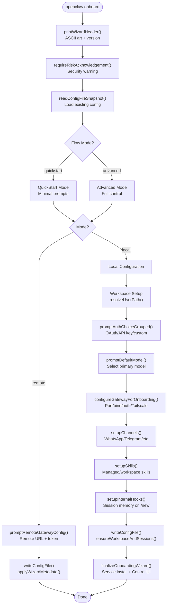
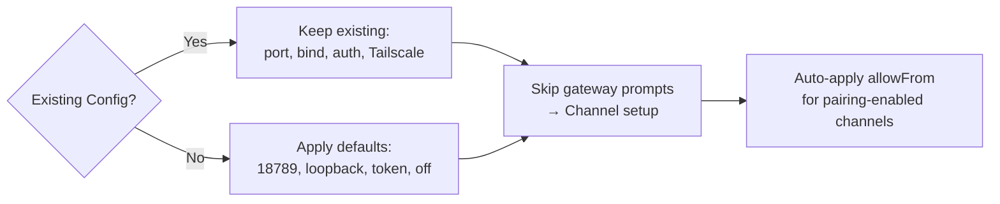
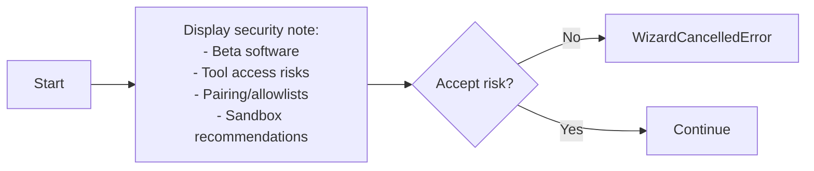
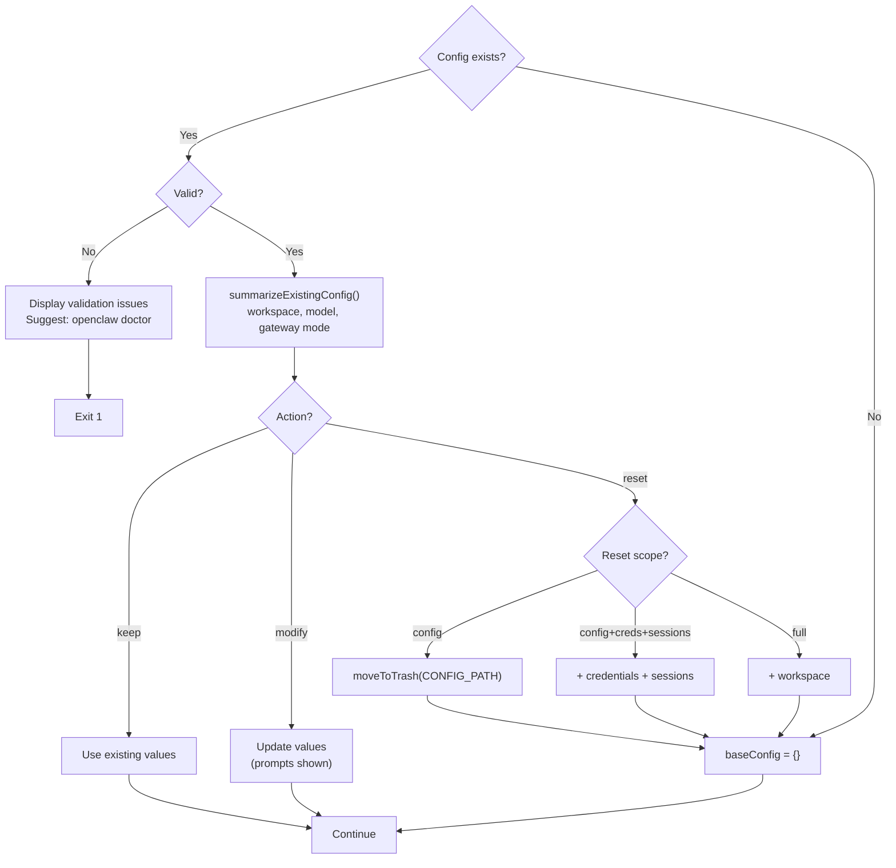
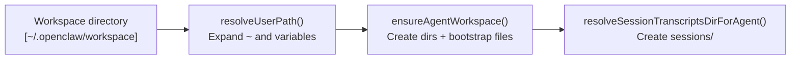
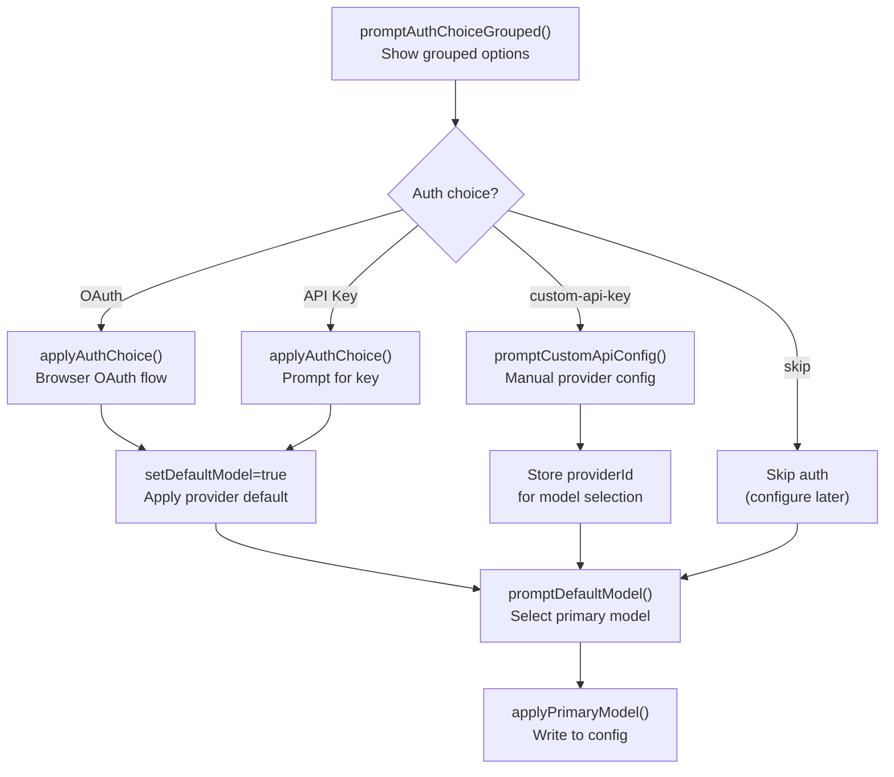
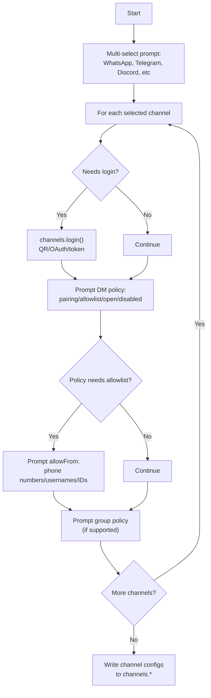
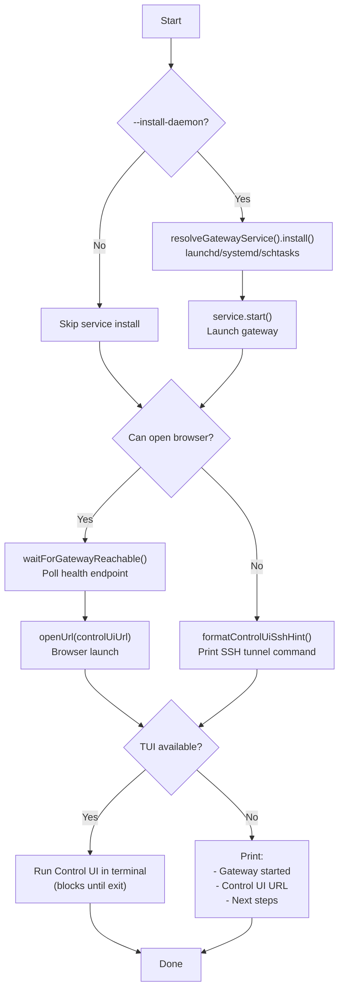
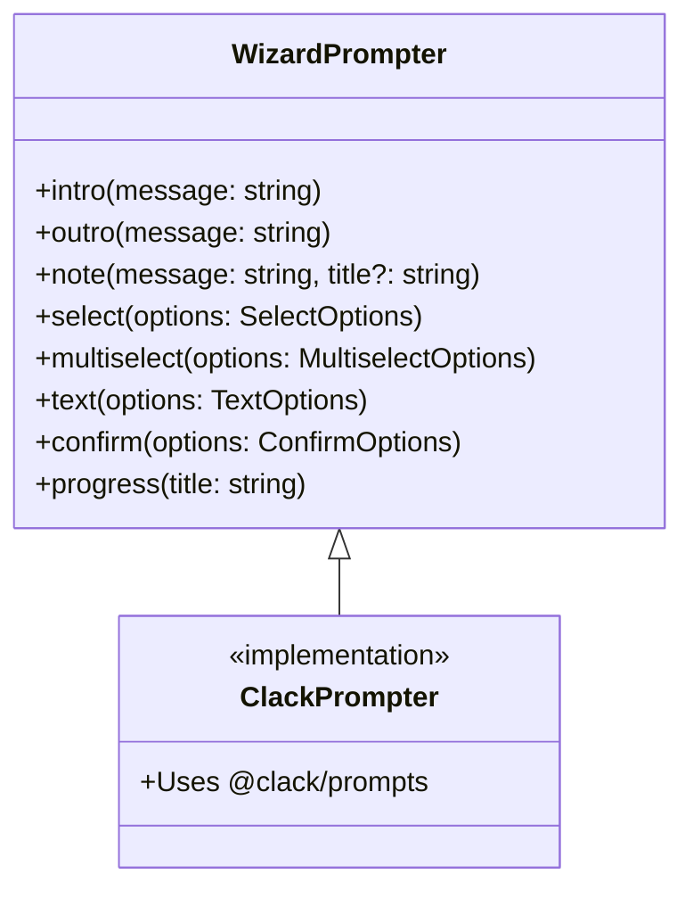

# Page: Onboarding Wizard

# Onboarding Wizard

<details>
<summary>Relevant source files</summary>

The following files were used as context for generating this wiki page:

- [README.md](README.md)
- [assets/avatar-placeholder.svg](assets/avatar-placeholder.svg)
- [docs/channels/zalo.md](docs/channels/zalo.md)
- [docs/channels/zalouser.md](docs/channels/zalouser.md)
- [docs/gateway/doctor.md](docs/gateway/doctor.md)
- [scripts/clawtributors-map.json](scripts/clawtributors-map.json)
- [scripts/update-clawtributors.ts](scripts/update-clawtributors.ts)
- [scripts/update-clawtributors.types.ts](scripts/update-clawtributors.types.ts)
- [src/agents/bash-tools.test.ts](src/agents/bash-tools.test.ts)
- [src/agents/pi-tools-agent-config.test.ts](src/agents/pi-tools-agent-config.test.ts)
- [src/agents/sandbox-skills.test.ts](src/agents/sandbox-skills.test.ts)
- [src/commands/configure.gateway.test.ts](src/commands/configure.gateway.test.ts)
- [src/commands/configure.gateway.ts](src/commands/configure.gateway.ts)
- [src/commands/configure.ts](src/commands/configure.ts)
- [src/commands/doctor.ts](src/commands/doctor.ts)
- [src/commands/onboard-helpers.test.ts](src/commands/onboard-helpers.test.ts)
- [src/commands/onboard-helpers.ts](src/commands/onboard-helpers.ts)
- [src/commands/onboard-interactive.ts](src/commands/onboard-interactive.ts)
- [src/config/config.ts](src/config/config.ts)
- [src/config/merge-config.ts](src/config/merge-config.ts)
- [src/index.test.ts](src/index.test.ts)
- [src/index.ts](src/index.ts)
- [src/wizard/onboarding.gateway-config.test.ts](src/wizard/onboarding.gateway-config.test.ts)
- [src/wizard/onboarding.gateway-config.ts](src/wizard/onboarding.gateway-config.ts)
- [src/wizard/onboarding.ts](src/wizard/onboarding.ts)
- [src/wizard/onboarding.types.ts](src/wizard/onboarding.types.ts)
- [tsconfig.json](tsconfig.json)
- [ui/src/styles.css](ui/src/styles.css)
- [ui/src/styles/layout.mobile.css](ui/src/styles/layout.mobile.css)

</details>


The onboarding wizard (`openclaw onboard`) is the recommended first-run setup experience for OpenClaw. It guides users through initial configuration, including authentication, model selection, gateway settings, channel setup, and workspace initialization. The wizard produces a validated `openclaw.json` configuration file and bootstraps the workspace directory structure.

For post-installation configuration changes, see [Configuration Commands](#12.5). For system requirements, see [System Requirements](#2.1). For manual configuration reference, see [Configuration File Structure](#4.1).

---

## Overview

The wizard supports two modes:

| Mode | Description | Use Case |
|------|-------------|----------|
| **QuickStart** | Minimal prompts with sensible defaults | First-time users, local gateway setups |
| **Advanced** | Full configuration control | Remote gateways, custom network configurations |

Both modes support two deployment targets:

| Target | Description |
|--------|-------------|
| **Local** | Gateway runs on the current machine |
| **Remote** | Gateway runs on a separate host; onboarding configures connection details only |

---

## Entry Points

### CLI Command

```bash
openclaw onboard [options]
```

### Common Flags

| Flag | Description |
|------|-------------|
| `--flow quickstart\|advanced` | Force a specific wizard mode |
| `--mode local\|remote` | Force local or remote gateway setup |
| `--workspace <path>` | Set workspace directory (default: `~/.openclaw/workspace`) |
| `--auth-choice <choice>` | Pre-select authentication method |
| `--skip-channels` | Skip channel setup |
| `--skip-skills` | Skip skills setup |
| `--accept-risk` | Skip security warning prompt |
| `--install-daemon` | Install gateway service (launchd/systemd) |

Sources: [README.md:45-76](), [src/wizard/onboarding.ts:1-484]()

---

## Wizard Flow

The wizard follows a linear flow with branching based on user selections:



Sources: [src/wizard/onboarding.ts:90-483](), [src/commands/onboard-helpers.ts:79-108]()

---

## QuickStart Mode

QuickStart mode minimizes prompts by applying defaults:

### Defaults Applied

| Setting | Default |
|---------|---------|
| Gateway port | 18789 (or existing) |
| Gateway bind | `loopback` (127.0.0.1) |
| Gateway auth | `token` (auto-generated) |
| Tailscale | `off` |
| Channel DM policies | `pairing` for eligible channels |
| Gateway nodes deny commands | Camera/screen recording (privacy-sensitive commands) |

### QuickStart Logic



QuickStart forces local mode; remote gateway setup requires advanced mode.

Sources: [src/wizard/onboarding.ts:121-292](), [src/wizard/onboarding.gateway-config.ts:42-286]()

---

## Advanced Mode

Advanced mode prompts for all configuration options.

### Gateway Configuration Prompts

#### Port Selection

Prompts for gateway port with validation:

```
Gateway port: [18789]
```

Sources: [src/wizard/onboarding.gateway-config.ts:48-60]()

#### Bind Mode Selection

```
Gateway bind:
→ Loopback (127.0.0.1)
  LAN (0.0.0.0)
  Tailnet (Tailscale IP)
  Auto (Loopback → LAN)
  Custom IP
```

| Mode | Description |
|------|-------------|
| `loopback` | Binds to 127.0.0.1 (local access only) |
| `lan` | Binds to 0.0.0.0 (all network interfaces) |
| `tailnet` | Binds to primary Tailscale IP (100.x.x.x) |
| `auto` | Prefers loopback, falls back to LAN if unavailable |
| `custom` | Prompts for specific IPv4 address with validation |

Sources: [src/wizard/onboarding.gateway-config.ts:62-106]()

#### Auth Mode Selection

```
Gateway auth:
→ Token (Recommended default)
  Password
```

Token mode generates a random 48-character hex token via `randomToken()` if not provided.

Sources: [src/wizard/onboarding.gateway-config.ts:108-203]()

#### Tailscale Exposure

```
Tailscale exposure:
→ Off (No Tailscale exposure)
  Serve (Private HTTPS for tailnet)
  Funnel (Public HTTPS via Tailscale Funnel)
```

**Safety constraints enforced:**
- Tailscale serve/funnel requires `bind=loopback` (auto-adjusted)
- Funnel requires `authMode=password` (auto-adjusted)
- Binary detection via `findTailscaleBinary()` warns if Tailscale not installed

Sources: [src/wizard/onboarding.gateway-config.ts:124-189]()

---

## Configuration Steps Detail

### Risk Acknowledgement

The wizard displays a security warning before proceeding:



Skippable via `--accept-risk` flag.

Sources: [src/wizard/onboarding.ts:47-88]()

### Config Handling

When an existing config is detected:



Sources: [src/wizard/onboarding.ts:99-188](), [src/commands/onboard-helpers.ts:310-320]()

### Workspace Setup

Workspace directory is resolved and validated:



Bootstrap files created (unless `skipBootstrap` set):
- `IDENTITY.md`
- `SOUL.md`
- `TOOLS.md`
- `AGENTS.md`

Sources: [src/wizard/onboarding.ts:343-353](), [src/commands/onboard-helpers.ts:267-280]()

### Authentication Setup

Authentication flow varies by choice:



Sources: [src/wizard/onboarding.ts:373-420](), [src/commands/onboard-helpers.ts:38-66]()

### Channel Setup

Channel setup via `setupChannels()`:



**QuickStart behavior:**
- Skips DM policy prompts (applies `pairing` default)
- Auto-applies `allowFrom` for pairing-enabled channels
- Skips confirmation prompts

Sources: [src/wizard/onboarding.ts:434-450]()

---

## Gateway Node Defaults

For new gateway setups (no existing `gateway.nodes` config), the wizard applies a default denylist for privacy-sensitive node commands:

```typescript
denyCommands: [
  "camera.snap",
  "camera.clip", 
  "screen.record",
  "calendar.add",
  "contacts.add",
  "reminders.add"
]
```

These commands require explicit opt-in by removing them from the denylist or using temporary arming (e.g., `/phone arm` with phone-control plugin).

Sources: [src/wizard/onboarding.gateway-config.ts:14-25](), [src/wizard/onboarding.gateway-config.ts:256-272]()

---

## Finalization

The finalization step handles service installation and Control UI access:



**Browser open logic:**
- macOS: `open`
- Linux: `xdg-open` (or `wslview` on WSL)
- Windows: `cmd /c start` with URL quoting
- SSH sessions without display: print tunnel hints

Sources: [src/wizard/onboarding.finalize.ts]() (referenced but not in files), [src/commands/onboard-helpers.ts:127-265]()

---

## Key Components

### Core Functions

| Function | File | Purpose |
|----------|------|---------|
| `runOnboardingWizard()` | [src/wizard/onboarding.ts:90-483]() | Main wizard orchestration |
| `requireRiskAcknowledgement()` | [src/wizard/onboarding.ts:47-88]() | Security warning prompt |
| `configureGatewayForOnboarding()` | [src/wizard/onboarding.gateway-config.ts:42-286]() | Gateway settings configuration |
| `setupChannels()` | [src/commands/onboard-channels.ts]() (referenced) | Channel setup flow |
| `setupSkills()` | [src/commands/onboard-skills.ts]() (referenced) | Skills installation |
| `finalizeOnboardingWizard()` | [src/wizard/onboarding.finalize.ts]() (referenced) | Service install + UI launch |

### Helper Functions

| Function | File | Purpose |
|----------|------|---------|
| `printWizardHeader()` | [src/commands/onboard-helpers.ts:79-90]() | ASCII art header |
| `randomToken()` | [src/commands/onboard-helpers.ts:68-70]() | Generate gateway token |
| `applyWizardMetadata()` | [src/commands/onboard-helpers.ts:92-108]() | Stamp wizard metadata |
| `ensureWorkspaceAndSessions()` | [src/commands/onboard-helpers.ts:267-280]() | Create workspace structure |
| `probeGatewayReachable()` | [src/commands/onboard-helpers.ts:360-382]() | Health check |
| `waitForGatewayReachable()` | [src/commands/onboard-helpers.ts:384-416]() | Polling health check |
| `openUrl()` | [src/commands/onboard-helpers.ts:216-245]() | Platform-specific browser open |
| `resolveBrowserOpenCommand()` | [src/commands/onboard-helpers.ts:127-173]() | Detect open command |

### Types

```typescript
type WizardFlow = "quickstart" | "advanced"
type OnboardMode = "local" | "remote"

type QuickstartGatewayDefaults = {
  hasExisting: boolean;
  port: number;
  bind: "loopback" | "lan" | "auto" | "custom" | "tailnet";
  authMode: GatewayAuthChoice;
  tailscaleMode: "off" | "serve" | "funnel";
  token?: string;
  password?: string;
  customBindHost?: string;
  tailscaleResetOnExit: boolean;
}

type GatewayWizardSettings = {
  port: number;
  bind: "loopback" | "lan" | "auto" | "custom" | "tailnet";
  customBindHost?: string;
  authMode: GatewayAuthChoice;
  gatewayToken?: string;
  tailscaleMode: "off" | "serve" | "funnel";
  tailscaleResetOnExit: boolean;
}
```

Sources: [src/wizard/onboarding.types.ts:1-26](), [src/commands/onboard-types.ts]() (referenced)

---

## Configuration Output

The wizard writes a complete `openclaw.json` with wizard metadata:

```json5
{
  // Wizard metadata
  wizard: {
    lastRunAt: "2025-01-15T12:34:56.789Z",
    lastRunVersion: "2025.1.15",
    lastRunCommit: "abc123",
    lastRunCommand: "onboard",
    lastRunMode: "local"
  },
  
  // Gateway configuration
  gateway: {
    mode: "local",
    port: 18789,
    bind: "loopback",
    auth: {
      mode: "token",
      token: "generated-48-char-hex-token"
    },
    tailscale: {
      mode: "off",
      resetOnExit: false
    },
    nodes: {
      denyCommands: ["camera.snap", "camera.clip", "screen.record", ...]
    }
  },
  
  // Agent configuration
  agents: {
    defaults: {
      workspace: "~/.openclaw/workspace",
      model: "anthropic/claude-opus-4-6"
    }
  },
  
  // Channel configuration
  channels: {
    whatsapp: {
      enabled: true,
      dmPolicy: "pairing"
    },
    telegram: {
      enabled: true,
      dmPolicy: "pairing",
      botToken: "<token>"
    }
  }
}
```

Sources: [src/commands/onboard-helpers.ts:92-108](), [src/wizard/onboarding.ts:467-469]()

---

## Wizard Prompter Interface

The wizard uses a `WizardPrompter` abstraction for UI consistency:



Default implementation uses `@clack/prompts` for terminal UI. The abstraction allows testing and alternative UI backends.

Sources: [src/wizard/prompts.ts]() (referenced), [src/wizard/clack-prompter.ts]() (referenced), [src/commands/onboard-interactive.ts:9-25]()

---