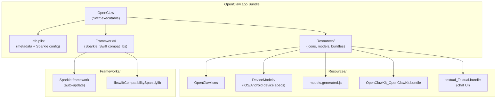
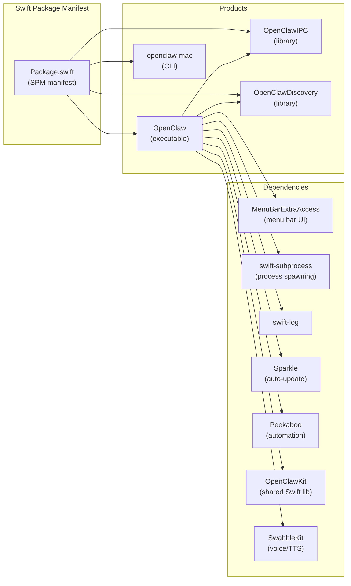
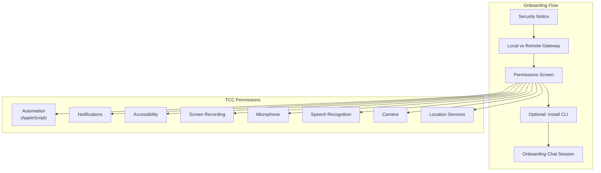
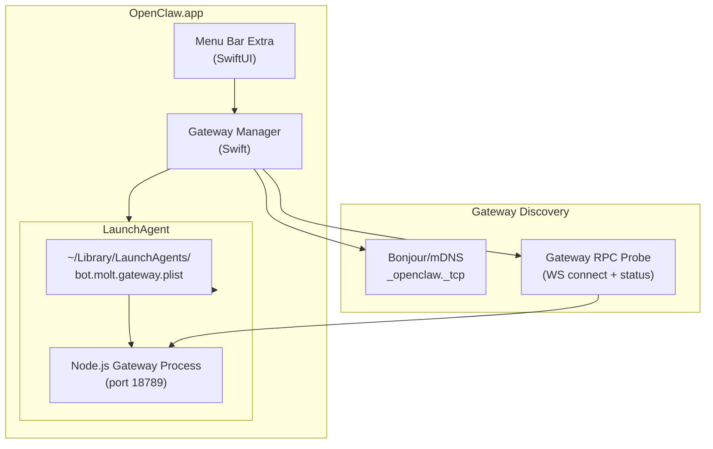
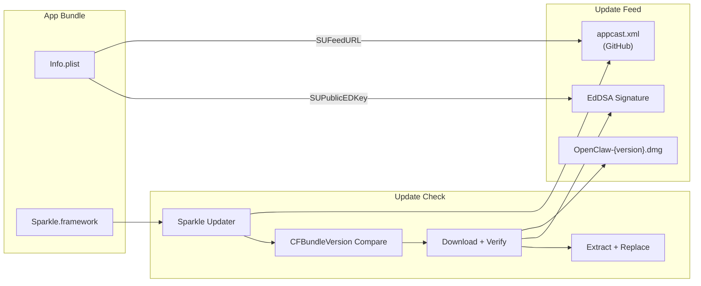

# Page: macOS App Installation

# macOS App Installation

<details>
<summary>Relevant source files</summary>

The following files were used as context for generating this wiki page:

- [README.md](README.md)
- [assets/avatar-placeholder.svg](assets/avatar-placeholder.svg)
- [docs/channels/zalo.md](docs/channels/zalo.md)
- [docs/channels/zalouser.md](docs/channels/zalouser.md)
- [scripts/clawtributors-map.json](scripts/clawtributors-map.json)
- [scripts/update-clawtributors.ts](scripts/update-clawtributors.ts)
- [scripts/update-clawtributors.types.ts](scripts/update-clawtributors.types.ts)
- [src/cli/nodes-cli.ts](src/cli/nodes-cli.ts)
- [src/cli/nodes-screen.test.ts](src/cli/nodes-screen.test.ts)
- [src/cli/nodes-screen.ts](src/cli/nodes-screen.ts)
- [src/cli/program.ts](src/cli/program.ts)
- [src/config/config.ts](src/config/config.ts)
- [src/index.test.ts](src/index.test.ts)
- [src/index.ts](src/index.ts)
- [tsconfig.json](tsconfig.json)
- [ui/src/styles.css](ui/src/styles.css)
- [ui/src/styles/layout.mobile.css](ui/src/styles/layout.mobile.css)

</details>


This document covers installation and configuration of the native macOS companion app (`OpenClaw.app`). The app provides a menu bar interface, manages gateway service lifecycle, handles macOS-specific permissions, and coordinates device capabilities with the OpenClaw gateway.

For CLI-based installation on macOS (without the native app), see [Installation Methods](#2.2). For gateway service management concepts, see [Gateway Service Management](#3.3). For initial setup flows, see [Onboarding Wizard](#2.3).

---

## Purpose and Scope

The macOS app is a native Swift application that:
- Runs as a menu bar extra with always-available UI
- Manages the gateway service via LaunchAgent
- Requests and coordinates macOS permissions (TCC)
- Provides local device capabilities (camera, screen recording, location)
- Handles automatic updates via Sparkle framework
- Embeds Control UI and WebChat interfaces

This page covers app installation, bundle structure, permissions, and gateway service integration. It does not cover gateway configuration itself (see [Gateway Configuration](#3.1)) or channel setup (see [Channels](#8)).

---

## Installation Methods

### Official Release (Recommended)

Download the latest `.dmg` from GitHub Releases:

```bash
open https://github.com/openclaw/openclaw/releases
```

Mount the DMG, drag `OpenClaw.app` to `/Applications`, and launch. The app will:
1. Display the macOS unverified app warning (first launch only)
2. Request local network permission (for gateway discovery via Bonjour)
3. Present the onboarding flow

### Via Installer Script

The unified installer can install both the CLI and the macOS app:

```bash
curl -fsSL https://openclaw.ai/install.sh | bash
```

The script detects macOS and offers to download the latest app bundle if available.

### Building from Source

For development or custom builds:

```bash
git clone https://github.com/openclaw/openclaw
cd openclaw
./scripts/package-mac-app.sh
```

The packaged app appears at `dist/OpenClaw.app`. The script:
- Builds the Swift package via SwiftPM
- Bundles resources (icons, device models, Textual UI)
- Embeds Sparkle.framework for updates
- Code-signs the bundle (ad-hoc by default, or with `SIGN_IDENTITY`)

**Sources:** [scripts/package-mac-app.sh:1-262]()

---

## App Bundle Structure

### High-Level Architecture



**Bundle Contents:**

| Path | Purpose |
|------|---------|
| `Contents/MacOS/OpenClaw` | Swift executable (multi-arch: arm64 + x86_64) |
| `Contents/Info.plist` | Bundle metadata, version, Sparkle feed URL |
| `Contents/Resources/OpenClaw.icns` | App icon |
| `Contents/Resources/DeviceModels/` | JSON specs for iOS/Android devices (node pairing) |
| `Contents/Resources/models.generated.js` | Model catalog from `@mariozechner/pi-ai` |
| `Contents/Resources/OpenClawKit_OpenClawKit.bundle` | Shared Swift resources |
| `Contents/Resources/textual_Textual.bundle` | Chat UI components (from `gonzalezreal/textual`) |
| `Contents/Frameworks/Sparkle.framework` | Auto-update framework |
| `Contents/Frameworks/libswiftCompatibilitySpan.dylib` | Swift 6.2 compatibility library |

**Universal Binary:**

The app ships as a universal binary (arm64 + x86_64). The packaging script builds for each architecture separately, then merges with `lipo`:

```bash
lipo -create \
  apps/macos/.build/arm64/debug/OpenClaw \
  apps/macos/.build/x86_64/debug/OpenClaw \
  -output dist/OpenClaw.app/Contents/MacOS/OpenClaw
```

**Sources:** [scripts/package-mac-app.sh:138-173](), [scripts/package-mac-app.sh:177-192]()

---

## Swift Package Structure



The app is built using Swift Package Manager. Key components:

| Target | Type | Purpose |
|--------|------|---------|
| `OpenClaw` | executable | Main menu bar app |
| `OpenClawIPC` | library | XPC/IPC communication |
| `OpenClawDiscovery` | library | Bonjour/mDNS gateway discovery |
| `openclaw-mac` | executable | macOS-specific CLI tool |

**Sources:** [apps/macos/Package.swift:1-93]()

---

## Permissions Setup

### TCC (Transparency, Consent, and Control)

The app requests macOS permissions during onboarding for device capabilities:



| Permission | Purpose | Required? |
|-----------|---------|-----------|
| Local Network | Gateway discovery via Bonjour | Yes (prompted automatically) |
| Automation | AppleScript integration | Optional |
| Notifications | System notifications | Optional |
| Accessibility | Screen automation (via Peekaboo) | Optional |
| Screen Recording | Screen capture for screenshots/clips | Optional |
| Microphone | Voice input (VoiceWake) | Optional |
| Speech Recognition | Voice-to-text | Optional |
| Camera | Camera snapshots via node.invoke | Optional |
| Location | Location services | Optional |

**Permission Reset:**

If the app crashes during permission prompts (TCC race condition), reset permissions:

```bash
tccutil reset All ai.openclaw.mac.debug
```

**Sources:** [docs/start/onboarding.md:52-67](), [docs/gateway/troubleshooting.md:618-631]()

---

## Gateway Integration

### Gateway Management Architecture



The app coordinates gateway service lifecycle:

1. **Discovery:** Uses Bonjour to discover local gateways advertising `_openclaw._tcp` service
2. **LaunchAgent:** Installs/manages `~/Library/LaunchAgents/bot.molt.gateway.plist` (or `bot.molt.<profile>.plist` for named profiles)
3. **Health Monitoring:** Probes gateway via WebSocket (`ws://127.0.0.1:18789`) and RPC `status` method
4. **Auto-Start:** LaunchAgent configured with `KeepAlive=true` ensures gateway restarts on failure

**LaunchAgent Label Evolution:**

- Current: `bot.molt.gateway` (or `bot.molt.<profile>`)
- Legacy: `com.openclaw.gateway` (cleaned up by `openclaw doctor`)

**Sources:** [docs/gateway/index.md:199-245](), [docs/gateway/troubleshooting.md:633-669]()

---

## LaunchAgent Configuration

### LaunchAgent Structure

The app installs a per-user LaunchAgent that supervises the gateway process. Example plist:

```xml
<?xml version="1.0" encoding="UTF-8"?>
<!DOCTYPE plist PUBLIC "-//Apple//DTD PLIST 1.0//EN" "http://www.apple.com/DTDs/PropertyList-1.0.dtd">
<plist version="1.0">
<dict>
    <key>Label</key>
    <string>bot.molt.gateway</string>
    <key>ProgramArguments</key>
    <array>
        <string>/usr/local/bin/openclaw</string>
        <string>gateway</string>
        <string>--port</string>
        <string>18789</string>
    </array>
    <key>EnvironmentVariables</key>
    <dict>
        <key>OPENCLAW_GATEWAY_TOKEN</key>
        <string></string>
        <key>OPENCLAW_STATE_DIR</key>
        <string>/Users/username/.openclaw</string>
    </dict>
    <key>KeepAlive</key>
    <true/>
    <key>RunAtLoad</key>
    <true/>
    <key>StandardOutPath</key>
    <string>/Users/username/.openclaw/logs/gateway.log</string>
    <key>StandardErrorPath</key>
    <string>/Users/username/.openclaw/logs/gateway.err.log</string>
    <key>WorkingDirectory</key>
    <string>/Users/username</string>
</dict>
</plist>
```

### Service Lifecycle Commands

```bash
# Install LaunchAgent (via CLI)
openclaw gateway install

# Check service status
openclaw gateway status

# Stop service
launchctl bootout gui/$UID/bot.molt.gateway

# Start service
launchctl bootstrap gui/$UID ~/Library/LaunchAgents/bot.molt.gateway.plist

# Restart service (force reload)
launchctl kickstart -k gui/$UID/bot.molt.gateway
```

### Service Metadata

The LaunchAgent embeds metadata for diagnostics:

```xml
<key>EnvironmentVariables</key>
<dict>
    <key>OPENCLAW_SERVICE_MARKER</key>
    <string>openclaw</string>
    <key>OPENCLAW_SERVICE_KIND</key>
    <string>gateway</string>
    <key>OPENCLAW_SERVICE_VERSION</key>
    <string>0.4.0</string>
</dict>
```

This allows `openclaw doctor` to detect and migrate legacy service configurations.

**Sources:** [docs/gateway/index.md:199-245](), [scripts/restart-mac.sh:142-149]()

---

## Development Workflow

### Unsigned Development Build

For rapid iteration without code signing:

```bash
# Build and launch (unsigned, ad-hoc signature)
./scripts/restart-mac.sh --no-sign --wait

# Skip LaunchAgent install (app runs standalone)
./scripts/restart-mac.sh --no-sign --attach-only
```

**Unsigned Flow:**
- Sets `ALLOW_ADHOC_SIGNING=1` and `SIGN_IDENTITY="-"`
- Creates `~/.openclaw/disable-launchagent` marker to skip LaunchAgent writes
- Installs gateway LaunchAgent separately via Node.js CLI (`node openclaw.mjs daemon install`)
- Waits for gateway to be listening before launching app

**Sources:** [scripts/restart-mac.sh:163-184](), [scripts/restart-mac.sh:217-240]()

### Signed Development Build

If signing keys are available:

```bash
# Auto-detect signing keys
./scripts/restart-mac.sh --wait

# Force signing (fails if no key)
./scripts/restart-mac.sh --sign
```

The script detects signing identities via:

```bash
security find-identity -p codesigning -v | grep -E '(Developer ID Application|Apple Distribution|Apple Development)'
```

**Sources:** [scripts/restart-mac.sh:73-76](), [scripts/restart-mac.sh:163-184]()

---

## Auto-Update Configuration

### Sparkle Framework Integration

The app uses [Sparkle 2.8.1](https://sparkle-project.org/) for automatic updates.



**Info.plist Configuration:**

| Key | Value | Purpose |
|-----|-------|---------|
| `SUFeedURL` | `https://raw.githubusercontent.com/openclaw/openclaw/main/appcast.xml` | Update feed URL |
| `SUPublicEDKey` | `AGCY8w5vHirVfGGDGc8Szc5iuOqupZSh9pMj/Qs67XI=` | EdDSA public key for signature verification |
| `SUEnableAutomaticChecks` | `true` (production) / `false` (debug) | Auto-check on launch |
| `CFBundleVersion` | `{BUILD_NUMBER}` | Numeric build number (e.g., git commit count) |
| `CFBundleShortVersionString` | `{VERSION}` | Semantic version (e.g., `0.4.0`) |

**Debug Bundles:**

For bundles with `.debug` suffix (e.g., `ai.openclaw.mac.debug`), Sparkle is disabled:

```bash
if [[ "$BUNDLE_ID" == *.debug ]]; then
  SPARKLE_FEED_URL=""
  AUTO_CHECKS=false
fi
```

**Sources:** [scripts/package-mac-app.sh:25-35](), [scripts/package-mac-app.sh:154-162](), [apps/macos/Package.swift:54]()

---

## App Metadata and Build Information

The app embeds build metadata in `Info.plist`:

```xml
<key>CFBundleIdentifier</key>
<string>ai.openclaw.mac</string>

<key>CFBundleShortVersionString</key>
<string>0.4.0</string>

<key>CFBundleVersion</key>
<string>1234</string>

<key>OpenClawBuildTimestamp</key>
<string>2025-01-14T12:34:56Z</string>

<key>OpenClawGitCommit</key>
<string>abc1234</string>
```

| Key | Source | Example |
|-----|--------|---------|
| `CFBundleIdentifier` | `BUNDLE_ID` env var | `ai.openclaw.mac` (prod), `ai.openclaw.mac.debug` (dev) |
| `CFBundleShortVersionString` | `package.json` version or `APP_VERSION` | `0.4.0` |
| `CFBundleVersion` | Git commit count or `APP_BUILD` | `1234` |
| `OpenClawBuildTimestamp` | `date -u +"%Y-%m-%dT%H:%M:%SZ"` | `2025-01-14T12:34:56Z` |
| `OpenClawGitCommit` | `git rev-parse --short HEAD` | `abc1234` |

**Sources:** [scripts/package-mac-app.sh:12-17](), [scripts/package-mac-app.sh:148-162]()

---

## Troubleshooting

### Common Issues

**App crashes on permission grant:**

Reset TCC cache and rebuild with a new bundle ID:

```bash
tccutil reset All ai.openclaw.mac.debug
# Change BUNDLE_ID in package-mac-app.sh, e.g., append .test
BUNDLE_ID=ai.openclaw.mac.debug.test ./scripts/package-mac-app.sh
```

**Gateway stuck on "Starting...":**

Stop the LaunchAgent supervisor before killing the process:

```bash
openclaw gateway status  # Check supervisor state
openclaw gateway stop    # Stop LaunchAgent
# Or: launchctl bootout gui/$UID/bot.molt.gateway
```

**Port 18789 busy:**

Find and terminate the listener:

```bash
lsof -nP -iTCP:18789 -sTCP:LISTEN
kill -TERM <PID>  # Graceful stop
kill -9 <PID>     # Force kill (last resort)
```

**CLI version mismatch:**

Ensure the global CLI matches the app version:

```bash
openclaw --version
npm install -g openclaw@0.4.0
```

**Sources:** [docs/gateway/troubleshooting.md:618-666]()

---

## Related Documentation

- [Onboarding: macOS App](#2.3) - First-run onboarding flow
- [Gateway Service Management](#3.3) - Service lifecycle and supervision
- [macOS App Development Setup](platforms/mac/dev-setup) - Swift build environment
- [macOS Permissions](platforms/mac/permissions) - TCC permission details
- [macOS LaunchAgent](platforms/mac/bundled-gateway) - LaunchAgent configuration
- [macOS App Release](platforms/mac/release) - Release and signing process

---