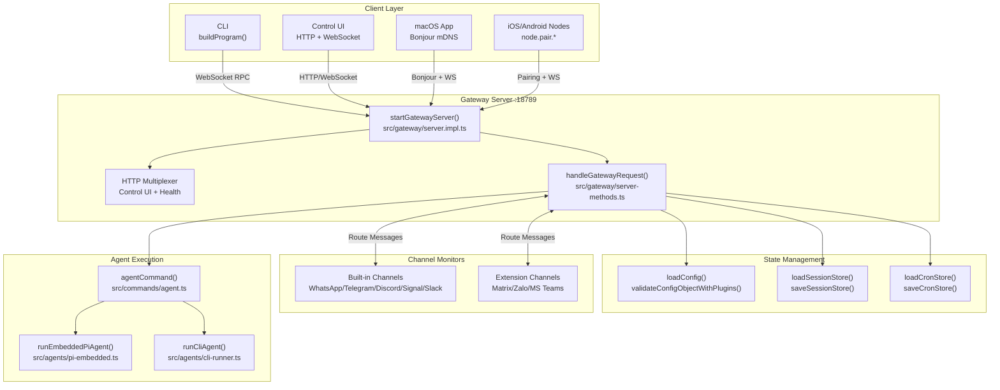
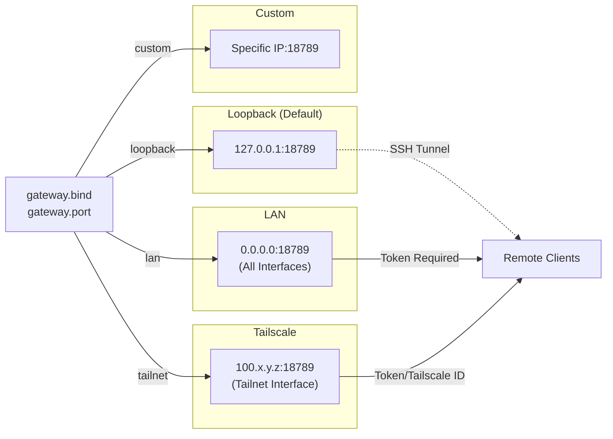
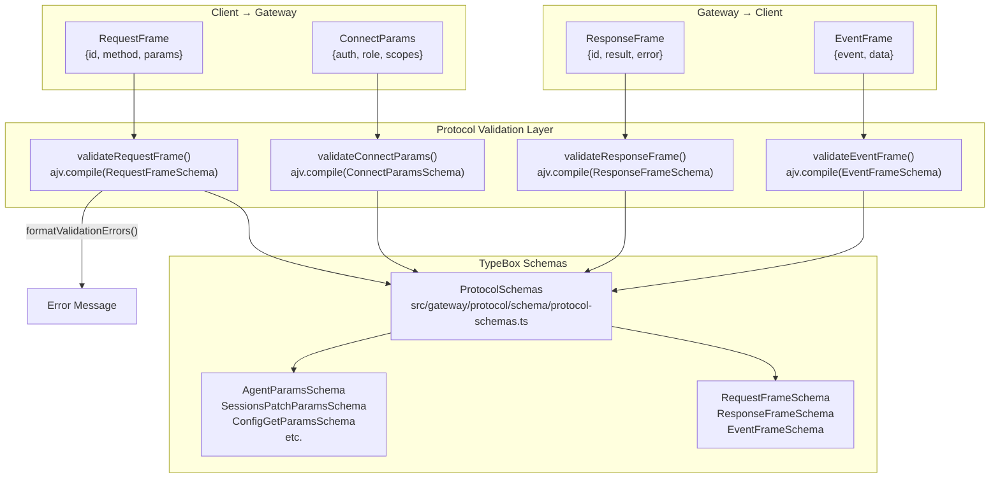
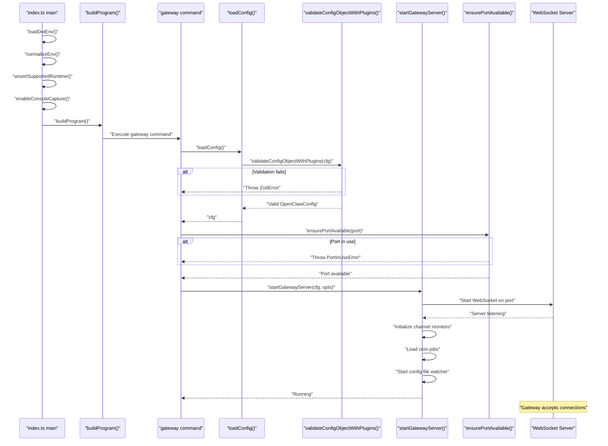
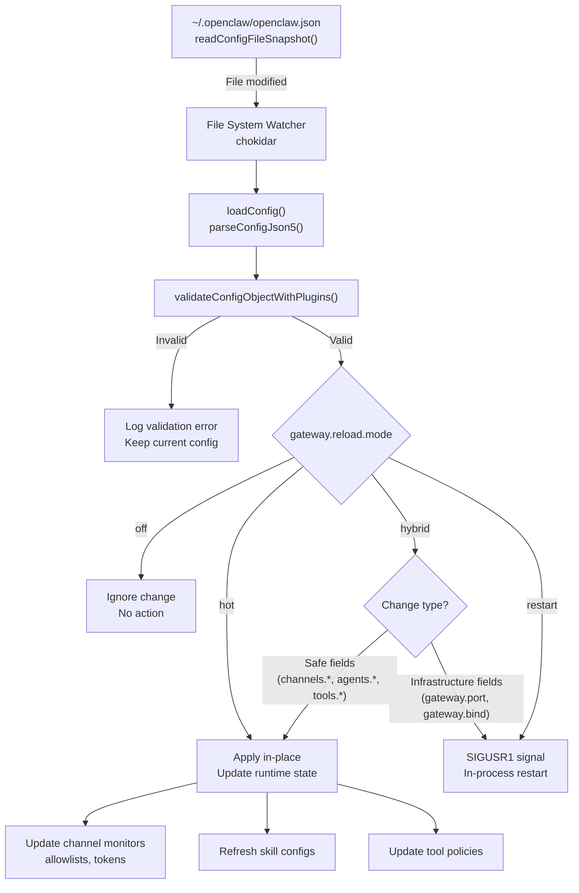
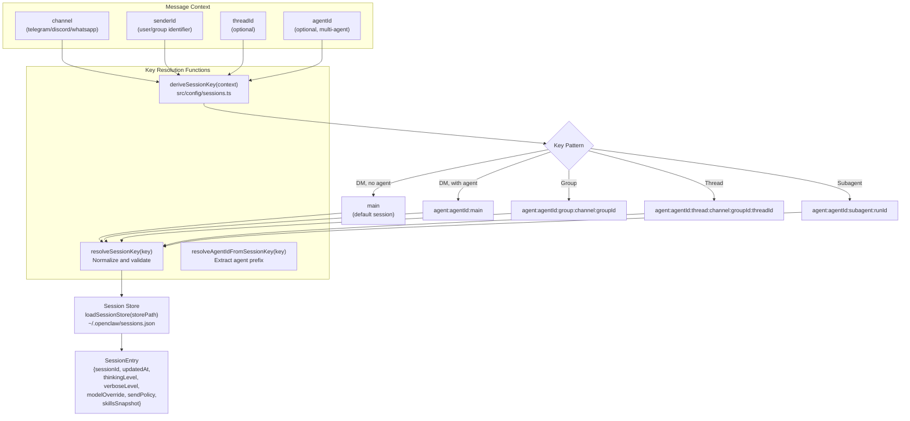
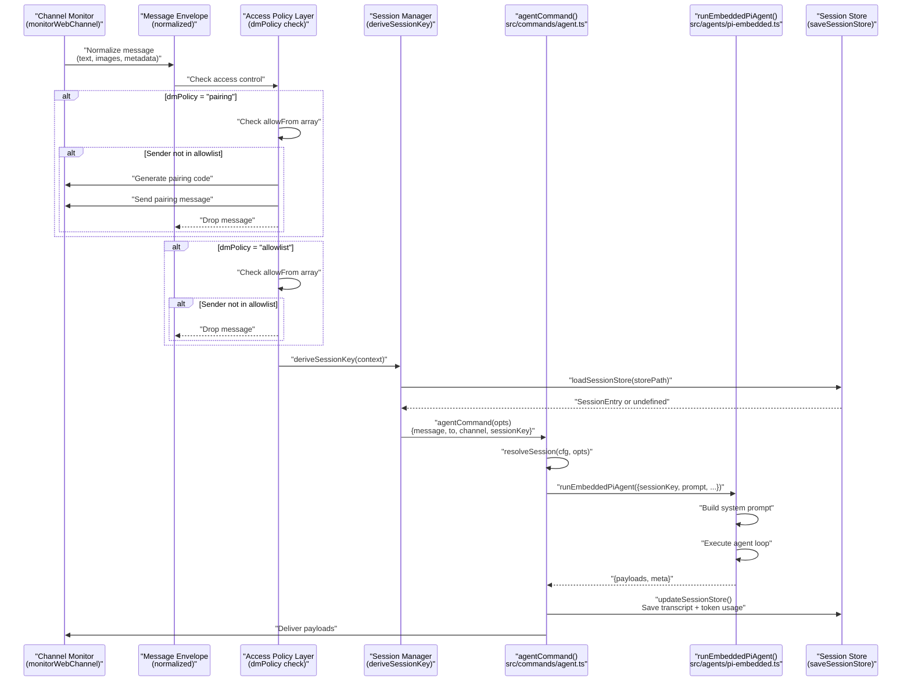
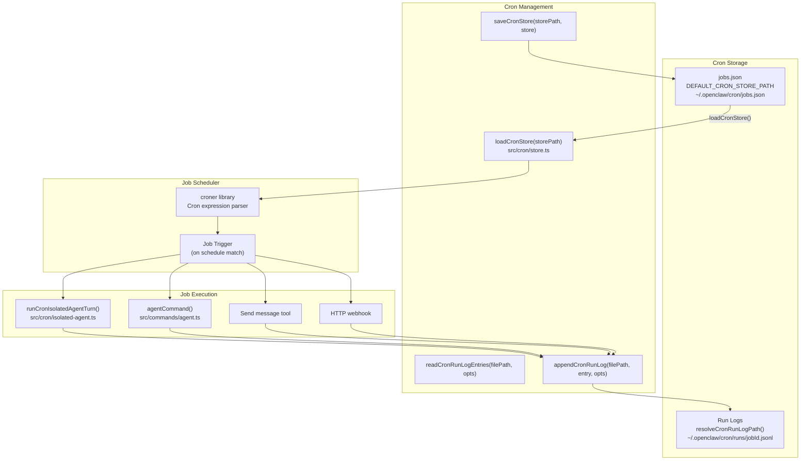
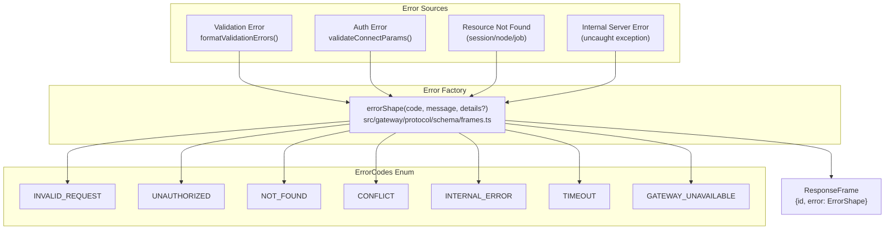

# Page: Gateway

# Gateway

<details>
<summary>Relevant source files</summary>

The following files were used as context for generating this wiki page:

- [README.md](README.md)
- [assets/avatar-placeholder.svg](assets/avatar-placeholder.svg)
- [docs/channels/zalo.md](docs/channels/zalo.md)
- [docs/channels/zalouser.md](docs/channels/zalouser.md)
- [scripts/clawtributors-map.json](scripts/clawtributors-map.json)
- [scripts/update-clawtributors.ts](scripts/update-clawtributors.ts)
- [scripts/update-clawtributors.types.ts](scripts/update-clawtributors.types.ts)
- [src/commands/agent.test.ts](src/commands/agent.test.ts)
- [src/commands/agent.ts](src/commands/agent.ts)
- [src/config/config.ts](src/config/config.ts)
- [src/cron/isolated-agent.ts](src/cron/isolated-agent.ts)
- [src/cron/run-log.test.ts](src/cron/run-log.test.ts)
- [src/cron/run-log.ts](src/cron/run-log.ts)
- [src/cron/store.ts](src/cron/store.ts)
- [src/gateway/protocol/index.ts](src/gateway/protocol/index.ts)
- [src/gateway/protocol/schema.ts](src/gateway/protocol/schema.ts)
- [src/gateway/protocol/schema/agents-models-skills.ts](src/gateway/protocol/schema/agents-models-skills.ts)
- [src/gateway/protocol/schema/protocol-schemas.ts](src/gateway/protocol/schema/protocol-schemas.ts)
- [src/gateway/protocol/schema/types.ts](src/gateway/protocol/schema/types.ts)
- [src/gateway/server-methods-list.ts](src/gateway/server-methods-list.ts)
- [src/gateway/server-methods.ts](src/gateway/server-methods.ts)
- [src/gateway/server-methods/agents.ts](src/gateway/server-methods/agents.ts)
- [src/gateway/server.ts](src/gateway/server.ts)
- [src/index.test.ts](src/index.test.ts)
- [src/index.ts](src/index.ts)
- [tsconfig.json](tsconfig.json)
- [ui/src/styles.css](ui/src/styles.css)
- [ui/src/styles/layout.mobile.css](ui/src/styles/layout.mobile.css)

</details>


## Purpose and Scope

The Gateway is OpenClaw's central control plane—a single long-running WebSocket server (`startGatewayServer()`) that coordinates all system components. It multiplexes HTTP and WebSocket traffic on a single port (default 18789), manages channel connections, routes messages to agents, maintains session state, and exposes a unified RPC interface for all clients.

**Core responsibilities:**
- WebSocket server for RPC protocol (`validateRequestFrame`, `validateResponseFrame`)
- Channel lifecycle management (WhatsApp/Telegram/Discord/Signal/Slack/etc.)
- Session state persistence (`loadSessionStore`, `saveSessionStore`)
- Configuration loading and hot-reload (`loadConfig`, `validateConfigObjectWithPlugins`)
- Cron job scheduling (`loadCronStore`, `saveCronStore`)
- Node pairing and capability management (iOS/Android/macOS)

**Related pages:**
- For Gateway configuration options (port, bind modes, auth): see [Gateway Configuration](#3.1)
- For the WebSocket protocol specification: see [Gateway Protocol](#3.2)
- For service installation and management: see [Gateway Service Management](#3.3)
- For remote access patterns: see [Remote Access](#3.4)

---

## Architecture Overview

**Diagram: Gateway System Architecture**



**Sources:** [src/gateway/server.impl.ts](), [src/gateway/server-methods.ts:1-220](), [src/commands/agent.ts:64-528](), [src/index.ts:1-94]()

---

## Core Responsibilities

The Gateway orchestrates six primary subsystems:

| Subsystem | Key Functions | Implementation Files |
|-----------|---------------|---------------------|
| **WebSocket Server** | `startGatewayServer()`, `handleGatewayRequest()` | [src/gateway/server.impl.ts](), [src/gateway/server-methods.ts:193-220]() |
| **Protocol Validation** | `validateRequestFrame()`, `validateResponseFrame()`, `formatValidationErrors()` | [src/gateway/protocol/index.ts:1-595]() |
| **Session Management** | `loadSessionStore()`, `saveSessionStore()`, `deriveSessionKey()`, `resolveSessionKey()` | [src/config/sessions.ts:12-17]() |
| **Configuration** | `loadConfig()`, `validateConfigObjectWithPlugins()`, `writeConfigFile()` | [src/config/config.ts:1-15]() |
| **Message Routing** | `getReplyFromConfig()`, `monitorWebChannel()`, channel adapters | [src/index.ts:4-35]() |
| **Cron Scheduling** | `loadCronStore()`, `saveCronStore()`, `appendCronRunLog()`, `readCronRunLogEntries()` | [src/cron/store.ts:8-62](), [src/cron/run-log.ts:18-122]() |

**Sources:** [src/gateway/server-methods.ts:1-220](), [src/config/sessions.ts:12-17](), [src/cron/store.ts:8-62]()

---

## Network Architecture

### Binding Modes

The Gateway supports four binding modes:



**Key configuration fields:**
- `gateway.port` (default: `18789`, env: `OPENCLAW_GATEWAY_PORT`)
- `gateway.bind` (values: `loopback`, `lan`, `tailnet`, `auto`, `custom`)
- `gateway.auth.mode` (values: `token`, `password`)
- `gateway.auth.token` (env: `OPENCLAW_GATEWAY_TOKEN`)

**Port allocation pattern:**
- Base port: `gateway.port` (e.g., 18789)
- Browser control: base + 2 (18791, loopback only)
- Canvas host: base + 4 (18793, configurable via `canvasHost.port`)

**Sources:** [docs/gateway/index.md:15-50](), [docs/start/wizard.md:40-60]()

---

## Protocol Architecture

### Protocol Frame Types

**Diagram: Gateway Protocol Frame Validation**



**RPC method handlers:**

| Method Category | Example Methods | Handler File | Schema File |
|-----------------|-----------------|--------------|-------------|
| **Agent** | `agent`, `agent.wait`, `agent.identity.get` | [src/gateway/server-methods/agent.ts]() | [src/gateway/protocol/schema/agent.ts:1-10]() |
| **Sessions** | `sessions.list`, `sessions.patch`, `sessions.reset`, `sessions.compact` | [src/gateway/server-methods/sessions.ts]() | [src/gateway/protocol/schema/sessions.ts:1-17]() |
| **Channels** | `channels.status`, `channels.logout` | [src/gateway/server-methods/channels.ts]() | [src/gateway/protocol/schema/channels.ts:1-17]() |
| **Config** | `config.get`, `config.set`, `config.patch`, `config.apply` | [src/gateway/server-methods/config.ts]() | [src/gateway/protocol/schema/config.ts:1-17]() |
| **Nodes** | `node.list`, `node.describe`, `node.invoke`, `node.pair.*` | [src/gateway/server-methods/nodes.ts]() | [src/gateway/protocol/schema/nodes.ts:1-17]() |
| **Cron** | `cron.list`, `cron.add`, `cron.run`, `cron.runs` | [src/gateway/server-methods/cron.ts]() | [src/gateway/protocol/schema/cron.ts:1-17]() |
| **Agents** | `agents.list`, `agents.create`, `agents.update`, `agents.delete` | [src/gateway/server-methods/agents.ts:167-402]() | [src/gateway/protocol/schema/agents-models-skills.ts:35-210]() |

**Protocol constants:**
- `PROTOCOL_VERSION = 3` - Current protocol version ([src/gateway/protocol/schema/protocol-schemas.ts:258]())
- `ErrorCodes` - Standardized error codes enum ([src/gateway/protocol/schema/error-codes.ts]())

**Sources:** [src/gateway/protocol/index.ts:223-365](), [src/gateway/protocol/schema/protocol-schemas.ts:140-259](), [src/gateway/protocol/schema.ts:1-17]()

---

## Startup and Lifecycle

### Initialization Sequence

**Diagram: Gateway Startup Flow**



**Startup validation sequence:**

1. **Runtime guards** ([src/index.ts:37-44]())
   - `assertSupportedRuntime()` - Enforces Node >= 22
   - `loadDotEnv()` - Loads `.env` files
   - `normalizeEnv()` - Normalizes environment variables
   - `enableConsoleCapture()` - Captures console output for structured logging

2. **Configuration validation** ([src/config/config.ts:1-15]())
   - `loadConfig()` - Reads `openclaw.json`
   - `validateConfigObjectWithPlugins()` - Zod + plugin schema validation
   - Fails fast on invalid config

3. **Port availability check** ([src/infra/ports.ts:24-29]())
   - `ensurePortAvailable(port)` - Tests if port is free
   - `describePortOwner(port)` - Identifies conflicting process
   - Throws `PortInUseError` if port already bound

4. **Server initialization** ([src/gateway/server.impl.ts]())
   - `startGatewayServer(cfg, opts)` - Main server factory
   - Binds WebSocket + HTTP multiplexer to `gateway.port`
   - Initializes channel monitors, cron scheduler, config watcher

**Sources:** [src/index.ts:36-93](), [src/config/config.ts:1-15](), [src/infra/ports.ts:24-29]()

---

## Configuration Hot Reload

**Diagram: Config File Watcher and Reload Logic**



**Hot-reloadable configuration paths:**

| Config Path | Hot-Reloadable | Notes |
|-------------|----------------|-------|
| `channels.*.allowFrom` | ✅ Yes | Updates allowlists without restart |
| `channels.*.dmPolicy` | ✅ Yes | Updates access policy immediately |
| `channels.*.groupPolicy` | ✅ Yes | Group routing rules |
| `skills.*` | ✅ Yes | Skill enable/disable, environment variables |
| `tools.allow` / `tools.deny` | ✅ Yes | Global tool policies |
| `agents.*.model` | ✅ Yes | Agent-specific model overrides |
| `gateway.port` | ❌ No | Requires restart (socket rebind) |
| `gateway.bind` | ❌ No | Network interface change |
| `gateway.auth.*` | ❌ No | Authentication requires restart |
| `agents.*.sandbox.*` | ❌ No | Docker configuration requires restart |

**Reload mode behaviors:**

- `gateway.reload.mode = "off"` - Ignore all config changes, require manual restart
- `gateway.reload.mode = "hot"` - Always attempt hot-reload (warns on unsafe changes)
- `gateway.reload.mode = "hybrid"` (default) - Hot-reload safe changes, auto-restart for infrastructure
- `gateway.reload.mode = "restart"` - Always trigger full restart on any change

**Sources:** [src/config/config.ts:1-15](), [README.md:1-100]()

---

## Key Components

### WebSocket Server (`startGatewayServer`)

The Gateway's WebSocket server multiplexes HTTP and WebSocket traffic on a single port:

| Path | Protocol | Purpose |
|------|----------|---------|
| `/` | WebSocket | RPC control plane |
| `/` | HTTP GET | Control UI static assets |
| `/__openclaw__/*` | HTTP | Internal hooks, health checks |
| `/v1/chat/completions` | HTTP POST | OpenAI-compatible API |
| `/v1/responses` | HTTP POST | OpenResponses API |
| `/tools/invoke` | HTTP POST | Direct tool invocation |

**Connection flow:**
1. Client sends `connect` frame with `auth.token` or `auth.password`
2. Server validates via `validateConnectParams()`
3. Server responds with `HelloOk` frame including protocol version
4. Bidirectional RPC and events enabled

**Sources:** [src/gateway/server.ts:1-4](), [docs/gateway/index.md:30-35]()

---

### Session Manager

**Diagram: Session Key Resolution and Storage**



**Session storage functions:**

| Function | Purpose | File |
|----------|---------|------|
| `deriveSessionKey(context)` | Generate session key from message context | [src/config/sessions.ts:12]() |
| `resolveSessionKey(key)` | Normalize and validate session key string | [src/config/sessions.ts:14]() |
| `loadSessionStore(storePath)` | Read session state from JSON file | [src/config/sessions.ts:13]() |
| `saveSessionStore(storePath, store)` | Persist session state to disk | [src/config/sessions.ts:16]() |
| `updateSessionStore(storePath, fn)` | Atomic update with read-modify-write | [src/config/sessions.ts]() |
| `resolveAgentIdFromSessionKey(key)` | Extract agent ID from session key | [src/config/sessions.ts:42]() |
| `resolveSessionFilePath(sessionId, entry, opts)` | Get JSONL transcript path | [src/config/sessions.ts]() |

**Session entry fields:**

```typescript
type SessionEntry = {
  sessionId: string;           // Unique session ID
  updatedAt: number;           // Last update timestamp
  thinkingLevel?: ThinkLevel;  // off/minimal/low/medium/high/xhigh
  verboseLevel?: VerboseLevel; // off/on/full
  modelOverride?: string;      // Model name override
  providerOverride?: string;   // Provider override
  sendPolicy?: SendPolicy;     // allow/deny/prompt
  skillsSnapshot?: object;     // Cached skill state
  channel?: string;            // Source channel
  chatType?: string;           // dm/group/thread
  spawnedBy?: string;          // Parent session key (for subagents)
};
```

**Sources:** [src/config/sessions.ts:12-46](), [src/index.ts:12-18]()

---

## Message Processing Pipeline

**Diagram: Inbound Message Flow Through Gateway**



**Access control enforcement:**

| Policy Mode | Behavior | Config Field |
|-------------|----------|--------------|
| `dmPolicy="pairing"` | Generate pairing code for unknown senders, block message | `channels.*.dmPolicy`, `channels.*.allowFrom` |
| `dmPolicy="allowlist"` | Only allowlisted senders accepted, others dropped | `channels.*.allowFrom` |
| `dmPolicy="open"` | All DMs accepted (must include `"*"` in allowlist) | `channels.*.allowFrom = ["*"]` |
| `dmPolicy="disabled"` | All DMs rejected | `channels.*.dmPolicy = "disabled"` |
| `groupPolicy="open"` | All groups allowed (default) | `channels.*.groupPolicy` |
| `groupPolicy="allowlist"` | Only allowlisted groups accepted | `channels.*.groups` |
| `groupPolicy="disabled"` | All groups rejected | `channels.*.groupPolicy = "disabled"` |

**Sources:** [src/commands/agent.ts:64-528](), [src/agents/pi-embedded.ts](), [src/index.ts:4-35]()

---

## Cron and Scheduling

**Diagram: Cron Job Storage and Execution**



**Cron job store schema:**

```typescript
type CronStoreFile = {
  version: 1;
  jobs: Array<{
    id: string;              // Unique job ID
    schedule: string;        // Cron expression (e.g., "0 9 * * *")
    enabled: boolean;        // Job enabled flag
    action: {
      type: "message" | "agent" | "webhook";
      params: Record<string, unknown>;
    };
    deliverTo?: string;      // Target session/channel
  }>;
};
```

**Run log entry format** ([src/cron/run-log.ts:4-16]()):

```typescript
type CronRunLogEntry = {
  ts: number;              // Timestamp (ms since epoch)
  jobId: string;           // Job identifier
  action: "finished";      // Action type
  status?: "ok" | "error" | "skipped";
  error?: string;          // Error message if failed
  summary?: string;        // Job output summary
  sessionId?: string;      // Session ID if agent job
  sessionKey?: string;     // Session key if agent job
  runAtMs?: number;        // Actual execution time
  durationMs?: number;     // Execution duration
  nextRunAtMs?: number;    // Next scheduled run
};
```

**Cron functions:**

| Function | Purpose | File |
|----------|---------|------|
| `resolveCronStorePath(storePath?)` | Resolve cron store path (default: `~/.openclaw/cron/jobs.json`) | [src/cron/store.ts:11-20]() |
| `loadCronStore(storePath)` | Load and parse cron job definitions | [src/cron/store.ts:22-48]() |
| `saveCronStore(storePath, store)` | Persist cron jobs with atomic write | [src/cron/store.ts:50-62]() |
| `resolveCronRunLogPath(params)` | Resolve run log path for job ID | [src/cron/run-log.ts:18-22]() |
| `appendCronRunLog(filePath, entry, opts)` | Append JSONL entry with auto-prune | [src/cron/run-log.ts:43-62]() |
| `readCronRunLogEntries(filePath, opts)` | Read newest run log entries | [src/cron/run-log.ts:64-122]() |
| `runCronIsolatedAgentTurn(opts)` | Execute agent job in isolated session | [src/cron/isolated-agent.ts:1-2]() |

**Sources:** [src/cron/store.ts:8-62](), [src/cron/run-log.ts:4-122](), [src/cron/isolated-agent.ts:1-2]()

---

## Service Management

The Gateway can run as a supervised background service:

| Platform | Supervisor | Service Name Pattern | Config Location |
|----------|------------|---------------------|-----------------|
| macOS | launchd | `bot.molt.<profile>` | `~/Library/LaunchAgents/` |
| Linux | systemd | `openclaw-gateway[-<profile>].service` | `~/.config/systemd/user/` |
| Windows | schtasks | `OpenClaw Gateway (<profile>)` | Task Scheduler |

**Installation:**
```bash
openclaw gateway install [--force]
```

**Service commands:**
```bash
openclaw gateway status    # Check service state
openclaw gateway start     # Start service
openclaw gateway stop      # Stop service
openclaw gateway restart   # Restart service
openclaw gateway uninstall # Remove service
```

**Service metadata (embedded in config):**
- `OPENCLAW_SERVICE_MARKER=openclaw`
- `OPENCLAW_SERVICE_KIND=gateway`
- `OPENCLAW_SERVICE_VERSION=<version>`
- `OPENCLAW_SERVICE_PROFILE=<profile>` (if using profiles)

**Logging:**
- macOS: `$OPENCLAW_STATE_DIR/logs/gateway.log`, `gateway.err.log`
- Linux: `journalctl --user -u openclaw-gateway[-<profile>].service`
- Windows: `schtasks /Query /TN "OpenClaw Gateway (<profile>)" /V`

**Sources:** [docs/gateway/index.md:50-100](), [docs/gateway/troubleshooting.md:90-125]()

---

## Health Monitoring

### Health Check Endpoints

| Endpoint | Purpose | Response |
|----------|---------|----------|
| `/__openclaw__/health` | Gateway liveness | `{"ok": true}` |
| `openclaw health` (CLI) | Full health probe | Service status, channel status, auth validation |
| `openclaw status --deep` | Deep inspection | Includes provider probes, channel tests |

### Presence System

The Gateway tracks presence for:
- **Channels** - Connection state, last message time
- **Nodes** - Connected iOS/Android/macOS nodes, capabilities
- **Agents** - Active sessions, queue depth

**Presence entry schema:**
```typescript
type PresenceEntry = {
  id: string;              // Entity ID
  type: "channel" | "node" | "agent";
  status: "online" | "offline" | "error";
  lastSeenAt: number;      // Timestamp
  metadata?: Record<string, unknown>;
};
```

**Sources:** [docs/gateway/troubleshooting.md:14-30](), [src/gateway/protocol/schema/types.ts]()

---

## Error Handling

**Diagram: Gateway Error Response Flow**



**Error shape schema:**

```typescript
type ErrorShape = {
  code: ErrorCode;         // Standardized error code
  message: string;         // Human-readable message
  details?: unknown;       // Optional debug information
};
```

**Error codes and usage:**

| Error Code | When Used | Handler Location |
|------------|-----------|------------------|
| `INVALID_REQUEST` | Schema validation failure, bad RPC method | [src/gateway/server-methods.ts:93-163]() |
| `UNAUTHORIZED` | Missing/invalid `auth.token`, role mismatch | [src/gateway/server-methods.ts:93-110]() |
| `NOT_FOUND` | Session, node, job, or resource not found | Handler implementations |
| `CONFLICT` | State conflict (e.g., job ID already exists) | Handler implementations |
| `INTERNAL_ERROR` | Uncaught exception, unexpected server error | Error boundaries |
| `TIMEOUT` | Operation exceeded timeout limit | Agent execution, tool calls |
| `GATEWAY_UNAVAILABLE` | Gateway not reachable, connection failed | Client-side error |

**Validation error formatting** ([src/gateway/protocol/index.ts:366-400]()):

```typescript
function formatValidationErrors(errors: ErrorObject[] | null | undefined): string {
  // Parses ajv validation errors and formats them as readable messages
  // Handles additionalProperties, type errors, required fields, etc.
  // Returns: "at /path/to/field: validation message"
}
```

**Sources:** [src/gateway/protocol/schema/error-codes.ts](), [src/gateway/protocol/index.ts:366-400](), [src/gateway/server-methods.ts:93-163]()

---

## Multi-Gateway Support

While typically unnecessary, OpenClaw supports running multiple isolated Gateways on the same host:

**Isolation requirements:**
- Unique `gateway.port` per instance
- Unique `OPENCLAW_STATE_DIR` per instance
- Unique `OPENCLAW_CONFIG_PATH` per instance
- Unique `agents.defaults.workspace` per instance
- Separate WhatsApp sessions (one per Gateway)

**Common use cases:**
1. **Rescue bot** - Isolated backup agent with different auth
2. **Development/production** - Separate environments (`--dev` profile)
3. **Multi-tenant** - Per-user Gateway isolation

**Profile-based separation:**
```bash
# Development instance
openclaw --dev gateway --port 19001

# Production instance
openclaw gateway --port 18789

# Custom profile
openclaw --profile rescue gateway --port 20000
```

**Sources:** [docs/gateway/index.md:52-100](), [docs/gateway/troubleshooting.md:1-50]()

---