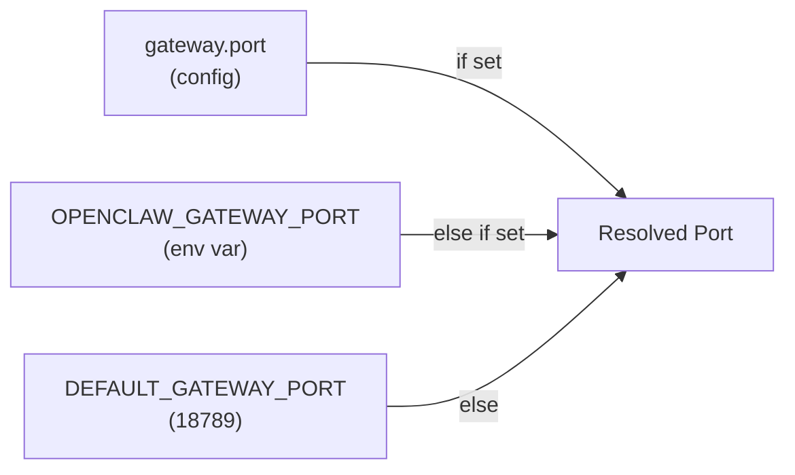
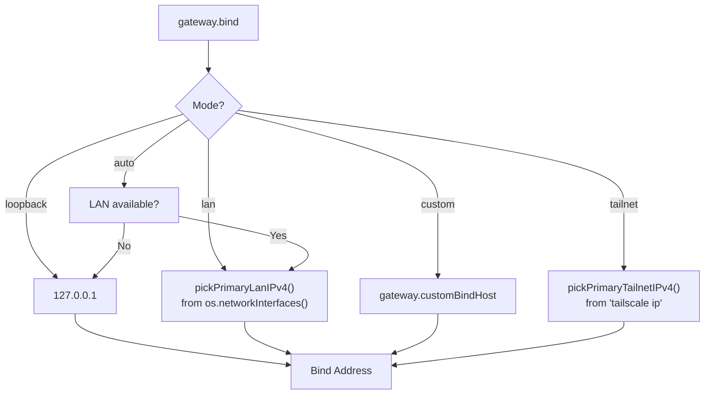
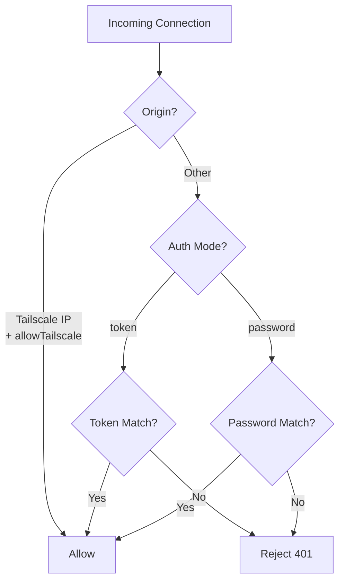
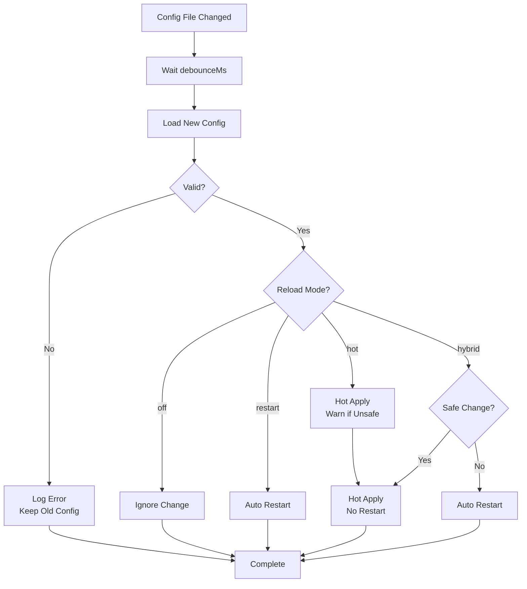

# Page: Gateway Configuration

# Gateway Configuration

<details>
<summary>Relevant source files</summary>

The following files were used as context for generating this wiki page:

- [CHANGELOG.md](CHANGELOG.md)
- [docs/cli/memory.md](docs/cli/memory.md)
- [docs/cli/sandbox.md](docs/cli/sandbox.md)
- [docs/concepts/memory.md](docs/concepts/memory.md)
- [docs/gateway/configuration.md](docs/gateway/configuration.md)
- [docs/gateway/doctor.md](docs/gateway/doctor.md)
- [docs/gateway/sandbox-vs-tool-policy-vs-elevated.md](docs/gateway/sandbox-vs-tool-policy-vs-elevated.md)
- [docs/gateway/sandboxing.md](docs/gateway/sandboxing.md)
- [docs/platforms/mac/skills.md](docs/platforms/mac/skills.md)
- [docs/tools/elevated.md](docs/tools/elevated.md)
- [docs/tools/index.md](docs/tools/index.md)
- [docs/tools/skills-config.md](docs/tools/skills-config.md)
- [src/agents/bash-tools.test.ts](src/agents/bash-tools.test.ts)
- [src/agents/memory-search.test.ts](src/agents/memory-search.test.ts)
- [src/agents/memory-search.ts](src/agents/memory-search.ts)
- [src/agents/pi-tools-agent-config.test.ts](src/agents/pi-tools-agent-config.test.ts)
- [src/agents/sandbox-explain.test.ts](src/agents/sandbox-explain.test.ts)
- [src/agents/sandbox-skills.test.ts](src/agents/sandbox-skills.test.ts)
- [src/agents/sandbox.ts](src/agents/sandbox.ts)
- [src/cli/memory-cli.test.ts](src/cli/memory-cli.test.ts)
- [src/cli/memory-cli.ts](src/cli/memory-cli.ts)
- [src/cli/models-cli.test.ts](src/cli/models-cli.test.ts)
- [src/commands/configure.gateway.test.ts](src/commands/configure.gateway.test.ts)
- [src/commands/configure.gateway.ts](src/commands/configure.gateway.ts)
- [src/commands/configure.ts](src/commands/configure.ts)
- [src/commands/doctor.ts](src/commands/doctor.ts)
- [src/commands/onboard-helpers.test.ts](src/commands/onboard-helpers.test.ts)
- [src/commands/onboard-helpers.ts](src/commands/onboard-helpers.ts)
- [src/commands/onboard-interactive.ts](src/commands/onboard-interactive.ts)
- [src/config/merge-config.ts](src/config/merge-config.ts)
- [src/config/schema.ts](src/config/schema.ts)
- [src/config/types.tools.ts](src/config/types.tools.ts)
- [src/config/types.ts](src/config/types.ts)
- [src/config/zod-schema.agent-runtime.ts](src/config/zod-schema.agent-runtime.ts)
- [src/config/zod-schema.ts](src/config/zod-schema.ts)
- [src/memory/embeddings.test.ts](src/memory/embeddings.test.ts)
- [src/memory/embeddings.ts](src/memory/embeddings.ts)
- [src/memory/manager.ts](src/memory/manager.ts)
- [src/wizard/onboarding.gateway-config.test.ts](src/wizard/onboarding.gateway-config.test.ts)
- [src/wizard/onboarding.gateway-config.ts](src/wizard/onboarding.gateway-config.ts)
- [src/wizard/onboarding.ts](src/wizard/onboarding.ts)
- [src/wizard/onboarding.types.ts](src/wizard/onboarding.types.ts)

</details>


This page documents the `gateway.*` configuration section, which controls the Gateway server's network binding, authentication, Tailscale integration, Control UI, and runtime behavior. The Gateway is OpenClaw's central WebSocket RPC server running on port 18789 by default.

For WebSocket protocol details, see [Gateway Protocol](#3.2). For service installation and lifecycle, see [Gateway Service Management](#3.3). For Tailscale/SSH remote access patterns, see [Remote Access](#3.4).

---

## Gateway Configuration Hierarchy

```mermaid
graph TB
    Root["gateway.*"]
    Root --> Mode["mode<br/>(local | remote)"]
    Root --> Port["port<br/>(default: 18789)"]
    Root --> Bind["bind<br/>(loopback | lan | auto | custom | tailnet)"]
    Root --> Auth["auth.*"]
    Root --> ControlUi["controlUi.*"]
    Root --> Tailscale["tailscale.*"]
    Root --> Remote["remote.*"]
    Root --> Reload["reload.*"]
    Root --> TLS["tls.*"]
    Root --> HTTP["http.*"]
    Root --> Nodes["nodes.*"]
    Root --> TrustedProxies["trustedProxies"]
    
    Auth --> AuthMode["mode (token | password)"]
    Auth --> Token["token"]
    Auth --> Password["password"]
    Auth --> AllowTailscale["allowTailscale"]
    
    ControlUi --> UiEnabled["enabled"]
    ControlUi --> UiBasePath["basePath"]
    ControlUi --> UiRoot["root"]
    ControlUi --> UiOrigins["allowedOrigins"]
    ControlUi --> UiInsecure["allowInsecureAuth"]
    ControlUi --> UiDangerousDisable["dangerouslyDisableDeviceAuth"]
    
    Tailscale --> TsMode["mode (off | serve | funnel)"]
    Tailscale --> TsReset["resetOnExit"]
    
    Remote --> RemoteUrl["url"]
    Remote --> RemoteTransport["transport (ssh | direct)"]
    Remote --> RemoteToken["token"]
    Remote --> RemotePassword["password"]
    Remote --> RemoteTlsFingerprint["tlsFingerprint"]
    Remote --> RemoteSsh["sshTarget<br/>sshIdentity"]
    
    Reload --> ReloadMode["mode (off | restart | hot | hybrid)"]
    Reload --> ReloadDebounce["debounceMs"]
    
    TLS --> TlsEnabled["enabled"]
    TLS --> TlsAutoGen["autoGenerate"]
    TLS --> TlsCerts["certPath<br/>keyPath<br/>caPath"]
    
    HTTP --> Endpoints["endpoints.*"]
    Endpoints --> ChatCompletions["chatCompletions.enabled"]
    Endpoints --> Responses["responses.*"]
    
    Nodes --> NodeBrowser["browser.mode<br/>browser.node"]
    Nodes --> NodeAllow["allowCommands"]
    Nodes --> NodeDeny["denyCommands"]
```



**Sources:** [src/config/zod-schema.ts:370-516](), [docs/gateway/configuration.md:1-480]()

---

## Gateway Mode

The `gateway.mode` field determines whether this instance runs a local Gateway or connects to a remote one.

| Mode | Description | Use Case |
|------|-------------|----------|
| `local` | Run Gateway server on this machine | Default; local or VPS deployments |
| `remote` | Connect to a remote Gateway (client-only) | Laptop/desktop connecting to a VPS Gateway |

When `mode: "remote"`, the `gateway.remote.*` section configures the connection. All other Gateway server settings (`port`, `bind`, `auth`, `controlUi`) are ignored in remote mode.

**Example:**

```json5
{
  gateway: {
    mode: "local",
    port: 18789
  }
}
```

**Sources:** [src/config/zod-schema.ts:372](), [src/wizard/onboarding.ts:61-63]()

---

## Port and Network Binding

### Port

`gateway.port` sets the TCP port for the WebSocket server. Default: `18789`.

```json5
{
  gateway: {
    port: 18789
  }
}
```

**Resolution:**



**Sources:** [src/config/config.ts:37](), [src/commands/onboard-helpers.ts:294]()

### Bind Mode

`gateway.bind` controls which network interface(s) the Gateway listens on.

| Mode | Behavior | Resolved Address |
|------|----------|------------------|
| `loopback` | Bind to `127.0.0.1` only | `127.0.0.1` |
| `lan` | Bind to primary LAN IPv4 | `pickPrimaryLanIPv4()` |
| `auto` | Auto-detect (LAN if available, else loopback) | LAN IPv4 or `127.0.0.1` |
| `custom` | Bind to `gateway.customBindHost` | User-specified IP |
| `tailnet` | Bind to Tailscale IP | `pickPrimaryTailnetIPv4()` |

**Default:** `loopback` for security.

**Bind Resolution Flow:**



**Example:**

```json5
{
  gateway: {
    bind: "lan",
    port: 18789
  }
}
```

For custom bind:

```json5
{
  gateway: {
    bind: "custom",
    customBindHost: "192.168.1.100"
  }
}
```

**Sources:** [src/gateway/net.ts:1-100](), [src/commands/onboard-helpers.ts:190-239]()

---

## Authentication

The `gateway.auth` section configures access control for the Gateway WebSocket endpoint.

### Auth Modes

| Mode | Description | Credential |
|------|-------------|-----------|
| `token` | Bearer token auth (recommended) | `gateway.auth.token` or `OPENCLAW_GATEWAY_TOKEN` |
| `password` | Password auth | `gateway.auth.password` or `OPENCLAW_GATEWAY_PASSWORD` |

**Default:** `token` mode is now recommended for all deployments (including loopback).

### Token Auth (Recommended)

```json5
{
  gateway: {
    auth: {
      mode: "token",
      token: "your-secure-random-token"
    }
  }
}
```

Generate a token:

```bash
openclaw doctor --generate-gateway-token
```

Or manually:

```bash
node -e "console.log(require('crypto').randomBytes(24).toString('hex'))"
```

### Password Auth

```json5
{
  gateway: {
    auth: {
      mode: "password",
      password: "your-secure-password"
    }
  }
}
```

### Tailscale Auth Bypass

When `gateway.auth.allowTailscale: true`, Tailscale-sourced connections skip auth checks. Requires `gateway.bind: "tailnet"` or `gateway.tailscale.mode: "serve" | "funnel"`.

```json5
{
  gateway: {
    bind: "tailnet",
    auth: {
      mode: "token",
      token: "fallback-token",
      allowTailscale: true
    }
  }
}
```

**Auth Resolution:**



**Sources:** [src/gateway/auth.ts:1-150](), [src/config/zod-schema.ts:394-402]()

---

## Control UI

The `gateway.controlUi` section configures the built-in web dashboard served at `http://<gateway>:18789/`.

### Options

| Field | Type | Description | Default |
|-------|------|-------------|---------|
| `enabled` | `boolean` | Enable Control UI | `true` |
| `basePath` | `string` | URL path prefix (e.g., `/ui`) | `""` (root) |
| `root` | `string` | Custom UI asset directory | Built-in UI bundle |
| `allowedOrigins` | `string[]` | CORS origins for UI requests | `[]` (same-origin only) |
| `allowInsecureAuth` | `boolean` | Skip HTTPS requirement for auth | `false` |
| `dangerouslyDisableDeviceAuth` | `boolean` | Disable device identity requirement | `false` |

**Example:**

```json5
{
  gateway: {
    port: 18789,
    controlUi: {
      enabled: true,
      basePath: "/dashboard",
      allowedOrigins: ["https://openclaw.example.com"]
    }
  }
}
```

The UI is then accessible at `http://127.0.0.1:18789/dashboard/`.

### Base Path Normalization

The `basePath` is normalized by `normalizeControlUiBasePath()`:

- Strips leading/trailing slashes
- Returns empty string for `/` or falsy values
- Returns `/<cleaned-path>` otherwise

**Sources:** [src/config/zod-schema.ts:383-393](), [src/gateway/control-ui-shared.ts:1-50]()

---

## Tailscale Integration

OpenClaw can expose the Gateway via Tailscale Serve (private) or Funnel (public).

### Modes

| Mode | Description | Access |
|------|-------------|--------|
| `off` | Tailscale not used | N/A |
| `serve` | Tailscale Serve (private) | Tailnet only |
| `funnel` | Tailscale Funnel (public) | Internet-accessible |

### Configuration

```json5
{
  gateway: {
    tailscale: {
      mode: "serve",
      resetOnExit: true
    }
  }
}
```

**Fields:**

- `mode`: `"off" | "serve" | "funnel"`
- `resetOnExit`: If `true`, runs `tailscale serve reset` on Gateway shutdown (default: `false`)

### Tailscale + Bind Interaction

When `tailscale.mode` is `serve` or `funnel`, the Gateway still binds to the configured `gateway.bind` address. Tailscale forwards traffic to that bind address.

**Recommended:**

```json5
{
  gateway: {
    bind: "loopback",
    tailscale: {
      mode: "serve"
    }
  }
}
```

This keeps the Gateway bound to `127.0.0.1` while Tailscale proxies external traffic.

**Sources:** [src/config/zod-schema.ts:404-410](), [src/commands/onboard-helpers.ts:222-227]()

---

## Remote Gateway Configuration

When `gateway.mode: "remote"`, the `gateway.remote` section configures connection to a remote Gateway.

### Fields

| Field | Type | Description |
|-------|------|-------------|
| `url` | `string` | WebSocket URL (e.g., `wss://gateway.example.com`) |
| `transport` | `"ssh" \| "direct"` | Connection transport |
| `token` | `string` | Auth token for remote Gateway |
| `password` | `string` | Auth password for remote Gateway |
| `tlsFingerprint` | `string` | Expected TLS cert fingerprint (optional) |
| `sshTarget` | `string` | SSH tunnel target (e.g., `user@host`) |
| `sshIdentity` | `string` | SSH key path |

### Direct Transport

```json5
{
  gateway: {
    mode: "remote",
    remote: {
      url: "wss://gateway.example.com:18789",
      transport: "direct",
      token: "your-remote-token"
    }
  }
}
```

### SSH Transport

```json5
{
  gateway: {
    mode: "remote",
    remote: {
      url: "ws://127.0.0.1:18789",
      transport: "ssh",
      sshTarget: "user@remote-host",
      sshIdentity: "~/.ssh/id_ed25519",
      token: "remote-gateway-token"
    }
  }
}
```

The SSH transport establishes an SSH tunnel (`-L 18789:127.0.0.1:18789`) before connecting.

**Sources:** [src/config/zod-schema.ts:411-423](), [src/commands/onboard-remote.ts:1-100]()

---

## Config Hot Reload

The Gateway watches `~/.openclaw/openclaw.json` and applies changes automatically.

### Reload Modes

| Mode | Behavior |
|------|----------|
| `hybrid` (default) | Hot-apply safe changes; auto-restart for critical ones |
| `hot` | Hot-apply safe changes only; log warnings for critical ones |
| `restart` | Always restart on any config change |
| `off` | No file watching; changes apply on manual restart |

### Configuration

```json5
{
  gateway: {
    reload: {
      mode: "hybrid",
      debounceMs: 300
    }
  }
}
```

**Fields:**

- `mode`: `"off" | "restart" | "hot" | "hybrid"`
- `debounceMs`: Delay before processing detected changes (default: `300`)

### Hot-Reload Decision Tree



### Safe vs Restart-Required Changes

**Safe (hot-apply):**

- `channels.*`
- `agents.*`
- `tools.*`
- `hooks.*`
- `cron.*`
- `session.*`
- `messages.*`
- `browser.*`
- `skills.*`
- `ui.*`
- `logging.*`

**Restart-required:**

- `gateway.port`
- `gateway.bind`
- `gateway.customBindHost`
- `gateway.auth.mode`
- `gateway.auth.token`
- `gateway.auth.password`
- `gateway.tailscale.mode`
- `gateway.tls.*`
- `gateway.http.*`
- `plugins.*`
- `discovery.*`
- `canvasHost.*`

**Note:** Changes to `gateway.reload` and `gateway.remote` do **not** trigger a restart.

**Sources:** [docs/gateway/configuration.md:327-366](), [src/config/zod-schema.ts:423-436]()

---

## TLS Configuration

The `gateway.tls` section enables HTTPS/WSS support.

### Fields

| Field | Type | Description |
|-------|------|-------------|
| `enabled` | `boolean` | Enable TLS |
| `autoGenerate` | `boolean` | Auto-generate self-signed cert |
| `certPath` | `string` | Path to TLS certificate |
| `keyPath` | `string` | Path to TLS private key |
| `caPath` | `string` | Path to CA cert (optional) |

### Auto-Generated Certs

```json5
{
  gateway: {
    tls: {
      enabled: true,
      autoGenerate: true
    }
  }
}
```

The Gateway generates a self-signed certificate on startup. Requires TLS 1.3 minimum.

### Custom Certs

```json5
{
  gateway: {
    tls: {
      enabled: true,
      certPath: "/etc/openclaw/cert.pem",
      keyPath: "/etc/openclaw/key.pem"
    }
  }
}
```

**Sources:** [src/config/zod-schema.ts:437-445]()

---

## HTTP Endpoints

The `gateway.http.endpoints` section enables OpenAI-compatible HTTP endpoints.

### Chat Completions

Enable the `/v1/chat/completions` endpoint:

```json5
{
  gateway: {
    http: {
      endpoints: {
        chatCompletions: {
          enabled: true
        }
      }
    }
  }
}
```

### Responses API

Enable the `/v1/responses` endpoint for multimodal inputs:

```json5
{
  gateway: {
    http: {
      endpoints: {
        responses: {
          enabled: true,
          maxBodyBytes: 10485760,
          files: {
            allowUrl: true,
            allowedMimes: ["application/pdf", "text/plain"],
            maxBytes: 5242880,
            maxChars: 100000,
            maxRedirects: 3,
            timeoutMs: 30000,
            pdf: {
              maxPages: 50,
              maxPixels: 2073600,
              minTextChars: 100
            }
          },
          images: {
            allowUrl: true,
            allowedMimes: ["image/png", "image/jpeg"],
            maxBytes: 5242880,
            maxRedirects: 3,
            timeoutMs: 15000
          }
        }
      }
    }
  }
}
```

**Sources:** [src/config/zod-schema.ts:446-497]()

---

## Node Management

The `gateway.nodes` section controls node pairing and command execution.

### Browser Node Routing

```json5
{
  gateway: {
    nodes: {
      browser: {
        mode: "auto",
        node: "office-mac"
      }
    }
  }
}
```

**Fields:**

- `mode`: `"auto" | "manual" | "off"`
  - `auto`: Route browser tool to paired nodes automatically
  - `manual`: Only use `browser.node` if specified
  - `off`: Never route to nodes
- `node`: Default node id/name for browser routing

### Command Allowlists

```json5
{
  gateway: {
    nodes: {
      allowCommands: ["ls", "echo", "cat"],
      denyCommands: ["rm", "dd"]
    }
  }
}
```

When a node executes `system.run`, these lists gate allowed binaries.

**Sources:** [src/config/zod-schema.ts:498-513]()

---

## Trusted Proxies

The `gateway.trustedProxies` field configures proxy IP trust for header forwarding.

```json5
{
  gateway: {
    trustedProxies: ["127.0.0.1", "10.0.0.0/8"]
  }
}
```

When the Gateway sits behind a reverse proxy (nginx, Caddy, Tailscale), this setting allows header forwarding (`X-Forwarded-For`, `X-Real-IP`).

**Sources:** [src/config/zod-schema.ts:403]()

---

## Configuration Code Entity Map

The following diagram maps configuration keys to resolver functions and data structures:

```mermaid
graph TB
    Config["OpenClawConfig<br/>(types.openclaw.ts)"]
    Config --> GatewayConfig["gateway: GatewayConfig"]
    
    GatewayConfig --> GatewayMode["mode: GatewayMode<br/>(resolveMode)"]
    GatewayConfig --> GatewayPort["port: number<br/>(resolveGatewayPort)"]
    GatewayConfig --> GatewayBind["bind: GatewayBindMode<br/>(resolveBindAddress)"]
    GatewayConfig --> GatewayAuth["auth: GatewayAuthConfig<br/>(resolveGatewayAuth)"]
    GatewayConfig --> GatewayControlUi["controlUi: GatewayControlUiConfig<br/>(normalizeControlUiBasePath)"]
    GatewayConfig --> GatewayTailscale["tailscale: GatewayTailscaleConfig"]
    GatewayConfig --> GatewayRemote["remote: GatewayRemoteConfig<br/>(buildGatewayConnectionDetails)"]
    GatewayConfig --> GatewayReload["reload: GatewayReloadConfig"]
    GatewayConfig --> GatewayTls["tls: GatewayTlsConfig"]
    GatewayConfig --> GatewayHttp["http: GatewayHttpConfig"]
    GatewayConfig --> GatewayNodes["nodes: GatewayNodesConfig"]
    GatewayConfig --> TrustedProxies["trustedProxies: string[]"]
    
    Resolvers["Resolver Functions"]
    Resolvers --> ResolveGatewayPort["resolveGatewayPort()<br/>src/config/config.ts:37"]
    Resolvers --> ResolveMode["resolveMode()<br/>src/commands/doctor.ts:61"]
    Resolvers --> ResolveBindAddress["resolveBindAddress()<br/>gateway/net.ts"]
    Resolvers --> ResolveGatewayAuth["resolveGatewayAuth()<br/>gateway/auth.ts"]
    Resolvers --> BuildConnectionDetails["buildGatewayConnectionDetails()<br/>gateway/call.ts"]
    Resolvers --> NormalizeBasePath["normalizeControlUiBasePath()<br/>gateway/control-ui-shared.ts"]
    
    Schema["Zod Schema"]
    Schema --> OpenClawSchema["OpenClawSchema<br/>src/config/zod-schema.ts:95-632"]
    OpenClawSchema --> GatewaySchema["gateway: z.object()<br/>lines 370-516"]
```



**Sources:** [src/config/types.gateway.ts:1-100](), [src/config/config.ts:37](), [src/gateway/auth.ts:1-150](), [src/gateway/net.ts:1-100]()

---

## Gateway Configuration Examples

### Minimal Local Gateway

```json5
{
  gateway: {
    mode: "local",
    port: 18789,
    auth: {
      mode: "token",
      token: "your-token-here"
    }
  }
}
```

### VPS Gateway (LAN Bind + Token Auth)

```json5
{
  gateway: {
    mode: "local",
    port: 18789,
    bind: "lan",
    auth: {
      mode: "token",
      token: "secure-random-token"
    },
    controlUi: {
      enabled: true
    }
  }
}
```

### Tailscale Private Gateway

```json5
{
  gateway: {
    mode: "local",
    bind: "loopback",
    tailscale: {
      mode: "serve"
    },
    auth: {
      mode: "token",
      token: "fallback-token",
      allowTailscale: true
    }
  }
}
```

### Remote Gateway Client

```json5
{
  gateway: {
    mode: "remote",
    remote: {
      url: "wss://gateway.example.com:18789",
      transport: "direct",
      token: "remote-token"
    }
  }
}
```

### Custom Bind + TLS

```json5
{
  gateway: {
    bind: "custom",
    customBindHost: "192.168.1.100",
    tls: {
      enabled: true,
      certPath: "/etc/certs/openclaw.crt",
      keyPath: "/etc/certs/openclaw.key"
    },
    auth: {
      mode: "token",
      token: "production-token"
    }
  }
}
```

**Sources:** [docs/gateway/configuration.md:26-34](), [src/wizard/onboarding.ts:355-368]()

---

## Related Configuration

The Gateway coordinates with other subsystems via their config sections:

- **Channels** (`channels.*`): Gateway routes inbound messages from channels to agents
- **Agents** (`agents.*`): Gateway spawns agent sessions and tool execution
- **Discovery** (`discovery.*`): Gateway advertises itself via mDNS/wide-area discovery
- **Canvas Host** (`canvasHost.*`): Optional HTTP server for Canvas UI (separate from Gateway)

Hot-reload applies to most of these sections without restarting the Gateway. See [Config Hot Reload](#config-hot-reload) for details.

**Sources:** [src/config/zod-schema.ts:95-632](), [docs/gateway/configuration.md:327-366]()

---