# Page: Gateway Protocol

# Gateway Protocol

<details>
<summary>Relevant source files</summary>

The following files were used as context for generating this wiki page:

- [src/commands/agent.test.ts](src/commands/agent.test.ts)
- [src/commands/agent.ts](src/commands/agent.ts)
- [src/cron/isolated-agent.ts](src/cron/isolated-agent.ts)
- [src/cron/run-log.test.ts](src/cron/run-log.test.ts)
- [src/cron/run-log.ts](src/cron/run-log.ts)
- [src/cron/store.ts](src/cron/store.ts)
- [src/gateway/protocol/index.ts](src/gateway/protocol/index.ts)
- [src/gateway/protocol/schema.ts](src/gateway/protocol/schema.ts)
- [src/gateway/protocol/schema/agents-models-skills.ts](src/gateway/protocol/schema/agents-models-skills.ts)
- [src/gateway/protocol/schema/protocol-schemas.ts](src/gateway/protocol/schema/protocol-schemas.ts)
- [src/gateway/protocol/schema/types.ts](src/gateway/protocol/schema/types.ts)
- [src/gateway/server-methods-list.ts](src/gateway/server-methods-list.ts)
- [src/gateway/server-methods.ts](src/gateway/server-methods.ts)
- [src/gateway/server-methods/agents.ts](src/gateway/server-methods/agents.ts)
- [src/gateway/server.ts](src/gateway/server.ts)

</details>


The Gateway Protocol is the WebSocket-based communication protocol used by all clients to interact with the OpenClaw Gateway. This page describes the frame structure, authentication model, method catalog, and schema validation system. For Gateway server configuration and deployment, see [Gateway Configuration](#3.1). For details on remote access patterns, see [Remote Access](#3.4).

---

## Overview

The Gateway exposes a single WebSocket endpoint at `ws://127.0.0.1:18789` (default) that handles:

- CLI commands (`openclaw agent`, `openclaw send`, etc.)
- Control UI dashboard operations
- macOS/iOS/Android companion app connections
- Device node pairing and invocations
- Real-time event streaming (agent runs, presence updates, cron jobs)

All communication follows a JSON-RPC-style request/response pattern with typed schemas validated via Ajv. The protocol distinguishes between **operator** clients (humans, dashboards) and **node** clients (device companions) with role-based method authorization.

**Sources:** [src/gateway/protocol/index.ts:1-595](), [src/gateway/server-methods.ts:1-220]()

---

## Frame Types

The protocol uses three frame types, all serialized as JSON over WebSocket messages:

| Frame Type | Direction | Purpose |
|------------|-----------|---------|
| `RequestFrame` | Client → Server | Invoke a Gateway method |
| `ResponseFrame` | Server → Client | Return result or error for a request |
| `EventFrame` | Server → Client | Push async notifications (agent events, presence, cron) |

### RequestFrame Structure

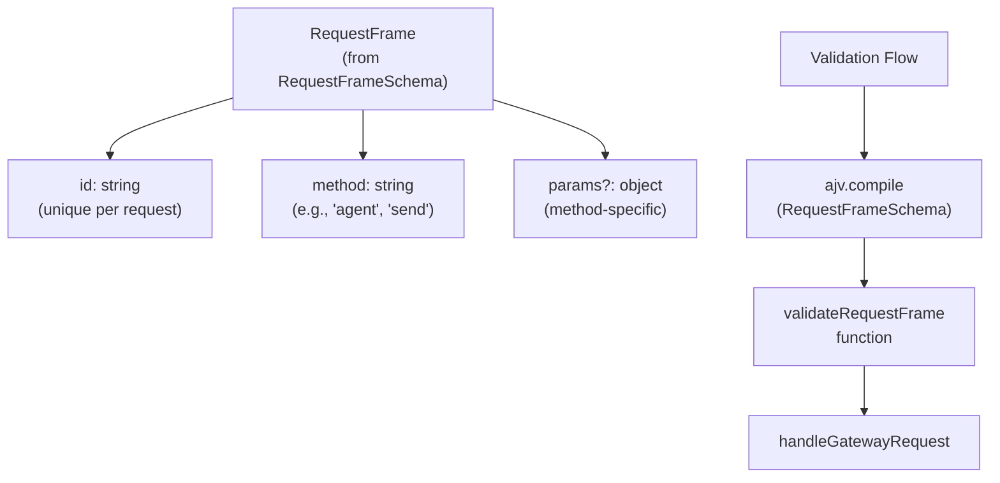

**Validation:** The `validateRequestFrame` function is compiled from `RequestFrameSchema` using Ajv at [src/gateway/protocol/index.ts:230]().

**Sources:** [src/gateway/protocol/schema/frames.ts](), [src/gateway/protocol/index.ts:230](), [src/gateway/server-methods.ts:193-219]()

---

### ResponseFrame Structure

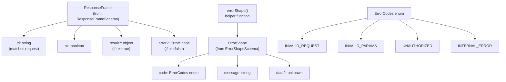

**ErrorShape construction:** The `errorShape()` helper function at [src/gateway/protocol/schema/error-codes.ts]() constructs error responses with the proper structure.

**Sources:** [src/gateway/protocol/schema/frames.ts](), [src/gateway/protocol/schema/error-codes.ts](), [src/gateway/protocol/index.ts:231]()

---

### EventFrame Structure

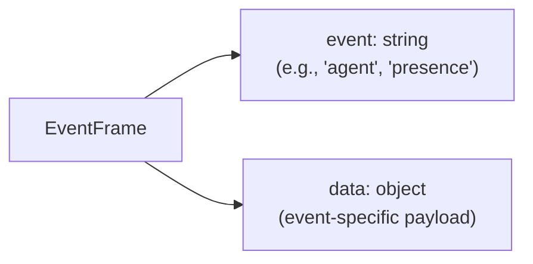

**Event types (from `GATEWAY_EVENTS`):**
- `agent` → Agent execution streams (lifecycle, assistant, tool, reasoning, debug)
- `chat` → WebChat message events
- `presence` → Session/agent status updates
- `tick` → Periodic keepalive (every 20s)
- `shutdown` → Gateway shutdown notification
- `cron` → Cron job lifecycle events
- `node.pair.requested`, `node.pair.resolved` → Node pairing workflow
- `device.pair.requested`, `device.pair.resolved` → Device pairing workflow
- `exec.approval.requested`, `exec.approval.resolved` → Exec approval prompts
- `connect.challenge` → Initial connection challenge
- `talk.mode` → Talk mode changes
- `heartbeat` → Heartbeat events
- `voicewake.changed` → Voice wake configuration changes
- `health` → Health status updates
- `node.invoke.request` → Node invocation requests

**Sources:** [src/gateway/protocol/schema/frames.ts](), [src/gateway/server-methods-list.ts:98-117]()

---

## Connection Lifecycle

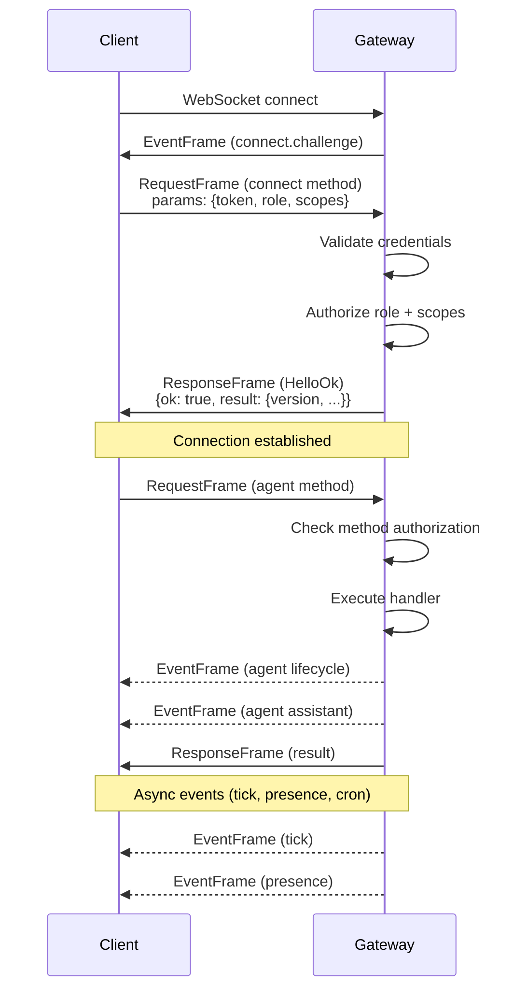

**Sources:** [src/gateway/protocol/schema/frames.ts](), [src/gateway/server-methods/connect.ts]()

---

## Authentication and Authorization

### Connection Roles

The protocol supports two roles defined in `ConnectParams.role`:

- **`operator`** (default): Human clients, dashboards, CLI. Requires token/password auth.
- **`node`**: Device companions (macOS/iOS/Android apps). Uses Bonjour/mDNS discovery + pairing flow.

### Operator Scopes

Operators can have multiple scopes granted via `ConnectParams.scopes[]`:

| Scope | Methods Allowed |
|-------|-----------------|
| `operator.admin` | Full access: `config.*`, `wizard.*`, `update.*`, `channels.logout`, `skills.install`, `skills.update`, `cron.add/update/remove`, `sessions.patch/reset/delete/compact`, `exec.approvals.*` |
| `operator.read` | Read-only: `health`, `logs.tail`, `channels.status`, `status`, `usage.*`, `models.list`, `agents.list`, `sessions.list`, `cron.list/status`, `node.list/describe` |
| `operator.write` | Execution: `send`, `agent`, `agent.wait`, `wake`, `talk.mode`, `tts.*`, `voicewake.*`, `node.invoke`, `chat.send/abort`, `browser.request` |
| `operator.approvals` | Exec approval flow: `exec.approval.request`, `exec.approval.resolve` |
| `operator.pairing` | Device management: `node.pair.*`, `device.pair.*`, `device.token.*`, `node.rename` |

**Default scopes:** When a client connects with valid token/password but no explicit scopes, the server grants `operator.admin` (full access).

**Authorization enforcement:** [src/gateway/server-methods.ts:93-163]()

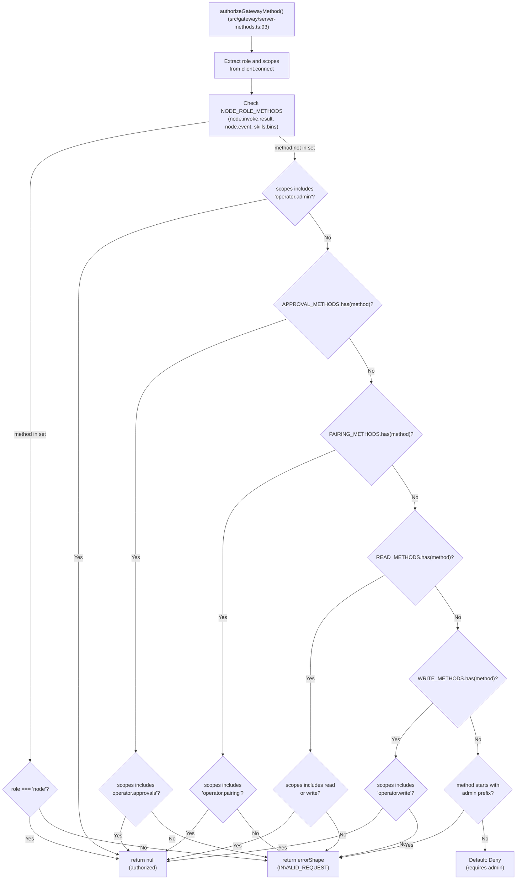

**Method sets:** The authorization logic uses predefined sets:
- `NODE_ROLE_METHODS` (line 36): `node.invoke.result`, `node.event`, `skills.bins`
- `APPROVAL_METHODS` (line 35): `exec.approval.request`, `exec.approval.resolve`
- `PAIRING_METHODS` (lines 37-49): All `node.pair.*`, `device.pair.*`, `device.token.*`, `node.rename`
- `ADMIN_METHOD_PREFIXES` (line 50): `exec.approvals.*`
- `READ_METHODS` (lines 51-75): Status/list operations
- `WRITE_METHODS` (lines 76-91): Execution operations

**Sources:** [src/gateway/server-methods.ts:29-163](), [src/gateway/server-methods.ts:193-219]()

---

## Method Catalog

The Gateway exposes 80+ methods across 12 functional areas. All methods are listed in `listGatewayMethods()`.

### Core Methods

All methods are registered in `coreGatewayHandlers` [src/gateway/server-methods.ts:165-191]() and listed in `BASE_METHODS` [src/gateway/server-methods-list.ts:3-91]().

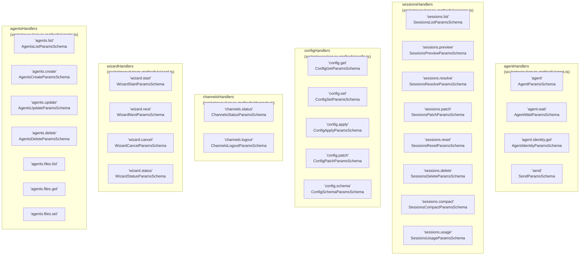

**Sources:** [src/gateway/server-methods-list.ts:3-91](), [src/gateway/server-methods.ts:165-191]()

---

### Node & Device Methods

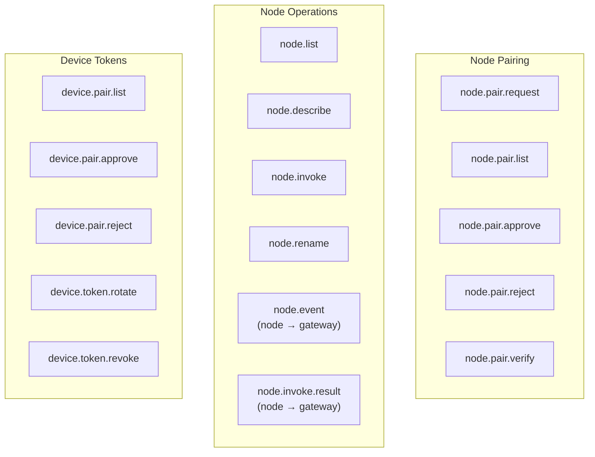

**Sources:** [src/gateway/server-methods-list.ts:37-49](), [src/gateway/server-methods/nodes.ts]()

---

### Admin Methods

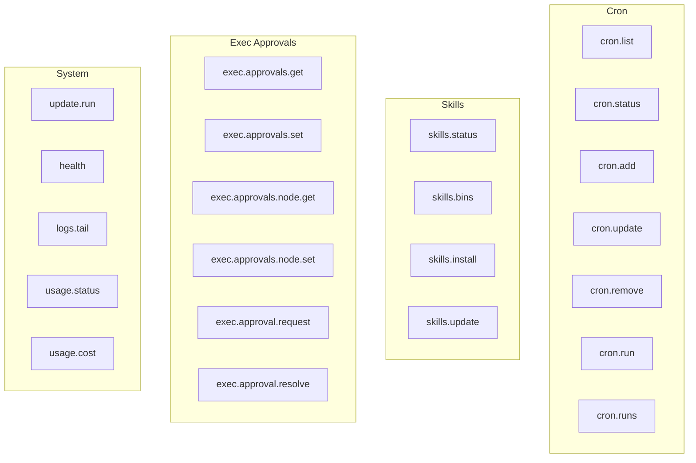

**Sources:** [src/gateway/server-methods-list.ts:40-76](), [src/gateway/server-methods/cron.ts](), [src/gateway/server-methods/skills.ts](), [src/gateway/server-methods/exec-approvals.ts]()

---

### WebChat Methods

WebChat uses a specialized set of methods for real-time chat:

- `chat.history` → Fetch previous messages
- `chat.send` → Send user message, stream agent response via `chat` events
- `chat.abort` → Cancel active run
- `chat.inject` → Inject system message (e.g., file attachment notification)

**Sources:** [src/gateway/server-methods/chat.ts](), [src/gateway/server-methods-list.ts:84-87]()

---

## Schema Validation

All protocol messages are validated using **Ajv** with **TypeBox** schemas. The validation layer prevents malformed requests and ensures type safety between TypeScript clients and the Gateway.

### Validator Registry

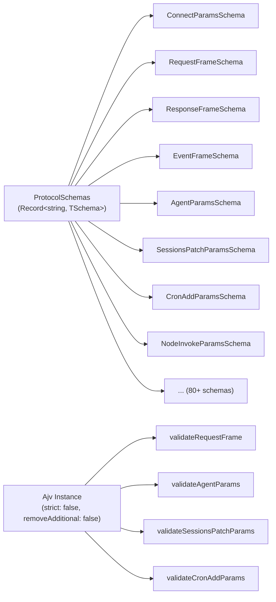

**Key validators compiled from schemas:**
- `validateConnectParams` → [src/gateway/protocol/index.ts:229]()
- `validateRequestFrame` → [src/gateway/protocol/index.ts:230]()
- `validateResponseFrame` → [src/gateway/protocol/index.ts:231]()
- `validateEventFrame` → [src/gateway/protocol/index.ts:232]()
- `validateAgentParams` → [src/gateway/protocol/index.ts:235]()
- `validateSessionsPatchParams` → [src/gateway/protocol/index.ts:281]()
- `validateCronAddParams` → [src/gateway/protocol/index.ts:317]()
- `validateNodeInvokeParams` → [src/gateway/protocol/index.ts:269]()

**Error formatting:** When validation fails, `formatValidationErrors()` [src/gateway/protocol/index.ts:366-400]() converts Ajv error objects into human-readable messages with instance paths. For example:
- `"at /params/message: must be non-empty string"`
- `"at root: unexpected property 'extraField'"`

The function handles `additionalProperties` errors specially to provide clearer messages about unexpected fields.

**Sources:** [src/gateway/protocol/index.ts:229-400](), [src/gateway/protocol/schema/protocol-schemas.ts:1-259]()

---

## Protocol Version

The protocol version is defined as `PROTOCOL_VERSION = 3` at [src/gateway/protocol/schema/protocol-schemas.ts:258](). This constant is sent in the `HelloOk` response after successful connection and can be used by clients for compatibility checks.

**Version handshake:**
1. Client connects and sends `connect` request with `ConnectParams`
2. Gateway validates credentials and role via `authorizeGatewayMethod()`
3. Gateway responds with `HelloOk` containing `version: PROTOCOL_VERSION`
4. Client stores version and uses it for feature detection

The protocol version increments when breaking changes are made to frame structures or core method signatures.

**Sources:** [src/gateway/protocol/schema/protocol-schemas.ts:258](), [src/gateway/protocol/schema/frames.ts](), [src/gateway/server-methods/connect.ts]()

---

## Request Handler Pipeline

Every incoming request passes through this pipeline:

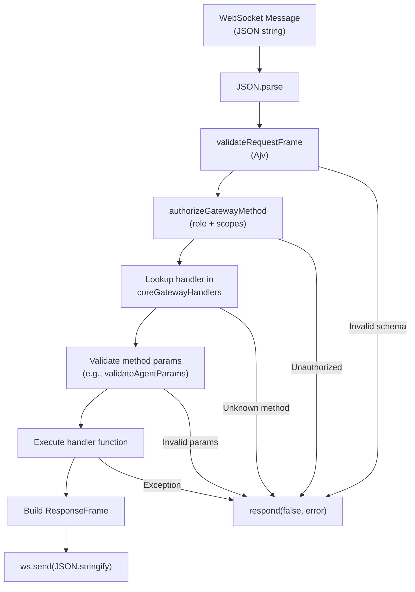

**Handler registration:** All core handlers are merged in `coreGatewayHandlers` [src/gateway/server-methods.ts:165-191]()

```mermaid
graph TB
    coreGatewayHandlers["coreGatewayHandlers<br/>(GatewayRequestHandlers)"]
    coreGatewayHandlers --> connectHandlers["connectHandlers<br/>server-methods/connect.ts"]
    coreGatewayHandlers --> logsHandlers["logsHandlers<br/>server-methods/logs.ts"]
    coreGatewayHandlers --> voicewakeHandlers["voicewakeHandlers<br/>server-methods/voicewake.ts"]
    coreGatewayHandlers --> healthHandlers["healthHandlers<br/>server-methods/health.ts"]
    coreGatewayHandlers --> channelsHandlers["channelsHandlers<br/>server-methods/channels.ts"]
    coreGatewayHandlers --> chatHandlers["chatHandlers<br/>server-methods/chat.ts"]
    coreGatewayHandlers --> cronHandlers["cronHandlers<br/>server-methods/cron.ts"]
    coreGatewayHandlers --> deviceHandlers["deviceHandlers<br/>server-methods/devices.ts"]
    coreGatewayHandlers --> execApprovalsHandlers["execApprovalsHandlers<br/>server-methods/exec-approvals.ts"]
    coreGatewayHandlers --> webHandlers["webHandlers<br/>server-methods/web.ts"]
    coreGatewayHandlers --> modelsHandlers["modelsHandlers<br/>server-methods/models.ts"]
    coreGatewayHandlers --> configHandlers["configHandlers<br/>server-methods/config.ts"]
    coreGatewayHandlers --> wizardHandlers["wizardHandlers<br/>server-methods/wizard.ts"]
    coreGatewayHandlers --> talkHandlers["talkHandlers<br/>server-methods/talk.ts"]
    coreGatewayHandlers --> ttsHandlers["ttsHandlers<br/>server-methods/tts.ts"]
    coreGatewayHandlers --> skillsHandlers["skillsHandlers<br/>server-methods/skills.ts"]
    coreGatewayHandlers --> sessionsHandlers["sessionsHandlers<br/>server-methods/sessions.ts"]
    coreGatewayHandlers --> systemHandlers["systemHandlers<br/>server-methods/system.ts"]
    coreGatewayHandlers --> updateHandlers["updateHandlers<br/>server-methods/update.ts"]
    coreGatewayHandlers --> nodeHandlers["nodeHandlers<br/>server-methods/nodes.ts"]
    coreGatewayHandlers --> sendHandlers["sendHandlers<br/>server-methods/send.ts"]
    coreGatewayHandlers --> usageHandlers["usageHandlers<br/>server-methods/usage.ts"]
    coreGatewayHandlers --> agentHandlers["agentHandlers<br/>server-methods/agent.ts"]
    coreGatewayHandlers --> agentsHandlers["agentsHandlers<br/>server-methods/agents.ts"]
    coreGatewayHandlers --> browserHandlers["browserHandlers<br/>server-methods/browser.ts"]
```

**Handler execution:** `handleGatewayRequest()` [src/gateway/server-methods.ts:193-219]() routes each method to its handler:

1. Authorize via `authorizeGatewayMethod()`
2. Look up handler in `coreGatewayHandlers` or `extraHandlers`
3. Execute handler with validated params
4. Return `ResponseFrame` via `respond()` callback

**Sources:** [src/gateway/server-methods.ts:1-220](), [src/gateway/server.impl.ts]()

---

## Event Streaming

Events are pushed from the Gateway to clients without a corresponding request. Events are used for:

- **Real-time agent updates:** `agent` events carry lifecycle phases, assistant text deltas, tool calls, reasoning traces, and debug logs. The `runId` field associates events with the originating request.
- **Presence updates:** `presence` events notify when sessions/agents become active or idle.
- **Cron notifications:** `cron` events report job start/completion.
- **Pairing workflows:** `node.pair.requested` → operator approves → `node.pair.resolved`.
- **Exec approvals:** `exec.approval.requested` → operator approves → `exec.approval.resolved`.

**Event emission architecture:**

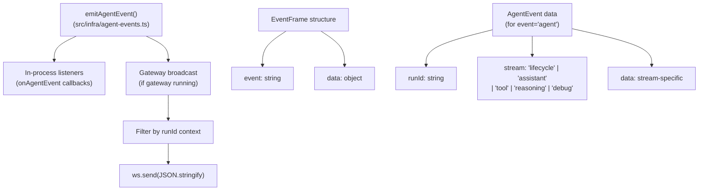

The Gateway server registers an agent event listener during startup that broadcasts events to connected WebSocket clients. The `runId` field in agent events allows clients to correlate events with specific requests.

**Sources:** [src/gateway/protocol/schema/frames.ts](), [src/infra/agent-events.ts](), [src/gateway/protocol/schema/agent.ts]()

---

## Error Codes

The protocol defines error codes in the `ErrorCodes` enum:

| Code | Meaning |
|------|---------|
| `INVALID_REQUEST` | Malformed request, unknown method, unauthorized |
| `INVALID_PARAMS` | Schema validation failed for method params |
| `METHOD_NOT_FOUND` | Handler not registered for method |
| `INTERNAL_ERROR` | Uncaught exception in handler |
| `UNAUTHORIZED` | Token/password auth failed |
| `FORBIDDEN` | Role/scope check failed |
| `NOT_FOUND` | Resource (session, job, node) not found |
| `CONFLICT` | State conflict (e.g., session already exists) |
| `RATE_LIMIT` | Too many requests |

**Sources:** [src/gateway/protocol/schema/error-codes.ts]()

---

## Example Request/Response Flow

### Agent Execution

**Request:**
```json
{
  "id": "req-123",
  "method": "agent",
  "params": {
    "message": "Hello",
    "sessionKey": "agent:main:telegram:12345",
    "thinking": "low",
    "deliver": true
  }
}
```

**Response:**
```json
{
  "id": "req-123",
  "ok": true,
  "result": {
    "runId": "run-abc",
    "sessionId": "sess-456",
    "delivered": true
  }
}
```

**Events (streamed during execution):**
```json
{"event": "agent", "data": {"runId": "run-abc", "stream": "lifecycle", "data": {"phase": "start"}}}
{"event": "agent", "data": {"runId": "run-abc", "stream": "assistant", "data": {"delta": "Hello! "}}}
{"event": "agent", "data": {"runId": "run-abc", "stream": "assistant", "data": {"delta": "How can I help?"}}}
{"event": "agent", "data": {"runId": "run-abc", "stream": "lifecycle", "data": {"phase": "end"}}}
```

**Sources:** [src/gateway/server-methods/agent.ts](), [src/commands/agent.ts:64-528]()

---

## WebSocket Connection Example (TypeScript)

```typescript
import WebSocket from 'ws';

const ws = new WebSocket('ws://127.0.0.1:18789');

ws.on('open', () => {
  // Send connect handshake
  ws.send(JSON.stringify({
    id: 'connect-1',
    method: 'connect',
    params: {
      token: process.env.GATEWAY_TOKEN,
      role: 'operator',
      scopes: ['operator.write']
    }
  }));
});

ws.on('message', (data) => {
  const frame = JSON.parse(data.toString());
  
  if (frame.id === 'connect-1' && frame.ok) {
    console.log('Connected, version:', frame.result.version);
    
    // Now send agent request
    ws.send(JSON.stringify({
      id: 'agent-1',
      method: 'agent',
      params: { message: 'Hello', sessionKey: 'agent:main:main' }
    }));
  }
  
  if (frame.event === 'agent') {
    console.log('Agent event:', frame.data);
  }
  
  if (frame.id === 'agent-1') {
    console.log('Agent response:', frame.result);
  }
});
```

**Sources:** [src/gateway/protocol/index.ts:1-595](), [src/gateway/server.impl.ts]()

---

## Schema Export for External Clients

The Gateway can export its full JSON Schema for external clients via the `config.schema` method. This allows non-TypeScript clients (Swift, Python, Go) to generate types and validators.

**Request:**
```json
{"id": "1", "method": "config.schema", "params": {}}
```

**Response:**
```json
{
  "id": "1",
  "ok": true,
  "result": {
    "schemas": {
      "ConnectParams": { "$schema": "...", "type": "object", ... },
      "RequestFrame": { ... },
      "AgentParams": { ... }
    }
  }
}
```

The macOS/iOS apps use this to generate Swift Codable models via `scripts/protocol-gen-swift.ts`.

**Sources:** [src/gateway/server-methods/config.ts](), [scripts/protocol-gen-swift.ts]()

---