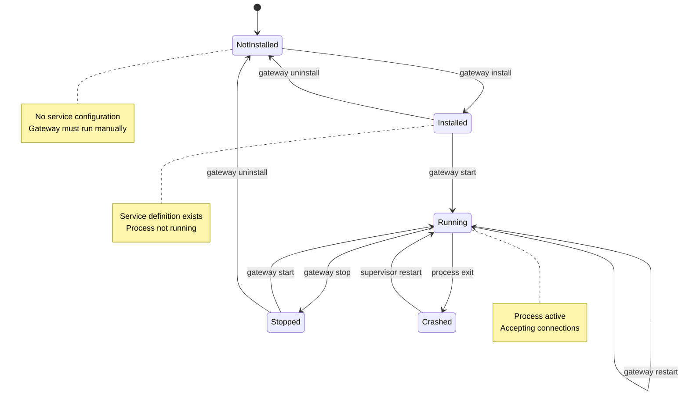
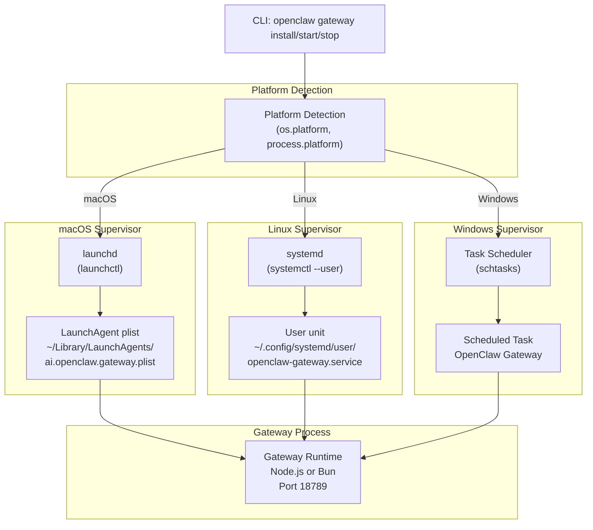
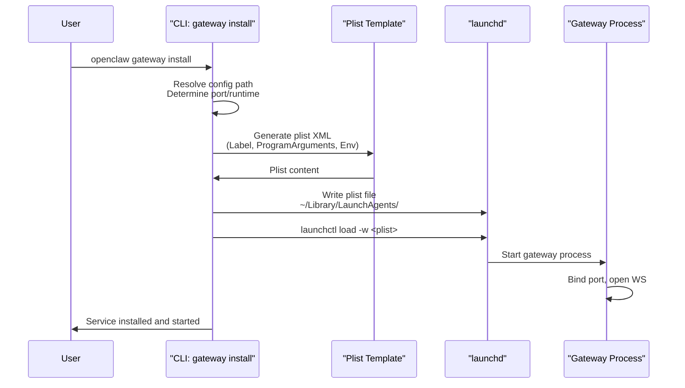
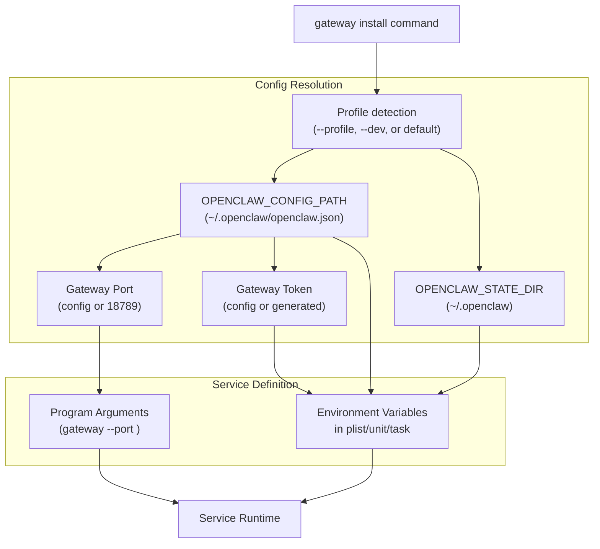
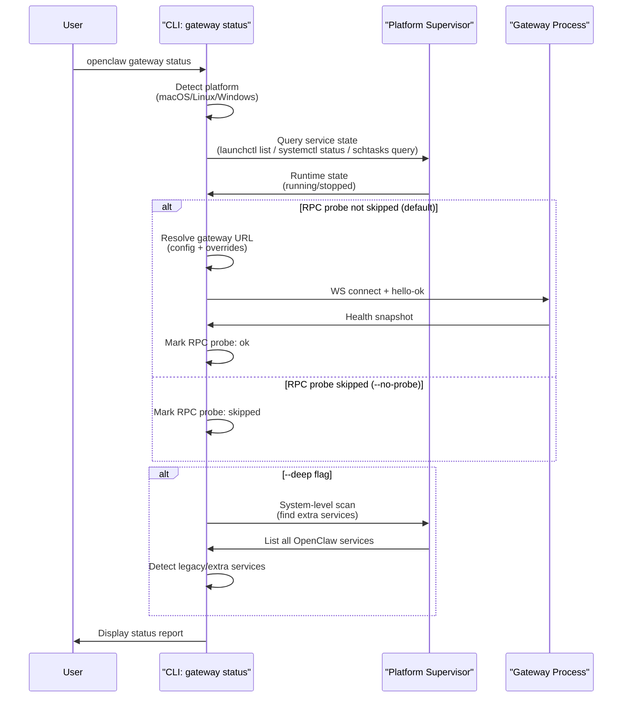
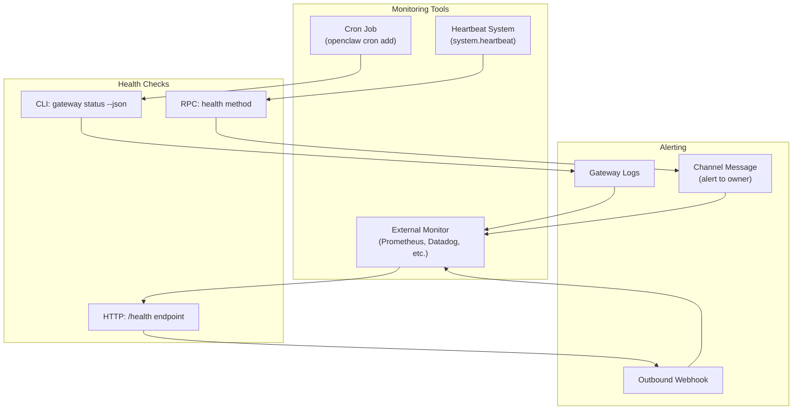
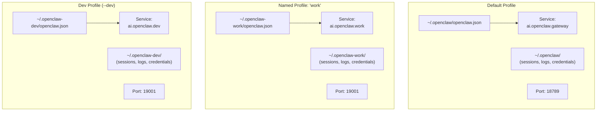
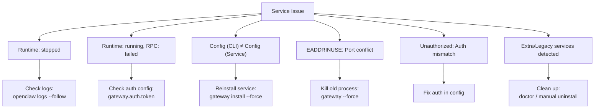

# Page: Gateway Service Management

# Gateway Service Management

<details>
<summary>Relevant source files</summary>

The following files were used as context for generating this wiki page:

- [README.md](README.md)
- [assets/avatar-placeholder.svg](assets/avatar-placeholder.svg)
- [docs/channels/zalo.md](docs/channels/zalo.md)
- [docs/channels/zalouser.md](docs/channels/zalouser.md)
- [docs/cli/index.md](docs/cli/index.md)
- [docs/docs.json](docs/docs.json)
- [docs/gateway/index.md](docs/gateway/index.md)
- [docs/gateway/troubleshooting.md](docs/gateway/troubleshooting.md)
- [docs/index.md](docs/index.md)
- [docs/start/getting-started.md](docs/start/getting-started.md)
- [docs/start/hubs.md](docs/start/hubs.md)
- [docs/start/onboarding.md](docs/start/onboarding.md)
- [docs/start/wizard.md](docs/start/wizard.md)
- [scripts/clawtributors-map.json](scripts/clawtributors-map.json)
- [scripts/update-clawtributors.ts](scripts/update-clawtributors.ts)
- [scripts/update-clawtributors.types.ts](scripts/update-clawtributors.types.ts)
- [src/config/config.ts](src/config/config.ts)
- [src/index.test.ts](src/index.test.ts)
- [src/index.ts](src/index.ts)
- [tsconfig.json](tsconfig.json)
- [ui/src/styles.css](ui/src/styles.css)
- [ui/src/styles/layout.mobile.css](ui/src/styles/layout.mobile.css)

</details>


This document covers the operational lifecycle of the Gateway as a supervised background service: installation, configuration, start/stop/restart operations, platform-specific supervisor integration (launchd, systemd, Windows Task Scheduler), health monitoring, and multi-instance management.

For Gateway runtime configuration and settings, see [Gateway Configuration](#3.1). For the WebSocket protocol and RPC methods, see [Gateway Protocol](#3.2). For network access and remote connectivity, see [Remote Access](#3.4).

---

## Purpose and Scope

The Gateway runs as a long-lived process that maintains channel connections, session state, and WebSocket control plane connectivity. For production and development workflows, the Gateway should run as a supervised service that automatically starts on boot and restarts on crashes.

This page documents:
- Service installation and uninstallation procedures
- Platform-specific supervisor integration (launchd, systemd, schtasks)
- Service lifecycle operations (start, stop, restart, status)
- Health check mechanisms and monitoring
- Multi-profile and multi-instance deployment patterns
- Common service failure modes and recovery procedures

---

## Service Lifecycle Overview

The Gateway service lifecycle follows a standard supervisor pattern across all platforms. The CLI provides a unified interface that delegates to platform-specific implementations.

### Service State Machine



**Sources:** [docs/gateway/index.md:119-162](), [docs/cli/index.md:652-700]()

### Core Service Commands

| Command | Purpose | Effect |
|---------|---------|--------|
| `gateway install` | Create service definition | Writes launchd plist / systemd unit / scheduled task |
| `gateway uninstall` | Remove service definition | Stops process and removes service files |
| `gateway start` | Start service process | Activates via supervisor (launchd load / systemctl start / schtasks run) |
| `gateway stop` | Stop service process | Deactivates via supervisor |
| `gateway restart` | Restart service process | Stop + Start atomic operation |
| `gateway status` | Query service state | Shows runtime status and optional RPC probe |

**Sources:** [docs/cli/index.md:678-700](), [docs/gateway/index.md:122-162]()

---

## Platform-Specific Implementations

The Gateway service integrates with the native supervisor on each platform to ensure automatic startup, crash recovery, and clean shutdown.

### Architecture Overview



**Sources:** [docs/gateway/index.md:119-162](), [README.md:56]()

### macOS: launchd

The Gateway installs as a **LaunchAgent** (per-user service) that starts automatically on login.

#### Service Label Pattern

- Default profile: `ai.openclaw.gateway`
- Named profile: `ai.openclaw.<profile>`

#### Service File Location

```
~/Library/LaunchAgents/ai.openclaw.gateway.plist
~/Library/LaunchAgents/ai.openclaw.<profile>.plist  # named profiles
```

#### Installation Flow



**Sources:** [docs/gateway/index.md:123-133](), [README.md:56]()

#### Service Operations

```bash
# Install service (creates plist + loads)
openclaw gateway install

# Start service
openclaw gateway start
# or: launchctl start ai.openclaw.gateway

# Stop service
openclaw gateway stop
# or: launchctl stop ai.openclaw.gateway

# Restart service
openclaw gateway restart
# or: launchctl restart ai.openclaw.gateway

# Check status
openclaw gateway status

# Uninstall service (stops + removes plist)
openclaw gateway uninstall
```

**Key Configuration Parameters in Plist:**
- `Label`: Service identifier (e.g., `ai.openclaw.gateway`)
- `ProgramArguments`: Path to node/bun + CLI script + args
- `WorkingDirectory`: State directory (e.g., `~/.openclaw`)
- `EnvironmentVariables`: `OPENCLAW_CONFIG_PATH`, `OPENCLAW_STATE_DIR`, auth tokens
- `StandardOutPath` / `StandardErrorPath`: Log file paths
- `KeepAlive`: Restart policy (typically `true`)
- `RunAtLoad`: Start on boot (typically `true`)

**Sources:** [docs/gateway/index.md:123-133](), [docs/cli/index.md:678-700]()

---

### Linux: systemd (User Service)

The Gateway installs as a **systemd user service** that runs under the current user's session. For system-wide services, see the system service pattern below.

#### Service Unit Pattern

- Default profile: `openclaw-gateway.service`
- Named profile: `openclaw-gateway-<profile>.service`

#### Service File Location

```
~/.config/systemd/user/openclaw-gateway.service
~/.config/systemd/user/openclaw-gateway-<profile>.service  # named profiles
```

#### Installation Flow

```bash
# Install service (generates unit file)
openclaw gateway install

# Enable service to start on boot
systemctl --user enable openclaw-gateway.service

# Start service now
systemctl --user start openclaw-gateway.service

# Enable lingering (persist after logout)
sudo loginctl enable-linger $USER
```

**Sources:** [docs/gateway/index.md:136-149](), [README.md:56]()

#### Service Operations

```bash
# Install service
openclaw gateway install

# Enable + start
systemctl --user enable --now openclaw-gateway.service

# Stop service
systemctl --user stop openclaw-gateway.service

# Restart service
systemctl --user restart openclaw-gateway.service

# Check status
systemctl --user status openclaw-gateway.service
# or: openclaw gateway status

# View logs
journalctl --user -u openclaw-gateway.service -f

# Uninstall service
openclaw gateway uninstall
```

**Key Configuration Parameters in Unit File:**
- `[Unit]` section: `Description`, `After=network.target`
- `[Service]` section:
  - `Type=simple`
  - `ExecStart`: Path to node/bun + CLI script + args
  - `WorkingDirectory`: State directory
  - `Environment`: Config path, state dir, auth tokens
  - `Restart=always` (automatic restart on crash)
  - `StandardOutput=journal` / `StandardError=journal`
- `[Install]` section: `WantedBy=default.target`

**Lingering for Persistence:**

By default, user services stop when the user logs out. To keep the Gateway running after logout:

```bash
sudo loginctl enable-linger $USER
```

**Sources:** [docs/gateway/index.md:136-149]()

---

### Linux: systemd (System Service)

For multi-user hosts or always-on deployments, install the Gateway as a **system service** that runs independent of user sessions.

#### Service File Location

```
/etc/systemd/system/openclaw-gateway.service
/etc/systemd/system/openclaw-gateway-<profile>.service  # named profiles
```

#### Installation Considerations

- Requires `sudo` for service installation and management
- Service runs as a dedicated user (e.g., `openclaw`)
- Config and state directories must be accessible by the service user
- Environment variables must be set in the unit file

#### Service Operations

```bash
# Install system service (manual or via deployment script)
sudo cp openclaw-gateway.service /etc/systemd/system/
sudo systemctl daemon-reload

# Enable + start
sudo systemctl enable --now openclaw-gateway.service

# Stop service
sudo systemctl stop openclaw-gateway.service

# Restart service
sudo systemctl restart openclaw-gateway.service

# Check status
sudo systemctl status openclaw-gateway.service

# View logs
sudo journalctl -u openclaw-gateway.service -f
```

**Sources:** [docs/gateway/index.md:151-162]()

---

### Windows: Task Scheduler (schtasks)

The Gateway installs as a **scheduled task** that runs at user logon. Windows support is primarily via WSL2, but native Windows deployment uses Task Scheduler for service management.

#### Service Task Pattern

- Default profile: `OpenClaw Gateway`
- Named profile: `OpenClaw Gateway (<profile>)`

#### Installation Flow

```powershell
# Install service (creates scheduled task)
openclaw gateway install

# Start service
openclaw gateway start

# Stop service
openclaw gateway stop

# Check status
openclaw gateway status
```

**Key Configuration Parameters in Task:**
- Task Name: `OpenClaw Gateway` or `OpenClaw Gateway (<profile>)`
- Trigger: At logon for current user
- Action: Start program (node.exe or bun.exe) with arguments
- Working Directory: State directory
- Run whether user is logged on or not (requires password)
- Restart on failure policy

**Sources:** [docs/gateway/index.md:119-162]()

---

## Service Installation and Configuration

### Installation Command

The `gateway install` command creates the platform-specific service definition and optionally starts the service.

```bash
# Install with defaults
openclaw gateway install

# Install with specific port
openclaw gateway install --port 19001

# Install with specific runtime (Node recommended, Bun not recommended for WhatsApp/Telegram)
openclaw gateway install --runtime node

# Install with explicit token (stored in service env)
openclaw gateway install --token <token>

# Install for named profile
openclaw --profile myprofile gateway install

# Force reinstall (overwrites existing service)
openclaw gateway install --force

# JSON output for scripting
openclaw gateway install --json
```

**Sources:** [docs/cli/index.md:697-700](), [docs/gateway/index.md:122-133]()

### Configuration Resolution

The service definition embeds the following environment variables to ensure consistent configuration:



**Sources:** [docs/gateway/index.md:174-194](), [docs/cli/index.md:693-694]()

### Runtime Selection

The `--runtime` flag selects the Node.js or Bun executable for the service process.

| Runtime | Recommendation | Notes |
|---------|----------------|-------|
| `node` | ✅ Recommended | Default; stable WhatsApp/Telegram support |
| `bun` | ⚠️ Not Recommended | WhatsApp/Telegram bugs; use only for dev/testing |

**Sources:** [docs/cli/index.md:699](), [docs/gateway/index.md:699]()

---

## Service Operations

### Starting the Service

```bash
# Start via CLI (delegates to platform supervisor)
openclaw gateway start

# Platform-specific alternatives:
# macOS:
launchctl start ai.openclaw.gateway

# Linux (user):
systemctl --user start openclaw-gateway.service

# Windows:
schtasks /Run /TN "OpenClaw Gateway"
```

**Expected Behavior:**
- Process starts and binds to configured port (default 18789)
- WebSocket server accepts connections
- Channel monitors initialize (WhatsApp, Telegram, Discord, etc.)
- Health endpoint becomes available
- Logs indicate "Gateway started"

**Sources:** [docs/gateway/index.md:23-55](), [docs/cli/index.md:687-689]()

### Stopping the Service

```bash
# Stop via CLI
openclaw gateway stop

# Platform-specific alternatives:
# macOS:
launchctl stop ai.openclaw.gateway

# Linux (user):
systemctl --user stop openclaw-gateway.service

# Windows:
schtasks /End /TN "OpenClaw Gateway"
```

**Expected Behavior:**
- WebSocket server closes gracefully
- Active connections receive `shutdown` event
- Channel connections disconnect cleanly
- Process exits with code 0

**Sources:** [docs/gateway/index.md:87-98](), [docs/cli/index.md:688]()

### Restarting the Service

```bash
# Restart via CLI (atomic stop + start)
openclaw gateway restart

# Platform-specific alternatives:
# macOS:
launchctl restart ai.openclaw.gateway

# Linux (user):
systemctl --user restart openclaw-gateway.service

# Windows:
schtasks /End /TN "OpenClaw Gateway" && schtasks /Run /TN "OpenClaw Gateway"
```

**When to Restart:**
- After config changes that require process restart (e.g., port, bind, auth)
- After installing npm packages or updating dependencies
- When hot-reload fails or is disabled (`gateway.reload.mode=off` or `restart`)

**Sources:** [docs/gateway/index.md:127-129](), [docs/cli/index.md:689]()

### Service Status and Health

The `gateway status` command provides operational visibility into the running service.

```bash
# Basic status (shows runtime state + RPC probe)
openclaw gateway status

# Skip RPC probe (just check supervisor state)
openclaw gateway status --no-probe

# Deep scan (includes system-level supervisor audit)
openclaw gateway status --deep

# JSON output for scripting
openclaw gateway status --json
```

**Status Output Includes:**
- **Runtime:** `running | stopped | unknown`
- **RPC Probe:** `ok | failed | skipped`
- **Config Path (CLI):** Path used by CLI commands
- **Config Path (Service):** Path embedded in service definition (may differ)
- **Gateway URL:** Resolved probe target (shows protocol, host, port)
- **Extra Services:** Legacy or profile-named services detected (warnings if present)

**Sources:** [docs/cli/index.md:684-695](), [docs/gateway/index.md:139-142]()

### Status Flow Diagram



**Sources:** [docs/cli/index.md:684-695](), [docs/gateway/troubleshooting.md:92-120]()

---

## Health Monitoring

The Gateway provides multiple health check mechanisms for operational monitoring and automated alerting.

### Health Check Endpoints and Methods

| Method | Type | Purpose |
|--------|------|---------|
| `gateway status` | CLI | Supervisor state + optional RPC probe |
| `health` RPC method | WebSocket | Health snapshot over control plane |
| `health` CLI command | CLI | Direct health query via RPC |
| HTTP `/health` (if exposed) | HTTP | Basic liveness check |

**Sources:** [docs/gateway/index.md:139-142](), [docs/cli/index.md:596-604]()

### Health Check Data Structure

Health snapshots include:

- **uptime:** Process uptime in milliseconds
- **stateVersion:** State version counter (increments on config reload)
- **channels:** Per-channel connection status (connected/disconnected)
- **nodes:** Paired device node status (online/offline)
- **sessions:** Active session count
- **constraints:** Rate limits and quota status

**Sources:** [docs/gateway/index.md:196-208]()

### Automated Health Monitoring Patterns



**Sources:** [docs/gateway/index.md:219-227](), [docs/automation/cron-jobs.md](), [docs/gateway/heartbeat.md]()

### Health Check Script Example

```bash
#!/bin/bash
# Example health check script for cron or monitoring systems

STATUS_JSON=$(openclaw gateway status --json --timeout 10000)
RUNTIME=$(echo "$STATUS_JSON" | jq -r '.runtime')
PROBE=$(echo "$STATUS_JSON" | jq -r '.probe')

if [ "$RUNTIME" != "running" ] || [ "$PROBE" != "ok" ]; then
  echo "Gateway unhealthy: runtime=$RUNTIME probe=$PROBE"
  exit 1
fi

echo "Gateway healthy"
exit 0
```

**Sources:** [docs/cli/index.md:694]()

---

## Multiple Profiles and Instances

The Gateway supports running multiple isolated instances on the same host using profiles. Each profile has independent configuration, state, and service registration.

### Profile Isolation



**Sources:** [docs/gateway/index.md:164-194](), [docs/cli/index.md:56-61]()

### Profile Management

```bash
# Default profile
openclaw gateway install
openclaw gateway start

# Named profile
openclaw --profile work gateway install --port 19001
openclaw --profile work gateway start

# Dev profile (predefined isolation)
openclaw --dev gateway install
openclaw --dev gateway start
```

**Profile-Specific Service Labels:**
- macOS: `ai.openclaw.<profile>`
- Linux: `openclaw-gateway-<profile>.service`
- Windows: `OpenClaw Gateway (<profile>)`

**Sources:** [docs/gateway/index.md:164-194](), [docs/cli/index.md:56-58]()

### Multi-Instance Checklist

When running multiple Gateway instances on the same host, ensure each has:

- ✅ **Unique port** (`gateway.port` in config or `--port` flag)
- ✅ **Unique config path** (`OPENCLAW_CONFIG_PATH` or `--profile`)
- ✅ **Unique state directory** (`OPENCLAW_STATE_DIR` or `--profile`)
- ✅ **Unique workspace** (`agents.defaults.workspace` in config)
- ✅ **Unique service label** (automatic when using `--profile`)

**Sources:** [docs/gateway/index.md:164-194]()

---

## Troubleshooting Service Issues

### Common Failure Modes



**Sources:** [docs/gateway/troubleshooting.md:92-120]()

### Diagnostic Command Ladder

Run these commands in order when troubleshooting service issues:

```bash
# 1. Check service status (basic)
openclaw gateway status

# 2. Check deep status (includes system-level audit)
openclaw gateway status --deep

# 3. View live logs
openclaw logs --follow

# 4. Run config/service diagnostics
openclaw doctor

# 5. Check channel connectivity
openclaw channels status --probe
```

**Sources:** [docs/gateway/troubleshooting.md:14-55](), [docs/gateway/index.md:96-99]()

### Service Not Running

**Symptoms:**
- `gateway status` shows `Runtime: stopped`
- Supervisor queries show service not loaded or inactive

**Resolution Steps:**

```bash
# Check supervisor state
# macOS:
launchctl list | grep openclaw
launchctl print user/$(id -u)/ai.openclaw.gateway

# Linux:
systemctl --user status openclaw-gateway.service

# If service not installed:
openclaw gateway install

# If service installed but stopped:
openclaw gateway start

# If service keeps crashing:
openclaw logs --follow  # check exit reason
openclaw doctor         # check config validity
```

**Common Causes:**
- Service not installed (`gateway install` never ran)
- Invalid config (`doctor` will detect)
- Port conflict (`EADDRINUSE`)
- Auth misconfiguration (non-loopback bind without auth)

**Sources:** [docs/gateway/troubleshooting.md:92-120]()

### Service Running But Not Responding

**Symptoms:**
- `gateway status` shows `Runtime: running` but `RPC probe: failed`
- Cannot connect via WebSocket or CLI

**Resolution Steps:**

```bash
# Check actual bind address
openclaw logs --follow | grep "Gateway started"
# Look for: "Gateway started on ws://127.0.0.1:18789"

# Check auth configuration
openclaw config get gateway.auth.mode
openclaw config get gateway.auth.token

# Try explicit connection
openclaw gateway health --url ws://127.0.0.1:18789 --token <token>

# If auth is the issue:
openclaw config set gateway.auth.token <token>
openclaw gateway restart
```

**Common Causes:**
- Auth token mismatch (CLI vs service)
- Bind address mismatch (service bound to different interface)
- Firewall blocking loopback connections
- Gateway bound but not accepting connections (crash loop)

**Sources:** [docs/gateway/troubleshooting.md:73-91](), [docs/gateway/index.md:106-116]()

### Config Path Mismatch

**Symptoms:**
- `gateway status` shows different config paths for CLI vs Service
- Changes to config don't affect running service

**Resolution Steps:**

```bash
# Check config paths
openclaw gateway status
# Look for "Config (cli): X" vs "Config (service): Y"

# Option 1: Update CLI to match service
export OPENCLAW_CONFIG_PATH=/path/to/service/config.json

# Option 2: Reinstall service to match CLI
openclaw gateway install --force
openclaw gateway restart
```

**Common Causes:**
- Environment variable set for service but not CLI
- Multiple profiles with ambiguous config resolution
- Service installed with explicit `--profile` but CLI runs without it

**Sources:** [docs/cli/index.md:693-694](), [docs/gateway/troubleshooting.md:249-313]()

### Port Conflict

**Symptoms:**
- Service fails to start with `EADDRINUSE` error
- Logs show "another gateway instance is already listening"

**Resolution Steps:**

```bash
# Find process using the port
lsof -i :18789        # macOS/Linux
netstat -ano | findstr :18789  # Windows

# Kill the process
kill <pid>            # macOS/Linux
taskkill /PID <pid>   # Windows

# Or force restart (kills conflicting process)
openclaw gateway --force

# For service:
openclaw gateway restart --force
```

**Common Causes:**
- Multiple Gateway instances on same port
- Previous process didn't exit cleanly
- Service definition has wrong port and CLI override conflicts

**Sources:** [docs/gateway/troubleshooting.md:92-120](), [docs/gateway/index.md:229-236]()

### Extra or Legacy Services

**Symptoms:**
- `gateway status --deep` shows warnings about extra services
- Multiple instances running unintentionally

**Resolution Steps:**

```bash
# Audit services
openclaw gateway status --deep
openclaw doctor --deep

# Uninstall extra services (example for macOS):
launchctl unload ~/Library/LaunchAgents/ai.openclaw.gateway-old.plist
rm ~/Library/LaunchAgents/ai.openclaw.gateway-old.plist

# For Linux:
systemctl --user stop openclaw-gateway-old.service
systemctl --user disable openclaw-gateway-old.service
rm ~/.config/systemd/user/openclaw-gateway-old.service
systemctl --user daemon-reload

# Note: Profile-named services (e.g., ai.openclaw.work) are NOT flagged as extra
```

**When Extra Services Are Valid:**
- Named profiles (e.g., `--profile work`) create legitimate separate services
- These are treated as first-class and not flagged

**Sources:** [docs/gateway/troubleshooting.md:289-295](), [docs/cli/index.md:694-695]()

---

## Service Configuration Reference

### Environment Variables in Service Definitions

The service definition embeds environment variables to control Gateway runtime:

| Variable | Purpose | Example |
|----------|---------|---------|
| `OPENCLAW_CONFIG_PATH` | Config file location | `~/.openclaw/openclaw.json` |
| `OPENCLAW_STATE_DIR` | State directory | `~/.openclaw` |
| `OPENCLAW_GATEWAY_PORT` | Gateway port (override) | `18789` |
| `OPENCLAW_GATEWAY_TOKEN` | Auth token (override) | `abc123...` |
| `OPENCLAW_GATEWAY_PASSWORD` | Auth password (override) | `hunter2` |

**Sources:** [docs/help/environment.md](), [docs/gateway/index.md:70-78]()

### Service Definition Templates

Each platform uses a different template format for service definitions. The CLI generates these automatically during `gateway install`.

**macOS Launchd Plist (XML):**
- Template includes: Label, ProgramArguments, WorkingDirectory, EnvironmentVariables, StandardOutPath, StandardErrorPath, KeepAlive, RunAtLoad

**Linux Systemd Unit (INI):**
- Template includes: [Unit] Description/After, [Service] Type/ExecStart/WorkingDirectory/Environment/Restart, [Install] WantedBy

**Windows Task Scheduler (XML):**
- Template includes: Task name, Trigger (At logon), Action (Start program), Settings (Restart on failure)

**Sources:** [docs/gateway/index.md:123-162]()

---

## Related Documentation

- [Gateway Configuration](#3.1) - Configure gateway settings, ports, bind modes, auth
- [Gateway Protocol](#3.2) - WebSocket RPC protocol and message schemas
- [Remote Access](#3.4) - SSH tunnels, Tailscale, remote gateway patterns
- [Gateway Runbook](/gateway/index) - Operational procedures and day-2 operations
- [Gateway Troubleshooting](/gateway/troubleshooting) - Deep diagnostic procedures

---