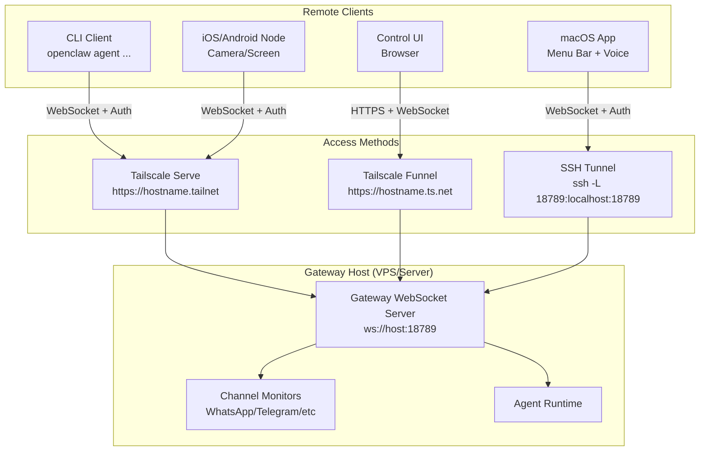
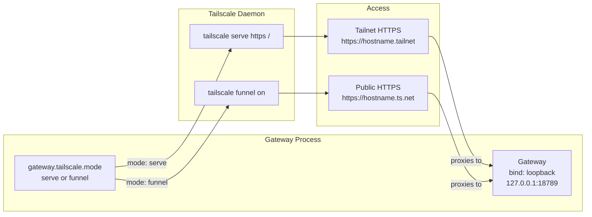
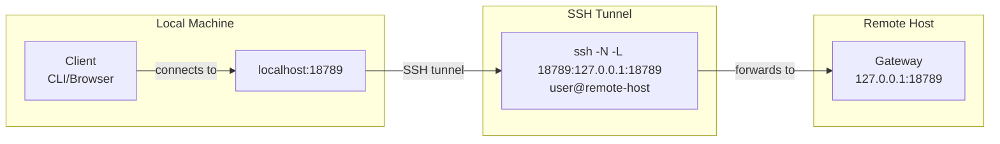
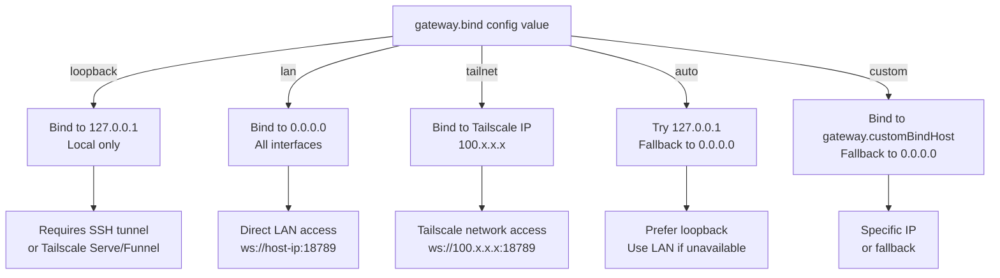
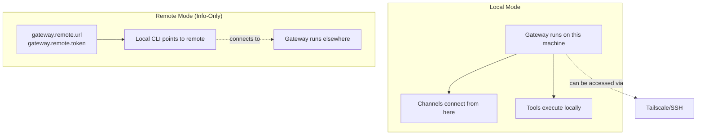
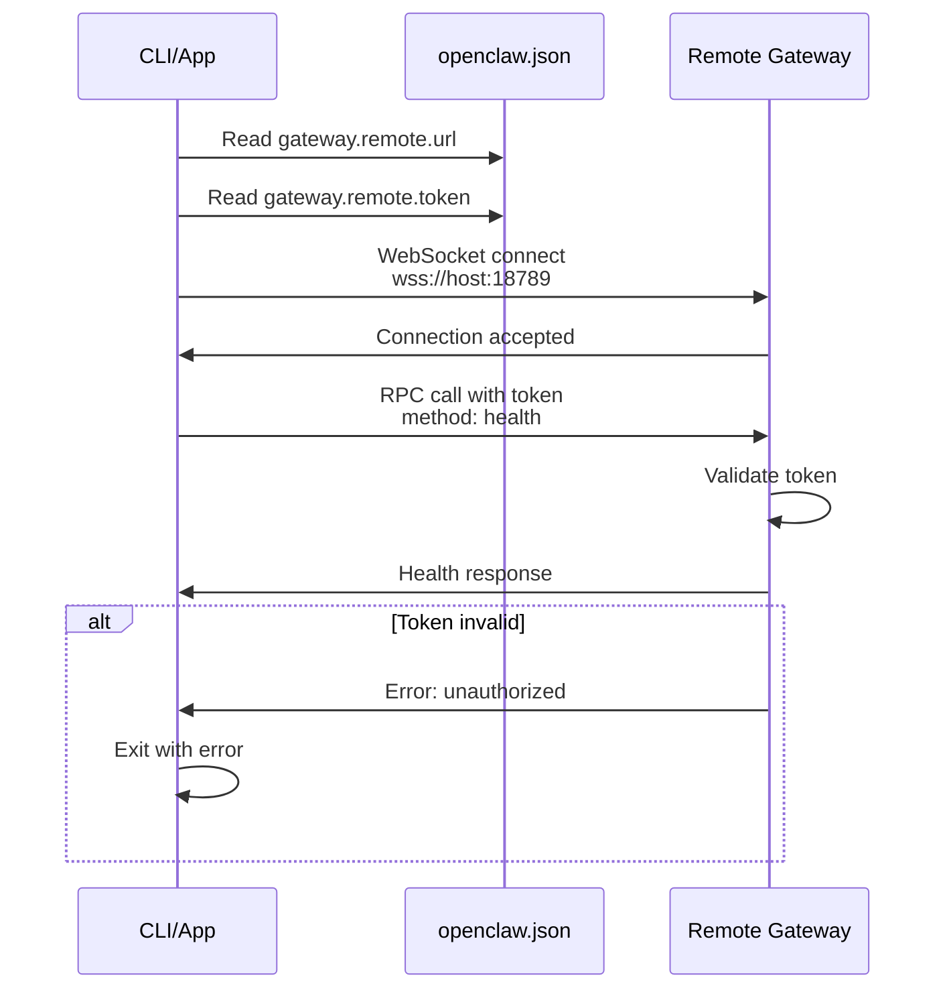
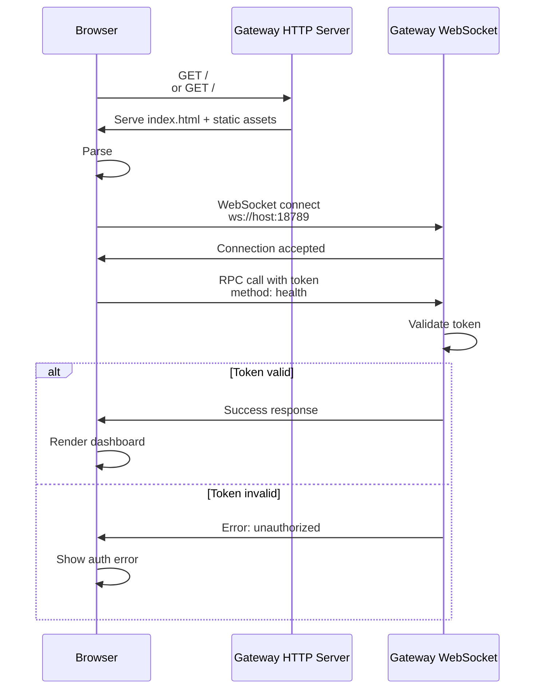
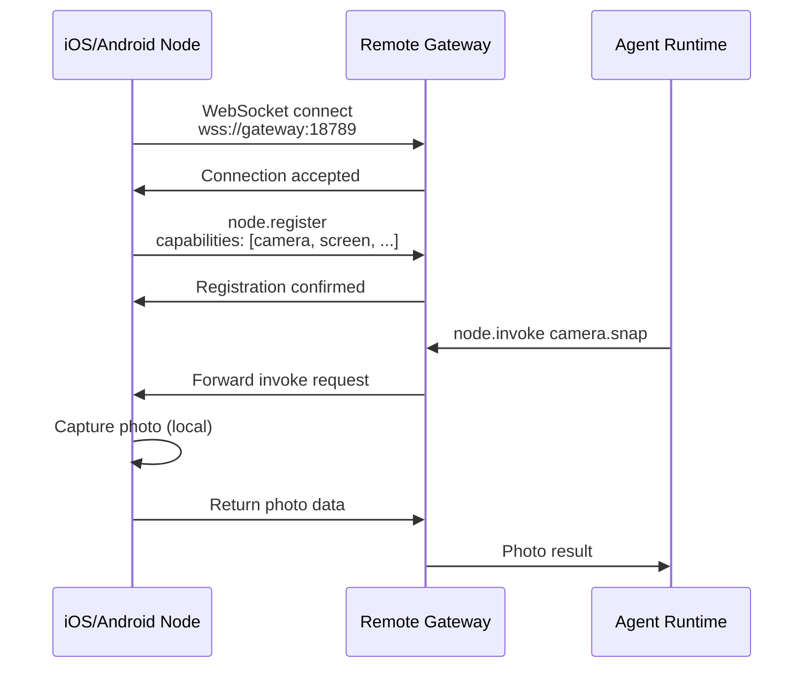

# Page: Remote Access

# Remote Access

<details>
<summary>Relevant source files</summary>

The following files were used as context for generating this wiki page:

- [README.md](README.md)
- [assets/avatar-placeholder.svg](assets/avatar-placeholder.svg)
- [docs/channels/zalo.md](docs/channels/zalo.md)
- [docs/channels/zalouser.md](docs/channels/zalouser.md)
- [docs/gateway/doctor.md](docs/gateway/doctor.md)
- [scripts/clawtributors-map.json](scripts/clawtributors-map.json)
- [scripts/update-clawtributors.ts](scripts/update-clawtributors.ts)
- [scripts/update-clawtributors.types.ts](scripts/update-clawtributors.types.ts)
- [src/agents/bash-tools.test.ts](src/agents/bash-tools.test.ts)
- [src/agents/pi-tools-agent-config.test.ts](src/agents/pi-tools-agent-config.test.ts)
- [src/agents/sandbox-skills.test.ts](src/agents/sandbox-skills.test.ts)
- [src/commands/configure.gateway.test.ts](src/commands/configure.gateway.test.ts)
- [src/commands/configure.gateway.ts](src/commands/configure.gateway.ts)
- [src/commands/configure.ts](src/commands/configure.ts)
- [src/commands/doctor.ts](src/commands/doctor.ts)
- [src/commands/onboard-helpers.test.ts](src/commands/onboard-helpers.test.ts)
- [src/commands/onboard-helpers.ts](src/commands/onboard-helpers.ts)
- [src/commands/onboard-interactive.ts](src/commands/onboard-interactive.ts)
- [src/config/config.ts](src/config/config.ts)
- [src/config/merge-config.ts](src/config/merge-config.ts)
- [src/index.test.ts](src/index.test.ts)
- [src/index.ts](src/index.ts)
- [src/wizard/onboarding.gateway-config.test.ts](src/wizard/onboarding.gateway-config.test.ts)
- [src/wizard/onboarding.gateway-config.ts](src/wizard/onboarding.gateway-config.ts)
- [src/wizard/onboarding.ts](src/wizard/onboarding.ts)
- [src/wizard/onboarding.types.ts](src/wizard/onboarding.types.ts)
- [tsconfig.json](tsconfig.json)
- [ui/src/styles.css](ui/src/styles.css)
- [ui/src/styles/layout.mobile.css](ui/src/styles/layout.mobile.css)

</details>


This page covers accessing the OpenClaw Gateway from machines other than the host where it runs. It explains the two primary methods for remote access (Tailscale and SSH tunneling), how to configure the Gateway for remote connections, and how clients connect to remote Gateway instances.

For general gateway configuration options, see [Gateway Configuration](#3.1).  
For gateway service installation and management, see [Gateway Service Management](#3.3).  
For device node pairing and local execution, see [Device Nodes](#11).  
For deployment patterns including VPS and Docker setups, see [Deployment](#13).

---

## Remote Access Architecture

OpenClaw supports remote access through a hub-and-spoke model where the Gateway WebSocket server accepts connections from multiple client types across network boundaries.

**Remote Access Architecture**



**Key Concepts:**

- **Gateway Host**: The machine running the Gateway server (tools, channels, agent runtime all execute here)
- **Remote Clients**: CLI, apps, or browser sessions connecting from other machines
- **Device Nodes**: Paired mobile/desktop devices that execute device-local actions (camera, screen, notifications) via `node.invoke`
- **Access Layer**: Tailscale or SSH provides secure network access to the Gateway WebSocket

Sources: [README.md:208-234](), [src/commands/onboard-helpers.ts:383-467]()

---

## Tailscale Serve/Funnel (Recommended)

Tailscale provides zero-config secure remote access with automatic TLS certificates. OpenClaw can automatically configure Tailscale Serve (private) or Funnel (public) exposure while keeping the Gateway bound to loopback.

**Tailscale Integration Flow**



### Serve Mode (Private Tailnet)

Tailscale Serve exposes the Gateway to devices on your Tailscale network only. This is the recommended mode for personal use.

**Configuration:**

```json5
{
  gateway: {
    port: 18789,
    bind: "loopback",  // Required for Tailscale
    auth: {
      mode: "token",   // Serve supports token auth
      token: "your-token-here"
    },
    tailscale: {
      mode: "serve",
      resetOnExit: false  // Keep serve active after Gateway stops
    }
  }
}
```

**Behavior:**
- Gateway binds to `127.0.0.1:18789`
- Tailscale daemon creates HTTPS proxy at `https://<hostname>.tailnet:443`
- Control UI available at `https://<hostname>.tailnet/`
- WebSocket at `wss://<hostname>.tailnet/`
- Only devices on your Tailscale network can access the Gateway

Sources: [README.md:208-224](), [src/wizard/onboarding.gateway-config.ts:124-175]()

### Funnel Mode (Public Internet)

Tailscale Funnel exposes the Gateway to the public internet via a Tailscale-managed HTTPS endpoint. **Password authentication is mandatory** for Funnel mode.

**Configuration:**

```json5
{
  gateway: {
    port: 18789,
    bind: "loopback",  // Required for Tailscale
    auth: {
      mode: "password",  // Required for Funnel
      password: "strong-password-here"
    },
    tailscale: {
      mode: "funnel",
      resetOnExit: true  // Disable funnel when Gateway stops
    }
  }
}
```

**Security Constraints:**
- `gateway.bind` must be `"loopback"` (enforced at startup)
- `gateway.auth.mode` must be `"password"` (token auth not allowed for public exposure)
- Public URL format: `https://<hostname>.ts.net/`

Sources: [README.md:208-224](), [src/wizard/onboarding.gateway-config.ts:186-189]()

### Tailscale Binary Detection

The Gateway requires the `tailscale` binary in `PATH` or at `/Applications/Tailscale.app/Contents/MacOS/Tailscale` (macOS).

During onboarding, `findTailscaleBinary()` checks for availability:

```typescript
// src/infra/tailscale.ts
async function findTailscaleBinary(): Promise<string | undefined>
```

If not found, the wizard emits a warning but allows setup to continue (Serve/Funnel will fail at runtime).

Sources: [src/wizard/onboarding.gateway-config.ts:145-159](), [src/commands/configure.gateway.ts:127-142]()

---

## SSH Tunneling

SSH port forwarding provides manual, flexible remote access without Tailscale. This is useful when:
- Tailscale is not available
- You need custom routing or port mappings
- You prefer SSH-based security

**SSH Tunnel Setup**



### Forward Tunnel (Local → Remote)

To access a remote Gateway on your local machine:

```bash
ssh -N -L 18789:127.0.0.1:18789 user@remote-host
```

Then connect clients to `ws://127.0.0.1:18789` or `http://127.0.0.1:18789/` (Control UI).

**With Authentication:**

If the Gateway requires token auth, include it in the WebSocket URL or Control UI hash:

```bash
# CLI with token
OPENCLAW_GATEWAY_TOKEN=your-token openclaw gateway health

# Control UI with token
open http://localhost:18789/#token=your-token
```

### SSH Tunnel Hints (No GUI)

The onboarding wizard detects SSH sessions and prints tunnel instructions when it cannot open a browser:

```typescript
// src/commands/onboard-helpers.ts:183-207
export function formatControlUiSshHint(params: {
  port: number;
  basePath?: string;
  token?: string;
}): string
```

Output example:
```
No GUI detected. Open from your computer:
ssh -N -L 18789:127.0.0.1:18789 user@remote-host
Then open:
http://localhost:18789/
http://localhost:18789/#token=abc123...
```

Sources: [src/commands/onboard-helpers.ts:183-214](), [src/wizard/onboarding.ts:296-308]()

---

## Gateway Bind Modes

The `gateway.bind` setting controls which network interface the Gateway listens on. This determines whether remote access is possible and how clients must connect.

**Bind Mode Resolution Flow**



### Bind Mode Reference

| Mode | Binds To | Remote Access | Security |
|------|----------|---------------|----------|
| `loopback` | `127.0.0.1` | SSH tunnel or Tailscale required | ✅ Most secure (local-only binding) |
| `lan` | `0.0.0.0` | Direct access from LAN | ⚠️ Exposed to local network |
| `tailnet` | Tailscale IP | Tailscale network only | ✅ Secure (Tailscale ACLs apply) |
| `auto` | `127.0.0.1` → `0.0.0.0` | Depends on fallback | ⚠️ May expose to LAN |
| `custom` | `gateway.customBindHost` | Depends on IP | Varies |

**Tailscale Constraint:**

When `gateway.tailscale.mode` is `"serve"` or `"funnel"`, the Gateway enforces `bind: "loopback"` and resets it during onboarding if set to another value:

```typescript
// src/wizard/onboarding.gateway-config.ts:180-184
if (tailscaleMode !== "off" && bind !== "loopback") {
  await prompter.note("Tailscale requires bind=loopback. Adjusting bind to loopback.", "Note");
  bind = "loopback";
  customBindHost = undefined;
}
```

Sources: [src/wizard/onboarding.gateway-config.ts:62-106](), [src/commands/configure.gateway.ts:30-93]()

---

## Gateway Modes: Local vs Remote

OpenClaw supports two Gateway operational modes that determine where the Gateway process runs and how clients connect.

**Gateway Mode Comparison**



### Local Mode (Default)

In local mode, the Gateway runs on the current machine and can optionally accept remote connections via Tailscale or SSH.

**Configuration:**

```json5
{
  gateway: {
    mode: "local",
    port: 18789,
    bind: "loopback",
    auth: { mode: "token", token: "..." },
    tailscale: { mode: "serve" }  // Optional: enable remote access
  }
}
```

**Characteristics:**
- Gateway process runs locally
- Channels (WhatsApp, Telegram, etc.) connect from this machine
- Tools (`exec`, `bash`) run on the Gateway host
- Remote clients can connect via Tailscale/SSH if configured

### Remote Mode (Client Configuration)

Remote mode is a **client-side configuration** that tells the CLI/app to connect to a Gateway running elsewhere. It does not start a local Gateway.

**Configuration:**

```json5
{
  gateway: {
    mode: "remote",
    remote: {
      url: "wss://gateway.example.com:18789",
      token: "remote-gateway-token"
    }
  }
}
```

**Use Cases:**
- Connecting CLI from a laptop to a VPS Gateway
- Multiple clients sharing a single Gateway instance
- Accessing a home server Gateway from work machine

**Onboarding Remote Mode:**

The onboarding wizard supports remote mode configuration:

```typescript
// src/wizard/onboarding.ts:309-342
const mode = opts.mode ?? (flow === "quickstart" ? "local" : 
  (await prompter.select({
    message: "What do you want to set up?",
    options: [
      { value: "local", label: "Local gateway (this machine)", ... },
      { value: "remote", label: "Remote gateway (info-only)", ... }
    ]
  })) as OnboardMode);

if (mode === "remote") {
  let nextConfig = await promptRemoteGatewayConfig(baseConfig, prompter);
  // ... saves config and exits
}
```

Sources: [src/wizard/onboarding.ts:309-342](), [src/commands/doctor.ts:61-63]()

---

## Remote Gateway Configuration

When configuring a client to connect to a remote Gateway, you provide the WebSocket URL and authentication credentials.

**Remote Gateway Connection Flow**



### Prompting for Remote Configuration

The `promptRemoteGatewayConfig` function collects remote Gateway details during onboarding:

```typescript
// src/commands/onboard-remote.ts (inferred from usage)
async function promptRemoteGatewayConfig(
  baseConfig: OpenClawConfig,
  prompter: WizardPrompter
): Promise<OpenClawConfig>
```

It prompts for:
- Remote Gateway URL (WebSocket format: `ws://` or `wss://`)
- Authentication token
- Optional: SSH tunnel instructions

### Probing Gateway Reachability

Before saving remote configuration, OpenClaw probes the Gateway to verify connectivity:

```typescript
// src/commands/onboard-helpers.ts:360-382
export async function probeGatewayReachable(params: {
  url: string;
  token?: string;
  password?: string;
  timeoutMs?: number;
}): Promise<{ ok: boolean; detail?: string }>
```

**Probe Behavior:**
1. Attempts WebSocket connection to `params.url`
2. Calls `health` RPC method with authentication
3. Returns `{ ok: true }` if Gateway responds
4. Returns `{ ok: false, detail: "error message" }` on failure

**Usage in Onboarding:**

```typescript
// src/wizard/onboarding.ts:296-308
const localProbe = await probeGatewayReachable({
  url: localUrl,
  token: baseConfig.gateway?.auth?.token ?? process.env.OPENCLAW_GATEWAY_TOKEN,
  password: baseConfig.gateway?.auth?.password ?? process.env.OPENCLAW_GATEWAY_PASSWORD,
});

const remoteProbe = remoteUrl ? await probeGatewayReachable({
  url: remoteUrl,
  token: baseConfig.gateway?.remote?.token,
}) : null;
```

The wizard displays probe results in the mode selection prompt:
- ✅ "Gateway reachable (ws://127.0.0.1:18789)"
- ❌ "No gateway detected (ws://127.0.0.1:18789)"

Sources: [src/commands/onboard-helpers.ts:360-433](), [src/wizard/onboarding.ts:294-333]()

---

## Gateway Authentication for Remote Access

Remote access requires authentication via token or password. The Gateway validates credentials on every WebSocket RPC call.

**Authentication Methods**

| Mode | Security | Use Case | Tailscale Compatibility |
|------|----------|----------|-------------------------|
| Token | High (random 48-char hex) | Recommended default | ✅ Serve + Funnel |
| Password | Medium (user-chosen) | Human-memorable shared secret | ✅ Serve + Required for Funnel |
| Tailscale Identity | High (Tailscale user identity) | Serve mode only (optional) | ✅ Serve only |

### Token Authentication (Recommended)

Token auth uses a randomly generated 48-character hex string (24 bytes).

**Generation:**

```typescript
// src/commands/onboard-helpers.ts:68-70
export function randomToken(): string {
  return crypto.randomBytes(24).toString("hex");
}
```

**Configuration:**

```json5
{
  gateway: {
    auth: {
      mode: "token",
      token: "abc123def456..." // 48 chars
    }
  }
}
```

**Client Usage:**

```bash
# Environment variable
export OPENCLAW_GATEWAY_TOKEN=abc123def456...
openclaw gateway health

# Config file (gateway.remote.token)
openclaw gateway health
```

### Password Authentication

Password auth uses a user-chosen shared secret. **Required for Tailscale Funnel** (public exposure).

**Configuration:**

```json5
{
  gateway: {
    auth: {
      mode: "password",
      password: "your-strong-password"
    }
  }
}
```

**Client Usage:**

```bash
# Environment variable
export OPENCLAW_GATEWAY_PASSWORD=your-password
openclaw gateway health

# Control UI prompt (browser-based)
# User enters password in UI dialog
```

### Tailscale Identity Headers (Serve Mode)

When using Tailscale Serve with `gateway.auth.allowTailscale: true` (default), the Gateway can authenticate users via Tailscale identity headers without requiring a token or password.

**Constraint:** Only works with Serve mode (not Funnel or direct binding).

Sources: [README.md:208-224](), [src/wizard/onboarding.gateway-config.ts:191-236]()

---

## Control UI Remote Access

The Control UI (web dashboard) is accessible via HTTP/HTTPS at the Gateway's base path. When accessed remotely, authentication is handled via URL hash parameters.

**Control UI Remote Access Flow**



### URL Formats

**With Token (Auto-Login):**

```
http://localhost:18789/#token=abc123def456...
https://hostname.tailnet/#token=abc123def456...
```

The UI extracts the token from the URL hash and includes it in WebSocket RPC calls.

**Without Token (Prompt):**

```
http://localhost:18789/
https://hostname.tailnet/
```

The UI prompts for password if `gateway.auth.mode: "password"`.

### SSH Tunnel + Control UI

When SSH tunneling to a remote Gateway, the onboarding wizard provides a URL with embedded token:

```typescript
// src/commands/onboard-helpers.ts:186-206
export function formatControlUiSshHint(params: {
  port: number;
  basePath?: string;
  token?: string;
}): string {
  const localUrl = `http://localhost:${params.port}${uiPath}`;
  const authedUrl = params.token
    ? `${localUrl}#token=${encodeURIComponent(params.token)}`
    : undefined;
  
  return [
    "No GUI detected. Open from your computer:",
    `ssh -N -L ${params.port}:127.0.0.1:${params.port} ${sshTarget}`,
    "Then open:",
    localUrl,
    authedUrl,
    "Docs:",
    "https://docs.openclaw.ai/gateway/remote"
  ].filter(Boolean).join("\n");
}
```

Sources: [src/commands/onboard-helpers.ts:183-214]()

---

## Gateway Host vs Device Nodes

In a remote deployment, understanding where different actions execute is critical. OpenClaw splits execution between the **Gateway host** (where the Gateway runs) and **device nodes** (paired devices like phones/tablets).

**Execution Location by Tool**

```mermaid
graph TB
    subgraph "Gateway Host (VPS/Server)"
        GatewayProcess[Gateway Process]
        ExecTool[exec tool<br/>bash tool]
        ProcessTool[process tool]
        BrowserTool[browser tool]
        ChannelTools[Channel monitors]
        SessionTools[sessions_* tools]
        
        GatewayProcess --> ExecTool
        GatewayProcess --> ProcessTool
        GatewayProcess --> BrowserTool
        GatewayProcess --> ChannelTools
        GatewayProcess --> SessionTools
    end
    
    subgraph "Device Nodes (Paired)"
        iOSNode[iOS Node]
        AndroidNode[Android Node]
        MacNode[macOS Node]
        
        iOSCamera[camera.snap<br/>camera.clip]
        iOSScreen[screen.record]
        iOSLocation[location.get]
        iOSNotify[notification.send]
        
        AndroidCamera[camera.snap<br/>camera.clip]
        AndroidScreen[screen.record]
        
        MacSystemRun[system.run]
        MacSystemNotify[system.notify]
        MacCamera[camera.snap]
        
        iOSNode --> iOSCamera
        iOSNode --> iOSScreen
        iOSNode --> iOSLocation
        iOSNode --> iOSNotify
        
        AndroidNode --> AndroidCamera
        AndroidNode --> AndroidScreen
        
        MacNode --> MacSystemRun
        MacNode --> MacSystemNotify
        MacNode --> MacCamera
    end
    
    GatewayProcess -.->|node.invoke| iOSNode
    GatewayProcess -.->|node.invoke| AndroidNode
    GatewayProcess -.->|node.invoke| MacNode
```



### Gateway Host Execution

Tools that execute on the Gateway host:
- `exec` / `bash`: Shell command execution
- `process`: Background process management
- `read` / `write` / `edit`: File system operations
- `browser`: Headless browser control (requires X11/Wayland or Xvfb on Linux)
- `memory_search`: Memory system queries
- `sessions_*`: Session management tools
- Channel monitors (WhatsApp, Telegram, etc.)

**Deployment Consideration:**  
The Gateway host must have necessary dependencies installed (e.g., Chrome/Chromium for `browser` tool, `signal-cli` for Signal, etc.).

### Device Node Execution

Tools that execute on paired device nodes via `node.invoke`:
- `camera.snap` / `camera.clip`: Camera capture
- `screen.record`: Screen recording
- `location.get`: GPS location
- `notification.send`: Push notifications
- `system.run` (macOS only): Local shell execution with TCC permissions
- `system.notify` (macOS only): macOS notification center

**Pairing:**  
Device nodes pair with the Gateway via WebSocket connection and advertise their capabilities. The agent runtime routes `node.invoke` calls to the appropriate paired node.

Sources: [README.md:225-234]()

---

## Remote Access Use Cases

### VPS Deployment

Running the Gateway on a VPS is a common pattern for always-on availability.

**Architecture:**

- VPS: Ubuntu/Debian server with Gateway running as systemd service
- Channels: Connect to messaging platforms from VPS
- Clients: CLI/macOS app connect via Tailscale or SSH
- Nodes: Paired mobile devices for camera/screen actions

**Configuration:**

```json5
{
  gateway: {
    mode: "local",
    port: 18789,
    bind: "loopback",
    auth: { mode: "token", token: "..." },
    tailscale: { mode: "serve" }
  },
  agents: {
    defaults: {
      workspace: "/var/lib/openclaw/workspace"
    }
  }
}
```

**Setup Steps:**

1. Install Gateway on VPS: `npm install -g openclaw`
2. Run onboarding: `openclaw onboard --non-interactive`
3. Install systemd service: `openclaw gateway install`
4. Configure Tailscale Serve for remote access
5. On client machines, configure remote mode:
   ```json5
   {
     gateway: {
       mode: "remote",
       remote: {
         url: "wss://vps-hostname.tailnet:443",
         token: "..."
       }
     }
   }
   ```

Sources: [README.md:225-234]()

### Home Server with Remote Clients

A home server (NAS, Raspberry Pi, Mac Mini) can host the Gateway with remote access via Tailscale.

**Benefits:**
- Low power consumption (compared to VPS)
- Direct access to local network resources
- No VPS costs

**Considerations:**
- Requires reliable home internet
- May need dynamic DNS if using SSH (Tailscale handles this automatically)

### Mobile Device Nodes with Remote Gateway

Mobile devices pair as nodes even when the Gateway runs remotely:

1. Gateway runs on VPS/home server
2. iOS/Android app installed on phone
3. App pairs with Gateway via Tailscale/SSH tunnel
4. Agent invokes camera/screen actions via `node.invoke`
5. Node executes action locally and returns result

**Pairing Flow:**



Sources: [README.md:225-234]()

---

## Troubleshooting Remote Access

### Gateway Unreachable

**Symptom:** Clients cannot connect to remote Gateway.

**Diagnosis:**

1. Check Gateway health locally:
   ```bash
   # On Gateway host
   openclaw gateway health
   ```

2. Probe from client:
   ```bash
   # On client machine
   OPENCLAW_GATEWAY_URL=ws://remote-host:18789 \
   OPENCLAW_GATEWAY_TOKEN=your-token \
   openclaw gateway health
   ```

3. Verify network path:
   ```bash
   # Test raw TCP connection
   telnet remote-host 18789
   
   # Test TLS (Tailscale)
   openssl s_client -connect hostname.tailnet:443
   ```

**Common Causes:**
- Gateway not running: check `openclaw gateway status`
- Firewall blocking port 18789: check VPS firewall rules
- Bind mode incorrect: must be `lan`, `tailnet`, or accessible via tunnel
- Tailscale not connected on client: check `tailscale status`

### Authentication Failures

**Symptom:** Gateway responds but rejects RPC calls with "unauthorized" error.

**Diagnosis:**

1. Verify token matches:
   ```bash
   # On Gateway host
   openclaw config get gateway.auth.token
   
   # On client
   openclaw config get gateway.remote.token
   ```

2. Check environment variables (they override config):
   ```bash
   echo $OPENCLAW_GATEWAY_TOKEN
   echo $OPENCLAW_GATEWAY_PASSWORD
   ```

3. Test with explicit token:
   ```bash
   OPENCLAW_GATEWAY_TOKEN=correct-token openclaw gateway health
   ```

**Common Causes:**
- Token mismatch between Gateway and client config
- Environment variable overriding config file
- Password mode on Gateway but token provided by client
- Expired or revoked credentials

Sources: [src/commands/onboard-helpers.ts:360-433]()

### Tailscale Issues

**Symptom:** Tailscale Serve/Funnel not working.

**Diagnosis:**

1. Check Tailscale binary:
   ```bash
   which tailscale
   tailscale version
   ```

2. Verify Tailscale is running:
   ```bash
   tailscale status
   ```

3. Check serve/funnel status:
   ```bash
   tailscale serve status
   tailscale funnel status
   ```

4. Review Gateway logs:
   ```bash
   openclaw logs --follow | grep -i tailscale
   ```

**Common Causes:**
- Tailscale not installed: install from https://tailscale.com/download
- Tailscale daemon not running: `sudo systemctl start tailscaled`
- Funnel not enabled for your account: requires Tailscale Funnel feature
- Bind mode not `loopback`: Gateway enforces this constraint

Sources: [src/wizard/onboarding.gateway-config.ts:145-159]()

### SSH Tunnel Drops

**Symptom:** SSH tunnel disconnects frequently.

**Solutions:**

1. Add keep-alive to SSH config (`~/.ssh/config`):
   ```
   Host remote-gateway
       HostName remote-host
       User youruser
       ServerAliveInterval 60
       ServerAliveCountMax 3
   ```

2. Use autossh for automatic reconnection:
   ```bash
   autossh -M 0 -N -L 18789:127.0.0.1:18789 remote-host
   ```

3. Run tunnel in tmux/screen for persistence:
   ```bash
   tmux new-session -d -s gateway-tunnel \
     'ssh -N -L 18789:127.0.0.1:18789 remote-host'
   ```

### Doctor Remote Mode Checks

The `openclaw doctor` command includes remote mode checks:

```typescript
// src/commands/doctor.ts:61-63
function resolveMode(cfg: OpenClawConfig): "local" | "remote" {
  return cfg.gateway?.mode === "remote" ? "remote" : "local";
}
```

When running doctor in remote mode, it reminds you to run doctor on the remote host (where state files live):

> "Remote mode reminder: if `gateway.mode=remote`, doctor reminds you to run it on the remote host (the state lives there)."

Sources: [docs/gateway/doctor.md:172-177]()

---

## Configuration Reference

### Gateway Bind Configuration

```json5
{
  gateway: {
    bind: "loopback" | "lan" | "tailnet" | "auto" | "custom",
    customBindHost: "192.168.1.100",  // Required if bind: "custom"
    port: 18789
  }
}
```

Sources: [src/wizard/onboarding.gateway-config.ts:62-106]()

### Gateway Authentication Configuration

```json5
{
  gateway: {
    auth: {
      mode: "token" | "password",
      token: "abc123...",       // 48-char hex (if mode: "token")
      password: "strong-pass",  // User-chosen (if mode: "password")
      allowTailscale: true      // Allow Tailscale identity (Serve only)
    }
  }
}
```

Sources: [src/wizard/onboarding.gateway-config.ts:191-236]()

### Tailscale Configuration

```json5
{
  gateway: {
    tailscale: {
      mode: "off" | "serve" | "funnel",
      resetOnExit: false  // Undo serve/funnel on Gateway shutdown
    }
  }
}
```

Sources: [src/wizard/onboarding.gateway-config.ts:124-175]()

### Remote Gateway Configuration

```json5
{
  gateway: {
    mode: "remote",
    remote: {
      url: "wss://hostname.tailnet:443",
      token: "remote-gateway-token"
    }
  }
}
```

Sources: [src/wizard/onboarding.ts:301-342]()

---

## Security Considerations

### Network Exposure Levels

| Configuration | Exposure | Recommended Auth |
|---------------|----------|------------------|
| `bind: "loopback"` | Local machine only | Token (optional) |
| `bind: "loopback"` + SSH tunnel | Machines with SSH access | Token |
| `bind: "loopback"` + Tailscale Serve | Tailnet devices | Token or Tailscale identity |
| `bind: "loopback"` + Tailscale Funnel | Public internet | Password (required) |
| `bind: "lan"` | Local network | Token (required) |
| `bind: "tailnet"` | Tailscale network | Token |

### Best Practices

1. **Use Tailscale Serve for personal use**: Provides secure, private access without exposing ports.

2. **Always require authentication**: Even on loopback, use token auth to prevent local privilege escalation.

3. **Use Funnel sparingly**: Only expose Gateway to public internet when necessary (e.g., webhook receivers).

4. **Rotate tokens periodically**: Generate new tokens with `openclaw config set gateway.auth.token $(openssl rand -hex 24)`.

5. **Monitor access logs**: Check Gateway logs for unauthorized connection attempts.

6. **Use SSH key authentication**: Prefer SSH keys over passwords for tunnel-based access.

7. **Run doctor regularly**: `openclaw doctor` checks for security misconfigurations.

Sources: [README.md:107-120](), [README.md:208-224]()

---