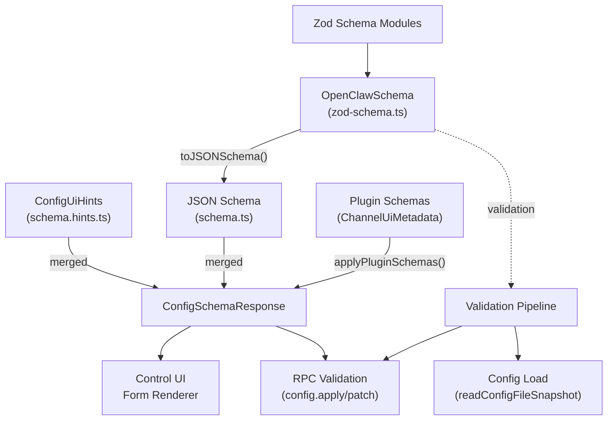
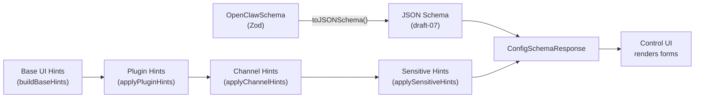
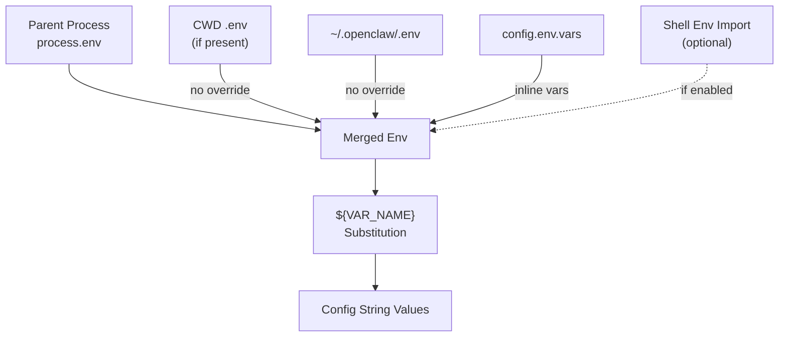
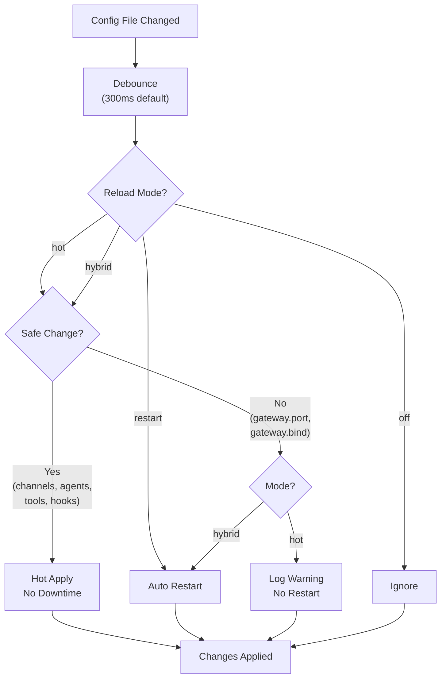
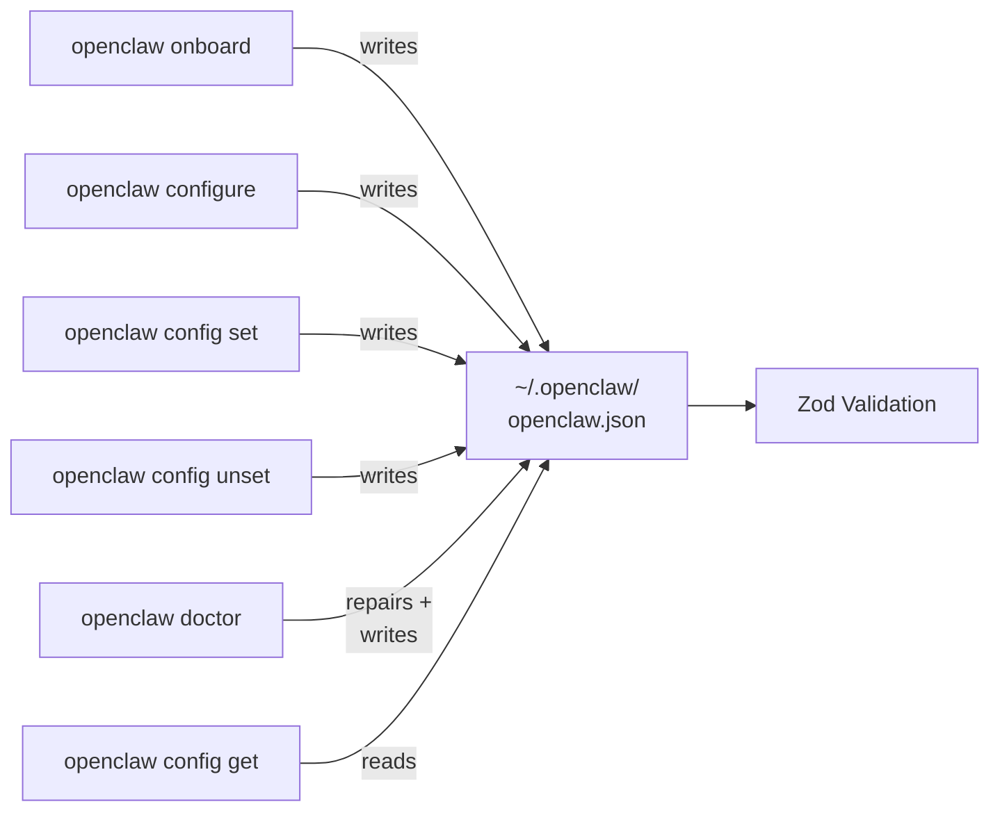
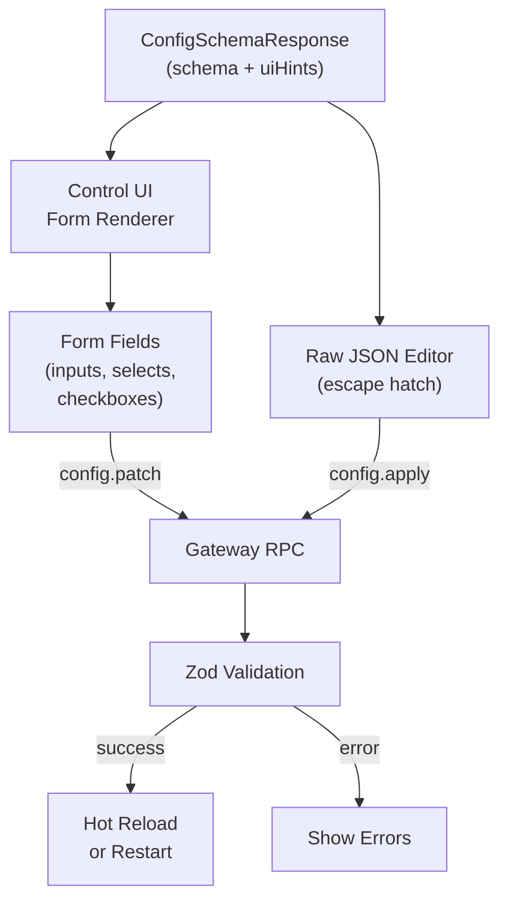
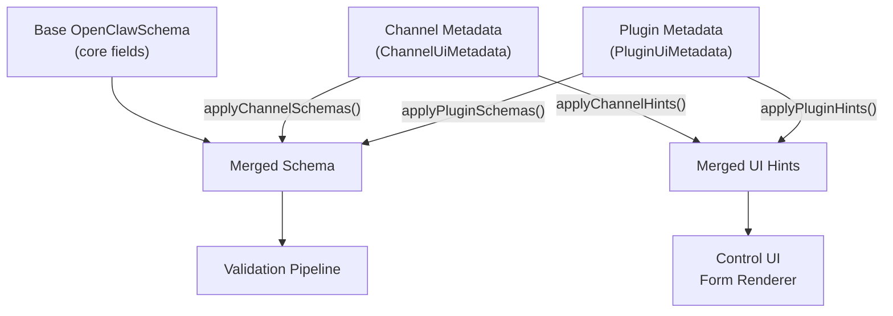

# Page: Configuration System

# Configuration System

<details>
<summary>Relevant source files</summary>

The following files were used as context for generating this wiki page:

- [CHANGELOG.md](CHANGELOG.md)
- [docs/cli/memory.md](docs/cli/memory.md)
- [docs/cli/sandbox.md](docs/cli/sandbox.md)
- [docs/concepts/memory.md](docs/concepts/memory.md)
- [docs/gateway/configuration.md](docs/gateway/configuration.md)
- [docs/gateway/doctor.md](docs/gateway/doctor.md)
- [docs/gateway/sandbox-vs-tool-policy-vs-elevated.md](docs/gateway/sandbox-vs-tool-policy-vs-elevated.md)
- [docs/gateway/sandboxing.md](docs/gateway/sandboxing.md)
- [docs/platforms/mac/skills.md](docs/platforms/mac/skills.md)
- [docs/tools/elevated.md](docs/tools/elevated.md)
- [docs/tools/index.md](docs/tools/index.md)
- [docs/tools/skills-config.md](docs/tools/skills-config.md)
- [src/agents/bash-tools.test.ts](src/agents/bash-tools.test.ts)
- [src/agents/memory-search.test.ts](src/agents/memory-search.test.ts)
- [src/agents/memory-search.ts](src/agents/memory-search.ts)
- [src/agents/pi-tools-agent-config.test.ts](src/agents/pi-tools-agent-config.test.ts)
- [src/agents/sandbox-explain.test.ts](src/agents/sandbox-explain.test.ts)
- [src/agents/sandbox-skills.test.ts](src/agents/sandbox-skills.test.ts)
- [src/agents/sandbox.ts](src/agents/sandbox.ts)
- [src/cli/memory-cli.test.ts](src/cli/memory-cli.test.ts)
- [src/cli/memory-cli.ts](src/cli/memory-cli.ts)
- [src/cli/models-cli.test.ts](src/cli/models-cli.test.ts)
- [src/commands/configure.gateway.test.ts](src/commands/configure.gateway.test.ts)
- [src/commands/configure.gateway.ts](src/commands/configure.gateway.ts)
- [src/commands/configure.ts](src/commands/configure.ts)
- [src/commands/doctor.ts](src/commands/doctor.ts)
- [src/commands/onboard-helpers.test.ts](src/commands/onboard-helpers.test.ts)
- [src/commands/onboard-helpers.ts](src/commands/onboard-helpers.ts)
- [src/commands/onboard-interactive.ts](src/commands/onboard-interactive.ts)
- [src/config/merge-config.ts](src/config/merge-config.ts)
- [src/config/schema.ts](src/config/schema.ts)
- [src/config/types.tools.ts](src/config/types.tools.ts)
- [src/config/types.ts](src/config/types.ts)
- [src/config/zod-schema.agent-runtime.ts](src/config/zod-schema.agent-runtime.ts)
- [src/config/zod-schema.ts](src/config/zod-schema.ts)
- [src/memory/embeddings.test.ts](src/memory/embeddings.test.ts)
- [src/memory/embeddings.ts](src/memory/embeddings.ts)
- [src/memory/manager.ts](src/memory/manager.ts)
- [src/wizard/onboarding.gateway-config.test.ts](src/wizard/onboarding.gateway-config.test.ts)
- [src/wizard/onboarding.gateway-config.ts](src/wizard/onboarding.gateway-config.ts)
- [src/wizard/onboarding.ts](src/wizard/onboarding.ts)
- [src/wizard/onboarding.types.ts](src/wizard/onboarding.types.ts)

</details>


The Configuration System is OpenClaw's foundation for validating, managing, and hot-reloading all runtime settings. It enforces strict schema validation using Zod, provides interactive wizards for editing, and supports dynamic reloads without downtime for most settings. This page covers the schema architecture, configuration lifecycle, validation pipeline, and hot-reload mechanics.

For user-facing configuration reference and examples, see the [Configuration Reference](#4.1) and [Configuration Management](#4.2) pages. For multi-agent routing and workspace isolation, see [Multi-Agent Configuration](#4.3).

---

## Configuration File and Schema

OpenClaw reads a single JSON5 configuration file at `~/.openclaw/openclaw.json`. The schema is defined in Zod and converted to JSON Schema for Control UI form rendering and RPC validation.

### Schema Definition Architecture



**Sources:**
- [src/config/zod-schema.ts:95-632]()
- [src/config/schema.ts:293-335]()
- [src/config/schema.hints.ts]()

### Core Schema Modules

The Zod schema is split across multiple files for maintainability. The root schema is `OpenClawSchema` in [src/config/zod-schema.ts](), which composes sub-schemas:

| Schema Module | Covers | Source File |
|---------------|--------|-------------|
| `OpenClawSchema` | Root config object | [src/config/zod-schema.ts:95-632]() |
| `AgentsSchema` | Agent definitions, defaults, multi-agent | [src/config/zod-schema.agents.ts]() |
| `ToolsSchema` | Tool policy, profiles, exec config | [src/config/zod-schema.agent-runtime.ts]() |
| `ChannelsSchema` | Channel configs (WhatsApp, Telegram, etc.) | [src/config/zod-schema.providers.ts]() |
| `ModelsConfigSchema` | Model catalog, providers, auth | [src/config/zod-schema.core.ts]() |
| `SessionSchema` | Session scoping, reset, send policy | [src/config/zod-schema.session.ts]() |
| `HooksSchema` | Webhook mappings, Gmail config | [src/config/zod-schema.hooks.ts]() |

Each sub-schema is defined using Zod's `.object()` with `.strict()` to reject unknown keys. Cross-field validation uses `.superRefine()` (e.g., [src/config/zod-schema.ts:602-632]() validates agent IDs in `broadcast` entries).

**Sources:**
- [src/config/types.ts:1-33]()
- [src/config/zod-schema.ts:1-14]()

### JSON Schema Generation

The JSON Schema is generated from Zod using `toJSONSchema()` and enriched with UI hints for the Control UI form renderer:



The `buildConfigSchema()` function [src/config/schema.ts:313-335]() merges base hints with plugin/channel metadata. Sensitive fields (tokens, API keys) are flagged via `applySensitiveHints()` [src/config/schema.hints.ts]() and rendered as password inputs.

**Sources:**
- [src/config/schema.ts:293-335]()
- [src/config/schema.hints.ts]()

---

## Configuration Lifecycle

```mermaid
sequenceDiagram
    participant User
    participant CLI
    participant ConfigFile["~/.openclaw/<br/>openclaw.json"]
    participant Loader["Config Loader<br/>(readConfigFileSnapshot)"]
    participant Validator["Zod Validator<br/>(OpenClawSchema.parse)"]
    participant Watcher["File Watcher<br/>(chokidar)"]
    participant Gateway["Gateway Runtime"]
    
    User->>CLI: openclaw config set
    CLI->>ConfigFile: Write JSON5
    ConfigFile->>Watcher: File change event
    Watcher->>Gateway: Debounced reload trigger
    Gateway->>Loader: readConfigFileSnapshot()
    Loader->>ConfigFile: Read + parse JSON5
    Loader->>Validator: OpenClawSchema.parse()
    
    alt Valid Config
        Validator-->>Gateway: Parsed config
        Gateway->>Gateway: Determine reload mode
        alt Hot-applicable
            Gateway->>Gateway: Apply changes
        else Restart-required
            Gateway->>Gateway: Restart gateway
        end
    else Invalid Config
        Validator-->>Gateway: Zod validation errors
        Gateway->>User: Log errors, keep old config
    end
```

**Sources:**
- [src/config/config.ts]()
- [src/config/zod-schema.ts:95-632]()

### Config Loading

The `readConfigFileSnapshot()` function [src/config/config.ts]() handles the full load pipeline:

1. **File resolution:** Checks `~/.openclaw/openclaw.json` existence
2. **JSON5 parsing:** Uses `json5` to support comments and trailing commas
3. **Environment substitution:** Replaces `${VAR_NAME}` with environment variables [src/config/env.ts]()
4. **$include resolution:** Recursively merges included files [src/config/includes.ts]()
5. **Zod validation:** Parses with `OpenClawSchema.parse()`
6. **Error collection:** Returns `{ valid: boolean, config: OpenClawConfig, issues: ZodIssue[] }`

If validation fails, the Gateway refuses to start, and only diagnostic commands (`openclaw doctor`, `openclaw logs`) work.

**Sources:**
- [src/config/config.ts]()
- [src/config/includes.ts]()
- [src/config/env.ts]()

### Environment Variable Handling

Environment variables are loaded from multiple sources and support inline substitution in config strings:



**Substitution rules** [src/config/env.ts]():
- Only uppercase names matched: `[A-Z_][A-Z0-9_]*`
- Missing/empty vars throw validation errors
- Escape with `$${VAR}` for literal output
- Inline substitution: `"${BASE}/v1"` → `"https://api.example.com/v1"`

**Shell env import** (`config.env.shellEnv.enabled`):
- Runs login shell to import missing keys
- Only imports keys not already set
- Timeout: 15 seconds (configurable via `timeoutMs`)

**Sources:**
- [src/config/env.ts]()
- [docs/gateway/configuration.md:419-472]()

---

## Configuration Hot-Reload

The Gateway watches `~/.openclaw/openclaw.json` and applies changes automatically based on reload mode.

### Reload Modes

| Mode | Behavior | Use Case |
|------|----------|----------|
| **`hybrid`** (default) | Hot-applies safe changes; auto-restarts for infrastructure | Development + production balance |
| **`hot`** | Hot-applies safe changes only; logs warning for unsafe | Manual restart control |
| **`restart`** | Always restarts on any change | Minimal risk, maximum downtime |
| **`off`** | Disables file watching | Manual restart only |

**Configuration:**
```json5
{
  gateway: {
    reload: { 
      mode: "hybrid",
      debounceMs: 300 
    }
  }
}
```

**Sources:**
- [docs/gateway/configuration.md:327-366]()
- [src/config/zod-schema.ts:423-436]()

### Hot-Reload Decision Flow



**Hot-applicable fields** (no restart):
- All channel configs (`channels.*`)
- Agent/model configs (`agents`, `models`, `routing`)
- Automation (`hooks`, `cron`, `agents.defaults.heartbeat`)
- Sessions/messages (`session`, `messages`)
- Tools/media (`tools`, `browser`, `skills`, `audio`)
- UI/misc (`ui`, `logging`, `identity`, `bindings`)

**Restart-required fields**:
- Gateway server settings (`gateway.port`, `gateway.bind`, `gateway.auth`, `gateway.tailscale`, `gateway.tls`)
- Infrastructure (`discovery`, `canvasHost`, `plugins`)

**Exceptions:** `gateway.reload` and `gateway.remote` never trigger restarts.

**Sources:**
- [docs/gateway/configuration.md:348-365]()

---

## Configuration Management Interfaces

### CLI Commands



**Command summary:**
- `openclaw onboard`: Full interactive setup wizard [src/wizard/onboarding.ts:90-483]()
- `openclaw configure`: Section-based configuration wizard [src/commands/configure.wizard.ts]()
- `openclaw config get <path>`: Read config value (dot-notation)
- `openclaw config set <path> <value>`: Write config value
- `openclaw config unset <path>`: Delete config key
- `openclaw doctor`: Repair + migrate config [src/commands/doctor.ts:65-313]()

**Sources:**
- [src/wizard/onboarding.ts:90-483]()
- [src/commands/configure.ts:1-5]()
- [src/commands/doctor.ts:65-313]()
- [docs/gateway/configuration.md:36-59]()

### Control UI Configuration Editor

The Control UI renders a dynamic form from the JSON Schema + UI hints:



The Control UI uses `config.patch` for incremental updates and `config.apply` for full replacements. Both RPCs validate against the Zod schema before writing [src/gateway/rpc/config.ts]().

**Sources:**
- [src/config/schema.ts:313-335]()
- [docs/gateway/configuration.md:52-58]()
- [src/gateway/rpc/config.ts]()

### Doctor Command

The `doctor` command [src/commands/doctor.ts:65-313]() performs automated repairs:

1. **Config migration:** Moves legacy keys to current schema
2. **Auth profile repair:** Fixes OAuth profile IDs, removes deprecated CLI profiles
3. **Gateway token generation:** Auto-generates missing auth tokens
4. **State migration:** Moves sessions/agent dirs from legacy locations
5. **Sandbox image checks:** Verifies Docker images when sandboxing is enabled
6. **Service config repair:** Fixes systemd/launchd configurations

**Non-interactive mode** (`--non-interactive`):
- Applies safe migrations only
- Skips restart/service/sandbox actions requiring confirmation
- Legacy state migrations run automatically when detected

**Sources:**
- [src/commands/doctor.ts:65-313]()
- [docs/gateway/doctor.md:14-76]()

---

## Plugin Configuration Integration

Plugins can extend the config schema by providing `configSchema` and `configUiHints` in their package metadata.

### Plugin Schema Merging



**Plugin config structure:**
```json5
{
  plugins: {
    entries: {
      "my-plugin": {
        enabled: true,
        config: { /* plugin-specific schema */ }
      }
    }
  }
}
```

The `applyPluginSchemas()` function [src/config/schema.ts:209-248]() merges plugin schemas into the base schema at `plugins.entries.<pluginId>.config`. UI hints are merged similarly [src/config/schema.ts:91-132]().

**Channel plugins** follow the same pattern but merge into `channels.<channelId>` [src/config/schema.ts:250-274]().

**Sources:**
- [src/config/schema.ts:209-274]()
- [src/config/schema.ts:91-165]()

---

## Configuration RPC Methods

The Gateway exposes three RPC methods for programmatic config updates:

### `config.get`

Returns the current config, hash, and schema:

```json5
{
  "payload": {
    "gateway": { "port": 18789 },
    // ... full config
  },
  "hash": "a1b2c3d4...",
  "schema": { /* JSON Schema */ }
}
```

### `config.apply`

Replaces the **entire config** and optionally restarts:

**Params:**
- `raw` (string): JSON5 for the entire config
- `baseHash` (required when config exists): Hash from `config.get`
- `sessionKey` (optional): Session key for post-restart wake-up
- `note` (optional): Note for restart sentinel
- `restartDelayMs` (optional): Delay before restart (default 2000)

**Warning:** `config.apply` is a full replace. Use `config.patch` for partial updates.

### `config.patch`

Merges a partial update using JSON merge patch semantics:

**Params:**
- `raw` (string): JSON5 with just the keys to change
- `baseHash` (required): Config hash from `config.get`
- `sessionKey`, `note`, `restartDelayMs`: Same as `config.apply`

**Merge rules:**
- Objects merge recursively
- `null` deletes a key
- Arrays replace (no merging)

**Sources:**
- [docs/gateway/configuration.md:367-417]()
- [src/gateway/rpc/config.ts]()

---

## Advanced Configuration Features

### $include Directive

The `$include` directive splits large configs across multiple files:

```json5
// ~/.openclaw/openclaw.json
{
  gateway: { port: 18789 },
  agents: { $include: "./agents.json5" },
  broadcast: {
    $include: ["./clients/a.json5", "./clients/b.json5"]
  }
}
```

**Behavior:**
- **Single file:** Replaces the containing object
- **Array of files:** Deep-merged in order (later wins)
- **Sibling keys:** Merged after includes (override included values)
- **Nested includes:** Supported up to 10 levels deep
- **Relative paths:** Resolved relative to the including file

**Error handling:** Clear errors for missing files, parse errors, and circular includes.

**Sources:**
- [docs/gateway/configuration.md:303-325]()
- [src/config/includes.ts]()

### Wizard Metadata

The `wizard` section tracks the last onboard/configure/doctor run:

```json5
{
  wizard: {
    lastRunAt: "2026-01-15T10:30:00Z",
    lastRunVersion: "2026.1.15",
    lastRunCommit: "a1b2c3d4",
    lastRunCommand: "onboard",
    lastRunMode: "local"
  }
}
```

This metadata is written by [src/commands/onboard-helpers.ts:92-108]() and used for upgrade detection.

**Sources:**
- [src/config/zod-schema.ts:117-126]()
- [src/commands/onboard-helpers.ts:92-108]()

### Config Snapshots and Backups

When `doctor --fix` or config migrations run, a backup is written to `~/.openclaw/openclaw.json.bak` [src/commands/doctor.ts:288-290](). The Control UI creates snapshots before `config.apply` to enable rollback.

**Sources:**
- [src/commands/doctor.ts:288-290]()

---

## Configuration Validation Details

### Validation Failure Modes

When validation fails:

1. **Gateway start:** Blocked; only diagnostic commands work
2. **Hot-reload:** Old config retained; errors logged
3. **RPC:** Returns validation errors to client

**Issue format** [src/config/config.ts]():
```typescript
{
  path: string[];      // JSON path to invalid field
  message: string;     // Human-readable error
  code: ZodIssueCode;  // Zod error code
}
```

### Custom Validation Rules

The schema uses `.superRefine()` for cross-field validation:

- **Broadcast agent IDs:** [src/config/zod-schema.ts:602-632]() ensures `broadcast.<peerId>[]` references valid agent IDs
- **Heartbeat schedule:** [src/config/zod-schema.agent-runtime.ts:32-85]() validates duration strings and time formats
- **Tool policy conflicts:** [src/config/zod-schema.agent-runtime.ts:161-169]() prevents both `allow` and `alsoAllow` in the same scope

**Sources:**
- [src/config/zod-schema.ts:602-632]()
- [src/config/zod-schema.agent-runtime.ts:32-85]()
- [src/config/zod-schema.agent-runtime.ts:161-169]()

---

## Configuration System Code Map

### Key Files

| File | Purpose |
|------|---------|
| [src/config/zod-schema.ts]() | Root Zod schema definition |
| [src/config/schema.ts]() | JSON Schema generation + plugin merging |
| [src/config/config.ts]() | Config loading, writing, path resolution |
| [src/config/includes.ts]() | `$include` directive resolver |
| [src/config/env.ts]() | Environment variable substitution |
| [src/config/types.ts]() | TypeScript config types (generated from Zod) |
| [src/wizard/onboarding.ts]() | Onboarding wizard implementation |
| [src/commands/configure.ts]() | Configure wizard entrypoint |
| [src/commands/doctor.ts]() | Doctor command (repair + migrate) |
| [src/gateway/rpc/config.ts]() | RPC methods for config updates |

### Schema Module Files

| File | Schema |
|------|--------|
| [src/config/zod-schema.agents.ts]() | `AgentsSchema`, `BindingsSchema` |
| [src/config/zod-schema.agent-runtime.ts]() | `ToolsSchema`, `SandboxSchema`, `HeartbeatSchema` |
| [src/config/zod-schema.providers.ts]() | `ChannelsSchema` (all channels) |
| [src/config/zod-schema.core.ts]() | `ModelsConfigSchema`, `HexColorSchema` |
| [src/config/zod-schema.session.ts]() | `SessionSchema`, `MessagesSchema`, `CommandsSchema` |
| [src/config/zod-schema.hooks.ts]() | `HooksSchema`, `HookMappingSchema` |
| [src/config/zod-schema.approvals.ts]() | `ApprovalsSchema` (exec allowlists) |

**Sources:**
- [src/config/types.ts:1-33]()
- [src/config/zod-schema.ts:1-14]()

---