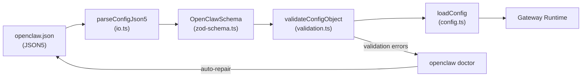
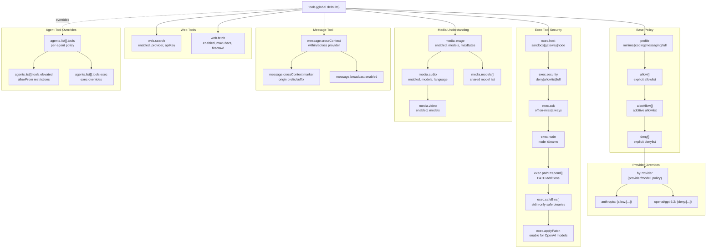
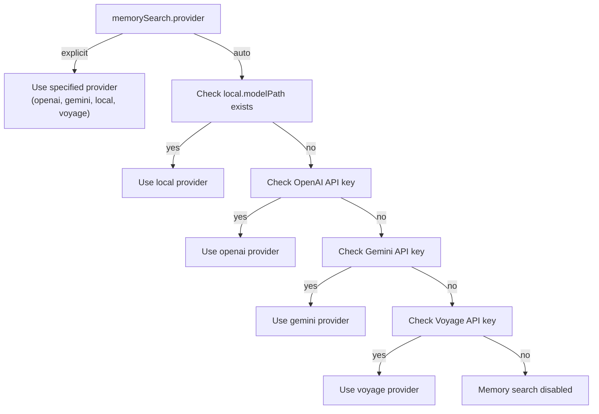
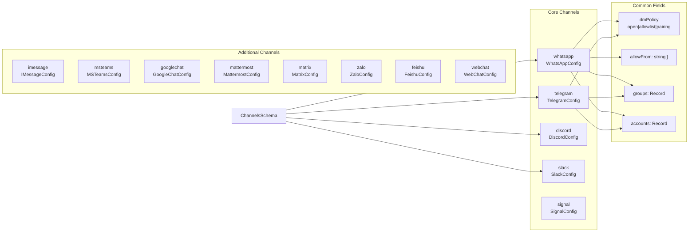
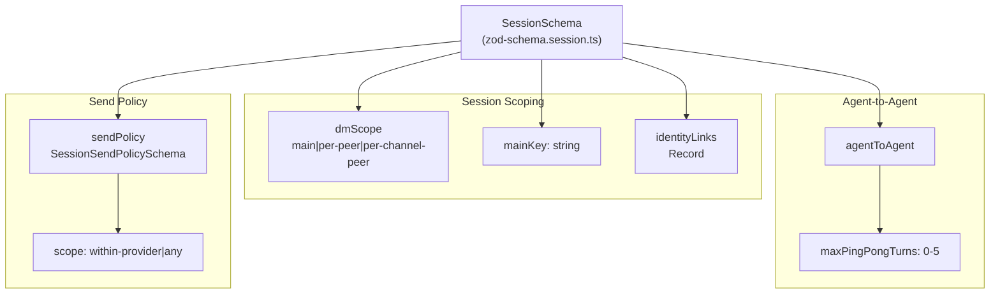
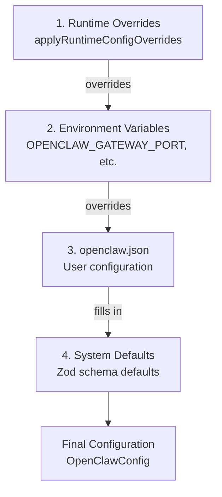
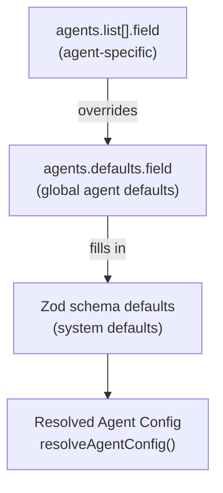

# Page: Configuration File Structure

# Configuration File Structure

<details>
<summary>Relevant source files</summary>

The following files were used as context for generating this wiki page:

- [CHANGELOG.md](CHANGELOG.md)
- [docs/cli/memory.md](docs/cli/memory.md)
- [docs/cli/sandbox.md](docs/cli/sandbox.md)
- [docs/concepts/memory.md](docs/concepts/memory.md)
- [docs/gateway/configuration.md](docs/gateway/configuration.md)
- [docs/gateway/sandbox-vs-tool-policy-vs-elevated.md](docs/gateway/sandbox-vs-tool-policy-vs-elevated.md)
- [docs/gateway/sandboxing.md](docs/gateway/sandboxing.md)
- [docs/platforms/mac/skills.md](docs/platforms/mac/skills.md)
- [docs/tools/elevated.md](docs/tools/elevated.md)
- [docs/tools/index.md](docs/tools/index.md)
- [docs/tools/skills-config.md](docs/tools/skills-config.md)
- [src/agents/memory-search.test.ts](src/agents/memory-search.test.ts)
- [src/agents/memory-search.ts](src/agents/memory-search.ts)
- [src/agents/sandbox-explain.test.ts](src/agents/sandbox-explain.test.ts)
- [src/agents/sandbox.ts](src/agents/sandbox.ts)
- [src/cli/memory-cli.test.ts](src/cli/memory-cli.test.ts)
- [src/cli/memory-cli.ts](src/cli/memory-cli.ts)
- [src/cli/models-cli.test.ts](src/cli/models-cli.test.ts)
- [src/config/schema.ts](src/config/schema.ts)
- [src/config/types.tools.ts](src/config/types.tools.ts)
- [src/config/types.ts](src/config/types.ts)
- [src/config/zod-schema.agent-runtime.ts](src/config/zod-schema.agent-runtime.ts)
- [src/config/zod-schema.ts](src/config/zod-schema.ts)
- [src/memory/embeddings.test.ts](src/memory/embeddings.test.ts)
- [src/memory/embeddings.ts](src/memory/embeddings.ts)
- [src/memory/manager.ts](src/memory/manager.ts)

</details>


This page documents the structure of `openclaw.json`, the primary configuration file for OpenClaw. It covers the top-level schema sections (`gateway`, `agents`, `channels`, `tools`, `models`, `memory`, etc.), how they map to Zod validation schemas, and their relationships to system components. For configuration editing patterns and hot-reload behavior, see [Configuration Management](#4.2). For multi-agent routing, see [Multi-Agent Configuration](#4.3).

---

## File Location and Validation

OpenClaw's configuration lives at `~/.openclaw/openclaw.json` by default. The file location can be overridden via `OPENCLAW_CONFIG_PATH` or the `--profile` flag.

**Format**: JSON5 (comments, trailing commas, unquoted keys supported)  
**Validation**: [src/config/zod-schema.ts:95-632]() defines `OpenClawSchema` using Zod  
**Parser**: [src/config/io.ts]() handles file I/O and JSON5 parsing  
**Encoding**: UTF-8

The Gateway refuses to start when the configuration file contains:
- Unknown keys (strict mode)
- Type mismatches
- Invalid values (out of range, malformed patterns, etc.)

Run `openclaw doctor` to validate and auto-repair configuration issues.

**Validation Chain**:



**Title**: Configuration Loading and Validation Pipeline

**Sources**: [src/config/config.ts:1-15](), [src/config/io.ts](), [src/config/zod-schema.ts:95-632](), [src/config/validation.ts]()

---

## Schema Organization and Structure

The `OpenClawSchema` from [src/config/zod-schema.ts:95-632]() is the root schema object. It imports and composes specialized schemas from domain-specific files:

| Schema File | Exports | Top-Level Keys |
|-------------|---------|----------------|
| [src/config/zod-schema.ts]() | `OpenClawSchema` | Root object (composes all domains) |
| [src/config/zod-schema.agents.ts]() | `AgentsSchema`, `AudioSchema`, `BindingsSchema`, `BroadcastSchema` | `agents`, `audio`, `bindings`, `broadcast` |
| [src/config/zod-schema.agent-runtime.ts]() | `ToolsSchema`, `SandboxDockerSchema`, `SandboxBrowserSchema`, `HeartbeatSchema` | `tools`, `agents.defaults.sandbox`, `agents.defaults.heartbeat` |
| [src/config/zod-schema.session.ts]() | `SessionSchema`, `MessagesSchema`, `CommandsSchema` | `session`, `messages`, `commands` |
| [src/config/zod-schema.providers.ts]() | `ChannelsSchema` | `channels` |
| [src/config/zod-schema.hooks.ts]() | `HookMappingSchema`, `HooksGmailSchema`, `InternalHooksSchema` | `hooks` |
| [src/config/zod-schema.approvals.ts]() | `ApprovalsSchema` | `approvals` |
| [src/config/zod-schema.core.ts]() | `ModelsConfigSchema`, `HexColorSchema` | `models`, `agents.defaults.models` |

```mermaid
graph TB
    OpenClawSchema["OpenClawSchema<br/>(zod-schema.ts:95)"]
    
    subgraph "Core Infrastructure"
        meta["meta<br/>z.object"]
        env["env<br/>z.object"]
        wizard["wizard<br/>z.object"]
        diagnostics["diagnostics<br/>z.object"]
        logging["logging<br/>z.object"]
        update["update<br/>z.object"]
    end
    
    subgraph "Gateway Control Plane"
        gateway["gateway<br/>z.object"]
        auth["auth<br/>z.object"]
        discovery["discovery<br/>z.object"]
        canvasHost["canvasHost<br/>z.object"]
        nodeHost["nodeHost<br/>NodeHostSchema"]
    end
    
    subgraph "Agent Runtime"
        agents["agents<br/>AgentsSchema"]
        tools["tools<br/>ToolsSchema"]
        bindings["bindings<br/>BindingsSchema"]
        broadcast["broadcast<br/>BroadcastSchema"]
        audio["audio<br/>AudioSchema"]
    end
    
    subgraph "Channels & Sessions"
        channels["channels<br/>ChannelsSchema"]
        session["session<br/>SessionSchema"]
        messages["messages<br/>MessagesSchema"]
        commands["commands<br/>CommandsSchema"]
    end
    
    subgraph "Extensions & Automation"
        plugins["plugins<br/>z.object"]
        skills["skills<br/>z.object"]
        hooks["hooks<br/>z.object"]
        cron["cron<br/>z.object"]
    end
    
    subgraph "UI & Media"
        ui["ui<br/>z.object"]
        browser["browser<br/>z.object"]
        media["media<br/>z.object"]
        talk["talk<br/>z.object"]
        web["web<br/>z.object"]
    end
    
    subgraph "Memory Backend"
        memory["memory<br/>MemorySchema"]
    end
    
    OpenClawSchema --> meta
    OpenClawSchema --> env
    OpenClawSchema --> gateway
    OpenClawSchema --> agents
    OpenClawSchema --> tools
    OpenClawSchema --> channels
    OpenClawSchema --> session
    OpenClawSchema --> plugins
    OpenClawSchema --> ui
    OpenClawSchema --> auth
    OpenClawSchema --> memory
    
    agents --> AgentsDefaults["agents.defaults<br/>AgentDefaultsConfig"]
    agents --> AgentsList["agents.list[]<br/>AgentConfig[]"]
    
    AgentsDefaults --> model["model<br/>ModelConfig"]
    AgentsDefaults --> memorySearch["memorySearch<br/>MemorySearchConfig"]
    AgentsDefaults --> sandbox["sandbox<br/>SandboxConfig"]
    
    tools --> exec["exec<br/>ExecToolConfig"]
    tools --> webTools["web<br/>{search, fetch}"]
    tools --> mediaTools["media<br/>MediaToolsConfig"]
    
    channels --> whatsapp["whatsapp<br/>WhatsAppConfig"]
    channels --> telegram["telegram<br/>TelegramConfig"]
    channels --> discord["discord<br/>DiscordConfig"]
```



**Title**: OpenClawSchema Structure and Domain Decomposition

This diagram maps JSON configuration keys to their Zod schema definitions across multiple schema files.

**Sources**: [src/config/zod-schema.ts:95-632](), [src/config/types.ts:1-32](), [src/config/zod-schema.agents.ts](), [src/config/zod-schema.agent-runtime.ts](), [src/config/zod-schema.session.ts](), [src/config/zod-schema.providers.ts]()

---

## Core Structure: Agents and Defaults

OpenClaw uses a **defaults-with-overrides** pattern: `agents.defaults` sets baseline configuration for all agents, and `agents.list[]` entries can override specific fields per agent. Multi-agent routing is configured via the top-level `bindings` array.

```mermaid
graph TB
    AgentsSchema["AgentsSchema<br/>(zod-schema.agents.ts)"]
    
    subgraph "Agent Defaults"
        AgentsDefaults["agents.defaults<br/>AgentDefaultsConfig"]
        Workspace["workspace: string"]
        RepoRoot["repoRoot: string | null"]
        AgentDir["agentDir: string"]
        BootstrapMaxChars["bootstrapMaxChars: number"]
        EnvelopeSettings["envelope*: string"]
        PromptMode["promptMode: full|minimal|none"]
    end
    
    subgraph "Model Configuration"
        ModelPrimary["model.primary: string"]
        ModelFallbacks["model.fallbacks: string[]"]
        ImageModel["imageModel.primary: string"]
        ImageFallbacks["imageModel.fallbacks: string[]"]
        CliBackends["cliBackends: string[]"]
        ModelsProviders["models.providers: Record"]
    end
    
    subgraph "Memory Search"
        MemorySearchConfig["memorySearch<br/>MemorySearchConfig"]
        MemoryEnabled["enabled: boolean"]
        MemoryProvider["provider: auto|openai|gemini|local"]
        MemoryModel["model: string"]
        MemoryStore["store.driver: sqlite"]
        MemorySync["sync.watch: boolean"]
    end
    
    subgraph "Tool Configuration"
        ToolsConfig["tools<br/>ToolsConfig"]
        ToolProfile["profile: minimal|coding|messaging|full"]
        ToolAllow["allow: string[] | null"]
        ToolAlsoAllow["alsoAllow: string[]"]
        ToolDeny["deny: string[]"]
        ToolByProvider["byProvider: Record"]
    end
    
    subgraph "Sandbox"
        SandboxConfig["sandbox<br/>SandboxConfig"]
        SandboxMode["mode: off|non-main|all"]
        SandboxScope["scope: session|agent|shared"]
        SandboxWorkspaceAccess["workspaceAccess: none|ro|rw"]
        SandboxDocker["docker: SandboxDockerConfig"]
        SandboxBrowser["browser: SandboxBrowserConfig"]
    end
    
    subgraph "Agent List"
        AgentsList["agents.list: AgentConfig[]"]
        Agent1["{ id: 'main', default: true }"]
        Agent2["{ id: 'work', workspace: '...' }"]
    end
    
    subgraph "Multi-Agent Routing"
        BindingsSchema["bindings<br/>BindingsSchema"]
        Binding1["{ agentId, match: { channel, accountId, peer } }"]
    end
    
    AgentsSchema --> AgentsDefaults
    AgentsSchema --> AgentsList
    
    AgentsDefaults --> Workspace
    AgentsDefaults --> ModelPrimary
    AgentsDefaults --> MemorySearchConfig
    AgentsDefaults --> ToolsConfig
    AgentsDefaults --> SandboxConfig
    
    ModelPrimary --> ModelFallbacks
    ModelPrimary --> ImageModel
    ModelPrimary --> ModelsProviders
    
    MemorySearchConfig --> MemoryEnabled
    MemorySearchConfig --> MemoryProvider
    MemorySearchConfig --> MemoryStore
    
    ToolsConfig --> ToolProfile
    ToolsConfig --> ToolAllow
    ToolsConfig --> ToolByProvider
    
    SandboxConfig --> SandboxMode
    SandboxConfig --> SandboxDocker
    SandboxConfig --> SandboxBrowser
    
    AgentsList --> Agent1
    AgentsList --> Agent2
    
    BindingsSchema --> Binding1
    Binding1 -.->|"routes to"| Agent1
```



**Title**: Agent Configuration Schema and Inheritance

This diagram shows the structure defined in `AgentsSchema`, `BindingsSchema`, and related types from [src/config/zod-schema.agents.ts]() and [src/config/types.agents.ts]().

**Example Configuration**:

```json5
{
  agents: {
    defaults: {
      workspace: "~/.openclaw/workspace",
      repoRoot: null, // auto-detect git root
      bootstrapMaxChars: 20000,
      envelopeTimezone: "local",
      envelopeTimestamp: "on",
      envelopeElapsed: "on",
      
      model: {
        primary: "anthropic/claude-sonnet-4-20250514",
        fallbacks: [
          "openai/gpt-4.5-turbo",
          "google/gemini-2.0-flash"
        ]
      },
      
      imageModel: {
        primary: null, // use main model if capable
        fallbacks: []
      },
      
      cliBackends: ["claude-cli"],
      
      models: {
        // provider-specific settings (see Models section)
      },
      
      memorySearch: {
        enabled: true,
        sources: ["memory"],
        extraPaths: [],
        provider: "auto", // openai|gemini|local|auto
        model: "text-embedding-3-small",
        // ... (see Memory Search section)
      },
      
      tools: {
        profile: "coding",
        allow: null,
        alsoAllow: [],
        deny: [],
        byProvider: {},
        // ... (see Tools section)
      },
      
      sandbox: {
        mode: "non-main",
        workspaceAccess: "rw",
        sessionToolsVisibility: "spawned",
        scope: "session",
        // ... (see Sandbox section)
      },
      
      humanDelay: {
        mode: "natural",
        minMs: 800,
        maxMs: 2500
      },
      
      heartbeat: {
        every: "30m",
        activeHours: {
          start: "08:00",
          end: "22:00",
          timezone: "America/New_York"
        },
        model: null,
        session: "main",
        includeReasoning: false,
        target: null,
        to: null,
        prompt: null,
        ackMaxChars: 1000
      }
    },
    
    list: [
      {
        id: "main",
        default: true,
        workspace: "~/.openclaw/workspace",
        agentDir: "~/.openclaw/agents/main"
      },
      {
        id: "work",
        workspace: "~/.openclaw/workspace-work",
        agentDir: "~/.openclaw/agents/work",
        model: {
          primary: "openai/gpt-5.2"
        },
        sandbox: {
          mode: "off"
        },
        bindings: [
          {
            channel: "whatsapp",
            accountId: "biz"
          }
        ]
      }
    ]
  }
}
```

**Field Purposes**:

| Field | Type | Default | Purpose |
|-------|------|---------|---------|
| `agents.defaults.workspace` | string | `~/.openclaw/workspace` | Agent workspace directory (bootstrap files, memory, skills) |
| `agents.defaults.repoRoot` | string? | null (auto-detect) | Repository root shown in system prompt |
| `agents.defaults.bootstrapMaxChars` | number | 20000 | Max chars per bootstrap file injected into system prompt |
| `agents.defaults.envelopeTimezone` | string | "local" | Timezone for message envelopes (utc, local, user, IANA) |
| `agents.defaults.envelopeTimestamp` | string | "on" | Include absolute timestamps in envelopes |
| `agents.defaults.envelopeElapsed` | string | "on" | Include elapsed time in envelopes |
| `agents.defaults.model.primary` | string | required | Primary model (provider/model format) |
| `agents.defaults.model.fallbacks` | string[] | [] | Ordered fallback models |
| `agents.defaults.imageModel.primary` | string? | null | Vision model (if primary lacks image input) |
| `agents.defaults.cliBackends` | string[] | [] | CLI fallbacks (claude-cli, etc) |
| `agents.defaults.humanDelay.mode` | string | "natural" | Delay style for replies (off, natural, custom) |
| `agents.defaults.heartbeat.every` | string? | null | Heartbeat interval (duration string: 30m, 1h) |
| `agents.list[].id` | string | required | Unique agent identifier |
| `agents.list[].default` | boolean | false | Mark as default agent |
| `agents.list[].workspace` | string? | inherits | Override workspace path |
| `agents.list[].bindings` | array? | [] | Channel routing rules (see Multi-Agent) |

**Sources**: [src/config/zod-schema.agent-runtime.ts:12-80](), [src/agents/memory-search.ts:1-143](), [docs/start/wizard.md:295-308]()

---

## Gateway Configuration

The Gateway control plane is configured under the `gateway` key. This controls WebSocket server binding, authentication, reload behavior, and node management.

```json5
{
  gateway: {
    mode: "local", // local|remote (required; gateway won't start if unset)
    port: 18789,
    bind: "loopback", // loopback|lan|tailnet|auto|custom
    
    auth: {
      mode: "token", // token|password|tailscale
      token: "generated-by-wizard", // required for non-loopback
      password: null
    },
    
    remote: {
      url: null, // ws:// or wss:// for remote mode
      sshTarget: null, // user@host or user@host:port for SSH tunnel
      sshIdentity: null, // path to SSH identity file
      token: null, // remote gateway token
      password: null,
      tlsFingerprint: null // sha256 TLS fingerprint to pin
    },
    
    controlUi: {
      basePath: "", // URL prefix (e.g. /openclaw)
      allowInsecureAuth: false, // allow token-only auth over HTTP
      dangerouslyDisableDeviceAuth: false // disable device identity checks
    },
    
    http: {
      endpoints: {
        chatCompletions: {
          enabled: false // OpenAI-compatible /v1/chat/completions
        }
      }
    },
    
    reload: {
      mode: "hybrid", // off|soft|restart|hybrid
      debounceMs: 500
    },
    
    nodes: {
      browser: {
        mode: "auto", // auto|manual|off
        node: null // pin to specific node id/name
      },
      allowCommands: [], // extra node.invoke commands
      denyCommands: [] // block specific commands
    },
    
    tailscale: {
      mode: "off", // off|serve|funnel
      hostname: null,
      resetOnExit: false
    }
  }
}
```

**Field Purposes**:

| Field | Type | Default | Purpose |
|-------|------|---------|---------|
| `gateway.mode` | string | required | Runtime mode (local starts gateway, remote connects) |
| `gateway.port` | number | 18789 | WebSocket + HTTP port |
| `gateway.bind` | string | "loopback" | Network binding (loopback=127.0.0.1, lan=0.0.0.0, tailnet=Tailscale IP) |
| `gateway.auth.mode` | string | "token" | Authentication method |
| `gateway.auth.token` | string? | null | Gateway token (required for non-loopback) |
| `gateway.auth.password` | string? | null | Gateway password (Tailscale funnel) |
| `gateway.remote.url` | string? | null | Remote gateway URL (ws:// or wss://) |
| `gateway.remote.sshTarget` | string? | null | SSH tunnel target (user@host:port) |
| `gateway.controlUi.basePath` | string | "" | URL prefix for Control UI |
| `gateway.controlUi.allowInsecureAuth` | boolean | false | Allow token-only auth over HTTP (not recommended) |
| `gateway.reload.mode` | string | "hybrid" | Hot reload strategy (off, soft, restart, hybrid) |
| `gateway.nodes.browser.mode` | string | "auto" | Browser node routing |
| `gateway.tailscale.mode` | string | "off" | Tailscale exposure (off, serve, funnel) |

**Sources**: [src/config/schema.ts:104-211](), [docs/gateway/index.md:1-117]()

---

## Tool Configuration

Tool policies control which tools the agent can use. The `ToolsSchema` from [src/config/zod-schema.agent-runtime.ts]() defines the complete structure. Policies cascade: `profile` → `allow`/`deny` → `byProvider` overrides → per-agent overrides → sandbox overrides.



**Title**: Tool Policy Cascade and Configuration Domains

**Example Configuration**:

```json5
{
  tools: {
    profile: "coding",
    
    // allow and alsoAllow cannot both be set in the same scope
    allow: null, // explicit allowlist (replaces profile)
    alsoAllow: ["lobster"], // additive to profile/allow
    deny: ["exec"], // explicit denylist
    
    byProvider: {
      "anthropic": {
        profile: "full",
        alsoAllow: ["browser"]
      },
      "openai/gpt-5.2": {
        deny: ["web_search"]
      }
    },
    
    exec: {
      host: "sandbox", // sandbox|gateway|node
      security: "allowlist", // deny|allowlist|full
      ask: "on-miss", // off|on-miss|always
      node: null, // default node for exec.host=node
      pathPrepend: ["/opt/homebrew/bin"],
      safeBins: ["cat", "echo", "grep"],
      backgroundMs: 2000,
      timeoutSec: 300,
      approvalRunningNoticeMs: 10000,
      cleanupMs: 3600000,
      notifyOnExit: true,
      applyPatch: {
        enabled: false,
        allowModels: ["gpt-5.2"]
      }
    },
    
    web: {
      search: {
        enabled: true,
        provider: "brave", // brave|perplexity
        apiKey: null, // defaults to BRAVE_API_KEY env
        maxResults: 5,
        timeoutSeconds: 10,
        cacheTtlMinutes: 60,
        perplexity: {
          apiKey: null,
          baseUrl: "https://openrouter.ai/api/v1",
          model: "perplexity/sonar-pro"
        }
      },
      fetch: {
        enabled: true,
        maxChars: 100000,
        timeoutSeconds: 10,
        cacheTtlMinutes: 60,
        maxRedirects: 3,
        userAgent: null,
        readability: true,
        firecrawl: {
          enabled: false,
          apiKey: null,
          baseUrl: "https://api.firecrawl.dev",
          onlyMainContent: true,
          maxAgeMs: null,
          timeoutSeconds: 30
        }
      }
    },
    
    media: {
      models: [
        {
          provider: "openai",
          model: "gpt-4o",
          capabilities: ["image", "audio"]
        }
      ],
      concurrency: 2,
      image: {
        enabled: true,
        maxBytes: 6000000,
        maxChars: 4000,
        prompt: "Describe this image in detail.",
        timeoutSeconds: 30,
        attachments: {
          mode: "first",
          maxAttachments: 1,
          prefer: "first"
        },
        models: [],
        scope: null
      },
      audio: {
        enabled: true,
        maxBytes: 25000000,
        maxChars: 10000,
        prompt: "Transcribe this audio.",
        timeoutSeconds: 60,
        language: null,
        attachments: {
          mode: "first",
          maxAttachments: 1
        },
        models: []
      },
      video: {
        enabled: true,
        maxBytes: 50000000,
        maxChars: 10000,
        prompt: "Describe this video.",
        timeoutSeconds: 120,
        attachments: {
          mode: "first",
          maxAttachments: 1
        },
        models: []
      }
    },
    
    links: {
      enabled: true,
      maxLinks: 3,
      timeoutSeconds: 10,
      models: []
    },
    
    message: {
      crossContext: {
        allowWithinProvider: true,
        allowAcrossProviders: false,
        marker: {
          enabled: true,
          prefix: "From {channel}: ",
          suffix: ""
        }
      },
      broadcast: {
        enabled: true
      }
    },
    
    elevated: {
      enabled: true,
      allowFrom: {
        whatsapp: ["+15555550123"],
        telegram: [123456789]
      }
    }
  }
}
```

**Tool Profiles**:

| Profile | Description | Included Tools |
|---------|-------------|----------------|
| `minimal` | Read-only queries | `memory_search`, `memory_get` |
| `coding` | Development tasks | `read`, `write`, `edit`, `apply_patch`, `exec`, `memory_*` |
| `messaging` | Cross-channel messaging | `message`, `sessions`, `memory_*` |
| `full` | All tools enabled | All available tools |

**Sources**: [src/config/types.tools.ts:1-430](), [src/config/zod-schema.agent-runtime.ts:1-300](), [src/agents/pi-tools.ts:115-167]()

---

## Memory Search Configuration

Memory search enables semantic search over workspace files using embeddings. The configuration structure:

| Type/Schema | File | Purpose |
|-------------|------|---------|
| `MemorySearchConfig` | [src/config/types.tools.ts:224-324]() | TypeScript type definition |
| `agents.defaults.memorySearch` | [src/config/zod-schema.agent-runtime.ts]() | Zod validation schema |
| `resolveMemorySearchConfig()` | [src/agents/memory-search.ts:120-196]() | Merge defaults + overrides |
| `MemoryIndexManager` | [src/memory/manager.ts:111-1000]() | Indexing and search implementation |

```json5
{
  agents: {
    defaults: {
      memorySearch: {
        enabled: true,
        sources: ["memory"], // memory|sessions
        extraPaths: [], // additional dirs/files to index
        
        experimental: {
          sessionMemory: false // index session transcripts
        },
        
        provider: "auto", // openai|gemini|local|auto
        
        remote: {
          baseUrl: null, // custom OpenAI-compatible endpoint
          apiKey: null, // defaults to env vars
          headers: {},
          batch: {
            enabled: true, // use batch API for indexing
            wait: true, // wait for batch completion
            concurrency: 2, // max concurrent batch jobs
            pollIntervalMs: 2000,
            timeoutMinutes: 60
          }
        },
        
        fallback: "none", // openai|gemini|local|none
        model: "text-embedding-3-small",
        
        local: {
          modelPath: null, // GGUF model path or hf: URI
          modelCacheDir: null
        },
        
        store: {
          driver: "sqlite",
          path: "~/.openclaw/memory/{agentId}.sqlite",
          vector: {
            enabled: true, // use sqlite-vec extension
            extensionPath: null // auto-detect or explicit path
          }
        },
        
        chunking: {
          tokens: 400,
          overlap: 80
        },
        
        sync: {
          onSessionStart: true, // index on session start
          onSearch: true, // lazy index on search
          watch: true, // watch files for changes
          watchDebounceMs: 1500,
          intervalMinutes: 0, // 0 = disabled
          sessions: {
            deltaBytes: 100000, // min bytes before reindex
            deltaMessages: 50 // min messages before reindex
          }
        },
        
        query: {
          maxResults: 6,
          minScore: 0.35,
          hybrid: {
            enabled: true, // BM25 + vector hybrid
            vectorWeight: 0.7,
            textWeight: 0.3,
            candidateMultiplier: 4
          }
        },
        
        cache: {
          enabled: true, // cache chunk embeddings
          maxEntries: 50000
        }
      }
    }
  }
}
```

**Memory Provider Auto-Selection** (from [src/agents/memory-search.ts:120-196]()):



**Title**: Memory Provider Auto-Selection Algorithm

**Index Path Token Substitution**:

- `store.path: "~/.openclaw/memory/{agentId}.sqlite"` → `{agentId}` replaced with agent ID

**Sources Configuration**:

| Source | Indexes | Notes |
|--------|---------|-------|
| `memory` | `MEMORY.md`, `memory.md`, `memory/*.md` | Default workspace memory files |
| `sessions` | `sessions/*.jsonl` | Session transcript JSONL files |
| `experimental.sessionMemory: true` | Same as `sources: ["sessions"]` | Opt-in flag |

**Sources**: [src/agents/memory-search.ts:1-196](), [src/memory/manager.ts:111-1000](), [docs/concepts/memory.md:1-180](), [src/config/types.tools.ts:224-324]()

---

## Sandbox Configuration

Sandboxes provide Docker-based isolation for agent execution. The `SandboxConfig` type from [src/agents/sandbox/types.ts]() defines the schema. The `resolveSandboxConfigForAgent` function from [src/agents/sandbox/config.ts]() merges per-agent overrides with defaults.

```mermaid
graph TB
    SandboxConfig["SandboxConfig<br/>(sandbox/types.ts)"]
    
    subgraph "Core Settings"
        SandboxMode["mode<br/>off | non-main | all"]
        SandboxScope["scope<br/>session | agent | shared"]
        WorkspaceAccess["workspaceAccess<br/>none | ro | rw"]
        WorkspaceRoot["workspaceRoot: string?"]
        SessionToolsVis["sessionToolsVisibility<br/>spawned | all"]
    end
    
    subgraph "Docker Runtime"
        DockerConfig["docker<br/>SandboxDockerConfig"]
        DockerImage["image: string"]
        DockerNetwork["network: string"]
        DockerUser["user: string"]
        DockerReadOnlyRoot["readOnlyRoot: boolean"]
        DockerBinds["binds: string[]"]
        DockerSetupCommand["setupCommand: string?"]
        DockerLimits["memory, cpus, pidsLimit"]
    end
    
    subgraph "Browser Sandbox"
        BrowserConfig["browser<br/>SandboxBrowserConfig"]
        BrowserEnabled["enabled: boolean"]
        BrowserImage["image: string"]
        BrowserCDP["cdpPort: number"]
        BrowserVNC["vncPort, noVncPort"]
        BrowserAutoStart["autoStart: boolean"]
    end
    
    subgraph "Prune Policy"
        PruneConfig["prune<br/>SandboxPruneConfig"]
        IdleHours["idleHours: number"]
        MaxAgeDays["maxAgeDays: number"]
    end
    
    subgraph "Tool Policy"
        SandboxTools["tools<br/>SandboxToolPolicy"]
        ToolsAllow["allow: string[]?"]
        ToolsDeny["deny: string[]?"]
    end
    
    SandboxConfig --> SandboxMode
    SandboxConfig --> SandboxScope
    SandboxConfig --> WorkspaceAccess
    SandboxConfig --> DockerConfig
    SandboxConfig --> BrowserConfig
    SandboxConfig --> PruneConfig
    SandboxConfig --> SandboxTools
    
    DockerConfig --> DockerImage
    DockerConfig --> DockerNetwork
    DockerConfig --> DockerBinds
    DockerConfig --> DockerSetupCommand
    
    BrowserConfig --> BrowserEnabled
    BrowserConfig --> BrowserCDP
    BrowserConfig --> BrowserAutoStart
    
    SandboxTools --> ToolsAllow
    SandboxTools --> ToolsDeny
```



**Title**: Sandbox Configuration Schema

This diagram maps to types in [src/agents/sandbox/types.ts:1-44]().

```json5
{
  agents: {
    defaults: {
      sandbox: {
        mode: "non-main", // off|non-main|all
        workspaceAccess: "rw", // none|ro|rw
        sessionToolsVisibility: "spawned", // spawned|all
        scope: "session", // session|agent|shared
        perSession: false, // deprecated: use scope instead
        workspaceRoot: null, // custom workspace root
        
        docker: {
          image: "ghcr.io/openclaw/sandbox:latest",
          containerPrefix: "openclaw-sandbox",
          workdir: "/workspace",
          readOnlyRoot: true,
          tmpfs: ["/tmp", "/run"],
          network: "none",
          user: "sandbox",
          capDrop: ["ALL"],
          env: {
            PATH: "/usr/local/bin:/usr/bin:/bin"
          },
          setupCommand: null, // run once per container creation
          pidsLimit: 512,
          memory: "512m",
          memorySwap: "1g",
          cpus: 1.0,
          ulimits: {
            nofile: { soft: 1024, hard: 2048 },
            nproc: 256
          },
          seccompProfile: null,
          apparmorProfile: null,
          dns: [],
          extraHosts: [],
          binds: [] // additional mounts
        },
        
        browser: {
          enabled: false, // enable sandbox browser
          image: "ghcr.io/openclaw/sandbox-browser:latest",
          containerPrefix: "openclaw-browser",
          cdpPort: 9222,
          vncPort: 5900,
          noVncPort: 6080,
          headless: true,
          enableNoVnc: false,
          allowHostControl: false,
          autoStart: false,
          autoStartTimeoutMs: 30000
        },
        
        prune: {
          idleHours: 24, // prune idle containers
          maxAgeDays: 7 // prune old containers
        }
      }
    }
  }
}
```

**Sandbox Mode**:

| Mode | Behavior |
|------|----------|
| `off` | No sandboxing; agent runs on host |
| `non-main` | Sandbox non-main sessions (keys that don't match `session.mainKey`) |
| `all` | Sandbox all sessions |

**Workspace Access**:

| Mode | Behavior |
|------|----------|
| `none` | No workspace access; isolated tmpfs |
| `ro` | Read-only workspace mount |
| `rw` | Read-write workspace mount |

**Sandbox Scope**:

| Scope | Behavior |
|-------|----------|
| `session` | One container per session key |
| `agent` | One container per agent (shared across sessions) |
| `shared` | One container shared across all agents |

**Sources**: [src/agents/sandbox/types.ts:1-44](), [src/agents/sandbox/config.ts:1-7](), [src/config/zod-schema.agent-runtime.ts:82-245]()

---

## Channel Configuration

Channels are configured under the `channels` key, validated by `ChannelsSchema` from [src/config/zod-schema.providers.ts](). Each messaging platform has its own schema with channel-specific fields. Multi-account support is provided via the `accounts` object pattern for most channels.



**Title**: Channel Configuration Schema Structure

This maps to definitions in [src/config/types.whatsapp.ts](), [src/config/types.telegram.ts](), [src/config/types.discord.ts](), etc.

```json5
{
  channels: {
    whatsapp: {
      // Account-based (default account = "default")
      // Credentials stored in ~/.openclaw/credentials/whatsapp/{accountId}/
      dmPolicy: "pairing", // open|allowlist|pairing
      allowFrom: [], // phone numbers (required for open DMs)
      selfChatMode: false, // same-phone setup
      debounceMs: 500, // batch rapid messages
      groups: {
        "*": { // default policy for all groups
          requireMention: true,
          mentionPatterns: ["@openclaw"]
        },
        "specific-group-id": {
          requireMention: false
        }
      }
    },
    
    telegram: {
      botToken: "123456:ABC-DEF...", // Bot API token
      dmPolicy: "pairing",
      allowFrom: [],
      streamMode: "off", // off|partial|block (draft streaming)
      draftChunk: {
        minChars: 200,
        maxChars: 800,
        breakPreference: "paragraph" // paragraph|newline|sentence
      },
      retry: {
        attempts: 3,
        minDelayMs: 500,
        maxDelayMs: 4000,
        jitter: 0.1
      },
      network: {
        autoSelectFamily: null // true|false|null (override Node.js)
      },
      timeoutSeconds: 500,
      capabilities: {
        inlineButtons: true
      },
      groups: {
        "*": {
          requireMention: true
        }
      },
      customCommands: [], // extra bot menu commands
      commands: {
        native: "auto", // bool|"auto"
        nativeSkills: "auto"
      }
    },
    
    discord: {
      token: "Bot MTk...", // Bot token
      dm: {
        policy: "pairing"
      },
      allowFrom: [],
      retry: {
        attempts: 3,
        minDelayMs: 500,
        maxDelayMs: 4000,
        jitter: 0.1
      },
      maxLinesPerMessage: 30,
      intents: {
        presence: false,
        guildMembers: false
      },
      guilds: {
        "*": {
          requireMention: true
        }
      },
      commands: {
        native: "auto",
        nativeSkills: "auto"
      }
    },
    
    slack: {
      botToken: "xoxb-...",
      appToken: "xapp-...",
      userToken: null,
      userTokenReadOnly: false,
      dm: {
        policy: "pairing"
      },
      allowBots: false,
      thread: {
        historyScope: "thread", // thread|channel
        inheritParent: false
      },
      commands: {
        native: "auto",
        nativeSkills: "auto"
      }
    },
    
    signal: {
      account: "+15555550123",
      dmPolicy: "pairing",
      allowFrom: [],
      cliPath: "~/.openclaw/tools/signal-cli/bin/signal-cli",
      groups: {
        "*": {
          requireMention: true
        }
      }
    },
    
    imessage: {
      cliPath: "/usr/local/bin/imsg",
      dmPolicy: "pairing",
      allowFrom: [],
      groups: {
        "*": {
          requireMention: true
        }
      }
    },
    
    mattermost: {
      botToken: "...",
      baseUrl: "https://chat.example.com",
      chatmode: "oncall", // oncall|onchar|onmessage
      oncharPrefixes: [">", "!"],
      requireMention: true
    }
  }
}
```

**DM Policy Options**:

| Policy | Behavior |
|--------|----------|
| `open` | Accept all DMs (requires `allowFrom: ["*"]`) |
| `allowlist` | Only accept DMs from `allowFrom` list |
| `pairing` | Unknown senders get a pairing code; approve via `openclaw pairing approve` |

**Sources**: [src/config/zod-schema.providers.ts](), [src/config/types.whatsapp.ts](), [src/config/types.telegram.ts](), [src/config/types.discord.ts](), [src/config/types.slack.ts]()

---

## Environment Variables and Auth

OpenClaw supports inline environment variable configuration and authentication profile management.

### Environment Configuration

The `env` section of `OpenClawSchema` from [src/config/zod-schema.ts:99-111]() supports:
- Direct key-value pairs for env vars
- `vars` object for additional variables
- `shellEnv` configuration to import from login shell

```json5
{
  env: {
    // Direct env vars (applied if not already set)
    OPENROUTER_API_KEY: "sk-or-...",
    
    // Additional vars
    vars: {
      GROQ_API_KEY: "gsk-...",
    },
    
    // Shell env import
    shellEnv: {
      enabled: true,
      timeoutMs: 15000
    }
  }
}
```

Environment variable substitution using `${VAR_NAME}` syntax is supported in any string config value. See [docs/gateway/configuration.md:315-343]() for details.

### Authentication Profiles

Authentication profiles and model provider configurations control how the agent authenticates with AI services. The `auth` section of `OpenClawSchema` defines profiles, rotation order, and cooldown settings.

```json5
{
  auth: {
    profiles: {
      "anthropic:main": {
        provider: "anthropic",
        mode: "apiKey",
        apiKey: "sk-ant-...",
        email: null,
        expiresAt: null
      },
      "openai:codex": {
        provider: "openai",
        mode: "oauth",
        accessToken: "...",
        refreshToken: "...",
        expiresAt: "2025-12-31T23:59:59Z",
        email: "user@example.com"
      }
    },
    
    order: {
      anthropic: ["anthropic:main", "anthropic:backup"],
      openai: ["openai:codex"]
    },
    
    cooldowns: {
      billingBackoffHours: 5,
      billingBackoffHoursByProvider: {
        anthropic: 3
      },
      billingMaxHours: 24,
      failureWindowHours: 24
    }
  },
  
  agents: {
    defaults: {
      models: {
        aliases: {
          "sonnet": "anthropic/claude-sonnet-4-20250514",
          "gpt5": "openai/gpt-5.2"
        },
        
        providers: {
          anthropic: {
            baseUrl: null,
            apiKey: null, // overrides profile
            headers: {},
            models: {}
          },
          openai: {
            baseUrl: null,
            apiKey: null,
            headers: {},
            models: {}
          },
          google: {
            baseUrl: "https://generativelanguage.googleapis.com",
            apiKey: null,
            headers: {},
            models: {}
          }
        }
      }
    }
  }
}
```

**Auth Profile Structure**:

| Field | Type | Purpose |
|-------|------|---------|
| `provider` | string | Provider ID (anthropic, openai, google, etc) |
| `mode` | string | Auth mode (apiKey, oauth, token, setupToken) |
| `apiKey` | string? | API key (for apiKey mode) |
| `accessToken` | string? | OAuth access token |
| `refreshToken` | string? | OAuth refresh token |
| `expiresAt` | string? | ISO timestamp for token expiry |
| `email` | string? | Account email (for display/tracking) |

**Auth Order**:

The `auth.order` map controls failover: when a profile fails, the system tries the next profile in the list for that provider.

**Cooldowns**:

- `billingBackoffHours`: Base backoff duration when a profile fails due to billing/credits
- `billingMaxHours`: Cap for exponential backoff
- `failureWindowHours`: Time window for tracking failures (older failures expire)

**Sources**: [src/config/zod-schema.ts:99-111](), [src/config/zod-schema.ts:242-268](), [docs/gateway/configuration.md:268-403]()

---

## Session and Message Configuration

Session and message settings control conversation scoping, DM routing, and message acknowledgment behavior. These are defined by `SessionSchema` and `MessagesSchema` from [src/config/zod-schema.session.ts]().

### Session Configuration



**Title**: Session Configuration Schema

### Message Configuration

The `MessagesSchema` defines ack reactions, queue behavior, inbound debouncing, and group chat settings.

```json5
{
  session: {
    dmScope: "main", // main|per-peer|per-channel-peer|per-account-channel-peer
    identityLinks: {
      "user@example.com": [
        "telegram:123456789",
        "whatsapp:+15555550123"
      ]
    },
    agentToAgent: {
      maxPingPongTurns: 3 // max reply-back turns
    }
  },
  
  messages: {
    ackReaction: "👀", // emoji for ack (empty disables)
    ackReactionScope: "group-mentions", // group-mentions|group-all|direct|all
    inbound: {
      debounceMs: 500 // batch rapid messages from same sender
    }
  }
}
```

**DM Scope Options**:

| Scope | Behavior |
|-------|----------|
| `main` | All DMs share one session (continuity across channels) |
| `per-peer` | One session per peer (channel-agnostic) |
| `per-channel-peer` | One session per (channel, peer) |
| `per-account-channel-peer` | One session per (channel, account, peer) |

**Identity Links**:

Maps canonical identities to provider-prefixed peer IDs. When a message arrives from a linked peer, the session key uses the canonical identity instead, enabling cross-channel continuity.

**Sources**: [src/config/zod-schema.session.ts:1-100](), [src/config/types.messages.ts](), [src/config/types.queue.ts]()

---

## Commands Configuration

The `CommandsSchema` from [src/config/zod-schema.session.ts]() controls command registration and execution.

```json5
{
  commands: {
    native: "auto", // bool | "auto" - register native commands
    nativeSkills: "auto", // bool | "auto" - register skill commands
    text: true, // allow text command parsing (slash)
    bash: false, // allow bash chat command (requires tools.elevated)
    bashForegroundMs: 2000,
    config: false, // allow /config chat command
    debug: false, // allow /debug chat command
    restart: false, // allow /restart and gateway restart tool
    useAccessGroups: true // enforce access-group policies
  }
}
```

**Sources**: [src/config/zod-schema.session.ts](), [docs/gateway/configuration.md:979-1013]()

---

## UI, Browser, and Media Configuration

### UI Configuration

```json5
{
  ui: {
    seamColor: "#FF5A2D", // accent color (hex)
    assistant: {
      name: "OpenClaw",
      avatar: null // path or URL
    }
  }
}
```

### Browser Configuration

```json5
{
  browser: {
    enabled: true,
    evaluateEnabled: false, // enable browser.evaluate action
    cdpUrl: null, // custom CDP endpoint
    remoteCdpTimeoutMs: 30000,
    remoteCdpHandshakeTimeoutMs: 10000,
    executablePath: null, // custom browser binary
    headless: true,
    noSandbox: false,
    attachOnly: false,
    defaultProfile: "chrome",
    snapshotDefaults: {
      mode: "efficient" // efficient mode
    },
    profiles: {
      "chrome": {
        cdpPort: 9222,
        driver: "clawd", // clawd | extension
        color: "#4285F4"
      }
    }
  }
}
```

### Audio/TTS Configuration

The `AudioSchema` from [src/config/zod-schema.agents.ts]() defines TTS settings:

```json5
{
  audio: {
    autoTts: {
      mode: "off", // off | on | intelligent
      provider: "openai", // openai | elevenlabs | edge
      voice: "alloy",
      model: "tts-1",
      speed: 1.0,
      channels: ["telegram", "discord"],
      excludeChannels: [],
      maxChars: 500,
      summarize: true
    },
    providers: {
      openai: {
        apiKey: null,
        model: "tts-1",
        voice: "alloy",
        speed: 1.0
      },
      elevenlabs: {
        apiKey: null,
        voiceId: null,
        model: "eleven_turbo_v2_5",
        stability: 0.5,
        similarityBoost: 0.75
      },
      edge: {
        voice: "en-US-JennyNeural",
        rate: "0%",
        pitch: "0%"
      }
    }
  }
}
```

**Sources**: [src/config/zod-schema.ts:187-228](), [src/config/zod-schema.ts:229-241](), [src/config/zod-schema.agents.ts]()

---

## Additional Subsystems

### Web Channel Runtime

The `web` section configures the WhatsApp Web runtime (Baileys):

```json5
{
  web: {
    enabled: true,
    heartbeatSeconds: 60,
    reconnect: {
      initialMs: 2000,
      maxMs: 120000,
      factor: 1.4,
      jitter: 0.2,
      maxAttempts: 0 // 0 = infinite
    }
  }
}
```

**Sources**: [src/config/zod-schema.ts:308-324](), [docs/gateway/configuration.md:1015-1034]()

### Hooks (Webhooks)

The `HooksSchema` from [src/config/zod-schema.hooks.ts]() enables webhook handling:

```json5
{
  hooks: {
    enabled: true,
    path: "/hooks", // base path
    token: "secret", // auth token
    maxBodyBytes: 1048576,
    presets: [], // preset configurations
    transformsDir: null, // custom transform scripts
    mappings: [
      {
        id: "github-issues",
        path: "/github",
        target: {
          sessionKey: "agent:main:main"
        },
        transform: {
          preset: "github"
        }
      }
    ],
    gmail: {
      enabled: false,
      clientId: null,
      clientSecret: null,
      redirectUri: null
    },
    internal: {
      heartbeat: {
        target: {
          sessionKey: "agent:main:main"
        }
      }
    }
  }
}
```

**Sources**: [src/config/zod-schema.hooks.ts](), [src/config/types.hooks.ts]()

### Cron Jobs

```json5
{
  cron: {
    enabled: true,
    store: "~/.openclaw/cron.json",
    maxConcurrentRuns: 3
  }
}
```

**Sources**: [src/config/zod-schema.ts:286-294]()

### Node Discovery

```json5
{
  discovery: {
    wideArea: {
      enabled: false
    },
    mdns: {
      mode: "full" // off | minimal | full
    }
  }
}
```

**Sources**: [src/config/zod-schema.ts:326-342]()

### Canvas Host

```json5
{
  canvasHost: {
    enabled: false,
    root: "~/.openclaw/canvas",
    port: 8080,
    liveReload: true
  }
}
```

**Sources**: [src/config/zod-schema.ts:343-351]()

### Talk (Voice Call)

```json5
{
  talk: {
    voiceId: null,
    voiceAliases: {},
    modelId: null,
    outputFormat: null,
    apiKey: null,
    interruptOnSpeech: true
  }
}
```

**Sources**: [src/config/zod-schema.ts:352-362]()

---

## Plugins and Skills

### Plugins

The `plugins` section enables extension loading and configuration:

```json5
{
  plugins: {
    enabled: true,
    allow: null, // optional allowlist
    deny: [], // optional denylist
    load: {
      paths: [] // additional plugin files/dirs
    },
    slots: {
      memory: "memory-core" // active memory plugin (or "none")
    },
    entries: {
      "memory-core": {
        enabled: true,
        config: {}
      },
      "msteams": {
        enabled: false,
        config: {
          botId: "...",
          botPassword: "..."
        }
      }
    },
    installs: {
      // CLI-managed install metadata (updated by openclaw plugins install)
      "plugin-name": {
        source: "npm", // npm | archive | path
        spec: "plugin-name@1.0.0",
        version: "1.0.0",
        installedAt: "2025-01-15T10:00:00Z"
      }
    }
  }
}
```

**Plugin Slots**:

Slots provide exclusive assignments for certain capabilities:

- `memory`: memory search provider (default: `memory-core`, or `"none"` to disable)

**Sources**: [src/config/zod-schema.ts:547-592](), [src/config/types.plugins.ts]()

### Skills

The `skills` section controls skill loading and installation:

```json5
{
  skills: {
    allowBundled: [], // restrict bundled skills
    load: {
      extraDirs: [], // additional skill directories
      watch: true,
      watchDebounceMs: 1500
    },
    install: {
      preferBrew: false,
      nodeManager: "pnpm" // npm|pnpm|yarn|bun
    },
    entries: {
      "skill-name": {
        enabled: true,
        apiKey: null,
        env: {},
        config: {}
      }
    }
  }
}
```

**Sources**: [src/config/zod-schema.ts:511-546](), [src/config/types.skills.ts]()

---

## Logging and Diagnostics

### Logging

```json5
{
  logging: {
    level: "info", // silent|fatal|error|warn|info|debug|trace
    file: "/tmp/openclaw/openclaw.log",
    consoleLevel: "info",
    consoleStyle: "pretty", // pretty|compact|json
    redactSensitive: "tools", // off|tools
    redactPatterns: [] // custom regex patterns
  }
}
```

**Sources**: [src/config/zod-schema.ts:154-186](), [docs/gateway/configuration.md:456-481]()

### Diagnostics

```json5
{
  diagnostics: {
    enabled: false,
    flags: [], // targeted diagnostics (e.g. ["telegram.http"])
    otel: {
      enabled: false,
      endpoint: "http://localhost:4318",
      protocol: "http/protobuf", // http/protobuf|grpc
      headers: {},
      serviceName: "openclaw",
      traces: true,
      metrics: true,
      logs: true,
      sampleRate: 1.0,
      flushIntervalMs: 5000
    },
    cacheTrace: {
      enabled: false,
      filePath: "~/.openclaw/logs/cache-trace.jsonl",
      includeMessages: true,
      includePrompt: true,
      includeSystem: true
    }
  }
}
```

**Sources**: [src/config/zod-schema.ts:122-153]()

---

## Multi-Agent Routing: Bindings

The top-level `bindings` array configures multi-agent routing, defined by `BindingsSchema` from [src/config/zod-schema.agents.ts]().

```json5
{
  bindings: [
    {
      agentId: "work",
      match: {
        channel: "whatsapp",
        accountId: "biz",
        peer: {
          kind: "group",
          id: "120363424282127706@g.us"
        }
      }
    },
    {
      agentId: "personal",
      match: {
        channel: "telegram",
        accountId: "personal"
      }
    }
  ]
}
```

**Match Order** (deterministic):

1. `match.peer` (specific peer/group/channel)
2. `match.guildId` (Discord)
3. `match.teamId` (MS Teams)
4. `match.accountId` (exact, no peer/guild/team)
5. `match.accountId: "*"` (channel-wide)
6. Default agent (`agents.list[].default` or first list entry)

**Sources**: [src/config/zod-schema.agents.ts](), [docs/gateway/configuration.md:733-780]()

---

## Broadcast: Multi-Agent Message Delivery

The `broadcast` section enables multi-agent routing for single messages:

```json5
{
  broadcast: {
    "120363424282127706@g.us": ["transcribe", "summarize"],
    "strategy": "parallel" // parallel|sequential
  }
}
```

When a message arrives at a broadcast peer, all listed agents receive it.

**Sources**: [src/config/zod-schema.agents.ts](), [docs/gateway/configuration.md:241-263]()

---

## Approvals: Exec Approval Configuration

The `approvals` section configures exec approval requirements:

```json5
{
  approvals: {
    elevated: {
      allowFrom: {
        whatsapp: ["+15555550123"],
        telegram: [123456789]
      }
    }
  }
}
```

This is distinct from `tools.elevated` (which controls availability). `approvals.elevated` gates specific senders for elevated exec.

**Sources**: [src/config/zod-schema.approvals.ts](), [src/config/types.approvals.ts]()

---

## Wizard Metadata

The `wizard` section stores metadata from CLI wizards:

```json5
{
  wizard: {
    lastRunAt: "2026-01-01T00:00:00.000Z",
    lastRunVersion: "2026.1.4",
    lastRunCommit: "abc1234",
    lastRunCommand: "configure",
    lastRunMode: "local"
  }
}
```

**Sources**: [src/config/zod-schema.ts:112-121](), [docs/gateway/configuration.md:439-453]()

---

## Meta and Update

```json5
{
  meta: {
    lastTouchedVersion: "0.1.0",
    lastTouchedAt: "2025-01-15T10:30:00Z"
  },
  
  update: {
    channel: "stable", // stable|beta|dev
    checkOnStart: true
  }
}
```

**Sources**: [src/config/schema.ts:105-107]()

---

## Configuration Validation and Loading

### Validation and Error Handling

The `validateConfigObject` function from [src/config/validation.ts]() enforces strict validation using `OpenClawSchema.parse()`. The validation chain:

1. **Parse JSON5**: [src/config/io.ts]() `parseConfigJson5()` handles JSON5 syntax
2. **Schema Validation**: [src/config/zod-schema.ts:95-632]() `OpenClawSchema` validates structure
3. **Custom Refinements**: [src/config/zod-schema.ts:602-632]() `superRefine()` checks cross-field constraints (e.g. `broadcast` agent IDs must exist in `agents.list`)
4. **Plugin Validation**: [src/config/schema.ts:313-335]() `buildConfigSchema()` merges plugin schemas

**Common Validation Failures**:

| Error Type | Cause | Example |
|------------|-------|---------|
| Unknown key | Strict mode rejects undocumented fields | `gateaway` instead of `gateway` |
| Type mismatch | Value doesn't match schema type | `port: "18789"` (string) instead of `18789` (number) |
| Invalid enum | Value not in allowed set | `gateway.bind: "everywhere"` (must be `loopback`, `lan`, `tailnet`, `auto`, `custom`) |
| Conflicting fields | Mutually exclusive settings | `tools.allow` and `tools.alsoAllow` both set in same scope |
| Cross-field constraint | Related fields are inconsistent | `broadcast["peer"]: ["agentX"]` but `agentX` not in `agents.list` |

**Recovery Commands**:

```bash
openclaw doctor           # report validation errors with fix-it hints
openclaw doctor --fix     # apply automated repairs (type coercion, migrations)
openclaw doctor --yes     # apply repairs without prompts
```

**Sources**: [src/config/validation.ts](), [src/config/zod-schema.ts:95-632](), [src/config/io.ts](), [src/config/schema.ts:313-335]()

### Loading and Include Directives

Configuration loading is handled by [src/config/io.ts]():

| Function | Purpose | Returns |
|----------|---------|---------|
| `loadConfig()` | Load and validate `openclaw.json` | `OpenClawConfig` |
| `parseConfigJson5()` | Parse JSON5 with comments | Parsed object |
| `readConfigFileSnapshot()` | Read raw config file | Raw JSON5 string |
| `writeConfigFile()` | Write validated config | void |
| `resolveConfigIncludes()` | Process `$include` directives | Merged object |

**Include Directive Syntax**:

The `$include` directive supports file splitting (see [docs/gateway/configuration.md:147-225]()):

```json5
{
  // Single file (replaces containing object)
  agents: { $include: "./agents.json5" },
  
  // Array of files (deep-merged in order)
  broadcast: {
    $include: ["./clients/a.json5", "./clients/b.json5"]
  },
  
  // Sibling keys merge after includes
  agents: {
    $include: "./agents.json5",
    defaults: {
      workspace: "~/.openclaw/workspace-override"
    }
  }
}
```

**Include Resolution**:
- Paths are relative to the file containing the `$include`
- Nested includes supported (max depth: 10)
- Circular includes are detected and rejected
- Missing files cause validation errors

**Sources**: [src/config/io.ts](), [docs/gateway/configuration.md:147-225]()

---

## Configuration Resolution and Precedence

### Global Precedence Chain

Configuration is resolved from multiple sources with the following precedence (highest to lowest):



**Title**: Configuration Precedence Chain

**Per-Agent Inheritance**:



**Title**: Per-Agent Configuration Inheritance

The `resolveAgentConfig` function from [src/agents/agent-scope.ts]() merges agent-specific overrides with defaults.

**Tool Policy Cascade**:

Tool policies cascade through multiple layers (see [src/agents/pi-tools.policy.ts](), [src/agents/tool-policy.ts:46-54]()):

1. **Tool profile** → base allowlist (`tools.profile` or `agents.list[].tools.profile`)
2. **Provider tool profile** → provider-specific base (`tools.byProvider[provider].profile`)
3. **Global tool policy** → global allow/deny (`tools.allow`/`tools.deny`)
4. **Provider tool policy** → provider allow/deny (`tools.byProvider[provider].allow`/`deny`)
5. **Agent tool policy** → agent allow/deny (`agents.list[].tools.allow`/`deny`)
6. **Agent provider policy** → agent + provider (`agents.list[].tools.byProvider[provider]`)
7. **Group tool policy** → channel/group-specific
8. **Sandbox tool policy** → sandbox restrictions (`tools.sandbox.tools`)
9. **Subagent tool policy** → subagent restrictions (`tools.subagents.tools`)

**Cascade Rule**: Each level can only **restrict** tools further; denied tools cannot be re-granted by downstream policies.

**Sources**: [src/config/runtime-overrides.ts](), [src/agents/agent-scope.ts](), [src/agents/pi-tools.policy.ts:28-33](), [src/agents/tool-policy.ts:46-54]()

---

## Complete Example Configuration

```json5
{
  meta: {
    lastTouchedVersion: "0.1.0",
    lastTouchedAt: "2025-01-15T10:30:00Z"
  },
  
  update: {
    channel: "stable",
    checkOnStart: true
  },
  
  gateway: {
    mode: "local",
    port: 18789,
    bind: "loopback",
    auth: {
      mode: "token",
      token: "generated-by-wizard"
    },
    controlUi: {
      basePath: "",
      allowInsecureAuth: false
    },
    reload: {
      mode: "hybrid",
      debounceMs: 500
    }
  },
  
  agents: {
    defaults: {
      workspace: "~/.openclaw/workspace",
      bootstrapMaxChars: 20000,
      
      model: {
        primary: "anthropic/claude-sonnet-4-20250514",
        fallbacks: ["openai/gpt-4.5-turbo"]
      },
      
      memorySearch: {
        enabled: true,
        provider: "auto",
        sources: ["memory"]
      },
      
      tools: {
        profile: "coding",
        exec: {
          host: "sandbox",
          security: "allowlist"
        }
      },
      
      sandbox: {
        mode: "non-main",
        workspaceAccess: "rw"
      }
    },
    
    list: [
      {
        id: "main",
        default: true
      }
    ]
  },
  
  auth: {
    profiles: {
      "anthropic:main": {
        provider: "anthropic",
        mode: "apiKey",
        apiKey: "sk-ant-..."
      }
    },
    order: {
      anthropic: ["anthropic:main"]
    }
  },
  
  channels: {
    whatsapp: {
      dmPolicy: "pairing",
      groups: {
        "*": {
          requireMention: true
        }
      }
    }
  },
  
  session: {
    dmScope: "main"
  },
  
  messages: {
    ackReaction: "👀",
    ackReactionScope: "group-mentions"
  },
  
  commands: {
    native: true,
    text: true
  },
  
  plugins: {
    enabled: true,
    slots: {
      memory: "memory-core"
    }
  },
  
  logging: {
    level: "info",
    consoleLevel: "info"
  }
}
```

**Sources**: [docs/index.md:149-166](), [docs/start/wizard.md:295-308]()

---