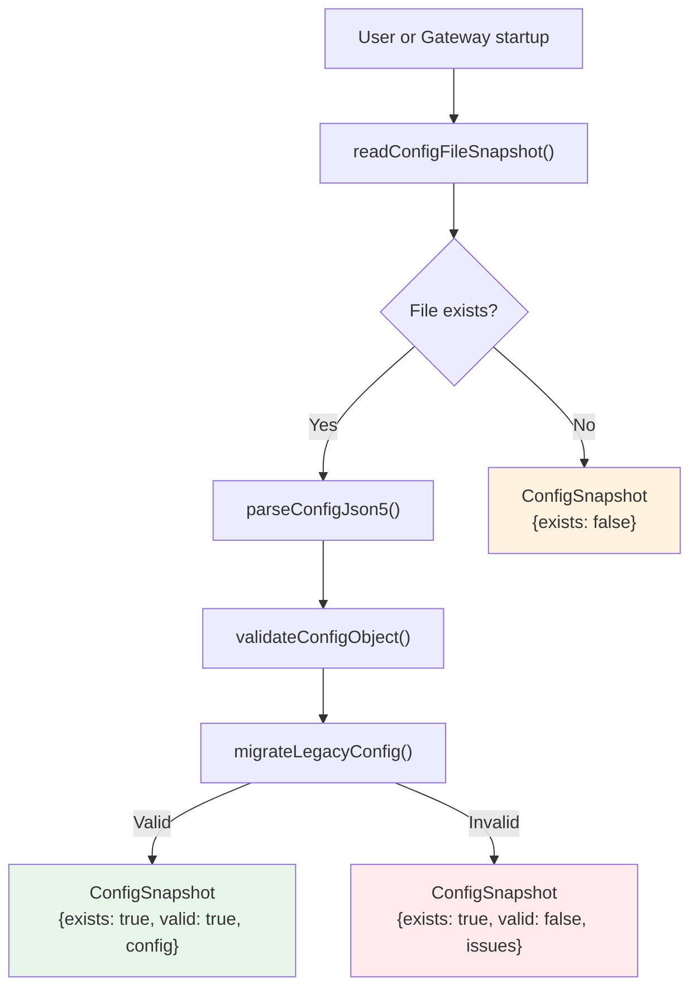
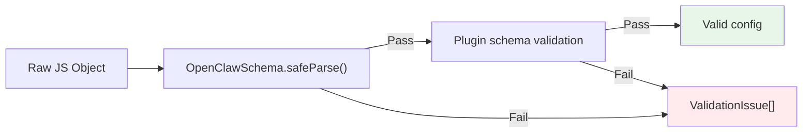
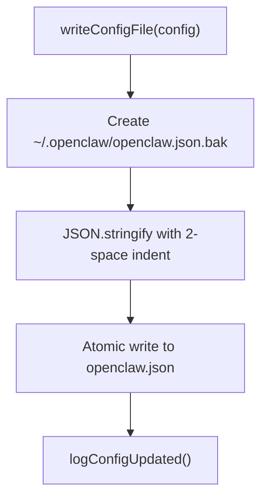
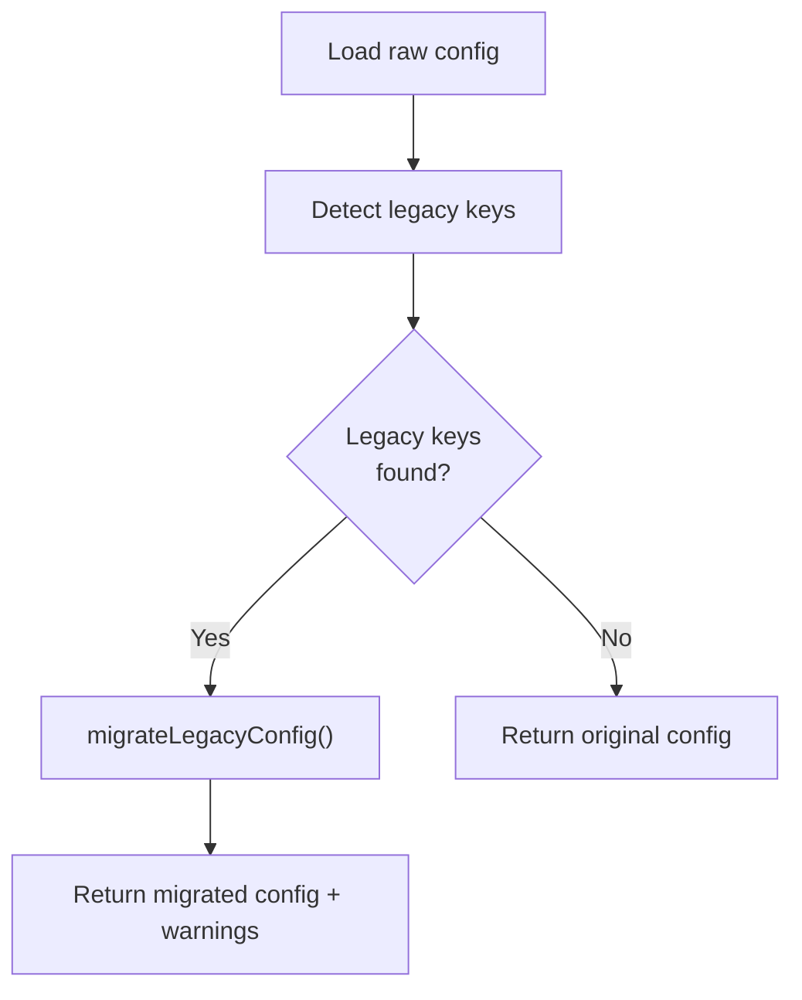
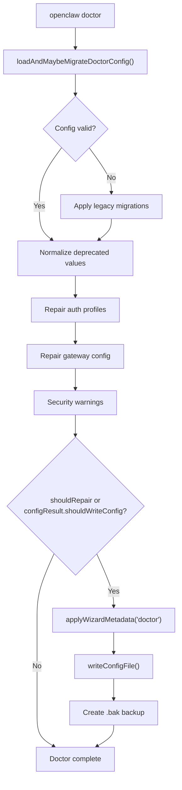
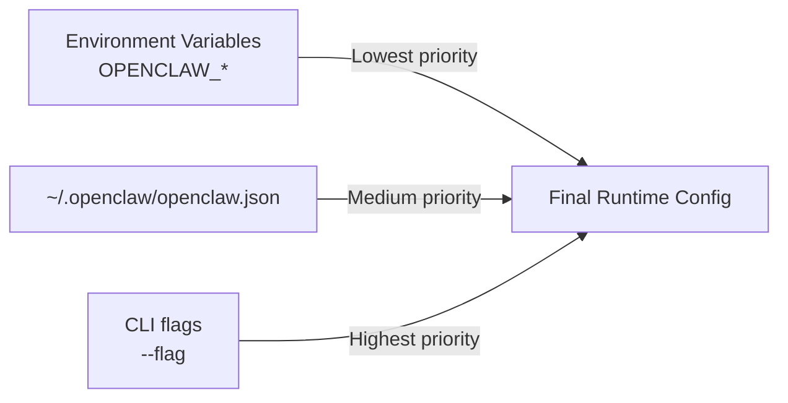

# Page: Configuration Management

# Configuration Management

<details>
<summary>Relevant source files</summary>

The following files were used as context for generating this wiki page:

- [CHANGELOG.md](CHANGELOG.md)
- [docs/cli/memory.md](docs/cli/memory.md)
- [docs/cli/sandbox.md](docs/cli/sandbox.md)
- [docs/concepts/memory.md](docs/concepts/memory.md)
- [docs/gateway/configuration.md](docs/gateway/configuration.md)
- [docs/gateway/doctor.md](docs/gateway/doctor.md)
- [docs/gateway/sandbox-vs-tool-policy-vs-elevated.md](docs/gateway/sandbox-vs-tool-policy-vs-elevated.md)
- [docs/gateway/sandboxing.md](docs/gateway/sandboxing.md)
- [docs/platforms/mac/skills.md](docs/platforms/mac/skills.md)
- [docs/tools/elevated.md](docs/tools/elevated.md)
- [docs/tools/index.md](docs/tools/index.md)
- [docs/tools/skills-config.md](docs/tools/skills-config.md)
- [src/agents/bash-tools.test.ts](src/agents/bash-tools.test.ts)
- [src/agents/memory-search.test.ts](src/agents/memory-search.test.ts)
- [src/agents/memory-search.ts](src/agents/memory-search.ts)
- [src/agents/pi-tools-agent-config.test.ts](src/agents/pi-tools-agent-config.test.ts)
- [src/agents/sandbox-explain.test.ts](src/agents/sandbox-explain.test.ts)
- [src/agents/sandbox-skills.test.ts](src/agents/sandbox-skills.test.ts)
- [src/agents/sandbox.ts](src/agents/sandbox.ts)
- [src/cli/memory-cli.test.ts](src/cli/memory-cli.test.ts)
- [src/cli/memory-cli.ts](src/cli/memory-cli.ts)
- [src/cli/models-cli.test.ts](src/cli/models-cli.test.ts)
- [src/commands/configure.gateway.test.ts](src/commands/configure.gateway.test.ts)
- [src/commands/configure.gateway.ts](src/commands/configure.gateway.ts)
- [src/commands/configure.ts](src/commands/configure.ts)
- [src/commands/doctor.ts](src/commands/doctor.ts)
- [src/commands/onboard-helpers.test.ts](src/commands/onboard-helpers.test.ts)
- [src/commands/onboard-helpers.ts](src/commands/onboard-helpers.ts)
- [src/commands/onboard-interactive.ts](src/commands/onboard-interactive.ts)
- [src/config/merge-config.ts](src/config/merge-config.ts)
- [src/config/schema.ts](src/config/schema.ts)
- [src/config/types.tools.ts](src/config/types.tools.ts)
- [src/config/types.ts](src/config/types.ts)
- [src/config/zod-schema.agent-runtime.ts](src/config/zod-schema.agent-runtime.ts)
- [src/config/zod-schema.ts](src/config/zod-schema.ts)
- [src/memory/embeddings.test.ts](src/memory/embeddings.test.ts)
- [src/memory/embeddings.ts](src/memory/embeddings.ts)
- [src/memory/manager.ts](src/memory/manager.ts)
- [src/wizard/onboarding.gateway-config.test.ts](src/wizard/onboarding.gateway-config.test.ts)
- [src/wizard/onboarding.gateway-config.ts](src/wizard/onboarding.gateway-config.ts)
- [src/wizard/onboarding.ts](src/wizard/onboarding.ts)
- [src/wizard/onboarding.types.ts](src/wizard/onboarding.types.ts)

</details>


## Purpose and Scope

This page documents how OpenClaw loads, validates, migrates, and repairs configuration files. It covers the loading pipeline from disk through JSON5 parsing and Zod validation, the migration system for legacy config keys, and the `doctor` command's automated repair capabilities.

For the structure and schema of the configuration file itself, see [Configuration File Structure](#4.1). For multi-agent configuration specifics, see [Multi-Agent Configuration](#4.3).

---

## Configuration Loading Pipeline

OpenClaw reads configuration from `~/.openclaw/openclaw.json` through a multi-stage pipeline that handles JSON5 syntax, validates against a Zod schema, and applies legacy migrations.

### Loading Flow



**Sources:** [src/config/config.ts:1-15](), [src/wizard/onboarding.ts:98-118](), [src/commands/doctor.ts:94-99]()

### Core Loading Functions

| Function | Purpose | Returns |
|----------|---------|---------|
| `readConfigFileSnapshot()` | Read and validate config from disk | `ConfigSnapshot` with validation status |
| `parseConfigJson5(text)` | Parse JSON5 text into JavaScript object | Parsed object or throws |
| `loadConfig()` | Load and validate current config | `OpenClawConfig` object |
| `validateConfigObject(obj)` | Validate raw object against Zod schema | Validation result with issues |
| `validateConfigObjectWithPlugins(obj)` | Validate including plugin-specific schemas | Extended validation result |

**Sources:** [src/config/config.ts:1-15]()

### ConfigSnapshot Structure

The `readConfigFileSnapshot()` function returns a typed snapshot containing:

```typescript
type ConfigSnapshot = {
  exists: boolean;           // File exists on disk
  valid: boolean;            // Passed validation
  config: OpenClawConfig;    // Parsed config (empty object if invalid)
  issues: ValidationIssue[]; // Validation errors
  path?: string;             // Config file path
}
```

**Sources:** [src/wizard/onboarding.ts:98-99]()

---

## JSON5 Parsing

OpenClaw uses JSON5 to allow comments, trailing commas, and unquoted keys in configuration files. The parser wraps standard JSON5 parsing with error handling.

### Supported JSON5 Features

- Single-line (`//`) and multi-line (`/* */`) comments
- Trailing commas in objects and arrays
- Unquoted object keys (when valid identifiers)
- Single-quoted strings
- Hexadecimal numbers

**Sources:** [src/config/config.ts:4]()

---

## Validation Pipeline

Configuration validation uses Zod schemas to enforce type safety and catch errors early. The validation pipeline runs during every config load operation.



**Sources:** [src/config/config.ts:13-14]()

### Validation Functions

**`validateConfigObject(obj)`**

Validates a raw object against the base `OpenClawSchema`. Used by all config loading paths.

**`validateConfigObjectWithPlugins(obj)`**

Extends base validation with plugin-specific schemas. Used when plugins are enabled and need to validate their configuration sections.

**Sources:** [src/config/config.ts:13-14]()

### Error Reporting

Validation errors are structured as `ValidationIssue` objects containing:

```typescript
type ValidationIssue = {
  path: string;      // JSON path to the invalid field (e.g. "gateway.port")
  message: string;   // Human-readable error message
  code?: string;     // Zod error code
}
```

Example from onboarding flow:

```typescript
if (snapshot.issues.length > 0) {
  await prompter.note(
    [
      ...snapshot.issues.map((iss) => `- ${iss.path}: ${iss.message}`),
      "",
      "Docs: https://docs.openclaw.ai/gateway/configuration",
    ].join("\n"),
    "Config issues",
  );
}
```

**Sources:** [src/wizard/onboarding.ts:103-112]()

---

## Configuration Writing

Configuration writes are atomic and include automatic backup creation.

### Write Flow



**Sources:** [src/config/config.ts:7](), [src/wizard/onboarding.ts:439-440](), [src/commands/doctor.ts:285-290]()

### Backup Behavior

Every config write creates a backup at `~/.openclaw/openclaw.json.bak` before modifying the main file. This allows rollback if the new config causes issues.

**Sources:** [src/commands/doctor.ts:287-290]()

### Wizard Metadata

Onboarding and doctor commands stamp metadata into the config to track when and how it was last modified:

```typescript
function applyWizardMetadata(
  cfg: OpenClawConfig,
  params: { command: string; mode: OnboardMode },
): OpenClawConfig {
  const commit = process.env.GIT_COMMIT?.trim() || process.env.GIT_SHA?.trim() || undefined;
  return {
    ...cfg,
    wizard: {
      ...cfg.wizard,
      lastRunAt: new Date().toISOString(),
      lastRunVersion: VERSION,
      lastRunCommit: commit,
      lastRunCommand: params.command,
      lastRunMode: params.mode,
    },
  };
}
```

**Sources:** [src/commands/onboard-helpers.ts:91-107](), [src/commands/doctor.ts:284]()

---

## Legacy Configuration Migration

OpenClaw automatically migrates deprecated configuration keys to their current equivalents. Migrations run during every config load and are idempotent.

### Migration Flow



**Sources:** [src/config/config.ts:9](), [src/commands/doctor.ts:94-99]()

### Supported Migrations

The migration system handles these legacy key patterns:

| Legacy Key | Current Key | Notes |
|------------|-------------|-------|
| `routing.allowFrom` | `channels.whatsapp.allowFrom` | Channel-specific allowlist |
| `routing.groupChat.requireMention` | `channels.*.groups."*".requireMention` | Per-channel group policy |
| `routing.groupChat.historyLimit` | `messages.groupChat.historyLimit` | Message settings |
| `routing.groupChat.mentionPatterns` | `messages.groupChat.mentionPatterns` | Message settings |
| `routing.queue` | `messages.queue` | Message queueing |
| `routing.bindings` | `bindings` | Top-level bindings |
| `routing.agents` / `routing.defaultAgentId` | `agents.list` + `agents.list[].default` | Multi-agent config |
| `routing.agentToAgent` | `tools.agentToAgent` | Tool configuration |
| `routing.transcribeAudio` | `tools.media.audio.models` | Audio transcription |
| `bindings[].match.accountID` | `bindings[].match.accountId` | Case normalization |
| `identity` | `agents.list[].identity` | Per-agent identity |
| `agent.*` | `agents.defaults` + `tools.*` | Agent defaults split |

**Sources:** [docs/gateway/doctor.md:112-128]()

### Auto-Migration on Startup

The Gateway automatically runs config migration on startup when it detects legacy keys. This ensures configs remain compatible across updates without manual intervention.

Commands that refuse to run when legacy keys are detected will instruct users to run `openclaw doctor` to apply migrations.

**Sources:** [docs/gateway/doctor.md:108-110](), [src/wizard/onboarding.ts:98-118]()

---

## Doctor Command: Configuration Repair

The `doctor` command provides automated config validation, migration, and repair. It can detect and fix configuration issues without user intervention when run with `--fix` or `--repair` flags.

### Doctor Configuration Flow



**Sources:** [src/commands/doctor.ts:65-313]()

### Doctor Entry Point

The `doctorCommand()` function orchestrates all health checks and repairs:

```typescript
export async function doctorCommand(
  runtime: RuntimeEnv = defaultRuntime,
  options: DoctorOptions = {},
) {
  const prompter = createDoctorPrompter({ runtime, options });
  printWizardHeader(runtime);
  intro("OpenClaw doctor");

  const configResult = await loadAndMaybeMigrateDoctorConfig({
    options,
    confirm: (p) => prompter.confirm(p),
  });
  let cfg: OpenClawConfig = configResult.cfg;
  
  // ... validation, migration, and repair steps ...
  
  const shouldWriteConfig = prompter.shouldRepair || configResult.shouldWriteConfig;
  if (shouldWriteConfig) {
    cfg = applyWizardMetadata(cfg, { command: "doctor", mode: resolveMode(cfg) });
    await writeConfigFile(cfg);
    logConfigUpdated(runtime);
  }
}
```

**Sources:** [src/commands/doctor.ts:65-313]()

### Configuration Repair Actions

| Repair Action | Trigger | Auto-Fix with `--fix` |
|---------------|---------|----------------------|
| Legacy key migration | Legacy keys detected | ✅ Always |
| Config normalization | Deprecated value shapes | ✅ Always |
| Gateway token generation | No `gateway.auth.token` on local gateway | ❌ Prompt only (use `--generate-gateway-token` to force) |
| Auth profile repair | Expired OAuth tokens | ❌ Interactive only |
| OpenCode Zen provider override warning | `models.providers.opencode` set | ℹ️ Warning only |

**Sources:** [src/commands/doctor.ts:94-160](), [docs/gateway/doctor.md:59-83]()

### Config Normalization

Doctor normalizes legacy value shapes even if the keys are correct. For example, it converts `messages.ackReaction` without channel-specific overrides into the current nested structure.

**Sources:** [docs/gateway/doctor.md:90-97]()

### Gateway Token Generation

When `gateway.auth.token` is missing on a local gateway, doctor offers to generate a random token:

```typescript
if (needsToken) {
  note(
    "Gateway auth is off or missing a token. Token auth is now the recommended default (including loopback).",
    "Gateway auth",
  );
  const shouldSetToken =
    options.generateGatewayToken === true
      ? true
      : options.nonInteractive === true
        ? false
        : await prompter.confirmRepair({
            message: "Generate and configure a gateway token now?",
            initialValue: true,
          });
  if (shouldSetToken) {
    const nextToken = randomToken();
    cfg = {
      ...cfg,
      gateway: {
        ...cfg.gateway,
        auth: {
          ...cfg.gateway?.auth,
          mode: "token",
          token: nextToken,
        },
      },
    };
    note("Gateway token configured.", "Gateway auth");
  }
}
```

**Sources:** [src/commands/doctor.ts:125-159]()

### Interactive vs Non-Interactive Mode

Doctor supports headless operation with different repair strategies:

| Flag | Behavior |
|------|----------|
| (none) | Interactive prompts for repairs |
| `--yes` | Accept default repair prompts |
| `--repair` | Apply recommended repairs without prompts |
| `--repair --force` | Apply aggressive repairs (overwrites custom configs) |
| `--non-interactive` | Only apply safe migrations, skip repairs requiring confirmation |

**Sources:** [docs/gateway/doctor.md:20-44]()

---

## Configuration Precedence and Overrides

OpenClaw supports runtime configuration overrides through environment variables and CLI flags.

### Runtime Override Resolution



**Sources:** [src/config/config.ts:11]()

### Common Environment Overrides

| Environment Variable | Config Key | Purpose |
|---------------------|------------|---------|
| `OPENCLAW_GATEWAY_TOKEN` | `gateway.auth.token` | Gateway authentication token |
| `OPENCLAW_GATEWAY_PASSWORD` | `gateway.auth.password` | Gateway authentication password |
| `OPENCLAW_STATE_DIR` | (implicit) | State directory location |

**Sources:** [src/wizard/onboarding.ts:297-299]()

---

## Configuration Change Application

Configuration changes require different actions depending on which sections are modified:

| Config Section | Change Application |
|----------------|-------------------|
| `gateway.*` | Gateway restart required |
| `agents.*` | Next agent invocation picks up changes |
| `channels.*` | Channel monitors restart automatically |
| `tools.*` | Next agent invocation picks up changes |
| `models.*` | Immediate effect on next model call |

Gateway restarts can be triggered via:
- `openclaw gateway restart`
- Gateway protocol method `gateway.restart` with `delayMs`
- Gateway service restart (launchd/systemd)

**Sources:** [src/commands/doctor.ts:268-280]()

---

## Error Recovery Patterns

OpenClaw implements several error recovery patterns for configuration issues:

### Invalid Config at Startup

When the Gateway detects an invalid config at startup, it:
1. Attempts automatic migration
2. Logs validation errors
3. Refuses to start if still invalid
4. Suggests running `openclaw doctor` to repair

**Sources:** [src/wizard/onboarding.ts:101-118]()

### Invalid Config During Doctor

When doctor encounters an invalid config:
1. Displays validation issues with JSON paths
2. Shows migration preview
3. Prompts for migration/repair
4. Creates `.bak` backup before writing
5. Validates the repaired config before exiting

**Sources:** [src/commands/doctor.ts:303-310]()

### Config Backup and Rollback

Every config write creates a timestamped backup:
```
~/.openclaw/openclaw.json.bak
```

To rollback:
```bash
cp ~/.openclaw/openclaw.json.bak ~/.openclaw/openclaw.json
openclaw gateway restart
```

**Sources:** [src/commands/doctor.ts:287-290]()

---