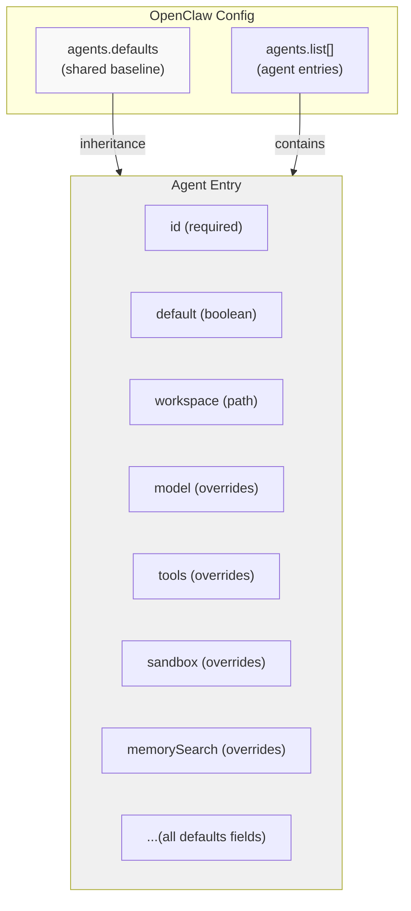
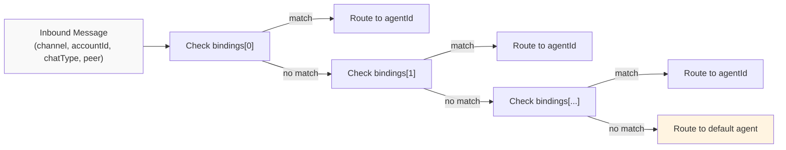
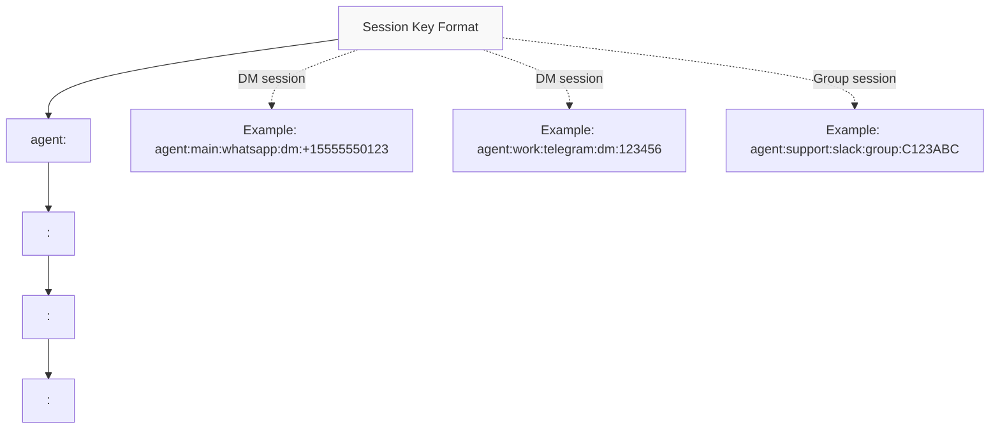
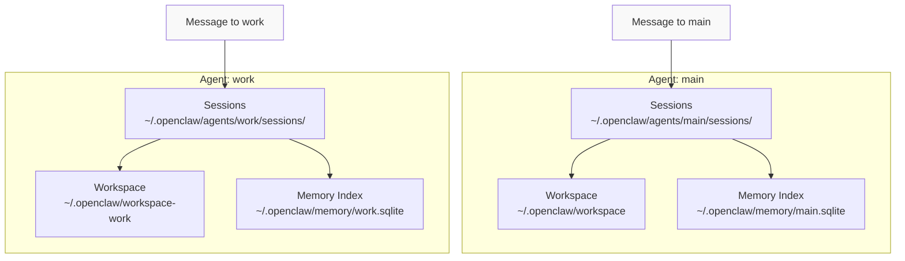

# Page: Multi-Agent Configuration

# Multi-Agent Configuration

<details>
<summary>Relevant source files</summary>

The following files were used as context for generating this wiki page:

- [CHANGELOG.md](CHANGELOG.md)
- [docs/cli/memory.md](docs/cli/memory.md)
- [docs/cli/sandbox.md](docs/cli/sandbox.md)
- [docs/concepts/memory.md](docs/concepts/memory.md)
- [docs/gateway/configuration.md](docs/gateway/configuration.md)
- [docs/gateway/sandbox-vs-tool-policy-vs-elevated.md](docs/gateway/sandbox-vs-tool-policy-vs-elevated.md)
- [docs/gateway/sandboxing.md](docs/gateway/sandboxing.md)
- [docs/platforms/mac/skills.md](docs/platforms/mac/skills.md)
- [docs/tools/elevated.md](docs/tools/elevated.md)
- [docs/tools/index.md](docs/tools/index.md)
- [docs/tools/skills-config.md](docs/tools/skills-config.md)
- [src/agents/memory-search.test.ts](src/agents/memory-search.test.ts)
- [src/agents/memory-search.ts](src/agents/memory-search.ts)
- [src/agents/sandbox-explain.test.ts](src/agents/sandbox-explain.test.ts)
- [src/agents/sandbox.ts](src/agents/sandbox.ts)
- [src/cli/memory-cli.test.ts](src/cli/memory-cli.test.ts)
- [src/cli/memory-cli.ts](src/cli/memory-cli.ts)
- [src/cli/models-cli.test.ts](src/cli/models-cli.test.ts)
- [src/commands/agent.test.ts](src/commands/agent.test.ts)
- [src/commands/agent.ts](src/commands/agent.ts)
- [src/config/schema.ts](src/config/schema.ts)
- [src/config/types.tools.ts](src/config/types.tools.ts)
- [src/config/types.ts](src/config/types.ts)
- [src/config/zod-schema.agent-runtime.ts](src/config/zod-schema.agent-runtime.ts)
- [src/config/zod-schema.ts](src/config/zod-schema.ts)
- [src/cron/isolated-agent.ts](src/cron/isolated-agent.ts)
- [src/cron/run-log.test.ts](src/cron/run-log.test.ts)
- [src/cron/run-log.ts](src/cron/run-log.ts)
- [src/cron/store.ts](src/cron/store.ts)
- [src/gateway/protocol/index.ts](src/gateway/protocol/index.ts)
- [src/gateway/protocol/schema.ts](src/gateway/protocol/schema.ts)
- [src/gateway/protocol/schema/agents-models-skills.ts](src/gateway/protocol/schema/agents-models-skills.ts)
- [src/gateway/protocol/schema/protocol-schemas.ts](src/gateway/protocol/schema/protocol-schemas.ts)
- [src/gateway/protocol/schema/types.ts](src/gateway/protocol/schema/types.ts)
- [src/gateway/server-methods-list.ts](src/gateway/server-methods-list.ts)
- [src/gateway/server-methods.ts](src/gateway/server-methods.ts)
- [src/gateway/server-methods/agents.ts](src/gateway/server-methods/agents.ts)
- [src/gateway/server.ts](src/gateway/server.ts)
- [src/memory/embeddings.test.ts](src/memory/embeddings.test.ts)
- [src/memory/embeddings.ts](src/memory/embeddings.ts)
- [src/memory/manager.ts](src/memory/manager.ts)

</details>


This page covers OpenClaw's multi-agent system: how to define multiple isolated agents, route messages to them via bindings, and override per-agent settings. For overall configuration structure, see [Configuration File Structure](#4.1). For session management and isolation, see [Session Management](#5.3).

---

## Overview

OpenClaw supports running **multiple isolated agents** in a single gateway instance. Each agent has:

- A unique `id`
- Its own workspace directory (file system + memory)
- Isolated session transcripts
- Isolated memory index
- Optional per-agent overrides (tools, models, sandbox, etc.)

Messages route to agents via **bindings** that match on channel, accountId, chatType, peer, or other session attributes. When no binding matches, the **default agent** handles the message.

---

## Agent Definitions

### Configuration Structure

Agents are defined in `agents.list[]`. All fields from `agents.defaults` can be overridden per-agent.



**Sources:** [src/config/zod-schema.ts:276](), [docs/gateway/configuration.md:282-300]()

### Minimal Example

```json5
{
  agents: {
    defaults: {
      workspace: "~/.openclaw/workspace"
    },
    list: [
      { id: "main", default: true },
      { id: "work", workspace: "~/.openclaw/workspace-work" }
    ]
  }
}
```

### Full Example with Overrides

```json5
{
  agents: {
    defaults: {
      workspace: "~/.openclaw/workspace",
      model: { primary: "anthropic/claude-sonnet-4-5" },
      tools: { profile: "coding" }
    },
    list: [
      {
        id: "main",
        default: true
      },
      {
        id: "support",
        workspace: "~/.openclaw/workspace-support",
        model: { primary: "openai/gpt-5.2" },
        tools: { profile: "messaging", allow: ["slack", "discord"] },
        sandbox: { mode: "off" }
      },
      {
        id: "research",
        workspace: "~/.openclaw/workspace-research",
        tools: { deny: ["exec", "process", "bash"] },
        memorySearch: { extraPaths: ["~/research-notes"] }
      }
    ]
  }
}
```

**Sources:** [docs/gateway/configuration.md:282-300](), [src/config/zod-schema.ts:276]()

### Required Fields

| Field | Type | Description |
|-------|------|-------------|
| `id` | string | Unique agent identifier (alphanumeric + hyphens) |

All other fields are optional and inherit from `agents.defaults`.

### Common Overrides

| Field | Purpose |
|-------|---------|
| `default` | Mark as the default agent (exactly one agent must have `default: true`) |
| `workspace` | Isolated workspace directory |
| `model` | Per-agent primary model and fallbacks |
| `tools` | Tool allowlist/denylist and profiles |
| `sandbox` | Sandbox mode, scope, and workspace access |
| `memorySearch` | Memory provider, extraPaths, and indexing settings |
| `heartbeat` | Heartbeat schedule and target |
| `thinkingDefault` | Default thinking level |
| `verboseDefault` | Default verbose level |

**Sources:** [src/commands/agent.ts:96-99](), [docs/gateway/configuration.md:282-300]()

---

## Routing and Bindings

### Bindings Array

The `bindings[]` array routes messages to agents based on match rules. Bindings are evaluated **in order**; the first match wins.



**Sources:** [docs/gateway/configuration.md:282-300](), [src/routing/session-key.ts]()

### Match Rules

Each binding has:
- `agentId` (required): target agent ID
- `match` (optional): match criteria object

Match fields (all optional, all must match if specified):

| Field | Type | Description | Example |
|-------|------|-------------|---------|
| `channel` | string | Channel provider | `"whatsapp"`, `"telegram"` |
| `accountId` | string | Channel account ID | `"personal"`, `"biz"` |
| `chatType` | string | Chat type | `"direct"`, `"group"` |
| `peer` | string | Peer identifier | `"whatsapp:+15555550123"` |
| `keyPrefix` | string | Session key prefix | `"agent:main:whatsapp"` |

Empty `match` object or omitted `match` means "match all".

### Binding Examples

**Route by channel account:**

```json5
{
  bindings: [
    { agentId: "home", match: { channel: "whatsapp", accountId: "personal" } },
    { agentId: "work", match: { channel: "whatsapp", accountId: "biz" } }
  ]
}
```

**Route by chat type:**

```json5
{
  bindings: [
    { agentId: "support", match: { chatType: "group" } },
    { agentId: "main", match: { chatType: "direct" } }
  ]
}
```

**Route by peer:**

```json5
{
  bindings: [
    { agentId: "personal", match: { peer: "telegram:123456" } },
    { agentId: "main" }  // catch-all
  ]
}
```

**Sources:** [docs/gateway/configuration.md:282-300](), [src/routing/session-key.ts]()

---

## Session Isolation

### Session Key Structure

Session keys embed the agent ID, ensuring complete isolation between agents.



**Key properties:**
- Sessions for different agents **never collide**, even with the same peer
- Session transcripts are stored per-agent: `~/.openclaw/agents/<agentId>/sessions/*.jsonl`
- Memory indexes are per-agent: `~/.openclaw/memory/<agentId>.sqlite`

**Sources:** [src/config/sessions.ts:42-44](), [src/routing/session-key.ts](), [src/memory/manager.ts:110-112]()

### Per-Agent Isolation



**Isolated resources per agent:**
- Workspace files (`IDENTITY.md`, `SKILLS.md`, `MEMORY.md`, `memory/*.md`)
- Session transcripts (`sessions/*.jsonl`)
- Memory index database
- Sandbox containers (when `sandbox.scope: "agent"`)
- Auth profile overrides (stored in session entries)

**Sources:** [src/commands/agent.ts:96-99](), [src/memory/manager.ts:169-179](), [src/config/sessions/paths.ts]()

---

## Agent Resolution

### Resolution Chain

```mermaid
graph TD
    Start["Resolve Agent ID"]
    
    Start --> CLI{CLI --agent flag?}
    CLI -->|"yes"| ValidateCLI["Validate against agents.list"]
    ValidateCLI -->|"valid"| UseCLI["Use CLI agent"]
    ValidateCLI -->|"invalid"| Error["Throw error"]
    
    CLI -->|"no"| SessionKey{Session key provided?}
    SessionKey -->|"yes"| ExtractAgent["Extract agentId from key"]
    ExtractAgent --> UseExtracted["Use extracted agent"]
    
    SessionKey -->|"no"| Bindings{Check bindings[]}
    Bindings -->|"match found"| UseBinding["Use binding agentId"]
    Bindings -->|"no match"| UseDefault["Use default agent"]
    
    style Start fill:#f9f9f9
    style UseDefault fill:#fff4e1
    style Error fill:#ffe1e1
```

**Sources:** [src/commands/agent.ts:78-95](), [src/routing/session-key.ts]()

### Default Agent

Exactly one agent must have `default: true`. If no agent is explicitly marked as default, the system uses the first agent in `agents.list[]`.

```json5
{
  agents: {
    list: [
      { id: "main", default: true },
      { id: "work" }
    ]
  }
}
```

**Resolution logic:**
1. First agent with `default: true`
2. If none, first agent in list
3. If list is empty, synthetic agent with id `"main"`

**Sources:** [src/agents/agent-scope.ts](), [src/cli/memory-cli.ts:60-78]()

### CLI Agent Override

The `--agent` flag forces agent selection:

```bash
openclaw agent --message "Hello" --to "+15555550123" --agent work
openclaw memory status --agent research
openclaw sandbox explain --agent support
```

If the specified agent ID doesn't exist in `agents.list[]`, the command fails with an error listing valid agent IDs.

**Sources:** [src/commands/agent.ts:78-86](), [src/cli/memory-cli.ts:60-78]()

---

## Per-Agent Overrides

### Overridable Fields

All `agents.defaults` fields can be overridden per-agent. Common overrides:

| Category | Fields |
|----------|--------|
| **Workspace** | `workspace`, `skipBootstrap` |
| **Models** | `model.primary`, `model.fallbacks`, `models` (catalog) |
| **Tools** | `tools.profile`, `tools.allow`, `tools.deny`, `tools.byProvider`, `tools.elevated`, `tools.exec` |
| **Sandbox** | `sandbox.mode`, `sandbox.scope`, `sandbox.workspaceAccess`, `sandbox.docker`, `sandbox.browser` |
| **Memory** | `memorySearch.enabled`, `memorySearch.provider`, `memorySearch.extraPaths` |
| **Behavior** | `thinkingDefault`, `verboseDefault`, `contextTokens`, `compaction`, `heartbeat` |

**Inheritance rules:**
- Agent-specific fields **override** defaults entirely (no deep merge)
- Objects like `model`, `tools`, `sandbox` replace defaults at the top level
- Arrays like `tools.allow` replace defaults (not appended)

**Sources:** [src/config/zod-schema.agents.js](), [docs/gateway/configuration.md:282-300]()

### Tools Override Example

```json5
{
  agents: {
    defaults: {
      tools: {
        profile: "coding",
        deny: ["web_search"]
      }
    },
    list: [
      {
        id: "support",
        tools: {
          profile: "messaging",  // replaces "coding"
          allow: ["slack", "discord"],
          // deny is not inherited (override is complete replacement)
        }
      }
    ]
  }
}
```

**Sources:** [docs/tools/index.md:66-80](), [src/config/types.tools.ts:199-222]()

### Sandbox Override Example

```json5
{
  agents: {
    defaults: {
      sandbox: {
        mode: "non-main",
        scope: "session",
        workspaceAccess: "none"
      }
    },
    list: [
      {
        id: "trusted",
        sandbox: {
          mode: "off"  // fully replace defaults
        }
      },
      {
        id: "restricted",
        sandbox: {
          mode: "all",
          scope: "agent",
          workspaceAccess: "ro"
        }
      }
    ]
  }
}
```

**Sources:** [docs/gateway/sandboxing.md:12-43](), [src/config/zod-schema.agent-runtime.ts:87-143]()

### Memory Override Example

```json5
{
  agents: {
    defaults: {
      memorySearch: {
        provider: "openai",
        extraPaths: []
      }
    },
    list: [
      {
        id: "research",
        memorySearch: {
          provider: "gemini",
          extraPaths: ["~/research-papers", "~/datasets/notes"]
        }
      },
      {
        id: "support",
        memorySearch: {
          enabled: false  // disable memory for this agent
        }
      }
    ]
  }
}
```

**Sources:** [src/agents/memory-search.ts:8-71](), [docs/concepts/memory.md:242-261]()

---

## Agent Management

### Gateway RPC Methods

Agents can be managed via Gateway WebSocket RPC:

| Method | Purpose |
|--------|---------|
| `agents.list` | List all configured agents |
| `agents.create` | Create new agent (writes config) |
| `agents.update` | Update agent fields (writes config) |
| `agents.delete` | Delete agent (writes config) |
| `agents.files.list` | List files in agent workspace |
| `agents.files.get` | Read agent workspace file |
| `agents.files.set` | Write agent workspace file |

**Sources:** [CHANGELOG.md:92](), [src/gateway/protocol/schema.ts:1-16]()

### CLI Commands

```bash
# List agents
openclaw agents list

# Add agent (interactive)
openclaw agents add

# Delete agent
openclaw agents delete work

# View agent workspace
ls ~/.openclaw/agents/main/
```

**Sources:** [src/commands/agent.ts:3-9](), [docs/cli/agents.md]()

---

## Configuration Schema

### `agents.defaults`

All per-agent fields inherit from this baseline.

```typescript
{
  workspace?: string;
  skipBootstrap?: boolean;
  model?: {
    primary?: string;
    fallbacks?: string[];
  };
  models?: Record<string, { alias?: string; ... }>;
  tools?: ToolPolicyConfig;
  sandbox?: SandboxConfig;
  memorySearch?: MemorySearchConfig;
  thinkingDefault?: "off" | "low" | "medium" | "high" | "xhigh";
  verboseDefault?: "off" | "on" | "full";
  contextTokens?: number;
  compaction?: CompactionConfig;
  heartbeat?: HeartbeatConfig;
  subagents?: SubagentsConfig;
  // ... all agent runtime settings
}
```

**Sources:** [src/config/types.agent-defaults.ts](), [src/config/zod-schema.agents.js]()

### `agents.list[]`

Array of agent entries. Each entry extends `agents.defaults`.

```typescript
{
  id: string;                    // required
  default?: boolean;             // exactly one must be true
  workspace?: string;
  model?: ModelConfig;
  tools?: AgentToolsConfig;
  sandbox?: SandboxConfig;
  memorySearch?: MemorySearchConfig;
  // ... all overrides
}
```

**Sources:** [src/config/types.agents.ts](), [src/config/zod-schema.agents.js]()

### `bindings[]`

Array of routing rules. Evaluated in order; first match wins.

```typescript
{
  agentId: string;               // required
  match?: {
    channel?: string;
    accountId?: string;
    chatType?: "direct" | "group" | "channel";
    peer?: string;
    keyPrefix?: string;
  };
}
```

**Sources:** [src/config/zod-schema.agents.js](), [docs/gateway/configuration.md:282-300]()

---

## Use Cases

### Separate Personal and Work Agents

```json5
{
  agents: {
    defaults: {
      model: { primary: "anthropic/claude-sonnet-4-5" }
    },
    list: [
      { 
        id: "personal", 
        default: true,
        workspace: "~/.openclaw/personal"
      },
      { 
        id: "work",
        workspace: "~/work/openclaw-workspace"
      }
    ]
  },
  bindings: [
    { agentId: "work", match: { channel: "slack" } },
    { agentId: "personal" }  // catch-all
  ]
}
```

### Sandboxed Support Agent

```json5
{
  agents: {
    defaults: {
      sandbox: { mode: "off" }
    },
    list: [
      { id: "main", default: true },
      {
        id: "support",
        workspace: "~/.openclaw/support",
        tools: { profile: "messaging" },
        sandbox: {
          mode: "all",
          scope: "agent",
          workspaceAccess: "none"
        }
      }
    ]
  },
  bindings: [
    { agentId: "support", match: { chatType: "group" } },
    { agentId: "main", match: { chatType: "direct" } }
  ]
}
```

### Research Agent with Custom Memory Paths

```json5
{
  agents: {
    list: [
      { id: "main", default: true },
      {
        id: "research",
        workspace: "~/research/openclaw",
        tools: { 
          deny: ["exec", "process", "bash"]
        },
        memorySearch: {
          provider: "gemini",
          extraPaths: [
            "~/research/papers",
            "~/research/notes",
            "~/datasets/summaries"
          ]
        }
      }
    ]
  },
  bindings: [
    { agentId: "research", match: { peer: "telegram:research_bot" } },
    { agentId: "main" }
  ]
}
```

**Sources:** [docs/gateway/configuration.md:282-300](), [docs/concepts/memory.md:242-261]()

---

## Related Pages

- [Configuration File Structure](#4.1) — Full config schema reference
- [Configuration Management](#4.2) — Hot reload, CLI tools, and doctor
- [Session Management](#5.3) — Session keys, scoping, and transcripts
- [Tool Policy Resolution](#6.3) — How tool allowlists cascade
- [Memory](#7) — Per-agent memory indexing and search
- [Sandboxing](#6.2) — Sandbox modes, scopes, and workspace access

---

**Sources:** [src/config/zod-schema.ts:276-280](), [src/config/types.agents.ts](), [src/commands/agent.ts:3-99](), [src/routing/session-key.ts](), [docs/gateway/configuration.md:282-300](), [src/agents/agent-scope.ts](), [src/memory/manager.ts:169-179]()

---