# Page: Agent System

# Agent System

<details>
<summary>Relevant source files</summary>

The following files were used as context for generating this wiki page:

- [docs/concepts/system-prompt.md](docs/concepts/system-prompt.md)
- [docs/gateway/background-process.md](docs/gateway/background-process.md)
- [docs/gateway/cli-backends.md](docs/gateway/cli-backends.md)
- [docs/reference/token-use.md](docs/reference/token-use.md)
- [src/agents/auth-profiles/oauth.fallback-to-main-agent.test.ts](src/agents/auth-profiles/oauth.fallback-to-main-agent.test.ts)
- [src/agents/auth-profiles/oauth.ts](src/agents/auth-profiles/oauth.ts)
- [src/agents/bash-process-registry.test.ts](src/agents/bash-process-registry.test.ts)
- [src/agents/bash-process-registry.ts](src/agents/bash-process-registry.ts)
- [src/agents/bash-tools.ts](src/agents/bash-tools.ts)
- [src/agents/cli-backends.ts](src/agents/cli-backends.ts)
- [src/agents/cli-runner.test.ts](src/agents/cli-runner.test.ts)
- [src/agents/cli-runner.ts](src/agents/cli-runner.ts)
- [src/agents/cli-runner/helpers.ts](src/agents/cli-runner/helpers.ts)
- [src/agents/pi-embedded-helpers.ts](src/agents/pi-embedded-helpers.ts)
- [src/agents/pi-embedded-runner.test.ts](src/agents/pi-embedded-runner.test.ts)
- [src/agents/pi-embedded-runner.ts](src/agents/pi-embedded-runner.ts)
- [src/agents/pi-embedded-runner/compact.ts](src/agents/pi-embedded-runner/compact.ts)
- [src/agents/pi-embedded-runner/run/attempt.ts](src/agents/pi-embedded-runner/run/attempt.ts)
- [src/agents/pi-embedded-runner/system-prompt.ts](src/agents/pi-embedded-runner/system-prompt.ts)
- [src/agents/pi-embedded-subscribe.ts](src/agents/pi-embedded-subscribe.ts)
- [src/agents/pi-tools.ts](src/agents/pi-tools.ts)
- [src/agents/system-prompt-params.ts](src/agents/system-prompt-params.ts)
- [src/agents/system-prompt-report.ts](src/agents/system-prompt-report.ts)
- [src/agents/system-prompt.test.ts](src/agents/system-prompt.test.ts)
- [src/agents/system-prompt.ts](src/agents/system-prompt.ts)
- [src/auto-reply/reply/agent-runner.heartbeat-typing.runreplyagent-typing-heartbeat.retries-after-compaction-failure-by-resetting-session.test.ts](src/auto-reply/reply/agent-runner.heartbeat-typing.runreplyagent-typing-heartbeat.retries-after-compaction-failure-by-resetting-session.test.ts)
- [src/auto-reply/reply/commands-context-report.ts](src/auto-reply/reply/commands-context-report.ts)
- [src/gateway/gateway-cli-backend.live.test.ts](src/gateway/gateway-cli-backend.live.test.ts)
- [src/telegram/group-migration.test.ts](src/telegram/group-migration.test.ts)
- [src/telegram/group-migration.ts](src/telegram/group-migration.ts)

</details>


## Purpose and Scope

The Agent System is the core execution engine of OpenClaw. It orchestrates model inference, tool execution, and session management for all agent interactions. This page covers the architecture, execution flow, and configuration of agents.

For specific subsystems, see:
- **[Agent Execution Flow](#5.1)** for detailed message processing pipelines
- **[System Prompt](#5.2)** for prompt construction and customization
- **[Session Management](#5.3)** for session keys, history, and compaction
- **[Model Selection and Failover](#5.4)** for model configuration and auth profile rotation

**Sources**: [CHANGELOG.md:1-850](), [README.md:1-500]()

---

## Architecture Overview

The Agent System wraps the Pi Agent Core library (`@mariozechner/pi-agent-core`) and provides OpenClaw-specific integrations for channels, tools, sandboxing, and configuration. The primary entry point is `runEmbeddedPiAgent`, which manages the full lifecycle of an agent turn.


**Key Abstractions**:
- **EmbeddedPiAgentMeta**: Configuration for an agent instance (workspace, model, tools, sandbox)
- **EmbeddedPiRunMeta**: Per-turn metadata (session key, message, channel context)
- **EmbeddedPiRunResult**: Execution outcome (success, error, usage, timing)
- **SubscribeEmbeddedPiSessionParams**: Streaming callbacks for real-time output

**Sources**: [src/agents/pi-embedded-runner.ts:1-28](), [src/agents/pi-embedded-runner/run.ts:1-100](), [README.md:130-200]()

---

## Agent Execution Flow

### Queue Management and Lanes

Agent execution supports two queue modes:
- **Sequential** (`session`): One turn at a time per session
- **Concurrent** (`global`): Parallel turns across all sessions

Queue modes are resolved via `resolveSessionLane` and `resolveGlobalLane` using configuration `agents.defaults.queue.mode`.


**Key Functions**:
- `queueEmbeddedPiMessage` [src/agents/pi-embedded-runner/runs.ts:100-200](): Queue a message for execution
- `resolveSessionLane` [src/agents/pi-embedded-runner/lanes.ts:10-40](): Determine if sequential or concurrent
- `acquireSessionWriteLock` [src/agents/session-write-lock.ts:10-60](): Prevent concurrent modifications

**Sources**: [src/agents/pi-embedded-runner/run.ts:50-150](), [src/agents/pi-embedded-runner/lanes.ts:1-80](), [src/agents/pi-embedded-runner/runs.ts:1-300]()

---

### Attempt Execution Model

Each agent turn may involve multiple attempts due to failover. The `runEmbeddedAttempt` function handles a single inference attempt with full context assembly.


**Key Files**:
- `runEmbeddedAttempt` [src/agents/pi-embedded-runner/run/attempt.ts:80-500](): Single inference attempt orchestration
- `subscribeEmbeddedPiSession` [src/agents/pi-embedded-subscribe.ts:30-200](): Event streaming and callbacks
- `createOpenClawCodingTools` [src/agents/pi-tools.ts:100-400](): Tool registry construction

**Sources**: [src/agents/pi-embedded-runner/run/attempt.ts:1-600](), [src/agents/pi-embedded-subscribe.ts:1-300](), [src/agents/pi-tools.ts:1-500]()

---

## System Prompt Construction

The system prompt is assembled from multiple sources with configurable sections. The `buildAgentSystemPrompt` function coordinates all prompt sections.

### Prompt Modes

Three modes control which sections are included:
- **full**: All sections (default for main agent)
- **minimal**: Reduced sections (Tooling, Workspace, Runtime) - used for subagents
- **none**: Just basic identity line, no sections


**Key Functions**:
- `buildAgentSystemPrompt` [src/agents/system-prompt.ts:129-400](): Assemble all prompt sections
- `resolveBootstrapContextForRun` [src/agents/bootstrap-files.ts:50-200](): Load bootstrap files
- `resolveSkillsPromptForRun` [src/agents/skills.ts:100-300](): Build skills XML

**Prompt Section Summary**:

| Section | Condition | Purpose |
|---------|-----------|---------|
| User Identity | `ownerNumbers` set | Identify authorized users |
| Current Date & Time | `userTimezone` set | Time zone for scheduling |
| Skills (mandatory) | `skillsPrompt` present | Skill discovery and loading |
| Memory Recall | `memory_search` tool available | Memory integration guidance |
| Messaging | Not minimal mode | Cross-channel messaging rules |
| Voice (TTS) | `ttsHint` set | TTS tag usage |
| Reply Tags | Not minimal mode | Native reply/quote syntax |
| Documentation | `docsPath` set | OpenClaw docs reference |
| Reasoning Format | `reasoningTagHint` true | `<think>/<final>` tag usage |
| CLI Quick Reference | Always (full mode) | Gateway commands |
| Runtime Environment | `runtimeInfo` present | Host/OS/model context |
| Tooling | `toolNames` present | Available tool list |
| Workspace | Always | Workspace directory |
| Sandbox | Sandbox enabled | Browser bridge, elevated mode |

**Sources**: [src/agents/system-prompt.ts:1-500](), [docs/concepts/system-prompt.md:1-200](), [src/agents/bootstrap-files.ts:1-300]()

---

## Session Management

Sessions are identified by session keys and stored as JSONL files via the Pi Agent Core `SessionManager`.

### Session Key Format

Session keys follow a hierarchical pattern:
```
agent:{agentId}:{channel}:{scope}:{identifier}
```

Examples:
- `agent:main:whatsapp:dm:+15555550123` (DM)
- `agent:main:telegram:group:123456789` (group)
- `agent:work:slack:dm:U0123ABC` (multi-agent DM)

**Key Resolution**:
- `deriveSessionKey` [src/config/sessions.ts:50-150](): Generate session key from channel/message context
- `resolveSessionKey` [src/config/sessions.ts:150-250](): Normalize and validate session key format

### Session Storage

Sessions are stored as JSONL files:
- **Location**: `~/.openclaw/sessions/{sessionKey}.jsonl`
- **Format**: One JSON object per line (messages, metadata, events)
- **Management**: `SessionManager` from `@mariozechner/pi-coding-agent`


**History Limits**:
- **DM sessions**: `session.dmHistoryLimit` (default: no limit)
- **Group sessions**: `session.historyLimit` (default: 100 turns)
- Per-channel overrides: `session.dmHistoryLimitByChannel`, `session.historyLimitByChannel`

**Compaction**:
- Triggered when context overflow occurs
- Summarizes old conversation turns
- Preserves recent messages
- See `compactEmbeddedPiSession` [src/agents/pi-embedded-runner/compact.ts:50-300]()

**Sources**: [src/config/sessions.ts:1-400](), [src/agents/pi-embedded-runner/compact.ts:1-400](), [docs/gateway/configuration.md:1800-2000]()

---

## Model Selection and Failover

Model selection involves resolving the primary model, loading auth profiles, and handling failover on errors.

### Model Resolution Pipeline


**Key Functions**:
- `resolveDefaultModelForAgent` [src/agents/model-selection.ts:50-150](): Resolve model with fallbacks
- `resolveAuthProfileOrder` [src/agents/model-auth.ts:200-300](): Auth profile rotation order
- `isProfileInCooldown` [src/agents/auth-profiles.ts:50-100](): Check billing/failure cooldown
- `classifyFailoverReason` [src/agents/pi-embedded-helpers/errors.ts:200-350](): Classify error type

**Failover Reasons**:

| Reason | Detection | Action |
|--------|-----------|--------|
| `auth_error` | 401, invalid_api_key | Mark profile bad, rotate auth |
| `billing_error` | 402, insufficient_quota | Mark profile bad (long cooldown), rotate |
| `rate_limit` | 429, rate_limit_exceeded | Mark profile cooldown, rotate |
| `context_overflow` | context_length_exceeded | Auto-compact, retry same model |
| `timeout` | Network timeout | Retry with next auth profile |
| `overloaded` | 529, overloaded_error | Retry with exponential backoff |
| `unknown` | Other errors | Try fallback model |

**Cooldown Configuration**:
- `auth.cooldowns.billingBackoffHours` (default: 24 hours)
- `auth.cooldowns.failureWindowHours` (default: 1 hour)
- `auth.cooldowns.billingMaxHours` (default: 168 hours = 7 days)

**Sources**: [src/agents/pi-embedded-runner/run.ts:200-600](), [src/agents/model-auth.ts:1-500](), [src/agents/auth-profiles.ts:1-300](), [src/agents/failover-error.ts:1-200]()

---

## Tool System Integration

Tools are created via `createOpenClawCodingTools`, which combines Pi coding tools (read, write, edit, exec, process) with OpenClaw-specific tools (browser, canvas, nodes, cron, sessions, message).

### Tool Creation Pipeline


**Tool Policy Precedence** (most to least restrictive):
1. Subagent restrictions (if subagent)
2. Sandbox tool policy (if sandbox enabled)
3. Group tool policy (if group message)
4. Provider-specific policy (`tools.byProvider`)
5. Tool profile (`tools.profile`)
6. Global allow/deny (`tools.allow`, `tools.deny`)

**Tool Groups**:
- `group:fs`: read, write, edit, apply_patch, grep, find, ls
- `group:runtime`: exec, process
- `group:sessions`: sessions_list, sessions_history, sessions_send, sessions_spawn
- `group:memory`: memory_search, memory_get
- `group:messaging`: message (all actions)

**Sandbox Tool Restrictions**:
- Default sandbox tool policy: `{ allow: ["group:fs", "group:runtime", "group:sessions", "group:memory"], deny: ["browser", "canvas", "nodes", "cron", "gateway"] }`
- Per-agent override: `agents.list[].sandbox.tools`
- See [Sandboxing](#13.3) for detailed sandbox configuration

**Sources**: [src/agents/pi-tools.ts:1-700](), [src/agents/pi-tools.policy.ts:1-400](), [src/agents/tool-policy.ts:1-300](), [docs/tools/index.md:1-400]()

---

## Configuration

The Agent System is configured via `agents.defaults` and `agents.list[]` in `openclaw.json`.

### Configuration Schema

```mermaid
graph TB
    subgraph "Agent Defaults (agents.defaults)"
        workspace["workspace<br/>(workspace directory)"]
        model["model.primary<br/>(default model)"]
        sandbox["sandbox<br/>(Docker isolation)"]
        queueMode["queue.mode<br/>(sequential/concurrent)"]
        tools["tools<br/>(allow/deny)"]
        groupChat["groupChat<br/>(mention patterns)"]
    end
    
    subgraph "Per-Agent Config (agents.list[])"
        agentId["id<br/>(agent identifier)"]
        agentWorkspace["workspace<br/>(override)"]
        agentModel["model<br/>(override)"]
        agentSandbox["sandbox<br/>(override)"]
        agentTools["tools<br/>(override)"]
        agentIdentity["identity<br/>(name, emoji, avatar)"]
        agentGroupChat["groupChat<br/>(override)"]
    end
    
    subgraph "Runtime Resolution"
        resolveAgent["resolveSessionAgentIds<br/>(session → agent)"]
        resolveSandbox["resolveSandboxConfigForAgent<br/>(merge defaults)"]
        resolveModel["resolveDefaultModelForAgent<br/>(merge defaults)"]
    end
    
    workspace --> resolveAgent
    model --> resolveAgent
    sandbox --> resolveAgent
    queueMode --> resolveAgent
    tools --> resolveAgent
    groupChat --> resolveAgent
    
    agentId --> resolveAgent
    agentWorkspace --> resolveAgent
    agentModel --> resolveAgent
    agentSandbox --> resolveAgent
    agentTools --> resolveAgent
    agentIdentity --> resolveAgent
    agentGroupChat --> resolveAgent
    
    resolveAgent --> resolveSandbox
    resolveAgent --> resolveModel
```



**Key Configuration Fields**:

| Field | Type | Purpose |
|-------|------|---------|
| `agents.defaults.workspace` | string | Default workspace directory |
| `agents.defaults.model.primary` | string | Default model (e.g. `anthropic/claude-sonnet-4-5`) |
| `agents.defaults.sandbox.mode` | string | Sandbox mode (`off`, `non-main`, `all`) |
| `agents.defaults.queue.mode` | string | Queue mode (`sequential`, `concurrent`) |
| `agents.defaults.tools` | object | Global tool policy |
| `agents.list[].id` | string | Agent identifier (unique) |
| `agents.list[].workspace` | string | Per-agent workspace override |
| `agents.list[].model` | object | Per-agent model override |
| `agents.list[].sandbox` | object | Per-agent sandbox override |
| `agents.list[].tools` | object | Per-agent tool policy override |
| `agents.list[].identity` | object | Agent identity (name, emoji, avatar) |

**Configuration Examples**:

Minimal configuration (single agent):
```json5
{
  agents: {
    defaults: {
      workspace: "~/.openclaw/workspace",
      model: { primary: "anthropic/claude-sonnet-4-5" }
    }
  }
}
```

Multi-agent configuration:
```json5
{
  agents: {
    defaults: {
      workspace: "~/.openclaw/workspace",
      model: { primary: "anthropic/claude-sonnet-4-5" },
      sandbox: { mode: "non-main", scope: "session" }
    },
    list: [
      {
        id: "main",
        identity: { name: "Clawd", emoji: "🦞" }
      },
      {
        id: "work",
        workspace: "~/work/workspace",
        sandbox: { mode: "all" },
        tools: { profile: "coding" }
      },
      {
        id: "support",
        tools: { profile: "messaging", allow: ["slack", "discord"] }
      }
    ]
  }
}
```

**Agent Resolution**:
- `resolveSessionAgentIds` [src/agents/agent-scope.ts:50-150](): Map session key to agent ID
- `resolveSandboxConfigForAgent` [src/agents/sandbox/config.ts:50-200](): Merge sandbox config
- `resolveDefaultModelForAgent` [src/agents/model-selection.ts:50-150](): Merge model config

**Sources**: [docs/gateway/configuration.md:400-800](), [docs/gateway/configuration-examples.md:1-300](), [docs/multi-agent-sandbox-tools.md:1-250](), [src/config/types.agents.ts:1-200]()

---

## Multi-Agent Architecture

OpenClaw supports multiple isolated agents with dedicated workspaces, auth profiles, and tool policies. Agents are routed via channel bindings.

### Agent Routing


**Binding Configuration**:
```json5
{
  bindings: {
    agents: {
      "whatsapp:default": "main",
      "telegram:work_bot": "work",
      "slack:support_bot": "support"
    }
  }
}
```

**Broadcast Configuration** (group → multiple agents):
```json5
{
  broadcast: {
    "120363403215116621@g.us": ["main", "work"],
    "telegram:-1001234567890": ["support", "sales"]
  }
}
```

**Agent Isolation**:
- **Workspace**: Each agent has a dedicated workspace directory
- **Auth**: Each agent has its own `auth-profiles.json`
- **Sessions**: Session keys include agent ID: `agent:{agentId}:...`
- **Tools**: Each agent can have distinct tool policies

**Sources**: [src/config/types.agents.ts:1-300](), [docs/gateway/configuration.md:1200-1500](), [docs/multi-agent-sandbox-tools.md:1-250]()

---