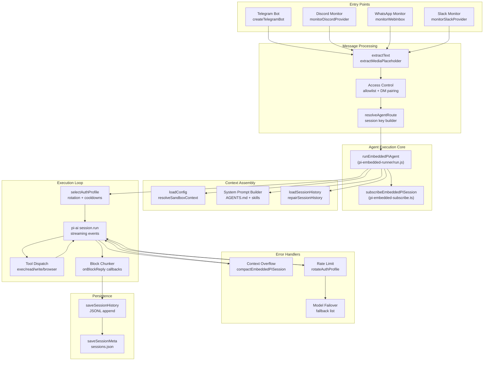
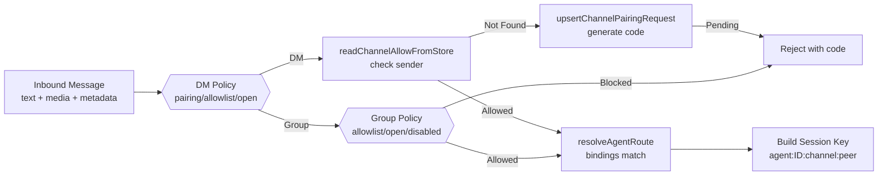
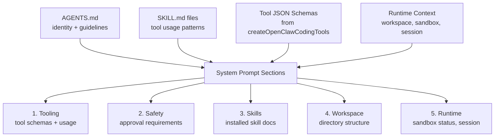
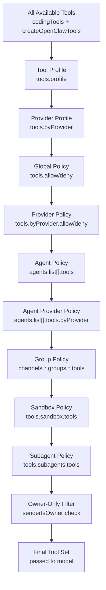
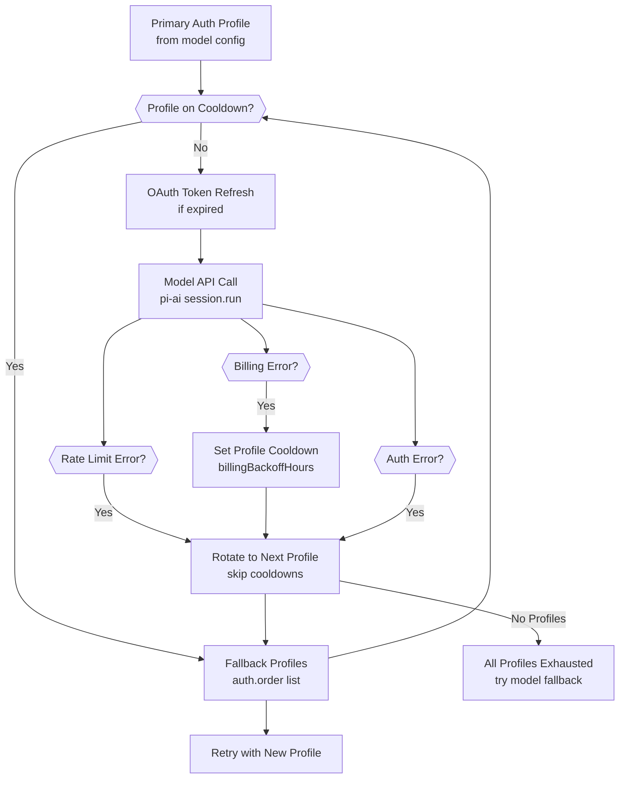
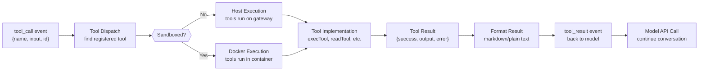
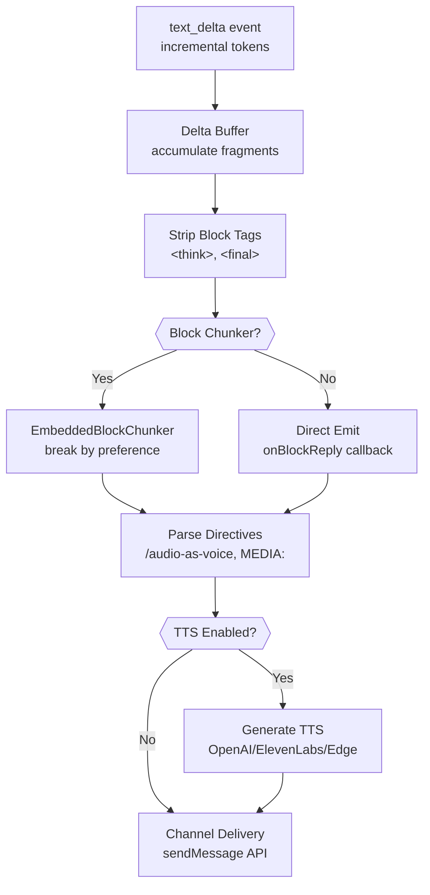
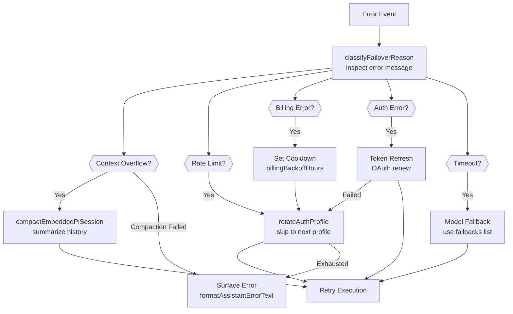
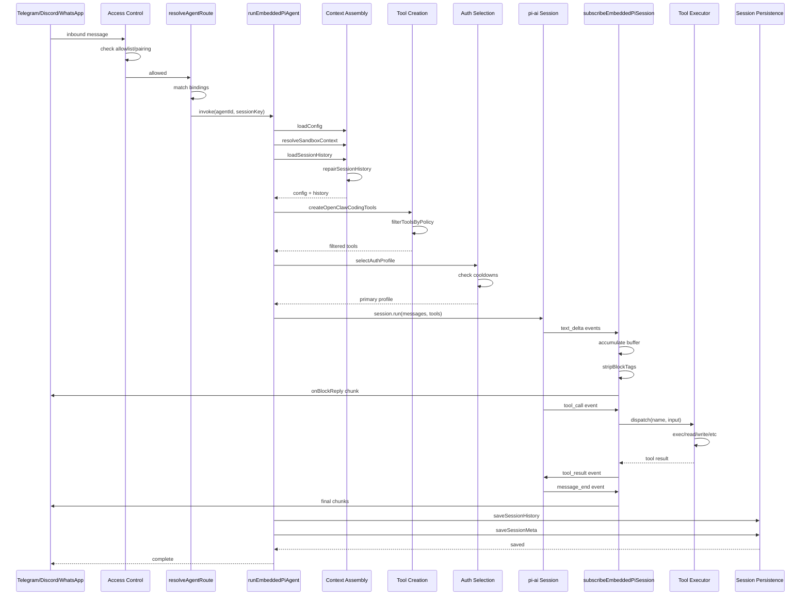

# Page: Agent Execution Flow

# Agent Execution Flow

<details>
<summary>Relevant source files</summary>

The following files were used as context for generating this wiki page:

- [docs/gateway/background-process.md](docs/gateway/background-process.md)
- [src/agents/bash-process-registry.test.ts](src/agents/bash-process-registry.test.ts)
- [src/agents/bash-process-registry.ts](src/agents/bash-process-registry.ts)
- [src/agents/bash-tools.ts](src/agents/bash-tools.ts)
- [src/agents/pi-embedded-helpers.ts](src/agents/pi-embedded-helpers.ts)
- [src/agents/pi-embedded-runner.test.ts](src/agents/pi-embedded-runner.test.ts)
- [src/agents/pi-embedded-runner.ts](src/agents/pi-embedded-runner.ts)
- [src/agents/pi-embedded-subscribe.ts](src/agents/pi-embedded-subscribe.ts)
- [src/agents/pi-tools.ts](src/agents/pi-tools.ts)

</details>


This document describes the complete execution pipeline for agent turns in OpenClaw, from message receipt through response streaming and persistence. This covers the core loop that powers all agent interactions across channels.

For agent configuration and multi-agent routing, see [5.3 Session Management](#5.3). For system prompt construction details, see [5.2 System Prompt](#5.2). For tool security and filtering, see [6.2 Tool Security and Sandboxing](#6.2).

---

## Overview

Agent execution is orchestrated by the `runEmbeddedPiAgent` function, which handles:

1. **Session Resolution**: Maps channel messages to agent sessions using keys like `agent:main:telegram:dm:123456789`
2. **Context Assembly**: Loads config, builds system prompt, retrieves history
3. **Model Invocation**: Selects auth profiles, calls LLM APIs with tool definitions
4. **Tool Execution**: Runs tools (filesystem, exec, browser, messaging) in loops until completion
5. **Response Streaming**: Chunks and delivers text/media back to the channel
6. **Error Recovery**: Handles overflow (compaction), rate limits (profile rotation), and failures (model fallback)
7. **Persistence**: Saves conversation history and token usage

The pipeline is designed to be resilient: context overflow triggers automatic compaction, auth failures rotate through profiles, and tool errors are surfaced gracefully.

---

## Execution Pipeline Overview



**Sources:**
- [src/agents/pi-embedded-runner.ts:11]()
- [src/agents/pi-embedded-subscribe.ts:30-566]()
- [src/telegram/bot.ts:112-490]()
- [src/discord/monitor.ts:22]()
- [src/web/auto-reply.ts:1]()

---

## Phase 1: Message Receipt and Session Resolution

Channels (Telegram, Discord, WhatsApp, etc.) monitor for inbound messages and route them through access control before invoking the agent.

### Access Control Flow



**Access Control Steps:**

1. **Extract message content**: Text via `extractText`, media via `extractMediaPlaceholder`
2. **Check DM policy**: `channels.<provider>.dmPolicy` (`pairing`/`allowlist`/`open`/`disabled`)
3. **Verify allowlist**: Match sender against `channels.<provider>.allowFrom` or pairing store
4. **Group authorization**: Match group ID against `channels.<provider>.groups` or `groupAllowFrom`
5. **Route to agent**: Use `bindings` to select agent ID, construct session key

**Session Key Format:**
```
agent:<agentId>:<channel>:<peerType>:<peerId>
```

Examples:
- `agent:main:telegram:dm:123456789`
- `agent:work:discord:group:987654321`
- `agent:main:whatsapp:group:120363403215116621@g.us`

**Sources:**
- [src/telegram/bot.ts:67-110]() (Sequential key generation)
- [src/telegram/bot.ts:286-327]() (Group policy resolution)
- [src/routing/resolve-route.js]() (Agent routing, referenced in bot.ts:449)
- [src/pairing/pairing-store.js]() (Referenced in telegram/bot.ts imports)

---

## Phase 2: Context Assembly

Before invoking the model, the agent assembles the execution context including configuration, system prompt, and conversation history.

### Context Assembly Components

| Component | Source | Purpose |
|-----------|--------|---------|
| **Agent Config** | `agents.list[]` or `agents.defaults` | Workspace, model, sandbox settings |
| **System Prompt** | `AGENTS.md`, skills, tool definitions | Instructs model behavior |
| **Session History** | `~/.openclaw/sessions/<agentId>/<sessionKey>.jsonl` | Past turns (user + assistant) |
| **Tool Definitions** | `createOpenClawCodingTools` | Available tools with JSON schemas |
| **Sandbox Context** | `resolveSandboxContext` | Docker container info (if sandboxed) |
| **Auth Profiles** | `<agentDir>/auth-profiles.json` | API keys and OAuth tokens |

### System Prompt Construction



**Sources:**
- [src/agents/pi-embedded-runner/system-prompt.js]() (Referenced in pi-embedded-runner.ts:20)
- [docs/gateway/configuration.md:17-19]() (Workspace and identity config)

---

## Phase 3: Tool Creation and Filtering

Tools are created, filtered by policy, and passed to the model API.

### Tool Policy Hierarchy



**Tool Creation Function:**

The `createOpenClawCodingTools` function ([src/agents/pi-tools.ts:115-453]()) creates and filters tools:

1. **Base tools**: `exec`, `read`, `write`, `edit`, `apply_patch`, `process`
2. **OpenClaw tools**: `browser`, `canvas`, `nodes`, `cron`, `gateway`, `message`, `sessions_*`, `memory_*`, `image`
3. **Channel tools**: Channel-specific agent tools (login, etc.)
4. **Plugin tools**: From loaded plugins

**Policy Application:**

Each policy layer can only **restrict** tools (cannot grant back tools denied by earlier layers). If `deny` includes a tool, it's blocked regardless of `allow` lists.

**Sources:**
- [src/agents/pi-tools.ts:115-453]()
- [src/agents/pi-tools.policy.ts]() (Referenced in pi-tools.ts imports)
- [docs/tools/index.md:32-137]()

---

## Phase 4: Model Invocation and Streaming

The agent selects an auth profile, invokes the model API, and subscribes to streaming events.

### Auth Profile Selection and Rotation



**Auth Profile Structure:**

Stored in `<agentDir>/auth-profiles.json`:
```json
{
  "anthropic:me@example.com": {
    "provider": "anthropic",
    "mode": "oauth",
    "email": "me@example.com",
    "tokens": { "access_token": "...", "expires_at": 1234567890 }
  },
  "anthropic:api-key": {
    "provider": "anthropic",
    "mode": "api_key",
    "key": "sk-ant-..."
  }
}
```

**Rotation Order:**

Defined in `auth.order`:
```json
{
  "auth": {
    "order": {
      "anthropic": ["anthropic:me@example.com", "anthropic:work@example.com", "anthropic:api-key"]
    }
  }
}
```

**Sources:**
- [src/agents/model-auth.js]() (Referenced in pi-tools.ts imports)
- [docs/gateway/configuration.md:383-403]() (Auth profiles config)

### Streaming Event Subscription

The `subscribeEmbeddedPiSession` function ([src/agents/pi-embedded-subscribe.ts:30-566]()) subscribes to model events:

**Event Types:**

| Event | Handler | Purpose |
|-------|---------|---------|
| `text_delta` | Delta accumulation | Incremental text streaming |
| `text_end` | Finalize text | Complete assistant message |
| `tool_call` | Tool dispatch | Execute requested tool |
| `tool_result` | Tool output | Return result to model |
| `message_end` | Session complete | Final cleanup and save |
| `error` | Error handling | Classify and recover from failures |

**Block Chunking:**

When `blockReplyChunking` is configured, the subscriber uses `EmbeddedBlockChunker` to break responses into chunks based on:
- `minChars` / `maxChars`: Size bounds
- `breakPreference`: `paragraph` / `newline` / `sentence`
- `flushDelayMs`: Debounce rapid chunks

**Sources:**
- [src/agents/pi-embedded-subscribe.ts:30-566]()
- [src/agents/pi-embedded-block-chunker.ts]() (Referenced in subscribe)
- [src/agents/pi-embedded-subscribe.handlers.ts]() (Event handler implementations)

---

## Phase 5: Tool Execution Loop

When the model requests tool use, the agent dispatches tools and feeds results back for additional turns.

### Tool Execution Flow



**Tool Categories:**

| Category | Tools | Execution Context |
|----------|-------|-------------------|
| **Filesystem** | `read`, `write`, `edit`, `apply_patch` | Sandbox or host workspace |
| **Runtime** | `exec`, `process` | Sandbox or host shell |
| **Web** | `browser`, `web_search`, `web_fetch` | Host or node |
| **Messaging** | `message` (all channels) | Gateway RPC |
| **Sessions** | `sessions_list`, `sessions_send`, `sessions_spawn` | Gateway state |
| **Memory** | `memory_search`, `memory_get` | Builtin or QMD backend |
| **UI** | `canvas`, `nodes` | Connected nodes |
| **Automation** | `cron`, `gateway` | Gateway management |

**Sandboxed Execution:**

When `agents.defaults.sandbox.mode` is not `"off"`, tools run inside Docker containers created by `ensureSandboxWorkspaceForSession`:

- **Scope**: `session` (per-session container), `agent` (per-agent), `shared` (one global container)
- **Workspace Access**: `none` (empty sandbox), `ro` (read-only mount), `rw` (read-write mount)
- **Network**: Default is `"none"` (no egress)

**Tool Results:**

Tools return structured results:
```typescript
{
  success: boolean;
  output?: string;
  error?: string;
  metadata?: Record<string, unknown>;
}
```

**Sources:**
- [src/agents/bash-tools.ts:1-10]()
- [src/agents/bash-tools.exec.ts]() (Referenced in bash-tools.ts)
- [src/agents/bash-tools.process.ts]() (Referenced in bash-tools.ts)
- [src/agents/sandbox.ts:1-45]()
- [src/agents/sandbox/context.ts]() (Referenced in sandbox.ts)
- [docs/tools/index.md:179-439]()

---

## Phase 6: Response Streaming and Delivery

As the model generates text, the agent streams chunks back to the channel.

### Streaming Pipeline



**Reasoning Tag Handling:**

When `reasoningMode` is configured:
- `` blocks are **stripped** from user-facing replies
- `<final>...</final>` blocks are **extracted** when `enforceFinalTag` is enabled
- `reasoningMode: "stream"` emits reasoning separately via `onReasoningStream`

**Reply Directives:**

Messages can include directives that modify delivery:
- `/audio-as-voice`: Send text as voice message
- `MEDIA:<path>`: Attach media from workspace
- `/reply-to:<id>`: Thread to specific message

These are parsed by `createStreamingDirectiveAccumulator` and `parseReplyDirectives`.

**Messaging Tool Deduplication:**

When tools like `message` send replies via `sessions_send`, those texts are tracked to avoid duplicate block replies. The subscriber maintains:
- `messagingToolSentTexts`: Committed successful sends
- `messagingToolSentTextsNormalized`: Normalized versions for comparison
- `pendingMessagingTexts`: In-flight sends (not yet committed)

**Sources:**
- [src/agents/pi-embedded-subscribe.ts:291-398]() (Block tag stripping)
- [src/agents/pi-embedded-block-chunker.ts]() (Referenced in subscribe)
- [src/auto-reply/reply/reply-directives.ts]() (Referenced in subscribe)
- [src/auto-reply/reply/streaming-directives.ts]() (Referenced in subscribe)

---

## Phase 7: Error Handling and Recovery

The execution pipeline includes automatic recovery mechanisms for common failure modes.

### Error Classification and Recovery



### Context Overflow and Compaction

When the context window is exceeded, the agent automatically compacts history:

**Compaction Strategy:**

1. **Detect overflow**: `isContextOverflowError` / `isLikelyContextOverflowError`
2. **Invoke compaction**: `compactEmbeddedPiSession` with retry counter
3. **Summarize history**: Request model to condense past turns
4. **Retry execution**: Re-run with compacted history
5. **Fallback**: If compaction fails, reset session or surface error

**Compaction Limits:**

- `pendingCompactionRetry` counter prevents infinite loops
- After N failures, the session is reset or the error is surfaced

**Sources:**
- [src/agents/pi-embedded-runner/compact.js]() (Referenced in pi-embedded-runner.ts:2)
- [src/agents/pi-embedded-helpers/errors.ts]() (Referenced in pi-embedded-helpers.ts:10-34)

### Rate Limit and Auth Recovery

**Rate Limit Handling:**

1. Detect via `isRateLimitErrorMessage`
2. Rotate to next profile in `auth.order`
3. Skip profiles on cooldown
4. If all exhausted, try model fallback or surface error

**Billing Error Handling:**

1. Detect via `isBillingErrorMessage`
2. Set cooldown: `auth.cooldowns.billingBackoffHours` (default: 24h)
3. Rotate to next profile
4. Cooldown prevents re-using the profile until time expires

**Auth Error Handling:**

1. Detect via `isAuthErrorMessage`
2. Attempt OAuth token refresh if mode is `"oauth"`
3. If refresh fails or mode is `"api_key"`, rotate to next profile

**Sources:**
- [src/agents/pi-embedded-helpers/errors.ts]() (Error classification)
- [src/agents/model-auth.js]() (Profile rotation and cooldowns)
- [docs/gateway/configuration.md:255-266]() (Cooldown config)

---

## Phase 8: Session Persistence

After completion or error, the agent saves the conversation state.

### Persistence Artifacts

| Artifact | Path | Format | Content |
|----------|------|--------|---------|
| **Session History** | `~/.openclaw/sessions/<agentId>/<sessionKey>.jsonl` | JSONL | User and assistant turns |
| **Session Metadata** | `~/.openclaw/sessions/<agentId>/sessions.json` | JSON | Session summaries, timestamps, token usage |
| **Session Store** | `session.store` config override | JSON | Alternative storage location |

**History Format (JSONL):**

Each line is a JSON object:
```json
{"role":"user","content":"Write a Python script","timestamp":"2024-01-09T10:30:00.000Z"}
{"role":"assistant","content":"Here's a script:\n```python\nprint('Hello')\n```","timestamp":"2024-01-09T10:30:15.000Z","usage":{"inputTokens":20,"outputTokens":50}}
```

**Session Metadata:**

Stored in `sessions.json`:
```json
{
  "agent:main:telegram:dm:123456789": {
    "agentId": "main",
    "channel": "telegram",
    "peer": "dm:123456789",
    "firstMessageAt": "2024-01-09T10:00:00.000Z",
    "lastMessageAt": "2024-01-09T10:30:15.000Z",
    "messageCount": 10,
    "totalInputTokens": 2000,
    "totalOutputTokens": 5000
  }
}
```

**History Repair:**

Before loading, `repairSessionHistory` sanitizes the JSONL:
- Removes duplicate consecutive messages
- Fixes invalid role sequences (enforces user/assistant alternation)
- Validates message structure

**Sources:**
- [src/config/sessions.js]() (Referenced in telegram/bot.ts imports)
- [src/agents/pi-embedded-runner/history.js]() (Referenced in pi-embedded-runner.ts:7-9)

---

## Complete Execution Sequence

This diagram shows a complete agent turn from message receipt to persistence, including all major functions and data flows.

### End-to-End Sequence



**Sources:**
- [src/agents/pi-embedded-runner/run.js]() (Main orchestration)
- [src/agents/pi-embedded-subscribe.ts:30-566]() (Event handling)
- [src/telegram/bot.ts:339-361]() (Message processor)
- [src/routing/resolve-route.js]() (Agent routing)

---

## Key Data Structures

### Session Key Components

```typescript
type SessionKey = `agent:${agentId}:${channel}:${peerKind}:${peerId}`;

// Examples:
// "agent:main:telegram:dm:123456789"
// "agent:work:discord:group:987654321"
// "agent:main:whatsapp:group:120363403215116621@g.us"
```

Parsed by session resolution logic to determine:
- Which agent handles the message
- Which channel it came from
- Whether it's a DM or group
- Who the peer is (user ID or group ID)

**Sources:**
- [src/routing/session-key.js]() (Parsing and validation)

### Tool Definition Schema

Tools passed to the model use JSON Schema:

```typescript
type AgentTool = {
  name: string;
  description: string;
  input_schema: {
    type: "object";
    properties: Record<string, JSONSchema>;
    required?: string[];
  };
  call: (input: Record<string, unknown>) => Promise<ToolResult>;
};
```

**Normalization:**

`normalizeToolParameters` ([src/agents/pi-tools.schema.ts]()) ensures schemas are compatible with all providers (OpenAI, Anthropic, Google).

**Sources:**
- [src/agents/pi-tools.types.ts]() (Type definitions)
- [src/agents/pi-tools.schema.ts]() (Schema normalization)

### Agent Configuration Structure

```typescript
type AgentConfig = {
  id: string;
  workspace: string;
  agentDir?: string;
  model?: string | { primary: string; fallbacks?: string[] };
  identity?: {
    name?: string;
    theme?: string;
    emoji?: string;
    avatar?: string;
  };
  sandbox?: {
    mode: "off" | "non-main" | "all";
    scope?: "session" | "agent" | "shared";
    workspaceAccess?: "none" | "ro" | "rw";
  };
  tools?: {
    profile?: string;
    allow?: string[];
    deny?: string[];
  };
};
```

**Sources:**
- [src/config/types.agents.ts]() (Type definitions)
- [docs/gateway/configuration.md:732-791]() (Config documentation)

---

## Configuration Impact on Execution

### Key Configuration Knobs

| Config Path | Impact | Default |
|-------------|--------|---------|
| `agents.defaults.model.primary` | Which model API to invoke | _(required)_ |
| `agents.defaults.model.fallbacks` | Model failover list | `[]` |
| `agents.defaults.sandbox.mode` | When to use Docker | `"off"` |
| `agents.defaults.sandbox.scope` | Container lifecycle | `"session"` |
| `tools.allow` / `tools.deny` | Tool availability | All allowed |
| `tools.sandbox.tools` | Sandbox tool restrictions | All allowed |
| `tools.elevated.enabled` | Host exec escape hatch | `false` |
| `auth.order` | Profile rotation sequence | Provider order |
| `auth.cooldowns.billingBackoffHours` | Billing error cooldown | 24 |
| `session.mainKey` | Main session identifier | `"main"` |
| `messages.queue.mode` | Concurrent message handling | `"collect"` |

**Sources:**
- [src/config/zod-schema.ts:90-625]() (Full schema)
- [docs/gateway/configuration.md]() (Configuration reference)

---

## Summary

The agent execution flow is a multi-phase pipeline that:

1. **Authenticates** incoming messages via channel-specific access control
2. **Routes** to the appropriate agent using session keys and bindings
3. **Assembles** execution context (config, prompt, history, tools)
4. **Invokes** LLM APIs with automatic failover and profile rotation
5. **Executes** tools in loops until the model produces a final response
6. **Streams** responses back to the channel with chunking and formatting
7. **Recovers** from errors through compaction, rotation, and fallback
8. **Persists** conversation state for future turns

The design prioritizes resilience: context overflow triggers automatic compaction, auth failures rotate through profiles, and tool errors are surfaced gracefully. The modular architecture allows channels to integrate without reimplementing core logic.

**Primary Implementation Files:**
- [src/agents/pi-embedded-runner/run.js]() - Main orchestrator
- [src/agents/pi-embedded-subscribe.ts:30-566]() - Event stream handler
- [src/agents/pi-tools.ts:115-453]() - Tool creation and filtering
- [src/agents/sandbox/context.ts]() - Sandbox setup
- [src/routing/resolve-route.js]() - Agent routing

---