# Page: System Prompt

# System Prompt

<details>
<summary>Relevant source files</summary>

The following files were used as context for generating this wiki page:

- [docs/concepts/system-prompt.md](docs/concepts/system-prompt.md)
- [docs/gateway/cli-backends.md](docs/gateway/cli-backends.md)
- [docs/reference/token-use.md](docs/reference/token-use.md)
- [src/agents/auth-profiles/oauth.fallback-to-main-agent.test.ts](src/agents/auth-profiles/oauth.fallback-to-main-agent.test.ts)
- [src/agents/auth-profiles/oauth.ts](src/agents/auth-profiles/oauth.ts)
- [src/agents/cli-backends.ts](src/agents/cli-backends.ts)
- [src/agents/cli-runner.test.ts](src/agents/cli-runner.test.ts)
- [src/agents/cli-runner.ts](src/agents/cli-runner.ts)
- [src/agents/cli-runner/helpers.ts](src/agents/cli-runner/helpers.ts)
- [src/agents/pi-embedded-runner/compact.ts](src/agents/pi-embedded-runner/compact.ts)
- [src/agents/pi-embedded-runner/run/attempt.ts](src/agents/pi-embedded-runner/run/attempt.ts)
- [src/agents/pi-embedded-runner/system-prompt.ts](src/agents/pi-embedded-runner/system-prompt.ts)
- [src/agents/system-prompt-params.ts](src/agents/system-prompt-params.ts)
- [src/agents/system-prompt-report.ts](src/agents/system-prompt-report.ts)
- [src/agents/system-prompt.test.ts](src/agents/system-prompt.test.ts)
- [src/agents/system-prompt.ts](src/agents/system-prompt.ts)
- [src/auto-reply/reply/agent-runner.heartbeat-typing.runreplyagent-typing-heartbeat.retries-after-compaction-failure-by-resetting-session.test.ts](src/auto-reply/reply/agent-runner.heartbeat-typing.runreplyagent-typing-heartbeat.retries-after-compaction-failure-by-resetting-session.test.ts)
- [src/auto-reply/reply/commands-context-report.ts](src/auto-reply/reply/commands-context-report.ts)
- [src/gateway/gateway-cli-backend.live.test.ts](src/gateway/gateway-cli-backend.live.test.ts)
- [src/telegram/group-migration.test.ts](src/telegram/group-migration.test.ts)
- [src/telegram/group-migration.ts](src/telegram/group-migration.ts)

</details>


This document explains how OpenClaw constructs the system prompt for each agent run. The system prompt is assembled dynamically from configuration, workspace files, tool definitions, and runtime context.

For information about agent execution flow, see [Agent Execution Flow](#5.1). For session-level context and history management, see [Session Management](#5.3).

---

## Overview

OpenClaw constructs a custom system prompt for every agent turn. This prompt is **not** the default `pi-coding-agent` prompt — it's assembled dynamically by `buildAgentSystemPrompt()` [src/agents/system-prompt.ts:164-612]().

The prompt is intentionally **compact** and structured, using fixed sections to minimize token usage while providing necessary context.

### Main Builder Function

```typescript
buildAgentSystemPrompt(params: {
  workspaceDir: string;
  defaultThinkLevel?: ThinkLevel;
  reasoningLevel?: ReasoningLevel;
  extraSystemPrompt?: string;
  ownerNumbers?: string[];
  reasoningTagHint?: boolean;
  toolNames?: string[];
  toolSummaries?: Record<string, string>;
  modelAliasLines?: string[];
  userTimezone?: string;
  userTime?: string;
  userTimeFormat?: ResolvedTimeFormat;
  contextFiles?: EmbeddedContextFile[];
  skillsPrompt?: string;
  heartbeatPrompt?: string;
  docsPath?: string;
  workspaceNotes?: string[];
  ttsHint?: string;
  promptMode?: PromptMode;  // "full" | "minimal" | "none"
  runtimeInfo?: { ... };
  messageToolHints?: string[];
  sandboxInfo?: { ... };
  reactionGuidance?: { ... };
  memoryCitationsMode?: MemoryCitationsMode;
}): string
```

For embedded agent runs, `buildEmbeddedSystemPrompt()` [src/agents/pi-embedded-runner/system-prompt.ts:11-78]() wraps `buildAgentSystemPrompt()` and injects it into the pi-agent session via `createSystemPromptOverride()` [src/agents/pi-embedded-runner/system-prompt.ts:80-85]().

**Sources:** [src/agents/system-prompt.ts:164-612](), [src/agents/pi-embedded-runner/system-prompt.ts:11-99]()

---

## System Prompt Construction Flow

```mermaid
graph TB
    Config["OpenClawConfig<br/>(openclaw.json)"]
    Workspace["Workspace Directory<br/>(agents.defaults.workspace)"]
    ToolPolicy["Tool Policy<br/>(tools.allow/deny)"]
    SessionKey["Session Key<br/>(agent:main:whatsapp:dm:...)"]
    
    BuildParams["buildSystemPromptParams()<br/>src/agents/system-prompt-params.ts"]
    LoadBootstrap["resolveBootstrapContextForRun()<br/>src/agents/bootstrap-files.ts"]
    LoadSkills["resolveSkillsPromptForRun()<br/>src/agents/skills.ts"]
    ResolveTools["createOpenClawCodingTools()<br/>src/agents/pi-tools.ts"]
    ResolveSandbox["resolveSandboxContext()<br/>src/agents/sandbox.ts"]
    
    BuildPrompt["buildAgentSystemPrompt()<br/>src/agents/system-prompt.ts:129"]
    
    PromptSections["System Prompt Sections:<br/>• Tooling<br/>• Skills<br/>• Memory<br/>• Workspace<br/>• Documentation<br/>• Sandbox<br/>• Time<br/>• Runtime<br/>• Reasoning"]
    
    ContextFiles["Bootstrap Files:<br/>• AGENTS.md<br/>• SOUL.md<br/>• TOOLS.md<br/>• IDENTITY.md"]
    
    EmbeddedRunner["buildEmbeddedSystemPrompt()<br/>src/agents/pi-embedded-runner/system-prompt.ts"]
    
    AgentRun["runEmbeddedAttempt()<br/>Agent Execution"]
    
    Config --> BuildParams
    SessionKey --> BuildParams
    BuildParams --> BuildPrompt
    
    Workspace --> LoadBootstrap
    Workspace --> LoadSkills
    LoadBootstrap --> ContextFiles
    ContextFiles --> BuildPrompt
    
    ToolPolicy --> ResolveTools
    ResolveTools --> BuildPrompt
    
    Config --> ResolveSandbox
    SessionKey --> ResolveSandbox
    ResolveSandbox --> BuildPrompt
    
    LoadSkills --> BuildPrompt
    
    BuildPrompt --> PromptSections
    PromptSections --> EmbeddedRunner
    EmbeddedRunner --> AgentRun
```



**Sources:** [src/agents/system-prompt.ts:129-554](), [src/agents/pi-embedded-runner/system-prompt.ts:9-61](), [src/agents/system-prompt-params.ts:1-133]()

---

## Prompt Modes

OpenClaw supports three prompt modes via the `promptMode` parameter [src/agents/system-prompt.ts:8-14]():

```typescript
type PromptMode = "full" | "minimal" | "none";
```

### Mode Selection

| Mode | When Used | Output | Sections Included |
|------|-----------|--------|-------------------|
| `full` | Default for all user-facing sessions | Complete system prompt | All sections below |
| `minimal` | Subagents spawned via `sessions_spawn` | Reduced system prompt | Tooling, Safety, Workspace, Sandbox, Runtime |
| `none` | Reserved/internal | Identity line only | `"You are a personal assistant running inside OpenClaw."` |

The mode is automatically determined in [src/agents/pi-embedded-runner/run/attempt.ts:344]():

```typescript
const promptMode = isSubagentSessionKey(params.sessionKey) ? "minimal" : "full";
```

### Sections Omitted in Minimal Mode

When `promptMode === "minimal"` or `promptMode === "none"`, these sections are skipped [src/agents/system-prompt.ts:350]():

- Skills (`buildSkillsSection`)
- Memory Recall (`buildMemorySection`)
- OpenClaw Self-Update
- Model Aliases
- User Identity (`buildUserIdentitySection`)
- Current Date & Time (`buildTimeSection`)
- Reply Tags (`buildReplyTagsSection`)
- Messaging (`buildMessagingSection`)
- Voice/TTS (`buildVoiceSection`)
- Documentation (`buildDocsSection`)
- Silent Replies
- Heartbeats

The minimal mode check propagates through section builders:

```typescript
const isMinimal = promptMode === "minimal" || promptMode === "none";
```

This keeps subagent prompts compact (~1-2k tokens vs ~5-10k for full mode).

**Sources:** [src/agents/system-prompt.ts:8-14](), [src/agents/system-prompt.ts:350](), [src/agents/pi-embedded-runner/run/attempt.ts:344](), [src/agents/system-prompt.test.ts:26-59]()

---

## System Prompt Structure

### Section Assembly Order

The `buildAgentSystemPrompt()` function [src/agents/system-prompt.ts:164-612]() assembles sections in this order:

```mermaid
graph TB
    Identity["Identity Line<br/>'You are a personal assistant...'"]
    
    Tooling["## Tooling<br/>Tool list (lines 248-310)<br/>toolNames → coreToolSummaries"]
    ToolCallStyle["## Tool Call Style<br/>Narration guidance"]
    Safety["## Safety<br/>Guardrails (lines 351-357)"]
    
    CLIRef["## OpenClaw CLI Quick Reference<br/>gateway status/start/stop"]
    
    Skills["## Skills (optional)<br/>buildSkillsSection (lines 16-38)<br/>if skillsPrompt && !isMinimal"]
    
    Memory["## Memory Recall (optional)<br/>buildMemorySection (lines 40-66)<br/>if memory_search tool && !isMinimal"]
    
    SelfUpdate["## OpenClaw Self-Update (optional)<br/>if hasGateway && !isMinimal"]
    
    ModelAliases["## Model Aliases (optional)<br/>if modelAliasLines && !isMinimal"]
    
    Workspace["## Workspace<br/>workspaceDir + notes"]
    
    Docs["## Documentation (optional)<br/>buildDocsSection (lines 146-162)<br/>if docsPath && !isMinimal"]
    
    Sandbox["## Sandbox (optional)<br/>if sandboxInfo.enabled"]
    
    UserIdent["## User Identity (optional)<br/>buildUserIdentitySection (lines 68-73)<br/>if ownerNumbers && !isMinimal"]
    
    Time["## Current Date & Time (optional)<br/>buildTimeSection (lines 75-80)<br/>if userTimezone"]
    
    ReplyTags["## Reply Tags (optional)<br/>buildReplyTagsSection (lines 82-95)<br/>if !isMinimal"]
    
    Messaging["## Messaging (optional)<br/>buildMessagingSection (lines 97-133)<br/>if !isMinimal"]
    
    Voice["## Voice TTS (optional)<br/>buildVoiceSection (lines 135-144)<br/>if ttsHint && !isMinimal"]
    
    GroupContext["## Group Chat Context (optional)<br/>if extraSystemPrompt && !isMinimal"]
    
    Reactions["## Reactions (optional)<br/>if reactionGuidance"]
    
    ReasoningFormat["## Reasoning Format (optional)<br/>if reasoningTagHint"]
    
    ProjectContext["# Project Context<br/>contextFiles (lines 552-572)<br/>Bootstrap files from workspace"]
    
    SilentReplies["## Silent Replies (optional)<br/>NO_REPLY token (lines 575-590)<br/>if !isMinimal"]
    
    Heartbeats["## Heartbeats (optional)<br/>HEARTBEAT_OK protocol (lines 592-603)<br/>if !isMinimal"]
    
    Runtime["## Runtime<br/>buildRuntimeLine (lines 605-610)<br/>Host/OS/Model/Channel/Thinking"]
    
    Identity --> Tooling
    Tooling --> ToolCallStyle
    ToolCallStyle --> Safety
    Safety --> CLIRef
    CLIRef --> Skills
    Skills --> Memory
    Memory --> SelfUpdate
    SelfUpdate --> ModelAliases
    ModelAliases --> Workspace
    Workspace --> Docs
    Docs --> Sandbox
    Sandbox --> UserIdent
    UserIdent --> Time
    Time --> ReplyTags
    ReplyTags --> Messaging
    Messaging --> Voice
    Voice --> GroupContext
    GroupContext --> Reactions
    Reactions --> ReasoningFormat
    ReasoningFormat --> ProjectContext
    ProjectContext --> SilentReplies
    SilentReplies --> Heartbeats
    Heartbeats --> Runtime
```



### Conditional Section Logic

Sections marked "(optional)" are conditionally included based on:
- **Prompt mode**: `isMinimal = promptMode === "minimal" || promptMode === "none"` [src/agents/system-prompt.ts:350]()
- **Tool availability**: Checked via `availableTools.has(toolName)` [src/agents/system-prompt.ts:287]()
- **Config presence**: Parameters like `skillsPrompt`, `docsPath`, `ttsHint`
- **Sandbox status**: `sandboxInfo?.enabled` [src/agents/system-prompt.ts:458]()

**Sources:** [src/agents/system-prompt.ts:164-612]()

### Section: Tooling

Lists all available tools with one-line summaries. Tool availability is filtered by:
1. Tool profile (`tools.profile`)
2. Provider-specific policy (`tools.byProvider`)
3. Global allow/deny (`tools.allow`, `tools.deny`)
4. Agent-specific policy (`agents.list[].tools`)
5. Group policy (for group chats)
6. Sandbox tool policy

Tool order is preserved from `toolOrder` array [src/agents/system-prompt.ts:247-271]():
```
read, write, edit, apply_patch, grep, find, ls, exec, process,
web_search, web_fetch, browser, canvas, nodes, cron, message,
gateway, agents_list, sessions_list, sessions_history, sessions_send,
session_status, image
```

Tools not in this order are appended alphabetically [src/agents/system-prompt.ts:296-309]().

Tool name casing is preserved from the caller while deduplicating by lowercase [src/agents/system-prompt.ts:275-285](). This allows tools to be referenced as `Read`, `read`, or `READ` consistently.

**Sources:** [src/agents/system-prompt.ts:247-309](), [src/agents/system-prompt.ts:218-245]()

### Section: Skills

Only included when `skillsPrompt` is present and not in minimal mode [src/agents/system-prompt.ts:16-38]().

Provides mandatory skill loading instructions:
```
Before replying: scan <available_skills> <description> entries.
- If exactly one skill clearly applies: read its SKILL.md at <location> with `read`, then follow it.
- If multiple could apply: choose the most specific one, then read/follow it.
- If none clearly apply: do not read any SKILL.md.
Constraints: never read more than one skill up front; only read after selecting.
```

The `readToolName` parameter (typically `"read"`) is dynamically resolved from the available tools to ensure the instruction matches the actual tool name casing [src/agents/system-prompt.ts:31]().

The skills prompt itself (XML format with `<available_skills>`) is appended after the rules.

**Sources:** [src/agents/system-prompt.ts:16-38](), [src/agents/system-prompt.ts:357-362]()

### Section: Memory Recall

Only included when `memory_search` or `memory_get` tools are available and not in minimal mode [src/agents/system-prompt.ts:40-66]().

The section includes guidance on when to search memory and how to cite sources. The citation mode is controlled by `params.memoryCitationsMode`:

- `"off"`: "Citations are disabled: do not mention file paths or line numbers in replies unless the user explicitly asks."
- `"auto"` or `"on"`: "Citations: include Source: <path#line> when it helps the user verify memory snippets."

Full text:
```
Before answering anything about prior work, decisions, dates, people, preferences, 
or todos: run memory_search on MEMORY.md + memory/*.md; then use memory_get to 
pull only the needed lines. If low confidence after search, say you checked.
```

**Sources:** [src/agents/system-prompt.ts:40-66]()

### Section: Workspace

Always included [src/agents/system-prompt.ts:451-456](). States the working directory path:
```
Your working directory is: /path/to/workspace
Treat this directory as the single global workspace for file operations unless 
explicitly instructed otherwise.
```

Optional workspace notes (e.g., "Reminder: commit your changes in this workspace after edits.") are appended from `params.workspaceNotes` when provided [src/agents/system-prompt.ts:372]().

**Sources:** [src/agents/system-prompt.ts:451-456](), [src/agents/system-prompt.ts:372]()

### Section: Sandbox

Only included when `sandboxInfo.enabled === true` [src/agents/system-prompt.ts:458-498]().

Describes:
- Sandbox runtime status
- Workspace directory and access mode (none/ro/rw)
- Agent workspace mount path
- Browser bridge URL (if sandbox browser enabled)
- noVNC observer URL (if available)
- Host browser control allowance
- Elevated exec availability and current level

The section includes a note for subagents: "Sub-agents stay sandboxed (no elevated/host access). Need outside-sandbox read/write? Don't spawn; ask first." [src/agents/system-prompt.ts:462]()

Example:
```
You are running in a sandboxed runtime (tools execute in Docker).
Some tools may be unavailable due to sandbox policy.
Sub-agents stay sandboxed (no elevated/host access). Need outside-sandbox read/write? Don't spawn; ask first.
Sandbox workspace: /tmp/sandboxes/session-abc123
Agent workspace access: ro (mounted at /agent)
Elevated exec is available for this session.
User can toggle with /elevated on|off|ask|full.
Current elevated level: ask (ask runs exec on host with approvals; full auto-approves).
```

**Sources:** [src/agents/system-prompt.ts:458-498]()

### Section: Runtime

The Runtime section is **always included** at the end of the prompt [src/agents/system-prompt.ts:605-610](). It's built by `buildRuntimeLine()` [src/agents/system-prompt.ts:614-651]():

```
## Runtime
Runtime: agent=main | host=mbp-mario | os=Darwin 23.6.0 (arm64) | node=v20.11.0 | model=anthropic/claude-sonnet-4-5 | channel=telegram | capabilities=inlineButtons | thinking=low
Reasoning: off (hidden unless on/stream). Toggle /reasoning; /status shows Reasoning when enabled.
```

The runtime line includes:
- `agent=<agentId>` (if provided)
- `host=<hostname>`
- `repo=<repoRoot>` (if detected via `.git`)
- `os=<type> <release> (<arch>)`
- `node=<version>`
- `model=<provider>/<modelId>`
- `default_model=<provider>/<model>` (if different)
- `shell=<shell>` (detected shell)
- `channel=<channel>` (e.g., telegram, signal)
- `capabilities=<list>` (e.g., inlineButtons)
- `thinking=<level>` (off/low/medium/high)

The reasoning line follows, showing current visibility mode and toggle instructions.

**Sources:** [src/agents/system-prompt.ts:605-610](), [src/agents/system-prompt.ts:614-651](), [src/agents/system-prompt-params.ts:34-59]()

---

## Bootstrap Files and Context Injection

Bootstrap files are workspace files that are **automatically loaded and injected** into the system prompt under the "# Project Context" section [src/agents/system-prompt.ts:497-514]().

### Default Bootstrap Files

OpenClaw searches for these files in the workspace directory (case-insensitive) [src/agents/bootstrap-files.ts]()):
- `AGENTS.md` - Agent identity and behavior guidelines
- `SOUL.md` - Persona and tone guidance
- `TOOLS.md` - Tool usage instructions
- `IDENTITY.md` - User/owner identity information

When `SOUL.md` is present, the prompt adds:
```
If SOUL.md is present, embody its persona and tone. Avoid stiff, generic replies; 
follow its guidance unless higher-priority instructions override it.
```

### Bootstrap Resolution Flow


### Character Limits

Bootstrap files are capped at `DEFAULT_BOOTSTRAP_MAX_CHARS` (default: 65536 per file) [src/agents/pi-embedded-helpers/bootstrap.ts:13](). Configure via:
```json5
{
  agents: {
    defaults: {
      bootstrap: {
        maxChars: 32768  // Override per-file limit
      }
    }
  }
}
```

### Custom Bootstrap Files

Add custom bootstrap files via config:
```json5
{
  agents: {
    defaults: {
      bootstrap: {
        files: [
          "AGENTS.md",
          "SOUL.md",
          "custom/GUIDELINES.md",
          "docs/CONTEXT.md"
        ]
      }
    }
  }
}
```

**Sources:** [src/agents/bootstrap-files.ts:1-302](), [src/agents/pi-embedded-helpers/bootstrap.ts:1-190](), [src/agents/system-prompt.ts:497-514]()

---

## Tool Descriptions and Summaries

Tool descriptions appear in two places:
1. **System prompt** (Tooling section)
2. **Tool schemas** (JSON Schema descriptions sent to models)

### Built-in Tool Summaries

Core tool summaries are defined in `coreToolSummaries` [src/agents/system-prompt.ts:182-208]():

```typescript
const coreToolSummaries: Record<string, string> = {
  read: "Read file contents",
  write: "Create or overwrite files",
  edit: "Make precise edits to files",
  apply_patch: "Apply multi-file patches",
  exec: "Run shell commands (pty available for TTY-required CLIs)",
  process: "Manage background exec sessions",
  browser: "Control web browser",
  canvas: "Present/eval/snapshot the Canvas",
  nodes: "List/describe/notify/camera/screen on paired nodes",
  cron: "Manage cron jobs and wake events (use for reminders...)",
  message: "Send messages and channel actions",
  gateway: "Restart, apply config, or run updates...",
  // ...
}
```

### External Tool Summaries

Plugin tools can provide summaries via `toolSummaries` parameter [src/agents/system-prompt.ts:237-257]():

```typescript
const externalToolSummaries = new Map<string, string>();
for (const [key, value] of Object.entries(params.toolSummaries ?? {})) {
  const normalized = key.trim().toLowerCase();
  if (!normalized || !value?.trim()) continue;
  externalToolSummaries.set(normalized, value.trim());
}
```

### Tool Name Casing

Tool names preserve caller casing while deduping by lowercase [src/agents/system-prompt.ts:239-248]():

```typescript
const canonicalByNormalized = new Map<string, string>();
for (const name of canonicalToolNames) {
  const normalized = name.toLowerCase();
  if (!canonicalByNormalized.has(normalized)) {
    canonicalByNormalized.set(normalized, name);
  }
}
```

This allows tools to be referenced as `Read`, `read`, or `READ` consistently.

**Sources:** [src/agents/system-prompt.ts:182-271](), [src/agents/tool-summaries.ts:1-82]()

---

## Dynamic Context

### Time and Timezone

When `userTimezone` is provided and not in minimal mode, the system prompt includes [src/agents/system-prompt.ts:75-80]():

```
## Current Date & Time
Time zone: America/Chicago
```

**Important:** The system prompt intentionally does **not** include the current date or time string, only the timezone. This is for cache stability - the date/time changes frequently and would invalidate prompt caching. Agents should use `session_status` tool or message timestamps to determine the current date/time [src/agents/system-prompt.test.ts:211-228]().

The hint to use `session_status` is included when timezone is provided: "If you need the current date, time, or day of week, run session_status (📊 session_status)." [src/agents/system-prompt.ts:448-450]()

Time formatting (when displayed via `session_status`) uses `formatUserTime()` [src/agents/date-time.ts]() with support for 12-hour and 24-hour formats.

**Sources:** [src/agents/system-prompt.ts:75-80](), [src/agents/system-prompt.ts:448-450](), [src/agents/system-prompt.test.ts:211-228]()

### Runtime Information

The runtime info is built by `buildSystemPromptParams()` [src/agents/system-prompt-params.ts:15-133]() and passed to `buildAgentSystemPrompt()`:

```typescript
runtimeInfo: {
  agentId: "main",
  host: "mbp-mario",
  os: "Darwin 23.6.0",
  arch: "arm64",
  node: "v20.11.0",
  model: "anthropic/claude-sonnet-4-5",
  defaultModel: "anthropic/claude-sonnet-4-5",
  channel: "telegram",
  capabilities: ["inlineButtons"],
  channelActions: ["reactions", "stickers", "polls", ...]
}
```

This information is used to populate various sections of the prompt (e.g., channel capabilities in the Messaging section), but is not rendered as a standalone "Runtime" section.

**Sources:** [src/agents/system-prompt-params.ts:15-133](), [src/agents/pi-embedded-runner/run/attempt.ts:322-338]()

### Channel Capabilities

Channel capabilities are resolved per-provider [src/config/channel-capabilities.ts]() and influence what the agent can do:
- `inlineButtons` - Inline buttons supported (Telegram)
- Other provider-specific capabilities

For Telegram, inline button scope is checked via `resolveTelegramInlineButtonsScope()` [src/agents/pi-embedded-runner/run/attempt.ts:249-260]().

### Reaction Guidance

For Telegram and Signal, reaction guidance level is included [src/agents/system-prompt.ts:470-492]():

```
## Reactions
Reactions are enabled for Telegram in MINIMAL mode.
React ONLY when truly relevant:
- Acknowledge important user requests or confirmations
- Express genuine sentiment (humor, appreciation) sparingly
- Avoid reacting to routine messages or your own replies
Guideline: at most 1 reaction per 5-10 exchanges.
```

**Sources:** [src/agents/system-prompt-params.ts:1-133](), [src/agents/system-prompt.ts:52-55](), [src/agents/system-prompt.ts:310-327](), [src/agents/system-prompt.ts:470-492]()

---

## Customization

### Extra System Prompt

The `extraSystemPrompt` parameter adds custom text to the prompt [src/agents/system-prompt.ts:464-469]():

```typescript
if (extraSystemPrompt) {
  const contextHeader = promptMode === "minimal" 
    ? "## Subagent Context" 
    : "## Group Chat Context";
  lines.push(contextHeader, extraSystemPrompt, "");
}
```

This is used for:
- **Group chats**: Group-specific instructions
- **Subagents**: Spawner's task context

### Owner Numbers

Owner numbers are included in the User Identity section [src/agents/system-prompt.ts:47-50]():

```
## User Identity
Owner numbers: +15555550123, +447700900456. Treat messages from these numbers as the user.
```

### Message Tool Hints

Channel-specific message tool hints are resolved via `resolveChannelMessageToolHints()` [src/agents/channel-tools.ts]() and added to the Messaging section [src/agents/system-prompt.ts:86-98]().

### TTS Hints

TTS hints are built by `buildTtsSystemPromptHint()` [src/tts/tts.ts]() and added to the Voice section [src/agents/system-prompt.ts:106-111]().

**Sources:** [src/agents/system-prompt.ts:464-469](), [src/agents/system-prompt.ts:47-50](), [src/agents/system-prompt.ts:86-98](), [src/agents/system-prompt.ts:106-111]()

---

## System Prompt Override (Pi Agent Integration)

OpenClaw overrides the `pi-coding-agent` system prompt using `createSystemPromptOverride()` [src/agents/pi-embedded-runner/system-prompt.ts:80-85]():

```typescript
export function createSystemPromptOverride(
  systemPrompt: string,
): (defaultPrompt?: string) => string {
  const override = systemPrompt.trim();
  return (_defaultPrompt?: string) => override;
}
```

This override function is applied to the agent session using `applySystemPromptOverrideToSession()` [src/agents/pi-embedded-runner/system-prompt.ts:87-99]():

```typescript
export function applySystemPromptOverrideToSession(
  session: AgentSession,
  override: string | ((defaultPrompt?: string) => string),
) {
  const prompt = typeof override === "function" ? override() : override.trim();
  session.agent.setSystemPrompt(prompt);
  const mutableSession = session as unknown as {
    _baseSystemPrompt?: string;
    _rebuildSystemPrompt?: (toolNames: string[]) => string;
  };
  mutableSession._baseSystemPrompt = prompt;
  mutableSession._rebuildSystemPrompt = () => prompt;
}
```

This is applied in the agent run flow:


The override is passed to `createAgentSession()` [src/agents/pi-embedded-runner/run/attempt.ts:398-464]():

```typescript
const systemPromptOverride = createSystemPromptOverride(appendPrompt);
const systemPromptText = systemPromptOverride();

const session = createAgentSession(piAgent, {
  sessionManager: guardedSessionManager,
  // ...
});

applySystemPromptOverrideToSession(session, systemPromptOverride);
```

**Sources:** [src/agents/pi-embedded-runner/system-prompt.ts:80-99](), [src/agents/pi-embedded-runner/run/attempt.ts:398-473]()

---

## Inspection and Debugging

### /context Command

The `/context` command shows what's in the system prompt for the current session [src/auto-reply/reply/commands-context-report.ts:48-231]().

Example output:
```
📊 System Prompt Report (session)

🔧 Tooling (15 tools, ~450 tok)
🛠️ Tools.md (~120 tok)
📚 Skills (3 skills, ~280 tok)
📄 Bootstrap (4 files, ~1.8k tok)
  - AGENTS.md (~800 tok)
  - SOUL.md (~600 tok)
  - TOOLS.md (~300 tok)
  - IDENTITY.md (~100 tok)

📦 Total: ~2.7k tokens
```

### System Prompt Report

The system prompt report is stored in session state [src/config/sessions/types.ts:SessionSystemPromptReport]():

```typescript
export type SessionSystemPromptReport = {
  source: "run" | "command";
  timestamp?: number;
  sections: Array<{
    name: string;
    chars: number;
  }>;
  bootstrap?: Array<{
    path: string;
    chars: number;
  }>;
  tools?: Array<{
    name: string;
    chars: number;
  }>;
  skills?: {
    prompt: number;
    count: number;
  };
  totalChars: number;
};
```

### buildSystemPromptReport

The `buildSystemPromptReport()` function [src/agents/system-prompt-report.ts:1-172]() analyzes the system prompt and returns a breakdown:

```typescript
export function buildSystemPromptReport(params: {
  systemPrompt: string;
  toolNames?: string[];
  contextFiles?: Array<{ path: string; content: string }>;
  skillsPrompt?: string;
}): SessionSystemPromptReport
```

**Sources:** [src/auto-reply/reply/commands-context-report.ts:1-231](), [src/agents/system-prompt-report.ts:1-172](), [src/config/sessions/types.ts:SessionSystemPromptReport]()

---

## Summary of Key Functions

| Function | File | Purpose |
|----------|------|---------|
| `buildAgentSystemPrompt` | [src/agents/system-prompt.ts:129-554]() | Core system prompt builder |
| `buildEmbeddedSystemPrompt` | [src/agents/pi-embedded-runner/system-prompt.ts:9-61]() | Wrapper for embedded runner |
| `buildSystemPromptParams` | [src/agents/system-prompt-params.ts:15-133]() | Gather runtime context |
| `buildSystemPromptReport` | [src/agents/system-prompt-report.ts:5-172]() | Analyze prompt sections |
| `createSystemPromptOverride` | [src/agents/pi-embedded-runner/system-prompt.ts:1-61]() | Pi agent SDK integration |
| `resolveBootstrapContextForRun` | [src/agents/bootstrap-files.ts]() | Load bootstrap files |
| `resolveSkillsPromptForRun` | [src/agents/skills.ts]() | Load skills prompt |
| `buildRuntimeLine` | [src/agents/system-prompt.ts:556-585]() | Format runtime info |

**Sources:** [src/agents/system-prompt.ts:1-586](), [src/agents/pi-embedded-runner/system-prompt.ts:1-61](), [src/agents/system-prompt-params.ts:1-133](), [src/agents/system-prompt-report.ts:1-172]()

---