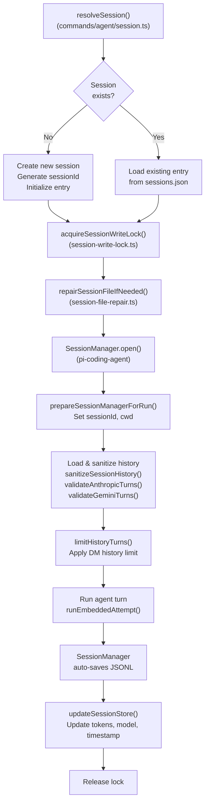
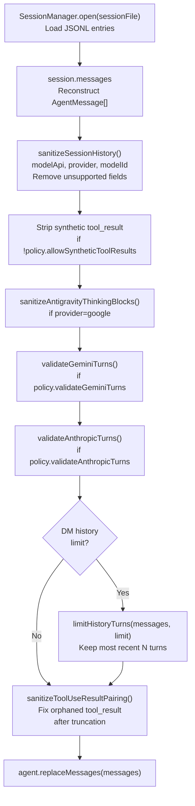
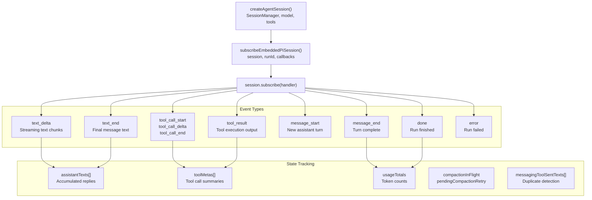
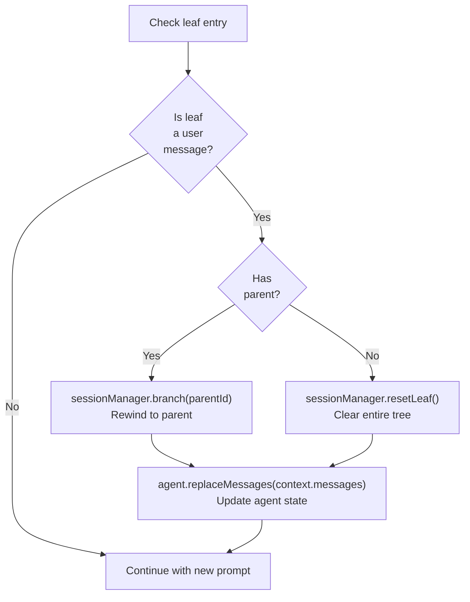

# Page: Session Management

# Session Management

<details>
<summary>Relevant source files</summary>

The following files were used as context for generating this wiki page:

- [docs/concepts/system-prompt.md](docs/concepts/system-prompt.md)
- [docs/gateway/background-process.md](docs/gateway/background-process.md)
- [docs/gateway/cli-backends.md](docs/gateway/cli-backends.md)
- [docs/reference/token-use.md](docs/reference/token-use.md)
- [src/agents/auth-profiles/oauth.fallback-to-main-agent.test.ts](src/agents/auth-profiles/oauth.fallback-to-main-agent.test.ts)
- [src/agents/auth-profiles/oauth.ts](src/agents/auth-profiles/oauth.ts)
- [src/agents/bash-process-registry.test.ts](src/agents/bash-process-registry.test.ts)
- [src/agents/bash-process-registry.ts](src/agents/bash-process-registry.ts)
- [src/agents/bash-tools.ts](src/agents/bash-tools.ts)
- [src/agents/cli-backends.ts](src/agents/cli-backends.ts)
- [src/agents/cli-runner.test.ts](src/agents/cli-runner.test.ts)
- [src/agents/cli-runner.ts](src/agents/cli-runner.ts)
- [src/agents/cli-runner/helpers.ts](src/agents/cli-runner/helpers.ts)
- [src/agents/pi-embedded-helpers.ts](src/agents/pi-embedded-helpers.ts)
- [src/agents/pi-embedded-runner.test.ts](src/agents/pi-embedded-runner.test.ts)
- [src/agents/pi-embedded-runner.ts](src/agents/pi-embedded-runner.ts)
- [src/agents/pi-embedded-runner/compact.ts](src/agents/pi-embedded-runner/compact.ts)
- [src/agents/pi-embedded-runner/run/attempt.ts](src/agents/pi-embedded-runner/run/attempt.ts)
- [src/agents/pi-embedded-runner/system-prompt.ts](src/agents/pi-embedded-runner/system-prompt.ts)
- [src/agents/pi-embedded-subscribe.ts](src/agents/pi-embedded-subscribe.ts)
- [src/agents/pi-tools.ts](src/agents/pi-tools.ts)
- [src/agents/system-prompt-params.ts](src/agents/system-prompt-params.ts)
- [src/agents/system-prompt-report.ts](src/agents/system-prompt-report.ts)
- [src/agents/system-prompt.test.ts](src/agents/system-prompt.test.ts)
- [src/agents/system-prompt.ts](src/agents/system-prompt.ts)
- [src/auto-reply/reply/agent-runner.heartbeat-typing.runreplyagent-typing-heartbeat.retries-after-compaction-failure-by-resetting-session.test.ts](src/auto-reply/reply/agent-runner.heartbeat-typing.runreplyagent-typing-heartbeat.retries-after-compaction-failure-by-resetting-session.test.ts)
- [src/auto-reply/reply/commands-context-report.ts](src/auto-reply/reply/commands-context-report.ts)
- [src/gateway/gateway-cli-backend.live.test.ts](src/gateway/gateway-cli-backend.live.test.ts)
- [src/telegram/group-migration.test.ts](src/telegram/group-migration.test.ts)
- [src/telegram/group-migration.ts](src/telegram/group-migration.ts)

</details>


Session management in OpenClaw handles conversation persistence, history storage, and state tracking across agent runs. Each session maintains a complete conversation history in JSONL format, while metadata is stored separately for fast lookups and routing.

For information about session-level configuration overrides (model selection, thinking levels), see [Model Selection and Failover](#5.4). For compaction and history pruning, see [Context Overflow and Auto-Compaction](#5.5).

---

## Session Key Format

Session keys uniquely identify conversations and determine routing, agent selection, and isolation boundaries. The format follows a hierarchical pattern that encodes the agent, channel, and conversation peer.

**Format**: `agent:ID:channel:peer`

| Component | Description | Example |
|-----------|-------------|---------|
| `agent` | Literal prefix | `agent` |
| `ID` | Agent identifier (main, work, etc.) | `main`, `work` |
| `channel` | Message provider | `telegram`, `signal`, `whatsapp` |
| `peer` | Conversation identifier (E.164, user ID, group ID) | `+15551234567`, `user:123`, `group:-456` |

**Examples**:
- `agent:main:telegram:+15551234567` - Main agent, Telegram DM
- `agent:work:signal:group:-100` - Work agent, Signal group
- `agent:main:whatsapp:+14155551234` - Main agent, WhatsApp DM

Subagent sessions follow the pattern `agent:parent:subagent:ID` where the parent session key is embedded. See [src/routing/session-key.ts:1-50]() for key parsing and validation.

**Sources**: [src/routing/session-key.ts:1-100](), [src/config/sessions.ts:40-80]()

---

## Session File Storage

Each session maintains a persistent conversation history in a JSONL file (`.jsonl`). The file contains a sequence of entries representing messages, tool calls, and tool results.

### File Location

Session files are stored at:
```
~/.openclaw/agents/<agentId>/sessions/<sessionId>.jsonl
```

For the main agent (`agentId` = `main`):
```
~/.openclaw/agents/main/sessions/<sessionId>.jsonl
```

The path is resolved via `resolveSessionFilePath()` which takes the `sessionId`, optional `sessionEntry`, and agent context.

**Sources**: [src/config/sessions.ts:120-180](), [src/agents/pi-embedded-runner/run/attempt.ts:401-410]()

### JSONL Format

Each line in the session file is a JSON object representing an entry. The `SessionManager` from `@mariozechner/pi-coding-agent` handles reading, writing, and navigating the session tree structure.

**Entry types**:

| Type | Description | Fields |
|------|-------------|--------|
| `message` | User or assistant message | `type`, `message: { role, content, timestamp, api, provider, model, usage?, stopReason? }` |
| `tool_call` | Tool invocation request | `type`, `toolCall: { name, params, id }` |
| `tool_result` | Tool execution result | `type`, `toolResult: { toolCallId, result, isError? }` |
| `header` | Session metadata (first entry) | `type: "header"`, `sessionId`, `cwd` |

Example session file:
```jsonl
{"type":"header","sessionId":"session-abc123","cwd":"/workspace"}
{"type":"message","message":{"role":"user","content":"hello","timestamp":1704067200000}}
{"type":"message","message":{"role":"assistant","content":"Hi!","timestamp":1704067201000,"api":"anthropic-messages","provider":"anthropic","model":"claude-opus-4-5","usage":{"input":10,"output":5},"stopReason":"stop"}}
{"type":"tool_call","toolCall":{"name":"exec","params":{"command":"date"},"id":"tc_1"}}
{"type":"tool_result","toolResult":{"toolCallId":"tc_1","result":"Mon Jan 1 12:00:00","isError":false}}
```

**Session tree navigation**:
- `SessionManager.open(file)` - Load session from JSONL
- `SessionManager.appendMessage(msg)` - Add entry to current branch
- `SessionManager.branch(parentId)` - Rewind to earlier state
- `SessionManager.resetLeaf()` - Clear entire tree

The session file is append-only during normal operation. Branching creates alternate conversation paths without removing history.

**Sources**: [src/agents/pi-embedded-runner/run/attempt.ts:408-435](), [src/agents/pi-embedded-runner.test.ts:290-320](), [src/agents/session-file-repair.ts:1-50]()

---

## Session Metadata Store

The session metadata store (`sessions.json`) holds fast-access metadata for routing, filtering, and UI display without loading full session files.

### Location

```
~/.openclaw/sessions.json
```

Configured via `session.store` in `openclaw.json`.

### Store Structure

```typescript
{
  "agent:main:telegram:+15551234567": {
    "sessionId": "session-abc123",
    "sessionKey": "agent:main:telegram:+15551234567",
    "updatedAt": 1704067200000,
    "channel": "telegram",
    "chatType": "dm",
    "thinkingLevel": "high",
    "verboseLevel": "on",
    "modelOverride": "claude-opus-4-5",
    "providerOverride": "anthropic",
    "totalTokens": 45234,
    "inputTokens": 32100,
    "outputTokens": 13134,
    "contextTokens": 28000,
    "groupId": null,
    "groupChannel": null,
    "space": null,
    "spawnedBy": null,
    "skillsSnapshot": {...}
  }
}
```

| Field | Type | Description |
|-------|------|-------------|
| `sessionId` | `string` | Unique session identifier |
| `sessionKey` | `string` | Full session key (agent:ID:channel:peer) |
| `updatedAt` | `number` | Last activity timestamp (ms) |
| `channel` | `string` | Message provider (telegram, signal, etc.) |
| `chatType` | `string` | `dm`, `group`, `channel` |
| `thinkingLevel` | `string` | Persistent thinking override (off/low/high/xhigh) |
| `verboseLevel` | `string` | Persistent verbose override (off/on/full) |
| `modelOverride` | `string` | Session-specific model selection |
| `providerOverride` | `string` | Session-specific provider selection |
| `totalTokens` | `number` | Cumulative token usage |
| `inputTokens` | `number` | Cumulative input tokens |
| `outputTokens` | `number` | Cumulative output tokens |
| `contextTokens` | `number` | Current context window usage |
| `skillsSnapshot` | `object` | Frozen skills state for session |

The store is updated after each agent run via `updateSessionStore()`.

**Sources**: [src/config/sessions.ts:200-350](), [src/commands/agent/session-store.ts:1-100]()

---

## Session Lifecycle



**Sources**: [src/commands/agent/session.ts:1-150](), [src/agents/pi-embedded-runner/run/attempt.ts:400-440]()

### Session Resolution

When a command arrives with `--to`, `--session-id`, `--session-key`, or `--agent`:

1. **Derive session key**: If `--to` is provided, generate key from agent + channel + peer
2. **Load metadata**: Look up entry in `sessions.json`
3. **Create if missing**: Generate new `sessionId` and initialize entry
4. **Return context**: Provides `sessionId`, `sessionKey`, `sessionEntry`, `sessionStore`, `storePath`

**Sources**: [src/commands/agent/session.ts:20-120](), [src/commands/agent.ts:139-156]()

### Session Initialization

For new sessions:

1. Generate `sessionId` (e.g., `session-<uuid>`)
2. Create session entry with `updatedAt`, `channel`, `chatType`
3. Write to `sessions.json`
4. Skills snapshot is built on first run if missing

For subagents spawned via `sessions_spawn`, the session key includes the parent session context.

**Sources**: [src/commands/agent.ts:189-217](), [src/agents/pi-embedded-runner/run/attempt.ts:189-217]()

---

## Session History Management

Session history is loaded from the JSONL file, sanitized for the target model API, validated for turn ordering, and optionally limited before being passed to the model provider.

**History Processing Pipeline**



**Sources**: [src/agents/pi-embedded-runner/run/attempt.ts:544-574](), [src/agents/pi-embedded-runner/google.ts:200-350]()

### History Sanitization

The `sanitizeSessionHistory()` function adapts session history for different model APIs by removing unsupported fields and fixing provider-specific issues.

**Sanitization operations**:

| Operation | Provider | Description |
|-----------|----------|-------------|
| Strip synthetic tool_result | Anthropic | Remove tool_result entries without matching tool_use in assistant message |
| Fix turn ordering | Anthropic, Gemini | Ensure user/assistant alternation, collapse consecutive turns |
| Clean thinking blocks | Google | Remove or escape `<think>` blocks that conflict with Gemini's format |
| Remove unsupported fields | All | Strip provider-specific metadata (cache control, etc.) |
| Repair tool pairings | All | Fix orphaned tool_use or tool_result after truncation |

**Transcript policy resolution**:

```typescript
const policy = resolveTranscriptPolicy({
  modelApi: "anthropic-messages",
  provider: "anthropic",
  modelId: "claude-opus-4-5"
});
// Returns: {
//   allowSyntheticToolResults: false,
//   validateAnthropicTurns: true,
//   validateGeminiTurns: false,
//   repairToolUseResultPairing: true
// }
```

The policy is determined by `modelApi` (e.g., `anthropic-messages`, `openai-responses`, `google-generative-ai`) and controls which sanitization steps run.

**Sources**: [src/agents/pi-embedded-runner/run/attempt.ts:544-570](), [src/agents/transcript-policy.ts:1-100](), [src/agents/session-transcript-repair.ts:1-150](), [src/agents/pi-embedded-runner/google.ts:200-350]()

### Turn Validation

#### Anthropic Validation

`validateAnthropicTurns()` ensures:
- First message is `user` role
- No consecutive messages with the same role
- Collapses consecutive user/assistant messages into single turns

**Sources**: [src/agents/pi-embedded-helpers.ts:400-500]()

#### Gemini Validation

`validateGeminiTurns()` ensures:
- First message is `user` role
- Strict user/assistant alternation
- Handles Google's specific turn requirements

**Sources**: [src/agents/pi-embedded-helpers.ts:500-600]()

### History Limits

DM sessions can have history limits to prevent unbounded context growth:

```typescript
getDmHistoryLimitFromSessionKey(
  sessionKey: "agent:main:telegram:+15551234567",
  config
)
// Returns configured limit or undefined
```

The limit is applied via `limitHistoryTurns()` which keeps the most recent N message pairs.

**Configuration**:
```json
{
  "agents": {
    "defaults": {
      "dmHistoryLimit": 50
    }
  }
}
```

**Sources**: [src/agents/pi-embedded-runner/history.ts:1-100](), [src/agents/pi-embedded-runner/run/attempt.ts:557-560]()

---

## Session Event Subscription

During agent execution, OpenClaw subscribes to session events to track assistant responses, tool calls, usage, and state changes. The `subscribeEmbeddedPiSession()` function creates a subscription that monitors the `AgentSession` and aggregates results.

**Subscription Architecture**



**Tracked state** (from `EmbeddedPiSubscribeState`):

```typescript
{
  assistantTexts: string[],           // All assistant message texts
  toolMetas: ToolMeta[],               // Tool calls and results
  toolMetaById: Map<string, ToolMeta>, // Quick lookup by call ID
  lastToolError?: { name, error },     // Most recent tool failure
  
  // Usage tracking
  usageTotals: { input, output, cacheRead, cacheWrite, total },
  
  // Compaction state
  compactionInFlight: boolean,
  pendingCompactionRetry: number,
  
  // Messaging tool deduplication
  messagingToolSentTexts: string[],
  messagingToolSentTextsNormalized: string[],
  messagingToolSentTargets: Array<{ channel, to }>,
  
  // Block reply streaming
  blockReplyBreak: "text_end" | "message_end",
  blockBuffer: string,
  lastBlockReplyText?: string,
  
  // Reasoning mode
  reasoningMode: "off" | "on" | "stream",
  lastStreamedReasoning?: string
}
```

**Callback hooks**:
- `onToolResult(payload)` - Called when verbose mode emits tool summaries
- `onReasoningStream(payload)` - Called for streaming reasoning text (if `reasoningMode: "stream"`)
- `onBlockReply(payload)` - Called for incremental reply chunks (if streaming enabled)
- `onPartialReply(payload)` - Called for partial assistant updates

**Usage aggregation**:

```typescript
const subscription = subscribeEmbeddedPiSession({
  session: agentSession,
  runId: "run-123",
  verboseLevel: "on",
  reasoningMode: "stream",
  onToolResult: (payload) => { /* ... */ },
  onBlockReply: (payload) => { /* ... */ }
});

// After run completes:
const texts = subscription.assistantTexts;  // ["first reply", "second reply"]
const tools = subscription.toolMetas;       // [{ name: "exec", params, result }]
const usage = subscription.getUsageTotals(); // { input: 1000, output: 500, ... }
const lastError = subscription.getLastToolError(); // { name: "exec", error: "..." }

subscription.unsubscribe();
```

The subscription tracks:
1. All assistant message texts (for transcript building)
2. Tool call/result pairs (for verbose output)
3. Token usage across all turns (for session store updates)
4. Compaction retries (for auto-retry on context overflow)
5. Messaging tool deduplication (to suppress duplicate block replies)

**Sources**: [src/agents/pi-embedded-subscribe.ts:32-635](), [src/agents/pi-embedded-runner/run/attempt.ts:632-708]()

---

## Session Locking

Session files use a write lock mechanism to prevent concurrent modifications and race conditions during agent runs and compaction.

**Lock acquisition**:

```typescript
const sessionLock = await acquireSessionWriteLock({
  sessionFile: "/path/to/session.jsonl"
});
// Lock held until function returns or process exits
```

**Lock properties**:
- Uses `proper-lockfile` for file-based locking
- Blocks concurrent writes to the same session file
- Auto-releases on process exit (via `onExit` handler)
- Supports stale lock detection (default: 10 seconds)
- Retries acquisition if lock is held (default: 5 retries)

**Lock scope**:
- Acquired before opening `SessionManager`
- Held during entire agent run (prompt → tool calls → response)
- Held during compaction operations
- Held during session reset/repair

Multiple reads of different sessions can happen concurrently, but writes to the same session are serialized.

**Sources**: [src/agents/session-write-lock.ts:1-100](), [src/agents/pi-embedded-runner/run/attempt.ts:405-407](), [src/agents/pi-embedded-runner/compact.ts:364-366]()

### Lock Scope

Locks are acquired:
- Before opening `SessionManager`
- Before any session file modifications
- During compaction operations
- During session reset

Multiple reads can happen concurrently, but writes are serialized.

**Sources**: [src/agents/pi-embedded-runner/compact.ts:361-363]()

---

## Session Repair

Session files can become corrupted due to crashes, incomplete writes, or format changes. The repair system detects and fixes common issues.

### Repair Triggers

```typescript
await repairSessionFileIfNeeded({
  sessionFile: "/path/to/session.jsonl",
  warn: (message) => log.warn(message)
});
```

Called:
- Before opening `SessionManager` in `runEmbeddedAttempt()`
- Before compaction in `compactEmbeddedPiSessionDirect()`
- On session load errors

**Sources**: [src/agents/session-file-repair.ts:1-200](), [src/agents/pi-embedded-runner/run/attempt.ts:408-411]()

### Repair Operations

| Issue | Detection | Fix |
|-------|-----------|-----|
| Orphaned user message at leaf | Final entry is user message without assistant response | Remove orphaned message or branch to parent |
| Missing session header | No header entry at start | Inject header with sessionId and cwd |
| Malformed JSON lines | JSON parse errors | Skip invalid lines, warn |
| Incomplete tool call/result pairs | Tool call without result | Inject synthetic result or remove call |

### Orphaned Message Repair



This prevents consecutive user turns which violate model API constraints.

**Sources**: [src/agents/pi-embedded-runner/run/attempt.ts:747-760](), [src/agents/pi-embedded-runner.test.ts:477-507]()

---

## Session Manager Cache

To reduce session file I/O, OpenClaw maintains an in-memory cache of recently accessed `SessionManager` instances.

**Cache operations**:

```typescript
await prewarmSessionFile(sessionFile);
// Preload session into cache before run starts

trackSessionManagerAccess(sessionFile);
// Update LRU access time after using cached manager
```

**Cache behavior**:
- Stores `SessionManager` instances keyed by absolute file path
- Uses LRU eviction policy (default: 50 entries)
- Auto-invalidates on external file modifications (via `fs.watch`)
- Cache hits avoid re-parsing JSONL and rebuilding message tree
- Cache misses trigger normal `SessionManager.open()` flow

**Cache lifecycle**:
1. `prewarmSessionFile()` - Load session into cache before acquisition
2. `SessionManager.open()` - Check cache, return cached instance or load from disk
3. `trackSessionManagerAccess()` - Update access time for LRU
4. Automatic eviction when cache exceeds size limit

This optimization significantly improves performance for active sessions with frequent message exchanges (e.g., group chats, rapid DM interactions).

**Sources**: [src/agents/pi-embedded-runner/session-manager-cache.ts:1-200](), [src/agents/pi-embedded-runner/run/attempt.ts:427-433]()

---

## Session Store Updates

After each agent run, the session metadata store (`sessions.json`) is updated with cumulative usage, model information, and timestamps.

**Update flow**:

```typescript
await updateSessionStoreAfterAgentRun({
  cfg,
  contextTokensOverride,
  sessionId,
  sessionKey,
  storePath,
  sessionStore,
  defaultProvider,
  defaultModel,
  fallbackProvider,
  fallbackModel,
  result // EmbeddedPiRunResult with { meta: { agentMeta: { usage } } }
});
```

**Updated fields**:

| Field | Source | Description |
|-------|--------|-------------|
| `updatedAt` | `Date.now()` | Last activity timestamp |
| `totalTokens` | `session.totalTokens + usage.total` | Cumulative tokens (all runs) |
| `inputTokens` | `session.inputTokens + usage.input` | Cumulative input tokens |
| `outputTokens` | `session.outputTokens + usage.output` | Cumulative output tokens |
| `contextTokens` | `contextTokensOverride ?? estimateContextTokens()` | Current context window size |
| `providerOverride` | `fallbackProvider` (if fallback occurred) | Persistent provider override |
| `modelOverride` | `fallbackModel` (if fallback occurred) | Persistent model override |
| `lastRunDurationMs` | `result.meta.durationMs` | Last run duration |

**Persistence**:
- Store is locked during update (via `lockfile`)
- Changes are written atomically
- Store is loaded/saved on every update (no in-memory cache)

**Usage tracking**:

Usage comes from the subscription's `getUsageTotals()` which aggregates across all model calls in the run:

```typescript
const subscription = subscribeEmbeddedPiSession({ ... });
// Run completes
const usage = subscription.getUsageTotals();
// usage: { input: 1000, output: 500, cacheRead: 200, cacheWrite: 100, total: 1800 }
```

If a run includes multiple model calls (e.g., compaction retry), all usage is summed.

**Sources**: [src/commands/agent/session-store.ts:1-150](), [src/commands/agent.ts:500-530](), [src/agents/pi-embedded-subscribe.ts:235-268]()

---

## Session Context Overflow

When a session exceeds the model's context window, OpenClaw attempts automatic compaction before failing the request. See [Context Overflow and Auto-Compaction](#5.5) for detailed handling.

**Overflow detection**:
- Catch context overflow errors from model API
- Log diagnostic info (message count, session file, provider/model)
- Attempt up to 3 auto-compaction retries

**Compaction invocation**:
```typescript
await compactEmbeddedPiSessionDirect({
  sessionId,
  sessionKey,
  sessionFile,
  workspaceDir,
  config,
  provider,
  model: modelId,
  thinkLevel,
  reasoningLevel
});
```

On success, the original prompt is retried. On failure, returns a user-friendly error.

**Sources**: [src/agents/pi-embedded-runner/run.ts:376-425](), [src/agents/pi-embedded-runner/compact.ts:114-450]()

---

## Session Reset and Deletion

Sessions can be reset (clearing history but preserving metadata) or fully deleted.

### Reset via Gateway

```typescript
{
  "method": "sessions.reset",
  "params": {
    "sessionKey": "agent:main:telegram:+15551234567"
  }
}
```

**Behavior**:
- Deletes `.jsonl` file
- Preserves session metadata in `sessions.json`
- Next run starts fresh history

**Sources**: [src/gateway/server-methods/sessions.ts:200-250]()

### Delete via Gateway

```typescript
{
  "method": "sessions.delete",
  "params": {
    "sessionKey": "agent:main:telegram:+15551234567"
  }
}
```

**Behavior**:
- Deletes `.jsonl` file
- Removes entry from `sessions.json`
- Session key becomes available for reuse

**Sources**: [src/gateway/server-methods/sessions.ts:250-300]()

---

## Session Manager Guard

The `guardSessionManager()` wrapper enforces session-level invariants and policy:

```typescript
const sessionManager = guardSessionManager(
  SessionManager.open(sessionFile),
  {
    agentId: "main",
    sessionKey: "agent:main:telegram:+15551234567",
    allowSyntheticToolResults: false
  }
);
```

**Enforcements**:
- Blocks synthetic tool results when `allowSyntheticToolResults=false`
- Validates tool call/result pairing
- Logs warnings for policy violations
- Prevents invalid session states

**Sources**: [src/agents/session-tool-result-guard-wrapper.ts:1-150](), [src/agents/pi-embedded-runner/run/attempt.ts:424-428]()

---

## Session Resolution for Commands

The `resolveSession()` helper unifies session resolution across CLI, gateway, and channel handlers:

```typescript
const resolution = resolveSession({
  cfg,
  to: "+15551234567",
  sessionId: undefined,
  sessionKey: undefined,
  agentId: "main"
});
// Returns: {
//   sessionId,
//   sessionKey,
//   sessionEntry,
//   sessionStore,
//   storePath,
//   isNewSession,
//   persistedThinking,
//   persistedVerbose
// }
```

**Priority**:
1. `sessionKey` (explicit, highest priority)
2. `sessionId` (lookup in store)
3. `to` + `agentId` (derive key from routing)
4. `agentId` alone (use main session key)

**Sources**: [src/commands/agent/session.ts:1-150](), [src/commands/agent.ts:139-156]()

---