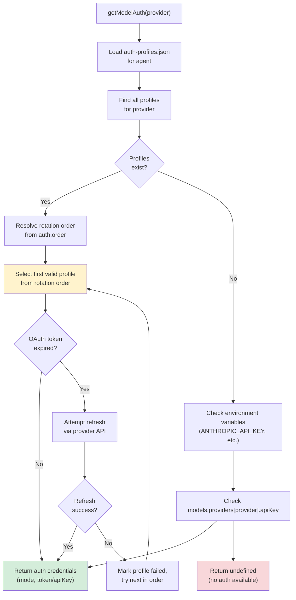
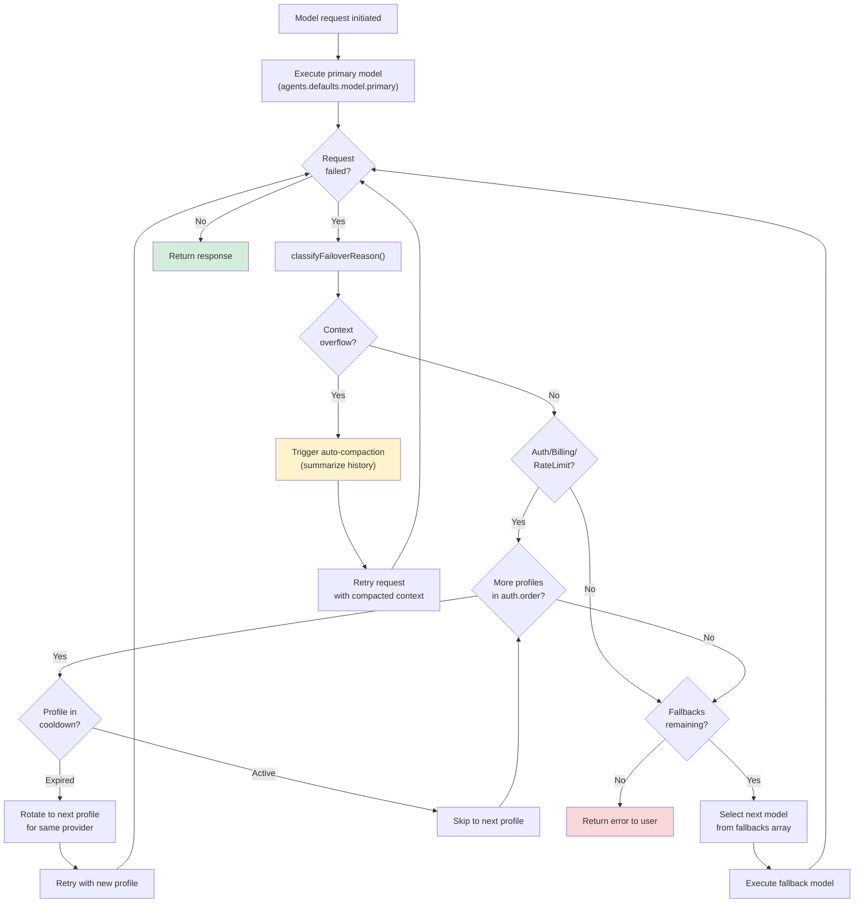

# Page: Model Selection and Failover

# Model Selection and Failover

<details>
<summary>Relevant source files</summary>

The following files were used as context for generating this wiki page:

- [docs/concepts/system-prompt.md](docs/concepts/system-prompt.md)
- [docs/gateway/cli-backends.md](docs/gateway/cli-backends.md)
- [docs/reference/token-use.md](docs/reference/token-use.md)
- [src/agents/auth-profiles/oauth.fallback-to-main-agent.test.ts](src/agents/auth-profiles/oauth.fallback-to-main-agent.test.ts)
- [src/agents/auth-profiles/oauth.ts](src/agents/auth-profiles/oauth.ts)
- [src/agents/cli-backends.ts](src/agents/cli-backends.ts)
- [src/agents/cli-runner.test.ts](src/agents/cli-runner.test.ts)
- [src/agents/cli-runner.ts](src/agents/cli-runner.ts)
- [src/agents/cli-runner/helpers.ts](src/agents/cli-runner/helpers.ts)
- [src/agents/pi-embedded-runner/compact.ts](src/agents/pi-embedded-runner/compact.ts)
- [src/agents/pi-embedded-runner/run/attempt.ts](src/agents/pi-embedded-runner/run/attempt.ts)
- [src/agents/pi-embedded-runner/system-prompt.ts](src/agents/pi-embedded-runner/system-prompt.ts)
- [src/agents/system-prompt-params.ts](src/agents/system-prompt-params.ts)
- [src/agents/system-prompt-report.ts](src/agents/system-prompt-report.ts)
- [src/agents/system-prompt.test.ts](src/agents/system-prompt.test.ts)
- [src/agents/system-prompt.ts](src/agents/system-prompt.ts)
- [src/auto-reply/reply/agent-runner.heartbeat-typing.runreplyagent-typing-heartbeat.retries-after-compaction-failure-by-resetting-session.test.ts](src/auto-reply/reply/agent-runner.heartbeat-typing.runreplyagent-typing-heartbeat.retries-after-compaction-failure-by-resetting-session.test.ts)
- [src/auto-reply/reply/commands-context-report.ts](src/auto-reply/reply/commands-context-report.ts)
- [src/commands/agent.test.ts](src/commands/agent.test.ts)
- [src/commands/agent.ts](src/commands/agent.ts)
- [src/cron/isolated-agent.ts](src/cron/isolated-agent.ts)
- [src/cron/run-log.test.ts](src/cron/run-log.test.ts)
- [src/cron/run-log.ts](src/cron/run-log.ts)
- [src/cron/store.ts](src/cron/store.ts)
- [src/gateway/gateway-cli-backend.live.test.ts](src/gateway/gateway-cli-backend.live.test.ts)
- [src/gateway/protocol/index.ts](src/gateway/protocol/index.ts)
- [src/gateway/protocol/schema.ts](src/gateway/protocol/schema.ts)
- [src/gateway/protocol/schema/agents-models-skills.ts](src/gateway/protocol/schema/agents-models-skills.ts)
- [src/gateway/protocol/schema/protocol-schemas.ts](src/gateway/protocol/schema/protocol-schemas.ts)
- [src/gateway/protocol/schema/types.ts](src/gateway/protocol/schema/types.ts)
- [src/gateway/server-methods-list.ts](src/gateway/server-methods-list.ts)
- [src/gateway/server-methods.ts](src/gateway/server-methods.ts)
- [src/gateway/server-methods/agents.ts](src/gateway/server-methods/agents.ts)
- [src/gateway/server.ts](src/gateway/server.ts)
- [src/telegram/group-migration.test.ts](src/telegram/group-migration.test.ts)
- [src/telegram/group-migration.ts](src/telegram/group-migration.ts)

</details>


## Purpose and Scope

This page documents how OpenClaw selects AI models at runtime, manages authentication credentials across multiple providers, and implements automatic failover when models fail. It covers model configuration structure, auth profile management, error-triggered fallback chains, and CLI tools for model administration.

For multi-agent routing and workspace isolation, see [Multi-Agent Configuration](#4.3). For tool restrictions by provider/model, see [Tools and Skills](#6).

---

## Model Configuration Structure

OpenClaw uses a hierarchical model configuration system with primary models, fallback chains, and optional per-agent overrides.

### Primary and Fallback Models

The base configuration lives under `agents.defaults.model`:

```json5
{
  agents: {
    defaults: {
      model: {
        primary: "anthropic/claude-sonnet-4-20250514",
        fallbacks: [
          "openai-codex/gpt-5.2",
          "google-gemini/gemini-2.0-flash-exp"
        ]
      }
    }
  }
}
```

**Fields:**
- `primary` (string, required): Default model in `provider/model` format
- `fallbacks` (string[], optional): Ordered list of models to try on failure

Image model configuration follows the same pattern:

```json5
{
  agents: {
    defaults: {
      imageModel: {
        primary: "openai-codex/gpt-5.2",
        fallbacks: ["anthropic/claude-sonnet-4-20250514"]
      }
    }
  }
}
```

### Per-Agent Model Overrides

Individual agents can override the default model configuration:

```json5
{
  agents: {
    list: [
      {
        id: "work",
        model: {
          primary: "openai-codex/gpt-5.2",
          fallbacks: []  // Disable global fallbacks
        }
      },
      {
        id: "personal",
        model: "anthropic/claude-sonnet-4-20250514"  // Shorthand: only override primary
      }
    ]
  }
}
```

When using the object form, `fallbacks` replaces the global list. An empty array `[]` disables fallbacks entirely for that agent.

### Model Aliases

Aliases provide shorthand names for full model refs:

```json5
{
  models: {
    aliases: {
      "sonnet": "anthropic/claude-sonnet-4-20250514",
      "gpt5": "openai-codex/gpt-5.2",
      "flash": "google-gemini/gemini-2.0-flash-exp"
    }
  }
}
```

Aliases are resolved early during model selection and work in both `primary` and `fallbacks` fields.

**Sources:**
- [docs/gateway/configuration.md:195-230]()
- [docs/gateway/configuration.md:723-731]()

---

## Provider Configuration

Each model provider requires connection settings and authentication configuration under `models.providers.*`.

### Provider Settings Structure

```json5
{
  models: {
    providers: {
      anthropic: {
        apiKey: "${ANTHROPIC_API_KEY}",
        baseUrl: "https://api.anthropic.com"  // Optional override
      },
      "openai-codex": {
        apiKey: "${OPENAI_API_KEY}"
      },
      "google-gemini": {
        apiKey: "${GOOGLE_API_KEY}",
        baseUrl: "https://generativelanguage.googleapis.com"
      },
      bedrock: {
        region: "us-east-1",
        profile: "default"  // AWS profile name
      },
      ollama: {
        baseUrl: "http://localhost:11434"
      }
    }
  }
}
```

**Common Fields:**
- `apiKey` (string): API key for the provider (supports env var substitution)
- `baseUrl` (string): Override default API endpoint
- `timeout` (number): Request timeout in milliseconds
- `maxRetries` (number): Retry attempts before failover

Provider-specific fields:
- **AWS Bedrock**: `region`, `profile`, `accessKeyId`, `secretAccessKey`
- **OpenRouter**: `apiKey`, `baseUrl` (defaults to `https://openrouter.ai/api/v1`)
- **Local models**: `baseUrl` only (e.g., Ollama, LM Studio)

### Authentication Modes

Providers support different authentication modes:

| Provider | Supported Modes | Notes |
|----------|----------------|-------|
| `anthropic` | `api_key`, `oauth`, `token` | OAuth for Claude subscriptions, token for setup-token |
| `openai-codex` | `oauth`, `api_key` | OAuth for ChatGPT/Codex subscriptions |
| `google-gemini` | `api_key`, `oauth` | OAuth via Antigravity or Gemini CLI plugins |
| `openai` | `api_key` | Standard API key only |
| `bedrock` | `token` | AWS credentials or bearer token |
| `ollama` | None | No auth required for local instance |

**Sources:**
- [docs/gateway/configuration.md:320-354]()
- [src/agents/model-auth.ts:55-100]()

---

## Authentication Profile System

OpenClaw manages authentication credentials through per-agent auth profile stores, supporting OAuth tokens, API keys, and provider-specific token formats.

### Auth Profile Storage

Auth profiles are stored per-agent in `~/.openclaw/agents/<agentId>/agent/auth-profiles.json`:

```json
{
  "version": 1,
  "profiles": {
    "anthropic:me@example.com": {
      "provider": "anthropic",
      "mode": "oauth",
      "email": "me@example.com",
      "token": "...",
      "refreshToken": "...",
      "expiresAt": "2025-02-01T00:00:00Z"
    },
    "anthropic:manual": {
      "provider": "anthropic",
      "mode": "api_key",
      "apiKey": "sk-ant-..."
    },
    "openai-codex:work": {
      "provider": "openai-codex",
      "mode": "oauth",
      "token": "...",
      "refreshToken": "..."
    }
  }
}
```

Profile IDs follow the pattern `<provider>:<identifier>`, where identifier can be an email (OAuth) or custom label (API key/token).

### Legacy OAuth Import

On first use, OpenClaw imports OAuth credentials from `~/.openclaw/credentials/oauth.json` into the per-agent auth-profiles.json:

```json
{
  "anthropic": {
    "me@example.com": {
      "accessToken": "...",
      "refreshToken": "...",
      "expiresAt": 1738368000
    }
  },
  "openai-codex": {
    "work": {
      "accessToken": "...",
      "refreshToken": "..."
    }
  }
}
```

After import, credentials live in the per-agent store. Legacy `oauth.json` is preserved for reference but no longer written.

### Profile Rotation Order

The `auth.order` config controls which profiles to try first when multiple exist for a provider:

```json5
{
  auth: {
    profiles: {
      "anthropic:me@example.com": { provider: "anthropic", mode: "oauth", email: "me@example.com" },
      "anthropic:work": { provider: "anthropic", mode: "api_key" },
      "anthropic:backup": { provider: "anthropic", mode: "token" }
    },
    order: {
      anthropic: [
        "anthropic:me@example.com",
        "anthropic:work",
        "anthropic:backup"
      ]
    }
  }
}
```

When a request to `anthropic` fails with auth/billing/rate-limit errors, OpenClaw rotates to the next profile in the order list.

**Sources:**
- [docs/gateway/configuration.md:356-395]()
- [src/agents/model-auth.ts:1-100]()

---

## Authentication Resolution Flow



**Key Functions:**
- `getModelAuth()` in [src/agents/model-auth.ts:100-200]()
- `ensureAuthProfileStore()` in [src/agents/auth-profiles.ts]()
- `resolveAuthProfileOrder()` in [src/agents/auth-profiles.ts]()

**Sources:**
- [src/agents/model-auth.ts:1-300]()
- [docs/gateway/configuration.md:356-395]()

---

## Failover Mechanism

OpenClaw implements automatic failover based on error classification, triggering fallback attempts when primary models fail.

### Error Classification

The agent runtime classifies errors to determine failover eligibility:

| Error Type | Function | Triggers Failover? | Example |
|------------|----------|-------------------|---------|
| Auth failure | `isAuthAssistantError()` | Yes | Invalid API key, expired OAuth token |
| Billing issue | `isBillingAssistantError()` | Yes | Quota exceeded, payment required |
| Rate limit | `isRateLimitAssistantError()` | Yes | 429 Too Many Requests |
| Context overflow | `isContextOverflowError()` | No | Prompt too long, triggers compaction |
| Timeout | `isTimeoutErrorMessage()` | Yes | Request timeout, network failure |
| Overloaded | `isOverloadedErrorMessage()` | Yes | 503 Service Unavailable |
| Image dimension | `isImageDimensionErrorMessage()` | No | Image too large/small |
| Generic failure | N/A | Yes | Unknown errors |

**Classification Functions:**
```typescript
// src/agents/pi-embedded-helpers/errors.ts
export function isAuthAssistantError(error: unknown): boolean;
export function isBillingAssistantError(error: unknown): boolean;
export function isRateLimitAssistantError(error: unknown): boolean;
export function isContextOverflowError(message: string): boolean;
export function isTimeoutErrorMessage(message: string): boolean;
export function isOverloadedErrorMessage(message: string): boolean;
export function isImageDimensionErrorMessage(message: string): boolean;

export function classifyFailoverReason(error: unknown): FailoverReason;
```

### Fallback Chain Execution

When an error triggers failover:

1. **Primary attempt fails** with auth/billing/rate-limit error
2. **Auth profile rotation** tries next profile for same provider
3. **Fallback model selection** moves to next model in `fallbacks` array
4. **Repeat** until success or fallbacks exhausted

```json5
{
  agents: {
    defaults: {
      model: {
        primary: "anthropic/claude-sonnet-4-20250514",
        fallbacks: [
          "openai-codex/gpt-5.2",
          "google-gemini/gemini-2.0-flash-exp"
        ]
      }
    }
  },
  auth: {
    order: {
      anthropic: ["anthropic:me@example.com", "anthropic:backup"],
      "openai-codex": ["openai-codex:work", "openai-codex:personal"]
    }
  }
}
```

**Execution sequence:**
1. Try `anthropic/claude-sonnet-4-20250514` with `anthropic:me@example.com`
2. If auth fails, retry with `anthropic:backup`
3. If still fails, try `openai-codex/gpt-5.2` with `openai-codex:work`
4. If auth fails, retry with `openai-codex:personal`
5. If still fails, try `google-gemini/gemini-2.0-flash-exp`
6. If all fail, return error to user

### Cooldown Behavior

To prevent rapid retry cycles on persistent failures, OpenClaw implements cooldown timers:

```json5
{
  auth: {
    cooldowns: {
      billingBackoffHours: 24,  // Wait 24h after billing failure
      billingBackoffHoursByProvider: {
        anthropic: 48,  // Provider-specific override
        "openai-codex": 12
      },
      billingMaxHours: 168,  // Max cooldown: 7 days
      failureWindowHours: 1  // Reset counter after 1h of no failures
    }
  }
}
```

**Cooldown Rules:**
- Billing failures trigger `billingBackoffHours` cooldown
- Profile is marked unusable until cooldown expires
- Subsequent failures increase cooldown (up to `billingMaxHours`)
- Success or time window expiry resets failure counter

**Sources:**
- [src/agents/pi-embedded-helpers/errors.ts:1-300]()
- [docs/gateway/configuration.md:196-206]()
- [src/agents/pi-embedded-runner/run.ts]()

---

## Failover Decision Tree



**Key Decision Points:**
1. **Error classification** determines whether to try auth rotation vs model fallback
2. **Cooldown check** skips profiles marked as failed recently
3. **Context overflow** triggers compaction, not failover
4. **Profile exhaustion** moves to next fallback model
5. **Fallback exhaustion** returns error to user

**Sources:**
- [src/agents/pi-embedded-helpers/errors.ts]()
- [src/agents/pi-embedded-runner/run.ts]()
- [docs/gateway/configuration.md:196-206]()

---

## Model Selection Algorithm

The runtime resolves model references through a multi-stage process that handles aliases, validates against catalogs, and enforces allowlists.

### Resolution Flow

```mermaid
graph TB
    Start["Model selection initiated<br/>(agent, sessionKey, directive)"]
    CheckDirective{"/model<br/>directive?"}
    UseDirective["Use directive model<br/>(runtime override)"]
    CheckAgent["Resolve agent from sessionKey"]
    CheckAgentModel{Agent has<br/>model override?}
    UseAgentModel["Use agents.list[].model"]
    UseDefaultModel["Use agents.defaults.model.primary"]
    ResolveAlias["Check models.aliases"]
    IsAlias{Match found?}
    ExpandAlias["Expand to provider/model"]
    ParseRef["Parse provider/model format"]
    ValidFormat{Valid<br/>format?}
    LoadCatalog["Load model catalog<br/>(loadModelCatalog)"]
    CheckCatalog{Model in<br/>catalog?}
    CheckAllowlist{Model in<br/>allowlist?"}
    GetAuth["getModelAuth(provider, cfg)"]
    HasAuth{Auth<br/>available?}
    BuildModelRef["Build final ModelRef"]
    FallbackDefault["Fallback to DEFAULT_MODEL<br/>(anthropic/claude-sonnet-4)"]
    ReturnRef["Return ModelRef"]
    
    Start --> CheckDirective
    CheckDirective -->|Yes| UseDirective
    CheckDirective -->|No| CheckAgent
    UseDirective --> ResolveAlias
    CheckAgent --> CheckAgentModel
    CheckAgentModel -->|Yes| UseAgentModel
    CheckAgentModel -->|No| UseDefaultModel
    UseAgentModel --> ResolveAlias
    UseDefaultModel --> ResolveAlias
    ResolveAlias --> IsAlias
    IsAlias -->|Yes| ExpandAlias
    IsAlias -->|No| ParseRef
    ExpandAlias --> ParseRef
    ParseRef --> ValidFormat
    ValidFormat -->|No| FallbackDefault
    ValidFormat -->|Yes| LoadCatalog
    LoadCatalog --> CheckCatalog
    CheckCatalog -->|No| CheckAllowlist
    CheckCatalog -->|Yes| CheckAllowlist
    CheckAllowlist -->|No| FallbackDefault
    CheckAllowlist -->|Yes| GetAuth
    GetAuth --> HasAuth
    HasAuth -->|No| FallbackDefault
    HasAuth -->|Yes| BuildModelRef
    BuildModelRef --> ReturnRef
    FallbackDefault --> ReturnRef
    
    style ReturnRef fill:#d4edda
    style FallbackDefault fill:#fff3cd
```

### Key Resolution Functions

```typescript
// src/agents/model-selection.ts
export function resolveConfiguredModelRef(params: {
  cfg: OpenClawConfig;
  sessionKey?: string;
  directive?: string;
  defaultProvider: string;
  defaultModel: string;
}): { provider: string; model: string };

export function getModelRefStatus(params: {
  cfg: OpenClawConfig;
  catalog: ModelCatalog;
  ref: { provider: string; model: string };
  defaultProvider: string;
  defaultModel: string;
}): {
  key: string;
  allowed: boolean;
  inCatalog: boolean;
  hasAuth: boolean;
};
```

### Allowlist Enforcement

Models can be restricted via `agents.defaults.models` (or per-agent `agents.list[].models`):

```json5
{
  agents: {
    defaults: {
      models: [
        "anthropic/claude-sonnet-4-20250514",
        "openai-codex/gpt-5.2",
        "google-gemini/gemini-2.0-flash-exp"
      ]
    },
    list: [
      {
        id: "restricted",
        models: ["anthropic/claude-haiku-20250107"]  // Only allow Haiku
      }
    ]
  }
}
```

If `models` is unset or empty, all catalog models are allowed. When set, only listed models pass validation.

### Default Fallback

If resolution fails at any stage (invalid format, no auth, not in allowlist), the system falls back to:

```typescript
// src/agents/defaults.ts
export const DEFAULT_PROVIDER = "anthropic";
export const DEFAULT_MODEL = "claude-sonnet-4-20250514";
```

This ensures the system never blocks entirely due to configuration errors.

**Sources:**
- [src/agents/model-selection.ts]()
- [src/agents/defaults.ts]()
- [src/agents/model-catalog.ts]()
- [src/commands/doctor.ts:195-230]()

---

## CLI Model Management

OpenClaw provides comprehensive CLI tools for inspecting and configuring models.

### Status and Inspection

**View current configuration:**
```bash
openclaw models status
openclaw models status --json
openclaw models status --plain
```

Output includes:
- Primary model and fallbacks
- Configured providers
- Auth profiles with expiry status
- Allowlist restrictions

**List available models:**
```bash
openclaw models list
openclaw models list --all            # Include all catalog models
openclaw models list --provider anthropic
openclaw models list --json
```

**Probe auth profiles:**
```bash
openclaw models status --probe                    # Test all profiles
openclaw models status --probe --probe-provider anthropic
openclaw models status --probe --probe-profile "anthropic:me@example.com"
openclaw models status --probe --probe-timeout 5000
openclaw models status --probe --probe-max-tokens 10
```

Live probing sends minimal requests to verify auth validity. May consume tokens and trigger rate limits.

### Model Configuration

**Set primary model:**
```bash
openclaw models set anthropic/claude-sonnet-4-20250514
openclaw models set openai-codex/gpt-5.2
openclaw models set sonnet  # Use alias
```

Writes to `agents.defaults.model.primary`.

**Set image model:**
```bash
openclaw models set-image openai-codex/gpt-5.2
openclaw models set-image anthropic/claude-sonnet-4-20250514
```

Writes to `agents.defaults.imageModel.primary`.

**Manage fallbacks:**
```bash
openclaw models fallbacks list
openclaw models fallbacks add openai-codex/gpt-5.2
openclaw models fallbacks add google-gemini/gemini-2.0-flash-exp
openclaw models fallbacks remove openai-codex/gpt-5.2
openclaw models fallbacks clear
```

**Manage image model fallbacks:**
```bash
openclaw models image-fallbacks list
openclaw models image-fallbacks add anthropic/claude-sonnet-4-20250514
openclaw models image-fallbacks remove anthropic/claude-sonnet-4-20250514
openclaw models image-fallbacks clear
```

### Alias Management

**List aliases:**
```bash
openclaw models aliases list
openclaw models aliases list --json
```

**Add/remove aliases:**
```bash
openclaw models aliases add sonnet anthropic/claude-sonnet-4-20250514
openclaw models aliases add gpt5 openai-codex/gpt-5.2
openclaw models aliases remove sonnet
```

### Auth Profile Management

**Add new profile:**
```bash
# Interactive token paste
openclaw models auth add --provider anthropic

# Setup-token flow (runs `claude setup-token` on gateway host)
openclaw models auth setup-token --provider anthropic

# Paste setup-token from elsewhere
openclaw models auth paste-token --provider anthropic
```

**Manage rotation order:**
```bash
openclaw models auth order get anthropic
openclaw models auth order set anthropic "anthropic:me@example.com,anthropic:backup"
openclaw models auth order clear anthropic
```

**Sources:**
- [docs/cli/index.md:668-728]()
- [src/commands/models/]()

---

## Configuration Examples

### Multi-Provider Setup with Fallbacks

```json5
{
  agents: {
    defaults: {
      model: {
        primary: "anthropic/claude-sonnet-4-20250514",
        fallbacks: [
          "openai-codex/gpt-5.2",
          "google-gemini/gemini-2.0-flash-exp",
          "ollama/llama3.3"
        ]
      },
      imageModel: {
        primary: "openai-codex/gpt-5.2",
        fallbacks: ["anthropic/claude-sonnet-4-20250514"]
      }
    }
  },
  models: {
    providers: {
      anthropic: {
        apiKey: "${ANTHROPIC_API_KEY}",
        timeout: 60000
      },
      "openai-codex": {
        apiKey: "${OPENAI_API_KEY}"
      },
      "google-gemini": {
        apiKey: "${GOOGLE_API_KEY}",
        baseUrl: "https://generativelanguage.googleapis.com"
      },
      ollama: {
        baseUrl: "http://localhost:11434"
      }
    },
    aliases: {
      sonnet: "anthropic/claude-sonnet-4-20250514",
      haiku: "anthropic/claude-haiku-20250107",
      gpt5: "openai-codex/gpt-5.2",
      flash: "google-gemini/gemini-2.0-flash-exp",
      llama: "ollama/llama3.3"
    }
  },
  auth: {
    profiles: {
      "anthropic:me@example.com": {
        provider: "anthropic",
        mode: "oauth",
        email: "me@example.com"
      },
      "anthropic:backup": {
        provider: "anthropic",
        mode: "api_key"
      },
      "openai-codex:work": {
        provider: "openai-codex",
        mode: "oauth"
      }
    },
    order: {
      anthropic: ["anthropic:me@example.com", "anthropic:backup"],
      "openai-codex": ["openai-codex:work"]
    },
    cooldowns: {
      billingBackoffHours: 24,
      billingMaxHours: 168,
      failureWindowHours: 1
    }
  }
}
```

### Per-Agent Model Overrides

```json5
{
  agents: {
    defaults: {
      model: {
        primary: "anthropic/claude-sonnet-4-20250514",
        fallbacks: ["openai-codex/gpt-5.2"]
      }
    },
    list: [
      {
        id: "work",
        model: {
          primary: "openai-codex/gpt-5.2",
          fallbacks: []  // No fallbacks for work agent
        }
      },
      {
        id: "personal",
        model: "anthropic/claude-sonnet-4-20250514"  // Override primary only
      },
      {
        id: "budget",
        model: {
          primary: "anthropic/claude-haiku-20250107",
          fallbacks: ["ollama/llama3.3"]  // Cheap models only
        }
      }
    ]
  }
}
```

### OpenRouter Configuration

```json5
{
  agents: {
    defaults: {
      model: {
        primary: "openrouter/anthropic/claude-sonnet-4",
        fallbacks: [
          "openrouter/openai/gpt-4-turbo",
          "openrouter/google/gemini-pro-1.5"
        ]
      }
    }
  },
  models: {
    providers: {
      openrouter: {
        apiKey: "${OPENROUTER_API_KEY}",
        baseUrl: "https://openrouter.ai/api/v1"
      }
    }
  }
}
```

### Local Model Setup (Ollama)

```json5
{
  agents: {
    defaults: {
      model: {
        primary: "ollama/llama3.3",
        fallbacks: []
      }
    }
  },
  models: {
    providers: {
      ollama: {
        baseUrl: "http://localhost:11434"
      }
    }
  }
}
```

**Sources:**
- [docs/gateway/configuration-examples.md:1-500]()
- [docs/gateway/configuration.md:1-2000]()

---

## Troubleshooting

### No API key found for provider

**Symptom:** `No API key found for provider "anthropic"`

**Cause:** Auth profiles are per-agent. A new agent won't inherit credentials from other agents.

**Fix:**
```bash
# Re-run onboarding for this agent
openclaw onboard

# Or paste a setup-token on gateway host
openclaw models auth setup-token --provider anthropic

# Or copy auth-profiles.json from another agent
cp ~/.openclaw/agents/main/agent/auth-profiles.json \
   ~/.openclaw/agents/work/agent/auth-profiles.json
```

### OAuth token refresh failed

**Symptom:** Stored OAuth token expired and refresh failed

**Fix:** Switch to setup-token (more reliable):
```bash
# On gateway host (paste token)
openclaw models auth setup-token --provider anthropic

# Or generate token elsewhere and paste
openclaw models auth paste-token --provider anthropic

# Verify
openclaw models status
```

### Model not in allowlist

**Symptom:** Doctor warns model is not in `agents.defaults.models` allowlist

**Fix:** Add model to allowlist or remove restriction:
```bash
# Add to allowlist
openclaw config set agents.defaults.models '["anthropic/claude-sonnet-4-20250514", "openai-codex/gpt-5.2"]'

# Or remove allowlist entirely (allow all)
openclaw config unset agents.defaults.models
```

### Fallback chain exhausted

**Symptom:** All models in fallback chain failed

**Diagnosis:**
```bash
# Check auth status
openclaw models status

# Probe live auth
openclaw models status --probe

# Check logs
openclaw logs --follow
```

**Common causes:**
- All profiles expired or invalid
- Network connectivity issues
- Provider API outages
- Rate limits hit on all providers

**Fix:** Add working auth profiles or different providers to fallback chain.

**Sources:**
- [docs/gateway/troubleshooting.md:34-73]()
- [docs/gateway/troubleshooting.md:158-240]()

---