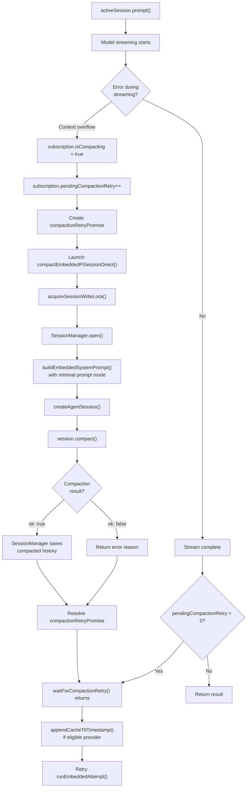
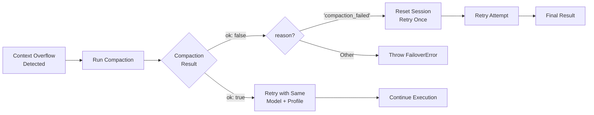
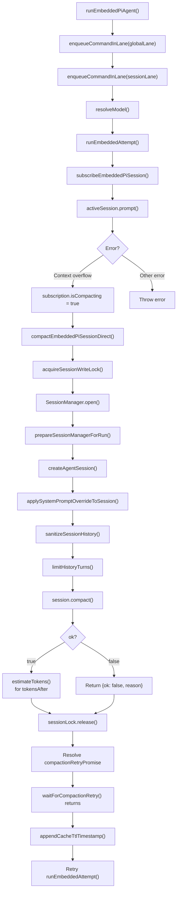

# Page: Context Overflow and Auto-Compaction

# Context Overflow and Auto-Compaction

<details>
<summary>Relevant source files</summary>

The following files were used as context for generating this wiki page:

- [docs/concepts/system-prompt.md](docs/concepts/system-prompt.md)
- [docs/gateway/cli-backends.md](docs/gateway/cli-backends.md)
- [docs/reference/token-use.md](docs/reference/token-use.md)
- [src/agents/auth-profiles/oauth.fallback-to-main-agent.test.ts](src/agents/auth-profiles/oauth.fallback-to-main-agent.test.ts)
- [src/agents/auth-profiles/oauth.ts](src/agents/auth-profiles/oauth.ts)
- [src/agents/cli-backends.ts](src/agents/cli-backends.ts)
- [src/agents/cli-runner.test.ts](src/agents/cli-runner.test.ts)
- [src/agents/cli-runner.ts](src/agents/cli-runner.ts)
- [src/agents/cli-runner/helpers.ts](src/agents/cli-runner/helpers.ts)
- [src/agents/pi-embedded-runner/compact.ts](src/agents/pi-embedded-runner/compact.ts)
- [src/agents/pi-embedded-runner/run/attempt.ts](src/agents/pi-embedded-runner/run/attempt.ts)
- [src/agents/pi-embedded-runner/system-prompt.ts](src/agents/pi-embedded-runner/system-prompt.ts)
- [src/agents/system-prompt-params.ts](src/agents/system-prompt-params.ts)
- [src/agents/system-prompt-report.ts](src/agents/system-prompt-report.ts)
- [src/agents/system-prompt.test.ts](src/agents/system-prompt.test.ts)
- [src/agents/system-prompt.ts](src/agents/system-prompt.ts)
- [src/auto-reply/reply/agent-runner.heartbeat-typing.runreplyagent-typing-heartbeat.retries-after-compaction-failure-by-resetting-session.test.ts](src/auto-reply/reply/agent-runner.heartbeat-typing.runreplyagent-typing-heartbeat.retries-after-compaction-failure-by-resetting-session.test.ts)
- [src/auto-reply/reply/commands-context-report.ts](src/auto-reply/reply/commands-context-report.ts)
- [src/gateway/gateway-cli-backend.live.test.ts](src/gateway/gateway-cli-backend.live.test.ts)
- [src/telegram/group-migration.test.ts](src/telegram/group-migration.test.ts)
- [src/telegram/group-migration.ts](src/telegram/group-migration.ts)

</details>


## Purpose and Scope

This page describes how OpenClaw detects and handles context window overflow situations, where the accumulated conversation history exceeds the model's token limit. It covers the auto-compaction mechanism, retry logic, and session reset fallbacks that ensure agent runs can continue even when context limits are reached.

For information about session history management and persistence, see [Session Management](#5.3). For model selection and general failover behavior, see [Model Selection and Failover](#5.4).

## Context Window Management

Each AI model has a **context window** that defines the maximum number of tokens it can process in a single request. This window must accommodate:

- System prompt
- Tool definitions
- Conversation history
- Current user message
- Reserve tokens for the model's response

OpenClaw tracks context window usage and validates that requests stay within limits before sending them to the model provider.

### Context Window Information

The context window for each model is resolved from multiple sources (in order of precedence):

1. Per-session override (`session.model.contextWindow`)
2. Agent-level override (`agents.list[].model.contextWindow`)
3. Global override (`agents.defaults.model.contextWindow`)
4. Model registry definition (`models.json`)

**Sources:** [src/agents/context-window-guard.ts:14-53]()

### Reserve Tokens

OpenClaw reserves a buffer of tokens to ensure the model has space to generate its response. The reserve amount is configurable and varies by model capabilities:

| Configuration | Default Value | Purpose |
|--------------|---------------|---------|
| `agents.defaults.compaction.reserveTokens` | 4096 | Token buffer for model output |
| Minimum floor | 512 | Hard minimum reserve |

Reserve tokens are subtracted from the available context window when calculating whether a request will fit.

**Sources:** [src/agents/pi-settings.ts:1-50](), [src/agents/context-window-guard.ts:14-53]()

### Context Overflow Detection

When a model provider returns an error indicating the context window was exceeded, OpenClaw detects this through error message pattern matching:

```typescript
// Common overflow patterns (case-insensitive)
- "context window"
- "context length"
- "maximum context"
- "token limit"
- "too many tokens"
```

The detection logic classifies errors as context overflow to trigger auto-compaction rather than treating them as generic failures.

**Sources:** [src/agents/pi-embedded-helpers/errors.ts:1-100]()

## Auto-Compaction Process

**Auto-compaction** is an automatic mechanism that summarizes older conversation history to reduce token usage when context overflow is detected. Instead of failing the request, OpenClaw:

1. Detects context overflow error
2. Triggers compaction on the session
3. Retries the original request with the compacted history

### Compaction Flow

Compaction is triggered when a model provider returns a context overflow error. The flow involves coordination between the agent runtime and the session subscription system:



**Sources:** [src/agents/pi-embedded-runner/run/attempt.ts:832-863](), [src/agents/pi-embedded-runner/compact.ts:116-490](), [src/agents/pi-embedded-subscribe.ts:186-224]()
</thinking>

The subscription system (`subscribeEmbeddedPiSession`) maintains compaction state to prevent race conditions when multiple turns trigger overflow simultaneously. The `waitForCompactionRetry()` function blocks until an in-flight compaction completes, then allows the retry to proceed.

**Sources:** [src/agents/pi-embedded-subscribe.ts:62-224](), [src/agents/pi-embedded-runner/run/attempt.ts:832-863]()

### Compaction Implementation

Compaction invokes `session.compact()` from the `@mariozechner/pi-coding-agent` SDK, which uses the model to summarize conversation history. The OpenClaw wrapper (`compactEmbeddedPiSessionDirect`) provides:

1. **Session Lock Acquisition**: `acquireSessionWriteLock()` prevents concurrent modifications
2. **Workspace and Sandbox Setup**: Resolves workspace directory, applies skill environment overrides
3. **Tool Creation**: Builds the same tool set as normal runs (via `createOpenClawCodingTools`)
4. **System Prompt**: Calls `buildEmbeddedSystemPrompt()` with `promptMode: "minimal"` for subagents, `"full"` for main sessions
5. **Agent Session Creation**: Uses `createAgentSession()` with the model, tools, and session manager
6. **Compaction Invocation**: `await session.compact(customInstructions)`
7. **Token Estimation**: After compaction, estimates `tokensAfter` by summing `estimateTokens()` for remaining messages

The SDK's compaction logic:
- Preserves factual information and decisions
- Maintains chronological order
- Condenses redundant exchanges
- Retains tool usage outcomes
- Typical reduction: 50-70% of original token count

The `compactEmbeddedPiSessionDirect()` function handles the full compaction flow without lane queueing (to avoid deadlocks when already inside a session lane). A wrapper `compactEmbeddedPiSession()` adds lane queueing for external calls.

**Sources:** [src/agents/pi-embedded-runner/compact.ts:116-490](), [src/agents/session-write-lock.ts:1-100](), [src/agents/pi-embedded-runner/system-prompt.ts:11-78]()

### Compaction State Management and Cache TTL

The subscription system (`subscribeEmbeddedPiSession`) tracks compaction state to prevent concurrent compaction attempts:

```typescript
// State tracked in subscription closure
isCompacting: () => boolean          // Returns compactionInFlight
compactionInFlight: boolean          // Active compaction flag
pendingCompactionRetry: number       // Queued retry count
compactionRetryResolve?: () => void  // Promise resolver
compactionRetryPromise: Promise<void> | null
```

When a context overflow occurs during an active compaction, the system:
1. Increments `pendingCompactionRetry`
2. Creates a new `compactionRetryPromise` if none exists
3. Blocks in `waitForCompactionRetry()` until the promise resolves
4. The active compaction resolves the promise when complete
5. Queued retries proceed after the resolution

After compaction completes successfully, OpenClaw appends a cache TTL timestamp to the session if the provider is eligible for prompt caching:

```typescript
// Post-compaction cache TTL tracking
if (isCacheTtlEligibleProvider(provider)) {
  appendCacheTtlTimestamp({
    sessionManager,
    provider,
    modelId,
    cfg: params.config,
  });
}
```

This tracks when the cache window was established, enabling cache-aware pruning strategies (see [Session Pruning](#) for details).

**Sources:** [src/agents/pi-embedded-subscribe.ts:62-224](), [src/agents/pi-embedded-runner/run/attempt.ts:844-863](), [src/agents/pi-embedded-runner/cache-ttl.ts:1-100]()

## Retry and Failover Logic

### Retry After Compaction

After successful compaction, OpenClaw automatically retries the original request:



**Sources:** [src/agents/pi-embedded-runner/run.ts:276-364]()

### Retry Limits

OpenClaw imposes strict limits on compaction retries to prevent infinite loops:

| Retry Type | Limit | Behavior |
|------------|-------|----------|
| Compaction retries | 1 | Single retry after compaction |
| Session reset retries | 1 | One attempt after session reset |
| Thinking level fallback | 1 | Retry with reduced thinking level |

After exhausting retries, the error is propagated to the caller (typically resulting in a user-facing error message).

**Sources:** [src/agents/pi-embedded-runner/run.ts:276-364]()

### Session Reset Fallback

If compaction itself fails (e.g., the compaction request also hits context limits, or the model returns an error), OpenClaw performs a **session reset**. This logic is handled in `runReplyAgent()`, not in the compaction function itself:

1. Detect `meta.error.kind === "context_overflow"` in the returned payload
2. Detect compaction failure pattern in error message: `"Context overflow: Summarization failed"`
3. Generate a new session ID to replace the current session
4. Update session store with the new ID
5. Retry with empty history

This is a last-resort mechanism that sacrifices conversation context to ensure the agent can continue functioning. The session reset response includes a user-facing message:

```
Context limit exceeded during compaction. Session has been reset.
```

The reset is persisted immediately to the session store JSON file to prevent the old session ID from being reused.

**Sources:** [src/auto-reply/reply/agent-runner.ts:400-500](), [src/auto-reply/reply/agent-runner.heartbeat-typing.runreplyagent-typing-heartbeat.retries-after-compaction-failure-by-resetting-session.test.ts:128-175]()

### Thinking Level Fallback

In addition to compaction, OpenClaw may reduce the **thinking level** to save tokens:

- If `thinkLevel="on"` and overflow occurs, fallback to `thinkLevel="off"`
- This removes reasoning/thinking tags from the prompt, reducing token usage
- Only attempted once per run

**Sources:** [src/agents/pi-embedded-helpers/thinking.ts:1-50](), [src/agents/pi-embedded-runner/run.ts:276-364]()

## Configuration

### Reserve Token Settings

Reserve tokens are configured via `agents.defaults.compactionReserveTokens` (not nested under a `compaction` object):

```json5
{
  agents: {
    defaults: {
      compactionReserveTokens: 4096  // Token buffer for output
    }
  }
}
```

The `ensurePiCompactionReserveTokens()` function applies this setting to the SDK's `SettingsManager`:

```typescript
ensurePiCompactionReserveTokens({
  settingsManager,
  minReserveTokens: resolveCompactionReserveTokensFloor(config)
});
```

The minimum floor is 512 tokens, enforced by `resolveCompactionReserveTokensFloor()`.

Per-agent override is not currently supported; the reserve tokens setting is global.

**Sources:** [src/agents/pi-settings.ts:1-50](), [src/agents/pi-embedded-runner/run/attempt.ts:443-447](), [src/agents/pi-embedded-runner/compact.ts:384-388]()

### Context Window Overrides

Override the context window size for specific models:

```json5
{
  agents: {
    defaults: {
      model: {
        contextWindow: 128000  // Global override
      }
    },
    list: [
      {
        id: "assistant",
        model: {
          contextWindow: 200000  // Agent-specific override
        }
      }
    ]
  }
}
```

**Sources:** [src/agents/context-window-guard.ts:14-53]()

## Error Handling and Diagnostics

### Context Overflow Error Messages

When context overflow cannot be resolved through compaction, OpenClaw returns detailed error messages:

```
Context window exceeded and compaction failed.
Model: anthropic/claude-3-5-sonnet-20241022
Context window: 200000 tokens
Reserve tokens: 4096
Session: agent:main:telegram:dm:123456789
```

These messages help diagnose configuration issues or identify sessions with excessive history.

**Sources:** [src/agents/pi-embedded-helpers/errors.ts:1-100]()

### Compaction Failure Reasons

The `EmbeddedPiCompactResult` includes a `reason` field explaining why compaction failed:

| Reason | Description |
|--------|-------------|
| `"Unknown model"` | Model not found in registry |
| `"No API key"` | Authentication missing |
| `"compaction_failed"` | Model returned error during summarization |
| Error message | Specific error from provider |

**Sources:** [src/agents/pi-embedded-runner/types.ts:1-50](), [src/agents/pi-embedded-runner/compact.ts:114-415]()

## Implementation Details

### Key Functions and Call Chain

The following diagram maps the function call chain from agent invocation through compaction to retry:



**Sources:** [src/agents/pi-embedded-runner/run.ts:73-281](), [src/agents/pi-embedded-runner/run/attempt.ts:142-1095](), [src/agents/pi-embedded-runner/compact.ts:116-490](), [src/agents/pi-embedded-subscribe.ts:62-224]()

### Session Manager Locking

Compaction acquires a write lock on the session file to prevent concurrent modifications:

```typescript
const sessionLock = await acquireSessionWriteLock({
  sessionFile: params.sessionFile
});

try {
  // Perform compaction
  const sessionManager = SessionManager.open(params.sessionFile);
  // ... compaction logic
} finally {
  await sessionLock.release();
}
```

This ensures that compaction and concurrent agent runs don't corrupt session state.

**Sources:** [src/agents/session-write-lock.ts:1-100](), [src/agents/pi-embedded-runner/compact.ts:114-415]()

### History Limiting and Validation

Before compaction (and before every agent run), OpenClaw applies history sanitization, validation, and limiting:

1. **Sanitization**: `sanitizeSessionHistory()` removes invalid message structures based on the model API (Anthropic vs Gemini)
2. **Validation**: 
   - `validateGeminiTurns()` ensures alternating user/model turns for Gemini
   - `validateAnthropicTurns()` ensures proper turn structure for Anthropic
3. **Limiting**: `limitHistoryTurns()` applies DM-specific history limits:
   ```typescript
   const dmLimit = getDmHistoryLimitFromSessionKey(sessionKey, config);
   const truncated = limitHistoryTurns(validated, dmLimit);
   ```
4. **Tool Result Pairing**: `sanitizeToolUseResultPairing()` repairs orphaned tool_result blocks after truncation

The `TranscriptPolicy` (resolved per model API) controls which validation steps apply:

```typescript
const transcriptPolicy = resolveTranscriptPolicy({
  modelApi: model.api,
  provider,
  modelId,
});
// Policy flags:
// - allowSyntheticToolResults
// - validateGeminiTurns
// - validateAnthropicTurns
// - repairToolUseResultPairing
// - normalizeAntigravityThinkingBlocks
```

This pre-filtering reduces token usage before compaction and ensures messages conform to provider requirements.

**Sources:** [src/agents/pi-embedded-runner/history.ts:1-100](), [src/agents/pi-embedded-runner/run/attempt.ts:545-580](), [src/agents/pi-embedded-runner/compact.ts:417-442](), [src/agents/transcript-policy.ts:1-100]()

## Testing and Validation

OpenClaw includes comprehensive tests for context overflow and compaction scenarios:

- **Mock overflow errors**: Simulate context overflow responses from providers
- **Compaction retry verification**: Ensure retry logic executes after compaction
- **Session reset validation**: Verify session is cleared when compaction fails
- **Concurrent compaction handling**: Test that multiple overflows queue properly

**Sources:** [src/agents/pi-embedded-runner.test.ts:1-450](), [src/agents/pi-embedded-runner/run.overflow-compaction.test.ts:1-500](), [src/auto-reply/reply/agent-runner.heartbeat-typing.runreplyagent-typing-heartbeat.retries-after-compaction-failure-by-resetting-session.test.ts:1-400]()

---