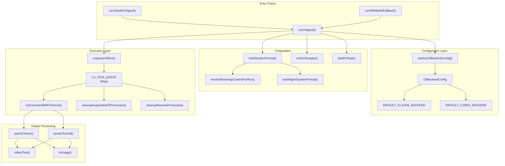
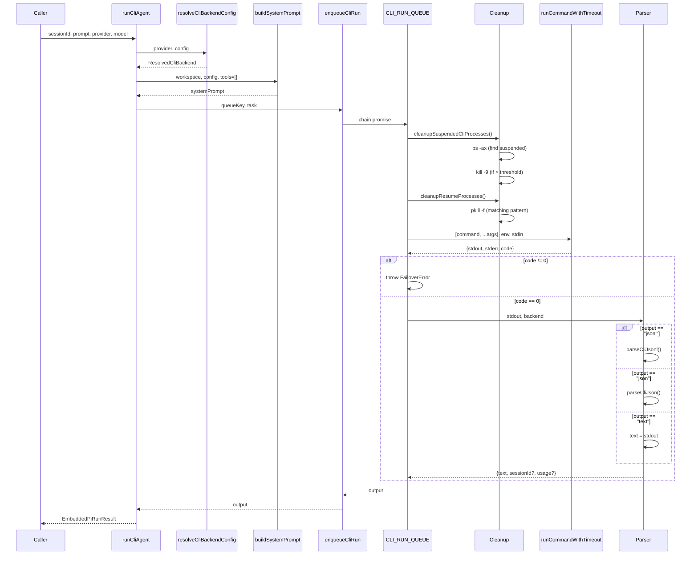
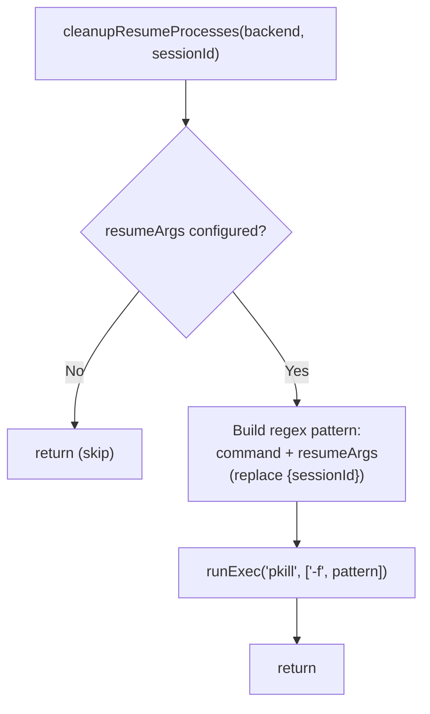
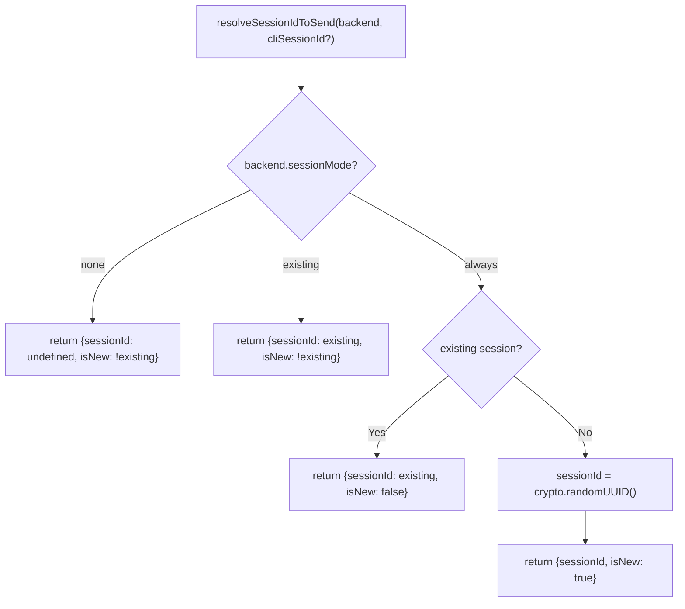
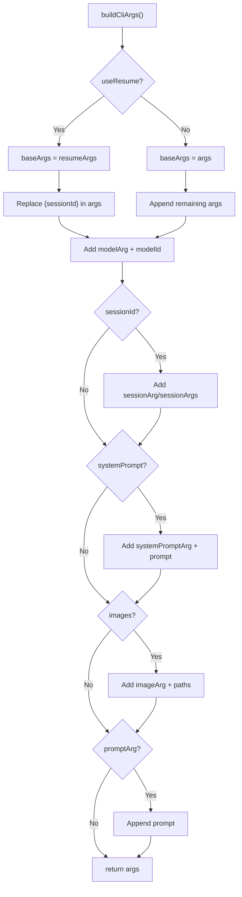
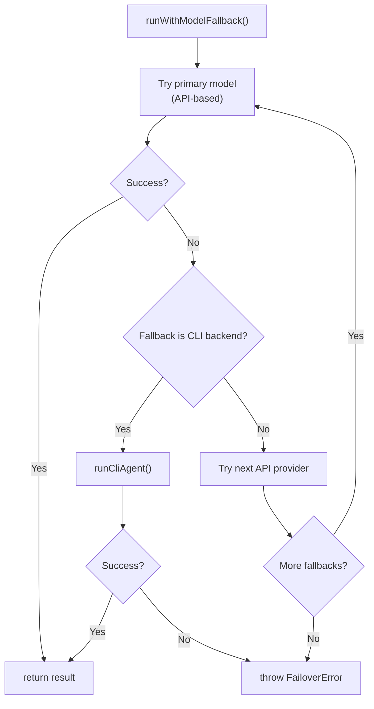

# Page: CLI Backend Execution

# CLI Backend Execution

<details>
<summary>Relevant source files</summary>

The following files were used as context for generating this wiki page:

- [docs/concepts/system-prompt.md](docs/concepts/system-prompt.md)
- [docs/gateway/cli-backends.md](docs/gateway/cli-backends.md)
- [docs/reference/token-use.md](docs/reference/token-use.md)
- [src/agents/auth-profiles/oauth.fallback-to-main-agent.test.ts](src/agents/auth-profiles/oauth.fallback-to-main-agent.test.ts)
- [src/agents/auth-profiles/oauth.ts](src/agents/auth-profiles/oauth.ts)
- [src/agents/cli-backends.ts](src/agents/cli-backends.ts)
- [src/agents/cli-runner.test.ts](src/agents/cli-runner.test.ts)
- [src/agents/cli-runner.ts](src/agents/cli-runner.ts)
- [src/agents/cli-runner/helpers.ts](src/agents/cli-runner/helpers.ts)
- [src/agents/pi-embedded-runner/compact.ts](src/agents/pi-embedded-runner/compact.ts)
- [src/agents/pi-embedded-runner/run/attempt.ts](src/agents/pi-embedded-runner/run/attempt.ts)
- [src/agents/pi-embedded-runner/system-prompt.ts](src/agents/pi-embedded-runner/system-prompt.ts)
- [src/agents/system-prompt-params.ts](src/agents/system-prompt-params.ts)
- [src/agents/system-prompt-report.ts](src/agents/system-prompt-report.ts)
- [src/agents/system-prompt.test.ts](src/agents/system-prompt.test.ts)
- [src/agents/system-prompt.ts](src/agents/system-prompt.ts)
- [src/auto-reply/reply/agent-runner.heartbeat-typing.runreplyagent-typing-heartbeat.retries-after-compaction-failure-by-resetting-session.test.ts](src/auto-reply/reply/agent-runner.heartbeat-typing.runreplyagent-typing-heartbeat.retries-after-compaction-failure-by-resetting-session.test.ts)
- [src/auto-reply/reply/commands-context-report.ts](src/auto-reply/reply/commands-context-report.ts)
- [src/gateway/gateway-cli-backend.live.test.ts](src/gateway/gateway-cli-backend.live.test.ts)
- [src/telegram/group-migration.test.ts](src/telegram/group-migration.test.ts)
- [src/telegram/group-migration.ts](src/telegram/group-migration.ts)

</details>


This document describes OpenClaw's **CLI backend system**, which enables text-only agent execution through local AI command-line tools. CLI backends serve as fallback runtimes when API providers are unavailable and can also be invoked directly for tool-free interactions.

For the main embedded agent execution pipeline (API-based, tool-enabled), see [Agent Execution Flow](#5.1). For model selection and failover between providers, see [Model Selection and Failover](#5.4).

## Purpose and Scope

CLI backends provide a **text-only execution path** that:

- **Disables tools** (no OpenClaw tool calls reach the CLI)
- **Supports sessions** (conversation continuity across turns)
- **Handles images** (via path injection or CLI image arguments)
- **Parses structured output** (JSON/JSONL when available)
- **Acts as failover** (automatically invoked when primary models fail)

The system is designed for reliability over feature completeness. It guarantees a working text path even when all API providers are down.

## CLI Backend Architecture

The CLI backend system consists of configuration resolution, execution queueing, and output parsing layers.

### System Component Map



**Sources:** [src/agents/cli-runner.ts:1-363](), [src/agents/cli-runner/helpers.ts:1-489](), [src/agents/cli-backends.ts:1-158]()

## Configuration System

CLI backends are configured under `agents.defaults.cliBackends`. Each backend is keyed by a **provider ID** (e.g., `claude-cli`, `codex-cli`, `my-cli`), which becomes the left side of model references: `<provider>/<model>`.

### CliBackendConfig Structure

The `CliBackendConfig` type defines all execution parameters:

| Field | Type | Purpose |
|-------|------|---------|
| `command` | `string` | Executable path (required) |
| `args` | `string[]` | Default CLI arguments |
| `resumeArgs` | `string[]` | Arguments for session resume (replaces `args`) |
| `output` | `"json" \| "jsonl" \| "text"` | Output format parser |
| `resumeOutput` | `"json" \| "jsonl" \| "text"` | Output format for resume |
| `input` | `"arg" \| "stdin"` | How to pass the prompt |
| `modelArg` | `string` | Flag for model selection |
| `modelAliases` | `Record<string, string>` | Model name mapping |
| `sessionArg` | `string` | Flag for session ID (single arg) |
| `sessionArgs` | `string[]` | Session ID template with `{sessionId}` |
| `sessionMode` | `"always" \| "existing" \| "none"` | When to send session IDs |
| `sessionIdFields` | `string[]` | JSON fields to extract session ID from |
| `systemPromptArg` | `string` | Flag for system prompt |
| `systemPromptMode` | `"append" \| "replace"` | How to apply system prompt |
| `systemPromptWhen` | `"always" \| "first" \| "never"` | When to send system prompt |
| `imageArg` | `string` | Flag for image paths |
| `imageMode` | `"list" \| "repeat"` | How to pass multiple images |
| `maxPromptArgChars` | `number` | Threshold to switch to stdin |
| `env` | `Record<string, string>` | Environment variables to set |
| `clearEnv` | `string[]` | Environment variables to unset |
| `serialize` | `boolean` | Whether to queue runs serially |

**Sources:** [src/config/types.ts](), [src/agents/cli-backends.ts:1-158]()

### Built-in Backend Defaults

OpenClaw ships with two built-in backends:

#### claude-cli

```typescript
DEFAULT_CLAUDE_BACKEND = {
  command: "claude",
  args: ["-p", "--output-format", "json", "--dangerously-skip-permissions"],
  resumeArgs: ["-p", "--output-format", "json", 
               "--dangerously-skip-permissions", "--resume", "{sessionId}"],
  output: "json",
  modelArg: "--model",
  sessionArg: "--session-id",
  sessionMode: "always",
  systemPromptArg: "--append-system-prompt",
  systemPromptWhen: "first",
  clearEnv: ["ANTHROPIC_API_KEY", "ANTHROPIC_API_KEY_OLD"],
  serialize: true
}
```

#### codex-cli

```typescript
DEFAULT_CODEX_BACKEND = {
  command: "codex",
  args: ["exec", "--json", "--color", "never", 
         "--sandbox", "read-only", "--skip-git-repo-check"],
  resumeArgs: ["exec", "resume", "{sessionId}", "--color", "never", 
               "--sandbox", "read-only", "--skip-git-repo-check"],
  output: "jsonl",
  resumeOutput: "text",
  modelArg: "--model",
  sessionMode: "existing",
  imageArg: "--image",
  imageMode: "repeat",
  serialize: true
}
```

**Sources:** [src/agents/cli-backends.ts:10-77]()

### Configuration Resolution

The `resolveCliBackendConfig` function merges user overrides with built-in defaults:

```mermaid
flowchart TD
    Start["resolveCliBackendConfig(provider, cfg)"] --> Normalize["normalizeBackendKey(provider)"]
    Normalize --> IsClaudeCli{provider == 'claude-cli'?}
    
    IsClaudeCli -->|Yes| MergeClaudeDefaults["mergeBackendConfig(<br/>DEFAULT_CLAUDE_BACKEND,<br/>cfg.agents.defaults.cliBackends['claude-cli'])"]
    IsClaudeCli -->|No| IsCodexCli{provider == 'codex-cli'?}
    
    IsCodexCli -->|Yes| MergeCodexDefaults["mergeBackendConfig(<br/>DEFAULT_CODEX_BACKEND,<br/>cfg.agents.defaults.cliBackends['codex-cli'])"]
    IsCodexCli -->|No| CheckCustom{Custom backend<br/>configured?}
    
    CheckCustom -->|Yes| UseCustom["Use cfg.agents.defaults.cliBackends[provider]"]
    CheckCustom -->|No| ReturnNull["return null"]
    
    MergeClaudeDefaults --> ValidateCommand{command.trim()?}
    MergeCodexDefaults --> ValidateCommand
    UseCustom --> ValidateCommand
    
    ValidateCommand -->|Valid| Return["return {id, config}"]
    ValidateCommand -->|Empty| ReturnNull
    
    Return --> End[/"ResolvedCliBackend"/]
    ReturnNull --> End
```

**Sources:** [src/agents/cli-backends.ts:79-158](), [src/agents/cli-runner.ts:72-76]()

## Execution Pipeline

The execution pipeline runs through queueing, cleanup, command building, execution, and output parsing phases.

### High-Level Execution Flow



**Sources:** [src/agents/cli-runner.ts:35-324](), [src/agents/cli-runner/helpers.ts:152-162]()

### Queue Serialization

The `CLI_RUN_QUEUE` ensures serial execution when `serialize: true`:

```typescript
// src/agents/cli-runner/helpers.ts:19
const CLI_RUN_QUEUE = new Map<string, Promise<unknown>>();

export function enqueueCliRun<T>(key: string, task: () => Promise<T>): Promise<T> {
  const prior = CLI_RUN_QUEUE.get(key) ?? Promise.resolve();
  const chained = prior.catch(() => undefined).then(task);
  const tracked = chained.finally(() => {
    if (CLI_RUN_QUEUE.get(key) === tracked) {
      CLI_RUN_QUEUE.delete(key);
    }
  });
  CLI_RUN_QUEUE.set(key, tracked);
  return chained;
}
```

Each backend provider gets its own queue key (e.g., `claude-cli`, `codex-cli`), preventing concurrent runs from interfering with CLI session state.

**Sources:** [src/agents/cli-runner/helpers.ts:19-162](), [src/agents/cli-runner.ts:178-179]()

### Process Cleanup

Before execution, two cleanup phases run:

#### Suspended Process Cleanup

`cleanupSuspendedCliProcesses` removes stopped (state `T`) CLI processes when the count exceeds a threshold (default: 10):

```mermaid
flowchart TD
    Start["cleanupSuspendedCliProcesses(backend, threshold=10)"] --> BuildMatchers["buildSessionMatchers(backend)"]
    BuildMatchers --> HasMatchers{matchers.length > 0?}
    HasMatchers -->|No| Skip["return (skip)"]
    HasMatchers -->|Yes| RunPs["runExec('ps', ['-ax', '-o', 'pid=,stat=,command='])"]
    
    RunPs --> ParseLines["For each ps line:"]
    ParseLines --> ExtractPid["extract pid, stat, command"]
    ExtractPid --> CheckSuspended{stat.includes('T')?}
    CheckSuspended -->|Yes| MatchCommand{matcher.test(command)?}
    CheckSuspended -->|No| NextLine
    MatchCommand -->|Yes| AddToList["suspended.push(pid)"]
    MatchCommand -->|No| NextLine
    AddToList --> NextLine["next line"]
    
    NextLine --> CheckThreshold{suspended.length > threshold?}
    CheckThreshold -->|Yes| Kill["runExec('kill', ['-9', ...pids])"]
    CheckThreshold -->|No| Done["return"]
    Kill --> Done
```

**Sources:** [src/agents/cli-runner/helpers.ts:105-151]()

#### Resume Process Cleanup

`cleanupResumeProcesses` kills stale resume processes for a specific session ID:



**Sources:** [src/agents/cli-runner/helpers.ts:21-54]()

## System Prompt Construction

CLI backends reuse OpenClaw's system prompt builder but inject a tool-disabled notice:

```typescript
// src/agents/cli-runner.ts:81-86
const extraSystemPrompt = [
  params.extraSystemPrompt?.trim(),
  "Tools are disabled in this session. Do not call tools.",
]
  .filter(Boolean)
  .join("\n");
```

The system prompt includes:

- **Bootstrap context** (AGENTS.md, SOUL.md, IDENTITY.md, etc.)
- **Runtime info** (host, OS, model display name, shell)
- **Time and timezone** (when configured)
- **Heartbeat instructions** (for the default agent only)
- **Documentation paths** (for OpenClaw self-reference)
- **Tool-disabled notice** (appended to extraSystemPrompt)

Note that `tools: []` is passed to `buildSystemPrompt`, so the tooling section is minimal or omitted.

**Sources:** [src/agents/cli-runner.ts:81-122](), [src/agents/cli-runner/helpers.ts:197-249]()

## Session Management

CLI backends support session continuity when the CLI provides session IDs:

### Session ID Resolution



**Sources:** [src/agents/cli-runner/helpers.ts:421-437]()

### Session Argument Injection

Sessions are passed to CLIs through one of three mechanisms:

1. **sessionArg**: Single flag + value (e.g., `--session-id <uuid>`)
2. **sessionArgs**: Template array with `{sessionId}` placeholder
3. **resumeArgs**: Alternate args for resuming (e.g., `resume {sessionId}`)

The `buildCliArgs` function constructs the final argument list:



**Sources:** [src/agents/cli-runner.ts:166-175](), [src/agents/cli-runner/helpers.ts]()

### Session ID Extraction

After execution, `parseCliJson` and `parseCliJsonl` extract session IDs from output using `sessionIdFields`:

```typescript
// src/agents/cli-runner/helpers.ts:311-328
function pickSessionId(
  parsed: Record<string, unknown>,
  backend: CliBackendConfig,
): string | undefined {
  const fields = backend.sessionIdFields ?? [
    "session_id",
    "sessionId",
    "conversation_id",
    "conversationId",
  ];
  for (const field of fields) {
    const value = parsed[field];
    if (typeof value === "string" && value.trim()) {
      return value.trim();
    }
  }
  return undefined;
}
```

**Sources:** [src/agents/cli-runner/helpers.ts:311-397]()

## Output Parsing

CLI output is parsed based on the `output` mode:

### JSON Parsing

`parseCliJson` extracts text, session ID, and usage from structured output:

```mermaid
flowchart TD
    Start["parseCliJson(raw, backend)"] --> Trim["stdout.trim()"]
    Trim --> Parse["JSON.parse(trimmed)"]
    Parse --> IsRecord{isRecord(parsed)?}
    
    IsRecord -->|No| ReturnNull["return null"]
    IsRecord -->|Yes| PickSession["pickSessionId(parsed, backend)"]
    
    PickSession --> ParseUsage["toUsage(parsed.usage)"]
    ParseUsage --> CollectText["collectText(parsed):<br/>message | content | result | *"]
    
    CollectText --> Return["return {text, sessionId?, usage?}"]
```

The `collectText` function recursively extracts text from nested structures:

```typescript
// src/agents/cli-runner/helpers.ts:283-309
function collectText(value: unknown): string {
  if (typeof value === "string") return value;
  if (Array.isArray(value)) return value.map(collectText).join("");
  if (!isRecord(value)) return "";
  if (typeof value.text === "string") return value.text;
  if (typeof value.content === "string") return value.content;
  if (Array.isArray(value.content)) return value.content.map(collectText).join("");
  if (isRecord(value.message)) return collectText(value.message);
  return "";
}
```

**Sources:** [src/agents/cli-runner/helpers.ts:283-352]()

### JSONL Parsing

`parseCliJsonl` handles streaming JSONL output (Codex CLI `--json` mode):

```mermaid
flowchart TD
    Start["parseCliJsonl(raw, backend)"] --> Split["Split by newlines"]
    Split --> ForEach["For each non-empty line:"]
    
    ForEach --> ParseLine["JSON.parse(line)"]
    ParseLine --> IsRecord{isRecord(parsed)?}
    
    IsRecord -->|No| NextLine
    IsRecord -->|Yes| ExtractSession{sessionId extracted?}
    ExtractSession -->|No| TryPickSession["pickSessionId(parsed, backend)"]
    TryPickSession --> CheckThreadId{parsed.thread_id?}
    CheckThreadId -->|Yes| SetThreadId["sessionId = thread_id"]
    CheckThreadId -->|No| ExtractUsage
    ExtractSession -->|Yes| ExtractUsage{parsed.usage?}
    SetThreadId --> ExtractUsage
    
    ExtractUsage -->|Yes| MergeUsage["usage = toUsage(parsed.usage)"]
    ExtractUsage -->|No| CheckItem
    MergeUsage --> CheckItem{parsed.item?}
    
    CheckItem -->|Yes| ExtractItemText["if item.type ~ 'message':<br/>texts.push(item.text)"]
    CheckItem -->|No| NextLine["next line"]
    ExtractItemText --> NextLine
    
    NextLine --> Done{All lines processed?}
    Done -->|No| ForEach
    Done -->|Yes| Return["return {text: texts.join('\\n'), sessionId?, usage?}"]
```

**Sources:** [src/agents/cli-runner/helpers.ts:354-397]()

### Text Mode

When `output: "text"`, stdout is returned directly:

```typescript
// src/agents/cli-runner.ts:274-278
if (outputMode === "text") {
  return { text: stdout, sessionId: undefined };
}
```

**Sources:** [src/agents/cli-runner.ts:274-286]()

## Image Handling

CLI backends support image pass-through via two strategies:

### Image Arguments

When `imageArg` is configured, images are written to temp files and passed as CLI arguments:

```typescript
// src/agents/cli-runner.ts:148-155
if (params.images && params.images.length > 0) {
  const imagePayload = await writeCliImages(params.images);
  imagePaths = imagePayload.paths;
  cleanupImages = imagePayload.cleanup;
  if (!backend.imageArg) {
    prompt = appendImagePathsToPrompt(prompt, imagePaths);
  }
}
```

`writeCliImages` creates temp files in `/tmp/openclaw-cli-images-*`:

```typescript
// src/agents/cli-runner/helpers.ts:479-489
export async function writeCliImages(
  images: ImageContent[],
): Promise<{ paths: string[]; cleanup: () => Promise<void> }> {
  const tempDir = await fs.mkdtemp(path.join(os.tmpdir(), "openclaw-cli-images-"));
  const paths: string[] = [];
  for (let i = 0; i < images.length; i += 1) {
    const image = images[i];
    const ext = resolveImageExtension(image.mimeType);
    const filePath = path.join(tempDir, `image-${i + 1}.${ext}`);
    const buffer = Buffer.from(image.data, "base64");
    await fs.writeFile(filePath, buffer);
    paths.push(filePath);
  }
  return {
    paths,
    cleanup: async () => { await fs.rm(tempDir, { recursive: true }); }
  };
}
```

**Sources:** [src/agents/cli-runner.ts:146-155](), [src/agents/cli-runner/helpers.ts:453-489]()

### Path Injection

When `imageArg` is missing, image paths are appended to the prompt:

```typescript
// src/agents/cli-runner/helpers.ts:470-477
export function appendImagePathsToPrompt(prompt: string, paths: string[]): string {
  if (!paths.length) return prompt;
  const trimmed = prompt.trimEnd();
  const separator = trimmed ? "\n\n" : "";
  return `${trimmed}${separator}${paths.join("\n")}`;
}
```

This relies on CLIs that auto-load images from local paths in the prompt (Claude Code CLI behavior).

**Sources:** [src/agents/cli-runner/helpers.ts:470-477]()

## Usage Tracking

Token usage is extracted from CLI JSON output and normalized:

```typescript
// src/agents/cli-runner/helpers.ts:268-281
function toUsage(raw: Record<string, unknown>): CliUsage | undefined {
  const pick = (key: string) =>
    typeof raw[key] === "number" && raw[key] > 0 ? raw[key] : undefined;
  const input = pick("input_tokens") ?? pick("inputTokens");
  const output = pick("output_tokens") ?? pick("outputTokens");
  const cacheRead =
    pick("cache_read_input_tokens") ?? pick("cached_input_tokens") ?? pick("cacheRead");
  const cacheWrite = pick("cache_write_input_tokens") ?? pick("cacheWrite");
  const total = pick("total_tokens") ?? pick("total");
  if (!input && !output && !cacheRead && !cacheWrite && !total) {
    return undefined;
  }
  return { input, output, cacheRead, cacheWrite, total };
}
```

The normalized usage is returned in `EmbeddedPiRunResult.meta.agentMeta.usage`.

**Sources:** [src/agents/cli-runner/helpers.ts:164-281](), [src/agents/cli-runner.ts:290-301]()

## Failover Integration

CLI backends integrate with OpenClaw's failover system through `runWithModelFallback`:



When a CLI execution fails, the error is wrapped in `FailoverError`:

```typescript
// src/agents/cli-runner.ts:262-273
if (result.code !== 0) {
  const err = stderr || stdout || "CLI failed.";
  const reason = classifyFailoverReason(err) ?? "unknown";
  const status = resolveFailoverStatus(reason);
  throw new FailoverError(err, {
    reason,
    provider: params.provider,
    model: modelId,
    status,
  });
}
```

**Sources:** [src/agents/cli-runner.ts:262-316](), [src/agents/model-fallback.ts]()

## Limitations

CLI backends have intentional constraints:

| Limitation | Reason |
|------------|--------|
| **No OpenClaw tools** | CLI output is unstructured; tool calls cannot be parsed/executed |
| **No streaming** | CLI output is collected synchronously before parsing |
| **Text-only responses** | Rich content (buttons, reactions, embeds) not supported |
| **No session compaction** | CLI sessions cannot be compacted (no transcript access) |
| **Limited error handling** | CLI errors mapped to FailoverError; no fine-grained retry logic |
| **No background processes** | CLI runs are synchronous; no `bash` process registry |
| **Serial execution** | `serialize: true` prevents concurrent runs (CLI session integrity) |
| **Platform-specific** | Process cleanup (`ps`, `pkill`) disabled on Windows |

**Sources:** [docs/gateway/cli-backends.md:209-218](), [src/agents/cli-runner.ts:35-324]()

## Configuration Examples

### Minimal Override (Path Only)

```json
{
  "agents": {
    "defaults": {
      "cliBackends": {
        "claude-cli": {
          "command": "/opt/homebrew/bin/claude"
        }
      }
    }
  }
}
```

### Custom CLI Backend

```json
{
  "agents": {
    "defaults": {
      "cliBackends": {
        "my-cli": {
          "command": "/usr/local/bin/my-ai-cli",
          "args": ["--json", "--no-color"],
          "output": "json",
          "input": "stdin",
          "modelArg": "--model",
          "modelAliases": {
            "fast": "gpt-4o-mini",
            "smart": "gpt-4o"
          },
          "sessionArg": "--session",
          "sessionMode": "always",
          "systemPromptArg": "--system",
          "systemPromptWhen": "first",
          "serialize": true
        }
      }
    }
  }
}
```

### Fallback Chain with CLI

```json
{
  "agents": {
    "defaults": {
      "model": {
        "primary": "anthropic/claude-opus-4-6",
        "fallbacks": ["openai/gpt-4o", "claude-cli/opus-4.6"]
      },
      "models": {
        "anthropic/claude-opus-4-6": {},
        "openai/gpt-4o": {},
        "claude-cli/opus-4.6": {}
      }
    }
  }
}
```

**Sources:** [docs/gateway/cli-backends.md:23-132](), [src/agents/cli-backends.ts:79-158]()

---

**Page Sources:** [src/agents/cli-runner.ts:1-363](), [src/agents/cli-runner/helpers.ts:1-489](), [src/agents/cli-backends.ts:1-158](), [docs/gateway/cli-backends.md:1-226](), [src/agents/cli-runner.test.ts:1-223](), [src/gateway/gateway-cli-backend.live.test.ts:1-436]()

---