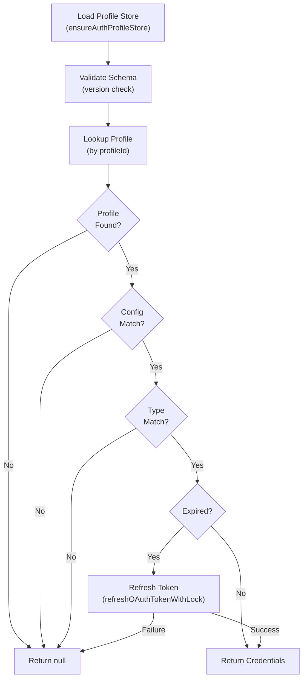
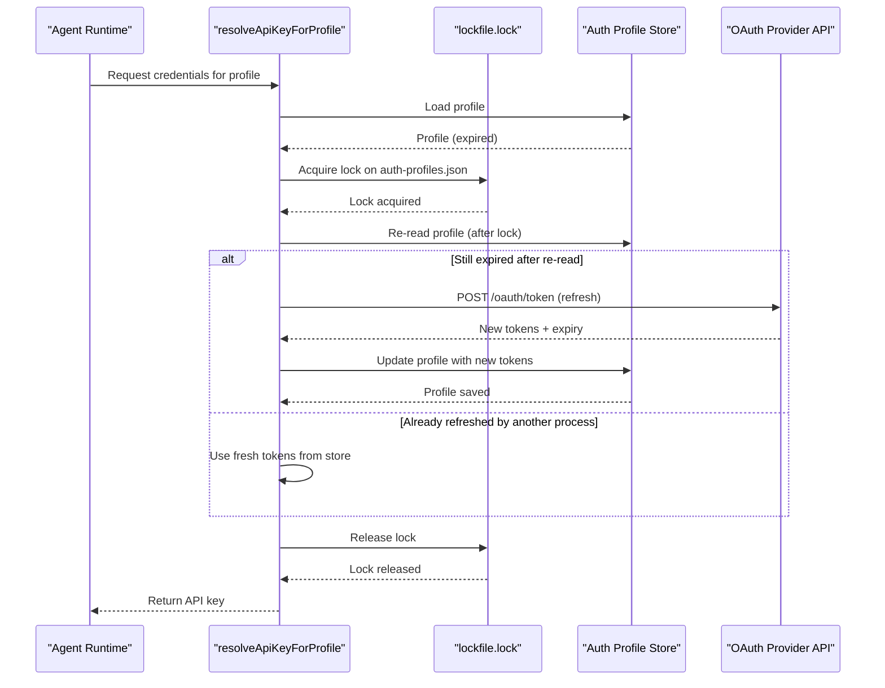
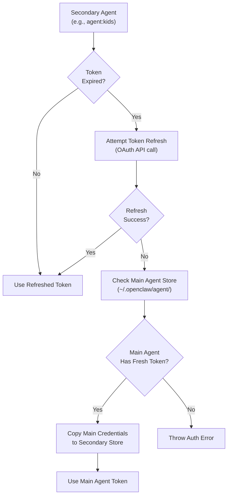
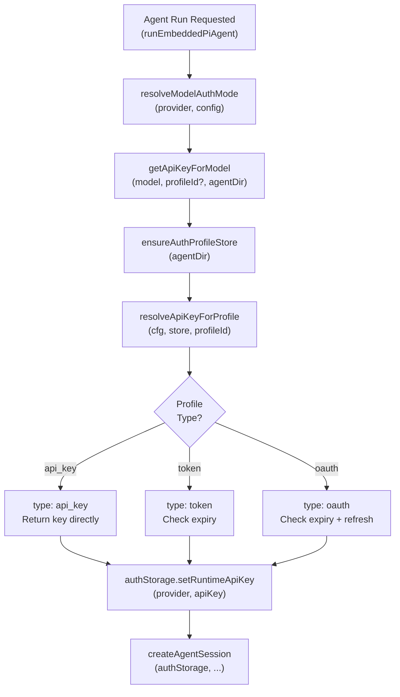

# Page: Authentication Profiles

# Authentication Profiles

<details>
<summary>Relevant source files</summary>

The following files were used as context for generating this wiki page:

- [docs/concepts/system-prompt.md](docs/concepts/system-prompt.md)
- [docs/gateway/cli-backends.md](docs/gateway/cli-backends.md)
- [docs/reference/token-use.md](docs/reference/token-use.md)
- [src/agents/auth-profiles/oauth.fallback-to-main-agent.test.ts](src/agents/auth-profiles/oauth.fallback-to-main-agent.test.ts)
- [src/agents/auth-profiles/oauth.ts](src/agents/auth-profiles/oauth.ts)
- [src/agents/cli-backends.ts](src/agents/cli-backends.ts)
- [src/agents/cli-runner.test.ts](src/agents/cli-runner.test.ts)
- [src/agents/cli-runner.ts](src/agents/cli-runner.ts)
- [src/agents/cli-runner/helpers.ts](src/agents/cli-runner/helpers.ts)
- [src/agents/pi-embedded-runner/compact.ts](src/agents/pi-embedded-runner/compact.ts)
- [src/agents/pi-embedded-runner/run/attempt.ts](src/agents/pi-embedded-runner/run/attempt.ts)
- [src/agents/pi-embedded-runner/system-prompt.ts](src/agents/pi-embedded-runner/system-prompt.ts)
- [src/agents/system-prompt-params.ts](src/agents/system-prompt-params.ts)
- [src/agents/system-prompt-report.ts](src/agents/system-prompt-report.ts)
- [src/agents/system-prompt.test.ts](src/agents/system-prompt.test.ts)
- [src/agents/system-prompt.ts](src/agents/system-prompt.ts)
- [src/auto-reply/reply/agent-runner.heartbeat-typing.runreplyagent-typing-heartbeat.retries-after-compaction-failure-by-resetting-session.test.ts](src/auto-reply/reply/agent-runner.heartbeat-typing.runreplyagent-typing-heartbeat.retries-after-compaction-failure-by-resetting-session.test.ts)
- [src/auto-reply/reply/commands-context-report.ts](src/auto-reply/reply/commands-context-report.ts)
- [src/gateway/gateway-cli-backend.live.test.ts](src/gateway/gateway-cli-backend.live.test.ts)
- [src/telegram/group-migration.test.ts](src/telegram/group-migration.test.ts)
- [src/telegram/group-migration.ts](src/telegram/group-migration.ts)

</details>


This document covers OpenClaw's authentication profile system, which manages API keys, OAuth tokens, and other credentials for AI model providers. Authentication profiles support automatic token refresh, multi-agent credential sharing, and provider-specific authentication modes.

For information about model selection and fallback chains, see [Model Selection and Failover](#5.4). For CLI backend configuration, see [CLI Backend Execution](#5.6).

---

## Overview

Authentication profiles decouple credentials from model configuration, enabling:

- **Multiple accounts per provider**: Run different sessions with different API keys or OAuth accounts
- **Automatic OAuth token refresh**: Tokens are refreshed transparently before expiry
- **Multi-agent credential inheritance**: Secondary agents can inherit credentials from the main agent
- **Provider-specific auth modes**: Different providers support different authentication methods (API key, OAuth, AWS SDK)

Profiles are stored in `~/.openclaw/agent/auth-profiles.json` for the main agent, or in per-agent directories (`~/.openclaw/agents/<agentId>/agent/auth-profiles.json`) for configured agents.

Sources: [src/agents/auth-profiles/oauth.ts:1-286]()

---

## Profile Types

OpenClaw supports three profile types:

| Type | Description | Use Case |
|------|-------------|----------|
| `api_key` | Static API key | Traditional provider API keys |
| `token` | Time-limited token | Short-lived access tokens |
| `oauth` | OAuth credentials | Anthropic OAuth, Google OAuth, etc. |

Each profile type has a different expiry and refresh behavior:

- **`api_key`**: Never expires, stored as-is
- **`token`**: Has optional `expires` timestamp; no automatic refresh
- **`oauth`**: Has `access`, `refresh`, and `expires` fields; supports automatic refresh

Sources: [src/agents/auth-profiles/oauth.ts:156-192]()

---

## Profile Store Structure

### Auth Profile Store File

```typescript
{
  "version": 1,
  "profiles": {
    "anthropic:claude-cli": {
      "type": "oauth",
      "provider": "anthropic",
      "access": "sk-ant-...",
      "refresh": "refresh-token-...",
      "expires": 1735689600000,
      "email": "user@example.com"
    },
    "openai:primary": {
      "type": "api_key",
      "provider": "openai",
      "key": "sk-proj-...",
      "email": "user@example.com"
    }
  }
}
```

**Profile Store Lifecycle**



Sources: [src/agents/auth-profiles/oauth.ts:149-285](), [src/agents/auth-profiles/oauth.fallback-to-main-agent.test.ts:53-127]()

---

## OAuth Token Refresh

### Refresh Flow with File Locking

OAuth tokens are refreshed automatically before expiry. To prevent race conditions in concurrent runs, OpenClaw uses file locking during refresh operations.



The locking mechanism prevents multiple processes from simultaneously refreshing the same token, which could lead to one process using invalidated credentials.

Sources: [src/agents/auth-profiles/oauth.ts:36-106]()

---

## Multi-Agent Credential Inheritance

When a secondary agent's OAuth token expires and refresh fails, OpenClaw attempts to inherit fresh credentials from the main agent. This enables credential sharing across agent configurations without manual duplication.

### Inheritance Flow



**Example Scenario:**

1. Main agent (`~/.openclaw/agent/`) has fresh Anthropic OAuth token (expires in 1 hour)
2. Kids agent (`~/.openclaw/agents/kids/agent/`) has expired token
3. Kids agent refresh fails (e.g., network error)
4. OpenClaw detects main agent has fresh token
5. Fresh token is copied to kids agent store
6. Kids agent continues with inherited credentials

Sources: [src/agents/auth-profiles/oauth.ts:247-269](), [src/agents/auth-profiles/oauth.fallback-to-main-agent.test.ts:53-127]()

---

## Configuration Integration

### Profile Definition in Config

Profiles can be declared in `openclaw.json` to enforce provider and mode constraints:

```json5
{
  "auth": {
    "profiles": {
      "anthropic:primary": {
        "provider": "anthropic",
        "mode": "oauth"
      },
      "openai:research": {
        "provider": "openai",
        "mode": "api_key"
      }
    }
  }
}
```

The config serves as validation: if a profile exists in the store but doesn't match the configured provider or mode, it is rejected.

Sources: [src/agents/auth-profiles/oauth.ts:119-125](), [src/agents/auth-profiles/oauth.ts:160-169]()

---

## Profile Resolution in Agent Runtime

### Automatic Profile Selection

When a model is invoked, OpenClaw resolves the authentication profile using:

1. **Explicit profile ID** (if provided via `authProfileId` parameter)
2. **Model-specific auth mode** (resolved via `resolveModelAuthMode`)
3. **Default profile for provider** (if configured)

### Profile Resolution Flow



Sources: [src/agents/pi-embedded-runner/run/attempt.ts:140-161](), [src/agents/pi-embedded-runner/run/attempt.ts:239](), [src/agents/pi-embedded-runner/run/attempt.ts:483-491]()

---

## Authentication Modes by Provider

Different providers support different authentication modes:

| Provider | Supported Modes | Notes |
|----------|----------------|-------|
| `anthropic` | `api_key`, `oauth` | OAuth via Anthropic Console |
| `openai` | `api_key`, `oauth` | OAuth via OpenAI platform |
| `google-gemini` | `api_key` | API key only |
| `google-gemini-cli` | `oauth` | OAuth with project ID |
| `google-antigravity` | `oauth` | OAuth with project ID |
| `github-copilot` | `token` | GitHub token → Copilot token exchange |
| `aws-bedrock` | `aws-sdk` | AWS SDK credentials |

**Special Handling:**

- **GitHub Copilot**: OpenClaw calls `resolveCopilotApiToken` to exchange GitHub token for Copilot token
- **Google Gemini CLI/Antigravity**: Requires OAuth token + `projectId` in API key JSON

Sources: [src/agents/pi-embedded-runner/run/attempt.ts:140-161](), [src/agents/auth-profiles/oauth.ts:26-34]()

---

## Manual Profile Override

You can specify a profile for a specific run:

```bash
# Use a specific profile for this run
openclaw agent --message "hello" --auth-profile "anthropic:research"
```

The `authProfileId` parameter is passed through the agent runtime and used during credential resolution.

Sources: [src/agents/pi-embedded-runner/run/attempt.ts:140-161](), [src/agents/pi-embedded-runner/compact.ts:78-168]()

---

## CLI Backend Integration

CLI backends (e.g., `claude-cli`, `codex-cli`) can also use authentication profiles. Since CLI backends execute external commands, they typically:

1. Clear environment variables (e.g., `ANTHROPIC_API_KEY`) to prevent accidental API key leakage
2. Pass credentials via CLI arguments or stdin
3. Rely on the CLI tool's own auth mechanism

The `clearEnv` field in CLI backend configuration specifies which environment variables to unset:

```json5
{
  "agents": {
    "defaults": {
      "cliBackends": {
        "claude-cli": {
          "clearEnv": ["ANTHROPIC_API_KEY", "ANTHROPIC_API_KEY_OLD"]
        }
      }
    }
  }
}
```

Sources: [src/agents/cli-backends.ts:51](), [src/agents/cli-runner.ts:221-228]()

---

## Doctor and Repair

The `openclaw doctor` command can detect and repair common authentication issues:

- **Expired tokens without refresh tokens**: Prompts for re-authentication
- **Profile/config mismatches**: Suggests profile ID corrections
- **Legacy default profiles**: Migrates to new profile ID format

The doctor uses `formatAuthDoctorHint` to provide actionable repair instructions.

Sources: [src/agents/auth-profiles/oauth.ts:272-283]()

---

## Summary Table: Profile Lifecycle Operations

| Operation | Function | File Locking | Fallback |
|-----------|----------|--------------|----------|
| Load profile | `ensureAuthProfileStore` | No | Creates empty store |
| Resolve credentials | `resolveApiKeyForProfile` | No | Returns null |
| Refresh OAuth token | `refreshOAuthTokenWithLock` | Yes (lockfile) | Inheritance from main |
| Save updated tokens | `saveAuthProfileStore` | No (atomic write) | N/A |
| Inherit from main | (internal fallback) | No | Throws auth error |

Sources: [src/agents/auth-profiles/oauth.ts:1-286](), [src/agents/auth-profiles/oauth.fallback-to-main-agent.test.ts:1-127]()

---