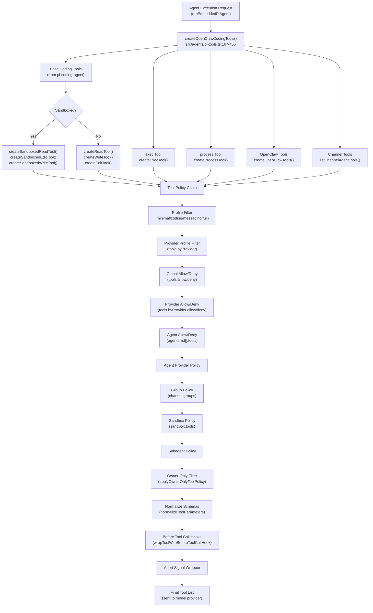
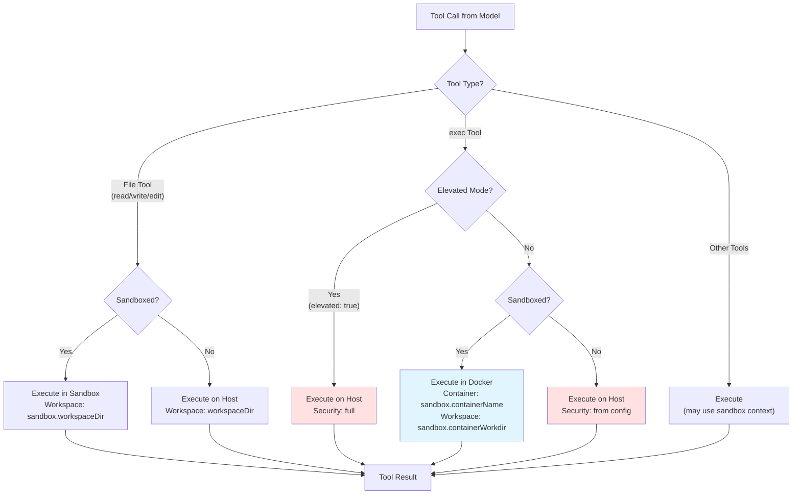
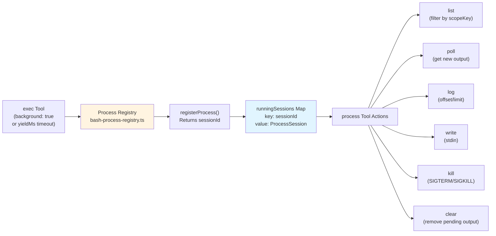
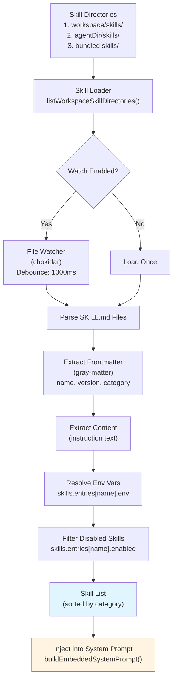

# Page: Tools and Skills

# Tools and Skills

<details>
<summary>Relevant source files</summary>

The following files were used as context for generating this wiki page:

- [CHANGELOG.md](CHANGELOG.md)
- [docs/cli/memory.md](docs/cli/memory.md)
- [docs/cli/sandbox.md](docs/cli/sandbox.md)
- [docs/concepts/memory.md](docs/concepts/memory.md)
- [docs/gateway/background-process.md](docs/gateway/background-process.md)
- [docs/gateway/configuration.md](docs/gateway/configuration.md)
- [docs/gateway/sandbox-vs-tool-policy-vs-elevated.md](docs/gateway/sandbox-vs-tool-policy-vs-elevated.md)
- [docs/gateway/sandboxing.md](docs/gateway/sandboxing.md)
- [docs/platforms/mac/skills.md](docs/platforms/mac/skills.md)
- [docs/tools/elevated.md](docs/tools/elevated.md)
- [docs/tools/index.md](docs/tools/index.md)
- [docs/tools/skills-config.md](docs/tools/skills-config.md)
- [src/agents/bash-process-registry.test.ts](src/agents/bash-process-registry.test.ts)
- [src/agents/bash-process-registry.ts](src/agents/bash-process-registry.ts)
- [src/agents/bash-tools.ts](src/agents/bash-tools.ts)
- [src/agents/memory-search.test.ts](src/agents/memory-search.test.ts)
- [src/agents/memory-search.ts](src/agents/memory-search.ts)
- [src/agents/pi-embedded-helpers.ts](src/agents/pi-embedded-helpers.ts)
- [src/agents/pi-embedded-runner.test.ts](src/agents/pi-embedded-runner.test.ts)
- [src/agents/pi-embedded-runner.ts](src/agents/pi-embedded-runner.ts)
- [src/agents/pi-embedded-subscribe.ts](src/agents/pi-embedded-subscribe.ts)
- [src/agents/pi-tools.ts](src/agents/pi-tools.ts)
- [src/agents/sandbox-explain.test.ts](src/agents/sandbox-explain.test.ts)
- [src/agents/sandbox.ts](src/agents/sandbox.ts)
- [src/cli/memory-cli.test.ts](src/cli/memory-cli.test.ts)
- [src/cli/memory-cli.ts](src/cli/memory-cli.ts)
- [src/cli/models-cli.test.ts](src/cli/models-cli.test.ts)
- [src/config/schema.ts](src/config/schema.ts)
- [src/config/types.tools.ts](src/config/types.tools.ts)
- [src/config/types.ts](src/config/types.ts)
- [src/config/zod-schema.agent-runtime.ts](src/config/zod-schema.agent-runtime.ts)
- [src/config/zod-schema.ts](src/config/zod-schema.ts)
- [src/memory/embeddings.test.ts](src/memory/embeddings.test.ts)
- [src/memory/embeddings.ts](src/memory/embeddings.ts)
- [src/memory/manager.ts](src/memory/manager.ts)

</details>


**Purpose**: This document describes OpenClaw's tool system and skills framework. It covers tool creation, policy-based authorization, the built-in tool inventory, sandboxing restrictions, and how skills (text-based tool usage guidance) are injected into agent prompts.

**Related pages**:
- For sandbox configuration details, see [Sandboxing](#14) (deployment/operations)
- For CLI tool usage, see [Tools](#12.1) (CLI reference)
- For elevated exec mode, see [Elevated Mode](#14.2)
- For background process management, see [Background Process](#14.3)

---

## Tool System Architecture

OpenClaw provides two categories of tools:
1. **Core coding tools**: file operations (`read`, `write`, `edit`), shell execution (`exec`, `bash`), process management (`process`)
2. **OpenClaw-specific tools**: memory search, session management, messaging, browser automation, cron, canvas, nodes

All tools are created and filtered through a unified pipeline that enforces cascading policy rules before being sent to model providers.

### Tool Creation Pipeline



**Sources**: [src/agents/pi-tools.ts:167-456](), [src/agents/pi-tools.policy.ts](), [src/agents/tool-policy.ts]()

### Tool Policy Resolution Chain

The tool policy system applies a cascading filter where each stage can only **restrict** the tool set (never expand it). Deny rules always win over allow rules at every stage.

```mermaid
flowchart LR
    Start["All Available Tools"] --> ProfilePolicy["1. Profile Policy<br/>tools.profile<br/>agents.list[].tools.profile"]
    
    ProfilePolicy --> ProviderProfile["2. Provider Profile<br/>tools.byProvider[provider].profile"]
    
    ProviderProfile --> GlobalPolicy["3. Global Policy<br/>tools.allow/deny"]
    
    GlobalPolicy --> ProviderPolicy["4. Provider Policy<br/>tools.byProvider[provider].allow/deny"]
    
    ProviderPolicy --> AgentPolicy["5. Agent Policy<br/>agents.list[].tools.allow/deny"]
    
    AgentPolicy --> AgentProvider["6. Agent Provider Policy<br/>agents.list[].tools.byProvider"]
    
    AgentProvider --> GroupPolicy["7. Group Policy<br/>channels.*.groups[id].tools<br/>match by sender/channel/space"]
    
    GroupPolicy --> SandboxPolicy["8. Sandbox Policy<br/>agents.defaults.sandbox.tools<br/>agents.list[].sandbox.tools"]
    
    SandboxPolicy --> SubagentPolicy["9. Subagent Policy<br/>agents.defaults.subagents.tools"]
    
    SubagentPolicy --> Final["Final Allowed Tools"]
    
    style Start fill:#e1f5ff
    style Final fill:#d4edda
    style SandboxPolicy fill:#ffe1e1
```



**Policy resolution functions**:
- Profile resolution: [src/agents/tool-policy.ts:resolveToolProfilePolicy]()
- Global/agent resolution: [src/agents/pi-tools.policy.ts:resolveEffectiveToolPolicy]()
- Group resolution: [src/agents/pi-tools.policy.ts:resolveGroupToolPolicy]()
- Sandbox resolution: [src/agents/sandbox/tool-policy.ts:resolveSandboxToolPolicyForAgent]()
- Subagent resolution: [src/agents/pi-tools.policy.ts:resolveSubagentToolPolicy]()

**Sources**: [src/agents/pi-tools.ts:167-210](), [src/agents/pi-tools.policy.ts:1-238](), [src/agents/tool-policy.ts:1-300]()

---

## Tool Inventory

### Core Coding Tools

| Tool | Purpose | Sandbox Variant | Config Key |
|------|---------|-----------------|------------|
| `read` | Read file contents | `createSandboxedReadTool()` | N/A (always available) |
| `write` | Write file with content | `createSandboxedWriteTool()` | N/A (always available) |
| `edit` | Apply search/replace edits | `createSandboxedEditTool()` | N/A (always available) |
| `apply_patch` | Apply structured patches | No sandbox variant | `tools.exec.applyPatch.enabled` |
| `exec` | Execute shell commands | Runs in sandbox when enabled | `tools.exec.*` |
| `process` | Manage background exec sessions | Inherits sandbox context | N/A (requires `process` allowed) |

**File tool implementation**:
- Sandboxed variants: [src/agents/pi-tools.read.ts:createSandboxedReadTool](), [src/agents/pi-tools.read.ts:createSandboxedWriteTool](), [src/agents/pi-tools.read.ts:createSandboxedEditTool]()
- Host variants: [src/agents/pi-tools.ts:248-275]()
- Apply patch tool: [src/agents/apply-patch.ts:createApplyPatchTool]()

**Exec tool features**:
- Approval system: `tools.exec.ask` (`off`, `on-miss`, `always`)
- Security modes: `tools.exec.security` (`deny`, `allowlist`, `full`)
- Background execution: `yieldMs` parameter triggers `process` tool
- Elevated mode: `elevated: true` runs on host (bypass sandbox)
- Host routing: `host` parameter (`sandbox`, `gateway`, `node`)

**Sources**: [src/agents/pi-tools.ts:248-275](), [src/agents/bash-tools.exec.ts](), [src/agents/apply-patch.ts]()

### OpenClaw-Specific Tools

OpenClaw tools are created by `createOpenClawTools()` and include:

```mermaid
graph TB
    CreateTools["createOpenClawTools()<br/>src/agents/openclaw-tools.ts"]
    
    CreateTools --> Memory["memory_search<br/>memory_get"]
    CreateTools --> Sessions["sessions_list<br/>sessions_history<br/>sessions_send<br/>sessions_spawn"]
    CreateTools --> SessionStatus["session_status"]
    CreateTools --> Message["message<br/>(sendMessage/threadReply)"]
    CreateTools --> Browser["browser<br/>(snapshot/act/tabs/etc)"]
    CreateTools --> Canvas["canvas<br/>(list/read/write/delete)"]
    CreateTools --> Cron["cron<br/>(add/list/run/delete)"]
    CreateTools --> Gateway["gateway<br/>(restart/update/health)"]
    CreateTools --> Nodes["nodes<br/>(list/invoke)"]
    CreateTools --> Web["web_search<br/>web_fetch"]
    CreateTools --> Image["image<br/>(media understanding)"]
    CreateTools --> ChannelSpecific["Channel-Specific Tools<br/>(slack/discord/telegram/etc)"]
    
    style Memory fill:#e1f5ff
    style Browser fill:#fff4e1
    style Message fill:#ffe1f5
```



**Tool creation dispatch**:
- Memory tools: [src/agents/openclaw-tools.ts:createMemorySearchTools]()
- Session tools: [src/agents/openclaw-tools.ts:createSessionsTools]()
- Message tool: [src/agents/openclaw-tools.ts:createMessageTool]()
- Browser tool: [src/agents/openclaw-tools.ts:createBrowserTool]()
- Canvas tool: [src/agents/openclaw-tools.ts:createCanvasTool]()
- Cron tool: [src/agents/openclaw-tools.ts:createCronTool]()
- Web tools: [src/agents/openclaw-tools.ts:createWebTools]()

**Sources**: [src/agents/openclaw-tools.ts]()

### Channel Agent Tools

Channels can register additional tools (e.g., login tools for WhatsApp/Signal). These are collected by `listChannelAgentTools()` and merged into the tool set before policy filtering.

**Sources**: [src/agents/channel-tools.ts:listChannelAgentTools](), [src/agents/pi-tools.ts:328]()

---

## Tool Groups and Profiles

### Tool Groups

Tool groups provide shorthand for common tool sets in policy rules:

| Group Name | Expands To |
|------------|-----------|
| `group:runtime` | `exec`, `bash`, `process` |
| `group:fs` | `read`, `write`, `edit`, `apply_patch` |
| `group:sessions` | `sessions_list`, `sessions_history`, `sessions_send`, `sessions_spawn`, `session_status` |
| `group:memory` | `memory_search`, `memory_get` |
| `group:web` | `web_search`, `web_fetch` |
| `group:ui` | `browser`, `canvas` |
| `group:automation` | `cron`, `gateway` |
| `group:messaging` | `message` |
| `group:nodes` | `nodes` |
| `group:openclaw` | All built-in OpenClaw tools (excludes provider plugins) |

**Group expansion logic**: [src/agents/tool-policy.ts:buildPluginToolGroups](), [src/agents/tool-policy.ts:expandPolicyWithPluginGroups]()

**Sources**: [src/agents/tool-policy.ts:1-150]()

### Tool Profiles

Tool profiles define base allowlists that apply before explicit `allow`/`deny` rules:

| Profile | Tool Set |
|---------|----------|
| `minimal` | `session_status` only |
| `coding` | `group:fs`, `group:runtime`, `group:sessions`, `group:memory`, `image` |
| `messaging` | `group:messaging`, `sessions_list`, `sessions_history`, `sessions_send`, `session_status` |
| `full` | No restrictions (all available tools) |

**Profile ID type**: [src/config/types.tools.ts:ToolProfileId]()

**Configuration paths**:
- Global profile: `tools.profile`
- Per-agent profile: `agents.list[].tools.profile`
- Provider-specific profile: `tools.byProvider[provider].profile`
- Agent provider-specific profile: `agents.list[].tools.byProvider[provider].profile`

**Sources**: [src/config/types.tools.ts:139-152](), [src/agents/tool-policy.ts:resolveToolProfilePolicy]()

---

## Tool Policy Configuration

### Policy Syntax

Tool policies accept three fields:
- `allow`: Array of tool names or group names (allowlist)
- `alsoAllow`: Array of tool names merged additively into `allow` (for incremental config)
- `deny`: Array of tool names or group names (denylist, always wins)
- `profile`: One of `minimal`, `coding`, `messaging`, `full`

**Example config**:

```json5
{
  tools: {
    // Base profile
    profile: "coding",
    
    // Global restrictions
    deny: ["group:runtime"],
    
    // Provider-specific overrides
    byProvider: {
      "google-antigravity": {
        profile: "minimal"
      },
      "openai/gpt-5.2": {
        allow: ["group:fs", "sessions_list"]
      }
    },
    
    // Additive plugin enablement
    alsoAllow: ["lobster", "llm_task"]
  },
  
  agents: {
    list: [
      {
        id: "support",
        tools: {
          profile: "messaging",
          allow: ["slack", "discord"]
        }
      }
    ]
  }
}
```

**Schema definitions**:
- Base tool policy: [src/config/types.tools.ts:ToolPolicyConfig]()
- Group tool policy: [src/config/types.tools.ts:GroupToolPolicyConfig]()
- Zod schema: [src/config/zod-schema.agent-runtime.ts:ToolsSchema]()

**Sources**: [src/config/types.tools.ts:139-162](), [src/config/zod-schema.agent-runtime.ts:ToolsSchema]()

### Owner-Only Tools

Certain tools are restricted to owner senders only, regardless of policy configuration. Owner status is determined by `senderIsOwner` flag passed to `createOpenClawCodingTools()`.

**Owner-only gate enforcement**: [src/agents/tool-policy.ts:applyOwnerOnlyToolPolicy]()

**Owner-only tools** (as of current implementation):
- `gateway` tool actions (restart, update)
- `whatsapp_login` tool

**Sources**: [src/agents/tool-policy.ts:applyOwnerOnlyToolPolicy](), [src/agents/pi-tools.ts:367-368]()

---

## Tool Execution Flow

### Host vs Sandbox Routing



**Execution contexts**:
- Sandbox context resolution: [src/agents/sandbox/context.ts:resolveSandboxContext]()
- Exec tool sandbox config: [src/agents/bash-tools.exec.ts:execTool]()
- File tools sandbox routing: [src/agents/pi-tools.ts:248-275]()

**Sources**: [src/agents/pi-tools.ts:167-305](), [src/agents/bash-tools.exec.ts](), [src/agents/sandbox/context.ts]()

### Background Process Management

The `process` tool manages long-running `exec` sessions via the process registry:



**Process session scope**:
- Sessions are scoped by `scopeKey` (defaults to `sessionKey` or `agent:${agentId}`)
- Prevents cross-agent process visibility/killing
- Scope resolution: [src/agents/pi-tools.ts:217-218]()

**Process registry operations**:
- Register: [src/agents/bash-process-registry.ts:registerProcess]()
- List: [src/agents/bash-process-registry.ts:listProcesses]()
- Get: [src/agents/bash-process-registry.ts:getProcess]()
- Poll: [src/agents/bash-process-registry.ts:pollProcess]()
- Kill: [src/agents/bash-process-registry.ts:killProcess]()

**Sources**: [src/agents/bash-process-registry.ts:1-300](), [src/agents/bash-tools.process.ts](), [src/agents/pi-tools.ts:217-218]()

---

## Skills System

Skills provide natural language guidance for tool usage, injected into the system prompt. Unlike tools (which define APIs), skills are pure documentation.

### Skills Architecture



**Sources**: [src/skills/list.ts:listWorkspaceSkillDirectories](), [src/skills/parse.ts](), [src/agents/pi-embedded-runner/system-prompt.ts]()

### Skill Directory Structure

Skills are discovered in order:
1. Workspace skills: `${workspaceDir}/skills/`
2. Agent skills: `${agentDir}/skills/`
3. Bundled skills: `bundled/skills/`
4. Extra directories: `skills.load.extraDirs`

Each skill directory must contain:
- `SKILL.md`: Frontmatter + instruction text
- Optional environment variables: `skills.entries[skillName].env`

**Skill discovery**: [src/skills/list.ts:157-289]()

**Sources**: [src/skills/list.ts](), [src/config/types.skills.ts]()

### SKILL.md Format

```markdown
---
name: example-skill
version: 1.0.0
category: Tools
---

# Example Skill

Instruction text for the agent. Environment variables like ${SKILL_API_KEY}
are substituted from skills.entries[example-skill].env config.
```

**Frontmatter parsing**: [src/skills/parse.ts:parseSkillFile]()

**Environment variable substitution**: [src/skills/parse.ts:81-124]()

**Sources**: [src/skills/parse.ts:1-150](), [docs/tools/skills-config.md:1-100]()

### Skill Configuration

```json5
{
  skills: {
    // Bundled skills allowlist (default: all enabled)
    allowBundled: ["memory", "browser"],
    
    // Watch for file changes
    load: {
      watch: true,
      watchDebounceMs: 1000,
      extraDirs: ["/opt/custom-skills"]
    },
    
    // Per-skill config
    entries: {
      "example-skill": {
        enabled: true,
        env: {
          SKILL_API_KEY: "sk-..."
        }
      }
    }
  }
}
```

**Schema**: [src/config/zod-schema.ts:518-553]()

**Sources**: [src/config/zod-schema.ts:518-553](), [src/config/types.skills.ts]()

---

## Sandboxing and Tool Restrictions

### Sandbox Modes

Sandboxing affects tool execution location and workspace access:

| Mode | Behavior |
|------|----------|
| `off` | All tools run on host |
| `non-main` | Tools run in sandbox for non-main sessions |
| `all` | All tools run in sandbox |

**Mode resolution**: [src/agents/sandbox/config.ts:resolveSandboxConfigForAgent]()

**Sources**: [src/agents/sandbox/config.ts:1-200](), [src/config/types.sandbox.ts]()

### Workspace Access Levels

Sandbox workspace access controls file tool permissions:

| Access | File Tools Behavior |
|--------|---------------------|
| `none` | File tools unavailable |
| `ro` | Read-only: `read` available, `write`/`edit` unavailable |
| `rw` | Read-write: all file tools available |

**Access enforcement**: [src/agents/pi-tools.ts:236-322]()

**Sources**: [src/agents/pi-tools.ts:236-322](), [src/config/types.sandbox.ts]()

### Sandbox Tool Policy

Sandbox contexts can apply additional tool restrictions via `sandbox.tools`:

```json5
{
  agents: {
    defaults: {
      sandbox: {
        mode: "non-main",
        scope: "agent",
        workspaceAccess: "rw",
        tools: {
          allow: ["group:fs", "group:sessions"],
          deny: ["exec"]
        }
      }
    }
  }
}
```

**Sandbox tool policy resolution**: [src/agents/sandbox/tool-policy.ts:resolveSandboxToolPolicyForAgent]()

**Policy application**: [src/agents/pi-tools.ts:433-435]()

**Sources**: [src/agents/sandbox/tool-policy.ts](), [src/agents/pi-tools.ts:433-435]()

### Elevated Mode Bypass

Tools with `elevated: true` parameter run on the host even in sandboxed contexts. This is gated by `tools.elevated` configuration:

```json5
{
  tools: {
    elevated: {
      enabled: true,
      allowFrom: ["user:alice", "+15555550123"],
      // Can also use useAccessGroups for multi-user gating
      useAccessGroups: ["admins"]
    }
  }
}
```

**Elevated gate check**: [src/agents/bash-tools.exec.ts:elevatedGateCheck]()

**Sources**: [src/agents/bash-tools.exec.ts](), [src/config/types.tools.ts:ExecElevatedConfig](), [docs/tools/elevated.md]()

---

## Plugin Tools

Plugins can register additional tools beyond the built-in set. Plugin tools are:
1. Collected during tool creation
2. Subject to the same policy filtering
3. Identifiable via plugin metadata (`getPluginToolMeta()`)
4. Expandable into tool groups for policy rules

### Plugin Tool Groups

Plugin tools can define groups for policy configuration:

```typescript
// Plugin registers tools with metadata
{
  name: "lobster_run",
  pluginId: "lobster",
  pluginGroups: ["lobster"]
}
```

**Plugin tool metadata**: [src/plugins/tools.ts:getPluginToolMeta]()

**Group building**: [src/agents/tool-policy.ts:buildPluginToolGroups]()

**Sources**: [src/plugins/tools.ts](), [src/agents/tool-policy.ts:buildPluginToolGroups](), [src/agents/pi-tools.ts:375-389]()

### Plugin Tool Allowlist Handling

If `tools.allow` only references plugin tool names and no core tools, OpenClaw logs a warning and ignores the allowlist to keep core tools available. Use `tools.alsoAllow` for additive plugin enablement.

**Allowlist stripping**: [src/agents/tool-policy.ts:stripPluginOnlyAllowlist]()

**Warning logic**: [src/agents/pi-tools.ts:382-387]()

**Sources**: [src/agents/tool-policy.ts:stripPluginOnlyAllowlist](), [src/agents/pi-tools.ts:382-387]()

---

## Configuration Reference

### Top-Level Tools Config

| Key | Type | Purpose |
|-----|------|---------|
| `tools.allow` | `string[]` | Global tool allowlist |
| `tools.alsoAllow` | `string[]` | Additive allowlist (merged into `allow`) |
| `tools.deny` | `string[]` | Global tool denylist |
| `tools.profile` | `ToolProfileId` | Base profile (`minimal`, `coding`, `messaging`, `full`) |
| `tools.byProvider` | `Record<string, ToolPolicyConfig>` | Provider-specific tool policies |
| `tools.exec` | `ExecToolConfig` | Exec tool configuration |
| `tools.elevated` | `ExecElevatedConfig` | Elevated mode gates |
| `tools.web` | `WebToolsConfig` | Web search/fetch config |
| `tools.media` | `MediaToolsConfig` | Media understanding config |
| `tools.links` | `LinkToolsConfig` | Link processing config |

**Full schema**: [src/config/types.tools.ts](), [src/config/zod-schema.agent-runtime.ts:ToolsSchema]()

**Sources**: [src/config/types.tools.ts:1-300](), [src/config/zod-schema.agent-runtime.ts:152-359]()

### Per-Agent Tools Config

| Key | Type | Purpose |
|-----|------|---------|
| `agents.list[].tools.allow` | `string[]` | Agent-specific allowlist |
| `agents.list[].tools.alsoAllow` | `string[]` | Agent-specific additive allowlist |
| `agents.list[].tools.deny` | `string[]` | Agent-specific denylist |
| `agents.list[].tools.profile` | `ToolProfileId` | Agent-specific profile |
| `agents.list[].tools.byProvider` | `Record<string, ToolPolicyConfig>` | Agent provider-specific policies |
| `agents.list[].tools.elevated` | `ExecElevatedConfig` | Agent-specific elevated gates |

**Schema**: [src/config/zod-schema.agent-runtime.ts:ToolsSchema]()

**Sources**: [src/config/zod-schema.agent-runtime.ts:152-359](), [src/config/types.tools.ts]()

### Skills Config

| Key | Type | Purpose |
|-----|------|---------|
| `skills.allowBundled` | `string[]` | Bundled skills allowlist |
| `skills.load.extraDirs` | `string[]` | Additional skill directories |
| `skills.load.watch` | `boolean` | Watch skill files for changes |
| `skills.load.watchDebounceMs` | `number` | Watch debounce delay (default: 1000) |
| `skills.entries` | `Record<string, SkillConfig>` | Per-skill configuration |
| `skills.entries[name].enabled` | `boolean` | Enable/disable skill |
| `skills.entries[name].env` | `Record<string, string>` | Skill environment variables |

**Schema**: [src/config/zod-schema.ts:518-553]()

**Sources**: [src/config/zod-schema.ts:518-553](), [src/config/types.skills.ts](), [docs/tools/skills-config.md]()

---

## Tool Usage Patterns

### Example: Restrict to File Tools Only

```json5
{
  tools: {
    allow: ["group:fs"]
  }
}
```

### Example: Coding Profile + Deny Exec

```json5
{
  tools: {
    profile: "coding",
    deny: ["group:runtime"]
  }
}
```

### Example: Provider-Specific Restrictions

```json5
{
  tools: {
    profile: "coding",
    byProvider: {
      "google-antigravity": {
        profile: "minimal"
      },
      "openai/gpt-5.2": {
        allow: ["group:fs", "sessions_list"]
      }
    }
  }
}
```

### Example: Multi-Agent with Different Profiles

```json5
{
  tools: {
    profile: "coding"
  },
  agents: {
    list: [
      {
        id: "main",
        default: true
      },
      {
        id: "support",
        tools: {
          profile: "messaging",
          allow: ["slack", "discord"]
        }
      }
    ]
  }
}
```

**Sources**: [docs/tools/index.md:20-80](), [src/config/types.tools.ts]()

---