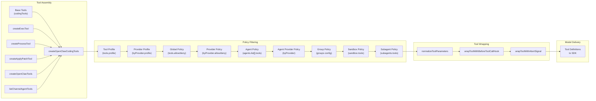
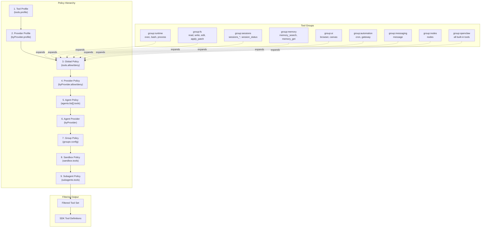
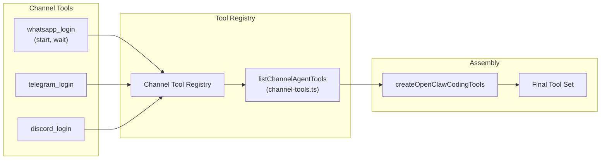

# Page: Built-in Tools

# Built-in Tools

<details>
<summary>Relevant source files</summary>

The following files were used as context for generating this wiki page:

- [docs/gateway/background-process.md](docs/gateway/background-process.md)
- [src/agents/bash-process-registry.test.ts](src/agents/bash-process-registry.test.ts)
- [src/agents/bash-process-registry.ts](src/agents/bash-process-registry.ts)
- [src/agents/bash-tools.ts](src/agents/bash-tools.ts)
- [src/agents/pi-embedded-helpers.ts](src/agents/pi-embedded-helpers.ts)
- [src/agents/pi-embedded-runner.test.ts](src/agents/pi-embedded-runner.test.ts)
- [src/agents/pi-embedded-runner.ts](src/agents/pi-embedded-runner.ts)
- [src/agents/pi-embedded-subscribe.ts](src/agents/pi-embedded-subscribe.ts)
- [src/agents/pi-tools.ts](src/agents/pi-tools.ts)

</details>


This page catalogs all built-in tools that OpenClaw agents can use during execution. Built-in tools are defined in the core codebase and available without plugin installation. For tool security policies and sandboxing, see [Tool Security and Sandboxing](#6.2). For packaging reusable tool guidance, see [Skills System](#6.3). For background process execution details, see [Background Process Execution](#6.4).

---

## Overview

Built-in tools are created by [`createOpenClawCodingTools`](src/agents/pi-tools.ts:115-453)() and assembled from multiple sources:

- **Filesystem tools**: `read`, `write`, `edit`, `apply_patch` from `pi-coding-agent` library
- **Execution tools**: `exec`, `process` from [src/agents/bash-tools.ts]()
- **OpenClaw tools**: `browser`, `canvas`, `nodes`, `cron`, `gateway`, `message`, `sessions_*`, `agents_list`, `memory_*` from [src/agents/openclaw-tools.ts]()
- **Channel tools**: Provider-specific login/management tools from [src/agents/channel-tools.ts]()

Tools are filtered by policy hierarchy before being sent to model providers. Each tool is a structured function definition with JSON schema parameters.

---

## Tool Categories

```mermaid
graph TB
    subgraph "Tool Assembly"
        createTools["createOpenClawCodingTools<br/>(pi-tools.ts:115)"]
    end
    
    subgraph "Core Libraries"
        piCoding["pi-coding-agent<br/>codingTools"]
        bashTools["bash-tools.ts<br/>createExecTool<br/>createProcessTool"]
        openclawTools["openclaw-tools.ts<br/>createOpenClawTools"]
        channelTools["channel-tools.ts<br/>listChannelAgentTools"]
    end
    
    subgraph "Filesystem Tools"
        read["read"]
        write["write"]
        edit["edit"]
        applyPatch["apply_patch"]
    end
    
    subgraph "Execution Tools"
        exec["exec"]
        process["process"]
    end
    
    subgraph "Web & UI Tools"
        webSearch["web_search"]
        webFetch["web_fetch"]
        browser["browser"]
        canvas["canvas"]
    end
    
    subgraph "Infrastructure Tools"
        nodes["nodes"]
        cron["cron"]
        gateway["gateway"]
        image["image"]
    end
    
    subgraph "Communication Tools"
        message["message"]
        sessionsList["sessions_list"]
        sessionsHistory["sessions_history"]
        sessionsSend["sessions_send"]
        sessionsSpawn["sessions_spawn"]
        sessionStatus["session_status"]
        agentsList["agents_list"]
    end
    
    subgraph "Memory Tools"
        memorySearch["memory_search"]
        memoryGet["memory_get"]
    end
    
    piCoding --> createTools
    bashTools --> createTools
    openclawTools --> createTools
    channelTools --> createTools
    
    createTools --> read
    createTools --> write
    createTools --> edit
    createTools --> applyPatch
    createTools --> exec
    createTools --> process
    createTools --> webSearch
    createTools --> webFetch
    createTools --> browser
    createTools --> canvas
    createTools --> nodes
    createTools --> cron
    createTools --> gateway
    createTools --> image
    createTools --> message
    createTools --> sessionsList
    createTools --> sessionsHistory
    createTools --> sessionsSend
    createTools --> sessionsSpawn
    createTools --> sessionStatus
    createTools --> agentsList
    createTools --> memorySearch
    createTools --> memoryGet
```



**Sources:** [src/agents/pi-tools.ts:115-453](), [src/agents/bash-tools.ts](), [src/agents/openclaw-tools.ts](), [docs/tools/index.md:179-513]()

---

## Tool Creation Pipeline



**Sources:** [src/agents/pi-tools.ts:167-453]()

---

## Filesystem Tools

### read

Reads file contents or lists directory entries. Supports offset/limit for partial reads.

**Parameters:**
- `path` (required): File or directory path relative to workspace
- `offset` (optional): Character offset for partial reads
- `limit` (optional): Maximum characters to read

**Sandboxing:**
- Sandboxed: Reads from sandbox workspace (`/workspace` or `/sandbox`)
- Host: Reads from agent workspace directory
- Created by: [`createReadTool`](src/agents/pi-tools.ts:250)() or [`createSandboxedReadTool`](src/agents/pi-tools.ts:247)()

**Sources:** [src/agents/pi-tools.ts:245-252](), [src/agents/pi-tools.read.ts]()

---

### write

Writes content to a file, creating parent directories if needed.

**Parameters:**
- `path` (required): File path relative to workspace
- `content` (required): Text content to write

**Sandboxing:**
- Not available in sandbox with `workspaceAccess: "ro"` or `"none"`
- Created by: [`createWriteTool`](src/agents/pi-tools.ts:262)() or [`createSandboxedWriteTool`](src/agents/pi-tools.ts:318)()

**Sources:** [src/agents/pi-tools.ts:256-263](), [docs/tools/index.md]()

---

### edit

Performs targeted edits using search-and-replace blocks.

**Parameters:**
- `path` (required): File path relative to workspace
- `edits` (required): Array of `{search, replace}` blocks
- `dryRun` (optional): Preview changes without applying

**Sandboxing:**
- Not available in sandbox with `workspaceAccess: "ro"` or `"none"`
- Created by: [`createEditTool`](src/agents/pi-tools.ts:270)() or [`createSandboxedEditTool`](src/agents/pi-tools.ts:317)()

**Sources:** [src/agents/pi-tools.ts:265-271](), [docs/tools/index.md]()

---

### apply_patch

Applies structured patches across multiple files. Experimental feature for multi-hunk edits.

**Parameters:**
- `patches` (required): Array of file patches with hunks
- `dryRun` (optional): Preview changes without applying

**Configuration:**
- Enabled via `tools.exec.applyPatch.enabled`
- OpenAI models only (enforced by [`isOpenAIProvider`](src/agents/pi-tools.ts:56)() and [`isApplyPatchAllowedForModel`](src/agents/pi-tools.ts:61)())
- Not available in sandbox with `workspaceAccess: "ro"` or `"none"`

**Sources:** [src/agents/pi-tools.ts:237-243](), [src/agents/apply-patch.ts](), [docs/tools/index.md:180-183]()

---

## Execution Tools

### exec

Executes shell commands in the workspace or sandbox.

**Core Parameters:**
| Parameter | Type | Description |
|-----------|------|-------------|
| `command` | string (required) | Shell command to execute |
| `yieldMs` | number | Auto-background timeout (default 10000) |
| `background` | boolean | Immediate background execution |
| `timeout` | number | Kill timeout in seconds (default 1800) |
| `elevated` | boolean | Run on host if elevated mode enabled |
| `host` | string | Execution target: `sandbox`, `gateway`, `node` |
| `security` | string | Security mode: `deny`, `allowlist`, `full` |
| `ask` | string | Approval mode: `off`, `on-miss`, `always` |
| `node` | string | Node id/name for `host=node` |
| `pty` | boolean | Allocate pseudo-TTY |

**Return Values:**
- Synchronous: `{status: "completed", exitCode, stdout, stderr}`
- Backgrounded: `{status: "running", sessionId}` (requires `process` tool)

**Configuration:**
- Defaults from `tools.exec.*` in [src/config/zod-schema.agent-runtime.ts]()
- Elevated gated by `tools.elevated.enabled` and `tools.elevated.allowFrom`

**Sources:** [src/agents/bash-tools.exec.ts](), [src/agents/pi-tools.ts:275-302](), [docs/tools/index.md:185-210]()

---

### process

Manages background exec sessions started with `yieldMs` or `background: true`.

**Actions:**

| Action | Parameters | Description |
|--------|------------|-------------|
| `list` | none | List all background sessions |
| `poll` | `sessionId` | Get new output since last poll |
| `log` | `sessionId`, `offset?`, `limit?` | Fetch log lines (omit offset for tail) |
| `write` | `sessionId`, `data` | Write to stdin |
| `kill` | `sessionId`, `signal?` | Send signal (default SIGTERM) |
| `clear` | `sessionId` | Remove completed session |
| `remove` | `sessionId` | Alias for `clear` |

**Scoping:**
- Sessions scoped per agent (via `scopeKey: "agent:{agentId}"`)
- Not shared across agents or sessions

**Sources:** [src/agents/bash-tools.process.ts](), [src/agents/pi-tools.ts:303-306](), [docs/tools/index.md:212-224]()

---

## Web Tools

### web_search

Searches the web using Brave Search API.

**Parameters:**
- `query` (required): Search query string
- `count` (optional): Results to return (1–10, default from `tools.web.search.maxResults`)

**Configuration:**
- Enabled via `tools.web.search.enabled`
- Requires `BRAVE_API_KEY` environment variable
- Responses cached (default 15 minutes)

**Sources:** [docs/tools/index.md:226-240]()

---

### web_fetch

Fetches and extracts readable content from URLs (HTML → markdown/text).

**Parameters:**
- `url` (required): Target URL
- `extractMode` (optional): `markdown` or `text`
- `maxChars` (optional): Truncate long pages (clamped by `tools.web.fetch.maxCharsCap`)

**Configuration:**
- Enabled via `tools.web.fetch.enabled`
- Default `maxCharsCap: 50000`
- Responses cached (default 15 minutes)

**Sources:** [docs/tools/index.md:242-260]()

---

## Browser Tool

The `browser` tool controls a dedicated OpenClaw-managed browser instance with multiple profiles support.

```mermaid
graph TB
    subgraph "Browser Profiles"
        defaultProfile["Default Profile<br/>(browser.defaultProfile)"]
        profile1["Profile: chrome<br/>(CDP port 18800)"]
        profile2["Profile: dev<br/>(CDP port 18801)"]
        profile3["Custom Profile<br/>(cdpUrl)"]
    end
    
    subgraph "Browser Actions"
        lifecycle["Lifecycle<br/>status, start, stop"]
        tabs["Tab Management<br/>tabs, open, focus, close"]
        snapshot["Snapshot<br/>aria, ai"]
        screenshot["Screenshot<br/>returns MEDIA:path"]
        navigate["Navigation<br/>navigate, console, pdf"]
        upload["File Upload<br/>upload (ref/inputRef/element)"]
        dialog["Dialog Handling<br/>dialog (accept/promptText)"]
        act["UI Actions<br/>act (click/type/press/hover/drag/select/fill/resize/wait/evaluate)"]
    end
    
    subgraph "Profile Management"
        profiles["profiles<br/>(list all)"]
        createProfile["create-profile<br/>(auto-allocate port)"]
        deleteProfile["delete-profile<br/>(stop + delete data)"]
        resetProfile["reset-profile<br/>(kill orphan process)"]
    end
    
    subgraph "Target Selection"
        targetSandbox["target: sandbox<br/>(sandboxed browser)"]
        targetHost["target: host<br/>(host browser)"]
        targetNode["target: node<br/>(node browser)"]
    end
    
    defaultProfile --> profile1
    defaultProfile --> profile2
    defaultProfile --> profile3
    
    lifecycle --> targetSandbox
    tabs --> targetSandbox
    snapshot --> targetSandbox
    screenshot --> targetSandbox
    navigate --> targetSandbox
    upload --> targetSandbox
    dialog --> targetSandbox
    act --> targetSandbox
    
    lifecycle --> targetHost
    tabs --> targetHost
    snapshot --> targetHost
    screenshot --> targetHost
    navigate --> targetHost
    upload --> targetHost
    dialog --> targetHost
    act --> targetHost
    
    lifecycle --> targetNode
    tabs --> targetNode
    snapshot --> targetNode
    screenshot --> targetNode
    navigate --> targetNode
    upload --> targetNode
    dialog --> targetNode
    act --> targetNode
    
    profiles --> createProfile
    createProfile --> deleteProfile
    deleteProfile --> resetProfile
```



### Browser Core Actions

| Action | Parameters | Description |
|--------|------------|-------------|
| `status` | `profile?` | Check browser status |
| `start` | `profile?` | Start browser instance |
| `stop` | `profile?` | Stop browser instance |
| `tabs` | `profile?` | List open tabs |
| `open` | `targetUrl`, `profile?` | Open new tab |
| `focus` | `targetId`, `profile?` | Switch to tab |
| `close` | `targetId`, `profile?` | Close tab |
| `snapshot` | `targetId?`, `format?`, `profile?` | Get page snapshot (aria/ai) |
| `screenshot` | `targetId?`, `profile?` | Capture screenshot |
| `navigate` | `targetUrl`, `targetId?`, `profile?` | Navigate tab |
| `console` | `targetId?`, `level?`, `profile?` | Get console logs |
| `pdf` | `targetId?`, `profile?` | Export page as PDF |
| `upload` | `paths`, `ref?`, `inputRef?`, `element?`, `profile?` | Upload files |
| `dialog` | `accept?`, `promptText?`, `profile?` | Handle dialogs |
| `act` | `request`, `profile?` | Perform UI action |

### Browser Profile Management

| Action | Parameters | Description |
|--------|------------|-------------|
| `profiles` | none | List all profiles with status |
| `create-profile` | `name`, `cdpPort?`, `cdpUrl?`, `driver?`, `color?` | Create new profile |
| `delete-profile` | `name` | Stop browser, delete data, remove from config |
| `reset-profile` | `name` | Kill orphan process on profile's port |

**Common Parameters:**
- `profile` (optional): Profile name (defaults to `browser.defaultProfile`)
- `target` (optional): `sandbox`, `host`, or `node`
- `node` (optional): Specific node id/name for `target=node`

**Configuration:**
- Enabled via `browser.enabled` (default `true`)
- Profile names: lowercase alphanumeric + hyphens (max 64 chars)
- Port range: 18800-18899 (~100 profiles max)
- Remote profiles are attach-only (no start/stop/reset)

**Snapshot Formats:**
- `ai`: AI-friendly snapshot (requires Playwright), returns refs like `12`
- `aria`: Accessibility tree snapshot, returns refs like `e12`
- Role snapshot options: `interactive`, `compact`, `depth`, `selector`

**Act Requests:**
- `click`, `type`, `press`, `hover`, `drag`, `select`, `fill`, `resize`, `wait`, `evaluate`
- Requires `ref` from snapshot (numeric or `e` prefix)
- Use `evaluate` only when CSS selector is needed (rare)

**Sources:** [docs/tools/index.md:262-298](), [src/agents/openclaw-tools.ts]()

---

## Canvas Tool

The `canvas` tool drives node Canvas for presentation, evaluation, and A2UI rendering.

**Actions:**

| Action | Parameters | Description |
|--------|------------|-------------|
| `present` | `target`, `node?`, `nodeId?` | Present content |
| `hide` | `node?`, `nodeId?` | Hide canvas |
| `navigate` | `url`, `node?`, `nodeId?` | Navigate to URL |
| `eval` | `javaScript`, `node?`, `nodeId?` | Evaluate JavaScript |
| `snapshot` | `format?`, `node?`, `nodeId?` | Capture snapshot (returns `MEDIA:path`) |
| `a2ui_push` | `text?`, `jsonlPath?`, `node?`, `nodeId?` | Push A2UI content |
| `a2ui_reset` | `node?`, `nodeId?` | Reset A2UI state |

**Configuration:**
- Uses `node.invoke` under the hood (via gateway RPC)
- Auto-selects node if omitted (single connected node or local mac node)
- A2UI is v0.8 only (no `createSurface`)

**Sources:** [docs/tools/index.md:300-315](), [src/agents/openclaw-tools.ts]()

---

## Nodes Tool

The `nodes` tool discovers paired nodes, sends notifications, and captures camera/screen.

**Actions:**

| Action | Parameters | Description |
|--------|------------|-------------|
| `status` | none | List paired nodes |
| `describe` | `node`, `nodeId?` | Get node capabilities |
| `pending` | none | List pending pairing requests |
| `approve` | `requestId` | Approve pairing request |
| `reject` | `requestId` | Reject pairing request |
| `notify` | `node`, `title`, `body`, `subtitle?` | Send system notification |
| `run` | `node`, `command`, `cwd?`, `env?`, `commandTimeoutMs?`, `invokeTimeoutMs?`, `needsScreenRecording?` | Execute command |
| `camera_snap` | `node`, `facing?`, `deviceId?` | Capture photo |
| `camera_clip` | `node`, `facing?`, `duration?`, `durationMs?`, `deviceId?` | Record video |
| `screen_record` | `node`, `duration?`, `durationMs?`, `fps?`, `screenIndex?` | Record screen |
| `location_get` | `node` | Get device location |

**Return Types:**
- Camera/screen: Returns image blocks + `MEDIA:<path>` or `FILE:<path>` (mp4)
- Location: JSON payload with `lat`, `lon`, `accuracy`, `timestamp`

**Run Command Example:**
```json
{
  "action": "run",
  "node": "office-mac",
  "command": ["echo", "Hello"],
  "env": ["FOO=bar"],
  "commandTimeoutMs": 12000,
  "invokeTimeoutMs": 45000,
  "needsScreenRecording": false
}
```

**Sources:** [docs/tools/index.md:317-350](), [src/agents/openclaw-tools.ts]()

---

## Image Tool

Analyzes images using the configured image model.

**Parameters:**
- `image` (required): Path or URL to image
- `prompt` (optional): Analysis prompt (default: "Describe the image.")
- `model` (optional): Override image model
- `maxBytesMb` (optional): Size cap in megabytes

**Configuration:**
- Only available when `agents.defaults.imageModel` is configured
- Uses image model directly (independent of chat model)
- Auto-infers image model from default model + configured auth (best-effort)

**Sources:** [docs/tools/index.md:352-366](), [src/agents/openclaw-tools.ts]()

---

## Message Tool

Sends messages and performs channel actions across Discord, Google Chat, Slack, Telegram, WhatsApp, Signal, iMessage, MS Teams.

**Core Actions:**

| Action | Channels | Parameters |
|--------|----------|------------|
| `send` | All | `to`, `content`, `card?` (Teams) |
| `poll` | WhatsApp, Discord, Teams | `question`, `options`, `to` |
| `react` | All | `channelId`, `messageId`, `emoji` |
| `reactions` | All | `channelId`, `messageId` |
| `read` | All | `channelId`, `messageId` |
| `edit` | All | `channelId`, `messageId`, `content` |
| `delete` | All | `channelId`, `messageId` |
| `pin` | All | `channelId`, `messageId` |
| `unpin` | All | `channelId`, `messageId` |
| `list-pins` | All | `channelId` |
| `permissions` | Discord, Slack | `channelId` |
| `thread-create` | Discord, Slack | `channelId`, `name` |
| `thread-list` | Discord, Slack | `guildId?`, `channelId?` |
| `thread-reply` | Discord, Slack | `channelId`, `content` |
| `search` | Discord, Slack | `query`, `guildId?` |
| `sticker` | Discord | `to`, `stickerIds` |
| `member-info` | Discord, Slack | `userId`, `guildId?` |
| `role-info` | Discord | `guildId` |
| `emoji-list` | Discord, Slack | `guildId?` |
| `emoji-upload` | Discord | `guildId`, `name`, `image` |
| `sticker-upload` | Discord | `guildId`, `name`, `file`, `description?` |
| `role-add` | Discord | `guildId`, `userId`, `roleId` |
| `role-remove` | Discord | `guildId`, `userId`, `roleId` |
| `channel-info` | Discord | `channelId` |
| `channel-list` | Discord | `guildId` |
| `voice-status` | Discord | `guildId`, `userId` |
| `event-list` | Discord | `guildId` |
| `event-create` | Discord | `guildId`, `name`, `scheduledStartTime` |
| `timeout` | Discord | `guildId`, `userId`, `durationSeconds` |
| `kick` | Discord | `guildId`, `userId` |
| `ban` | Discord | `guildId`, `userId` |

**Routing:**
- WhatsApp: Routed via Gateway
- MS Teams: Polls via Gateway, other actions direct
- Discord, Slack, Telegram, Signal, iMessage: Direct
- When bound to active chat session, sends constrained to session target

**Action Gates:**
- Per-channel action groups configurable (e.g., `channels.discord.actions.reactions: false`)

**Sources:** [docs/tools/index.md:368-389](), [src/agents/openclaw-tools.ts](), [skills/slack/SKILL.md]()

---

## Cron Tool

Manages Gateway cron jobs and wakeups.

**Actions:**

| Action | Parameters | Description |
|--------|------------|-------------|
| `status` | none | Get cron system status |
| `list` | `limit?` | List jobs |
| `add` | `job` | Add new job (full job object) |
| `update` | `id`, `patch` | Update existing job |
| `remove` | `id` | Remove job |
| `run` | `id` | Trigger immediate run |
| `runs` | `id`, `limit?` | Get run history |
| `wake` | `text?`, `mode?`, `immediate?` | Enqueue system event + optional heartbeat |

**Configuration:**
- Enabled via `cron.enabled`
- Job store at `cron.store` (default `~/.openclaw/cron-jobs.json`)
- Max concurrent runs: `cron.maxConcurrentRuns`

**Sources:** [docs/tools/index.md:391-409](), [src/agents/openclaw-tools.ts]()

---

## Gateway Tool

Restarts or applies updates to the running Gateway process.

**Actions:**

| Action | Parameters | Description |
|--------|------------|-------------|
| `restart` | `reason?`, `delayMs?` | Restart Gateway in-place |
| `config.get` | none | Get current config |
| `config.schema` | none | Get config JSON schema |
| `config.apply` | `raw`, `baseHash`, `sessionKey?`, `note?`, `restartDelayMs?` | Validate + write config + restart |
| `config.patch` | `raw`, `baseHash`, `sessionKey?`, `note?`, `restartDelayMs?` | Merge partial update + restart |
| `update.run` | `sessionKey?`, `restartDelayMs?` | Run update + restart |

**Configuration:**
- `restart` disabled by default; enable with `commands.restart: true`
- Default `delayMs: 2000` to avoid interrupting in-flight replies

**Sources:** [docs/tools/index.md:411-426](), [src/agents/openclaw-tools.ts]()

---

## Session Tools

Tools for managing and communicating between agent sessions.

### sessions_list

Lists active sessions with optional message history.

**Parameters:**
- `kinds` (optional): Filter by session kind array
- `limit` (optional): Maximum sessions to return
- `activeMinutes` (optional): Only sessions active in last N minutes
- `messageLimit` (optional): Include last N messages per session (0 = none)

**Sources:** [docs/tools/index.md:428-459](), [src/agents/openclaw-tools.ts]()

---

### sessions_history

Fetches transcript history for a specific session.

**Parameters:**
- `sessionKey` or `sessionId` (required): Target session
- `limit` (optional): Maximum turns to return
- `includeTools` (optional): Include tool call details

**Sources:** [docs/tools/index.md:428-459](), [src/agents/openclaw-tools.ts]()

---

### sessions_send

Sends a message to another session and optionally waits for completion.

**Parameters:**
- `sessionKey` or `sessionId` (required): Target session
- `message` (required): Message content
- `timeoutSeconds` (optional): Wait timeout (0 = fire-and-forget)

**Behavior:**
- When `timeoutSeconds > 0`: Waits for agent completion
- Reply ping-pong: Target replies with `REPLY_SKIP` to stop (max turns via `session.agentToAgent.maxPingPongTurns`)
- Announce step: Target runs announce after ping-pong; reply `ANNOUNCE_SKIP` to suppress
- Returns `{status: "ok"}` when agent run finishes (not delivery confirmation)

**Sources:** [docs/tools/index.md:428-459](), [src/agents/openclaw-tools.ts]()

---

### sessions_spawn

Starts a sub-agent run and posts announce reply to requester.

**Parameters:**
- `task` (required): Task description for sub-agent
- `label` (optional): Session label
- `agentId` (optional): Target agent (default: same agent)
- `model` (optional): Override model
- `runTimeoutSeconds` (optional): Run timeout
- `cleanup` (optional): Auto-cleanup mode

**Behavior:**
- Non-blocking: Returns `{status: "accepted"}` immediately
- Sub-agent runs announce step after completion
- Allowlist gated: `agents.list[].subagents.allowAgents` (default: same agent only)

**Sources:** [docs/tools/index.md:428-459](), [src/agents/openclaw-tools.ts]()

---

### session_status

Gets or updates current session status.

**Parameters:**
- `sessionKey` (optional): Target session (default: current)
- `sessionId` (optional): Alternate session identifier
- `model` (optional): Override model (`"default"` clears override)

**Sources:** [docs/tools/index.md:428-459](), [src/agents/openclaw-tools.ts]()

---

## Agents Tool

### agents_list

Lists agent IDs that the current session may target with `sessions_spawn`.

**Parameters:** None

**Return:**
- `agents`: Array of available agent IDs
- `allowAny`: `true` if `["*"]` configured

**Filtering:**
- Restricted by `agents.list[].subagents.allowAgents`
- Default: Only same agent allowed

**Sources:** [docs/tools/index.md:451-458](), [src/agents/openclaw-tools.ts]()

---

## Memory Tools

### memory_search

Searches memory using hybrid search (vector + BM25).

**Parameters:**
- `query` (required): Search query
- `count` (optional): Maximum results
- `scope` (optional): Scope filter

**Configuration:**
- Backend: `memory.backend` (`builtin` or `qmd`)
- Citations: `memory.citations` (`auto`, `on`, `off`)

**Sources:** [docs/tools/index.md](), [src/agents/openclaw-tools.ts]()

---

### memory_get

Retrieves specific memory documents.

**Parameters:**
- `ids` (required): Array of document IDs
- `scope` (optional): Scope filter

**Sources:** [docs/tools/index.md](), [src/agents/openclaw-tools.ts]()

---

## Tool Policy Application



**Filter Implementation:**

1. **Profile filters**: Applied first via [`resolveToolProfilePolicy`](src/agents/tool-policy.ts)()
2. **Plugin expansion**: Tool groups expanded via [`expandPolicyWithPluginGroups`](src/agents/pi-tools.ts:385-407)()
3. **Sequential filtering**: Each policy level calls [`filterToolsByPolicy`](src/agents/pi-tools.policy.ts)()
4. **Normalization**: Tools normalized via [`normalizeToolParameters`](src/agents/pi-tools.ts:438)()

**Sources:** [src/agents/pi-tools.ts:167-453](), [src/agents/pi-tools.policy.ts](), [src/agents/tool-policy.ts]()

---

## Tool Wrapping and Lifecycle

```mermaid
graph LR
    subgraph "Tool Creation"
        create["createOpenClawCodingTools"]
        rawTools["Raw Tool Definitions"]
    end
    
    subgraph "Policy Filtering"
        filter["filterToolsByPolicy<br/>(9 levels)"]
        filtered["Filtered Tools"]
    end
    
    subgraph "Schema Normalization"
        normalize["normalizeToolParameters<br/>(pi-tools.schema.ts)"]
        normalized["Normalized Schemas"]
    end
    
    subgraph "Hook Wrapping"
        hooks["wrapToolWithBeforeToolCallHook<br/>(pi-tools.before-tool-call.ts)"]
        hooked["Hooked Tools"]
    end
    
    subgraph "Abort Wrapping"
        abort["wrapToolWithAbortSignal<br/>(pi-tools.abort.ts)"]
        final["Final Tool Set"]
    end
    
    subgraph "SDK Delivery"
        sdk["pi-ai SDK<br/>Tool Definitions"]
        invoke["Tool Invocation<br/>during agent run"]
    end
    
    create --> rawTools
    rawTools --> filter
    filter --> filtered
    filtered --> normalize
    normalize --> normalized
    normalized --> hooks
    hooks --> hooked
    hooked --> abort
    abort --> final
    final --> sdk
    sdk --> invoke
```



**Wrapping Functions:**

1. **Parameter normalization**: [`wrapToolParamNormalization`](src/agents/pi-tools.read.ts:42)() for Claude Code compatibility
2. **Before-tool-call hook**: [`wrapToolWithBeforeToolCallHook`](src/agents/pi-tools.before-tool-call.ts)() for logging and metrics
3. **Abort signal**: [`wrapToolWithAbortSignal`](src/agents/pi-tools.abort.ts)() for cancellation support

**Sources:** [src/agents/pi-tools.ts:439-448](), [src/agents/pi-tools.abort.ts](), [src/agents/pi-tools.before-tool-call.ts](), [src/agents/pi-tools.schema.ts]()

---

## Tool Schema Normalization

Tools undergo schema transformation before delivery to model providers:

1. **Parameter normalization**: [`normalizeToolParameters`](src/agents/pi-tools.schema.ts)() flattens union schemas
2. **Claude compatibility**: [`patchToolSchemaForClaudeCompatibility`](src/agents/pi-tools.read.ts)() handles parameter groups
3. **Gemini cleanup**: [`cleanToolSchemaForGemini`](src/agents/pi-tools.schema.ts)() removes unsupported constructs

**Provider Quirks:**

- **OpenAI**: Rejects root-level union schemas (normalized away)
- **Claude OAuth**: Blocks certain tool names (handled by `pi-ai` transport)
- **Gemini**: Requires schema cleanup for complex types

**Sources:** [src/agents/pi-tools.ts:107-113](), [src/agents/pi-tools.schema.ts](), [src/agents/pi-tools.read.ts]()

---

## Channel-Specific Tools

Channel plugins register additional agent tools for login and management:



**Implementation:**

- Registered via [`registerChannelAgentTools`](src/agents/channel-tools.ts)()
- Listed by [`listChannelAgentTools`](src/agents/channel-tools.ts)()
- Included in tool assembly at [src/agents/pi-tools.ts:325]()

**Sources:** [src/agents/channel-tools.ts](), [src/agents/pi-tools.ts:325](), [ui/src/ui/tool-display.json:175-181]()

---

## Tool Display Metadata

The Control UI uses tool display metadata for rendering:

**Configuration:** [ui/src/ui/tool-display.json]()

**Structure:**
```typescript
{
  version: number
  fallback: { icon, detailKeys }
  tools: {
    [toolName]: {
      icon: IconName
      title: string
      actions: {
        [action]: {
          label: string
          detailKeys: string[]
        }
      }
    }
  }
}
```

**Example:**
```json
{
  "browser": {
    "icon": "globe",
    "title": "Browser",
    "actions": {
      "snapshot": {
        "label": "snapshot",
        "detailKeys": ["targetUrl", "targetId", "ref", "format"]
      }
    }
  }
}
```

**Display Resolution:**

1. Lookup tool in `tools` map
2. Extract `action` from tool parameters
3. Resolve action-specific metadata
4. Format detail string from `detailKeys`
5. Apply home directory shortening

**Sources:** [ui/src/ui/tool-display.json](), [ui/src/ui/tool-display.ts:159-207]()

---