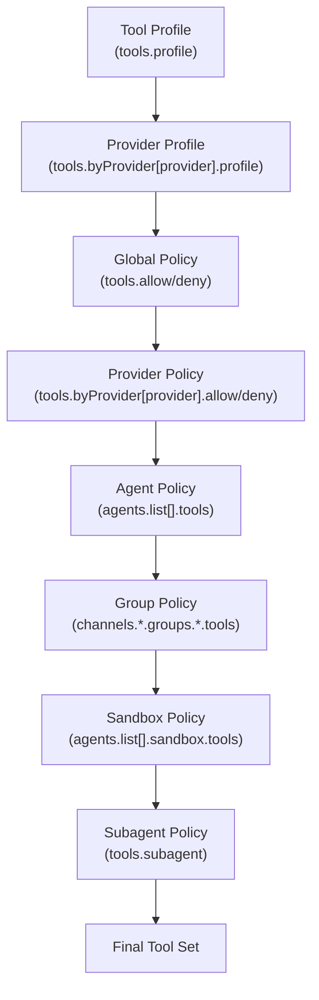
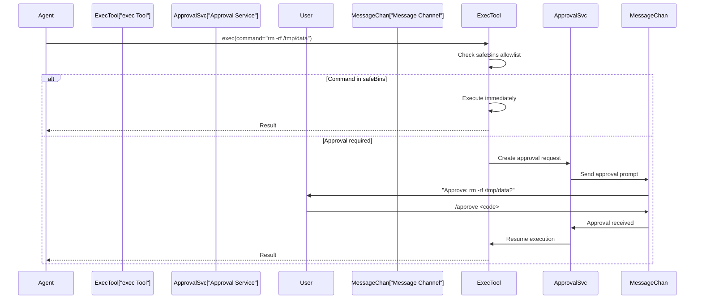
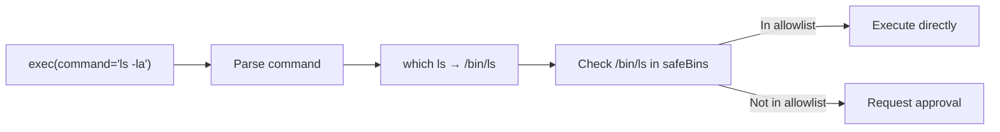
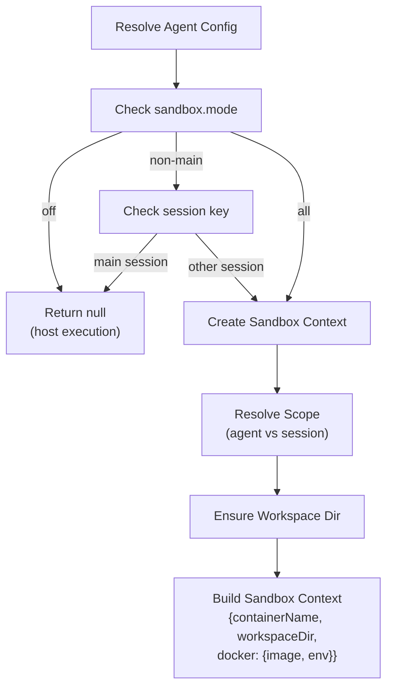

# Page: Tool Security and Sandboxing

# Tool Security and Sandboxing

<details>
<summary>Relevant source files</summary>

The following files were used as context for generating this wiki page:

- [CHANGELOG.md](CHANGELOG.md)
- [docs/cli/memory.md](docs/cli/memory.md)
- [docs/cli/sandbox.md](docs/cli/sandbox.md)
- [docs/concepts/memory.md](docs/concepts/memory.md)
- [docs/gateway/configuration.md](docs/gateway/configuration.md)
- [docs/gateway/doctor.md](docs/gateway/doctor.md)
- [docs/gateway/sandbox-vs-tool-policy-vs-elevated.md](docs/gateway/sandbox-vs-tool-policy-vs-elevated.md)
- [docs/gateway/sandboxing.md](docs/gateway/sandboxing.md)
- [docs/platforms/mac/skills.md](docs/platforms/mac/skills.md)
- [docs/tools/elevated.md](docs/tools/elevated.md)
- [docs/tools/index.md](docs/tools/index.md)
- [docs/tools/skills-config.md](docs/tools/skills-config.md)
- [src/agents/bash-tools.test.ts](src/agents/bash-tools.test.ts)
- [src/agents/memory-search.test.ts](src/agents/memory-search.test.ts)
- [src/agents/memory-search.ts](src/agents/memory-search.ts)
- [src/agents/pi-tools-agent-config.test.ts](src/agents/pi-tools-agent-config.test.ts)
- [src/agents/sandbox-explain.test.ts](src/agents/sandbox-explain.test.ts)
- [src/agents/sandbox-skills.test.ts](src/agents/sandbox-skills.test.ts)
- [src/agents/sandbox.ts](src/agents/sandbox.ts)
- [src/cli/memory-cli.test.ts](src/cli/memory-cli.test.ts)
- [src/cli/memory-cli.ts](src/cli/memory-cli.ts)
- [src/cli/models-cli.test.ts](src/cli/models-cli.test.ts)
- [src/commands/configure.gateway.test.ts](src/commands/configure.gateway.test.ts)
- [src/commands/configure.gateway.ts](src/commands/configure.gateway.ts)
- [src/commands/configure.ts](src/commands/configure.ts)
- [src/commands/doctor.ts](src/commands/doctor.ts)
- [src/commands/onboard-helpers.test.ts](src/commands/onboard-helpers.test.ts)
- [src/commands/onboard-helpers.ts](src/commands/onboard-helpers.ts)
- [src/commands/onboard-interactive.ts](src/commands/onboard-interactive.ts)
- [src/config/merge-config.ts](src/config/merge-config.ts)
- [src/config/schema.ts](src/config/schema.ts)
- [src/config/types.tools.ts](src/config/types.tools.ts)
- [src/config/types.ts](src/config/types.ts)
- [src/config/zod-schema.agent-runtime.ts](src/config/zod-schema.agent-runtime.ts)
- [src/config/zod-schema.ts](src/config/zod-schema.ts)
- [src/memory/embeddings.test.ts](src/memory/embeddings.test.ts)
- [src/memory/embeddings.ts](src/memory/embeddings.ts)
- [src/memory/manager.ts](src/memory/manager.ts)
- [src/wizard/onboarding.gateway-config.test.ts](src/wizard/onboarding.gateway-config.test.ts)
- [src/wizard/onboarding.gateway-config.ts](src/wizard/onboarding.gateway-config.ts)
- [src/wizard/onboarding.ts](src/wizard/onboarding.ts)
- [src/wizard/onboarding.types.ts](src/wizard/onboarding.types.ts)

</details>


This page explains OpenClaw's tool security model, including tool policies (allow/deny lists and profiles), approval workflows for dangerous operations, safe binaries, Docker sandbox isolation, and security best practices. For information about available tools and their usage, see [Built-in Tools](#6.1). For workspace-level skills configuration, see [Skills System](#6.3).

---

## Overview

OpenClaw provides multiple security layers for controlling what tools agents can execute:

1. **Tool Policies** — Allow/deny lists with profile-based defaults and per-agent/provider overrides
2. **Approval Workflows** — User approval prompts for dangerous commands
3. **Safe Binaries** — Allowlist of common utilities that bypass approval
4. **Docker Sandboxing** — Per-agent or per-session container isolation
5. **Group Tool Policies** — Per-sender restrictions in group chats

---

## Tool Policy System

### Policy Resolution

Tool policies are resolved in order of precedence (later sources override earlier):



**Sources:** [src/agents/pi-tools.ts:156-171](), [src/agents/pi-tools.policy.ts:1-250]()

### Tool Profiles

Base allowlists that serve as policy templates:

| Profile | Allowed Tool Groups |
|---------|-------------------|
| `minimal` | `session_status` only |
| `coding` | `group:fs`, `group:runtime`, `group:sessions`, `group:memory`, `image` |
| `messaging` | `group:messaging`, `sessions_list`, `sessions_history`, `sessions_send`, `session_status` |
| `full` | All tools (no restrictions) |

Configure globally or per-agent:

```json5
{
  tools: { profile: "coding" },
  agents: {
    list: [
      {
        id: "support",
        tools: { profile: "messaging", allow: ["slack"] }
      }
    ]
  }
}
```

**Sources:** [src/agents/tool-policy.ts:45-70](), [docs/tools/index.md:30-74]()

### Tool Groups

Shorthand expansions for common tool sets:

| Group | Expands To |
|-------|-----------|
| `group:runtime` | `exec`, `bash`, `process` |
| `group:fs` | `read`, `write`, `edit`, `apply_patch` |
| `group:sessions` | `sessions_list`, `sessions_history`, `sessions_send`, `sessions_spawn`, `session_status` |
| `group:memory` | `memory_search`, `memory_get` |
| `group:web` | `web_search`, `web_fetch` |
| `group:ui` | `browser`, `canvas` |
| `group:automation` | `cron`, `gateway` |
| `group:messaging` | `message` |
| `group:nodes` | `nodes` |

Example denial:

```json5
{
  tools: {
    profile: "coding",
    deny: ["group:runtime"]  // Blocks exec, bash, process
  }
}
```

**Sources:** [src/agents/tool-policy.ts:72-106](), [docs/tools/index.md:130-154]()

### Provider-Specific Policies

Restrict tools for specific model providers or `provider/model` combinations:

```json5
{
  tools: {
    profile: "coding",
    byProvider: {
      "google-antigravity": { profile: "minimal" },
      "openai/gpt-5.2": { allow: ["group:fs", "sessions_list"] }
    }
  }
}
```

Provider policies are applied **after** the base profile but **before** global allow/deny, so they can only narrow the tool set.

**Sources:** [docs/tools/index.md:76-128](), [src/agents/pi-tools.ts:156-171]()

---

## Approval Workflows

### Exec Tool Approval Modes

The `exec` tool supports three approval modes via `tools.exec.ask`:

| Mode | Behavior |
|------|----------|
| `off` | No approval required (uses sandbox/host based on `security`) |
| `elevated` | Approval required when session has elevated mode enabled |
| `always` | Approval required for every command |

Security routing is controlled via `tools.exec.security`:

| Value | Behavior |
|-------|----------|
| `host` | Always execute on gateway host |
| `sandbox` | Always execute in sandbox (if enabled) |
| `ask` | Prompt user for host vs sandbox per command |

**Sources:** [src/agents/bash-tools.ts:1-10](), [docs/gateway/configuration.md:82-97]()

### Approval Flow



**Sources:** [src/agents/bash-tools.ts:250-280](), [CHANGELOG.md:149]()

### Approval Commands

Users approve pending requests via the `/approve` command:

```bash
# List pending approvals
openclaw approvals list

# Approve by code
openclaw approvals approve <code>

# Or in chat
/approve <code>
```

Approval prompts include:
- Command being executed
- Working directory
- Agent ID
- Session key
- Expiration time (default 5 minutes)

**Sources:** [CHANGELOG.md:149-160](), [src/agents/bash-tools.ts:260-275]()

---

## Safe Binaries

### Concept

Safe binaries are commands that bypass approval checks because they're considered low-risk. Configured via `tools.exec.safeBins`:

```json5
{
  tools: {
    exec: {
      ask: "elevated",
      safeBins: [
        "ls", "cat", "grep", "find", "head", "tail",
        "echo", "date", "pwd", "whoami", "uname"
      ]
    }
  }
}
```

### Resolution

The exec tool resolves binary paths before checking the allowlist:



For compound commands (`ls | grep foo`), each segment is checked independently. If any segment requires approval, the entire command requires approval.

**Sources:** [src/agents/bash-tools.ts:85-89](), [CHANGELOG.md:18]()

### Default Safe Binaries

OpenClaw includes common read-only utilities in the default safe binaries list:

- File inspection: `ls`, `cat`, `head`, `tail`, `less`, `more`, `file`
- Text processing: `grep`, `awk`, `sed`, `cut`, `sort`, `uniq`, `wc`
- System info: `pwd`, `whoami`, `uname`, `date`, `which`, `env`
- Archiving: `tar`, `zip`, `unzip` (read operations only)

**Sources:** [src/agents/bash-tools.ts:85-89]()

---

## Docker Sandbox Isolation

### Sandbox Configuration

Sandboxes isolate agent execution in Docker containers. Configure globally or per-agent:

```json5
{
  agents: {
    defaults: {
      sandbox: {
        mode: "non-main",      // off | non-main | all
        scope: "session",      // agent | session
        workspaceAccess: "rw", // ro | rw
        tools: {
          allow: ["read", "write", "exec", "sessions_list"],
          deny: ["browser", "canvas", "nodes", "cron"]
        }
      }
    }
  }
}
```

### Sandbox Modes

| Mode | Behavior |
|------|----------|
| `off` | No sandboxing (all sessions run on host) |
| `non-main` | Sandbox non-main sessions (groups, channels, subagents) |
| `all` | Sandbox all sessions including main |

**Sources:** [src/agents/sandbox/config.ts:1-100](), [docs/gateway/sandboxing.md:1-50]()

### Sandbox Scopes

| Scope | Lifetime | Workspace |
|-------|----------|-----------|
| `agent` | Lives until agent shutdown | Shared `~/.openclaw/agents/<id>/sandbox-workspace` |
| `session` | Per-conversation | Unique `/tmp/openclaw-sandbox-<session-hash>` |

Session-scoped sandboxes are created on-demand and cleaned up when the conversation ends or the Gateway restarts.

**Sources:** [src/agents/sandbox/context.ts:1-150](), [docs/gateway/sandboxing.md:51-100]()

### Sandbox Context Resolution



**Sources:** [src/agents/sandbox/context.ts:10-150](), [src/agents/pi-embedded-runner/sandbox-info.ts:1-50]()

### Docker Container Lifecycle

When a sandbox is needed:

1. **Create Workspace** — `ensureSandboxWorkspaceForSession` creates the workspace directory
2. **Build Args** — `buildSandboxCreateArgs` constructs `docker run` arguments
3. **Start Container** — Gateway starts the container with workspace mounted at `/workspace`
4. **Execute Commands** — Exec tool routes to container via `docker exec`
5. **Cleanup** — Container stopped when session ends or Gateway restarts

Container args include:
- Read-only root filesystem (`--read-only`)
- Memory limits (`--memory`, `--memory-swap`)
- CPU limits (`--cpus`)
- Network isolation (`--network none` by default)
- Workspace mount (`-v <host>:/workspace`)

**Sources:** [src/agents/sandbox/docker.ts:1-100](), [src/agents/bash-tools.ts:270-290]()

### Sandbox Tool Policy

Sandbox-specific tool policies override agent policies:

```json5
{
  agents: {
    list: [
      {
        id: "main",
        tools: { allow: ["exec", "read", "write", "browser"] },
        sandbox: {
          mode: "non-main",
          tools: {
            allow: ["exec", "read", "write"],  // No browser in sandbox
            deny: ["browser", "canvas", "nodes"]
          }
        }
      }
    ]
  }
}
```

Sandboxed sessions cannot access:
- Host browser control (unless `browserAllowHostControl: true`)
- Canvas hosts
- Paired nodes (iOS/Android devices)
- Host-only cron jobs

**Sources:** [src/agents/sandbox/tool-policy.ts:1-50](), [docs/multi-agent-sandbox-tools.md:1-100]()

---

## Group Tool Policies

### Per-Sender Restrictions

Restrict tools based on group sender identity:

```json5
{
  channels: {
    telegram: {
      groups: {
        "*": {
          tools: {
            bySender: {
              "@untrusted_user": {
                deny: ["exec", "process", "write"]
              }
            }
          }
        }
      }
    }
  }
}
```

Sender matching supports:
- Username: `@username`
- User ID: `123456789`
- E.164 phone: `+1234567890`
- Display name: `"John Doe"`

**Sources:** [CHANGELOG.md:14](), [src/agents/pi-tools.ts:172-185]()

### Precedence with Agent Policies

Group tool policies are applied **after** agent policies:

```
Tool Profile → Provider Profile → Global Policy → 
Provider Policy → Agent Policy → Group Policy → Sandbox Policy
```

This means group policies can further restrict but cannot expand the agent's tool set.

**Sources:** [src/agents/pi-tools.policy.ts:150-250](), [docs/multi-agent-sandbox-tools.md:50-100]()

---

## Security Best Practices

### Recommended Baseline

```json5
{
  // Channel access control
  channels: {
    telegram: {
      dmPolicy: "pairing",  // Require pairing for unknown senders
      groups: {
        "*": { requireMention: true }  // Groups require @mention
      }
    }
  },
  
  // Sandbox non-main sessions
  agents: {
    defaults: {
      sandbox: {
        mode: "non-main",
        scope: "session",
        tools: {
          deny: ["browser", "canvas", "nodes", "cron", "gateway"]
        }
      }
    }
  },
  
  // Approval for dangerous operations
  tools: {
    exec: {
      ask: "elevated",
      security: "sandbox",
      safeBins: ["ls", "cat", "grep", "find"]
    }
  }
}
```

**Sources:** [docs/gateway/security.md:1-100](), [README.md:314-320]()

### Security Audit

Run regular audits with `openclaw doctor`:

```bash
# Check security warnings
openclaw doctor

# Deep audit
openclaw security audit --deep

# Auto-fix issues
openclaw security audit --fix
```

Doctor checks for:
- Gateway exposure without authentication
- Open DM policies without allowlists
- Sandbox disabled for group sessions
- Missing tool restrictions
- Weak approval configurations

**Sources:** [src/commands/doctor.ts:180-250](), [CHANGELOG.md:25]()

### Layered Defense

Implement multiple security layers:

1. **Network** — Bind to loopback, use Tailscale Serve, require authentication
2. **Channel** — Pairing/allowlists, mention gating, per-sender policies
3. **Sandbox** — Container isolation for untrusted sessions
4. **Tools** — Least-privilege policies, approval workflows
5. **Workspace** — Keep secrets outside agent workspace
6. **Model** — Use strongest available model for tool-enabled agents

**Sources:** [README.md:102-113](), [docs/gateway/security.md:1-150]()

### Secrets Management

Never store secrets in:
- Agent workspace (`~/.openclaw/workspace`)
- Bootstrap files (`AGENTS.md`, `SOUL.md`, `TOOLS.md`)
- Skills directories

Store secrets in:
- Environment variables
- Keychain (macOS)
- Dedicated secrets directory outside workspace
- Config with restrictive file permissions

**Sources:** [docs/gateway/security.md:100-150]()

---

## Key Classes and Functions

### Tool Policy Resolution

- `resolveEffectiveToolPolicy` — Combines global, agent, provider policies [src/agents/pi-tools.ts:156-171]()
- `filterToolsByPolicy` — Applies allow/deny lists to tool set [src/agents/pi-tools.policy.ts:50-100]()
- `resolveToolProfilePolicy` — Resolves profile to allowlist [src/agents/tool-policy.ts:150-200]()
- `resolveGroupToolPolicy` — Resolves per-sender group policies [src/agents/pi-tools.policy.ts:200-250]()

### Approval System

- `createExecTool` — Creates exec tool with approval logic [src/agents/bash-tools.ts:1-10]()
- Approval prompts sent via message channel [src/agents/bash-tools.ts:260-275]()
- `/approve` command handler [CHANGELOG.md:149-160]()

### Sandbox System

- `resolveSandboxConfigForAgent` — Determines sandbox config [src/agents/sandbox/config.ts:1-50]()
- `resolveSandboxContext` — Builds sandbox context [src/agents/sandbox/context.ts:10-50]()
- `ensureSandboxWorkspaceForSession` — Creates workspace [src/agents/sandbox/context.ts:50-100]()
- `buildSandboxCreateArgs` — Constructs docker args [src/agents/sandbox/docker.ts:1-50]()

---

**Sources:** [src/agents/pi-tools.ts](), [src/agents/pi-tools.policy.ts](), [src/agents/tool-policy.ts](), [src/agents/bash-tools.ts](), [src/agents/sandbox/](), [docs/gateway/configuration.md](), [docs/tools/index.md](), [docs/multi-agent-sandbox-tools.md](), [docs/gateway/sandboxing.md](), [CHANGELOG.md](), [README.md]()

---