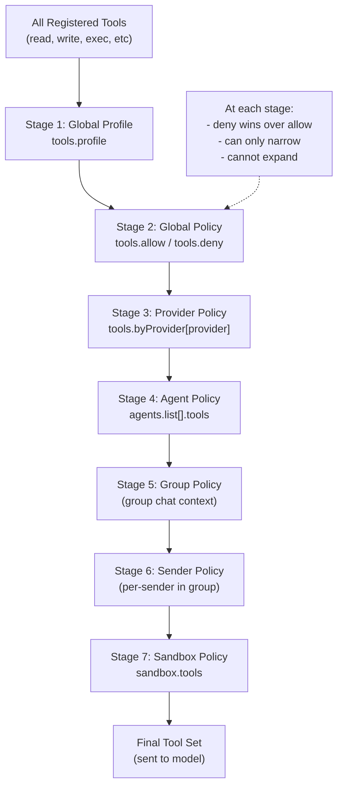
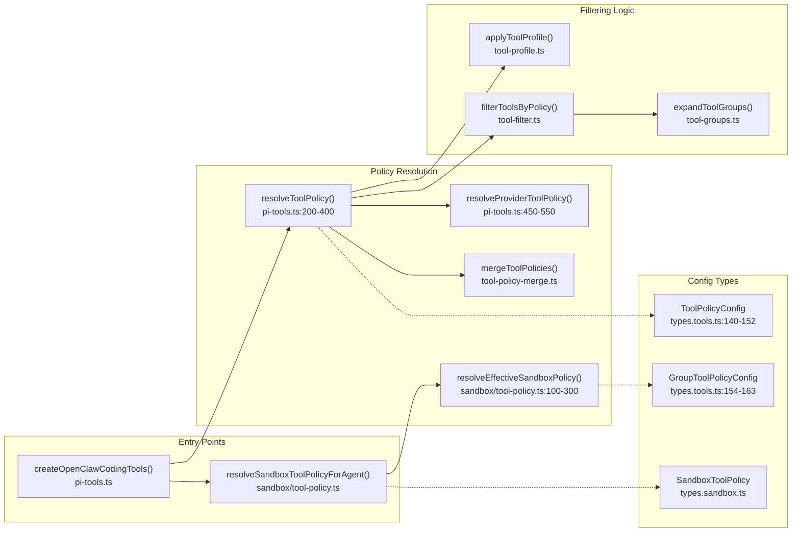

# Page: Tool Policy Resolution

# Tool Policy Resolution

<details>
<summary>Relevant source files</summary>

The following files were used as context for generating this wiki page:

- [CHANGELOG.md](CHANGELOG.md)
- [docs/cli/memory.md](docs/cli/memory.md)
- [docs/cli/sandbox.md](docs/cli/sandbox.md)
- [docs/concepts/memory.md](docs/concepts/memory.md)
- [docs/gateway/configuration.md](docs/gateway/configuration.md)
- [docs/gateway/doctor.md](docs/gateway/doctor.md)
- [docs/gateway/sandbox-vs-tool-policy-vs-elevated.md](docs/gateway/sandbox-vs-tool-policy-vs-elevated.md)
- [docs/gateway/sandboxing.md](docs/gateway/sandboxing.md)
- [docs/platforms/mac/skills.md](docs/platforms/mac/skills.md)
- [docs/tools/elevated.md](docs/tools/elevated.md)
- [docs/tools/index.md](docs/tools/index.md)
- [docs/tools/skills-config.md](docs/tools/skills-config.md)
- [src/agents/bash-tools.test.ts](src/agents/bash-tools.test.ts)
- [src/agents/memory-search.test.ts](src/agents/memory-search.test.ts)
- [src/agents/memory-search.ts](src/agents/memory-search.ts)
- [src/agents/pi-tools-agent-config.test.ts](src/agents/pi-tools-agent-config.test.ts)
- [src/agents/sandbox-explain.test.ts](src/agents/sandbox-explain.test.ts)
- [src/agents/sandbox-skills.test.ts](src/agents/sandbox-skills.test.ts)
- [src/agents/sandbox.ts](src/agents/sandbox.ts)
- [src/cli/memory-cli.test.ts](src/cli/memory-cli.test.ts)
- [src/cli/memory-cli.ts](src/cli/memory-cli.ts)
- [src/cli/models-cli.test.ts](src/cli/models-cli.test.ts)
- [src/commands/configure.gateway.test.ts](src/commands/configure.gateway.test.ts)
- [src/commands/configure.gateway.ts](src/commands/configure.gateway.ts)
- [src/commands/configure.ts](src/commands/configure.ts)
- [src/commands/doctor.ts](src/commands/doctor.ts)
- [src/commands/onboard-helpers.test.ts](src/commands/onboard-helpers.test.ts)
- [src/commands/onboard-helpers.ts](src/commands/onboard-helpers.ts)
- [src/commands/onboard-interactive.ts](src/commands/onboard-interactive.ts)
- [src/config/merge-config.ts](src/config/merge-config.ts)
- [src/config/schema.ts](src/config/schema.ts)
- [src/config/types.tools.ts](src/config/types.tools.ts)
- [src/config/types.ts](src/config/types.ts)
- [src/config/zod-schema.agent-runtime.ts](src/config/zod-schema.agent-runtime.ts)
- [src/config/zod-schema.ts](src/config/zod-schema.ts)
- [src/memory/embeddings.test.ts](src/memory/embeddings.test.ts)
- [src/memory/embeddings.ts](src/memory/embeddings.ts)
- [src/memory/manager.ts](src/memory/manager.ts)
- [src/wizard/onboarding.gateway-config.test.ts](src/wizard/onboarding.gateway-config.test.ts)
- [src/wizard/onboarding.gateway-config.ts](src/wizard/onboarding.gateway-config.ts)
- [src/wizard/onboarding.ts](src/wizard/onboarding.ts)
- [src/wizard/onboarding.types.ts](src/wizard/onboarding.types.ts)

</details>


This page explains how OpenClaw determines which tools are available to an agent at runtime through a cascading policy chain. For general tool configuration, see [Tool Security and Sandboxing](#6.2). For the complete list of available tools, see [Built-in Tools](#6.1).

## Overview

Tool availability is resolved through a **cascading filter chain** where each stage can only restrict (never expand) the tool set. The chain progresses from broad global defaults to specific context-dependent overrides:

**Global → Provider → Agent → Group → Sender → Sandbox**

At every stage, **deny always wins**: if a tool is denied at any level, it cannot be re-allowed by a later stage. This creates a security-by-default model where more specific contexts can only narrow permissions.

**Sources:** [src/agents/sandbox/tool-policy.ts:1-500](), [src/agents/pi-tools.ts:1-1000]()

## Policy Chain Stages



**Sources:** [src/agents/pi-tools.ts:200-400](), [src/agents/sandbox/tool-policy.ts:50-300]()

### Stage 1: Global Profile

The `tools.profile` setting establishes a **base allowlist** before any other filtering:

| Profile | Allowed Tools |
|---------|---------------|
| `minimal` | `session_status` only |
| `coding` | `group:fs`, `group:runtime`, `group:sessions`, `group:memory`, `image` |
| `messaging` | `group:messaging`, `sessions_list`, `sessions_history`, `sessions_send`, `session_status` |
| `full` | No restriction (all tools available) |

When no profile is set, all tools start available (equivalent to `full`).

**Example:**
```json5
{
  "tools": {
    "profile": "coding"
  }
}
```

**Sources:** [src/config/types.tools.ts:139-152](), [src/agents/tool-profile.ts:1-100]()

### Stage 2: Global Policy

The `tools.allow` and `tools.deny` lists filter the tool set:

- **`tools.allow`**: If set, only listed tools pass through (allowlist mode)
- **`tools.alsoAllow`**: Additive entries merged into the effective allowlist without replacing existing allow lists
- **`tools.deny`**: Tools in this list are removed (deny wins over allow)

**Example:**
```json5
{
  "tools": {
    "profile": "full",
    "deny": ["exec", "bash", "process"]
  }
}
```

**Special case:** If `tools.allow` contains only unknown/unloaded plugin tools, OpenClaw ignores the allowlist to keep core tools available and logs a warning.

**Sources:** [src/agents/pi-tools.ts:300-400](), [src/config/types.tools.ts:140-160]()

### Stage 3: Provider Policy

The `tools.byProvider` object narrows tools for specific model providers or provider/model combinations. This stage can only **restrict further**, not expand.

Provider keys accept:
- `provider` (e.g., `"openai"`, `"google-antigravity"`)
- `provider/model` (e.g., `"openai/gpt-5.2"`)

**Example:**
```json5
{
  "tools": {
    "profile": "coding",
    "byProvider": {
      "google-antigravity": {
        "profile": "minimal"
      },
      "openai/gpt-5.2": {
        "allow": ["group:fs", "sessions_list"]
      }
    }
  }
}
```

**Resolution order:**
1. Check for exact `provider/model` match
2. Fall back to `provider` match
3. Fall back to base policy

**Sources:** [src/agents/pi-tools.ts:450-550](), [src/config/types.tools.ts:82-136]()

### Stage 4: Agent Policy

Each agent in `agents.list[]` can override tool policy via `agents.list[].tools`. This stage applies after provider policy and can further restrict or replace the effective policy.

**Example:**
```json5
{
  "agents": {
    "list": [
      {
        "id": "support",
        "tools": {
          "profile": "messaging",
          "allow": ["slack", "discord"]
        }
      },
      {
        "id": "dev",
        "tools": {
          "deny": ["web_search"]
        }
      }
    ]
  }
}
```

Agent-specific provider overrides are also supported:
```json5
{
  "agents": {
    "list": [
      {
        "id": "main",
        "tools": {
          "byProvider": {
            "google-antigravity": {
              "allow": ["message", "sessions_list"]
            }
          }
        }
      }
    ]
  }
}
```

**Sources:** [src/agents/pi-tools.ts:600-700](), [src/config/types.agents.ts:1-500]()

### Stage 5: Group Policy

When the agent is invoked in a **group chat context**, additional filtering applies via group-specific tool policies. This is configured per channel and per group.

**Configuration surface:**
- `channels.<channel>.groups.<groupId>.tools`
- Supports `allow`, `alsoAllow`, and `deny`

**Example:**
```json5
{
  "channels": {
    "telegram": {
      "groups": {
        "tg:group:123": {
          "tools": {
            "allow": ["message", "sessions_list"],
            "deny": ["exec"]
          }
        },
        "*": {
          "tools": {
            "deny": ["group:runtime"]
          }
        }
      }
    }
  }
}
```

**Sources:** [src/agents/sandbox/tool-policy.ts:100-200](), [src/config/types.tools.ts:154-160]()

### Stage 6: Sender Policy

Within group contexts, per-sender overrides can further restrict tools. This is configured via `channels.<channel>.groups.<groupId>.bySender`.

**Example:**
```json5
{
  "channels": {
    "whatsapp": {
      "groups": {
        "wa:group:abc": {
          "bySender": {
            "+15555550123": {
              "tools": {
                "allow": ["message", "read", "write"]
              }
            }
          }
        }
      }
    }
  }
}
```

**Sources:** [src/agents/sandbox/tool-policy.ts:200-300](), [src/config/types.tools.ts:161-163]()

### Stage 7: Sandbox Policy

When a session runs in a **sandboxed Docker container**, the final tool filtering stage applies based on `agents.defaults.sandbox.tools` (or per-agent `agents.list[].sandbox.tools`).

**Configuration:**
```json5
{
  "agents": {
    "defaults": {
      "sandbox": {
        "mode": "non-main",
        "tools": {
          "allow": ["read", "write", "exec"],
          "deny": ["message"]
        }
      }
    }
  }
}
```

The sandbox policy is applied **last** and represents the absolute floor: tools denied here cannot be used in sandboxed sessions, regardless of all other policies.

**Sources:** [src/agents/sandbox/tool-policy.ts:300-500](), [src/config/types.sandbox.ts:1-100]()

## Resolution Algorithm

```mermaid
flowchart TD
    Start["Start: All Registered Tools"]
    
    Profile{{"tools.profile set?"}}
    ApplyProfile["Filter to profile allowlist"]
    
    GlobalAllow{{"tools.allow set?"}}
    ApplyGlobalAllow["Keep only allowed tools"]
    GlobalDeny{{"tools.deny set?"}}
    ApplyGlobalDeny["Remove denied tools"]
    
    ProviderMatch{{"Provider policy exists?"}}
    ApplyProviderProfile["Apply provider profile"]
    ApplyProviderAllow["Apply provider allow"]
    ApplyProviderDeny["Apply provider deny"]
    
    AgentPolicy{{"Agent tools set?"}}
    ApplyAgentProfile["Apply agent profile"]
    ApplyAgentAllow["Apply agent allow"]
    ApplyAgentDeny["Apply agent deny"]
    
    IsGroup{{"Group chat?"}}
    ApplyGroupPolicy["Apply group tools policy"]
    
    HasSender{{"Sender-specific policy?"}}
    ApplySenderPolicy["Apply sender policy"]
    
    IsSandbox{{"Session sandboxed?"}}
    ApplySandboxPolicy["Apply sandbox tools policy"]
    
    FinalSet["Final Tool Set"]
    
    Start --> Profile
    Profile -->|Yes| ApplyProfile
    Profile -->|No| GlobalAllow
    ApplyProfile --> GlobalAllow
    
    GlobalAllow -->|Yes| ApplyGlobalAllow
    GlobalAllow -->|No| GlobalDeny
    ApplyGlobalAllow --> GlobalDeny
    
    GlobalDeny -->|Yes| ApplyGlobalDeny
    GlobalDeny -->|No| ProviderMatch
    ApplyGlobalDeny --> ProviderMatch
    
    ProviderMatch -->|Yes| ApplyProviderProfile
    ProviderMatch -->|No| AgentPolicy
    ApplyProviderProfile --> ApplyProviderAllow
    ApplyProviderAllow --> ApplyProviderDeny
    ApplyProviderDeny --> AgentPolicy
    
    AgentPolicy -->|Yes| ApplyAgentProfile
    AgentPolicy -->|No| IsGroup
    ApplyAgentProfile --> ApplyAgentAllow
    ApplyAgentAllow --> ApplyAgentDeny
    ApplyAgentDeny --> IsGroup
    
    IsGroup -->|Yes| ApplyGroupPolicy
    IsGroup -->|No| IsSandbox
    ApplyGroupPolicy --> HasSender
    
    HasSender -->|Yes| ApplySenderPolicy
    HasSender -->|No| IsSandbox
    ApplySenderPolicy --> IsSandbox
    
    IsSandbox -->|Yes| ApplySandboxPolicy
    IsSandbox -->|No| FinalSet
    ApplySandboxPolicy --> FinalSet
    
    note1["At every filter step:<br/>1. Apply profile (if set)<br/>2. Apply allow (if set)<br/>3. Apply deny (always wins)"]
    note1 -.-> ApplyGlobalDeny
```



**Key principle:** Each stage can only remove tools from the working set. The final tool set is the intersection of all allow lists minus the union of all deny lists.

**Sources:** [src/agents/pi-tools.ts:200-800](), [src/agents/sandbox/tool-policy.ts:1-500]()

## Tool Groups

Tool policies support `group:*` shorthands that expand to multiple tools. These can be used in `allow`, `alsoAllow`, or `deny` lists at any stage.

| Group | Expanded Tools |
|-------|----------------|
| `group:runtime` | `exec`, `bash`, `process` |
| `group:fs` | `read`, `write`, `edit`, `apply_patch` |
| `group:sessions` | `sessions_list`, `sessions_history`, `sessions_send`, `sessions_spawn`, `session_status` |
| `group:memory` | `memory_search`, `memory_get` |
| `group:web` | `web_search`, `web_fetch` |
| `group:ui` | `browser`, `canvas` |
| `group:automation` | `cron`, `gateway` |
| `group:messaging` | `message` |
| `group:nodes` | `nodes` |
| `group:openclaw` | All built-in OpenClaw tools (excludes plugin tools) |

**Example:**
```json5
{
  "tools": {
    "allow": ["group:fs", "group:sessions"],
    "deny": ["group:runtime"]
  }
}
```

**Sources:** [src/agents/tool-groups.ts:1-100](), [docs/tools/index.md:138-165]()

## Code Entities

The following diagram maps high-level concepts to actual code functions and files:



**Sources:** [src/agents/pi-tools.ts:1-1000](), [src/agents/sandbox/tool-policy.ts:1-500](), [src/config/types.tools.ts:1-300]()

## Practical Examples

### Example 1: Coding Profile with Runtime Restrictions

**Goal:** Use coding tools by default, but deny runtime execution everywhere.

```json5
{
  "tools": {
    "profile": "coding",
    "deny": ["group:runtime"]
  }
}
```

**Result:** Agent gets file tools (`read`, `write`, `edit`, `apply_patch`), session tools, memory tools, and `image`, but not `exec`, `bash`, or `process`.

**Sources:** [src/agents/pi-tools-agent-config.test.ts:8-36]()

### Example 2: Provider-Specific Minimal Tools

**Goal:** Restrict tools to minimal for a specific provider while keeping full access for others.

```json5
{
  "tools": {
    "profile": "full",
    "byProvider": {
      "google-antigravity": {
        "profile": "minimal"
      }
    }
  }
}
```

**Result:** When using `google-antigravity/*` models, only `session_status` is available. All other providers get full tool access.

**Sources:** [docs/tools/index.md:93-104]()

### Example 3: Multi-Agent with Different Policies

**Goal:** One agent for coding, one for customer support with messaging-only tools.

```json5
{
  "tools": {
    "profile": "coding"
  },
  "agents": {
    "list": [
      {
        "id": "dev",
        "workspace": "~/dev-workspace"
      },
      {
        "id": "support",
        "workspace": "~/support-workspace",
        "tools": {
          "profile": "messaging",
          "alsoAllow": ["slack", "discord"]
        }
      }
    ]
  }
}
```

**Result:**
- `dev` agent: full coding tools (fs, runtime, sessions, memory, image)
- `support` agent: messaging + sessions + status + Slack + Discord tools only

**Sources:** [docs/tools/index.md:66-80]()

### Example 4: Group Chat with Sender Restrictions

**Goal:** In a shared Telegram group, restrict one user to read-only tools.

```json5
{
  "channels": {
    "telegram": {
      "groups": {
        "tg:group:123": {
          "tools": {
            "allow": ["group:fs", "group:runtime", "sessions_list"]
          },
          "bySender": {
            "tg:user:456": {
              "tools": {
                "allow": ["read", "sessions_list"],
                "deny": ["write", "edit", "exec"]
              }
            }
          }
        }
      }
    }
  }
}
```

**Result:**
- Most users in group `tg:group:123`: file tools + runtime tools + sessions_list
- User `tg:user:456`: only `read` and `sessions_list`

**Sources:** [src/agents/sandbox/tool-policy.ts:200-300](), [src/config/types.tools.ts:161-163]()

### Example 5: Sandboxed Session Tool Floor

**Goal:** Sandbox untrusted sessions and ensure they can't use messaging tools.

```json5
{
  "agents": {
    "defaults": {
      "sandbox": {
        "mode": "non-main",
        "tools": {
          "allow": ["group:fs", "group:runtime"],
          "deny": ["message", "nodes"]
        }
      }
    }
  }
}
```

**Result:** When a session runs in a sandbox (non-main sessions), only file and runtime tools are available. Even if earlier stages allowed `message` or `nodes`, the sandbox policy removes them.

**Sources:** [src/agents/sandbox/tool-policy.ts:300-500](), [docs/gateway/sandboxing.md:1-100]()

## Debugging Tool Availability

When a tool is unexpectedly blocked, check the policy chain in order:

1. **Global profile**: Is a restrictive profile set? (Check `tools.profile`)
2. **Global policy**: Is the tool in `tools.deny`? Not in `tools.allow`?
3. **Provider policy**: Does `tools.byProvider[<provider>]` block it?
4. **Agent policy**: Does `agents.list[<id>].tools` block it?
5. **Group policy**: Are you in a group with restricted `tools`?
6. **Sender policy**: Is there a per-sender override?
7. **Sandbox policy**: Is the session sandboxed with restricted `sandbox.tools`?

The `openclaw sandbox effective-policy` command shows the final resolved tool set for a given context:

```bash
openclaw sandbox effective-policy \
  --agent main \
  --channel telegram \
  --chat-type group \
  --sender "tg:user:123"
```

**Sources:** [docs/cli/sandbox.md:1-100](), [docs/gateway/sandbox-vs-tool-policy-vs-elevated.md:1-200]()

---

**Related pages:**
- [Tool Security and Sandboxing](#6.2) — Sandbox modes, workspace access, and security boundaries
- [Built-in Tools](#6.1) — Complete tool inventory and parameters
- [Skills System](#6.4) — How tool usage guidance is injected into prompts
- [Sandboxing](#13) — Detailed sandbox configuration guide

---