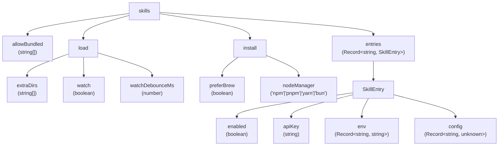
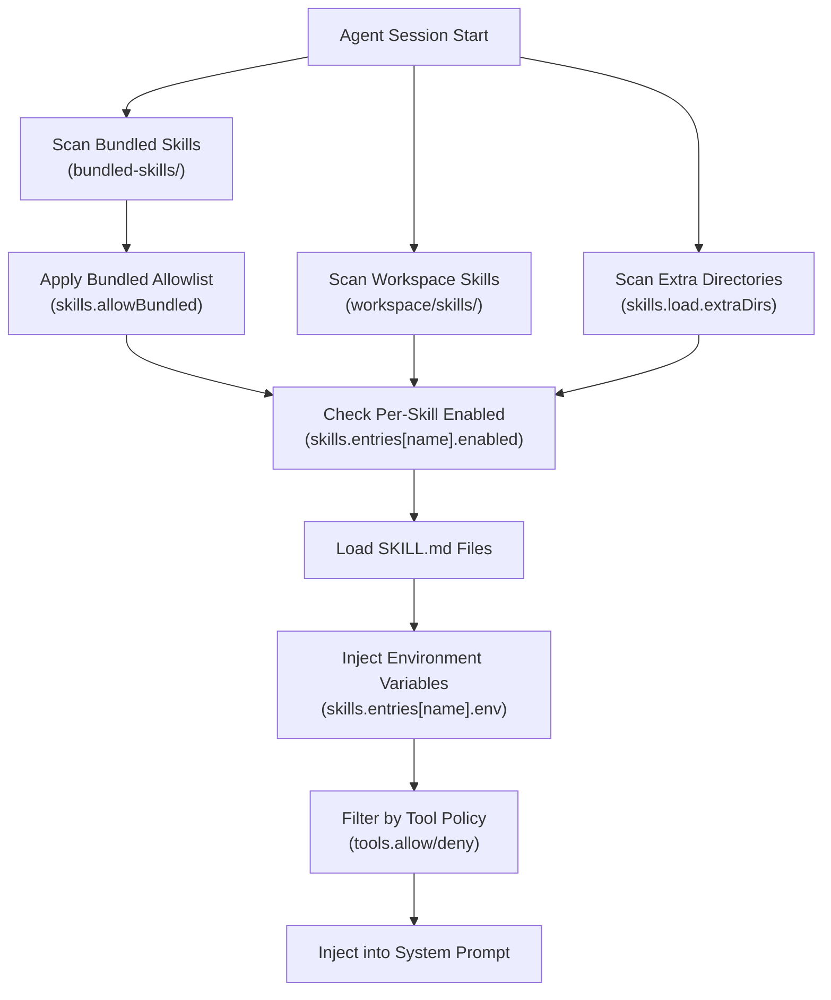
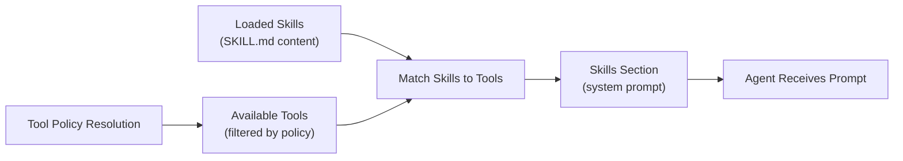
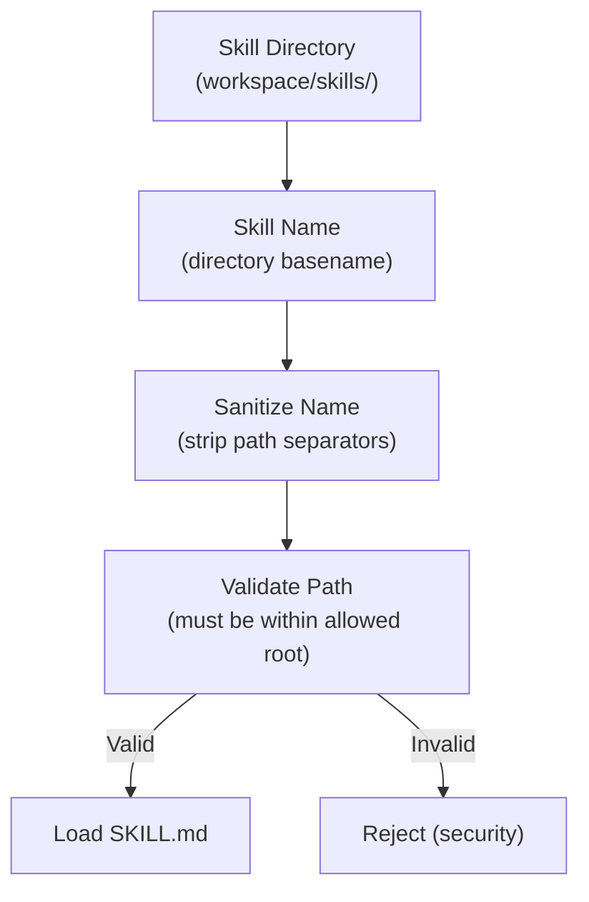

# Page: Skills System

# Skills System

<details>
<summary>Relevant source files</summary>

The following files were used as context for generating this wiki page:

- [CHANGELOG.md](CHANGELOG.md)
- [docs/cli/memory.md](docs/cli/memory.md)
- [docs/cli/sandbox.md](docs/cli/sandbox.md)
- [docs/concepts/memory.md](docs/concepts/memory.md)
- [docs/gateway/background-process.md](docs/gateway/background-process.md)
- [docs/gateway/configuration.md](docs/gateway/configuration.md)
- [docs/gateway/sandbox-vs-tool-policy-vs-elevated.md](docs/gateway/sandbox-vs-tool-policy-vs-elevated.md)
- [docs/gateway/sandboxing.md](docs/gateway/sandboxing.md)
- [docs/platforms/mac/skills.md](docs/platforms/mac/skills.md)
- [docs/tools/elevated.md](docs/tools/elevated.md)
- [docs/tools/index.md](docs/tools/index.md)
- [docs/tools/skills-config.md](docs/tools/skills-config.md)
- [src/agents/bash-process-registry.test.ts](src/agents/bash-process-registry.test.ts)
- [src/agents/bash-process-registry.ts](src/agents/bash-process-registry.ts)
- [src/agents/bash-tools.ts](src/agents/bash-tools.ts)
- [src/agents/memory-search.test.ts](src/agents/memory-search.test.ts)
- [src/agents/memory-search.ts](src/agents/memory-search.ts)
- [src/agents/pi-embedded-helpers.ts](src/agents/pi-embedded-helpers.ts)
- [src/agents/pi-embedded-runner.test.ts](src/agents/pi-embedded-runner.test.ts)
- [src/agents/pi-embedded-runner.ts](src/agents/pi-embedded-runner.ts)
- [src/agents/pi-embedded-subscribe.ts](src/agents/pi-embedded-subscribe.ts)
- [src/agents/pi-tools.ts](src/agents/pi-tools.ts)
- [src/agents/sandbox-explain.test.ts](src/agents/sandbox-explain.test.ts)
- [src/agents/sandbox.ts](src/agents/sandbox.ts)
- [src/cli/memory-cli.test.ts](src/cli/memory-cli.test.ts)
- [src/cli/memory-cli.ts](src/cli/memory-cli.ts)
- [src/cli/models-cli.test.ts](src/cli/models-cli.test.ts)
- [src/config/schema.ts](src/config/schema.ts)
- [src/config/types.tools.ts](src/config/types.tools.ts)
- [src/config/types.ts](src/config/types.ts)
- [src/config/zod-schema.agent-runtime.ts](src/config/zod-schema.agent-runtime.ts)
- [src/config/zod-schema.ts](src/config/zod-schema.ts)
- [src/memory/embeddings.test.ts](src/memory/embeddings.test.ts)
- [src/memory/embeddings.ts](src/memory/embeddings.ts)
- [src/memory/manager.ts](src/memory/manager.ts)

</details>


The Skills System provides documentation and usage guidance to agents about available tools and capabilities. Skills are Markdown files that get injected into the agent's system prompt, enabling the model to understand how to invoke tools correctly.

**Scope**: This page covers skill directories, the `SKILL.md` format, configuration schema, and how skills are loaded into system prompts. For tool security and allowlisting, see [Tool Policy Resolution](#6.3). For tool inventory and parameters, see [Built-in Tools](#6.1).

---

## Overview

Skills bridge the gap between available tools and agent understanding:

- **Markdown-based documentation**: Each skill is a `SKILL.md` file describing a capability
- **System prompt injection**: Skills appear in the agent's system prompt when their tools are available
- **Per-skill configuration**: Environment variables, API keys, and custom config payloads
- **Bundled and user-defined**: OpenClaw ships bundled skills; users can add custom ones
- **Watch support**: Skill directories can be watched for live updates

**Relationship to tools**: Skills document tools. When a tool is available to an agent (via tool policy), its corresponding skill documentation is included in the system prompt.

Sources: [docs/tools/index.md:10-26](), [src/config/zod-schema.ts:518-553](), [CHANGELOG.md:17]()

---

## Skill Directory Structure

Skills live in skill directories, either bundled with OpenClaw or in user-defined locations.

### Layout

```
~/.openclaw/workspace/
  skills/                    # User-defined skills (workspace-relative)
    my-skill/
      SKILL.md               # Skill documentation
      install.sh             # Optional install script
      config.json            # Optional config schema

bundled-skills/              # Bundled skills (shipped with OpenClaw)
  voice-call/
    SKILL.md
  lobster/
    SKILL.md
```

### SKILL.md Format

Each skill directory must contain a `SKILL.md` file with tool usage documentation:

```markdown
# My Skill

Brief description of the capability.

## Usage

- Tool: `my_tool`
- Parameters: `param1`, `param2`
- Example: `my_tool(param1="value")`

## Environment Variables

- `MY_SKILL_API_KEY`: Required API key
- `MY_SKILL_ENDPOINT`: Optional endpoint override
```

**Constraints**:
- Must be named `SKILL.md` (case-sensitive)
- Markdown format
- Referenced by directory name (e.g., `skills/my-skill` → skill name is `my-skill`)
- Skill names are sanitized to prevent path traversal

Sources: [docs/tools/index.md:10-26](), [CHANGELOG.md:17]()

---

## Configuration Schema

Skills are configured via `skills.*` in `openclaw.json`:

```json5
{
  skills: {
    allowBundled: ["voice-call", "lobster"],
    load: {
      extraDirs: ["~/custom-skills", "/srv/team-skills"],
      watch: true,
      watchDebounceMs: 1500
    },
    install: {
      preferBrew: false,
      nodeManager: "pnpm"
    },
    entries: {
      "my-skill": {
        enabled: true,
        apiKey: "sk-...",
        env: { MY_SKILL_ENDPOINT: "https://api.example.com" },
        config: { maxRetries: 3 }
      }
    }
  }
}
```

### Schema Structure



**Field Descriptions**:

| Field | Type | Default | Description |
|-------|------|---------|-------------|
| `skills.allowBundled` | `string[]` | `[]` | Bundled skill names to load (empty = all) |
| `skills.load.extraDirs` | `string[]` | `[]` | Additional skill directories (absolute or workspace-relative) |
| `skills.load.watch` | `boolean` | `false` | Watch skill directories for changes |
| `skills.load.watchDebounceMs` | `number` | `1500` | Debounce delay for file watch events |
| `skills.install.preferBrew` | `boolean` | `false` | Prefer Homebrew for skill dependencies |
| `skills.install.nodeManager` | `string` | `"npm"` | Node package manager for skill installs |
| `skills.entries[name]` | `SkillEntry` | — | Per-skill configuration |

Sources: [src/config/zod-schema.ts:518-553](), [docs/tools/skills-config.md:1-50]()

---

## Skill Loading Flow

Skills are discovered from multiple sources and merged into a single skill registry.

### Loading Pipeline



**Precedence** (later sources override earlier):
1. Bundled skills
2. Workspace skills (`workspace/skills/`)
3. Extra directories (`skills.load.extraDirs`)

**Filtering**:
- **Bundled allowlist**: `skills.allowBundled` restricts which bundled skills are loaded (empty array = load all)
- **Per-skill enabled**: `skills.entries[name].enabled = false` disables a skill
- **Tool policy**: Skills are only included if their corresponding tools pass tool policy

Sources: [src/config/zod-schema.ts:518-553](), [docs/gateway/configuration.md:1-50]()

---

## Skill Entries (Per-Skill Configuration)

Individual skills can be configured via `skills.entries[skillName]`:

### Entry Schema

```json5
{
  skills: {
    entries: {
      "voice-call": {
        enabled: true,
        apiKey: "${TWILIO_AUTH_TOKEN}",
        env: {
          TWILIO_ACCOUNT_SID: "AC...",
          TWILIO_PHONE_NUMBER: "+15555550123"
        },
        config: {
          recordCalls: true,
          maxDurationSeconds: 300
        }
      }
    }
  }
}
```

**Field Usage**:

| Field | Purpose | Example |
|-------|---------|---------|
| `enabled` | Enable/disable this skill | `false` to hide from agents |
| `apiKey` | Skill-specific API key | Twilio, OpenAI, Deepgram keys |
| `env` | Environment variables | Service credentials, endpoints |
| `config` | Skill-defined configuration | Skill-specific tuning parameters |

**Environment Variable Substitution**:
- `apiKey` and `env` values support `${VAR_NAME}` substitution
- Variables are resolved from environment at runtime
- Follows standard OpenClaw env precedence (inline → `.env` → process)

Sources: [src/config/zod-schema.ts:539-549](), [docs/gateway/configuration.md:421-469]()

---

## System Prompt Injection

Skills are injected into the agent's system prompt when their tools are available.

### Injection Flow



**When Skills Appear**:
- A skill is included in the system prompt if:
  1. The skill is loaded (not disabled, passes allowlist)
  2. At least one of the skill's tools is available (passes tool policy)
  3. The session's prompt mode includes skills (default behavior)

**Prompt Structure** (approximate):
```
# System Prompt

[Identity Section]
[Skills Section]
  ## voice-call
  [Content of voice-call/SKILL.md]
  
  ## lobster
  [Content of lobster/SKILL.md]

[Tools Section]
[Memory Section]
[Context Files]
```

**Environment Variable Propagation**:
- `skills.entries[name].env` variables are set in the agent's environment
- These env vars are available to tool execution (e.g., `exec` can reference them)
- Sandboxed sessions inherit skill env vars via Docker `--env` flags

Sources: [src/agents/pi-embedded-runner.ts:1-28](), [docs/agents/system-prompt.md]()

---

## Bundled vs User Skills

OpenClaw distinguishes between bundled skills (shipped with the codebase) and user-defined skills.

### Comparison

| Aspect | Bundled Skills | User Skills |
|--------|---------------|-------------|
| Location | `bundled-skills/` (in OpenClaw install) | `workspace/skills/` or `skills.load.extraDirs` |
| Allowlist | `skills.allowBundled` (empty = all) | Always loaded if `enabled` |
| Examples | `voice-call`, `lobster` | Custom org-specific tools |
| Security | Shipped by OpenClaw maintainers | User responsibility |

### Bundled Skill Allowlist

Control which bundled skills are loaded:

```json5
{
  skills: {
    // Only load these bundled skills:
    allowBundled: ["voice-call", "lobster"]
  }
}
```

**Behavior**:
- **Empty array** (`[]`): Load all bundled skills (default)
- **Non-empty array**: Load only listed bundled skills
- **Workspace/extra skills**: Unaffected by `allowBundled` (always loaded if enabled)

**Use Case**: Reduce prompt bloat by only loading bundled skills you actually use.

Sources: [src/config/zod-schema.ts:520](), [docs/tools/skills-config.md:1-50]()

---

## Skill Installation

Skills can have install scripts and dependencies managed by OpenClaw.

### Install Configuration

```json5
{
  skills: {
    install: {
      preferBrew: true,            // Prefer Homebrew for system dependencies
      nodeManager: "pnpm"           // Use pnpm for Node.js packages
    }
  }
}
```

**Install Behavior**:
- **`preferBrew`**: If `true`, check Homebrew before falling back to other package managers
- **`nodeManager`**: Which Node package manager to use (`npm`, `pnpm`, `yarn`, `bun`)
- **Install scripts**: Skills can include `install.sh` or `package.json` for dependencies
- **Invocation**: OpenClaw does not auto-run install scripts (user must trigger manually or via skill-specific commands)

**Security Note**: Skill install scripts are not automatically executed to prevent arbitrary code execution. Users must explicitly trigger installation (typically via CLI or plugin-specific setup commands).

Sources: [src/config/zod-schema.ts:529-537](), [CHANGELOG.md:142]()

---

## Security Considerations

Skills have security implications due to their system prompt injection and potential for code execution.

### Path Constraints



**Security Measures**:

1. **Path Sanitization** (CHANGELOG.md:17):
   - Skill names are sanitized to prevent path traversal
   - Frontmatter-controlled skill names no longer used as filesystem paths
   - Skill sync destinations confined to sandbox `skills/` root

2. **Install Script Security** (CHANGELOG.md:142):
   - Plugin and hook install scripts disabled via `--ignore-scripts`
   - Prevents lifecycle script execution during plugin install

3. **Skill Code Review**:
   - Code safety scanner for skills and plugins (CHANGELOG.md:194)
   - Credentials redacted from skill config in gateway responses

**Best Practices**:
- Review skill `SKILL.md` content before adding to `allowBundled`
- Audit `install.sh` scripts before manual execution
- Use skill env vars (`skills.entries[name].env`) instead of hardcoding credentials
- Restrict `skills.load.extraDirs` to trusted directories only

Sources: [CHANGELOG.md:17](), [CHANGELOG.md:142](), [CHANGELOG.md:194]()

---

## Example Configurations

### Minimal (Use Bundled Skills)

```json5
{
  skills: {
    // Load all bundled skills (default)
  }
}
```

### Selective Bundled Skills

```json5
{
  skills: {
    allowBundled: ["voice-call"],  // Only voice-call skill
    entries: {
      "voice-call": {
        enabled: true,
        env: {
          TWILIO_ACCOUNT_SID: "${TWILIO_ACCOUNT_SID}",
          TWILIO_AUTH_TOKEN: "${TWILIO_AUTH_TOKEN}"
        }
      }
    }
  }
}
```

### Custom Skills Directory

```json5
{
  skills: {
    load: {
      extraDirs: ["~/my-org-skills", "/opt/shared-skills"],
      watch: true,
      watchDebounceMs: 2000
    },
    entries: {
      "custom-reporting": {
        enabled: true,
        apiKey: "${REPORTING_API_KEY}",
        config: {
          defaultFormat: "pdf",
          maxPages: 50
        }
      }
    }
  }
}
```

### Disable All Skills

```json5
{
  skills: {
    allowBundled: [],  // No bundled skills
    // Do not add extraDirs or entries
  }
}
```

Sources: [docs/tools/skills-config.md:1-50](), [docs/gateway/configuration.md:1-50]()

---

**Related Pages**:
- [Built-in Tools](#6.1) — Tool inventory and parameters
- [Tool Policy Resolution](#6.3) — How tool allowlists filter skills
- [Agent System](#5) — How agents use skills in system prompts
- [Configuration](#4) — Config file structure and validation

---