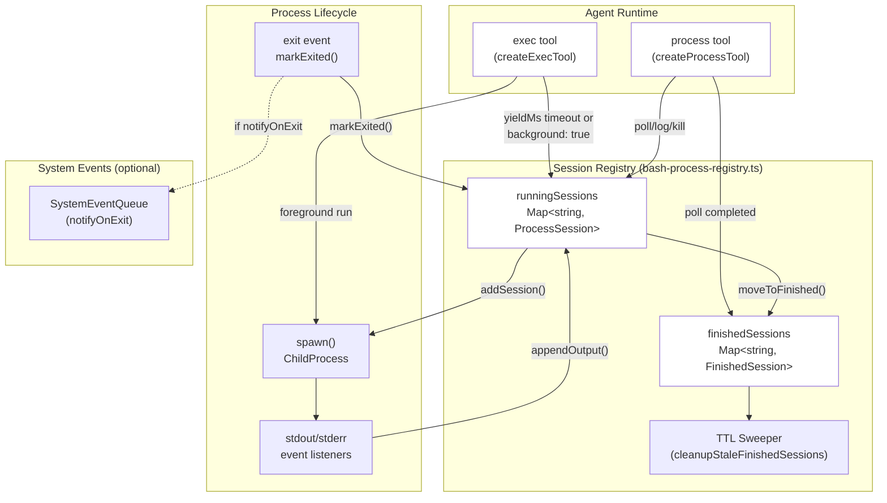
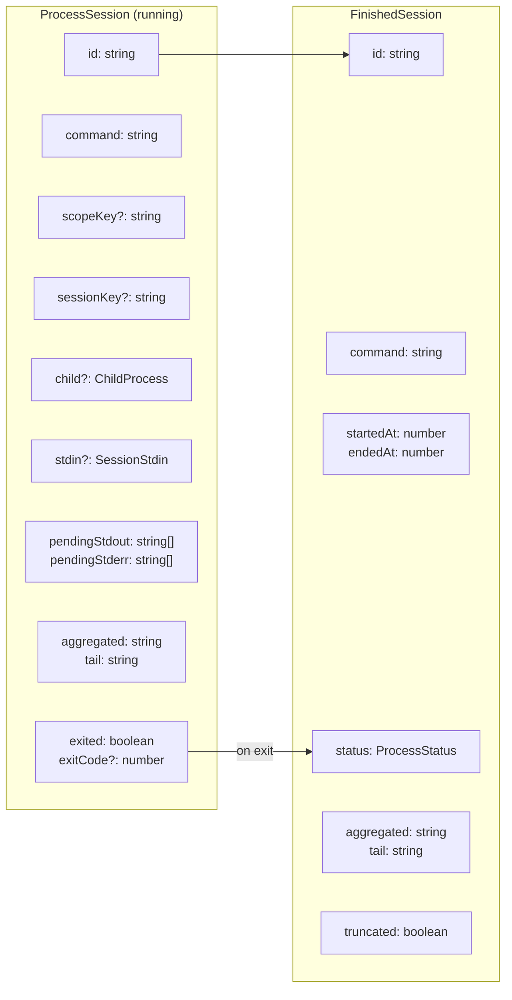
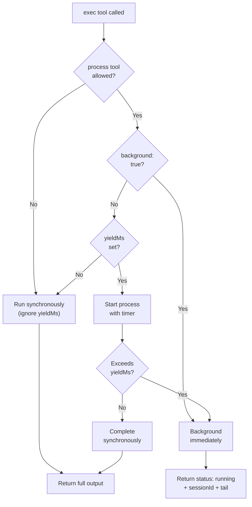
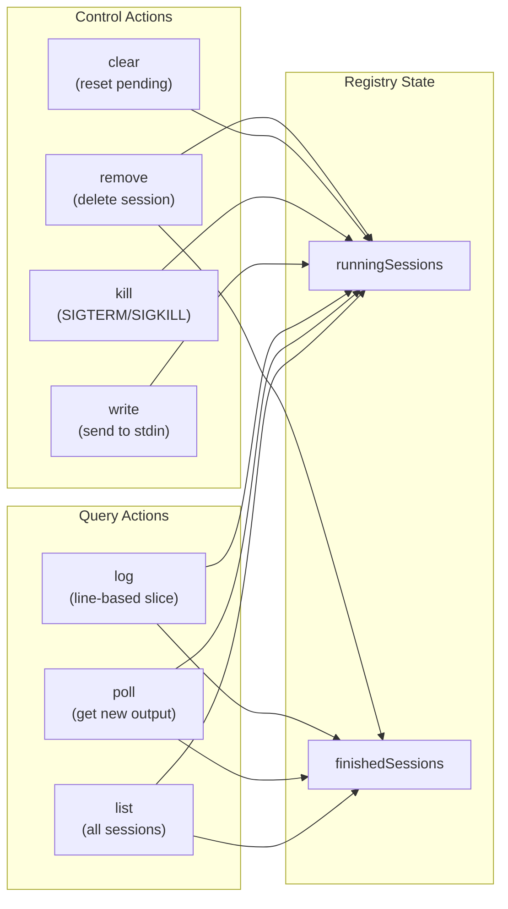
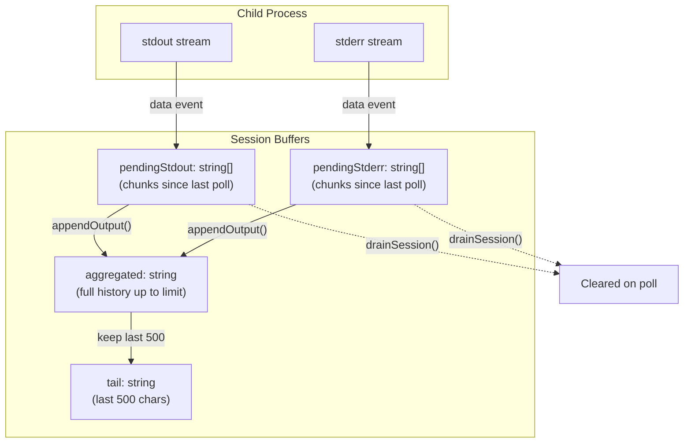
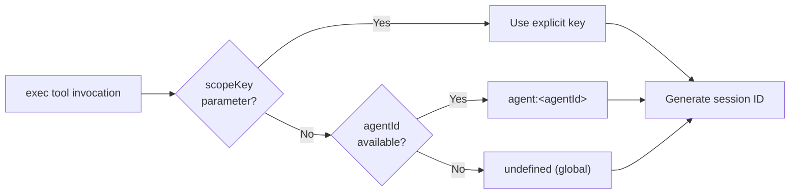
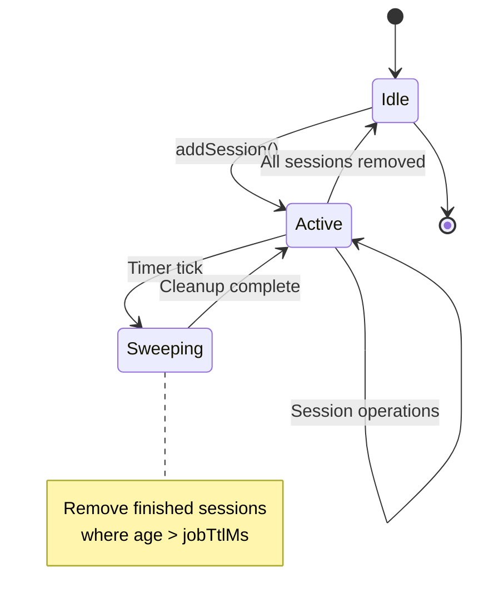
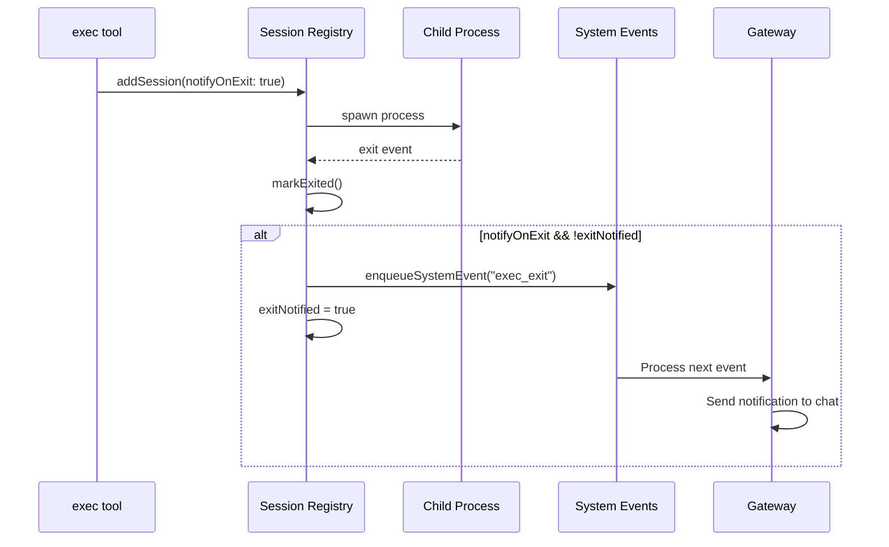

# Page: Background Process Execution

# Background Process Execution

<details>
<summary>Relevant source files</summary>

The following files were used as context for generating this wiki page:

- [docs/gateway/background-process.md](docs/gateway/background-process.md)
- [src/agents/bash-process-registry.test.ts](src/agents/bash-process-registry.test.ts)
- [src/agents/bash-process-registry.ts](src/agents/bash-process-registry.ts)
- [src/agents/bash-tools.ts](src/agents/bash-tools.ts)
- [src/agents/pi-embedded-helpers.ts](src/agents/pi-embedded-helpers.ts)
- [src/agents/pi-embedded-runner.test.ts](src/agents/pi-embedded-runner.test.ts)
- [src/agents/pi-embedded-runner.ts](src/agents/pi-embedded-runner.ts)
- [src/agents/pi-embedded-subscribe.ts](src/agents/pi-embedded-subscribe.ts)
- [src/agents/pi-tools.ts](src/agents/pi-tools.ts)

</details>


## Purpose and Scope

This page documents OpenClaw's background process execution system, which allows long-running shell commands to run asynchronously while the agent continues to function. The system consists of:

- **exec tool** backgrounding via `yieldMs` timeout or explicit `background` flag
- **process tool** for managing active background sessions (poll, log, write, kill, clear)
- **Session registry** for tracking running and finished processes in memory
- **Output buffering** and aggregation strategies
- **Session scoping** to isolate processes per agent

For information about the exec tool's security and sandboxing, see [Tool Security and Sandboxing](#6.2). For the complete tool inventory and parameters, see [Built-in Tools](#6.1).

**Sources:** [docs/gateway/background-process.md:1-47](), [src/agents/bash-tools.ts:1-10]()

---

## Architecture Overview



**Diagram: Background Execution Flow**

The exec tool spawns child processes and optionally registers them in the session registry. When backgrounded, the process tool can poll output, send input via stdin, or kill the session. Finished sessions are kept in memory until the TTL sweeper removes them.

**Sources:** [src/agents/bash-tools.ts:1-10](), [src/agents/bash-process-registry.ts:1-102](), [src/agents/bash-tools.test.ts:70-271]()

---

## Session Registry

The session registry is an in-memory store that tracks both running and finished background processes. It is implemented in [src/agents/bash-process-registry.ts:1-276]().

### Data Structures



**Diagram: Session Data Models**

| Field | Type | Purpose |
|-------|------|---------|
| `id` | `string` | Unique session identifier (slug) |
| `command` | `string` | Original command string (used as session name) |
| `scopeKey` | `string?` | Isolates sessions per agent (format: `agent:<agentId>`) |
| `sessionKey` | `string?` | Optional chat session context for notifications |
| `child` | `ChildProcess?` | Live process handle (running only) |
| `stdin` | `SessionStdin?` | Writable stream for `process write` action |
| `pendingStdout` / `pendingStderr` | `string[]` | Buffered output chunks since last poll |
| `aggregated` | `string` | Full output history (subject to `maxOutputChars`) |
| `tail` | `string` | Last 500 chars for quick display |
| `exitCode` / `exitSignal` | `number?` / `Signal?` | Termination status |
| `truncated` | `boolean` | Whether output exceeded `maxOutputChars` |

**Sources:** [src/agents/bash-process-registry.ts:18-68]()

### Registry Operations

The registry exposes these core functions:

| Function | Purpose | File Location |
|----------|---------|---------------|
| `addSession(session)` | Register a new running session | [bash-process-registry.ts:83-86]() |
| `getSession(id)` | Retrieve a running session by ID | [bash-process-registry.ts:88-90]() |
| `getFinishedSession(id)` | Retrieve a finished session by ID | [bash-process-registry.ts:92-94]() |
| `appendOutput(session, stream, chunk)` | Buffer output from stdout/stderr | [bash-process-registry.ts:101-130]() |
| `drainSession(session)` | Flush pending output and return new content | [bash-process-registry.ts:132-162]() |
| `markExited(session, code, signal)` | Move session to finished state | [bash-process-registry.ts:210-235]() |
| `markBackgrounded(session)` | Flag session as backgrounded | [bash-process-registry.ts:237-239]() |

**Sources:** [src/agents/bash-process-registry.ts:83-239]()

---

## Exec Tool Backgrounding

The exec tool backgrounds commands in two ways:

1. **Automatic yield**: If `yieldMs` is set and the command doesn't complete within that timeframe, it backgrounds automatically.
2. **Explicit background**: If `background: true` is passed, the command backgrounds immediately.

### Backgrounding Conditions



**Diagram: Exec Tool Background Decision Flow**

**Sources:** [src/agents/bash-tools.test.ts:85-117](), [docs/gateway/background-process.md:14-30]()

### Configuration

The exec tool accepts these backgrounding-related parameters:

| Parameter | Type | Default | Description |
|-----------|------|---------|-------------|
| `yieldMs` | `number` | `10000` | Auto-background timeout (milliseconds) |
| `background` | `boolean` | `false` | Background immediately |
| `timeout` | `number` | `1800` | Process kill timeout (seconds) |
| `allowBackground` | `boolean` | derived | Whether backgrounding is allowed (requires process tool) |

Configuration sources (in precedence order):

1. Tool invocation parameters
2. `tools.exec.backgroundMs` (global default for `yieldMs`)
3. `tools.exec.timeoutSec` (global default for `timeout`)
4. Hardcoded defaults

**Sources:** [src/agents/bash-tools.ts:1-10](), [docs/gateway/background-process.md:14-30]()

---

## Process Tool Operations

The process tool provides these actions for managing background sessions:

### Action Reference



**Diagram: Process Tool Action Categories**

**Sources:** [docs/tools/index.md:212-225]()

### Action Details

| Action | Parameters | Returns | Notes |
|--------|------------|---------|-------|
| `list` | `scopeKey?` | Array of session summaries | Filters by scope if provided |
| `poll` | `sessionId` | New output + status | Drains pending buffers; returns immediately |
| `log` | `sessionId`, `offset?`, `limit?` | Line-based output slice | Defaults to last N lines if no offset |
| `write` | `sessionId`, `input` | Confirmation | Writes to process stdin |
| `kill` | `sessionId`, `signal?` | Confirmation | Default signal is `SIGTERM` |
| `clear` | `sessionId` | Confirmation | Resets pending output buffers |
| `remove` | `sessionId` | Confirmation | Deletes session from registry |

**Sources:** [docs/tools/index.md:212-225](), [src/agents/bash-tools.test.ts:206-240]()

### Poll vs Log

**poll** action:
- Returns **new output** since last poll (pending buffers)
- Includes exit status if completed
- Used for incremental updates
- Example: [src/agents/bash-tools.test.ts:100-114]()

**log** action:
- Returns **historical output** with line-based slicing
- `offset` = starting line (0-indexed)
- `limit` = number of lines to return
- Defaults to last N lines when `offset` is omitted
- Example: [src/agents/bash-tools.test.ts:206-240]()

**Sources:** [src/agents/bash-tools.test.ts:206-240]()

---

## Output Buffering and Aggregation

Background processes capture stdout and stderr through event listeners attached to the child process. Output is stored in multiple forms for different access patterns.

### Buffer Types



**Diagram: Output Buffer Flow**

**Sources:** [src/agents/bash-process-registry.ts:101-162]()

### Truncation Strategy

Output is subject to two limits:

| Limit | Default | Environment Variable | Purpose |
|-------|---------|---------------------|---------|
| `maxOutputChars` | 100,000 | `PI_BASH_MAX_OUTPUT_CHARS` | Total aggregated output |
| `pendingMaxOutputChars` | 30,000 | N/A | Pending buffer size (prevents poll spam) |

When output exceeds `maxOutputChars`:
1. `truncated` flag is set to `true`
2. Oldest content is discarded (FIFO)
3. `tail` always preserves the last 500 characters
4. Line-based `log` queries may return partial results

**Sources:** [src/agents/bash-process-registry.ts:7-14](), [src/agents/bash-process-registry.test.ts:18-61]()

### Line-Based Access

The `log` action provides line-based slicing of aggregated output:

```typescript
// Example: get lines 10-15 from session
process.execute("log-call", {
  action: "log",
  sessionId: "abc123",
  offset: 10,
  limit: 5
})
```

Implementation notes from [src/agents/bash-process-registry.ts:164-208]():
- Lines are split on `\n` after normalizing `\r\n`
- When `offset` is omitted, returns the **last N lines** (equivalent to `tail -n`)
- `totalLines` is included in response metadata
- Empty lines count toward the offset/limit

**Sources:** [src/agents/bash-process-registry.ts:164-208](), [src/agents/bash-tools.test.ts:206-240]()

---

## Session Scoping

Sessions are isolated by `scopeKey` to prevent cross-agent process access. This ensures that agents in a multi-agent gateway cannot interfere with each other's background processes.

### Scope Resolution



**Diagram: Scope Key Resolution**

Default scope key format: `agent:<agentId>` (derived from `sessionKey` or explicit `agentId` parameter).

**Sources:** [src/agents/bash-tools.test.ts:242-270](), [src/agents/pi-tools.ts:215]()

### Scoped Isolation

When the process tool performs operations, it filters sessions by scope:

| Operation | Scope Behavior |
|-----------|----------------|
| `list` | Returns only sessions matching the caller's `scopeKey` |
| `poll` / `log` / `write` / `kill` | Fails with `status: "failed"` if session is out of scope |
| `remove` | Only removes in-scope sessions |

Example from tests [src/agents/bash-tools.test.ts:242-270]():

```typescript
// Agent A creates a session
const bashA = createExecTool({ scopeKey: "agent:alpha" });
const resultA = await bashA.execute("call1", { command: "sleep 1", background: true });

// Agent B cannot access Agent A's session
const processB = createProcessTool({ scopeKey: "agent:beta" });
const pollB = await processB.execute("call2", {
  action: "poll",
  sessionId: resultA.details.sessionId
});
expect(pollB.details.status).toBe("failed"); // Out of scope
```

**Sources:** [src/agents/bash-tools.test.ts:242-270]()

---

## Cleanup and TTL

Finished sessions are kept in memory for a configurable TTL (time-to-live), then automatically removed by a sweeper process.

### TTL Configuration

| Setting | Default | Min | Max | Environment Variable |
|---------|---------|-----|-----|---------------------|
| Job TTL | 30 minutes | 1 minute | 3 hours | `PI_BASH_JOB_TTL_MS` |
| Sweep Interval | 5 minutes | N/A | N/A | N/A |

The sweeper runs periodically and removes finished sessions where `Date.now() - endedAt > jobTtlMs`.

**Sources:** [src/agents/bash-process-registry.ts:4-16](), [src/agents/bash-process-registry.test.ts:106-127]()

### Sweeper Lifecycle



**Diagram: Session Sweeper State Machine**

The sweeper starts automatically when the first session is added and stops when the registry is empty.

**Sources:** [src/agents/bash-process-registry.ts:241-276]()

---

## Notifications on Exit

When `notifyOnExit` is enabled for a session, the system enqueues a notification event when the process exits. This is used by the agent runtime to inform the user about completed background tasks.

### Configuration

| Field | Type | Default | Description |
|-------|------|---------|-------------|
| `notifyOnExit` | `boolean` | `false` | Enqueue system event on exit |
| `sessionKey` | `string?` | N/A | Chat session for routing the notification |
| `exitNotified` | `boolean` | `false` | Prevents duplicate notifications |

**Sources:** [src/agents/bash-process-registry.ts:30-32](), [docs/gateway/background-process.md:37-39]()

### Notification Flow



**Diagram: Exit Notification Sequence**

The notification includes:
- Session ID
- Command
- Exit code/signal
- Final output tail

**Sources:** [src/agents/bash-process-registry.ts:210-235](), [src/agents/bash-tools.test.ts:273-304]()

---

## Environment Variable Overrides

The background process system respects these environment variables:

| Variable | Type | Default | Purpose |
|----------|------|---------|---------|
| `PI_BASH_JOB_TTL_MS` | `number` | `1800000` | Finished session TTL (milliseconds) |
| `PI_BASH_MAX_OUTPUT_CHARS` | `number` | `100000` | Maximum aggregated output size |
| `PI_BASH_SWEEPER_INTERVAL_MS` | `number` | `300000` | Cleanup sweep interval (5 minutes) |

These can be set in the shell or via `.env` files. See [Environment Variables](#) for complete precedence rules.

**Sources:** [docs/gateway/background-process.md:37-46](), [src/agents/bash-process-registry.ts:4-16]()

---

## Integration with Tool Security

Background execution respects the tool security model:

1. **Tool policy**: If the `process` tool is denied, exec runs synchronously (backgrounding is disabled).
2. **Sandbox mode**: Background processes inherit the sandbox context of the exec call (container or host).
3. **Elevated mode**: Elevated exec can background on the host even when sandboxed.
4. **Scope isolation**: Agents cannot access each other's sessions.

For details on how tool allow/deny lists work, see [Tool Security and Sandboxing](#6.2). For elevated execution, see [Built-in Tools](#6.1).

**Sources:** [src/agents/bash-tools.test.ts:85-117](), [src/agents/bash-tools.test.ts:175-202]()

---