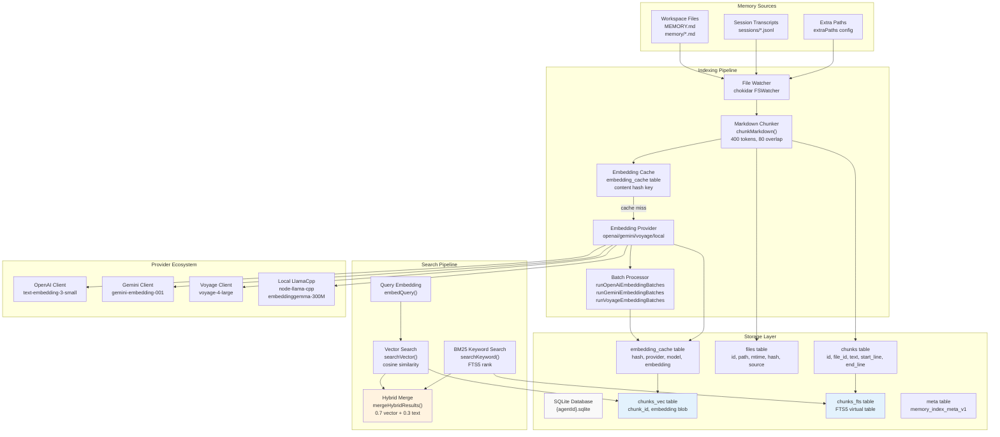
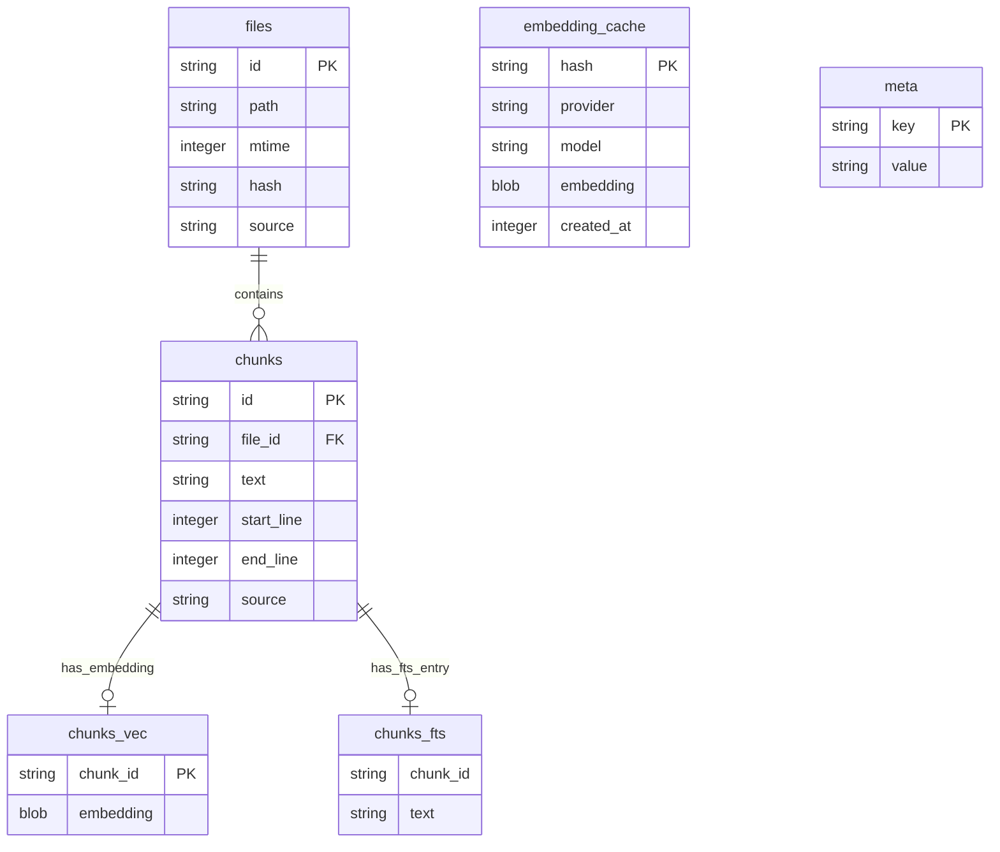
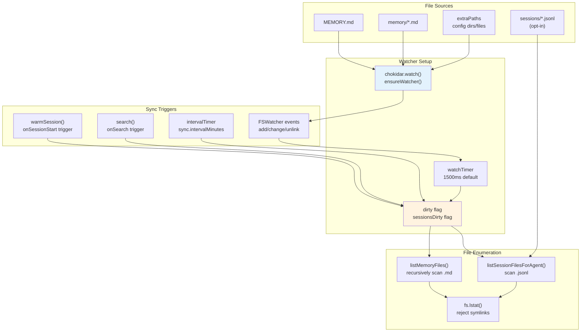
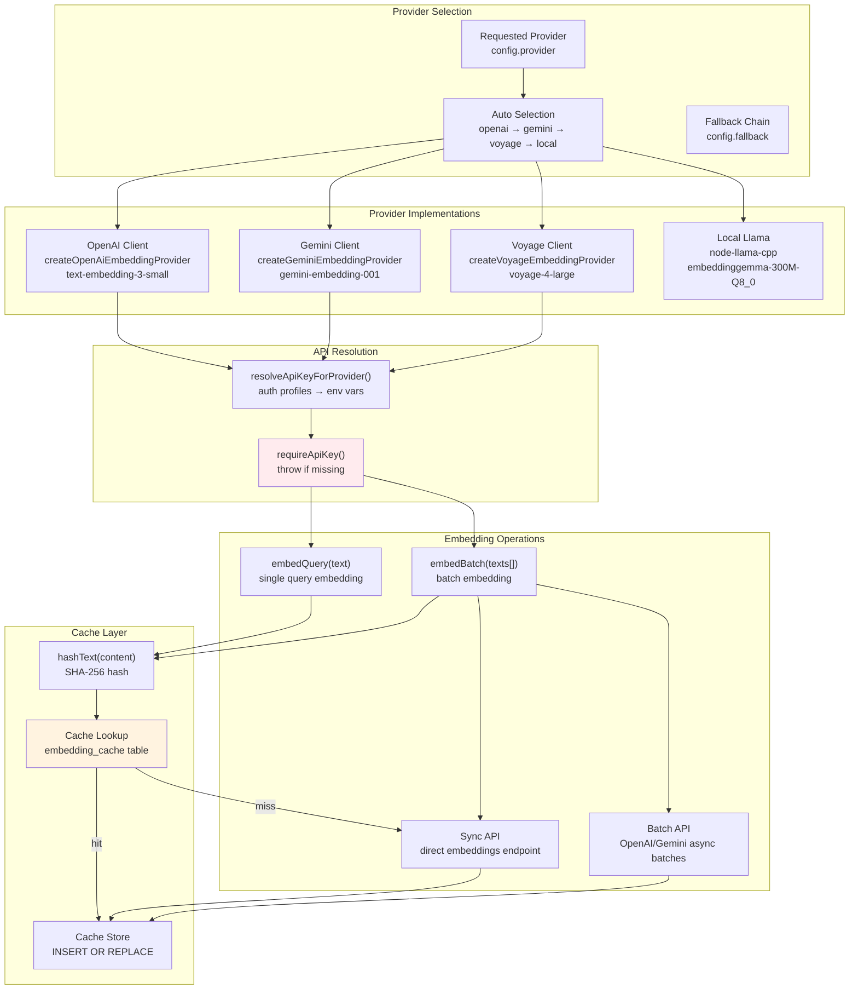
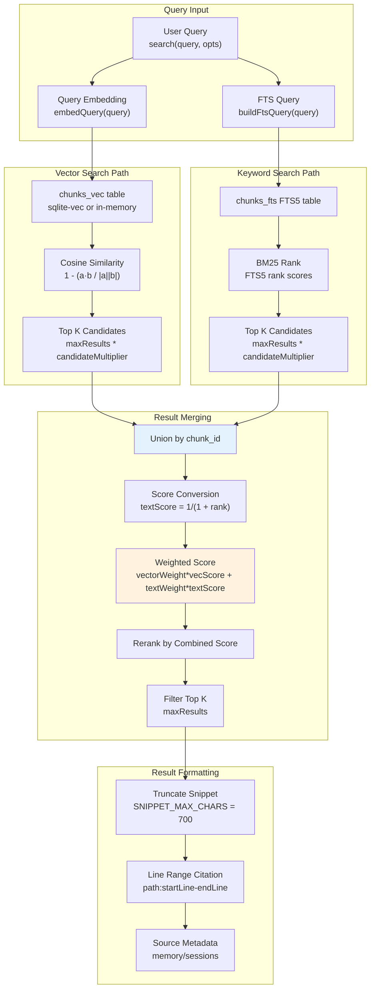
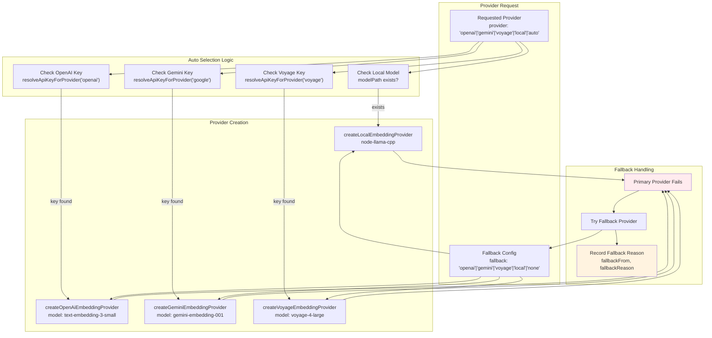
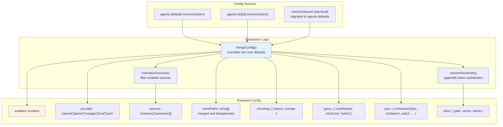

# Page: Memory System

# Memory System

<details>
<summary>Relevant source files</summary>

The following files were used as context for generating this wiki page:

- [CHANGELOG.md](CHANGELOG.md)
- [docs/cli/memory.md](docs/cli/memory.md)
- [docs/cli/sandbox.md](docs/cli/sandbox.md)
- [docs/concepts/memory.md](docs/concepts/memory.md)
- [docs/gateway/configuration.md](docs/gateway/configuration.md)
- [docs/gateway/sandbox-vs-tool-policy-vs-elevated.md](docs/gateway/sandbox-vs-tool-policy-vs-elevated.md)
- [docs/gateway/sandboxing.md](docs/gateway/sandboxing.md)
- [docs/platforms/mac/skills.md](docs/platforms/mac/skills.md)
- [docs/tools/elevated.md](docs/tools/elevated.md)
- [docs/tools/index.md](docs/tools/index.md)
- [docs/tools/skills-config.md](docs/tools/skills-config.md)
- [src/agents/memory-search.test.ts](src/agents/memory-search.test.ts)
- [src/agents/memory-search.ts](src/agents/memory-search.ts)
- [src/agents/sandbox-explain.test.ts](src/agents/sandbox-explain.test.ts)
- [src/agents/sandbox.ts](src/agents/sandbox.ts)
- [src/cli/memory-cli.test.ts](src/cli/memory-cli.test.ts)
- [src/cli/memory-cli.ts](src/cli/memory-cli.ts)
- [src/cli/models-cli.test.ts](src/cli/models-cli.test.ts)
- [src/config/schema.ts](src/config/schema.ts)
- [src/config/types.tools.ts](src/config/types.tools.ts)
- [src/config/types.ts](src/config/types.ts)
- [src/config/zod-schema.agent-runtime.ts](src/config/zod-schema.agent-runtime.ts)
- [src/config/zod-schema.ts](src/config/zod-schema.ts)
- [src/memory/embeddings.test.ts](src/memory/embeddings.test.ts)
- [src/memory/embeddings.ts](src/memory/embeddings.ts)
- [src/memory/manager.ts](src/memory/manager.ts)

</details>


## Purpose and Scope

The Memory System provides semantic search over workspace Markdown files and session transcripts, enabling agents to retrieve relevant context from prior conversations and curated notes. It combines vector embeddings with keyword search (BM25) for hybrid recall, supports multiple embedding providers (OpenAI, Gemini, Voyage, local models), and maintains an SQLite-backed index with automatic synchronization.

For memory file organization and workspace layout, see [Agent Workspace](#6). For memory tool usage in agents, see [Built-in Tools](#6.1). For memory configuration reference, see [Configuration Reference](#4.1).

---

## Architecture Overview

The Memory System consists of three primary subsystems: **indexing** (file watching, chunking, embedding generation), **storage** (SQLite with vector and full-text search extensions), and **search** (hybrid vector+BM25 retrieval).



**Sources:** [src/memory/manager.ts:1-1133](), [docs/concepts/memory.md:1-568]()

---

## Storage Layer

The Memory System uses a per-agent SQLite database stored at `~/.openclaw/memory/{agentId}.sqlite`. The database schema includes five primary tables and supports both vector and full-text search via extensions.

### Database Schema



**Table Descriptions:**

- **`files`** — Tracks indexed Markdown files with source type (`memory` or `sessions`), modification time, and content hash for change detection
- **`chunks`** — Stores chunked text segments with line range metadata for citation
- **`chunks_vec`** — Virtual table (`vec0` when sqlite-vec available) storing Float32 embeddings as blobs
- **`chunks_fts`** — FTS5 virtual table for BM25 keyword search
- **`embedding_cache`** — Content-addressed cache keyed by `(hash, provider, model)` to avoid redundant API calls
- **`meta`** — Stores index metadata including provider, model, chunking params, and vector dimensions

**Sources:** [src/memory/manager.ts:69-106](), [src/memory/memory-schema.ts:1-200]()

### Schema Initialization

Schema creation and validation is handled by `ensureMemoryIndexSchema()`, which creates tables if missing and validates schema integrity. The `meta` table stores `memory_index_meta_v1` with provider/model/chunking fingerprint; mismatches trigger automatic reindexing.

**Sources:** [src/memory/memory-schema.ts:1-200](), [src/memory/manager.ts:227-248]()

---

## Indexing Pipeline

### File Discovery and Watching

The `MemoryIndexManager` uses `chokidar` to watch workspace memory directories (`MEMORY.md`, `memory/*.md`) and optional `extraPaths`. File changes trigger debounced sync operations.



**Sources:** [src/memory/manager.ts:243-267](), [src/memory/internal.ts:1-500](), [src/memory/session-files.ts:1-200]()

### Chunking Strategy

Markdown files are split into overlapping chunks to preserve context boundaries. The `chunkMarkdown()` function uses a token-based sliding window.

**Parameters:**
- `chunkTokens`: Target chunk size (default 400 tokens)
- `chunkOverlap`: Overlap between chunks (default 80 tokens)
- Token estimation: Simple whitespace split approximation (~1 token per word)

**Algorithm:**
1. Split text into lines
2. Accumulate lines until token target reached
3. When threshold exceeded, emit chunk with line range
4. Slide window back by `overlap` tokens and continue

**Sources:** [src/memory/internal.ts:200-350](), [src/agents/memory-search.ts:76-86]()

### Embedding Generation

Embeddings are generated through the `EmbeddingProvider` abstraction, which supports multiple backends with automatic fallback.



**Sources:** [src/memory/embeddings.ts:1-300](), [src/memory/embeddings-openai.ts:1-200](), [src/memory/embeddings-gemini.ts:1-200](), [src/memory/embeddings-voyage.ts:1-200]()

### Batch Processing

For large indexing operations, the Memory System supports asynchronous batch embedding APIs for OpenAI, Gemini, and Voyage. Batch processing reduces costs and improves throughput.

**Batch Configuration:**
```typescript
remote: {
  batch: {
    enabled: boolean;        // default: false
    wait: boolean;           // default: true (poll until complete)
    concurrency: number;     // default: 2 (parallel batch jobs)
    pollIntervalMs: number;  // default: 2000
    timeoutMinutes: number;  // default: 60
  }
}
```

**Batch Workflow:**
1. Chunk texts into batches (max 8000 tokens per batch)
2. Submit batch jobs via provider API (`runOpenAiEmbeddingBatches`, `runGeminiEmbeddingBatches`, `runVoyageEmbeddingBatches`)
3. Poll batch status until complete (or fire-and-forget if `wait: false`)
4. Retrieve results and update cache + vector table

**Batch Failure Handling:**
- Track failure count (`batchFailureCount`)
- After `BATCH_FAILURE_LIMIT` (2) failures, disable batch processing for session
- Fall back to sync API

**Sources:** [src/memory/manager.ts:900-1100](), [src/memory/batch-openai.ts:1-400](), [src/memory/batch-gemini.ts:1-400](), [src/memory/batch-voyage.ts:1-400]()

### Sync Orchestration

The `sync()` method orchestrates the full indexing pipeline:

1. **File Discovery** — List changed files (memory + sessions)
2. **Database Cleanup** — Remove stale entries for deleted/modified files
3. **Chunking** — Split files into chunks with line ranges
4. **Embedding Lookup** — Check cache for each chunk
5. **Batch Embedding** — Generate embeddings for cache misses
6. **Storage** — Insert chunks, embeddings, and FTS entries
7. **Progress Reporting** — Emit sync progress updates via callback

**Sources:** [src/memory/manager.ts:390-700]()

---

## Search System

### Hybrid Search Architecture

The Memory System implements hybrid search by combining vector similarity (semantic understanding) with BM25 keyword matching (exact token relevance), weighted and merged for final ranking.



**Sources:** [src/memory/manager.ts:265-314](), [src/memory/manager-search.ts:1-300](), [src/memory/hybrid.ts:1-200]()

### Vector Search Implementation

Vector search uses cosine similarity to rank chunks by semantic relevance. When the sqlite-vec extension is available, queries run in-database; otherwise, embeddings are loaded into memory for JS-based distance calculation.

**sqlite-vec Path:**
```sql
SELECT c.id, c.text, c.start_line, c.end_line, c.source, f.path,
       vec_distance_cosine(v.embedding, ?) as distance
FROM chunks c
JOIN files f ON c.file_id = f.id
JOIN chunks_vec v ON c.id = v.chunk_id
WHERE 1=1 AND <source_filter>
ORDER BY distance ASC
LIMIT ?
```

**Fallback Path:**
1. Load all embeddings from `chunks_vec`
2. Compute cosine distance in JS: `1 - dot(a, b) / (norm(a) * norm(b))`
3. Sort by distance (ascending)
4. Return top K

**Sources:** [src/memory/manager-search.ts:50-200](), [src/memory/sqlite-vec.ts:1-100]()

### BM25 Keyword Search

BM25 search uses SQLite's FTS5 virtual table for token-based ranking. The `buildFtsQuery()` function converts user queries into FTS5 syntax.

**Query Transformation:**
- Strip special FTS5 operators (`NEAR`, `AND`, `OR`, `NOT`)
- Quote phrases to preserve token order
- Handle negation via `NOT` operator

**FTS5 Query:**
```sql
SELECT c.id, c.text, c.start_line, c.end_line, c.source, f.path,
       rank as bm25_rank
FROM chunks_fts fts
JOIN chunks c ON fts.chunk_id = c.id
JOIN files f ON c.file_id = f.id
WHERE fts MATCH ? AND <source_filter>
ORDER BY rank
LIMIT ?
```

**Score Conversion:**
`textScore = 1 / (1 + max(0, bm25_rank))`

**Sources:** [src/memory/manager-search.ts:200-350](), [src/memory/hybrid.ts:1-100]()

### Hybrid Result Merging

Results from vector and keyword paths are unioned by chunk ID and assigned a combined score:

```
finalScore = vectorWeight * vectorScore + textWeight * textScore
```

**Default Weights:**
- `vectorWeight`: 0.7 (semantic relevance)
- `textWeight`: 0.3 (keyword match)

**Configurable via:**
```typescript
agents.defaults.memorySearch.query.hybrid: {
  enabled: boolean;
  vectorWeight: number;
  textWeight: number;
  candidateMultiplier: number;  // expand candidates before merge
}
```

**Sources:** [src/memory/hybrid.ts:80-180](), [src/memory/manager.ts:305-314]()

---

## Embedding Providers

### Provider Selection and Fallback

The Memory System supports four embedding provider types with automatic fallback when the requested provider fails.



**Sources:** [src/memory/embeddings.ts:75-250](), [src/memory/manager.ts:169-203]()

### OpenAI Provider

**Implementation:** `createOpenAiEmbeddingProvider()`

**Features:**
- Default model: `text-embedding-3-small` (1536 dimensions)
- Batch API support via `runOpenAiEmbeddingBatches()`
- Custom endpoint support (`remote.baseUrl`)
- Header merging for proxy scenarios

**API Key Resolution:**
1. `remote.apiKey` (explicit override)
2. `models.providers.openai.apiKey`
3. Auth profiles (`auth.profiles[].provider=openai`)
4. `OPENAI_API_KEY` environment variable

**Sources:** [src/memory/embeddings-openai.ts:1-200](), [src/memory/batch-openai.ts:1-400]()

### Gemini Provider

**Implementation:** `createGeminiEmbeddingProvider()`

**Features:**
- Default model: `gemini-embedding-001` (768 dimensions)
- Native Gemini embeddings API (not OpenAI-compatible)
- Batch API support via `runGeminiEmbeddingBatches()`
- Task type support (`RETRIEVAL_DOCUMENT`, `RETRIEVAL_QUERY`)

**API Key Resolution:**
1. `remote.apiKey`
2. `models.providers.google.apiKey`
3. Auth profiles (`auth.profiles[].provider=google`)
4. `GEMINI_API_KEY` environment variable

**Sources:** [src/memory/embeddings-gemini.ts:1-200](), [src/memory/batch-gemini.ts:1-400]()

### Voyage Provider

**Implementation:** `createVoyageEmbeddingProvider()`

**Features:**
- Default model: `voyage-4-large` (1024 dimensions)
- Batch API support via `runVoyageEmbeddingBatches()`
- Input type specification (`input_type: "document"/"query"`)
- OpenAI-compatible endpoint

**API Key Resolution:**
1. `remote.apiKey`
2. `models.providers.voyage.apiKey`
3. Auth profiles (`auth.profiles[].provider=voyage`)
4. `VOYAGE_API_KEY` environment variable

**Sources:** [src/memory/embeddings-voyage.ts:1-200](), [src/memory/batch-voyage.ts:1-400]()

### Local Provider (node-llama-cpp)

**Implementation:** `createLocalEmbeddingProvider()`

**Features:**
- Default model: `hf:ggml-org/embeddinggemma-300M-GGUF/embeddinggemma-300M-Q8_0.gguf`
- Auto-download from HuggingFace on first use
- No API key required
- Runs fully offline after initial download

**Model Resolution:**
1. Check `local.modelPath` config
2. If `hf:` prefix, resolve via `node-llama-cpp` HF loader
3. If local path, resolve and load GGUF file
4. Fall back to default model

**Sources:** [src/memory/embeddings.ts:82-160](), [src/memory/node-llama.ts:1-100]()

---

## Configuration Resolution

Memory search configuration is resolved by merging global defaults (`agents.defaults.memorySearch`) with per-agent overrides (`agents.list[].memorySearch`). The `resolveMemorySearchConfig()` function handles this merge.



**Merge Rules:**
- Per-agent settings override global defaults
- Array fields (e.g., `extraPaths`, `sources`) are merged and deduplicated
- Nested objects (e.g., `chunking`, `query.hybrid`) merge recursively
- Explicit `enabled: false` disables memory search for that agent

**Default Values:**
```typescript
{
  enabled: true,
  sources: ["memory"],
  provider: "auto",
  fallback: "none",
  chunking: { tokens: 400, overlap: 80 },
  query: {
    maxResults: 6,
    minScore: 0.35,
    hybrid: {
      enabled: true,
      vectorWeight: 0.7,
      textWeight: 0.3,
      candidateMultiplier: 4
    }
  },
  sync: {
    onSessionStart: true,
    onSearch: true,
    watch: true,
    watchDebounceMs: 1500,
    intervalMinutes: 0
  },
  cache: { enabled: true, maxEntries: 50000 },
  store: { vector: { enabled: true } }
}
```

**Sources:** [src/agents/memory-search.ts:1-220](), [src/config/types.tools.ts:224-307]()

---

## CLI Interface

The Memory System exposes three CLI commands via `openclaw memory`:

### `openclaw memory status`

Displays index status, source counts, provider info, and optional deep probes.

**Usage:**
```bash
openclaw memory status [--agent <id>] [--deep] [--index] [--verbose] [--json]
```

**Flags:**
- `--agent <id>`: Scope to single agent (default: all configured agents)
- `--deep`: Probe vector availability and embedding provider readiness
- `--index`: Run full reindex (implies `--deep`)
- `--verbose`: Emit detailed indexing logs
- `--json`: Output JSON instead of formatted text

**Output:**
- Indexed files/chunks per source (memory, sessions)
- Backend type (builtin or qmd)
- Provider and model
- Vector status (enabled, available, dims, extension path)
- FTS status (enabled, available)
- Embedding cache status (entries, max)
- Batch processing status (enabled, failures, config)
- Fallback reason (if applicable)

**Sources:** [src/cli/memory-cli.ts:243-370](), [docs/cli/memory.md:1-46]()

### `openclaw memory index`

Manually triggers a full reindex of memory sources.

**Usage:**
```bash
openclaw memory index [--agent <id>] [--force] [--verbose]
```

**Flags:**
- `--agent <id>`: Scope to single agent
- `--force`: Force reindex even if index is clean
- `--verbose`: Emit detailed indexing logs

**Behavior:**
1. Calls `manager.sync({ reason: "cli", force: true })`
2. Reports progress via progress bar
3. Exits with code 1 on indexing failure

**Sources:** [src/cli/memory-cli.ts:281-310](), [docs/cli/memory.md:22-46]()

### `openclaw memory search`

Executes a memory search and prints results.

**Usage:**
```bash
openclaw memory search "<query>" [--agent <id>] [--max-results <n>] [--json]
```

**Flags:**
- `--agent <id>`: Scope to single agent
- `--max-results <n>`: Override default max results
- `--json`: Output JSON instead of formatted text

**Output:**
- Snippet text (truncated to 700 chars)
- File path and line range
- Source type (memory/sessions)
- Combined score
- Provider and model used

**Sources:** [src/cli/memory-cli.ts:450-550](), [docs/cli/memory.md:22-46]()

---

## Tools Integration

The Memory System exposes two tools to agents: `memory_search` and `memory_get`.

### `memory_search` Tool

**Purpose:** Semantic search over workspace memory and session transcripts.

**Parameters:**
```typescript
{
  query: string;              // required
  maxResults?: number;        // default from config
  minScore?: number;          // default from config
}
```

**Returns:**
```typescript
{
  results: Array<{
    snippet: string;          // truncated to ~700 chars
    path: string;             // workspace-relative path
    startLine: number;        // citation line range
    endLine: number;
    score: number;            // combined vector+text score
    source: "memory"|"sessions";
    provider: string;         // embedding provider used
    model: string;            // embedding model used
  }>;
  backend: "builtin"|"qmd";
  totalResults: number;
}
```

**Authorization:** Available only when `memorySearch.enabled` resolves true for the agent.

**Sources:** [src/memory/manager.ts:265-314](), [docs/concepts/memory.md:350-362]()

### `memory_get` Tool

**Purpose:** Read a specific memory file by path.

**Parameters:**
```typescript
{
  relPath: string;            // required (workspace-relative)
  from?: number;              // start line (1-indexed)
  lines?: number;             // line count
}
```

**Returns:**
```typescript
{
  text: string;               // file content (or line slice)
  path: string;               // workspace-relative path
}
```

**Path Validation:**
- Restricted to workspace memory files (`MEMORY.md`, `memory/*.md`)
- Additional allowed paths from `extraPaths` config
- Symlinks rejected
- Non-Markdown files rejected

**Sources:** [src/memory/manager.ts:405-468](), [docs/concepts/memory.md:350-362]()

---

## QMD Backend (Experimental)

The Memory System supports an optional QMD (Query Memory Database) backend as an alternative to the built-in SQLite indexer. QMD is a local-first search sidecar that combines BM25 + vectors + reranking.

**Configuration:**
```json5
{
  memory: {
    backend: "qmd",
    citations: "auto",
    qmd: {
      command: "qmd",
      searchMode: "query",
      includeDefaultMemory: true,
      paths: [{ name: "docs", path: "~/notes", pattern: "**/*.md" }],
      update: { interval: "5m", debounceMs: 15000 },
      limits: { maxResults: 6, timeoutMs: 4000 }
    }
  }
}
```

**Key Differences:**
- QMD runs as a separate CLI process (`qmd` binary on PATH)
- Uses Bun + `node-llama-cpp` for local embeddings
- Stores state in XDG dirs under `~/.openclaw/agents/{agentId}/qmd/`
- Supports additional search modes (`query`, `search`, `vsearch`)
- Auto-downloads GGUF models from HuggingFace on first use

**Fallback:** If QMD subprocess fails, the Memory System automatically falls back to the builtin SQLite indexer.

**Sources:** [docs/concepts/memory.md:107-243](), [src/config/zod-schema.ts:35-93]()

---

## Session Transcript Indexing

The Memory System can optionally index session transcripts (JSONL files) for semantic search over recent conversations.

**Configuration:**
```json5
{
  agents: {
    defaults: {
      memorySearch: {
        experimental: { sessionMemory: true },
        sources: ["memory", "sessions"],
        sync: {
          sessions: {
            deltaBytes: 100000,      // ~100 KB threshold
            deltaMessages: 50        // JSONL line threshold
          }
        }
      }
    }
  }
}
```

**Behavior:**
- Opt-in via `experimental.sessionMemory` flag
- Transcripts chunked and embedded like Markdown files
- Session updates debounced by delta thresholds (bytes + message count)
- Indexed asynchronously in background
- Results include `source: "sessions"` metadata

**Delta Tracking:**
- `sessionDeltas` map tracks last indexed size per session file
- `sessionsDirtyFiles` set accumulates changed files
- Batch indexing triggered when aggregate deltas exceed thresholds

**Sources:** [src/memory/manager.ts:850-1000](), [src/memory/session-files.ts:1-200](), [docs/concepts/memory.md:462-503]()

---

## Performance Considerations

### Embedding Cache Hit Rate

The embedding cache is critical for performance during reindexing and frequent updates. Cache effectiveness depends on:
- Content stability (unchanged chunks = cache hits)
- Provider/model consistency (cache keyed by both)
- Cache size limits (`cache.maxEntries`)

**Metrics:** Check `status().cache.entries` to monitor cache growth.

### sqlite-vec Acceleration

When the sqlite-vec extension is available, vector search runs entirely in SQLite, avoiding large memory allocations for embedding arrays. Without sqlite-vec, all embeddings are loaded into JS for cosine similarity calculations.

**Detection:** Check `status().vector.available` (true/false/null).

### Batch API Throughput

Batch APIs (OpenAI, Gemini, Voyage) significantly reduce embedding costs and latency for large corpus indexing. Enable via `remote.batch.enabled: true`.

**Tradeoff:** Batch jobs are asynchronous; `wait: true` (default) blocks sync until completion, while `wait: false` allows immediate return but defers embedding generation.

### FTS5 vs No-FTS Fallback

When FTS5 is unavailable (missing `fts5` module), hybrid search falls back to vector-only mode. This degrades exact token matching but preserves semantic recall.

**Detection:** Check `status().fts.available` (true/false) and `status().fts.loadError`.

**Sources:** [src/memory/manager.ts:470-565](), [docs/concepts/memory.md:370-423]()

---