# Page: Memory Configuration

# Memory Configuration

<details>
<summary>Relevant source files</summary>

The following files were used as context for generating this wiki page:

- [CHANGELOG.md](CHANGELOG.md)
- [docs/cli/memory.md](docs/cli/memory.md)
- [docs/cli/sandbox.md](docs/cli/sandbox.md)
- [docs/concepts/memory.md](docs/concepts/memory.md)
- [docs/gateway/configuration.md](docs/gateway/configuration.md)
- [docs/gateway/sandbox-vs-tool-policy-vs-elevated.md](docs/gateway/sandbox-vs-tool-policy-vs-elevated.md)
- [docs/gateway/sandboxing.md](docs/gateway/sandboxing.md)
- [docs/platforms/mac/skills.md](docs/platforms/mac/skills.md)
- [docs/tools/elevated.md](docs/tools/elevated.md)
- [docs/tools/index.md](docs/tools/index.md)
- [docs/tools/skills-config.md](docs/tools/skills-config.md)
- [src/agents/memory-search.test.ts](src/agents/memory-search.test.ts)
- [src/agents/memory-search.ts](src/agents/memory-search.ts)
- [src/agents/sandbox-explain.test.ts](src/agents/sandbox-explain.test.ts)
- [src/agents/sandbox.ts](src/agents/sandbox.ts)
- [src/cli/memory-cli.test.ts](src/cli/memory-cli.test.ts)
- [src/cli/memory-cli.ts](src/cli/memory-cli.ts)
- [src/cli/models-cli.test.ts](src/cli/models-cli.test.ts)
- [src/config/schema.ts](src/config/schema.ts)
- [src/config/types.tools.ts](src/config/types.tools.ts)
- [src/config/types.ts](src/config/types.ts)
- [src/config/zod-schema.agent-runtime.ts](src/config/zod-schema.agent-runtime.ts)
- [src/config/zod-schema.ts](src/config/zod-schema.ts)
- [src/memory/embeddings.test.ts](src/memory/embeddings.test.ts)
- [src/memory/embeddings.ts](src/memory/embeddings.ts)
- [src/memory/manager.ts](src/memory/manager.ts)

</details>


This page documents the memory system configuration surface. Memory configuration controls embedding providers, storage backends (builtin SQLite or QMD sidecar), indexing behavior, and search parameters. These settings live under `memory.*` (backend selection) and `agents.defaults.memorySearch.*` (per-agent indexing behavior).

For runtime memory search behavior and the memory file layout, see [Memory](#7). For memory indexing operations, see [Memory Indexing](#7.2). For memory search mechanics, see [Memory Search](#7.3).

---

## Configuration Hierarchy

Memory configuration merges settings from multiple layers:

1. **Global backend config** (`memory.*`) — backend selection, QMD settings, citation mode
2. **Agent defaults** (`agents.defaults.memorySearch.*`) — embedding provider, storage, chunking, sync, query settings
3. **Per-agent overrides** (`agents.list[].memorySearch.*`) — agent-specific overrides for all settings

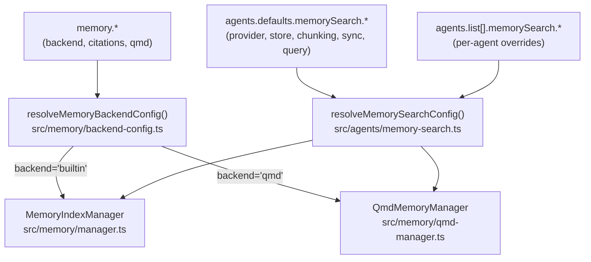

**Sources:** [src/memory/backend-config.ts:1-212](), [src/agents/memory-search.ts:1-241]()

---

## Backend Selection

The global `memory.backend` setting selects the indexing and search engine:

| Backend | Description | Config Key | Implementation |
|---------|-------------|------------|----------------|
| `builtin` | SQLite + sqlite-vec, fully embedded | `memory.backend = "builtin"` | [src/memory/manager.ts:108-606]() |
| `qmd` | External [QMD](https://github.com/tobi/qmd) sidecar process | `memory.backend = "qmd"` | [src/memory/qmd-manager.ts:51-625]() |

### Configuration Schema

```json5
{
  memory: {
    backend: "builtin",           // "builtin" or "qmd"
    citations: "auto",            // "auto", "on", "off"
    qmd: { /* QMD-specific config (see below) */ }
  }
}
```

**Backend Selection Flow:**

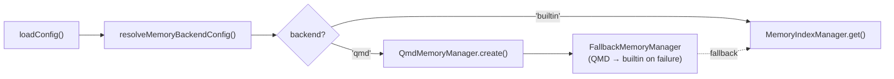

**Sources:** [src/memory/backend-config.ts:57-68](), [src/memory/search-manager.ts:19-65]()

---

## Embedding Provider Configuration

The `agents.defaults.memorySearch.provider` setting controls which embedding API or local model is used for vector indexing.

### Provider Options

| Provider | Description | Default Model | Config Key |
|----------|-------------|---------------|------------|
| `openai` | OpenAI embeddings API | `text-embedding-3-small` | `provider: "openai"` |
| `gemini` | Google Gemini embeddings API | `gemini-embedding-001` | `provider: "gemini"` |
| `local` | Local GGUF via node-llama-cpp | `hf:ggml-org/embeddinggemma-300M-GGUF/...` | `provider: "local"` |
| `auto` | Auto-select based on available keys/files | — | `provider: "auto"` (default) |

### Provider Resolution

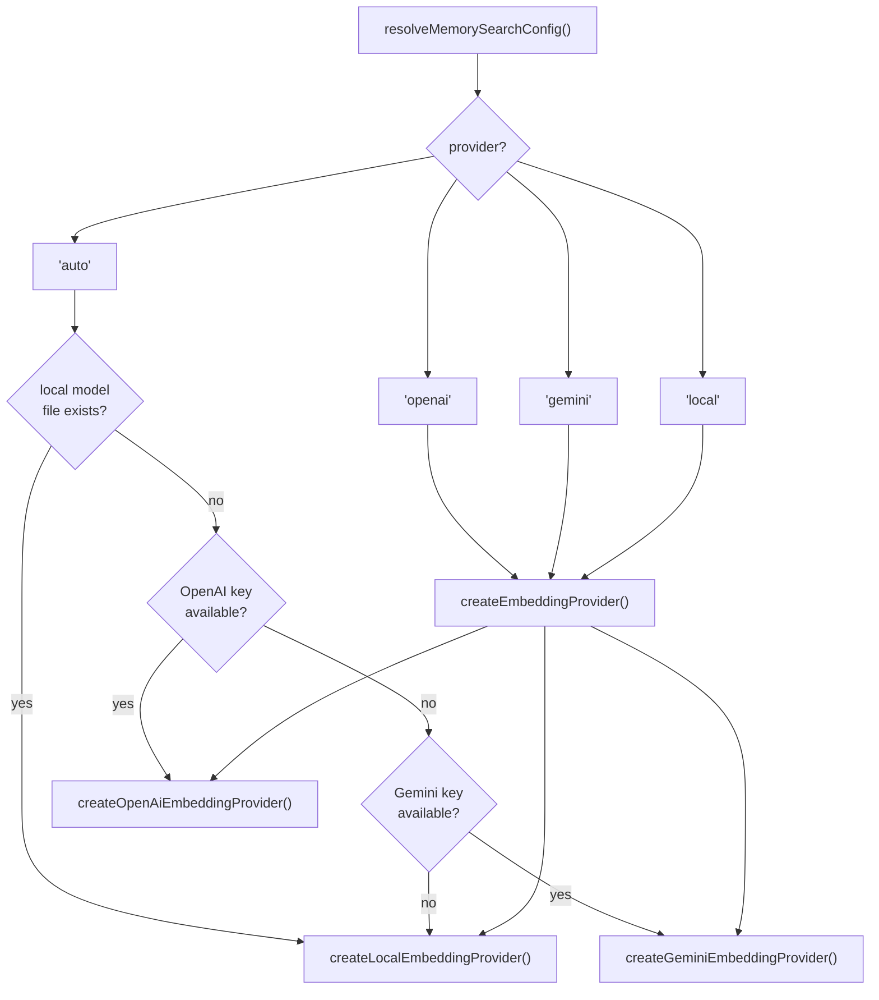

**Sources:** [src/agents/memory-search.ts:73-241](), [src/memory/embeddings.ts:37-183]()

### Remote Provider Configuration

For `openai` and `gemini` providers, the `remote` section allows custom endpoints and headers:

```json5
{
  agents: {
    defaults: {
      memorySearch: {
        provider: "openai",
        model: "text-embedding-3-small",
        remote: {
          baseUrl: "https://api.openrouter.ai/v1",  // override endpoint
          apiKey: "sk-...",                          // explicit API key
          headers: { "X-Custom": "value" },          // extra headers
          batch: {
            enabled: true,      // use batch API (OpenAI/Gemini)
            wait: true,         // wait for batch completion
            concurrency: 2,     // max concurrent batch jobs
            pollIntervalMs: 2000,
            timeoutMinutes: 60
          }
        }
      }
    }
  }
}
```

**OpenAI Batch API:** When `remote.batch.enabled = true`, the builtin backend uses the [OpenAI Batch API](https://platform.openai.com/docs/api-reference/batch) for large backfills, which offers discounted pricing and async processing.

**Sources:** [src/memory/manager.ts:120-243](), [src/memory/batch-openai.ts:1-282](), [src/memory/batch-gemini.ts:1-220]()

### Local Provider Configuration

For `local` provider, specify a GGUF model path or Hugging Face URI:

```json5
{
  agents: {
    defaults: {
      memorySearch: {
        provider: "local",
        local: {
          modelPath: "hf:ggml-org/embeddinggemma-300M-GGUF/embeddinggemma-300M-Q8_0.gguf",
          modelCacheDir: "~/.cache/openclaw-llama"  // optional cache dir
        },
        fallback: "openai"  // fallback if local fails
      }
    }
  }
}
```

**Auto-download:** When `modelPath` is a `hf:` URI, `node-llama-cpp` automatically downloads the model to cache. Requires `pnpm approve-builds` for native bindings.

**Sources:** [src/memory/embeddings.ts:77-114](), [src/agents/memory-search.ts:168-171]()

---

## Storage Configuration

The `memorySearch.store` section controls the SQLite index location and vector extension settings.

### Storage Schema

```json5
{
  agents: {
    defaults: {
      memorySearch: {
        store: {
          driver: "sqlite",                              // always "sqlite"
          path: "~/.openclaw/memory/{agentId}.sqlite",   // index DB path
          vector: {
            enabled: true,                                // use sqlite-vec extension
            extensionPath: "/opt/homebrew/lib/sqlite-vec.dylib"  // optional override
          }
        }
      }
    }
  }
}
```

### Storage Path Resolution

The `path` field supports `{agentId}` token substitution for per-agent indexes:

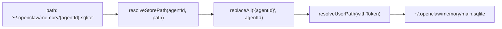

**Sources:** [src/agents/memory-search.ts:109-117]()

### sqlite-vec Extension

When `store.vector.enabled = true`, the builtin backend uses [sqlite-vec](https://github.com/asg017/sqlite-vec) for fast in-database vector search. If the extension fails to load, the manager falls back to JS-based cosine similarity.

**Extension Loading:**

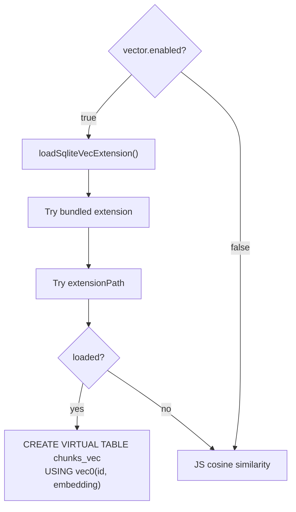

**Sources:** [src/memory/manager.ts:636-688](), [src/memory/sqlite-vec.ts:1-134]()

---

## Indexing Configuration

Indexing behavior is controlled by `memorySearch.sync` (when to reindex), `memorySearch.sources` (what to index), and `memorySearch.chunking` (how to chunk Markdown).

### Sync Triggers

```json5
{
  agents: {
    defaults: {
      memorySearch: {
        sync: {
          onSessionStart: true,       // sync on first message in session
          onSearch: true,             // lazy sync when searching after file changes
          watch: true,                // watch memory files for changes (chokidar)
          watchDebounceMs: 1500,      // debounce file changes before marking dirty
          intervalMinutes: 0,         // periodic sync interval (0 = disabled)
          sessions: {
            deltaBytes: 100000,       // min appended bytes to trigger session reindex
            deltaMessages: 50         // min appended JSONL lines to trigger session reindex
          }
        }
      }
    }
  }
}
```

**Sync Flow:**

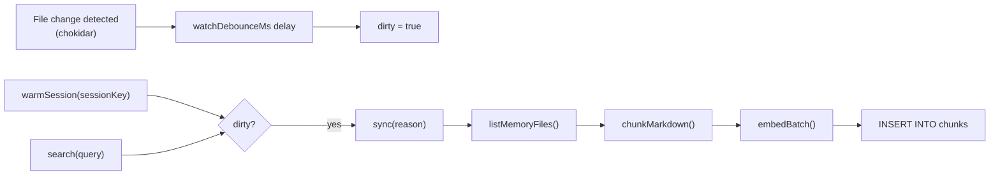

**Sources:** [src/memory/manager.ts:245-259](), [src/memory/manager.ts:807-837](), [src/memory/manager.ts:943-1345]()

### Sources Configuration

The `memorySearch.sources` array controls what gets indexed:

| Source | Description | Files Indexed |
|--------|-------------|---------------|
| `memory` | Default workspace memory | `MEMORY.md`, `memory.md`, `memory/**/*.md` |
| `sessions` | Session transcripts (experimental) | `~/.openclaw/agents/{agentId}/sessions/*.jsonl` |

**Session Indexing:** When `sources` includes `"sessions"`, session transcripts are chunked and indexed alongside memory files. Requires `experimental.sessionMemory = true`.

```json5
{
  agents: {
    defaults: {
      memorySearch: {
        sources: ["memory", "sessions"],
        experimental: { sessionMemory: true }
      }
    }
  }
}
```

**Sources:** [src/config/types.tools.ts:227-228](), [src/agents/memory-search.ts:89-107]()

### Chunking Parameters

```json5
{
  agents: {
    defaults: {
      memorySearch: {
        chunking: {
          tokens: 400,    // target chunk size in tokens
          overlap: 80     // overlap between chunks in tokens
        }
      }
    }
  }
}
```

**Chunking Logic:** Markdown is split into ~400-token chunks with 80-token overlap to preserve context at chunk boundaries. See [src/memory/internal.ts:155-331]() for `chunkMarkdown()` implementation.

**Sources:** [src/memory/internal.ts:155-331](), [src/agents/memory-search.ts:187-190]()

---

## Search Configuration

Search behavior is controlled by `memorySearch.query` settings:

### Query Parameters

```json5
{
  agents: {
    defaults: {
      memorySearch: {
        query: {
          maxResults: 6,           // max results returned to agent
          minScore: 0.35,          // min similarity score (0-1)
          hybrid: {
            enabled: true,         // combine vector + BM25
            vectorWeight: 0.7,     // weight for vector similarity (0-1)
            textWeight: 0.3,       // weight for BM25 score (0-1)
            candidateMultiplier: 4 // candidate pool size multiplier
          }
        }
      }
    }
  }
}
```

### Hybrid Search

When `query.hybrid.enabled = true`, the builtin backend combines vector similarity (semantic) with BM25 full-text search (keyword). This improves recall for both natural language queries and exact tokens (IDs, code symbols, error strings).

**Hybrid Search Flow:**

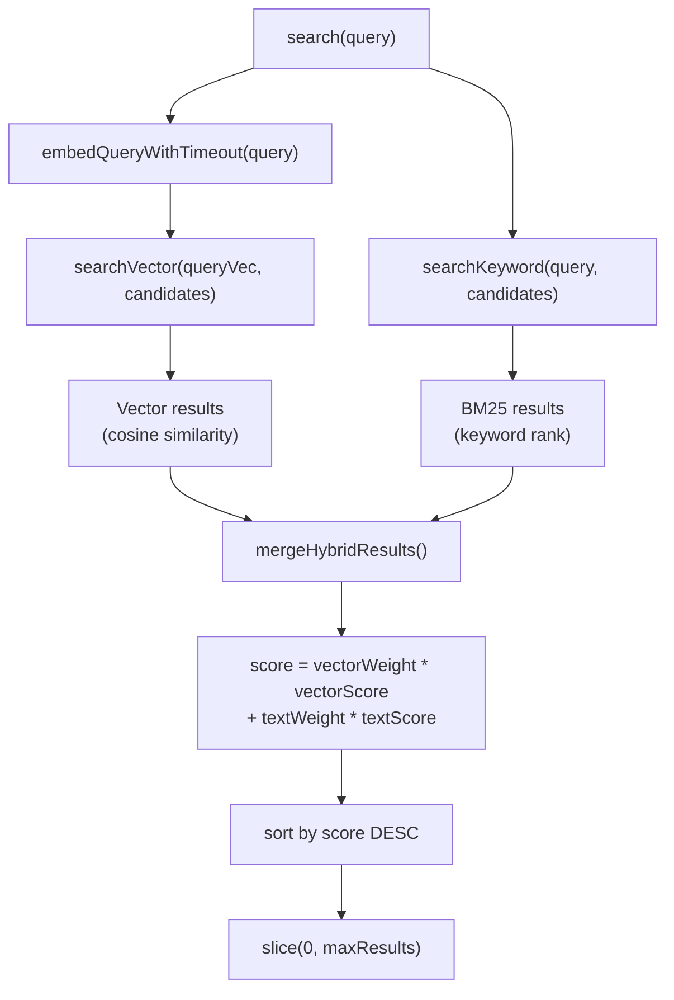

**Sources:** [src/memory/manager.ts:261-309](), [src/memory/hybrid.ts:1-120]()

### Embedding Cache

The `memorySearch.cache` section controls chunk embedding caching to speed up reindexing:

```json5
{
  agents: {
    defaults: {
      memorySearch: {
        cache: {
          enabled: true,         // cache embeddings in SQLite
          maxEntries: 50000      // optional cap (best-effort)
        }
      }
    }
  }
}
```

**Cache Key:** Embeddings are cached by `(provider, model, provider_key, hash(text))`. When any of these change, the cache is invalidated and reindexing occurs.

**Sources:** [src/memory/manager.ts:223-226](), [src/memory/manager.ts:711-759]()

---

## QMD Backend Configuration

When `memory.backend = "qmd"`, the `memory.qmd` section controls the QMD sidecar process:

### QMD Configuration Schema

```json5
{
  memory: {
    backend: "qmd",
    citations: "auto",
    qmd: {
      command: "qmd",                      // qmd binary path
      includeDefaultMemory: true,          // index MEMORY.md + memory/*.md
      paths: [                             // additional paths to index
        {
          path: "~/notes",
          pattern: "**/*.md",              // glob pattern
          name: "notes"                    // stable collection name
        }
      ],
      sessions: {
        enabled: false,                    // index session transcripts
        exportDir: "~/.openclaw/agents/main/qmd/sessions",
        retentionDays: 30                  // prune old exports
      },
      update: {
        interval: "5m",                    // qmd update interval
        debounceMs: 15000,                 // min delay between updates
        onBoot: true,                      // update on gateway start
        embedInterval: "60m"               // qmd embed interval
      },
      limits: {
        maxResults: 6,                     // max results returned
        maxSnippetChars: 700,              // max chars per snippet
        maxInjectedChars: 4000,            // max total chars injected
        timeoutMs: 4000                    // per-query timeout
      },
      scope: {                             // session scope filter
        default: "deny",
        rules: [{ action: "allow", match: { chatType: "direct" } }]
      }
    }
  }
}
```

### QMD Manager Lifecycle

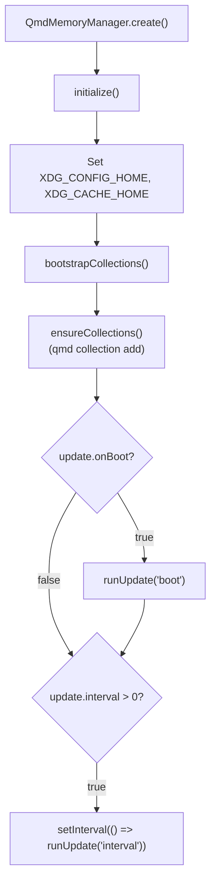

**XDG Environment:** QMD uses XDG base directories for its internal state. OpenClaw sets `XDG_CONFIG_HOME` and `XDG_CACHE_HOME` to isolate QMD state under `~/.openclaw/agents/{agentId}/qmd/`.

**Sources:** [src/memory/qmd-manager.ts:91-157](), [src/memory/qmd-manager.ts:169-219]()

### QMD Collections

QMD organizes indexed paths as "collections". OpenClaw manages collections via `qmd collection add`:

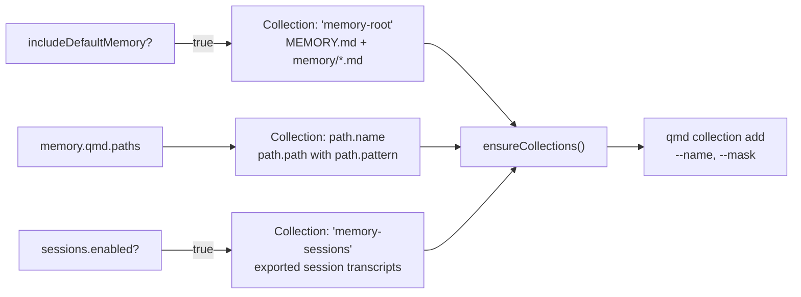

**Sources:** [src/memory/qmd-manager.ts:159-219](), [src/memory/backend-config.ts:135-204]()

### QMD Update and Embed

The QMD manager runs two commands on an interval:

1. **`qmd update`** — refresh file index (fast, default: 5m)
2. **`qmd embed`** — regenerate embeddings (slow, default: 60m)

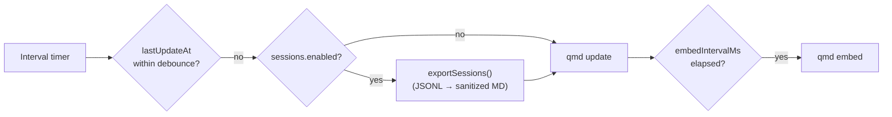

**Sources:** [src/memory/qmd-manager.ts:378-406]()

---

## Configuration Resolution Examples

### Example 1: OpenAI with Batch Indexing

```json5
{
  agents: {
    defaults: {
      memorySearch: {
        provider: "openai",
        model: "text-embedding-3-small",
        remote: {
          batch: { enabled: true, concurrency: 2 }
        },
        store: {
          path: "~/.openclaw/memory/{agentId}.sqlite",
          vector: { enabled: true }
        },
        sync: { watch: true, onSessionStart: true }
      }
    }
  }
}
```

**Resolution:** Uses OpenAI Batch API for large backfills, sqlite-vec for fast search, watches memory files for changes.

**Sources:** [src/agents/memory-search.ts:119-241]()

### Example 2: Local GGUF with Fallback

```json5
{
  agents: {
    defaults: {
      memorySearch: {
        provider: "local",
        local: {
          modelPath: "hf:ggml-org/embeddinggemma-300M-GGUF/embeddinggemma-300M-Q8_0.gguf"
        },
        fallback: "openai",
        store: { vector: { enabled: true } },
        query: { hybrid: { enabled: true } }
      }
    }
  }
}
```

**Resolution:** Tries local GGUF model first, falls back to OpenAI if local setup fails. Enables hybrid search for best results.

**Sources:** [src/memory/embeddings.ts:37-183]()

### Example 3: QMD with Session Indexing

```json5
{
  memory: {
    backend: "qmd",
    citations: "on",
    qmd: {
      includeDefaultMemory: true,
      sessions: { enabled: true, retentionDays: 30 },
      update: { interval: "5m", embedInterval: "60m" },
      limits: { maxResults: 8, maxInjectedChars: 6000 },
      scope: {
        default: "deny",
        rules: [
          { action: "allow", match: { chatType: "direct" } }
        ]
      }
    }
  }
}
```

**Resolution:** Uses QMD sidecar, indexes session transcripts, only surfaces results in direct chats (DM policy).

**Sources:** [src/memory/backend-config.ts:57-204]()

---

## Configuration Validation

All memory configuration is validated against Zod schemas at load time:

| Config Section | Schema | File |
|----------------|--------|------|
| `agents.defaults.memorySearch` | `MemorySearchSchema` | [src/config/zod-schema.agent-runtime.ts:310-414]() |
| `agents.list[].memorySearch` | `MemorySearchSchema` | [src/config/zod-schema.agent-runtime.ts:310-414]() |
| `memory` | `MemorySchema` | [src/config/zod-schema.ts:1-150]() |

**Validation Flow:**

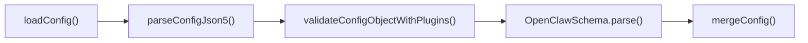

**Sources:** [src/config/validation.ts:1-150](), [src/config/zod-schema.agent-runtime.ts:310-414]()

---