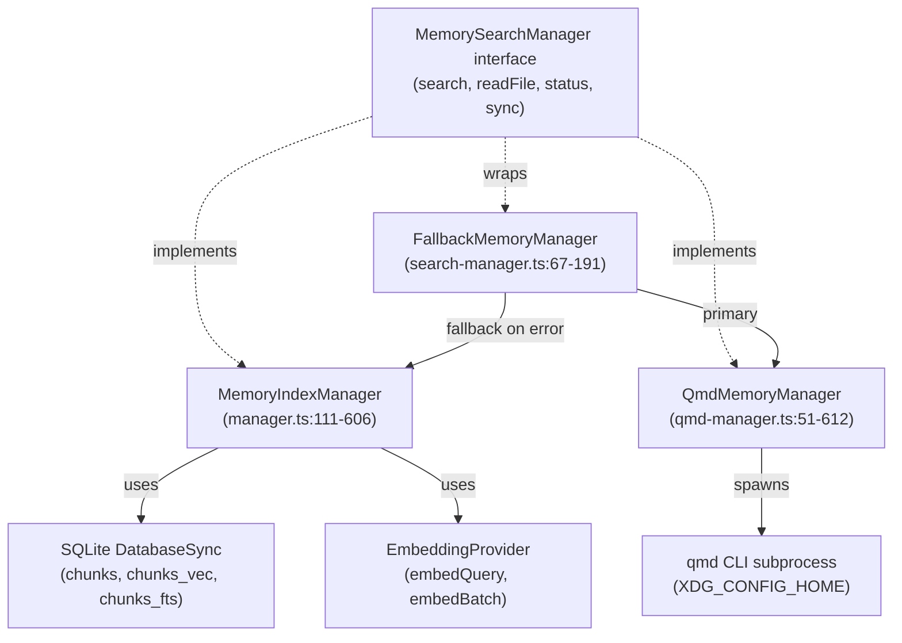
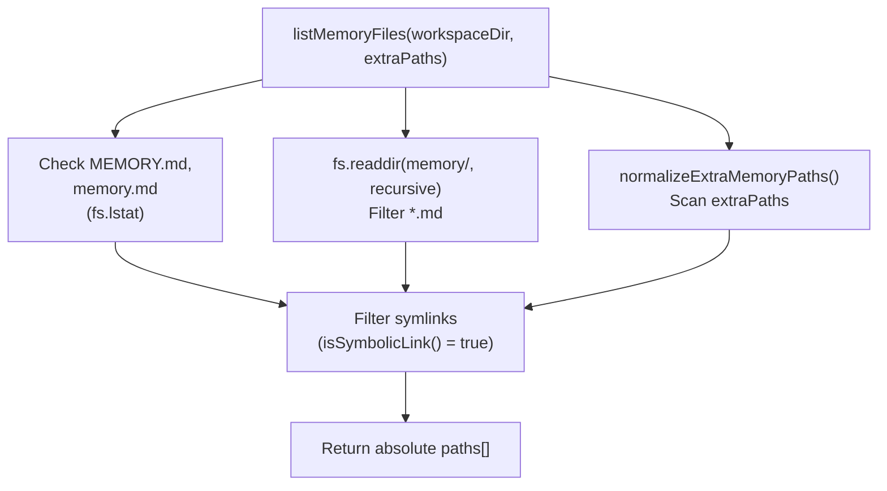
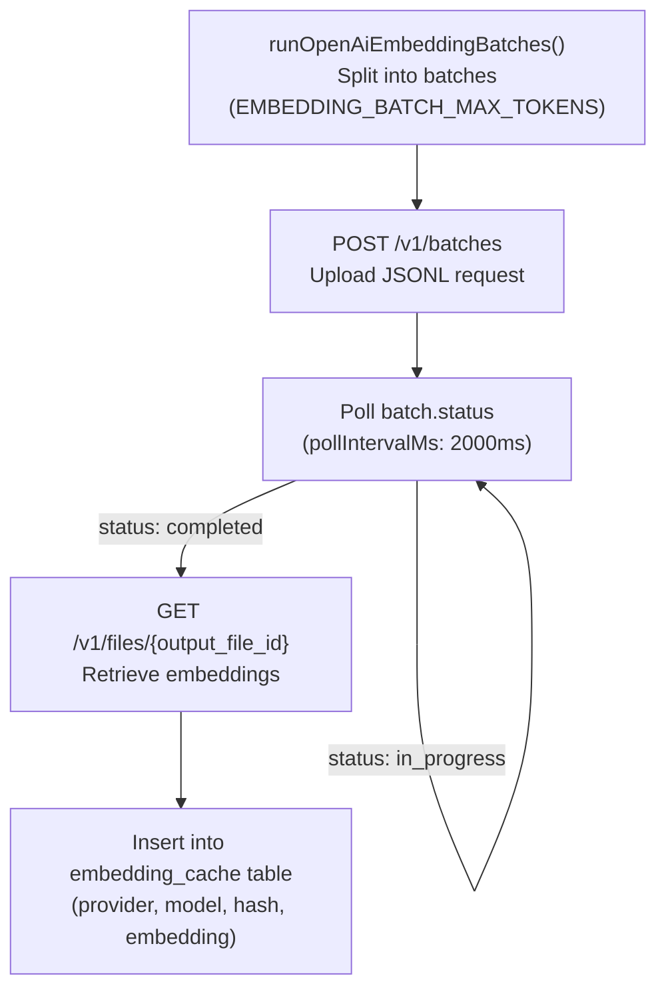
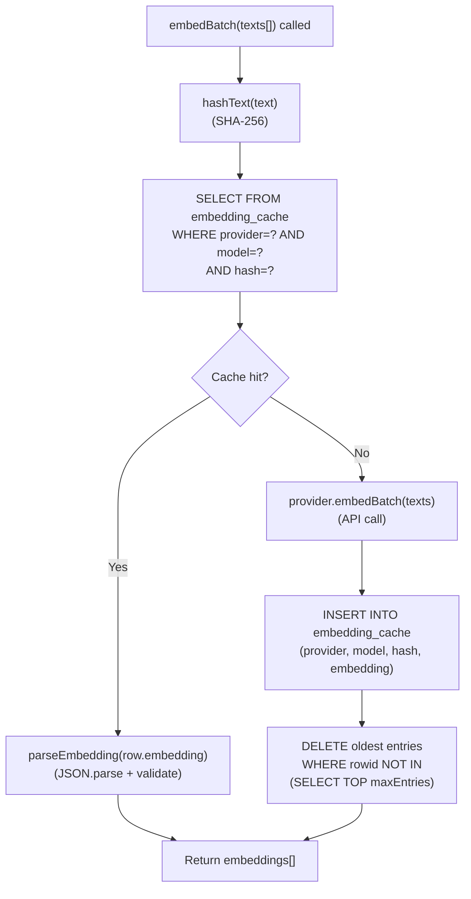
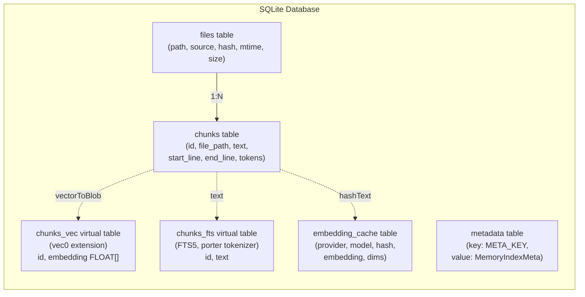
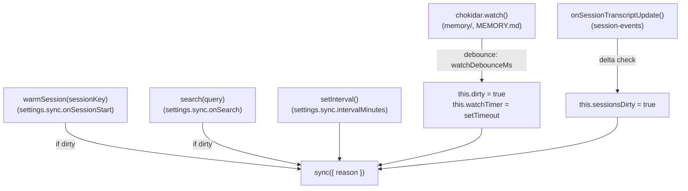
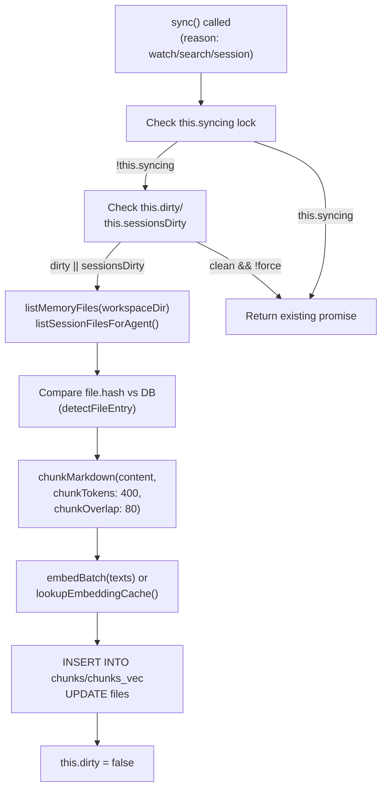
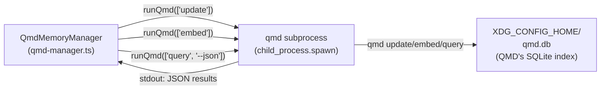

# Page: Memory Indexing

# Memory Indexing

<details>
<summary>Relevant source files</summary>

The following files were used as context for generating this wiki page:

- [CHANGELOG.md](CHANGELOG.md)
- [docs/cli/memory.md](docs/cli/memory.md)
- [docs/cli/sandbox.md](docs/cli/sandbox.md)
- [docs/concepts/memory.md](docs/concepts/memory.md)
- [docs/gateway/configuration.md](docs/gateway/configuration.md)
- [docs/gateway/sandbox-vs-tool-policy-vs-elevated.md](docs/gateway/sandbox-vs-tool-policy-vs-elevated.md)
- [docs/gateway/sandboxing.md](docs/gateway/sandboxing.md)
- [docs/platforms/mac/skills.md](docs/platforms/mac/skills.md)
- [docs/tools/elevated.md](docs/tools/elevated.md)
- [docs/tools/index.md](docs/tools/index.md)
- [docs/tools/skills-config.md](docs/tools/skills-config.md)
- [src/agents/memory-search.test.ts](src/agents/memory-search.test.ts)
- [src/agents/memory-search.ts](src/agents/memory-search.ts)
- [src/agents/sandbox-explain.test.ts](src/agents/sandbox-explain.test.ts)
- [src/agents/sandbox.ts](src/agents/sandbox.ts)
- [src/cli/memory-cli.test.ts](src/cli/memory-cli.test.ts)
- [src/cli/memory-cli.ts](src/cli/memory-cli.ts)
- [src/cli/models-cli.test.ts](src/cli/models-cli.test.ts)
- [src/config/schema.ts](src/config/schema.ts)
- [src/config/types.tools.ts](src/config/types.tools.ts)
- [src/config/types.ts](src/config/types.ts)
- [src/config/zod-schema.agent-runtime.ts](src/config/zod-schema.agent-runtime.ts)
- [src/config/zod-schema.ts](src/config/zod-schema.ts)
- [src/memory/embeddings.test.ts](src/memory/embeddings.test.ts)
- [src/memory/embeddings.ts](src/memory/embeddings.ts)
- [src/memory/manager.ts](src/memory/manager.ts)

</details>


This page explains how OpenClaw indexes memory files and session transcripts for semantic search. It covers file discovery, chunking, embedding generation, SQLite storage, and sync triggers.

For information about memory search queries and tool usage, see [Memory Search](#7.3). For overall memory configuration, see [Memory Configuration](#7.1).

---

## Overview

Memory indexing transforms Markdown files into searchable chunks stored in SQLite with vector and full-text indices. The indexing pipeline:

1. **Discovers** source files (`MEMORY.md`, `memory/*.md`, optional session transcripts)
2. **Chunks** content into ~400-token segments with 80-token overlap
3. **Generates embeddings** via OpenAI, Gemini, or local GGUF models
4. **Stores** chunks in SQLite with `sqlite-vec` (vector search) and FTS5 (keyword search)
5. **Syncs** on file changes, session start, search, or intervals

Two backends are available:
- **builtin**: SQLite index managed by `MemoryIndexManager` [src/memory/manager.ts:108-1449]()
- **qmd**: External [QMD sidecar](https://github.com/tobi/qmd) process [src/memory/qmd-manager.ts:51-612]()

Sources:
- [src/memory/manager.ts:1-1449]()
- [src/memory/qmd-manager.ts:1-612]()
- [docs/concepts/memory.md:1-547]()

---

## Key Classes and Code Entities

The memory indexing system is primarily implemented by these classes:

| Class | File | Purpose |
|-------|------|---------|
| `MemoryIndexManager` | [src/memory/manager.ts:111]() | Builtin SQLite-based indexer |
| `QmdMemoryManager` | [src/memory/qmd-manager.ts:51]() | QMD subprocess wrapper |
| `FallbackMemoryManager` | [src/memory/search-manager.ts:67]() | Failover wrapper (QMD → builtin) |
| `EmbeddingProvider` | [src/memory/embeddings.ts:24-30]() | Embedding generation interface |

**Diagram: Memory Manager Class Hierarchy**



Sources:
- [src/memory/manager.ts:111-606]()
- [src/memory/qmd-manager.ts:51-612]()
- [src/memory/search-manager.ts:67-191]()
- [src/memory/types.ts:11-28]()

---

## Index Sources and File Discovery

### Memory Sources

The `sources` configuration controls what gets indexed [src/agents/memory-search.ts:87-107]():

```json5
{
  agents: {
    defaults: {
      memorySearch: {
        sources: ["memory", "sessions"]  // default: ["memory"]
      }
    }
  }
}
```

| Source | Description | Files |
|--------|-------------|-------|
| `memory` | Workspace memory files | `MEMORY.md`, `memory.md`, `memory/**/*.md` |
| `sessions` | Session transcripts (experimental) | `~/.openclaw/agents/{agentId}/sessions/*.jsonl` |

Sources:
- [src/agents/memory-search.ts:87-107]()
- [src/memory/manager.ts:131-133]()

### File Discovery

**Builtin backend** discovers files via `listMemoryFiles` [src/memory/internal.ts:260-324]():

```typescript
async function listMemoryFiles(
  workspaceDir: string,
  extraPaths: string[]
): Promise<string[]>
```

**Diagram: File Discovery Flow (listMemoryFiles)**



Discovery rules:
- Scans `MEMORY.md`, `memory.md`, `memory/` directory recursively
- Ignores symlinks [src/memory/internal.ts:314]()
- Only indexes `.md` files
- Respects `extraPaths` for additional directories [src/memory/internal.ts:306-324]()

**QMD backend** uses collection definitions [src/memory/qmd-manager.ts:169-219]():

```typescript
type ResolvedQmdCollection = {
  name: string;
  path: string;
  pattern: string;
  kind: "memory" | "custom" | "sessions";
}
```

QMD collections are persisted in its own index database and created via `qmd collection add`.

Sources:
- [src/memory/internal.ts:260-324]()
- [src/memory/manager.ts:808-840]()
- [src/memory/qmd-manager.ts:169-219]()

---

## Chunking Process

### Markdown Chunking

Content is split into chunks via `chunkMarkdown` [src/memory/internal.ts:190-258]():

```typescript
function chunkMarkdown(params: {
  content: string;
  chunkTokens: number;   // default: 400
  chunkOverlap: number;  // default: 80
}): MemoryChunk[]
```

Chunking strategy:
1. Split content by double-newline (`\n\n`) into paragraphs
2. Accumulate paragraphs until token budget (~400 tokens) is reached
3. Include overlap (80 tokens) from previous chunk for context continuity
4. Track line ranges for citation [src/memory/internal.ts:228-242]()

**Chunk metadata** [src/memory/internal.ts:39-46]():
```typescript
type MemoryChunk = {
  id: string;           // SHA-256 hash of content
  text: string;
  startLine: number;
  endLine: number;
  tokenEstimate: number;
}
```

Sources:
- [src/memory/internal.ts:190-258]()
- [src/memory/manager.ts:1086-1132]()

### Session Transcript Chunking

Session transcripts (`.jsonl` files) are converted to Markdown then chunked [src/memory/manager.ts:1198-1296]():

1. **Filter**: Keep only `user`/`assistant` role messages [src/memory/manager.ts:1234-1238]()
2. **Format**: Convert to Markdown with role prefixes [src/memory/manager.ts:1242-1248]()
3. **Chunk**: Apply standard chunking with token limits

Session indexing is gated by delta thresholds to avoid frequent reindexing:
- `deltaBytes`: Minimum appended bytes (default: 100,000)
- `deltaMessages`: Minimum appended JSONL lines (default: 50)

Sources:
- [src/memory/manager.ts:1198-1296]()
- [src/agents/memory-search.ts:78-79]()

---

## Embedding Generation

### Provider Selection

Embeddings are generated by one of three providers [src/memory/embeddings.ts:21-52]():

| Provider | Model | Notes |
|----------|-------|-------|
| `openai` | `text-embedding-3-small` | Batch API support, fast for large indexes |
| `gemini` | `gemini-embedding-001` | Batch API support |
| `local` | GGUF via node-llama-cpp | Default: `embeddinggemma-300M-Q8_0.gguf` (~600 MB) |

**Auto-selection** [src/memory/embeddings.ts:123-152]():
1. If `local.modelPath` exists on disk → use local
2. If OpenAI API key available → use OpenAI
3. If Gemini API key available → use Gemini
4. Else fail with missing configuration

Sources:
- [src/memory/embeddings.ts:123-152]()
- [src/memory/embeddings-openai.ts:1-277]()
- [src/memory/embeddings-gemini.ts:1-180]()

### Batch Embedding API

OpenAI and Gemini support batch embeddings for fast indexing [src/memory/batch-openai.ts:1-426]():

**Diagram: OpenAI Batch Embedding Flow**



**Batch configuration** [src/agents/memory-search.ts:140-151]():
```json5
{
  remote: {
    batch: {
      enabled: true,      // default
      wait: true,         // wait for completion
      concurrency: 2,     // max parallel batch jobs
      pollIntervalMs: 2000,
      timeoutMinutes: 60
    }
  }
}
```

Batch failures increment a counter; after 2 failures, batch mode is disabled for the session [src/memory/manager.ts:1388-1449]().

Sources:
- [src/memory/batch-openai.ts:1-426]()
- [src/memory/batch-gemini.ts:1-373]()
- [src/memory/manager.ts:1388-1449]()

### Embedding Cache

Embeddings are cached by content hash to avoid recomputing [src/memory/manager.ts:711-759]():

**Cache schema**:
```sql
CREATE TABLE embedding_cache (
  provider TEXT,
  model TEXT,
  provider_key TEXT,
  hash TEXT,            -- SHA-256 of chunk text
  embedding TEXT,       -- JSON-serialized float array
  dims INTEGER,
  updated_at INTEGER,
  PRIMARY KEY (provider, model, provider_key, hash)
)
```

**Diagram: Embedding Cache Lookup (lookupEmbeddingCache)**



Cache lookups occur before embedding generation [src/memory/manager.ts:1309-1337]():
1. Hash chunk text via `hashText()` (SHA-256)
2. Query cache by provider/model/hash
3. If hit → deserialize embedding via `parseEmbedding()`
4. If miss → generate embedding, insert into cache

**Cache pruning**: If `maxEntries` is set, oldest entries are removed when the limit is exceeded [src/memory/manager.ts:1349-1376]().

Sources:
- [src/memory/manager.ts:711-759]()
- [src/memory/manager.ts:1309-1376]()
- [src/memory/memory-schema.ts:1-135]()
- [src/memory/internal.ts:178-188]()

---

## Index Storage (SQLite Schema)

### Schema Overview

The builtin backend stores chunks in SQLite [src/memory/memory-schema.ts:1-135]():

**Core tables**:

| Table | Purpose |
|-------|---------|
| `files` | File metadata (path, hash, mtime, size) |
| `chunks` | Text chunks with line ranges |
| `chunks_vec` | Virtual table for vector search (sqlite-vec) |
| `chunks_fts` | Full-text search index (FTS5) |
| `embedding_cache` | Cached embeddings by content hash |
| `metadata` | Index metadata (provider, model, chunking params) |

**Diagram: Builtin Index Schema (ensureMemoryIndexSchema)**



Sources:
- [src/memory/memory-schema.ts:1-135]()

### Vector Table (sqlite-vec)

The `chunks_vec` virtual table enables fast nearest-neighbor search [src/memory/manager.ts:664-678]():

```sql
CREATE VIRTUAL TABLE chunks_vec USING vec0(
  id TEXT PRIMARY KEY,
  embedding FLOAT[1536]  -- dimensions match embedding model
)
```

**Vec0 operations**:
- Insert: `INSERT INTO chunks_vec (id, embedding) VALUES (?, ?)`
- Search: `SELECT id FROM chunks_vec WHERE embedding MATCH ? ORDER BY distance LIMIT ?`

Vector search is implemented in `searchVector` [src/memory/manager-search.ts:1-169]().

Sources:
- [src/memory/manager.ts:664-678]()
- [src/memory/manager-search.ts:1-169]()
- [src/memory/sqlite-vec.ts:1-161]()

### Full-Text Search (FTS5)

The `chunks_fts` table enables BM25 keyword search [src/memory/memory-schema.ts:91-99]():

```sql
CREATE VIRTUAL TABLE chunks_fts USING fts5(
  id UNINDEXED,
  text,
  content='',
  tokenize='porter unicode61'
)
```

FTS5 query syntax is converted from natural language via `buildFtsQuery` [src/memory/hybrid.ts:1-163]():
- Strips special characters
- Converts to FTS5 boolean operators (`AND`, `OR`, `NEAR`)
- Wraps phrases in quotes

Sources:
- [src/memory/memory-schema.ts:91-99]()
- [src/memory/hybrid.ts:1-163]()
- [src/memory/manager-search.ts:171-281]()

---

## Sync Triggers and Lifecycle

### Sync Triggers

Indexing is triggered by [src/memory/manager.ts:807-876]():

| Trigger | Default | Config Path | Implementation |
|---------|---------|-------------|----------------|
| File watcher | `true` | `sync.watch` | `chokidar.watch()` on memory dirs |
| Session start | `true` | `sync.onSessionStart` | `warmSession()` called on session create |
| Search query | `true` | `sync.onSearch` | Lazy sync before `search()` |
| Interval timer | `0` (off) | `sync.intervalMinutes` | `setInterval()` periodic sync |

**File watcher** (chokidar) [src/memory/manager.ts:808-840]():
```typescript
this.watcher = chokidar.watch([...watchPaths], {
  ignoreInitial: true,
  awaitWriteFinish: {
    stabilityThreshold: settings.sync.watchDebounceMs,
    pollInterval: 100
  }
});
```

**Diagram: Sync Trigger Sources**



Changes are debounced (default: 1500ms) before triggering reindex [src/memory/manager.ts:834-837]().

Sources:
- [src/memory/manager.ts:807-876]()
- [src/agents/memory-search.ts:191-199]()
- [src/sessions/transcript-events.ts:1-52]()

### Sync Lifecycle

**Diagram: MemoryIndexManager.sync() Flow**



Sync implementation [src/memory/manager.ts:386-398]():
```typescript
async sync(params?: {
  reason?: string;
  force?: boolean;
  progress?: (update: MemorySyncProgressUpdate) => void;
}): Promise<void> {
  if (this.syncing) {
    return this.syncing;  // return existing promise
  }
  this.syncing = this.runSync(params).finally(() => {
    this.syncing = null;
  });
  return this.syncing;
}
```

Sources:
- [src/memory/manager.ts:386-1181]()
- [src/memory/manager.ts:877-1181]()

---

## Backend Implementations

### Builtin Backend

The `MemoryIndexManager` class [src/memory/manager.ts:108-1449]() manages a SQLite index per agent:

**Lifecycle**:
1. **Initialization** [src/memory/manager.ts:201-243]():
   - Open SQLite database at `~/.openclaw/memory/{agentId}.sqlite`
   - Load sqlite-vec extension (if enabled)
   - Create schema (files, chunks, chunks_vec, chunks_fts, embedding_cache)
   - Start file watcher on memory directories
   - Start interval sync timer (if configured)

2. **Search** [src/memory/manager.ts:261-309]():
   - Embed query text
   - Run hybrid search (vector + BM25) if enabled
   - Merge results by weighted score
   - Return top N snippets with citations

3. **Cleanup** [src/memory/manager.ts:579-606]():
   - Stop watcher
   - Clear interval timer
   - Close SQLite connection
   - Remove from cache

**Caching**: A single `MemoryIndexManager` instance per `(agentId, workspaceDir, settings)` tuple [src/memory/manager.ts:165-199]().

Sources:
- [src/memory/manager.ts:108-606]()
- [src/memory/search-manager.ts:19-65]()

### QMD Backend

The `QmdMemoryManager` class [src/memory/qmd-manager.ts:51-612]() shells out to the QMD binary:

**Diagram: QmdMemoryManager Architecture**



**QMD subprocess lifecycle** [src/memory/qmd-manager.ts:408-495]():
1. Set `XDG_CONFIG_HOME`, `XDG_CACHE_HOME` env vars for isolated state
2. Spawn `qmd` with arguments (`update`, `embed`, `query`)
3. Capture stdout/stderr
4. Await exit code, enforce timeout
5. Parse JSON output (for `query`)

**Collection management** [src/memory/qmd-manager.ts:169-219]():
```typescript
await this.runQmd([
  "collection",
  "add",
  collection.path,
  "--name", collection.name,
  "--mask", collection.pattern
]);
```

Collections are persisted in QMD's index database and created idempotently on manager initialization.

Sources:
- [src/memory/qmd-manager.ts:51-612]()
- [src/memory/backend-config.ts:1-237]()

### Fallback Wrapper

`FallbackMemoryManager` [src/memory/search-manager.ts:67-191]() wraps QMD with builtin failover:

**Failover logic**:
1. Attempt QMD operation (search, readFile)
2. If QMD fails → mark `primaryFailed = true`
3. Close QMD manager
4. Lazily instantiate builtin `MemoryIndexManager`
5. Route all future requests to builtin

This ensures memory search remains available even if QMD crashes or is missing.

Sources:
- [src/memory/search-manager.ts:67-191]()

---

## Session Transcript Indexing

### Enabling Session Indexing

Session indexing is experimental and opt-in [src/agents/memory-search.ts:125-126]():

```json5
{
  agents: {
    defaults: {
      memorySearch: {
        experimental: { sessionMemory: true },
        sources: ["memory", "sessions"]
      }
    }
  }
}
```

Sources:
- [src/agents/memory-search.ts:125-126]()
- [docs/concepts/memory.md:441-465]()

### Session File Discovery

Session transcripts are stored as JSONL [src/memory/manager.ts:1182-1197]():
- Path: `~/.openclaw/agents/{agentId}/sessions/*.jsonl`
- Format: One message per line (JSON)
- Indexed messages: `role: "user"` or `role: "assistant"`

Session files are discovered via `listSessionFilesForAgent` [src/memory/session-files.ts:1-106]().

Sources:
- [src/memory/manager.ts:1182-1197]()
- [src/memory/session-files.ts:1-106]()

### Delta Thresholds

Sessions are reindexed only when deltas exceed thresholds [src/agents/memory-search.ts:78-79]():

```json5
{
  sync: {
    sessions: {
      deltaBytes: 100000,      // ~100 KB
      deltaMessages: 50        // JSONL lines
    }
  }
}
```

**Delta tracking** [src/memory/manager.ts:1287-1296]():
```typescript
this.sessionDeltas.set(absPath, {
  lastSize: size,
  pendingBytes: size - lastSize,
  pendingMessages: newMessages
});
```

When a session transcript is updated via `onSessionTranscriptUpdate` events [src/memory/manager.ts:859-876](), the delta is accumulated. If thresholds are exceeded, the session is marked for reindex [src/memory/manager.ts:1254-1296]().

Sources:
- [src/memory/manager.ts:859-876]()
- [src/memory/manager.ts:1254-1296]()
- [src/agents/memory-search.ts:78-79]()

---

## Index Maintenance

### Reindex Triggers

A full reindex occurs when provider metadata changes [src/memory/manager.ts:924-1031]():

**Metadata fingerprint** [src/memory/manager.ts:56-63]():
```typescript
type MemoryIndexMeta = {
  model: string;
  provider: string;
  providerKey?: string;
  chunkTokens: number;
  chunkOverlap: number;
  vectorDims?: number;
}
```

If the stored metadata differs from current settings → drop all tables and rebuild index [src/memory/manager.ts:989-1007]().

Sources:
- [src/memory/manager.ts:924-1031]()

### Manual Reindexing

The `openclaw memory index` command triggers manual reindex [src/cli/memory-cli.ts:508-599]():

```bash
openclaw memory index --force --verbose
```

Options:
- `--force`: Skip debounce, force full reindex
- `--verbose`: Log progress updates (elapsed, ETA)

Sources:
- [src/cli/memory-cli.ts:508-599]()
- [docs/cli/memory.md:1-42]()

---

**Key Implementation Files**:
- [src/memory/manager.ts:1-1449]() — `MemoryIndexManager` (builtin backend)
- [src/memory/qmd-manager.ts:1-612]() — `QmdMemoryManager` (QMD backend)
- [src/memory/embeddings.ts:1-221]() — Embedding provider abstraction
- [src/memory/batch-openai.ts:1-426]() — OpenAI Batch API
- [src/memory/batch-gemini.ts:1-373]() — Gemini Batch API
- [src/memory/internal.ts:1-404]() — File discovery and chunking
- [src/memory/memory-schema.ts:1-135]() — SQLite schema definition
- [src/memory/search-manager.ts:1-213]() — Backend routing and fallback
- [src/cli/memory-cli.ts:1-699]() — CLI commands (`status`, `index`, `search`)

---