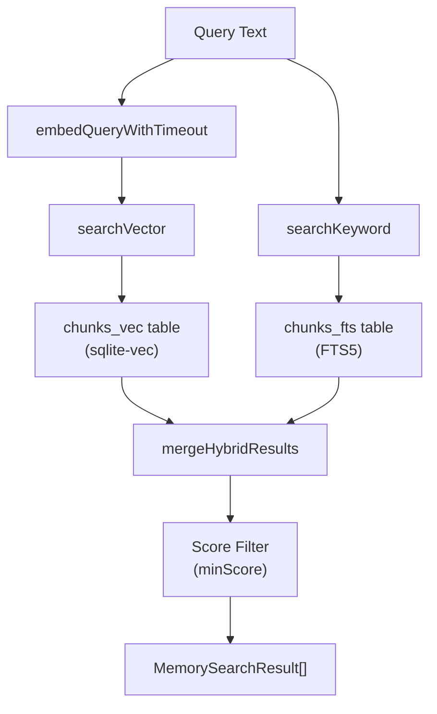

# Page: Memory Search

# Memory Search

<details>
<summary>Relevant source files</summary>

The following files were used as context for generating this wiki page:

- [CHANGELOG.md](CHANGELOG.md)
- [docs/cli/memory.md](docs/cli/memory.md)
- [docs/cli/sandbox.md](docs/cli/sandbox.md)
- [docs/concepts/memory.md](docs/concepts/memory.md)
- [docs/gateway/configuration.md](docs/gateway/configuration.md)
- [docs/gateway/sandbox-vs-tool-policy-vs-elevated.md](docs/gateway/sandbox-vs-tool-policy-vs-elevated.md)
- [docs/gateway/sandboxing.md](docs/gateway/sandboxing.md)
- [docs/platforms/mac/skills.md](docs/platforms/mac/skills.md)
- [docs/tools/elevated.md](docs/tools/elevated.md)
- [docs/tools/index.md](docs/tools/index.md)
- [docs/tools/skills-config.md](docs/tools/skills-config.md)
- [src/agents/memory-search.test.ts](src/agents/memory-search.test.ts)
- [src/agents/memory-search.ts](src/agents/memory-search.ts)
- [src/agents/sandbox-explain.test.ts](src/agents/sandbox-explain.test.ts)
- [src/agents/sandbox.ts](src/agents/sandbox.ts)
- [src/cli/memory-cli.test.ts](src/cli/memory-cli.test.ts)
- [src/cli/memory-cli.ts](src/cli/memory-cli.ts)
- [src/cli/models-cli.test.ts](src/cli/models-cli.test.ts)
- [src/config/schema.ts](src/config/schema.ts)
- [src/config/types.tools.ts](src/config/types.tools.ts)
- [src/config/types.ts](src/config/types.ts)
- [src/config/zod-schema.agent-runtime.ts](src/config/zod-schema.agent-runtime.ts)
- [src/config/zod-schema.ts](src/config/zod-schema.ts)
- [src/memory/embeddings.test.ts](src/memory/embeddings.test.ts)
- [src/memory/embeddings.ts](src/memory/embeddings.ts)
- [src/memory/manager.ts](src/memory/manager.ts)

</details>


This document explains how OpenClaw performs semantic search over indexed memory files. It covers the hybrid search architecture (vector + BM25), query processing, score merging, the agent-facing tools, and configuration options that control search behavior.

For memory file layout and indexing mechanics, see [Memory Indexing](#7.2). For configuration of embedding providers and storage, see [Memory Configuration](#7.1).

---

## Search Architecture

OpenClaw uses a **hybrid search** approach that combines vector similarity with BM25 keyword ranking. This provides both semantic understanding (via embeddings) and precise keyword matching.



**Sources:** [src/memory/manager.ts:262-308]()

---

## Search Process

The `MemoryIndexManager.search()` method orchestrates the full search pipeline:

### Step 1: Session Warming

```typescript
async search(query: string, opts?: {
  maxResults?: number;
  minScore?: number;
  sessionKey?: string;
}): Promise<MemorySearchResult[]>
```

If `memorySearch.sync.onSessionStart` is enabled, the first search from a session triggers `warmSession()`, which queues an index sync.

**Sources:** [src/memory/manager.ts:252-308]()

### Step 2: Lazy Sync

If `memorySearch.sync.onSearch` is enabled and the index is dirty, search triggers a background sync before executing queries.

**Sources:** [src/memory/manager.ts:271-275]()

### Step 3: Query Embedding

The query text is embedded using the configured provider (OpenAI, Gemini, or local). Timeouts apply based on provider type:
- Remote providers: `EMBEDDING_QUERY_TIMEOUT_REMOTE_MS` (60 seconds)
- Local providers: `EMBEDDING_QUERY_TIMEOUT_LOCAL_MS` (5 minutes)

**Sources:** [src/memory/manager.ts:290](), [src/memory/manager.ts:107-108]()

### Step 4: Parallel Search Execution

Vector and keyword searches run in parallel:

| Search Type | Method | Backend | Output |
|------------|--------|---------|--------|
| Vector | `searchVector()` | `chunks_vec` table (sqlite-vec) | Cosine similarity scores |
| Keyword | `searchKeyword()` | `chunks_fts` table (FTS5) | BM25 rank scores |

Both searches retrieve `candidateMultiplier × maxResults` entries (default: 4×).

**Sources:** [src/memory/manager.ts:287-294]()

### Step 5: Hybrid Merging

Results are merged using weighted scoring:

```
finalScore = (vectorScore × vectorWeight) + (textScore × textWeight)
```

Default weights:
- `vectorWeight`: 0.7
- `textWeight`: 0.3

**Sources:** [src/memory/manager.ts:300-307](), [src/memory/hybrid.ts]()

### Step 6: Filtering and Limiting

Results below `minScore` (default: 0.35) are filtered out, and the top `maxResults` (default: 6) are returned.

**Sources:** [src/memory/manager.ts:308]()

---

## Search Implementation Details

### Vector Search


The `searchVector()` function in [src/memory/manager-search.ts:18-90]():
- Ensures vector table is ready via `ensureVectorReady()`
- Uses `vec_distance_cosine()` for similarity scoring
- Joins with `chunks` table to retrieve full chunk metadata
- Applies source filtering (memory/sessions)
- Truncates snippets to `SNIPPET_MAX_CHARS` (700 characters)

**Sources:** [src/memory/manager-search.ts:18-90](), [src/memory/manager.ts:310-326]()

### Keyword Search

The `searchKeyword()` function in [src/memory/manager-search.ts:92-148]():
- Builds an FTS5 query using `buildFtsQuery()` (handles quotes, phrases, etc.)
- Executes FTS5 `MATCH` query on `chunks_fts`
- Converts BM25 rank to normalized score via `bm25RankToScore()`
- Returns matches with snippet highlights

**Sources:** [src/memory/manager-search.ts:92-148](), [src/memory/manager.ts:332-350](), [src/memory/hybrid.ts:1-31]()

### Hybrid Result Merging

```typescript
type HybridMergeInput = {
  vector: Array<{id: string, vectorScore: number, ...}>;
  keyword: Array<{id: string, textScore: number, ...}>;
  vectorWeight: number;
  textWeight: number;
};
```

The `mergeHybridResults()` function in [src/memory/hybrid.ts:33-108]():
- Collects all unique chunk IDs from both result sets
- For each chunk, computes weighted score:
  - If chunk appears in both: uses both scores
  - If chunk appears in only one: uses that score with 0 for the other
- Sorts by final score (descending)
- Returns merged results with unified score field

**Sources:** [src/memory/hybrid.ts:33-108](), [src/memory/manager.ts:352-381]()

---

## Memory Tools

Agents interact with memory search through two tools:

### `memory_search` Tool

```typescript
{
  name: "memory_search",
  description: "Search agent memory files for relevant information",
  parameters: {
    query: string,          // Search query
    maxResults?: number,    // Override default (6)
    source?: "memory" | "sessions" | null  // Filter by source
  }
}
```

The tool:
- Executes hybrid search via `manager.search()`
- Formats results as markdown with file paths and line numbers
- Returns snippets (up to 700 chars per result)
- Automatically filters by source if specified

**Sources:** [src/agents/tools/memory-tool.ts:11-126]()

### `memory_get` Tool

```typescript
{
  name: "memory_get",
  description: "Read specific lines from a memory file",
  parameters: {
    path: string,      // Relative file path
    from?: number,     // Start line (1-indexed)
    lines?: number     // Number of lines to read
  }
}
```

The tool:
- Validates file path (must be in workspace or extraPaths)
- Reads file content via `manager.readFile()`
- Returns full content or line-based slice
- Only allows `.md` files

**Sources:** [src/agents/tools/memory-tool.ts:128-242]()

---

## Query Configuration

Configuration lives under `agents.defaults.memorySearch.query` (or per-agent override):

```json5
{
  agents: {
    defaults: {
      memorySearch: {
        query: {
          maxResults: 6,
          minScore: 0.35,
          hybrid: {
            enabled: true,
            vectorWeight: 0.7,
            textWeight: 0.3,
            candidateMultiplier: 4
          }
        }
      }
    }
  }
}
```

| Field | Default | Purpose |
|-------|---------|---------|
| `maxResults` | 6 | Number of results returned to agent |
| `minScore` | 0.35 | Minimum score threshold (0-1) |
| `hybrid.enabled` | true | Enable BM25+vector hybrid search |
| `hybrid.vectorWeight` | 0.7 | Weight for vector similarity |
| `hybrid.textWeight` | 0.3 | Weight for keyword relevance |
| `hybrid.candidateMultiplier` | 4 | Candidate pool size (maxResults × multiplier) |

**Sources:** [src/memory/manager.ts:278-284](), [src/agents/memory-search.ts:74-87]()

---

## Search Triggers

### On-Demand Search

When the agent calls `memory_search`, the search executes immediately. If `sync.onSearch` is enabled and the index is dirty, a background sync runs first.

**Sources:** [src/memory/manager.ts:271-275]()

### Session Warming

If `sync.onSessionStart` is enabled, the first search from a new `sessionKey` triggers `warmSession()`:

```typescript
async warmSession(sessionKey?: string): Promise<void> {
  if (!this.settings.sync.onSessionStart) return;
  const key = sessionKey?.trim() || "";
  if (key && this.sessionWarm.has(key)) return;
  void this.sync({ reason: "session-start" }).catch((err) => {
    log.warn(`memory sync failed (session-start): ${String(err)}`);
  });
  if (key) this.sessionWarm.add(key);
}
```

This ensures fresh results for new conversations without blocking search.

**Sources:** [src/memory/manager.ts:252-260]()

---

## Search Result Format

```typescript
type MemorySearchResult = {
  path: string;        // Relative file path
  startLine: number;   // 1-indexed start line
  endLine: number;     // 1-indexed end line
  score: number;       // Final hybrid score (0-1)
  snippet: string;     // Truncated content (max 700 chars)
  source: "memory" | "sessions";  // Source type
};
```

Results include:
- File path (relative to workspace)
- Line range for context
- Normalized score (higher = more relevant)
- Text snippet (may be truncated)
- Source classification

**Sources:** [src/memory/manager.ts:52-59]()

---

## Source Filtering

Searches can filter by source type:

```typescript
private buildSourceFilter(alias?: string): { sql: string; params: (string | number)[] } {
  const sources = Array.from(this.sources);
  if (sources.length === 0 || (sources.includes("memory") && sources.includes("sessions"))) {
    return { sql: "", params: [] };
  }
  const prefix = alias ? `${alias}.` : "";
  return {
    sql: ` AND ${prefix}source = ?`,
    params: [sources[0]]
  };
}
```

This applies to both vector and keyword queries, ensuring results match the configured source list.

**Sources:** [src/memory/manager.ts:761-776]()

---

## Performance Characteristics

### Vector Search Performance

- **sqlite-vec**: Uses HNSW index for approximate nearest neighbor search
- **Probe timeout**: Vector extension loading has 30-second timeout
- **Candidate pool**: Fetches 4× results before scoring to improve recall

**Sources:** [src/memory/manager.ts:106](), [src/memory/manager.ts:283]()

### Keyword Search Performance

- **FTS5**: SQLite full-text search with BM25 ranking
- **Query parsing**: Handles phrases (quotes), AND/OR operators
- **Snippet generation**: Built-in FTS5 `snippet()` function

**Sources:** [src/memory/manager-search.ts:92-148](), [src/memory/hybrid.ts:1-31]()

### Embedding Cache

When `memorySearch.cache.enabled` is true (default), chunk embeddings are cached in the `embedding_cache` table:

```sql
CREATE TABLE IF NOT EXISTS embedding_cache (
  provider TEXT NOT NULL,
  model TEXT NOT NULL,
  text_hash TEXT NOT NULL,
  embedding BLOB NOT NULL,
  created_at INTEGER NOT NULL,
  PRIMARY KEY (provider, model, text_hash)
)
```

This avoids re-embedding unchanged chunks during sync.

**Sources:** [src/memory/manager.ts:231-233](), [src/memory/memory-schema.ts]()

---

## Debugging Search Issues

### CLI Status

```bash
openclaw memory status
```

Shows:
- Files/chunks indexed
- Provider and model
- Vector/FTS availability
- Cache statistics

**Sources:** [docs/cli/memory.md:1-109](), [src/cli/memory-cli.ts:304-439]()

### CLI Search

```bash
openclaw memory search "query text" --agent main
```

Tests search directly from the command line.

**Sources:** [docs/cli/memory.md:1-109](), [src/cli/memory-cli.ts:441-537]()

### Common Issues

| Issue | Likely Cause | Solution |
|-------|--------------|----------|
| No results | Index not synced | Run `openclaw memory index` |
| Low scores | Query mismatch | Check hybrid weights |
| Vector unavailable | sqlite-vec not loaded | Check extension path |
| FTS unavailable | FTS5 disabled | Enable via `query.hybrid.enabled` |

**Sources:** [src/cli/memory-cli.ts:304-537]()

---