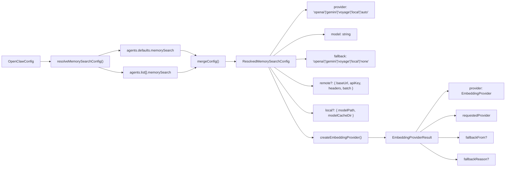
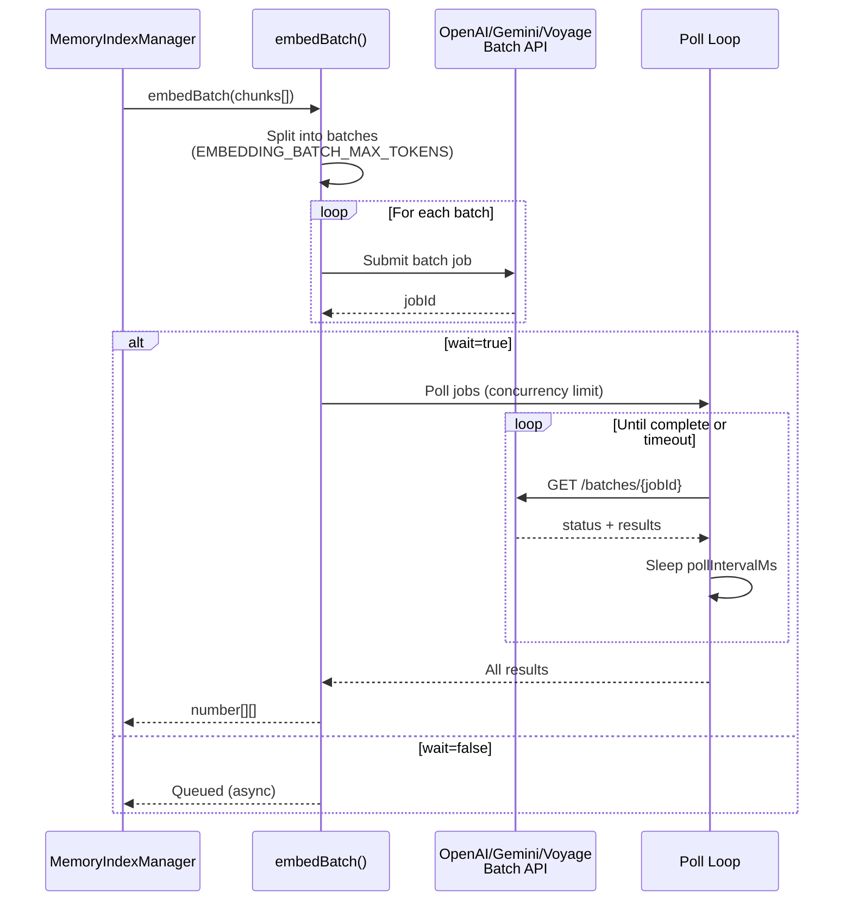

# Page: Embedding Provider Selection

# Embedding Provider Selection

<details>
<summary>Relevant source files</summary>

The following files were used as context for generating this wiki page:

- [CHANGELOG.md](CHANGELOG.md)
- [docs/cli/memory.md](docs/cli/memory.md)
- [docs/cli/sandbox.md](docs/cli/sandbox.md)
- [docs/concepts/memory.md](docs/concepts/memory.md)
- [docs/gateway/configuration.md](docs/gateway/configuration.md)
- [docs/gateway/sandbox-vs-tool-policy-vs-elevated.md](docs/gateway/sandbox-vs-tool-policy-vs-elevated.md)
- [docs/gateway/sandboxing.md](docs/gateway/sandboxing.md)
- [docs/platforms/mac/skills.md](docs/platforms/mac/skills.md)
- [docs/tools/elevated.md](docs/tools/elevated.md)
- [docs/tools/index.md](docs/tools/index.md)
- [docs/tools/skills-config.md](docs/tools/skills-config.md)
- [src/agents/memory-search.test.ts](src/agents/memory-search.test.ts)
- [src/agents/memory-search.ts](src/agents/memory-search.ts)
- [src/agents/sandbox-explain.test.ts](src/agents/sandbox-explain.test.ts)
- [src/agents/sandbox.ts](src/agents/sandbox.ts)
- [src/cli/memory-cli.test.ts](src/cli/memory-cli.test.ts)
- [src/cli/memory-cli.ts](src/cli/memory-cli.ts)
- [src/cli/models-cli.test.ts](src/cli/models-cli.test.ts)
- [src/config/schema.ts](src/config/schema.ts)
- [src/config/types.tools.ts](src/config/types.tools.ts)
- [src/config/types.ts](src/config/types.ts)
- [src/config/zod-schema.agent-runtime.ts](src/config/zod-schema.agent-runtime.ts)
- [src/config/zod-schema.ts](src/config/zod-schema.ts)
- [src/memory/embeddings.test.ts](src/memory/embeddings.test.ts)
- [src/memory/embeddings.ts](src/memory/embeddings.ts)
- [src/memory/manager.ts](src/memory/manager.ts)

</details>


## Purpose and Scope

This document explains how OpenClaw selects an embedding provider for semantic memory search. Embedding providers generate vector representations of text chunks from workspace files, enabling semantic queries through the `memory_search` tool.

For general memory system architecture and indexing, see [Memory System](#7). For memory search query behavior, see [Memory Search](#7.3). For memory configuration options, see [Memory Configuration](#7.1).

---

## Supported Providers

OpenClaw supports four embedding provider types:

| Provider | ID | Default Model | API Key Required | Batch API | Max Input Tokens |
|----------|----|--------------|--------------------|-----------|------------------|
| **OpenAI** | `openai` | `text-embedding-3-small` | Yes | Yes | 8191 |
| **Gemini** | `gemini` | `gemini-embedding-001` | Yes | Yes | Variable |
| **Voyage** | `voyage` | `voyage-4-large` | Yes | Yes | Variable |
| **Local** | `local` | `embeddinggemma-300M-Q8_0.gguf` | No | No | Variable |

The `auto` mode attempts providers in order until one succeeds.

**Sources:** [src/memory/embeddings.ts:24-30](), [src/memory/embeddings-openai.ts:1-50](), [src/memory/embeddings-gemini.ts:1-50](), [src/memory/embeddings-voyage.ts:1-50](), [src/agents/memory-search.ts:73-76]()

---

## Auto-Selection Fallback Chain

### Selection Flow

```mermaid
flowchart TD
    Start["provider='auto'"] --> CheckLocal{"`local.modelPath`<br/>configured & exists?"}
    CheckLocal -->|Yes| TryLocal["Try Local<br/>(node-llama-cpp)"]
    CheckLocal -->|No| TryOpenAI["Try OpenAI<br/>(text-embedding-3-small)"]
    
    TryLocal --> LocalOK{Success?}
    LocalOK -->|Yes| UseLocal["Use Local Provider"]
    LocalOK -->|No| TryOpenAI
    
    TryOpenAI --> OpenAIOK{API Key<br/>Available?}
    OpenAIOK -->|Yes| UseOpenAI["Use OpenAI Provider"]
    OpenAIOK -->|No| TryGemini["Try Gemini<br/>(gemini-embedding-001)"]
    
    TryGemini --> GeminiOK{API Key<br/>Available?}
    GeminiOK -->|Yes| UseGemini["Use Gemini Provider"]
    GeminiOK -->|No| TryVoyage["Try Voyage<br/>(voyage-4-large)"]
    
    TryVoyage --> VoyageOK{API Key<br/>Available?}
    VoyageOK -->|Yes| UseVoyage["Use Voyage Provider"]
    VoyageOK -->|No| Disabled["Memory Search Disabled"]
    
    UseLocal --> Done["Indexing Enabled"]
    UseOpenAI --> Done
    UseGemini --> Done
    UseVoyage --> Done
```

**Auto-selection logic:**

1. **Local First** (if `local.modelPath` is a readable file)
2. **OpenAI** (if OpenAI API key resolves)
3. **Gemini** (if Gemini API key resolves)
4. **Voyage** (if Voyage API key resolves)
5. **Disabled** (no provider available)

The selection records `fallbackFrom` and `fallbackReason` when switching from the requested provider to a fallback.

**Sources:** [src/memory/embeddings.ts:134-238](), [src/agents/memory-search.ts:88-96]()

---

## Provider Configuration

### Explicit Provider Selection

```json5
{
  agents: {
    defaults: {
      memorySearch: {
        provider: "openai",  // "openai" | "gemini" | "voyage" | "local" | "auto"
        model: "text-embedding-3-small",
        fallback: "gemini"   // fallback if primary fails
      }
    }
  }
}
```

### Configuration Resolution



**Configuration precedence:** Per-agent `memorySearch` overrides merge into `agents.defaults.memorySearch` defaults. Fields like `provider`, `model`, `fallback`, `remote`, and `local` can be overridden per-agent.

**Sources:** [src/agents/memory-search.ts:120-186](), [src/memory/embeddings.ts:42-57]()

---

## Fallback Behavior

### Fallback Triggers

Fallback to the next provider occurs when:

1. **Missing API Key**: `requireApiKey()` throws (message contains "No API key found for provider")
2. **Provider Creation Fails**: Exception during provider initialization
3. **Fallback Mode**: `fallback` is set to a specific provider (not `"none"`)

### Fallback Recording

```typescript
type EmbeddingProviderResult = {
  provider: EmbeddingProvider;           // The effective provider
  requestedProvider: "openai" | "local" | "gemini" | "voyage" | "auto";
  fallbackFrom?: "openai" | "local" | "gemini" | "voyage";  // Original attempt
  fallbackReason?: string;               // Error message
  openAi?: OpenAiEmbeddingClient;        // Available clients
  gemini?: GeminiEmbeddingClient;
  voyage?: VoyageEmbeddingClient;
};
```

The `status()` method includes fallback information:

```json5
{
  provider: "gemini",
  model: "gemini-embedding-001",
  requestedProvider: "openai",
  fallback: {
    from: "openai",
    reason: "No API key found for provider \"openai\" (auth mode: undefined)."
  }
}
```

**Sources:** [src/memory/embeddings.ts:32-40](), [src/memory/manager.ts:543-544]()

---

## Provider-Specific Configuration

### OpenAI

```json5
{
  agents: {
    defaults: {
      memorySearch: {
        provider: "openai",
        model: "text-embedding-3-small",  // or "text-embedding-3-large"
        remote: {
          baseUrl: "https://api.openai.com/v1/",  // optional override
          apiKey: "${OPENAI_API_KEY}",            // or from auth profiles
          headers: { "X-Custom": "value" }        // optional extra headers
        }
      }
    }
  }
}
```

**API Key Resolution:**
1. `memorySearch.remote.apiKey`
2. `models.providers.openai.apiKey`
3. Auth profiles matching `openai` provider
4. Environment variable `OPENAI_API_KEY`

**Sources:** [src/memory/embeddings-openai.ts:1-100](), [docs/concepts/memory.md:286-303]()

### Gemini

```json5
{
  agents: {
    defaults: {
      memorySearch: {
        provider: "gemini",
        model: "gemini-embedding-001",
        remote: {
          baseUrl: "https://generativelanguage.googleapis.com/v1beta/",
          apiKey: "${GEMINI_API_KEY}",
          headers: {}
        }
      }
    }
  }
}
```

**API Key Resolution:**
1. `memorySearch.remote.apiKey`
2. `models.providers.google.apiKey`
3. Auth profiles matching `google` provider
4. Environment variable `GEMINI_API_KEY`

**Sources:** [src/memory/embeddings-gemini.ts:1-100](), [docs/concepts/memory.md:262-278]()

### Voyage

```json5
{
  agents: {
    defaults: {
      memorySearch: {
        provider: "voyage",
        model: "voyage-4-large",
        remote: {
          apiKey: "${VOYAGE_API_KEY}"
        }
      }
    }
  }
}
```

**API Key Resolution:**
1. `memorySearch.remote.apiKey`
2. `models.providers.voyage.apiKey`
3. Environment variable `VOYAGE_API_KEY`

**Sources:** [src/memory/embeddings-voyage.ts:1-100]()

### Local (node-llama-cpp)

```json5
{
  agents: {
    defaults: {
      memorySearch: {
        provider: "local",
        fallback: "none",  // disable remote fallback
        local: {
          modelPath: "hf:ggml-org/embeddinggemma-300M-GGUF/embeddinggemma-300M-Q8_0.gguf",
          modelCacheDir: "~/.openclaw/models"  // optional cache override
        }
      }
    }
  }
}
```

**Model Resolution:**
- `hf:` prefix → auto-download from HuggingFace
- Absolute/relative path → load from filesystem
- Default: `hf:ggml-org/embeddinggemma-300M-GGUF/embeddinggemma-300M-Q8_0.gguf` (~600 MB)

**Requirements:**
- Run `pnpm approve-builds` and select `node-llama-cpp`
- Run `pnpm rebuild node-llama-cpp`
- Native build for `node-llama-cpp`

**Sources:** [src/memory/embeddings.ts:82-132](), [docs/concepts/memory.md:536-542]()

---

## Batch Embeddings

### Batch API Support

| Provider | Batch API | Default Enabled | Poll Interval | Timeout |
|----------|-----------|-----------------|---------------|---------|
| OpenAI | ✅ Yes | No | 2000 ms | 60 min |
| Gemini | ✅ Yes | No | 2000 ms | 60 min |
| Voyage | ✅ Yes | No | 2000 ms | 60 min |
| Local | ❌ No | N/A | N/A | N/A |

### Batch Configuration

```json5
{
  agents: {
    defaults: {
      memorySearch: {
        provider: "openai",
        remote: {
          batch: {
            enabled: true,             // enable batch API (default: false)
            wait: true,                // wait for completion (default: true)
            concurrency: 2,            // parallel batch jobs (default: 2)
            pollIntervalMs: 2000,      // poll interval (default: 2000)
            timeoutMinutes: 60         // max wait time (default: 60)
          }
        }
      }
    }
  }
}
```

### Batch API Workflow



**Batch Failure Handling:**
- Tracks batch failure count (`batchFailureCount`)
- After `BATCH_FAILURE_LIMIT` (2) consecutive failures, disables batch API
- Records `batchFailureLastError` and `batchFailureLastProvider`

**Sources:** [src/memory/manager.ts:124-135](), [src/memory/batch-openai.ts:1-100](), [src/memory/batch-gemini.ts:1-100](), [src/memory/batch-voyage.ts:1-100](), [docs/concepts/memory.md:313-327]()

---

## Troubleshooting Provider Selection

### Diagnostic Commands

```bash
# Check memory status (includes provider info)
openclaw memory status
openclaw memory status --deep        # probe embeddings availability
openclaw memory status --agent main --json

# Reindex with verbose logging
openclaw memory index --verbose
```

### Status Output Fields

```typescript
{
  backend: "builtin",
  provider: "openai",                    // effective provider
  model: "text-embedding-3-small",       // effective model
  requestedProvider: "auto",             // original config
  fallback?: {
    from: "local",                       // attempted provider
    reason: "Model file not found..."    // fallback reason
  }
}
```

### Common Issues

| Issue | Cause | Fix |
|-------|-------|-----|
| **"Memory search disabled"** | No provider can be resolved | Set explicit `provider` + API key |
| **"No API key found for provider"** | Missing API key for requested provider | Add `remote.apiKey` or set env var |
| **Fallback to wrong provider** | Auto-selection picked unexpected provider | Set explicit `provider` |
| **Batch API disabled** | `batchFailureCount >= BATCH_FAILURE_LIMIT` | Check batch API quotas/permissions |
| **Local provider fails** | Missing native build or model file | Run `pnpm approve-builds` + rebuild |

### Provider Selection Debugging

```mermaid
flowchart TD
    Status["openclaw memory status"] --> Check{"`fallback` field present?"}
    Check -->|Yes| Fallback["Provider fell back"]
    Check -->|No| Direct["Using requested provider"]
    
    Fallback --> Reason["Check `fallback.reason`"]
    Reason --> APIKey["'No API key found'?"]
    Reason --> ModelPath["'Model file not found'?"]
    Reason --> Other["Other error"]
    
    APIKey --> FixAPI["Add API key:<br/>- memorySearch.remote.apiKey<br/>- models.providers.*.apiKey<br/>- Environment variable"]
    ModelPath --> FixModel["Add local.modelPath<br/>or use remote provider"]
    Other --> FixOther["Check logs with<br/>--verbose"]
    
    Direct --> Working["Provider working as configured"]
```

**Sources:** [src/cli/memory-cli.ts:243-380](), [src/memory/manager.ts:470-564]()

---

## Code Entity Reference

### Core Functions

- **`createEmbeddingProvider()`** [src/memory/embeddings.ts:134-238](): Main provider selection logic
- **`resolveMemorySearchConfig()`** [src/agents/memory-search.ts:187-202](): Merges agent config
- **`mergeConfig()`** [src/agents/memory-search.ts:120-186](): Config resolution
- **`canAutoSelectLocal()`** [src/memory/embeddings.ts:61-75](): Checks local model availability
- **`isMissingApiKeyError()`** [src/memory/embeddings.ts:77-80](): Detects API key errors

### Provider Implementations

- **`createOpenAiEmbeddingProvider()`** [src/memory/embeddings-openai.ts:50-100]()
- **`createGeminiEmbeddingProvider()`** [src/memory/embeddings-gemini.ts:50-100]()
- **`createVoyageEmbeddingProvider()`** [src/memory/embeddings-voyage.ts:50-100]()
- **`createLocalEmbeddingProvider()`** [src/memory/embeddings.ts:82-132]()

### Batch APIs

- **`runOpenAiEmbeddingBatches()`** [src/memory/batch-openai.ts:20-200]()
- **`runGeminiEmbeddingBatches()`** [src/memory/batch-gemini.ts:20-200]()
- **`runVoyageEmbeddingBatches()`** [src/memory/batch-voyage.ts:20-200]()

### Manager Integration

- **`MemoryIndexManager.constructor()`** [src/memory/manager.ts:205-248](): Initializes provider
- **`MemoryIndexManager.status()`** [src/memory/manager.ts:470-564](): Returns provider status
- **`MemoryIndexManager.resolveBatchConfig()`** [src/memory/manager.ts:671-689](): Resolves batch settings

**Sources:** [src/memory/embeddings.ts:1-238](), [src/memory/manager.ts:111-248](), [src/agents/memory-search.ts:1-202]()

---