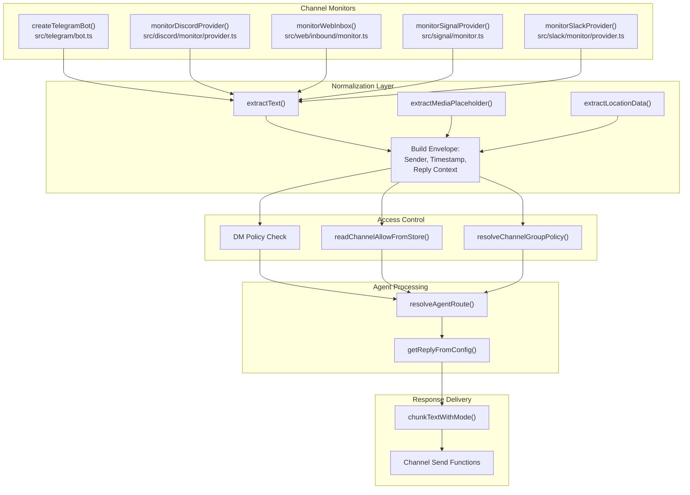
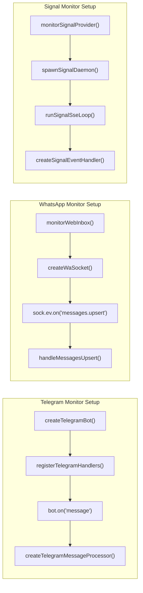
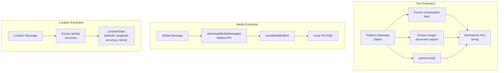
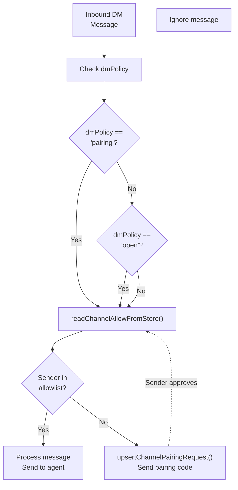
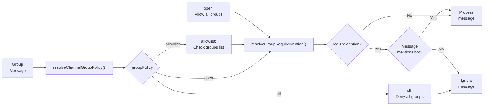
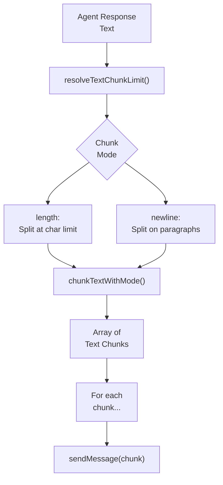
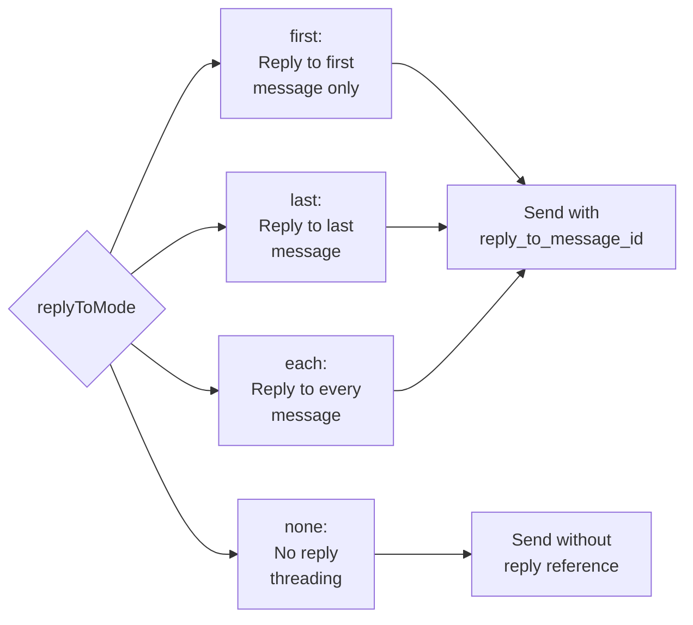
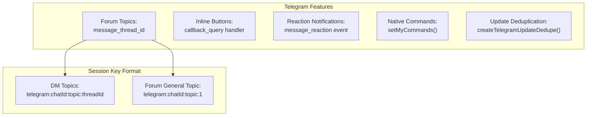

# Page: Channels

# Channels

<details>
<summary>Relevant source files</summary>

The following files were used as context for generating this wiki page:

- [README.md](README.md)
- [assets/avatar-placeholder.svg](assets/avatar-placeholder.svg)
- [docs/channels/zalo.md](docs/channels/zalo.md)
- [docs/channels/zalouser.md](docs/channels/zalouser.md)
- [scripts/clawtributors-map.json](scripts/clawtributors-map.json)
- [scripts/update-clawtributors.ts](scripts/update-clawtributors.ts)
- [scripts/update-clawtributors.types.ts](scripts/update-clawtributors.types.ts)
- [src/config/config.ts](src/config/config.ts)
- [src/discord/monitor.ts](src/discord/monitor.ts)
- [src/imessage/monitor.ts](src/imessage/monitor.ts)
- [src/index.test.ts](src/index.test.ts)
- [src/index.ts](src/index.ts)
- [src/signal/monitor.ts](src/signal/monitor.ts)
- [src/slack/monitor.ts](src/slack/monitor.ts)
- [src/telegram/bot.test.ts](src/telegram/bot.test.ts)
- [src/telegram/bot.ts](src/telegram/bot.ts)
- [src/web/auto-reply.ts](src/web/auto-reply.ts)
- [src/web/inbound.media.test.ts](src/web/inbound.media.test.ts)
- [src/web/inbound.test.ts](src/web/inbound.test.ts)
- [src/web/inbound.ts](src/web/inbound.ts)
- [src/web/test-helpers.ts](src/web/test-helpers.ts)
- [src/web/vcard.ts](src/web/vcard.ts)
- [tsconfig.json](tsconfig.json)
- [ui/src/styles.css](ui/src/styles.css)
- [ui/src/styles/layout.mobile.css](ui/src/styles/layout.mobile.css)

</details>


## Overview

Channels integrate OpenClaw with external messaging platforms. Each channel implements a monitor pattern that:

1. Receives inbound messages from the platform API
2. Normalizes message content into a standard envelope format
3. Enforces access control policies (DM pairing, allowlists, group policies)
4. Routes messages to agent sessions via `resolveAgentRoute()`
5. Delivers agent responses back to the platform

The Gateway coordinates all channel monitors. See [Gateway](#3) for control plane details, [Agent System](#5) for routing, and [Configuration System](#4) for channel settings.

---

## Channel Architecture Overview

OpenClaw channels follow a **monitor pattern** where each platform-specific implementation:

1. **Monitors** the messaging platform for inbound events
2. **Extracts** message content, media, and metadata
3. **Enforces** access control policies (DM pairing, allowlists, group policies)
4. **Routes** messages to the appropriate agent session
5. **Delivers** agent responses back to the platform



**Title:** Channel Monitor Architecture and Message Processing Pipeline

**Sources:**
- [src/telegram/bot.ts:112-490]()
- [src/discord/monitor.ts:1-29]()
- [src/web/inbound.ts:1-5]()
- [src/signal/monitor.ts:1-390]()
- [src/slack/monitor.ts:1-6]()
- [src/auto-reply/chunk.ts]()
- [src/routing/resolve-route.ts]()

---

## Supported Channels

OpenClaw integrates with the following messaging platforms:

| Channel | Library/Protocol | Module | Key Features |
|---------|------------------|--------|--------------|
| **WhatsApp** | Baileys (WebSocket) | `src/web/` | QR login, media, vCards, location |
| **Telegram** | grammY (Bot API) | `src/telegram/` | Forums, reactions, inline buttons, native commands |
| **Discord** | Discord.js | `src/discord/` | Threads, reactions, slash commands, guild policies |
| **Slack** | Bolt SDK | `src/slack/` | Slash commands, blocks, app mentions |
| **Signal** | signal-cli (JSON-RPC) | `src/signal/` | E2EE messages, attachments, reactions |
| **BlueBubbles** | HTTP API | `extensions/bluebubbles/` | iMessage via Private API |
| **iMessage** | macOS Messages | `extensions/imessage/` | Direct macOS integration (legacy) |
| **MS Teams** | Bot Framework | `extensions/msteams/` | Enterprise messaging, adaptive cards |
| **Matrix** | matrix-bot-sdk | `extensions/matrix/` | Federated E2EE, rooms |
| **Zalo** | HTTP API | `extensions/zalo/` | Vietnamese messaging platform |
| **WebChat** | Gateway WebSocket | `src/web/` | Browser-based chat UI |
| **Google Chat** | Chat API | `extensions/googlechat/` | Workspace integration |
| **Feishu** | Lark SDK | `extensions/feishu/` | Enterprise messaging (China) |

**Sources:**
- [README.md:147]()
- [package.json:119-151]()
- [pnpm-workspace.yaml:1-16]()

---

## Inbound Message Processing

### Monitor Registration

Each channel implements a monitor function that registers event listeners for inbound messages:



**Title:** Channel Monitor Initialization and Event Registration

**Sources:**
- [src/telegram/bot.ts:112-490]()
- [src/web/inbound/monitor.ts]()
- [src/signal/monitor.ts:275-390]()

### Message Extraction

Channels extract message content using platform-specific APIs and normalize it into a common format:



**Title:** Message Content Extraction and Normalization

The `extractText` function in [src/web/inbound/extract.ts]() handles WhatsApp message extraction:

```typescript
// Prefers conversation text, falls back to captions
const text = extractText(message);

// Media placeholder when no text
const mediaPlaceholder = extractMediaPlaceholder(message);

// Location data with coordinates
const location = extractLocationData(message);
```

**Sources:**
- [src/web/inbound/extract.ts]()
- [src/web/inbound.test.ts:1-238]()
- [src/web/vcard.ts:1-83]()

---

## Access Control

### DM Policy Enforcement

OpenClaw supports three DM policies configured per channel:

| Policy | Behavior | Configuration |
|--------|----------|---------------|
| `pairing` | Unknown senders receive pairing code | `channels.telegram.dmPolicy: "pairing"` |
| `open` | All senders allowed (requires `*` in allowlist) | `dmPolicy: "open"`, `allowFrom: ["*"]` |
| `allowlist` | Only explicitly allowed senders | `allowFrom: ["+15555550123", "alice"]` |



**Title:** DM Policy Decision Flow and Pairing Process

**Sources:**
- [src/telegram/bot.ts:232]()
- [src/config/group-policy.ts]()
- [src/pairing/pairing-store.ts]()
- [README.md:113-119]()

### Group Policies

Group messages enforce additional policies:



**Title:** Group Policy and Mention Requirement Evaluation

**Sources:**
- [src/telegram/bot.ts:286-337]()
- [src/config/group-policy.ts]()
- [src/discord/monitor/allow-list.ts]()

---

## Response Delivery

### Text Chunking

Long responses are split into multiple messages based on channel limits:



**Title:** Text Chunking and Delivery Loop

Default chunk limits by channel:

| Channel | Default Limit | Configuration |
|---------|---------------|---------------|
| Telegram | 4096 chars | `channels.telegram.textLimit` |
| Discord | 2000 chars | `channels.discord.textLimit` |
| WhatsApp | 4096 chars | `channels.whatsapp.textLimit` |
| Signal | 4096 chars | `channels.signal.textLimit` |
| Slack | 4000 chars | `channels.slack.textLimit` |

**Sources:**
- [src/auto-reply/chunk.ts]()
- [src/telegram/bot.ts:230]()
- [src/signal/monitor.ts:289-290]()

### Reply Modes

Channels support different reply threading behaviors via `replyToMode`:



**Title:** Reply Threading Mode Selection

**Sources:**
- [src/telegram/bot.ts:240]()
- [src/config/types.ts]()

---

## Channel-Specific Features

### Telegram



**Title:** Telegram-Specific Features and Session Keys

- **Sequential Processing**: [src/telegram/bot.ts:145]() - Uses `sequentialize()` to process updates per-chat serially
- **Update Deduplication**: [src/telegram/bot-updates.ts]() - Prevents duplicate processing of retried updates
- **Forum Support**: [src/telegram/bot/helpers.ts]() - Treats forum topics as separate sessions
- **Native Commands**: [src/telegram/bot-native-commands.ts]() - Registers slash commands with Telegram API
- **Callback Queries**: [src/telegram/bot.test.ts:364-395]() - Handles inline button presses as messages

**Sources:**
- [src/telegram/bot.ts:1-495]()
- [src/telegram/bot-updates.ts]()
- [src/telegram/bot/helpers.ts]()
- [src/telegram/bot-native-commands.ts]()

### Discord

- **Thread Inheritance**: [src/discord/monitor/threading.ts]() - Child threads inherit parent channel bindings
- **Reaction Notifications**: [src/discord/monitor/allow-list.ts]() - Configurable reaction event handling
- **Guild Policies**: Per-guild and per-channel access control
- **Username Resolution**: [src/discord/monitor/allow-list.ts]() - Resolves usernames to user IDs for DM routing

**Sources:**
- [src/discord/monitor.ts:1-29]()
- [CHANGELOG.md:178]()

### WhatsApp

- **vCard Extraction**: [src/web/vcard.ts:1-83]() - Parses contact cards with multiple phone numbers
- **Location Messages**: [src/web/inbound.test.ts:196-237]() - Supports both static and live location sharing
- **View-Once Messages**: [src/web/inbound.test.ts:174-182]() - Unwraps view-once v2 extension messages
- **Media Pipeline**: Automatic download and storage of images, audio, video, documents

**Sources:**
- [src/web/inbound.ts:1-5]()
- [src/web/inbound.test.ts:1-238]()
- [src/web/vcard.ts:1-83]()

### Signal

- **Daemon Management**: [src/signal/monitor.ts:316-349]() - Spawns and monitors `signal-cli` daemon
- **Attachment Fetching**: [src/signal/monitor.ts:182-227]() - Downloads attachments via JSON-RPC
- **Reaction Notifications**: [src/signal/monitor.ts:96-139]() - Configurable reaction modes (own/allowlist/all)
- **E2EE Support**: Transparent end-to-end encryption handling

**Sources:**
- [src/signal/monitor.ts:1-390]()

---

## Configuration Structure

### Channel Configuration Schema

Channels are configured under `channels.<channelName>` in `openclaw.json`:

```typescript
{
  channels: {
    telegram: {
      botToken: string;           // Bot API token
      dmPolicy: "pairing" | "open" | "allowlist";
      allowFrom: string[];        // DM allowlist
      groupAllowFrom: string[];   // Group allowlist
      groups: {                   // Per-group config
        "*": {                    // Default group config
          requireMention: boolean;
          groupPolicy: "open" | "allowlist" | "off";
        },
        "123456": {               // Group-specific override
          requireMention: false;
        }
      };
      replyToMode: "first" | "last" | "each" | "none";
      textLimit: number;          // Max chars per message
      mediaMaxMb: number;         // Max MB for media
      historyLimit: number;       // Group history length
      customCommands: Array<{command: string, description: string}>;
    },
    
    whatsapp: {
      dmPolicy: "pairing" | "open" | "allowlist";
      allowFrom: string[];
      groups: Record<string, {requireMention: boolean}>;
      mediaMaxMb: number;
    },
    
    discord: {
      token: string;
      dm: {
        policy: "pairing" | "open" | "allowlist";
        allowFrom: string[];
      };
      guilds: Record<string, {
        channels: Record<string, {allowFrom: string[]}>;
      }>;
    }
  }
}
```

**Sources:**
- [src/config/config.ts]()
- [src/config/types.ts]()

### Multi-Account Support

Some channels support multiple accounts via `accountId`:

```typescript
{
  channels: {
    telegram: {
      accounts: {
        "main": {
          botToken: "123:ABC",
          allowFrom: ["alice"]
        },
        "secondary": {
          botToken: "456:DEF",
          allowFrom: ["bob"]
        }
      }
    }
  }
}
```

**Sources:**
- [src/telegram/accounts.ts]()
- [src/signal/accounts.ts]()

---

## Key Code Paths

### Telegram Message Processing

1. **Event Reception**: [src/telegram/bot.ts:208-221]() - Bot middleware receives update
2. **Deduplication**: [src/telegram/bot.ts:167-180]() - Check if update already processed
3. **Sequential Key**: [src/telegram/bot.ts:67-110]() - Route to per-chat queue
4. **Handler Registration**: [src/telegram/bot-handlers.ts]() - Process message/callback/reaction
5. **Message Processor**: [src/telegram/bot-message.ts]() - Extract content and build envelope
6. **Auto-Reply**: [src/auto-reply/reply.ts]() - Generate agent response
7. **Delivery**: [src/telegram/send.ts]() - Send chunked responses

**Sources:**
- [src/telegram/bot.ts:112-490]()
- [src/telegram/bot-handlers.ts]()
- [src/telegram/bot-message.ts]()

### WhatsApp Message Processing

1. **Socket Connection**: [src/web/session.ts]() - Create Baileys WebSocket
2. **Event Listener**: [src/web/inbound/monitor.ts]() - Register `messages.upsert` handler
3. **Message Extraction**: [src/web/inbound/extract.ts]() - Extract text/media/location
4. **Media Download**: [src/web/inbound.media.test.ts:105-145]() - Download and save media
5. **Access Control**: Check DM policy and allowlist
6. **Auto-Reply**: Generate response via agent
7. **Delivery**: [src/web/send.ts]() - Send via Baileys

**Sources:**
- [src/web/inbound.ts:1-5]()
- [src/web/inbound/monitor.ts]()
- [src/web/inbound/extract.ts]()

---

## Extension Channels

Extension channels are implemented as separate packages in `extensions/`:

| Extension | Package | Entry Point |
|-----------|---------|-------------|
| BlueBubbles | `@openclaw/bluebubbles` | `extensions/bluebubbles/plugin.ts` |
| iMessage | `@openclaw/imessage` | `extensions/imessage/plugin.ts` |
| MS Teams | `@openclaw/msteams` | `extensions/msteams/plugin.ts` |
| Matrix | `@openclaw/matrix` | `extensions/matrix/plugin.ts` |
| Zalo | `@openclaw/zalo` | `extensions/zalo/plugin.ts` |
| Google Chat | `@openclaw/googlechat` | `extensions/googlechat/plugin.ts` |
| Feishu | `@openclaw/feishu` | `extensions/feishu/plugin.ts` |

Extensions integrate via the plugin system documented in [Extensions and Plugins](#10).

**Sources:**
- [pnpm-workspace.yaml:4-5]()
- [package.json:248-539]()

---