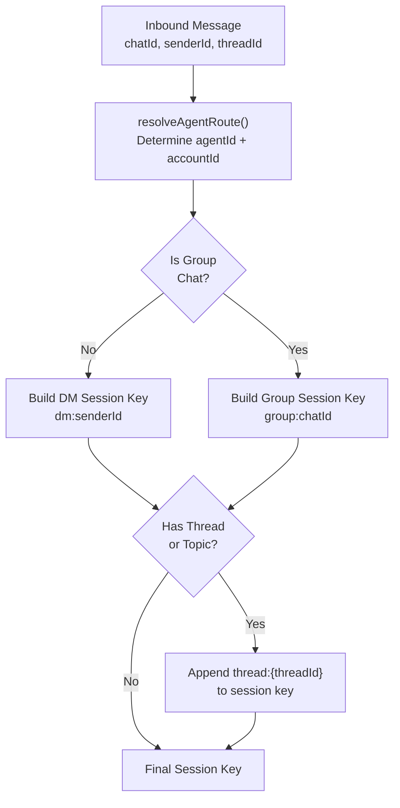
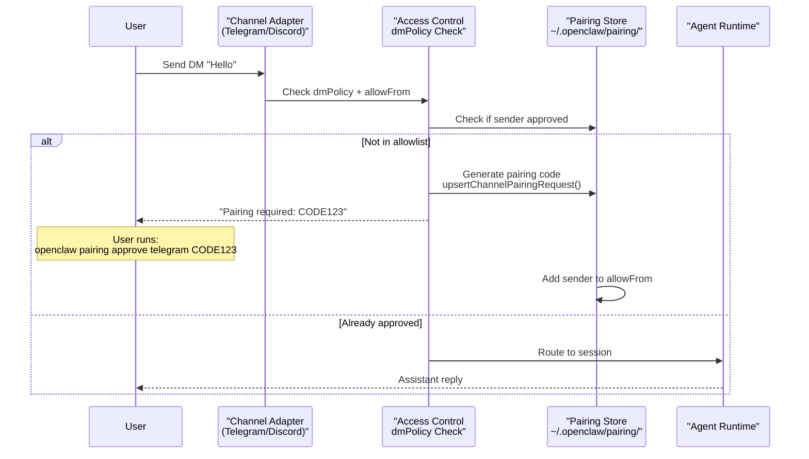
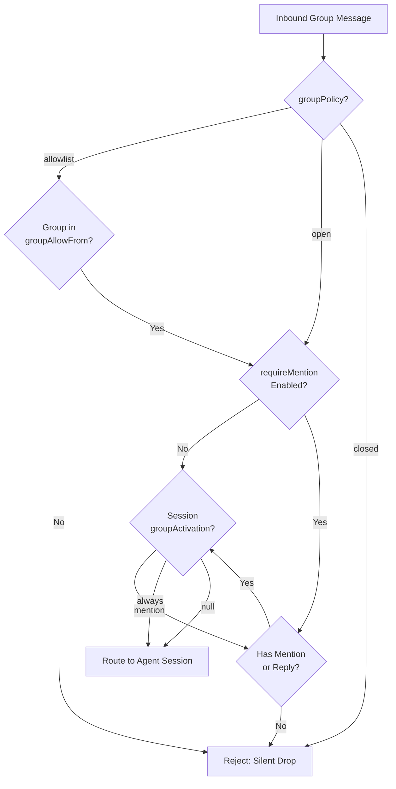
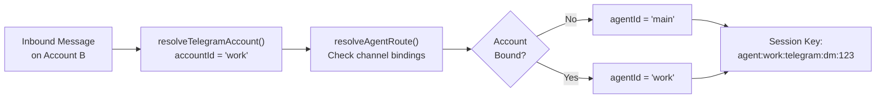

# Page: Channel Routing and Access Control

# Channel Routing and Access Control

<details>
<summary>Relevant source files</summary>

The following files were used as context for generating this wiki page:

- [.github/actions/detect-docs-changes/action.yml](.github/actions/detect-docs-changes/action.yml)
- [.github/actions/setup-node-env/action.yml](.github/actions/setup-node-env/action.yml)
- [.github/workflows/ci.yml](.github/workflows/ci.yml)
- [.gitignore](.gitignore)
- [docs/automation/poll.md](docs/automation/poll.md)
- [docs/ci.md](docs/ci.md)
- [docs/providers/synthetic.md](docs/providers/synthetic.md)
- [docs/zh-CN/vps.md](docs/zh-CN/vps.md)
- [extensions/msteams/src/store-fs.ts](extensions/msteams/src/store-fs.ts)
- [scripts/test-live-gateway-models-docker.sh](scripts/test-live-gateway-models-docker.sh)
- [scripts/test-live-models-docker.sh](scripts/test-live-models-docker.sh)
- [src/agents/live-auth-keys.test.ts](src/agents/live-auth-keys.test.ts)
- [src/agents/live-auth-keys.ts](src/agents/live-auth-keys.ts)
- [src/agents/pi-embedded-helpers.isbillingerrormessage.test.ts](src/agents/pi-embedded-helpers.isbillingerrormessage.test.ts)
- [src/agents/zai.live.test.ts](src/agents/zai.live.test.ts)
- [src/commands/message.ts](src/commands/message.ts)
- [src/discord/monitor.ts](src/discord/monitor.ts)
- [src/gateway/live-image-probe.ts](src/gateway/live-image-probe.ts)
- [src/imessage/monitor.ts](src/imessage/monitor.ts)
- [src/infra/outbound/abort.ts](src/infra/outbound/abort.ts)
- [src/infra/outbound/message.ts](src/infra/outbound/message.ts)
- [src/infra/outbound/outbound-send-service.ts](src/infra/outbound/outbound-send-service.ts)
- [src/media/png-encode.ts](src/media/png-encode.ts)
- [src/pairing/pairing-store.ts](src/pairing/pairing-store.ts)
- [src/signal/monitor.ts](src/signal/monitor.ts)
- [src/slack/monitor.ts](src/slack/monitor.ts)
- [src/telegram/bot.test.ts](src/telegram/bot.test.ts)
- [src/telegram/bot.ts](src/telegram/bot.ts)
- [src/web/auto-reply.ts](src/web/auto-reply.ts)
- [src/web/inbound.media.test.ts](src/web/inbound.media.test.ts)
- [src/web/inbound.test.ts](src/web/inbound.test.ts)
- [src/web/inbound.ts](src/web/inbound.ts)
- [src/web/test-helpers.ts](src/web/test-helpers.ts)
- [src/web/vcard.ts](src/web/vcard.ts)

</details>


## Purpose and Scope

This document describes how OpenClaw routes inbound messages from messaging channels to agent sessions and enforces access control policies. It covers:

- **Session key resolution**: How message identifiers map to session keys
- **DM access policies**: Controlling who can send direct messages (pairing, allowlist, open)
- **Group access policies**: Controlling which groups the assistant responds in (allowlist, open, mention gating)
- **Multi-account routing**: Isolating sessions per channel account
- **Channel-specific behaviors**: How routing varies by platform (Telegram topics, Discord threads, etc.)

For channel-specific setup instructions, see the individual channel pages ([8.2](#8.2) for WhatsApp, [8.3](#8.3) for Telegram, etc.). For session lifecycle and storage, see [5.3](#5.3).

---

## Session Key Resolution

Every inbound message is mapped to a **session key** that determines which conversation thread the message belongs to. Session keys follow a hierarchical pattern:

```
agent:{agentId}:{channel}:{scope}:{identifier}
```

**Components:**
- `agentId`: The target agent (from `resolveAgentRoute` binding)
- `channel`: Platform identifier (`telegram`, `discord`, `whatsapp`, `signal`, etc.)
- `scope`: Either `dm` or `group`
- `identifier`: Unique ID for the conversation (user ID, group ID, thread ID)

### Session Key Patterns by Scope

| Scope | Pattern | Example |
|-------|---------|---------|
| Direct Message | `agent:{agentId}:{channel}:dm:{userId}` | `agent:main:telegram:dm:123456789` |
| DM Thread | `agent:{agentId}:{channel}:dm:{userId}:thread:{threadId}` | `agent:main:telegram:dm:123456789:thread:42` |
| Group Chat | `agent:{agentId}:{channel}:group:{groupId}` | `agent:main:discord:group:987654321` |
| Group Thread | `agent:{agentId}:{channel}:group:{groupId}:thread:{threadId}` | `agent:main:discord:group:987654321:thread:101` |

### Session Key Resolution Flow



**Sources:** [src/telegram/bot.ts:287-295](), [src/routing/session-key.ts]() (inferred from telegram logic), Diagram 2 from high-level architecture

---

## DM Access Control

Direct message access is controlled by the `dmPolicy` configuration, which can be set globally or per-channel account.

### DM Policy Modes

| Mode | Behavior | Use Case |
|------|----------|----------|
| `pairing` | Unknown senders receive a pairing code; messages ignored until approved | **Default**; safe for public exposure |
| `allowlist` | Only senders in `allowFrom` list can message | Private assistants with known contacts |
| `open` | All senders can message (requires `"*"` in `allowFrom`) | Public bots (requires explicit opt-in) |

### Configuration

```json5
{
  channels: {
    telegram: {
      dmPolicy: "pairing",  // or "allowlist" or "open"
      allowFrom: [
        "123456789",        // Telegram user ID
        "987654321",
        "*"                 // Required for open mode
      ]
    }
  }
}
```

### Pairing Flow



**Key Functions:**
- `upsertChannelPairingRequest()` - Generates pairing codes ([src/pairing/pairing-store.ts]())
- `readChannelAllowFromStore()` - Loads approved senders ([src/pairing/pairing-store.ts]())
- `isSignalSenderAllowed()` - Validates sender against allowlist ([src/signal/identity.ts]())

**Sources:** [src/telegram/bot.ts:228-236](), [src/signal/monitor.ts:271-273](), README.md security section

---

## Group Access Control

Group chat access is controlled by `groupPolicy` and `requireMention` settings. Groups can have global policies with per-group or per-thread overrides.

### Group Policy Modes

| Mode | Behavior | Configuration |
|------|----------|---------------|
| `allowlist` | Only groups in config are allowed | Must list group IDs explicitly or use `"*"` |
| `open` | All groups allowed (subject to mention gating) | No group list needed |
| `closed` | All groups blocked | Explicit rejection |

### Mention Gating

When `requireMention` is enabled, the assistant only responds to messages that:
1. Explicitly mention the bot (`@botname` or `/command`)
2. Reply to a previous bot message
3. Are in a thread started by the bot (channel-dependent)

### Group Configuration Example

```json5
{
  channels: {
    telegram: {
      groupPolicy: "allowlist",
      requireMention: true,
      groupAllowFrom: [
        "123456789",  // Specific group ID
        "*"           // Or allow all groups
      ],
      groups: {
        "987654321": {
          requireMention: false,  // Override for this group
          topics: {
            "42": {
              requireMention: true  // Override for topic 42
            }
          }
        }
      }
    }
  }
}
```

### Group Access Flow



**Key Functions:**
- `resolveChannelGroupPolicy()` - Determines group policy ([src/config/group-policy.ts]())
- `resolveChannelGroupRequireMention()` - Checks mention requirement ([src/config/group-policy.ts]())
- `resolveGroupActivation()` - Loads session-level override ([src/telegram/bot.ts:285-304]())
- `isDiscordGroupAllowedByPolicy()` - Discord-specific check ([src/discord/monitor.ts:8]())
- `isSlackChannelAllowedByPolicy()` - Slack-specific check ([src/slack/monitor.ts:2]())

**Sources:** [src/telegram/bot.ts:278-323](), [src/config/group-policy.ts](), [src/discord/monitor.ts:7-9]()

---

## Multi-Account Routing

OpenClaw supports multiple accounts per channel (e.g., multiple Telegram bots, multiple WhatsApp numbers). Each account can have isolated access policies and route to different agents.

### Account Resolution



### Configuration

```json5
{
  channels: {
    telegram: {
      accounts: {
        personal: {
          botToken: "TOKEN_A",
          dmPolicy: "pairing",
          allowFrom: ["111", "222"]
        },
        work: {
          botToken: "TOKEN_B",
          dmPolicy: "allowlist",
          allowFrom: ["333", "444"]
        }
      }
    }
  },
  agents: {
    routing: {
      bindings: [
        {
          channel: "telegram",
          accountId: "work",
          agentId: "work_agent"
        }
      ]
    }
  }
}
```

**Key Functions:**
- `resolveTelegramAccount()` - Loads account config ([src/telegram/accounts.ts]())
- `resolveSignalAccount()` - Loads Signal account ([src/signal/accounts.ts]())
- `resolveAgentRoute()` - Determines agent from binding ([src/routing/resolve-route.ts]())

**Sources:** [src/telegram/bot.ts:118-122](), [src/signal/monitor.ts:256-259](), CHANGELOG.md:70

---

## Channel-Specific Routing Patterns

Different channels have unique routing semantics, especially for threads and topics.

### Routing Comparison Table

| Channel | DM Scope | Group Scope | Thread Support | Account Isolation |
|---------|----------|-------------|----------------|-------------------|
| **Telegram** | `dm:{userId}` | `group:{chatId}` | Topics: `thread:{topicId}` appended to base key<br/>DM threads: separate sessions | Per-bot token |
| **Discord** | `dm:{userId}` | `group:{guildId}:{channelId}` | Threads: separate sessions with `thread:{threadId}` | Per-bot token |
| **WhatsApp** | `dm:{jid}` | `group:{jid}` | No native threads | Per-phone number |
| **Signal** | `dm:{e164}` | `group:{groupId}` | No native threads | Per-phone number |
| **Slack** | `dm:{userId}` | `group:{channelId}` | Threads: `ts` timestamp determines thread key | Per-workspace token |
| **iMessage** | `dm:{chatId}` | `group:{chatId}` | No explicit threads | Per-device account |

### Telegram Topic Handling

Telegram forums use `message_thread_id` to separate topics within a supergroup. OpenClaw treats forum topics as separate sessions:

- **Forum group message**: `agent:main:telegram:group:123456789` (general topic, ID=1)
- **Forum topic message**: `agent:main:telegram:group:123456789` (other topics are NOT appended to base key in most cases; check implementation)
- **DM thread message**: `agent:main:telegram:dm:987654321:thread:42`

**Topic Resolution Logic:**
```typescript
// From src/telegram/bot.ts:99-106
const isGroup = msg?.chat?.type === "group" || msg?.chat?.type === "supergroup";
const messageThreadId = msg?.message_thread_id;
const isForum = (msg?.chat as { is_forum?: boolean })?.is_forum;
const threadId = isGroup
  ? resolveTelegramForumThreadId({ isForum, messageThreadId })
  : messageThreadId;
if (typeof chatId === "number") {
  return threadId != null ? `telegram:${chatId}:topic:${threadId}` : `telegram:${chatId}`;
}
```

### Discord Thread Handling

Discord threads create separate channels with their own IDs. OpenClaw treats them as distinct sessions, not sub-keys of the parent channel:

- **Parent channel**: `agent:main:discord:group:guild123:channel456`
- **Thread**: `agent:main:discord:group:guild123:thread789`

**Sources:** [src/telegram/bot.ts:67-107](), [src/telegram/bot/helpers.ts](), [src/discord/monitor.ts](), [src/slack/monitor.ts]()

---

## Reaction Notifications

Some channels support reaction notifications (emoji reactions on messages). These are controlled by `reactionNotifications` mode:

| Mode | Behavior |
|------|----------|
| `off` | Reactions ignored |
| `own` | Only reactions to bot's own messages are enqueued as system events |
| `allowlist` | Only reactions from allowlisted users are enqueued |
| `all` | All reactions are enqueued |

**Example (Telegram):**
```json5
{
  channels: {
    telegram: {
      reactionNotifications: "own"  // Default
    }
  }
}
```

When a reaction is detected, the system enqueues a system event to the appropriate session:

```typescript
// From src/telegram/bot.ts:440-447
const text = `Telegram reaction added: ${emoji} by ${senderLabel} on msg ${messageId}`;
enqueueSystemEvent(text, {
  sessionKey: sessionKey,
  contextKey: `telegram:reaction:add:${chatId}:${messageId}:${user?.id}:${emoji}`,
});
```

**Key Functions:**
- `shouldEmitDiscordReactionNotification()` - Discord reaction check ([src/discord/monitor.ts:17]())
- `shouldEmitSignalReactionNotification()` - Signal reaction check ([src/signal/monitor.ts:105-131]())

**Sources:** [src/telegram/bot.ts:369-452](), [src/signal/monitor.ts:19-143](), [src/discord/monitor.ts:17]()

---

## Configuration Reference

### Complete Access Control Configuration

```json5
{
  agents: {
    routing: {
      bindings: [
        {
          channel: "telegram",
          accountId: "work",
          peer: { kind: "group", id: "123456" },
          agentId: "work_agent"
        }
      ]
    }
  },
  channels: {
    defaults: {
      groupPolicy: "allowlist"  // Global default
    },
    telegram: {
      // DM Access
      dmPolicy: "pairing",        // "pairing" | "allowlist" | "open"
      allowFrom: [
        "123456789",              // User IDs
        "*"                       // Wildcard (required for open)
      ],
      
      // Group Access
      groupPolicy: "allowlist",   // "allowlist" | "open" | "closed"
      requireMention: true,       // Global mention gating
      groupAllowFrom: [
        "987654321",              // Group IDs
        "*"                       // Wildcard
      ],
      
      // Per-Group Overrides
      groups: {
        "987654321": {
          requireMention: false,
          topics: {
            "42": {
              requireMention: true
            }
          }
        }
      },
      
      // Reactions
      reactionNotifications: "own",  // "off" | "own" | "allowlist" | "all"
      
      // Multi-Account
      accounts: {
        work: {
          botToken: "TOKEN",
          dmPolicy: "allowlist",
          allowFrom: ["333"]
        }
      }
    }
  }
}
```

**Sources:** [src/config/types.ts](), [src/telegram/bot.ts:228-256](), [src/signal/monitor.ts:54-57]()

---

## Implementation Details

### Core Routing Functions

| Function | Location | Purpose |
|----------|----------|---------|
| `resolveAgentRoute()` | `src/routing/resolve-route.ts` | Determines agentId from channel/account/peer |
| `resolveThreadSessionKeys()` | `src/routing/session-key.ts` | Builds session key with thread suffix |
| `resolveChannelGroupPolicy()` | `src/config/group-policy.ts` | Resolves group policy for channel |
| `resolveChannelGroupRequireMention()` | `src/config/group-policy.ts` | Checks mention requirement |
| `buildTelegramGroupPeerId()` | `src/telegram/bot/helpers.ts` | Builds Telegram group identifier |
| `resolveTelegramForumThreadId()` | `src/telegram/bot/helpers.ts` | Extracts forum topic ID |
| `resolveDiscordChannelConfig()` | `src/discord/monitor.ts` | Resolves Discord channel config |
| `isSlackChannelAllowedByPolicy()` | `src/slack/monitor.ts` | Checks Slack channel access |

### Access Control Stores

| Store | Path | Purpose |
|-------|------|---------|
| Pairing Store | `~/.openclaw/pairing/{channel}/` | Pairing codes and timestamps |
| Allowlist Store | `~/.openclaw/pairing/{channel}/allowlist.json` | Approved senders |
| Session Store | `~/.openclaw/sessions.json` | Session metadata (includes `groupActivation`) |

**Sources:** [src/routing/](), [src/config/group-policy.ts](), [src/pairing/pairing-store.ts](), [src/telegram/bot.ts](), [src/discord/monitor.ts](), [src/slack/monitor.ts]()

---