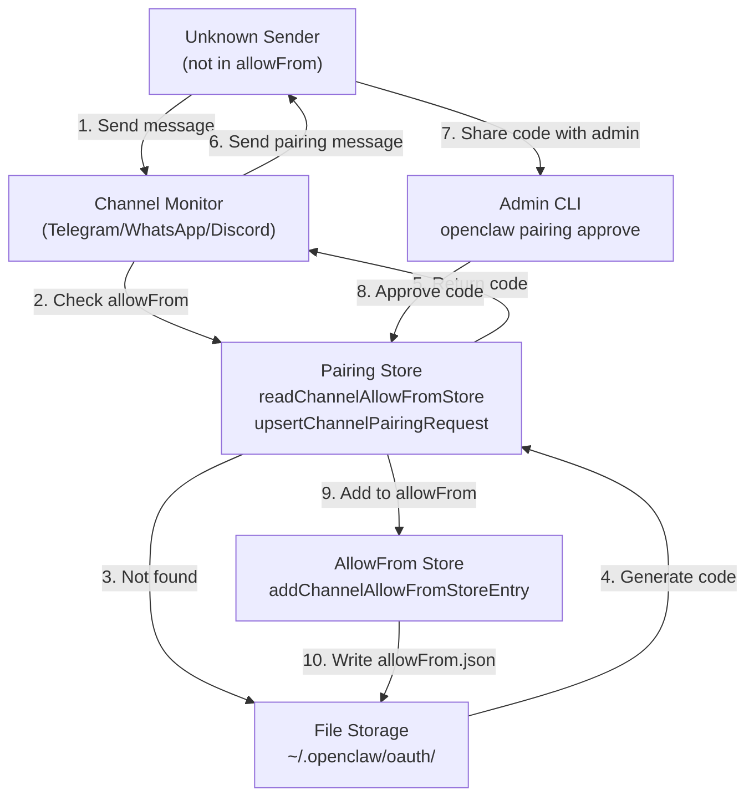
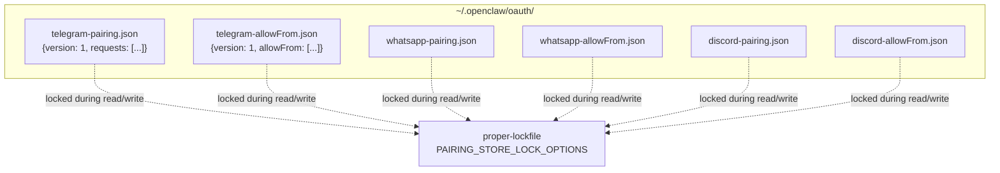
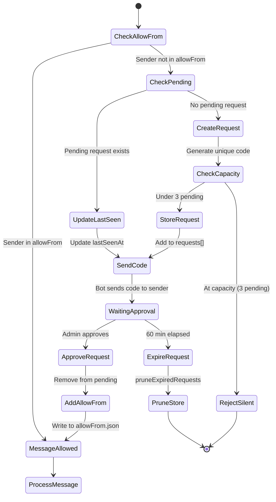
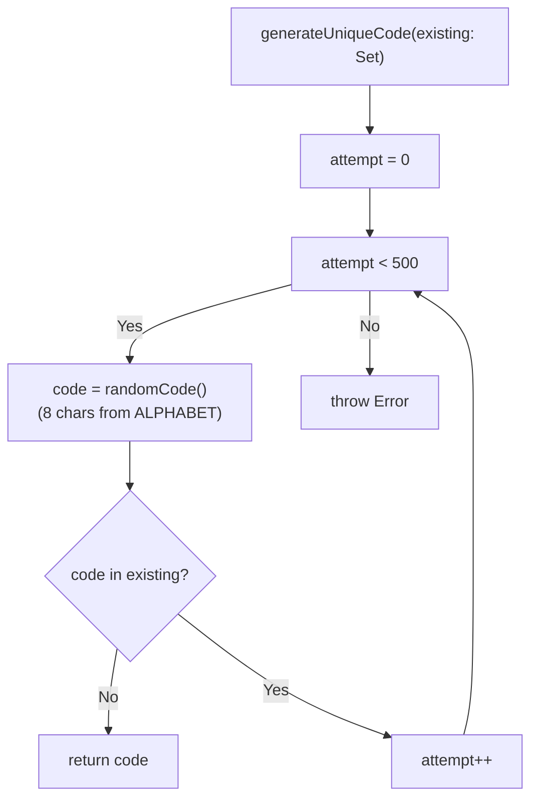
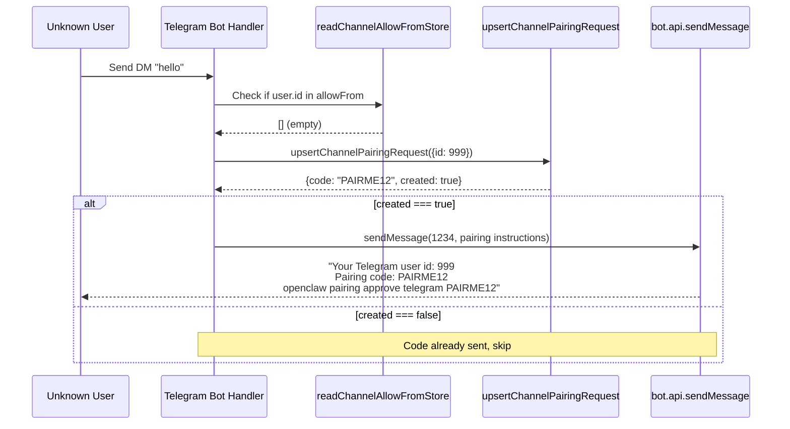
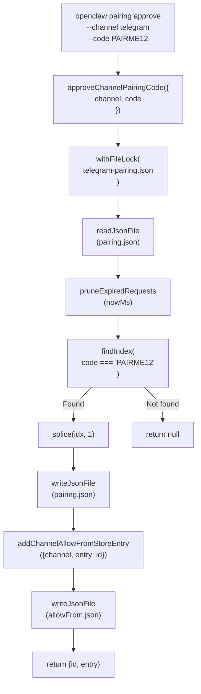
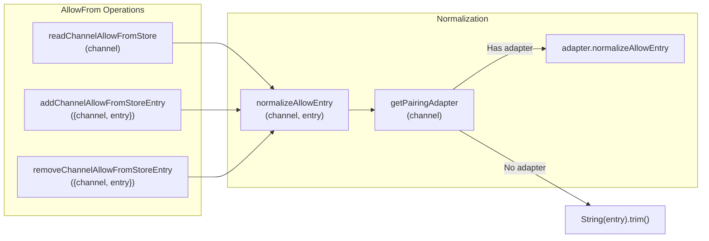
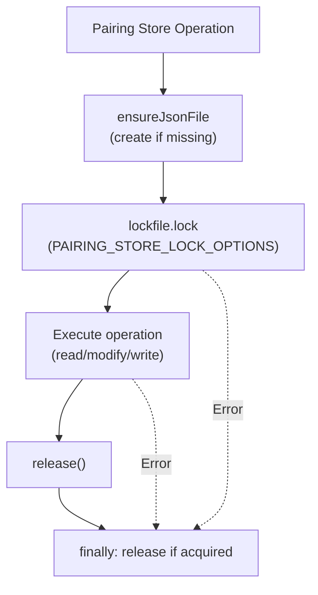
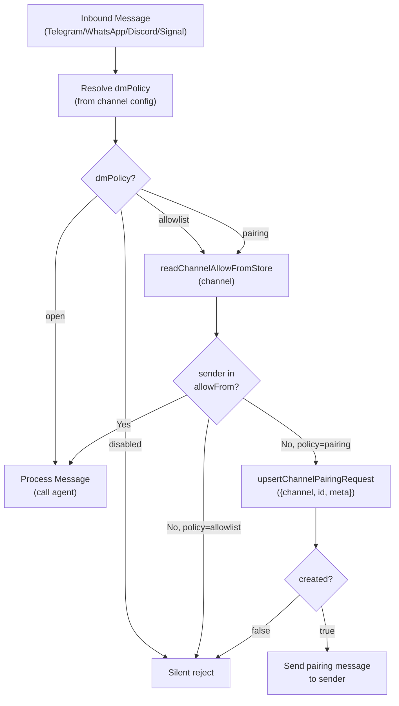
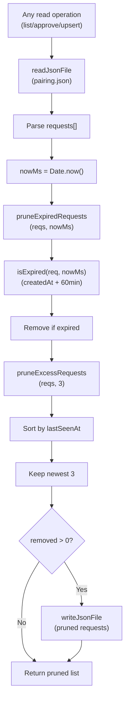

# Page: Pairing System

# Pairing System

<details>
<summary>Relevant source files</summary>

The following files were used as context for generating this wiki page:

- [.github/actions/detect-docs-changes/action.yml](.github/actions/detect-docs-changes/action.yml)
- [.github/actions/setup-node-env/action.yml](.github/actions/setup-node-env/action.yml)
- [.github/workflows/ci.yml](.github/workflows/ci.yml)
- [.gitignore](.gitignore)
- [docs/automation/poll.md](docs/automation/poll.md)
- [docs/ci.md](docs/ci.md)
- [docs/providers/synthetic.md](docs/providers/synthetic.md)
- [docs/zh-CN/vps.md](docs/zh-CN/vps.md)
- [extensions/msteams/src/store-fs.ts](extensions/msteams/src/store-fs.ts)
- [scripts/test-live-gateway-models-docker.sh](scripts/test-live-gateway-models-docker.sh)
- [scripts/test-live-models-docker.sh](scripts/test-live-models-docker.sh)
- [src/agents/live-auth-keys.test.ts](src/agents/live-auth-keys.test.ts)
- [src/agents/live-auth-keys.ts](src/agents/live-auth-keys.ts)
- [src/agents/pi-embedded-helpers.isbillingerrormessage.test.ts](src/agents/pi-embedded-helpers.isbillingerrormessage.test.ts)
- [src/agents/zai.live.test.ts](src/agents/zai.live.test.ts)
- [src/commands/message.ts](src/commands/message.ts)
- [src/discord/monitor.ts](src/discord/monitor.ts)
- [src/gateway/live-image-probe.ts](src/gateway/live-image-probe.ts)
- [src/imessage/monitor.ts](src/imessage/monitor.ts)
- [src/infra/outbound/abort.ts](src/infra/outbound/abort.ts)
- [src/infra/outbound/message.ts](src/infra/outbound/message.ts)
- [src/infra/outbound/outbound-send-service.ts](src/infra/outbound/outbound-send-service.ts)
- [src/media/png-encode.ts](src/media/png-encode.ts)
- [src/pairing/pairing-store.ts](src/pairing/pairing-store.ts)
- [src/signal/monitor.ts](src/signal/monitor.ts)
- [src/slack/monitor.ts](src/slack/monitor.ts)
- [src/telegram/bot.test.ts](src/telegram/bot.test.ts)
- [src/telegram/bot.ts](src/telegram/bot.ts)
- [src/web/auto-reply.ts](src/web/auto-reply.ts)
- [src/web/inbound.media.test.ts](src/web/inbound.media.test.ts)
- [src/web/inbound.test.ts](src/web/inbound.test.ts)
- [src/web/inbound.ts](src/web/inbound.ts)
- [src/web/test-helpers.ts](src/web/test-helpers.ts)
- [src/web/vcard.ts](src/web/vcard.ts)

</details>


The pairing system provides a secure mechanism for authorizing unknown senders to interact with the agent through messaging channels. When a channel is configured with `dmPolicy: "pairing"`, unknown direct message senders receive a time-limited pairing code that must be approved via CLI before they can communicate with the agent.

For general channel access control and routing, see [Channel Routing and Access Control](#8.1). For pairing approval commands, see [Channel Commands](#12.3).

---

## Architecture Overview

The pairing system operates as a two-phase authorization workflow: request generation and admin approval.



**Sources:** [src/pairing/pairing-store.ts:1-487](), [src/telegram/bot.ts:562-599]()

---

## Storage Architecture

The pairing system maintains two types of JSON files per channel, stored in the OAuth directory with file-based locking.



**Sources:** [src/pairing/pairing-store.ts:47-73](), [src/pairing/pairing-store.ts:115-134]()

| File Type | Purpose | Schema |
|-----------|---------|--------|
| `{channel}-pairing.json` | Pending pairing requests | `{version: 1, requests: PairingRequest[]}` |
| `{channel}-allowFrom.json` | Approved sender IDs | `{version: 1, allowFrom: string[]}` |

### PairingRequest Structure

```typescript
{
  id: string;           // Normalized sender ID
  code: string;         // 8-char pairing code (A-Z2-9, no ambiguous chars)
  createdAt: string;    // ISO timestamp
  lastSeenAt: string;   // ISO timestamp (updated on re-request)
  meta?: Record<string, string>; // Channel-specific metadata
}
```

**Sources:** [src/pairing/pairing-store.ts:29-35](), [src/pairing/pairing-store.ts:180-198]()

---

## Pairing Request Lifecycle



**Sources:** [src/pairing/pairing-store.ts:343-437](), [src/pairing/pairing-store.ts:155-178]()

### Lifecycle Constants

| Constant | Value | Purpose |
|----------|-------|---------|
| `PAIRING_CODE_LENGTH` | 8 | Character count for codes |
| `PAIRING_CODE_ALPHABET` | `ABCDEFGHJKLMNPQRSTUVWXYZ23456789` | No 0/O/1/I confusion |
| `PAIRING_PENDING_TTL_MS` | 3,600,000 (60 min) | Request expiration |
| `PAIRING_PENDING_MAX` | 3 | Max concurrent requests per channel |

**Sources:** [src/pairing/pairing-store.ts:12-15]()

---

## Code Generation and Uniqueness

The system ensures pairing codes are unique within the active request set for a channel.



**Sources:** [src/pairing/pairing-store.ts:180-198]()

The `randomCode()` function uses `crypto.randomInt()` to select characters from the alphabet, avoiding ambiguous glyphs (0/O, 1/I) for human readability.

**Sources:** [src/pairing/pairing-store.ts:180-188]()

---

## Telegram Integration Example

The Telegram bot demonstrates the complete pairing flow when `dmPolicy: "pairing"` is configured.



**Sources:** [src/telegram/bot.ts:562-599](), [src/telegram/bot.test.ts:562-639]()

### Pairing Message Format

The bot sends a plain-text message (no markdown) containing:
- Sender's user ID (for admin reference)
- The pairing code
- CLI command to approve

**Example:**
```
Your Telegram user id: 999
Pairing code: PAIRME12

To authorize this account, run:
openclaw pairing approve telegram PAIRME12
```

**Sources:** [src/telegram/bot.test.ts:594-599]()

---

## Approval Workflow

Admin approval uses the `approveChannelPairingCode` function, which atomically moves a request from pending to allowFrom.



**Sources:** [src/pairing/pairing-store.ts:440-487](), [src/pairing/pairing-store.ts:230-263]()

The approval process is atomic: the code is removed from pending and added to allowFrom within the same file lock, preventing race conditions.

**Sources:** [src/pairing/pairing-store.ts:451-486]()

---

## AllowFrom List Management

The allowFrom list supports both direct management and pairing-driven updates.



**Sources:** [src/pairing/pairing-store.ts:217-228](), [src/pairing/pairing-store.ts:200-215]()

### Channel-Specific Normalization

Channels can provide a `ChannelPairingAdapter` to normalize allowFrom entries. For example, phone-based channels (Signal, WhatsApp) normalize to E.164 format.

```typescript
// Example from getPairingAdapter usage
const adapter = getPairingAdapter(channel);
const normalized = adapter?.normalizeAllowEntry 
  ? adapter.normalizeAllowEntry(trimmed) 
  : trimmed;
```

**Sources:** [src/pairing/pairing-store.ts:200-215]()

---

## File Locking Strategy

All pairing store operations use `proper-lockfile` to ensure safe concurrent access.



**Sources:** [src/pairing/pairing-store.ts:115-134]()

### Lock Configuration

```typescript
const PAIRING_STORE_LOCK_OPTIONS = {
  retries: {
    retries: 10,
    factor: 2,           // Exponential backoff
    minTimeout: 100,     // 100ms initial
    maxTimeout: 10_000,  // 10s max
    randomize: true,     // Jittered retry
  },
  stale: 30_000,         // 30s stale lock auto-release
};
```

**Sources:** [src/pairing/pairing-store.ts:16-25]()

This configuration handles high-frequency pairing attempts (e.g., multiple users requesting codes simultaneously) with jittered exponential backoff.

---

## Channel Integration Points

Channels check the pairing policy during message routing and invoke pairing when needed.



**Sources:** [src/telegram/bot.ts:562-599](), [src/config/types.ts]() (dmPolicy type)

### DM Policy Values

| Policy | Behavior | Pairing Used? |
|--------|----------|---------------|
| `open` | Allow all DMs | No |
| `allowlist` | Only allow if in allowFrom | No |
| `pairing` | Generate code for unknown senders | Yes |
| `disabled` | Reject all DMs | No |

**Sources:** Configuration schema documentation

---

## Pruning and Maintenance

The pairing store automatically prunes expired and excess requests during read operations.



**Sources:** [src/pairing/pairing-store.ts:155-178](), [src/pairing/pairing-store.ts:172-178]()

Pruning occurs opportunistically during reads, ensuring the store remains bounded without requiring a separate cleanup process.

---

## Extension Channels

Extension channels (Matrix, Zalo, MS Teams) can pass a `pairingAdapter` parameter to bypass the global adapter registry.

```typescript
// From upsertChannelPairingRequest signature
{
  channel: PairingChannel;
  id: string | number;
  meta?: Record<string, string | undefined | null>;
  env?: NodeJS.ProcessEnv;
  pairingAdapter?: ChannelPairingAdapter;  // For extensions
}
```

**Sources:** [src/pairing/pairing-store.ts:343-350]()

This allows extension channels to provide custom normalization without modifying core code.

---

## Security Considerations

| Aspect | Implementation |
|--------|----------------|
| Code entropy | 8 chars × log2(32) ≈ 40 bits |
| Collision resistance | 500-attempt uniqueness check |
| Time-to-live | 60 minutes (hard limit) |
| Capacity limit | 3 concurrent requests per channel |
| File permissions | 0600 (owner read/write only) |
| Directory permissions | 0700 (owner access only) |
| Atomic operations | File locking with retry/backoff |

**Sources:** [src/pairing/pairing-store.ts:12-15](), [src/pairing/pairing-store.ts:96-105]()

The system balances security (sufficient entropy to prevent guessing) with usability (human-readable, no ambiguous characters).

---