# Page: Channel Message Flow

# Channel Message Flow

<details>
<summary>Relevant source files</summary>

The following files were used as context for generating this wiki page:

- [README.md](README.md)
- [assets/avatar-placeholder.svg](assets/avatar-placeholder.svg)
- [docs/channels/zalo.md](docs/channels/zalo.md)
- [docs/channels/zalouser.md](docs/channels/zalouser.md)
- [scripts/clawtributors-map.json](scripts/clawtributors-map.json)
- [scripts/update-clawtributors.ts](scripts/update-clawtributors.ts)
- [scripts/update-clawtributors.types.ts](scripts/update-clawtributors.types.ts)
- [src/config/config.ts](src/config/config.ts)
- [src/discord/monitor.ts](src/discord/monitor.ts)
- [src/imessage/monitor.ts](src/imessage/monitor.ts)
- [src/index.test.ts](src/index.test.ts)
- [src/index.ts](src/index.ts)
- [src/signal/monitor.ts](src/signal/monitor.ts)
- [src/slack/monitor.ts](src/slack/monitor.ts)
- [src/telegram/bot.test.ts](src/telegram/bot.test.ts)
- [src/telegram/bot.ts](src/telegram/bot.ts)
- [src/web/auto-reply.ts](src/web/auto-reply.ts)
- [src/web/inbound.media.test.ts](src/web/inbound.media.test.ts)
- [src/web/inbound.test.ts](src/web/inbound.test.ts)
- [src/web/inbound.ts](src/web/inbound.ts)
- [src/web/test-helpers.ts](src/web/test-helpers.ts)
- [src/web/vcard.ts](src/web/vcard.ts)
- [tsconfig.json](tsconfig.json)
- [ui/src/styles.css](ui/src/styles.css)
- [ui/src/styles/layout.mobile.css](ui/src/styles/layout.mobile.css)

</details>


This page details the complete message pipeline from inbound channel events to agent responses and outbound delivery. It covers envelope normalization, security checks, session routing, agent invocation, and response formatting across all channel implementations.

For channel-specific access control configuration, see [Channel Routing and Access Control](#8.1). For the pairing workflow that gates untrusted senders, see [Pairing System](#8.2). For individual channel integration details, see sections [8.4](#8.4) through [8.8](#8.8).

---

## Message Flow Overview

The message pipeline is a multi-stage process that transforms channel-specific events into normalized envelopes, applies security policies, routes to the appropriate agent session, processes the agent response, and delivers formatted replies back through the originating channel.

### High-Level Pipeline Diagram


**Sources:** [src/telegram/bot.ts:1-499](), [src/signal/monitor.ts:1-401](), [src/discord/monitor.ts:1-29](), [src/auto-reply/reply/inbound-dedupe.js]()

---

## Inbound Pipeline

The inbound pipeline handles messages arriving from external channel APIs and prepares them for agent processing.

### Channel Listeners

Each channel integration provides a **channel monitor** or **bot listener** that subscribes to native events from the platform API:

| Channel    | Listener Implementation                      | Event Source                |
|------------|----------------------------------------------|-----------------------------|
| Telegram   | `Bot` via grammY, `on("message")`            | Long-polling or webhook     |
| Discord    | `Client` via discord.js, `on("messageCreate")`| Gateway WebSocket           |
| Signal     | `runSignalSseLoop`, SSE stream               | signal-cli daemon HTTP/SSE  |
| WhatsApp   | `sock.ev.on("messages.upsert")`              | Baileys WebSocket           |
| Slack      | `bolt.App`, Socket Mode or webhook           | Slack Events API            |
| WebChat    | `monitorWebInbox`, Gateway WS                | Internal WebSocket          |

**Telegram Example:**


**Sources:** [src/telegram/bot.ts:111-149](), [src/signal/monitor.ts:275-401](), [src/web/inbound/monitor.js]()

### Update Deduplication

Messages are deduplicated by constructing a stable key from the channel update and checking against a recent update cache:

**Telegram:**
- Key format: `telegram:<chatId>:<messageId>` or `telegram:<chatId>:topic:<threadId>:<messageId>`
- Deduplication window: short TTL (typically seconds to minutes)
- Update offset tracking: `lastUpdateId` prevents reprocessing after restarts

```typescript
// Telegram deduplication key construction
const key = buildTelegramUpdateKey(ctx);
const skipped = recentUpdates.check(key);
```

**Signal:**
- Key format: `signal:<sender>:<timestamp>`
- Envelope construction includes `envelope.timestamp` for deduplication

**Sources:** [src/telegram/bot/bot-updates.ts](), [src/telegram/bot.ts:154-183](), [src/auto-reply/reply/inbound-dedupe.js]()

### Envelope Normalization

Each channel transforms its native message format into a **standard inbound envelope** containing:

| Field              | Description                                              |
|--------------------|----------------------------------------------------------|
| `Body`             | Message text, prefixed with envelope header              |
| `SenderName`       | Display name of the sender                               |
| `SenderId`         | Unique sender identifier (channel-specific)              |
| `SenderUsername`   | Username, if available                                   |
| `WasMentioned`     | Boolean indicating if bot was mentioned/addressed        |
| `ChatType`         | `"direct"` or `"group"`                                  |
| `MentionedJids`    | List of mentioned user identifiers                       |
| `mediaPath`        | Local file path for downloaded media                     |
| `mediaUrl`         | URL reference for media                                  |
| `replyTo`          | Reference to parent message (threading)                  |

**Telegram Envelope Construction:**


**Envelope Header Format:**

```
[Telegram Ada Lovelace (@ada_bot) id:1234 +5m 2025-01-09T00:00:00Z]
<actual message text>
```

Components:
- Channel name: `Telegram`, `Discord`, `Signal`, etc.
- Sender identity: name, username, user ID
- Relative timestamp: `+5m`, `+2h`, `+3d` (time since message sent)
- Absolute timestamp: ISO 8601 format

**Sources:** [src/telegram/bot-message.ts](), [src/signal/monitor/event-handler.ts](), [src/auto-reply/reply/envelope.js](), [src/telegram/bot.ts:518-560]()

### Media Handling

Media attachments are downloaded, validated, and stored locally:

**Download Flow:**


**Size Limits (default):**
- Telegram: 5 MB (`channels.telegram.mediaMaxMb`)
- Discord: 5 MB (`channels.discord.mediaMaxMb`)
- Signal: 8 MB (`channels.signal.mediaMaxMb`)
- WhatsApp: 5 MB (`channels.whatsapp.mediaMaxMb`)

**Media Placeholder Format:**
- Text: `<media:image>`, `<media:audio>`, `<media:video>`, `<media:document>`
- Appended to envelope body if caption is present

**Sources:** [src/telegram/bot-message.ts](), [src/signal/monitor.ts:182-227](), [src/media/store.ts](), [src/web/inbound/extract.ts]()

---

## Security Checks

After normalization, messages pass through security policies that determine whether the sender is authorized:

### Security Layer Diagram


**Sources:** [src/telegram/bot-message.ts](), [src/signal/monitor/event-handler.ts](), [src/discord/monitor/message-handler.ts](), [src/config/group-policy.js]()

### DM Policy Modes

| Mode        | Behavior                                                                 |
|-------------|--------------------------------------------------------------------------|
| `pairing`   | Unknown senders receive a pairing code; messages blocked until approved |
| `allowlist` | Only senders in `allowFrom` are authorized                              |
| `open`      | All senders authorized (requires `"*"` in `allowFrom`)                  |
| `disabled`  | All DMs blocked                                                          |

**Telegram Pairing Example:**

```typescript
// Check if sender is in pairing store
const allowedSenders = await readChannelAllowFromStore("telegram", accountId);
if (!allowedSenders.includes(senderId)) {
  const { code, created } = await upsertChannelPairingRequest("telegram", senderId);
  if (created) {
    await ctx.reply(`Your Telegram user id: ${senderId}\nPairing code: ${code}\n...`);
  }
  return; // Block message
}
```

**Sources:** [src/telegram/bot-message.ts](), [src/pairing/pairing-store.ts](), [src/telegram/bot.ts:562-599]()

### Group Access Control

Groups follow a separate policy hierarchy:

1. **Group-level policy**: `channels.<channel>.groupPolicy` (or `channels.defaults.groupPolicy`)
2. **Per-group configuration**: `channels.<channel>.groups.<groupId>` with `allow`, `requireMention`
3. **Mention detection**: If `requireMention: true`, check `WasMentioned` flag in envelope

**Group Mention Detection:**

```typescript
// Telegram mention check
const requireMention = resolveChannelGroupRequireMention({ cfg, channel: "telegram", groupId });
if (requireMention && !wasMentioned) {
  return; // Ignore message
}
```

**Mention Patterns:**
- Native mentions: `@botUsername` (Telegram, Discord)
- Text patterns: configurable via `messages.groupChat.mentionPatterns` (regex)

**Sources:** [src/config/group-policy.js](), [src/telegram/bot.ts:656-703](), [src/auto-reply/reply/mention-detection.js]()

---

## Session Routing

After security checks pass, the message is routed to the appropriate agent session.

### Route Resolution

The Gateway uses `resolveAgentRoute` to determine:
- **Agent ID**: Which agent should handle the message
- **Session key**: Unique identifier for the conversation context
- **Workspace**: File system path for agent workspace

**Routing Inputs:**
- Channel name (`telegram`, `discord`, `signal`, etc.)
- Account ID (for multi-account channels)
- Peer info: `{ kind: "direct" | "group", id: string }`
- Parent peer (for thread routing)

**Session Key Format:**
- Direct messages: `agent:main:telegram:123456789`
- Groups: `agent:main:telegram:group:987654321`
- Forum threads: `agent:main:telegram:group:987654321:topic:42`

### Session Key Construction Diagram


**Telegram Session Key Logic:**

```typescript
// Direct message
const sessionKey = `agent:${agentId}:telegram:${chatId}`;

// Group message
const peerId = buildTelegramGroupPeerId(chatId, messageThreadId);
const sessionKey = `agent:${agentId}:telegram:group:${peerId}`;

// Forum thread (supergroup with topics)
const threadId = resolveTelegramForumThreadId({ isForum, messageThreadId });
const sessionKey = `agent:${agentId}:telegram:group:${chatId}:topic:${threadId}`;
```

**Sources:** [src/routing/resolve-route.ts](), [src/telegram/bot/helpers.ts](), [src/config/sessions.ts]()

### Agent Bindings

Custom routing rules can map specific channels/peers to non-default agents:

```json5
{
  agents: {
    bindings: [
      {
        channel: "telegram",
        accountId: "work",
        peer: { kind: "group", id: "123456789" },
        agentId: "support-bot"
      }
    ]
  }
}
```

**Sources:** [src/config/types.ts](), [src/routing/resolve-route.ts]()

---

## Agent Invocation

Once the session is routed, the envelope is passed to the agent runtime via `getReplyFromConfig`:

### Agent Call Flow


**Key Agent Parameters:**
- `sessionKey`: Determines session history and state
- `Body`: Normalized message text with envelope header
- `SenderName`, `SenderId`, `SenderUsername`: Identity for agent context
- `mediaPath`, `mediaUrl`: Media references for agent processing

**Sources:** [src/auto-reply/reply.ts](), [src/agents/run-embedded-agent.ts](), [src/telegram/bot-message.ts]()

### Response Streaming

Channels may support streaming responses where the agent reply is sent in chunks as it's generated:

**Streaming Modes:**
- `"stream"`: Send each chunk immediately
- `"typing"`: Show typing indicator without text updates
- `"off"`: Wait for full response before sending

**Telegram Streaming:**

```typescript
const streamMode = resolveTelegramStreamMode(telegramCfg);
// "stream" | "typing" | "off"

if (streamMode === "stream") {
  await ctx.sendChatAction(chatId, "typing");
  // Send message, then edit with each chunk
}
```

**Sources:** [src/telegram/bot/helpers.ts](), [src/telegram/bot-message.ts](), [src/auto-reply/streaming.js]()

---

## Outbound Pipeline

After agent processing, responses are formatted and delivered back through the originating channel.

### Response Formatting

Agent responses are converted from the internal `ReplyPayload` format to channel-specific API calls:

**ReplyPayload Structure:**

```typescript
type ReplyPayload = {
  text?: string;
  mediaUrl?: string;
  mediaUrls?: string[];
  attachmentPath?: string;
  inlineButtons?: Array<{label: string; action: string}>;
};
```

### Channel-Specific Formatters


**Sources:** [src/telegram/send.ts](), [src/discord/send.ts](), [src/signal/send.ts](), [src/web/send.ts]()

### Text Chunking

Long responses are split into multiple messages based on channel limits:

| Channel   | Chunk Limit | Mode         |
|-----------|-------------|--------------|
| Telegram  | 4096 chars  | `length`     |
| Discord   | 2000 chars  | `newline`    |
| Signal    | ~2000 chars | `newline`    |
| WhatsApp  | 4096 chars  | `newline`    |

**Chunking Modes:**
- `length`: Hard split at character limit
- `newline`: Split at newlines when possible, fall back to length

**Telegram Chunking Example:**

```typescript
const textLimit = resolveTextChunkLimit(cfg, "telegram", accountId);
const chunkMode = resolveChunkMode(cfg, "telegram", accountId);

for (const chunk of chunkTextWithMode(text, textLimit, chunkMode)) {
  await bot.api.sendMessage(chatId, chunk);
}
```

**Sources:** [src/auto-reply/chunk.ts](), [src/telegram/bot-message.ts](), [src/signal/monitor.ts:229-273]()

### Media Delivery

Media attachments are sent using channel-specific APIs:

**Telegram:**
- Images: `bot.api.sendPhoto(chatId, new InputFile(path), { caption })`
- Documents: `bot.api.sendDocument(...)`
- Animations: `bot.api.sendAnimation(...)`

**Signal:**
- All media: `sendMessageSignal(target, caption, { mediaUrl: path })`

**Discord:**
- Attachments: `channel.send({ files: [new AttachmentBuilder(path)] })`

**WhatsApp:**
- Images: `sock.sendMessage(jid, { image: buffer, caption })`

**Sources:** [src/telegram/send.ts](), [src/signal/send.ts](), [src/discord/send.ts](), [src/web/send.ts]()

### Reply Threading

Channels that support threading maintain conversation context by replying to the original message:

**Telegram:**
- `reply_parameters: { message_id: originalMessageId }`
- Forum threads: automatic via `message_thread_id` in chat context

**Discord:**
- Threads: `message.thread.send(...)`
- Reply: `message.reply(...)`

**Signal:**
- Quotes: Include quoted message reference in Signal API payload

**Sources:** [src/telegram/send.ts](), [src/discord/monitor/threading.ts](), [src/signal/send.ts]()

---

## Reaction Handling

Some channels emit reaction events that are processed separately from message events.

### Telegram Reaction Flow

```mermaid
sequenceDiagram
    participant User
    participant TelegramAPI["Telegram API"]
    participant Bot["grammY Bot"]
    participant Handler["Reaction Handler"]
    participant Events["System Events Queue"]
    
    User->>TelegramAPI: Add reaction (👀)
    TelegramAPI->>Bot: message_reaction update
    Bot->>Handler: ctx.messageReaction
    Handler->>Handler: Check reactionNotifications mode
    Handler->>Handler: Detect added reactions
    Handler->>Events: Enqueue system event
```



**Reaction Modes:**
- `"off"`: Ignore all reactions
- `"own"`: Only notify for reactions on bot's own messages
- `"allowlist"`: Notify for reactions from authorized senders
- `"all"`: Notify for all reactions

**System Event Format:**

```
Telegram reaction added: 👀 by Ada Lovelace (@ada) on msg 123
```

**Sources:** [src/telegram/bot.ts:386-475](), [src/infra/system-events.ts](), [src/signal/monitor/event-handler.ts]()

---

## Error Handling

Errors at each stage are logged and optionally retried:

**Common Error Scenarios:**

| Stage                | Error Type                      | Handling                                    |
|----------------------|---------------------------------|---------------------------------------------|
| Channel API          | Network timeout                 | Retry with exponential backoff              |
| Media download       | Size limit exceeded             | Send error message to user                  |
| Security check       | Pairing required                | Send pairing code, block message            |
| Agent execution      | Model API failure               | Trigger model failover, retry               |
| Response delivery    | Rate limit                      | Throttle with grammY/throttler              |

**Telegram Error Logging:**

```typescript
bot.catch((err) => {
  runtime.error?.(danger(`telegram bot error: ${formatUncaughtError(err)}`));
});
```

**Sources:** [src/telegram/bot.ts:149-152](), [src/infra/errors.ts](), [src/telegram/api-logging.ts]()

---

## Channel-Specific Details

Each channel implements the same pipeline with platform-specific variations:

### Telegram

- **Listener:** grammY `Bot` with sequentialization by chat/thread
- **Deduplication:** `buildTelegramUpdateKey` + offset tracking
- **Envelope:** `[Telegram Name (@user) id:123 +5m timestamp]`
- **Security:** Pairing + allowFrom + group policies
- **Streaming:** Editable message streaming
- **Reactions:** `message_reaction` event handler
- **Inline buttons:** Callback query routing

**Sources:** [src/telegram/bot.ts:1-499](), [src/telegram/bot-message.ts](), [src/telegram/bot-handlers.ts]()

### Discord

- **Listener:** discord.js `Client` on `messageCreate`
- **Envelope:** `[Discord ServerName#channel sender]`
- **Security:** Guild/channel allowlists, role checks
- **Threading:** Thread creation/detection
- **Reactions:** `messageReactionAdd` event
- **Commands:** Slash command registration

**Sources:** [src/discord/monitor/provider.ts](), [src/discord/monitor/message-handler.ts](), [src/discord/monitor/allow-list.ts]()

### Signal

- **Listener:** SSE stream from signal-cli daemon
- **Envelope:** `[Signal +15551234567 timestamp]`
- **Security:** E.164 phone number matching
- **Attachments:** RPC `getAttachment` with base64 decode
- **Read receipts:** Optional via daemon flag

**Sources:** [src/signal/monitor.ts:1-401](), [src/signal/monitor/event-handler.ts](), [src/signal/sse-reconnect.ts]()

### WhatsApp (Web)

- **Listener:** Baileys `messages.upsert` event
- **Envelope:** `[WhatsApp Name (+15551234567) timestamp]`
- **Security:** JID allowlist, group allowlist
- **Media:** `downloadMediaMessage` from Baileys
- **Contacts:** vCard parsing for contact cards

**Sources:** [src/web/inbound/monitor.ts](), [src/web/inbound/extract.ts](), [src/web/vcard.ts]()

### Slack

- **Listener:** Bolt app with Socket Mode or webhook
- **Envelope:** `[Slack #channel-name Name]`
- **Threads:** `thread_ts` tracking
- **Commands:** Slash command handlers

**Sources:** [src/slack/monitor/provider.ts](), [src/slack/monitor/policy.ts]()

---

## Summary

The channel message flow follows a consistent pipeline across all integrations:

1. **Inbound:** Channel listener → Dedupe → Normalize envelope → Media download
2. **Security:** DM policy check → Pairing/allowlist → Group policy → Mention detection
3. **Routing:** Resolve agent ID → Build session key → Load session history
4. **Agent:** Execute agent turn → Stream/accumulate response → Save transcript
5. **Outbound:** Format response → Chunk text → Send media → Deliver via channel API

This architecture enables:
- **Unified agent interface:** All channels present the same envelope contract
- **Pluggable security:** Policies apply consistently across channels
- **Deterministic routing:** Messages always return through the originating channel
- **Graceful degradation:** Channel-specific features (reactions, threads) are optional

**Sources:** [src/telegram/bot.ts:1-499](), [src/signal/monitor.ts:1-401](), [src/discord/monitor/provider.ts](), [src/web/inbound/monitor.ts](), [src/auto-reply/reply.ts]()

---