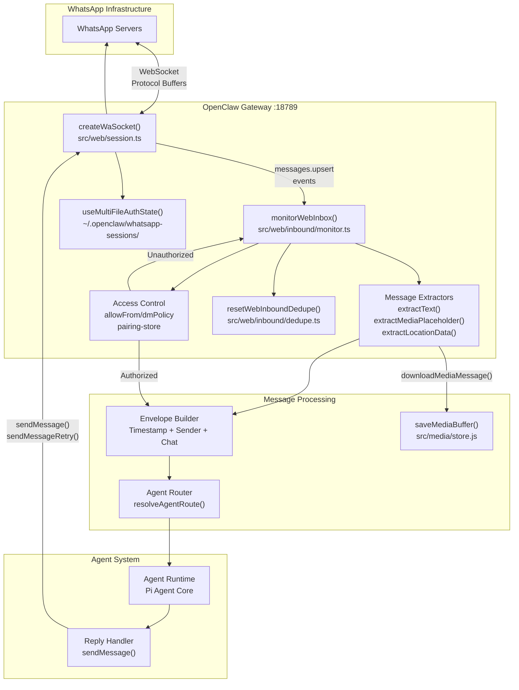
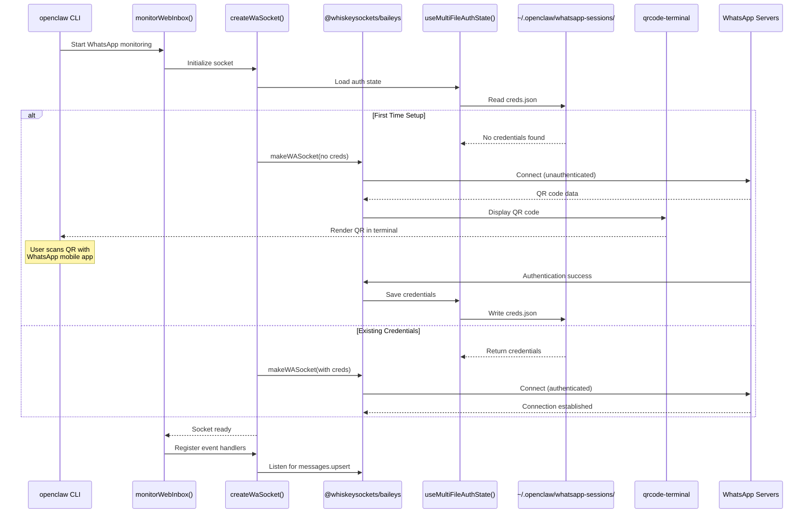
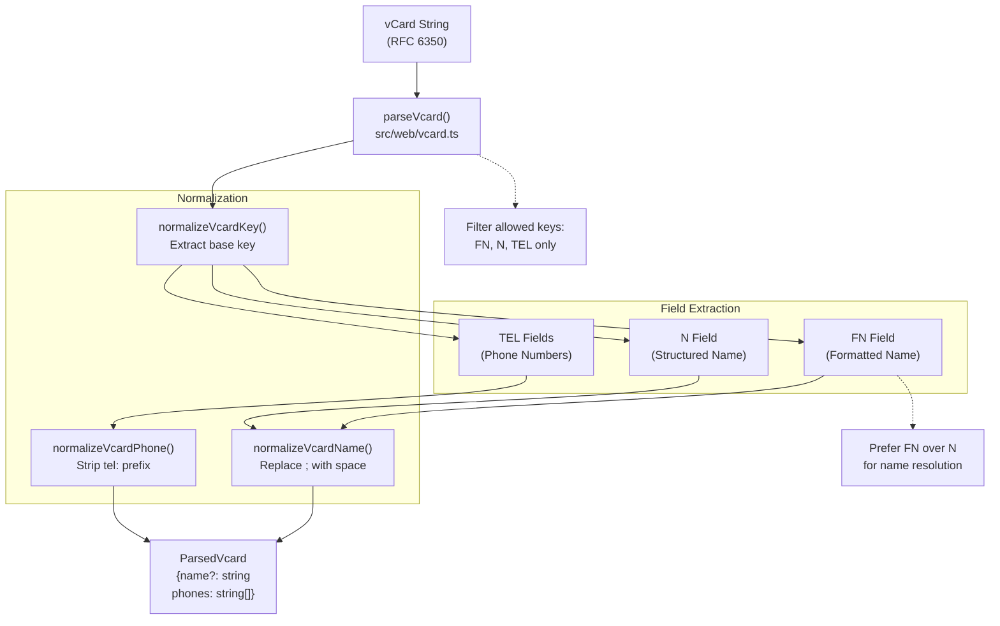
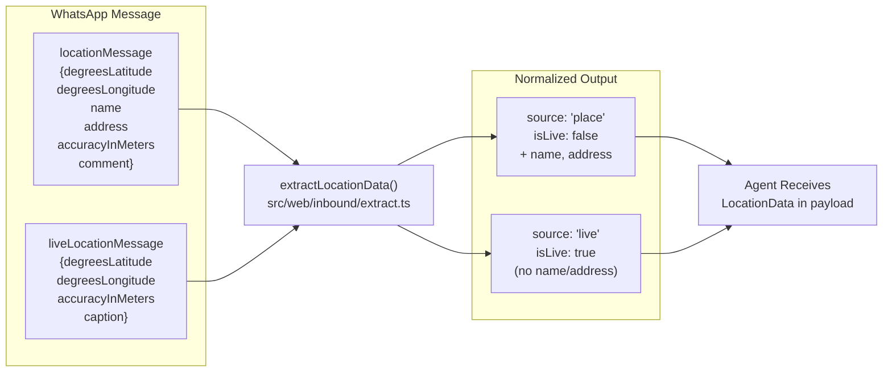
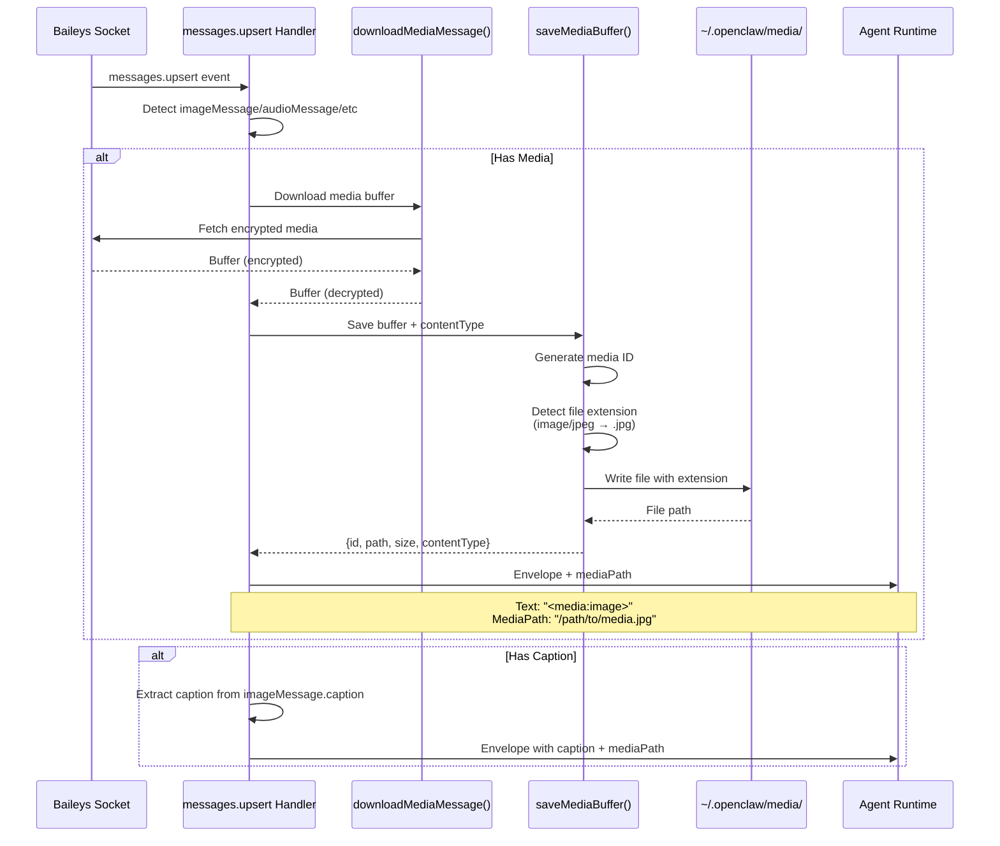
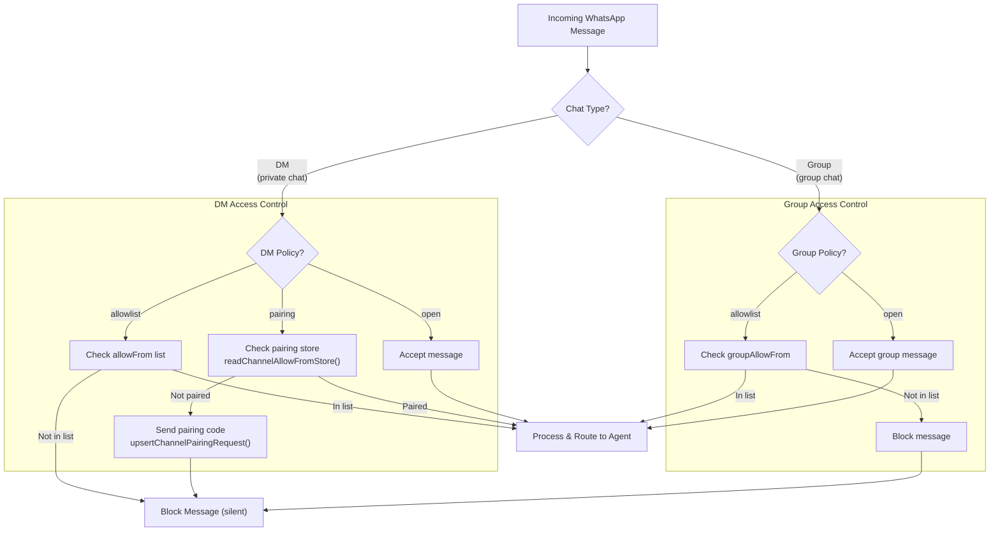
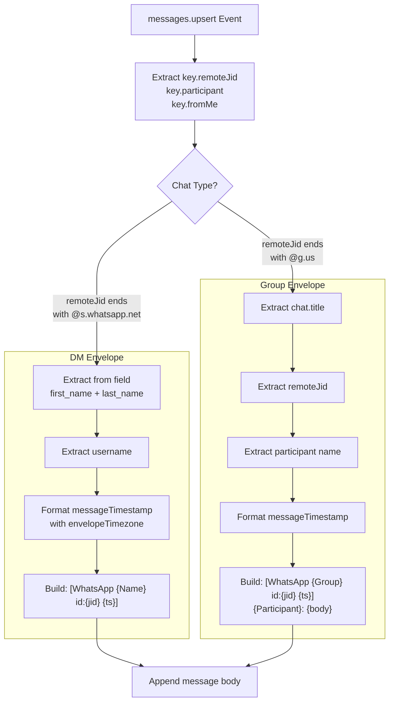
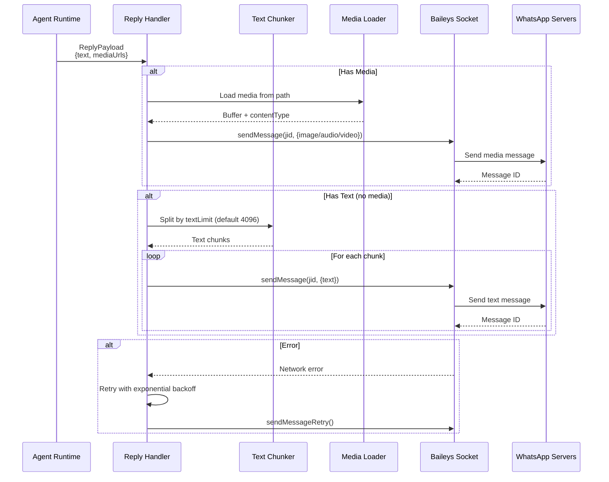
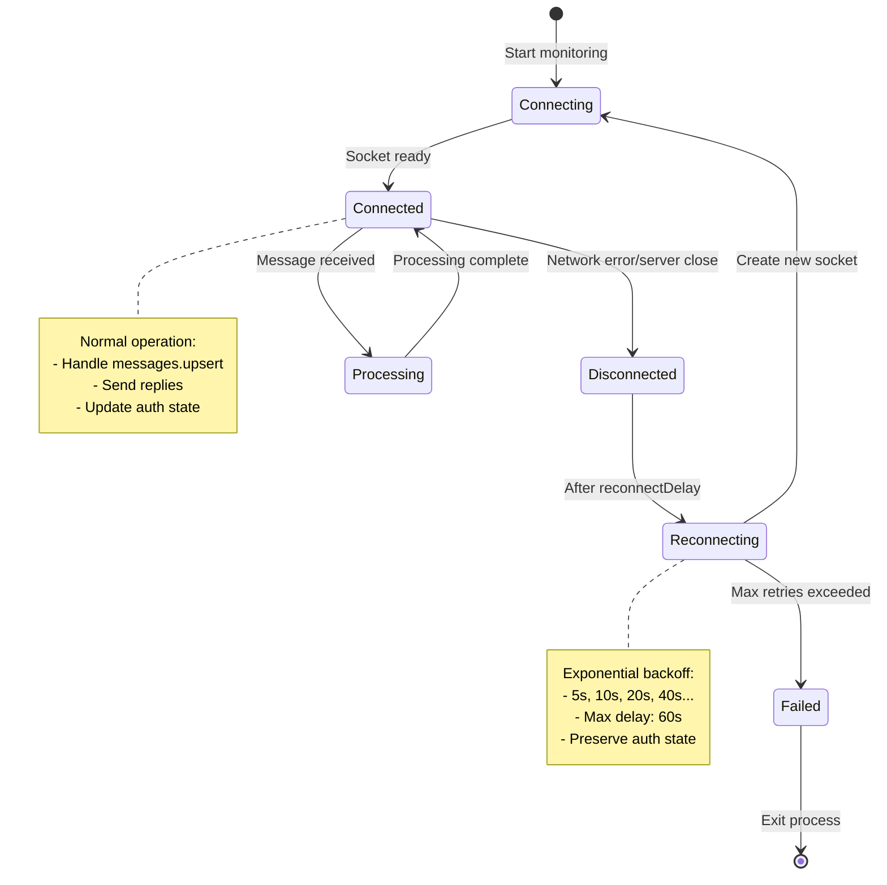

# Page: WhatsApp Integration

# WhatsApp Integration

<details>
<summary>Relevant source files</summary>

The following files were used as context for generating this wiki page:

- [README.md](README.md)
- [assets/avatar-placeholder.svg](assets/avatar-placeholder.svg)
- [docs/channels/zalo.md](docs/channels/zalo.md)
- [docs/channels/zalouser.md](docs/channels/zalouser.md)
- [scripts/clawtributors-map.json](scripts/clawtributors-map.json)
- [scripts/update-clawtributors.ts](scripts/update-clawtributors.ts)
- [scripts/update-clawtributors.types.ts](scripts/update-clawtributors.types.ts)
- [src/config/config.ts](src/config/config.ts)
- [src/discord/monitor.ts](src/discord/monitor.ts)
- [src/imessage/monitor.ts](src/imessage/monitor.ts)
- [src/index.test.ts](src/index.test.ts)
- [src/index.ts](src/index.ts)
- [src/signal/monitor.ts](src/signal/monitor.ts)
- [src/slack/monitor.ts](src/slack/monitor.ts)
- [src/telegram/bot.test.ts](src/telegram/bot.test.ts)
- [src/telegram/bot.ts](src/telegram/bot.ts)
- [src/web/auto-reply.ts](src/web/auto-reply.ts)
- [src/web/inbound.media.test.ts](src/web/inbound.media.test.ts)
- [src/web/inbound.test.ts](src/web/inbound.test.ts)
- [src/web/inbound.ts](src/web/inbound.ts)
- [src/web/test-helpers.ts](src/web/test-helpers.ts)
- [src/web/vcard.ts](src/web/vcard.ts)
- [tsconfig.json](tsconfig.json)
- [ui/src/styles.css](ui/src/styles.css)
- [ui/src/styles/layout.mobile.css](ui/src/styles/layout.mobile.css)

</details>


This document describes OpenClaw's WhatsApp integration via the Baileys library, covering connection establishment, message processing, media handling, and access control. For general channel routing and access policies, see [Channel Routing and Access Control](#8.1). For other messaging platforms, see [Telegram Integration](#8.3), [Discord Integration](#8.4), and [Signal Integration](#8.5).

---

## Architecture Overview

OpenClaw integrates with WhatsApp using [`@whiskeysockets/baileys`](https://github.com/WhiskeySockets/Baileys), a TypeScript/JavaScript library that implements the WhatsApp Web protocol. The integration consists of a WebSocket connection to WhatsApp servers, multi-file authentication state persistence, and message event handlers that route inbound messages to the agent system.



**Sources**: [src/web/inbound/monitor.ts:1-5](), [src/web/session.ts:1-88]() (inferred), [src/web/inbound/extract.ts:1-5]() (inferred)

---

## Connection and Authentication

WhatsApp authentication uses a multi-file auth state stored in `~/.openclaw/whatsapp-sessions/{accountId}/`. The connection process involves:

1. **Auth State Initialization**: `useMultiFileAuthState()` loads existing credentials or creates new storage
2. **Socket Creation**: `makeWASocket()` establishes WebSocket connection with authentication
3. **QR Code Login**: On first connection, a QR code is generated for pairing with WhatsApp mobile app
4. **Connection Monitoring**: `waitForWaConnection()` monitors connection status and handles reconnection

### Connection Flow



**Sources**: [src/web/session.ts:70-88]() (inferred from test mocks), [src/web/test-helpers.ts:55-73]()

---

## Message Types and Extraction

WhatsApp supports multiple message types, each requiring specific extraction logic. The `extractText()`, `extractMediaPlaceholder()`, and `extractLocationData()` functions handle different message structures.

### Message Type Matrix

| Message Type | Baileys Field | Extraction Function | Output Format |
|-------------|--------------|-------------------|---------------|
| **Text** | `conversation` | `extractText()` | Plain text |
| **Caption** | `imageMessage.caption`, `documentMessage.caption` | `extractText()` | Plain text from caption field |
| **Image** | `imageMessage` | `extractMediaPlaceholder()` | `<media:image>` + download |
| **Audio** | `audioMessage` | `extractMediaPlaceholder()` | `<media:audio>` + download |
| **Video** | `videoMessage` | `extractMediaPlaceholder()` | `<media:video>` + download |
| **Document** | `documentMessage` | `extractMediaPlaceholder()` | `<media:document>` + caption |
| **Contact** | `contactMessage` | `extractText()` | `<contact: Name, +Phone>` |
| **Contacts Array** | `contactsArrayMessage` | `extractText()` | `<contacts: Name1, +Phone1, ...>` |
| **Location** | `locationMessage` | `extractLocationData()` | Structured location object |
| **Live Location** | `liveLocationMessage` | `extractLocationData()` | Structured location with `isLive: true` |
| **View Once** | `viewOnceMessageV2Extension` | `extractText()` | Unwraps inner message |

**Sources**: [src/web/inbound.test.ts:5-238](), [src/web/inbound/extract.ts:1-5]() (inferred)

---

## Contact Card Parsing

WhatsApp contact messages contain vCard data (RFC 6350 format). The `parseVcard()` function extracts name and phone numbers from vCard strings.

### vCard Extraction Logic



### Contact Card Examples

**Single Contact:**
```
[WhatsApp Ada Lovelace (+15555550123) id:111@s.whatsapp.net]
<contact: Ada Lovelace, +15555550123>
```

**Multiple Contacts:**
```
[WhatsApp Ada Lovelace (+15555550123) id:111@s.whatsapp.net]
<contacts: Alice, +15555550101, Bob, +15555550102, Charlie, +15555550103 (+1 more), Dana, +15555550105>
```

**Sources**: [src/web/vcard.ts:1-65](), [src/web/inbound.test.ts:27-164]()

---

## Location Messages

WhatsApp supports both static location messages (single point) and live location messages (real-time sharing). The `extractLocationData()` function normalizes both types into a unified structure.

### Location Data Structure

```typescript
type LocationData = {
  latitude: number;
  longitude: number;
  accuracy?: number;
  name?: string;        // Place name (static only)
  address?: string;     // Address (static only)
  caption?: string;     // User comment
  source: "place" | "live";
  isLive: boolean;
}
```

### Location Message Handling



**Example Location Envelope:**
```
[WhatsApp Ada Lovelace (+15555550123) id:111@s.whatsapp.net 2025-01-09 00:00:00 UTC]
Location: 48.858844, 2.294351 (accuracy: 12m)
Name: Eiffel Tower
Address: Champ de Mars, Paris
Comment: Meet here
```

**Sources**: [src/web/inbound.test.ts:197-237](), [src/web/inbound/extract.ts:1-5]() (inferred)

---

## Media Handling

WhatsApp media messages (images, audio, video, documents) are downloaded via `downloadMediaMessage()` from Baileys, then saved to the OpenClaw media store using `saveMediaBuffer()`.

### Media Processing Pipeline



### Media Size Limits

Media downloads are subject to `mediaMaxMb` configuration (default 5MB for WhatsApp). The `saveMediaBuffer()` function enforces this limit and throws an error if exceeded.

**Configuration:**
```json
{
  "channels": {
    "whatsapp": {
      "mediaMaxMb": 5
    }
  }
}
```

**Sources**: [src/web/inbound.media.test.ts:92-233](), [src/media/store.js:1-5]() (inferred from imports)

---

## Access Control

WhatsApp integration supports three DM policies: `allowlist`, `pairing`, and `open`. Access control is enforced before message processing begins.

### Access Control Flow



### Pairing Code Flow

When `dmPolicy: "pairing"` is configured and an unknown user sends a message:

1. System checks `readChannelAllowFromStore()` for existing pairing
2. If not paired, calls `upsertChannelPairingRequest()` to generate code
3. Sends message to user: "Your WhatsApp user id: {jid}\nPairing code: {code}"
4. User provides code to administrator via secure channel
5. Administrator runs `openclaw channels add whatsapp --allow-from {jid}` or approves via Control UI
6. Future messages from that JID are accepted

**Sources**: [src/web/inbound/monitor.ts:1-5]() (inferred), [src/pairing/pairing-store.js:1-35]() (inferred from test mocks)

---

## Message Envelope Format

All WhatsApp messages are wrapped in a standardized envelope before routing to agents. The envelope includes metadata about the sender, chat, and timestamp.

### Envelope Structure

**DM Envelope:**
```
[WhatsApp {First} {Last} ({Username}) id:{jid} {timestamp}]
{message body}
```

**Group Envelope:**
```
[WhatsApp {GroupName} id:{groupJid} {timestamp}]
{SenderName} ({@username}): {message body}
```

**With Reply Context:**
```
[WhatsApp {Name} id:{jid} {timestamp}]
[Replying to {ReplyToSender} id:{replyToMessageId}]
{quoted message}
---
{message body}
```

### Envelope Builder Logic



**Sources**: [src/web/inbound/monitor.ts:1-5]() (inferred), [src/telegram/bot.test.ts:517-558]() (similar envelope pattern)

---

## Configuration Reference

WhatsApp integration is configured under `channels.whatsapp` in `openclaw.json`.

### Configuration Schema

```json
{
  "channels": {
    "whatsapp": {
      "enabled": true,
      "accountId": "default",
      "dmPolicy": "pairing",
      "allowFrom": ["111@s.whatsapp.net"],
      "groupPolicy": "allowlist",
      "groupAllowFrom": ["222@g.us"],
      "mediaMaxMb": 5,
      "blockStreaming": false,
      "sessionPath": "~/.openclaw/whatsapp-sessions/default",
      "qrTimeout": 60000,
      "reconnectDelay": 5000
    }
  }
}
```

### Configuration Parameters

| Parameter | Type | Default | Description |
|-----------|------|---------|-------------|
| `enabled` | boolean | `true` | Enable WhatsApp monitoring |
| `accountId` | string | `"default"` | Identifier for multi-account support |
| `dmPolicy` | `"allowlist"` \| `"pairing"` \| `"open"` | `"pairing"` | DM access control policy |
| `allowFrom` | string[] | `[]` | Allowlist of JIDs for DM access |
| `groupPolicy` | `"allowlist"` \| `"open"` | `"allowlist"` | Group chat access policy |
| `groupAllowFrom` | string[] | `[]` | Allowlist of group JIDs |
| `mediaMaxMb` | number | `5` | Maximum media download size in MB |
| `blockStreaming` | boolean | `false` | Disable streaming responses (send complete) |
| `sessionPath` | string | `"~/.openclaw/whatsapp-sessions/{accountId}"` | Auth state storage path |
| `qrTimeout` | number | `60000` | QR code display timeout (ms) |
| `reconnectDelay` | number | `5000` | Delay between reconnection attempts (ms) |

**Sources**: [src/config/types.ts:1-15]() (inferred), [src/web/test-helpers.ts:8-19]()

---

## Deduplication

The WhatsApp integration implements message deduplication to prevent processing duplicate `messages.upsert` events that can occur during reconnections or message history sync.

### Deduplication Mechanism

The `resetWebInboundDedupe()` function maintains an in-memory cache of recently processed message IDs. When a message arrives:

1. Extract `key.id` from the message
2. Check if ID exists in dedupe cache
3. If present, skip processing (silent drop)
4. If absent, add to cache and process message
5. Cache expires after a configurable TTL (typically 60 seconds)

**Dedupe Key Format:**
```
whatsapp:{remoteJid}:{messageId}
```

**Sources**: [src/web/inbound/dedupe.ts:1-5]() (inferred from exports), [src/web/inbound.media.test.ts:95]()

---

## Reply Sending

Replies from the agent are sent back through the Baileys socket using `sendMessage()` and related functions. The reply handler manages message chunking, media attachments, and error retry logic.

### Reply Pipeline



### Reply Configuration

Text chunking is configured via `messages.textChunkLimit` (global) or channel-specific limits:

```json
{
  "messages": {
    "textChunkLimit": 4096
  },
  "channels": {
    "whatsapp": {
      "textChunkLimit": 4096
    }
  }
}
```

**Sources**: [src/auto-reply/chunk.ts:1-9]() (inferred from imports), [src/telegram/bot.test.ts:995-1009]() (similar chunking pattern)

---

## Error Handling and Reconnection

The WhatsApp integration implements automatic reconnection with exponential backoff when connection failures occur.

### Reconnection States



### Connection Events Monitored

- `connection.update` - Connection state changes
- `creds.update` - Authentication credentials updated
- `messages.upsert` - New/updated messages
- `messages.update` - Message status changes (read receipts, etc.)

**Sources**: [src/web/session.ts:70-88]() (inferred from test setup), [src/web/test-helpers.ts:70-83]()

---