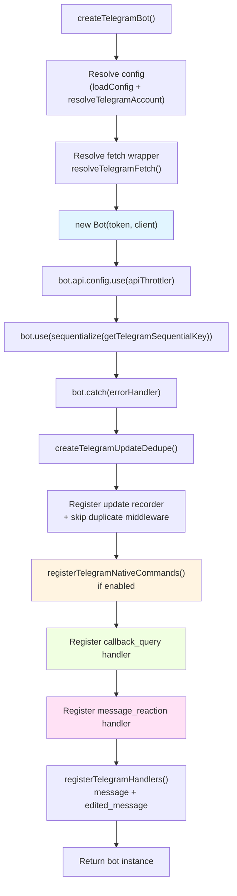
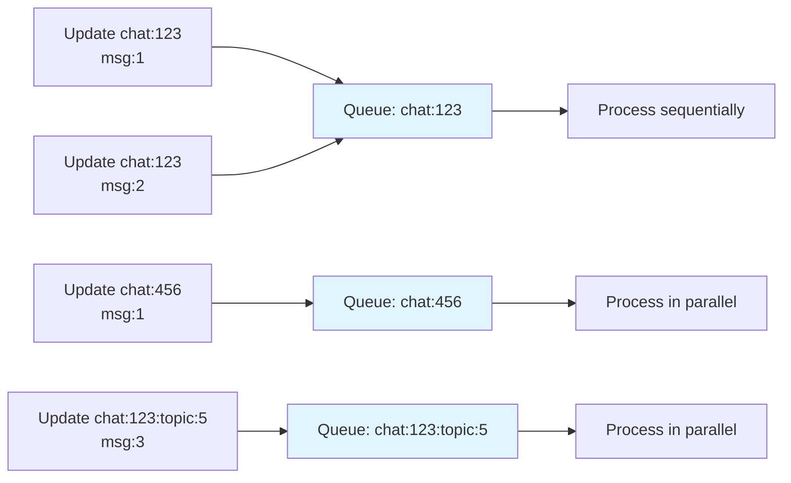
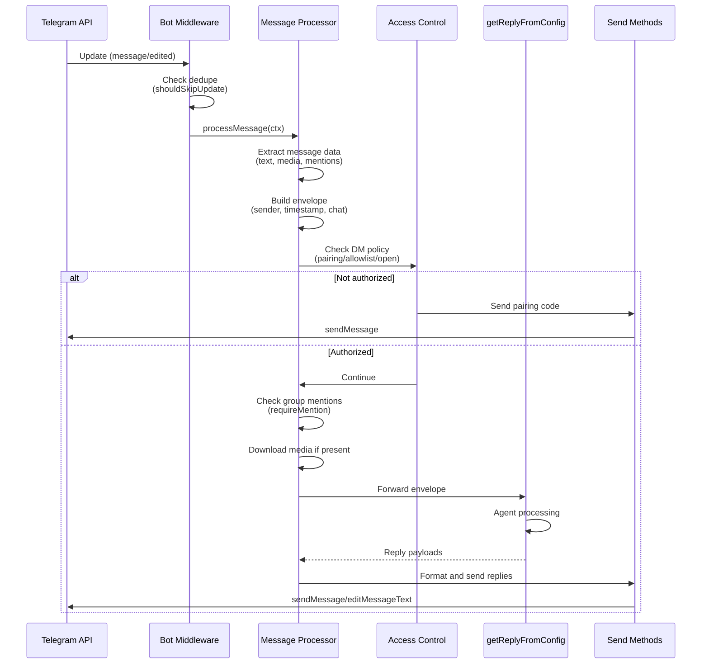
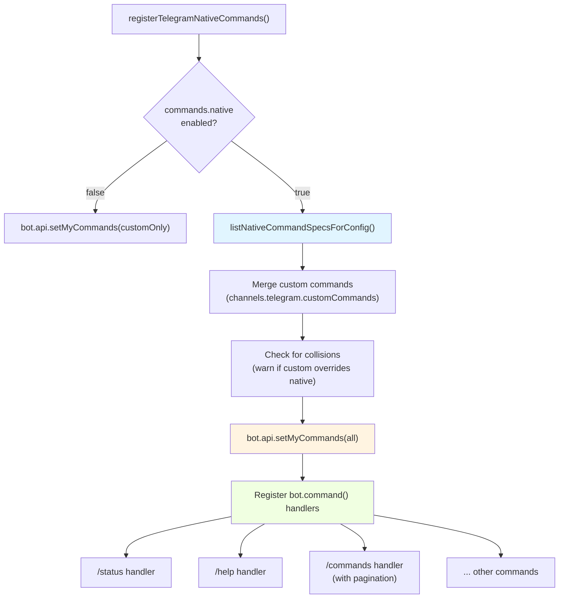
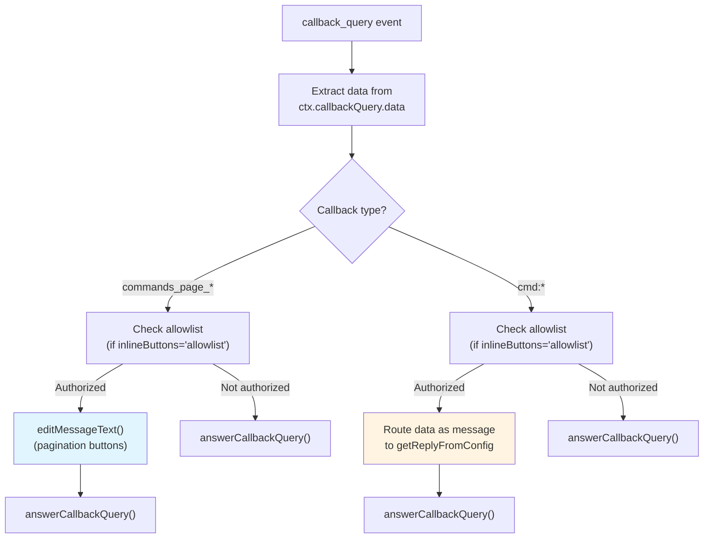
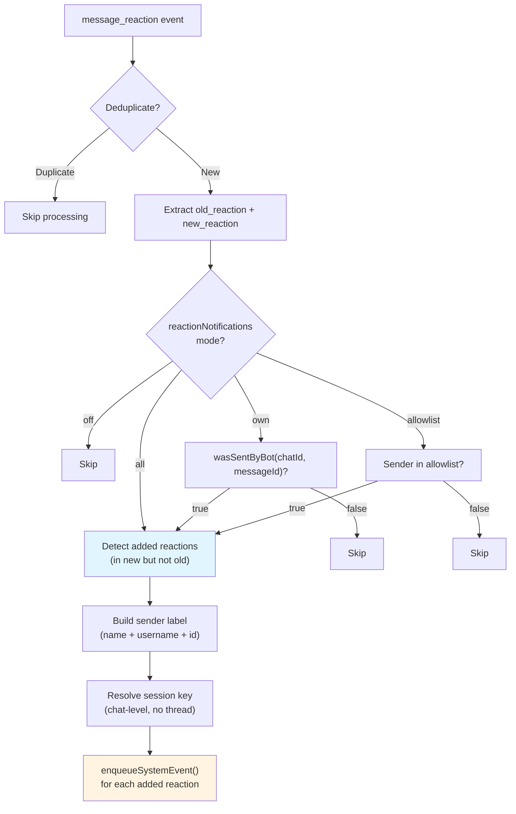
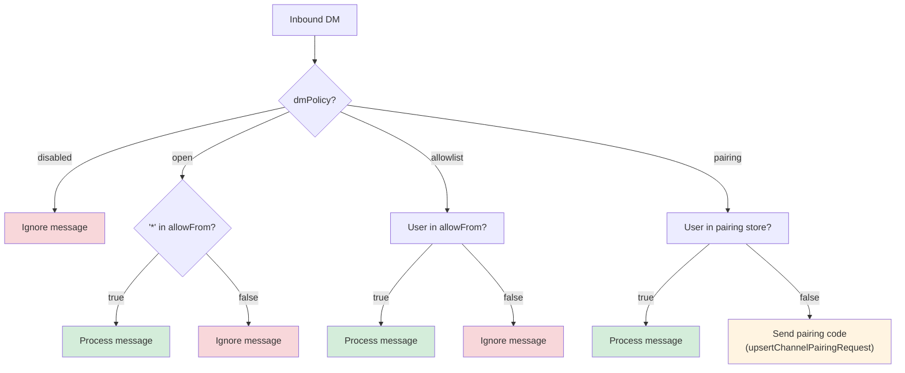

# Page: Telegram Integration

# Telegram Integration

<details>
<summary>Relevant source files</summary>

The following files were used as context for generating this wiki page:

- [README.md](README.md)
- [assets/avatar-placeholder.svg](assets/avatar-placeholder.svg)
- [docs/channels/zalo.md](docs/channels/zalo.md)
- [docs/channels/zalouser.md](docs/channels/zalouser.md)
- [scripts/clawtributors-map.json](scripts/clawtributors-map.json)
- [scripts/update-clawtributors.ts](scripts/update-clawtributors.ts)
- [scripts/update-clawtributors.types.ts](scripts/update-clawtributors.types.ts)
- [src/config/config.ts](src/config/config.ts)
- [src/discord/monitor.ts](src/discord/monitor.ts)
- [src/imessage/monitor.ts](src/imessage/monitor.ts)
- [src/index.test.ts](src/index.test.ts)
- [src/index.ts](src/index.ts)
- [src/signal/monitor.ts](src/signal/monitor.ts)
- [src/slack/monitor.ts](src/slack/monitor.ts)
- [src/telegram/bot.test.ts](src/telegram/bot.test.ts)
- [src/telegram/bot.ts](src/telegram/bot.ts)
- [src/web/auto-reply.ts](src/web/auto-reply.ts)
- [src/web/inbound.media.test.ts](src/web/inbound.media.test.ts)
- [src/web/inbound.test.ts](src/web/inbound.test.ts)
- [src/web/inbound.ts](src/web/inbound.ts)
- [src/web/test-helpers.ts](src/web/test-helpers.ts)
- [src/web/vcard.ts](src/web/vcard.ts)
- [tsconfig.json](tsconfig.json)
- [ui/src/styles.css](ui/src/styles.css)
- [ui/src/styles/layout.mobile.css](ui/src/styles/layout.mobile.css)

</details>


This page documents OpenClaw's Telegram integration, which provides a full-featured bot interface using the grammY library. The integration supports direct messages, group chats, forum topics, native commands, inline buttons, reactions, and both polling and webhook modes.

For general channel concepts (pairing, routing, access control), see [Channel Routing and Access Control](#8.1). For the pairing workflow, see [Pairing System](#8.2). For message flow details, see [Channel Message Flow](#8.3).

## Architecture Overview

The Telegram integration is built on [grammY](https://grammy.dev), a modern TypeScript Telegram Bot API framework. It handles all Telegram-specific protocol details while normalizing messages into OpenClaw's standard channel envelope format.

**Key Components:**
- **Bot instance**: grammY `Bot` class wraps the Telegram Bot API
- **Message processor**: Converts Telegram updates to OpenClaw envelopes
- **Native commands**: Telegram `/command` handlers with BotCommand registration
- **Callback handlers**: Inline button and pagination handlers
- **Reaction monitor**: Tracks emoji reactions with configurable notification modes
- **Update deduplication**: Prevents duplicate processing during reconnection

Sources: [src/telegram/bot.ts:1-499]()

## Bot Initialization Flow



**Bot Constructor Parameters:**
- `token`: Bot API token from BotFather
- `client`: Optional API client config with custom fetch and timeout

**Middleware Chain:**
1. **API Throttler**: Rate limits outbound API calls per Telegram limits
2. **Sequentialize**: Ensures updates from the same chat are processed sequentially
3. **Error handler**: Catches all errors to prevent bot crashes
4. **Update logger**: Logs raw updates in verbose mode
5. **Update recorder**: Tracks `update_id` for offset management

Sources: [src/telegram/bot.ts:112-224]()

## Sequential Update Processing



**Sequential Key Resolution** ([src/telegram/bot.ts:67-110]()):
- **Control commands**: `telegram:<chatId>:control` (prioritized)
- **Private chats**: `telegram:<chatId>`
- **Groups**: `telegram:<chatId>` (no topic isolation by default)
- **Forum topics**: `telegram:<chatId>:topic:<threadId>`
- **Reactions**: `telegram:<chatId>`

The `getTelegramSequentialKey` function ensures messages from the same chat are processed in order, preventing race conditions in session state.

Sources: [src/telegram/bot.ts:67-110]()

## Message Processing Pipeline



**Message Processor** ([src/telegram/bot.ts:342-363]()):
- Resolves sender identity (username, first/last name, user ID)
- Extracts text, captions, media attachments
- Detects mentions (explicit `@botUsername` or pattern-based)
- Downloads media within `mediaMaxBytes` limit
- Routes to session based on chat type (DM vs group vs topic)

**Envelope Format** (as tested in [src/telegram/bot.test.ts:518-560]()):
```
[Telegram <ChatName> (@<username>) id:<chatId> (<relative-time>) <timestamp>]
<SenderName> (@<senderUsername>): <message text>
```

Sources: [src/telegram/bot.ts:342-492](), [src/telegram/bot.test.ts:518-560]()

## Native Commands System



**Native Commands Registration** ([src/telegram/bot-native-commands.ts]() referenced in [src/telegram/bot.ts:365-383]()):
1. Load native command specs from `listNativeCommandSpecsForConfig`
2. Load custom commands from `channels.telegram.customCommands`
3. Normalize custom commands (lowercase, strip leading `/`)
4. Detect collisions (native commands win, custom ignored with warning)
5. Register via `bot.api.setMyCommands()`
6. Register handlers via `bot.command(name, handler)`

**Custom Commands** (as tested in [src/telegram/bot.test.ts:217-246]()):
```json5
{
  channels: {
    telegram: {
      customCommands: [
        { command: "custom_backup", description: "Git backup" },
        { command: "/Custom_Generate", description: "Create an image" }
      ]
    }
  }
}
```

Commands are normalized to lowercase and stripped of leading `/`. Native commands take precedence.

Sources: [src/telegram/bot.ts:365-383](), [src/telegram/bot.test.ts:217-316]()

## Inline Buttons and Callback Queries



**Callback Query Handling** ([src/telegram/bot.ts]() as tested in [src/telegram/bot.test.ts:364-516]()):

1. **Pagination callbacks**: Pattern `commands_page_<N>[:<sessionKey>]`
   - Re-render `/commands` list for the specified page
   - Update message inline buttons with `editMessageText`
   - Always calls `answerCallbackQuery` to dismiss loading state

2. **Command callbacks**: Pattern `cmd:<payload>`
   - Route payload as a new message to the agent
   - Sender must pass same access control as regular messages
   - Triggers full reply pipeline

3. **Access control**: `channels.telegram.capabilities.inlineButtons`
   - `"open"` (default): Anyone can click buttons
   - `"allowlist"`: Only users in `allowFrom` can interact

**Test Case**: [src/telegram/bot.test.ts:364-435]() demonstrates callback routing and access control.

Sources: [src/telegram/bot.test.ts:364-516]()

## Reaction Notifications



**Reaction Modes** ([src/telegram/bot.ts:386-475]()):

| Mode | Behavior |
|------|----------|
| `"off"` | No reaction notifications |
| `"own"` | Only reactions to bot-sent messages (tracked in sent message cache) |
| `"all"` | All reactions in allowed chats |
| `"allowlist"` | Reactions from users in `channels.telegram.allowFrom` |

**Reaction Event Format**:
```
Telegram reaction added: <emoji> by <senderLabel> on msg <messageId>
```

Enqueued as system events with context key: `telegram:reaction:add:<chatId>:<messageId>:<userId>:<emoji>`

**Note**: Telegram's `MessageReactionUpdated` does not include `message_thread_id`, so reactions always route to the chat-level session (forum topic isolation not available for reactions).

Sources: [src/telegram/bot.ts:386-475]()

## Access Control

**DM Policy Decision Tree**:



**Group Access** ([src/telegram/bot.ts:289-340]()):
- `channels.telegram.groups`: Group allowlist (keys are numeric chat IDs)
- `channels.telegram.groups["*"]`: Wildcard for all groups
- Per-group `requireMention`: Override mention requirement
- Per-topic config: `channels.telegram.groups[<id>].topics[<threadId>]`

**Mention Detection**:
1. Explicit: `@botUsername` in message text
2. Patterns: `messages.groupChat.mentionPatterns` (regex, case-insensitive)
3. Reply-to-bot: Replying to a bot message (TODO: verify implementation)

Sources: [src/telegram/bot.ts:226-340]()

## Configuration Reference

**Core Settings**:

| Setting | Type | Default | Description |
|---------|------|---------|-------------|
| `channels.telegram.enabled` | boolean | `true` | Enable/disable channel |
| `channels.telegram.botToken` | string | `TELEGRAM_BOT_TOKEN` | Bot API token (env wins) |
| `channels.telegram.dmPolicy` | string | `"pairing"` | DM access: `pairing\|allowlist\|open\|disabled` |
| `channels.telegram.allowFrom` | array | `[]` | DM allowlist (numeric user IDs or usernames) |
| `channels.telegram.groupAllowFrom` | array | `allowFrom` | Group allowlist (falls back to `allowFrom`) |
| `channels.telegram.groupPolicy` | string | `"open"` | Group policy: `open\|allowlist\|disabled` |
| `channels.telegram.mediaMaxMb` | number | `5` | Max media size (MB) |
| `channels.telegram.replyToMode` | string | `"first"` | Reply target: `first\|all\|none` |

**Advanced Settings**:

| Setting | Type | Default | Description |
|---------|------|---------|-------------|
| `channels.telegram.webhookUrl` | string | `undefined` | Webhook URL (mutually exclusive with polling) |
| `channels.telegram.webhookSecret` | string | `undefined` | Webhook secret token |
| `channels.telegram.historyLimit` | number | `20` | Group history size |
| `channels.telegram.timeoutSeconds` | number | `undefined` | API request timeout |
| `channels.telegram.blockStreaming` | boolean | `false` | Disable streaming mode |
| `channels.telegram.reactionNotifications` | string | `"own"` | Reaction mode: `off\|own\|all\|allowlist` |
| `channels.telegram.network.ipv4` | boolean | `true` | Enable IPv4 |
| `channels.telegram.network.ipv6` | boolean | `false` | Enable IPv6 |

**Native Commands**:

| Setting | Type | Default | Description |
|---------|------|---------|-------------|
| `commands.native` | boolean/string | `true` | Enable native commands globally |
| `channels.telegram.commands.native` | boolean/string | inherit | Override per-channel |
| `channels.telegram.commands.nativeSkills` | boolean | `true` | Include skill commands |
| `channels.telegram.customCommands` | array | `[]` | Custom command definitions |

Custom command format:
```json5
{
  command: "backup",         // lowercase, no leading /
  description: "Run backup"  // shown in Telegram command list
}
```

Sources: [src/telegram/bot.ts:112-147](), [src/telegram/bot.ts:226-263](), [src/telegram/bot.test.ts:217-316]()

## Multi-Account Configuration

Telegram supports multiple bot accounts via `channels.telegram.accounts`:

```json5
{
  channels: {
    telegram: {
      enabled: true,
      defaultAccount: "main",
      accounts: {
        main: {
          botToken: "123456:ABC-DEF",
          dmPolicy: "pairing"
        },
        support: {
          botToken: "789012:GHI-JKL",
          dmPolicy: "allowlist",
          allowFrom: ["@supportteam"]
        }
      }
    }
  }
}
```

Each account:
- Runs an independent bot instance
- Has its own allowlist and policies
- Routes to a unique session namespace: `agent:<agentId>:telegram:<accountId>:<peerId>`

Sources: [src/telegram/accounts.ts]() (referenced in [src/telegram/bot.ts:120-125]())

## Webhook vs Polling

**Polling Mode** (default):
- Uses `bot.api.getUpdates()` with long polling
- No public URL required
- Tracks `update_id` offset in memory (optionally persisted via `updateOffset.onUpdateId`)
- Suitable for development and single-instance deployments

**Webhook Mode**:
- Telegram POSTs updates to `channels.telegram.webhookUrl`
- Gateway HTTP server handles requests at `webhookPath` (defaults to URL path)
- Requires HTTPS with valid certificate
- Must set `channels.telegram.webhookSecret` for verification
- Suitable for production with load balancers

**Webhook Setup**:
```typescript
const { path, handler } = createTelegramWebhookCallback(bot, "/telegram-webhook");
app.post(path, handler);
```

Telegram sends `X-Telegram-Bot-Api-Secret-Token` header; Gateway verifies it matches `webhookSecret`.

Sources: [src/telegram/bot.ts:496-498](), [README.md:342-354]()

## Delivery Targets (CLI/Cron)

Send messages via CLI:
```bash
# Numeric chat ID
openclaw message send --channel telegram --target 123456789 --message "Hello"

# Username (resolved to ID via directory)
openclaw message send --channel telegram --target @username --message "Hello"

# Group with topic
openclaw message send --channel telegram --target 123456789:topic:5 --message "Hello"
```

Target formats:
- `<chatId>`: Private chat or group
- `<chatId>:topic:<threadId>`: Forum topic
- `@<username>`: Resolved via directory

Sources: [README.md:69-74](), [src/telegram/bot.ts:42-48]()

## Network Configuration

**IPv4/IPv6 Selection** ([src/telegram/fetch.ts]() referenced in [src/telegram/bot.ts:127-129]()):
- `channels.telegram.network.ipv4`: Enable IPv4 (default `true`)
- `channels.telegram.network.ipv6`: Enable IPv6 (default `false`)

The fetch wrapper (`resolveTelegramFetch`) supports network family selection for environments with dual-stack issues.

**Proxy Support**:
Custom fetch implementations can be passed via `createTelegramBot({ proxyFetch })` for SOCKS/HTTP proxies.

Sources: [src/telegram/bot.ts:127-144](), [src/telegram/fetch.ts]()

## Error Handling and Logging

**Error Boundaries**:
1. Bot-level: `bot.catch(err => ...)` catches all middleware errors
2. Handler-level: Individual handlers wrap in try-catch
3. API errors: Wrapped with `withTelegramApiErrorLogging` for structured logging

**Verbose Logging** ([src/telegram/bot.ts:186-224]()):
- Raw update JSON (truncated to 8000 chars)
- Update dedupe decisions
- Pairing code sends
- Reaction event details

Enable via `--verbose` flag or `agents.defaults.verboseLevel`.

**Common Errors**:
- `401 Unauthorized`: Invalid bot token
- `409 Conflict`: Webhook and polling both active
- `429 Too Many Requests`: Rate limit (apiThrottler handles automatically)

Sources: [src/telegram/bot.ts:149-224](), [src/telegram/api-logging.ts]()

---