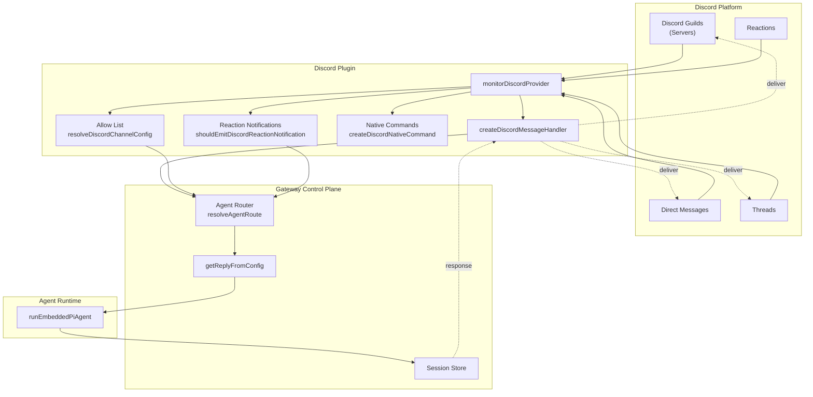
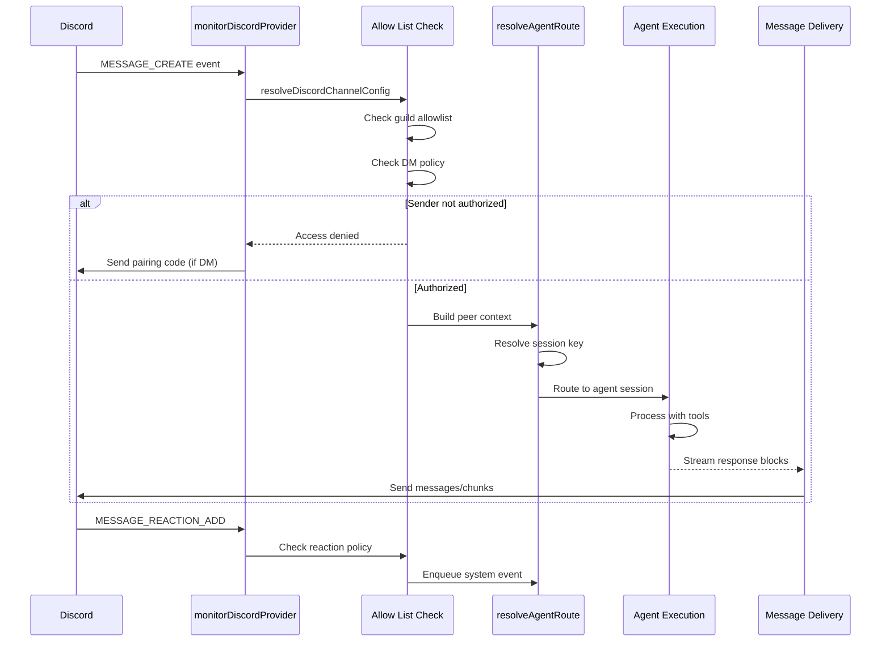
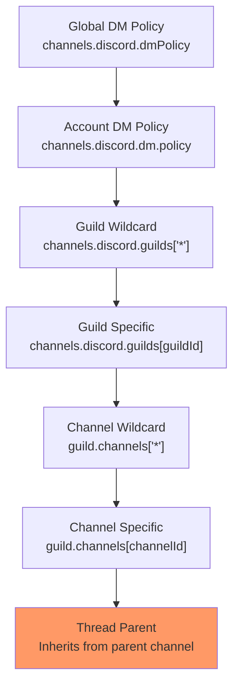

# Page: Discord Integration

# Discord Integration

<details>
<summary>Relevant source files</summary>

The following files were used as context for generating this wiki page:

- [README.md](README.md)
- [assets/avatar-placeholder.svg](assets/avatar-placeholder.svg)
- [docs/channels/zalo.md](docs/channels/zalo.md)
- [docs/channels/zalouser.md](docs/channels/zalouser.md)
- [scripts/clawtributors-map.json](scripts/clawtributors-map.json)
- [scripts/update-clawtributors.ts](scripts/update-clawtributors.ts)
- [scripts/update-clawtributors.types.ts](scripts/update-clawtributors.types.ts)
- [src/config/config.ts](src/config/config.ts)
- [src/discord/monitor.ts](src/discord/monitor.ts)
- [src/imessage/monitor.ts](src/imessage/monitor.ts)
- [src/index.test.ts](src/index.test.ts)
- [src/index.ts](src/index.ts)
- [src/signal/monitor.ts](src/signal/monitor.ts)
- [src/slack/monitor.ts](src/slack/monitor.ts)
- [src/telegram/bot.test.ts](src/telegram/bot.test.ts)
- [src/telegram/bot.ts](src/telegram/bot.ts)
- [src/web/auto-reply.ts](src/web/auto-reply.ts)
- [src/web/inbound.media.test.ts](src/web/inbound.media.test.ts)
- [src/web/inbound.test.ts](src/web/inbound.test.ts)
- [src/web/inbound.ts](src/web/inbound.ts)
- [src/web/test-helpers.ts](src/web/test-helpers.ts)
- [src/web/vcard.ts](src/web/vcard.ts)
- [tsconfig.json](tsconfig.json)
- [ui/src/styles.css](ui/src/styles.css)
- [ui/src/styles/layout.mobile.css](ui/src/styles/layout.mobile.css)

</details>


**Purpose**: This document describes the Discord channel integration in OpenClaw, covering bot setup, message handling, access control policies, native commands, guild/channel configuration, thread management, and reaction notifications.

**Scope**: This page focuses on the Discord-specific implementation. For general channel concepts and routing, see [Channel Routing and Access Control](#8.1). For message processing patterns shared across channels, see [Multi-Channel Message Processing](#1.3).

---

## Overview

Discord integration enables OpenClaw agents to communicate via Discord guilds (servers), channels, direct messages, and threads. The integration is implemented as a plugin that:

- Monitors Discord messages, reactions, and interactions
- Routes messages to appropriate agent sessions based on guild/channel/thread context
- Enforces DM pairing policies and guild-level allowlists
- Registers native slash commands and handles custom commands
- Manages thread-based conversations with parent channel binding inheritance
- Delivers agent responses with text chunking, media attachments, and optional block streaming

The Discord plugin uses the `discord.js` library (via `@buape/carbon` and `discord-api-types`) to interface with the Discord API and handle gateway events.

**Sources**: [src/discord/monitor.ts:1-29](), [CHANGELOG.md:322](), [CHANGELOG.md:156-159]()

---

## Architecture



**Key Components**:

- **monitorDiscordProvider**: Main entry point that starts the Discord bot and registers event listeners ([src/discord/monitor.ts:26]())
- **createDiscordMessageHandler**: Processes inbound Discord messages, checks allowlists, builds context, and triggers agent replies ([src/discord/monitor.ts:22]())
- **resolveDiscordChannelConfig**: Determines access permissions and policies for guilds, channels, and DMs ([src/discord/monitor.ts:11-17]())
- **createDiscordNativeCommand**: Registers Discord slash commands for agent control ([src/discord/monitor.ts:24]())

**Sources**: [src/discord/monitor.ts:1-29](), [CHANGELOG.md:156-159](), [CHANGELOG.md:322]()

---

## Message Flow



**Flow Steps**:

1. **Event Reception**: Discord bot receives `MESSAGE_CREATE`, `MESSAGE_UPDATE`, or `MESSAGE_REACTION_ADD` events
2. **Access Control**: `resolveDiscordChannelConfig` checks guild allowlists, channel allowlists, and DM policies
3. **Routing**: `resolveAgentRoute` determines the target agent and session key based on guild/channel/thread context
4. **Agent Execution**: Message is passed to the agent runtime with full context (sender, thread, mentions, media)
5. **Response Delivery**: Agent replies are chunked per Discord limits and sent back to the original context

**Sources**: [src/discord/monitor.ts:19-24](), [CHANGELOG.md:156-159]()

---

## Configuration

Discord integration is configured via the `channels.discord` section of `openclaw.json`:

| Field | Type | Description |
|-------|------|-------------|
| `token` | `string` | Discord bot token (or `DISCORD_BOT_TOKEN` env var) |
| `dmPolicy` | `"pairing" \| "open" \| "allowlist"` | DM access control mode (default: `"pairing"`) |
| `dm.allowFrom` | `string[]` | List of user IDs allowed to DM the bot |
| `dm.policy` | `"pairing" \| "open" \| "allowlist"` | Per-account DM policy override |
| `guilds` | `Record<string, GuildConfig>` | Guild-specific configuration (keyed by guild ID or `"*"` for default) |
| `intents` | `{ presences?: boolean, members?: boolean }` | Privileged gateway intents |
| `mediaMaxMb` | `number` | Max media file size in MB (default: 8) |
| `reactionNotifications` | `"off" \| "own" \| "all"` | Reaction notification mode |
| `commands.native` | `boolean` | Enable native slash commands |
| `commands.nativeSkills` | `boolean` | Auto-register skill commands |

**Guild Configuration** (`GuildConfig`):

| Field | Type | Description |
|-------|------|-------------|
| `allowFrom` | `string[]` | User IDs allowed in this guild |
| `channels` | `Record<string, ChannelConfig>` | Channel-specific policies |
| `groupPolicy` | `"open" \| "allowlist"` | Guild-level access mode |
| `requireMention` | `boolean` | Whether bot must be mentioned to respond |

**Example Configuration**:

```json5
{
  channels: {
    discord: {
      token: "YOUR_BOT_TOKEN",
      dmPolicy: "pairing",
      guilds: {
        "123456789012345678": {
          allowFrom: ["user1", "user2"],
          requireMention: true,
          channels: {
            "987654321098765432": {
              allowFrom: ["*"],
              requireMention: false
            }
          }
        }
      },
      intents: {
        presences: false,
        members: false
      },
      reactionNotifications: "own"
    }
  }
}
```

**Sources**: [README.md:359-373](), [CHANGELOG.md:322]()

---

## Access Control Hierarchy



**Access Control Functions**:

- **resolveDiscordChannelConfig**: Resolves effective configuration for a guild/channel by walking the hierarchy ([src/discord/monitor.ts:11]())
- **isDiscordGroupAllowedByPolicy**: Checks if a guild is allowed based on policy and allowlists ([src/discord/monitor.ts:8]())
- **resolveDiscordCommandAuthorized**: Determines if a user can execute a command ([src/discord/monitor.ts:13]())
- **resolveDiscordShouldRequireMention**: Checks if bot must be mentioned in a channel ([src/discord/monitor.ts:15]())

**Thread Inheritance**: Threads inherit access configuration from their parent channel. This was fixed in [CHANGELOG.md:156]() to properly pass `parentPeer` for forum topic binding inheritance.

**Sources**: [src/discord/monitor.ts:1-18](), [CHANGELOG.md:42](), [CHANGELOG.md:156]()

---

## Commands

### Native Commands

Native commands are registered as Discord slash commands when `commands.native` is enabled:

- `/status` - Display session status (model, tokens, cost)
- `/new` or `/reset` - Reset the conversation session
- `/compact` - Compact session history
- `/think <level>` - Set thinking level (off|minimal|low|medium|high|xhigh)
- `/verbose on|off` - Toggle verbose mode
- `/usage off|tokens|full` - Configure usage display
- `/activation mention|always` - Toggle group activation mode (owner-only)
- `/restart` - Restart the gateway (owner-only)

Native commands are created via `createDiscordNativeCommand` and registered with Discord's API ([src/discord/monitor.ts:24]()).

**Sources**: [src/discord/monitor.ts:24](), [README.md:266-276]()

### Custom Commands

Custom commands can be added via `channels.discord.customCommands`:

```json5
{
  channels: {
    discord: {
      customCommands: [
        { command: "deploy", description: "Deploy to production" },
        { command: "logs", description: "Show recent logs" }
      ]
    }
  }
}
```

Custom commands are merged with native commands during registration. Commands that collide with native command names are rejected with an error ([CHANGELOG.md:253-256]()).

**Command Authorization**: Use `commands.useAccessGroups` to restrict commands to authorized users. The `resolveDiscordCommandAuthorized` function checks if a user has permission ([src/discord/monitor.ts:13]()).

**Sources**: [src/discord/monitor.ts:13](), [CHANGELOG.md:253-256]()

---

## Guilds and Channels

### Guild Configuration

Guilds (Discord servers) are configured under `channels.discord.guilds`. Each guild can have:

- **allowFrom**: List of user IDs allowed to interact with the bot
- **groupPolicy**: `"open"` (anyone can interact) or `"allowlist"` (only allowFrom users)
- **requireMention**: Whether the bot must be @mentioned to respond
- **channels**: Per-channel overrides

Use `"*"` as a wildcard key to set defaults for all guilds:

```json5
{
  guilds: {
    "*": {
      requireMention: true,
      groupPolicy: "allowlist"
    }
  }
}
```

**Sources**: [CHANGELOG.md:359-362]()

### Channel Configuration

Channels within a guild can override guild settings:

```json5
{
  guilds: {
    "123456789": {
      requireMention: true,
      channels: {
        "987654321": {
          requireMention: false,
          allowFrom: ["*"]
        }
      }
    }
  }
}
```

**Channel Allowlist Matching**: The `allowListMatches` function checks if a user ID is in the allowlist, supporting wildcards ([src/discord/monitor.ts:7]()).

**Sources**: [src/discord/monitor.ts:7](), [src/discord/monitor.ts:11]()

---

## Threads

### Thread Routing

Discord threads are treated as separate session contexts. The session key format for threads is:

```
agent:{agentId}:discord:thread:{guildId}:{threadId}
```

Threads inherit access configuration from their parent channel via `buildDiscordParentPeer` logic. This ensures that channel-level allowlists and policies apply to all threads within that channel ([CHANGELOG.md:156]()).

**Thread Functions**:

- **resolveDiscordReplyTarget**: Determines whether to reply in the thread or parent channel ([src/discord/monitor.ts:28]())
- **sanitizeDiscordThreadName**: Cleans thread names for safe display ([src/discord/monitor.ts:28]())

**Sources**: [src/discord/monitor.ts:28](), [CHANGELOG.md:156]()

---

## Reactions

### Reaction Notifications

Discord reactions can trigger system events that are delivered to the agent session. Configure reaction handling with `channels.discord.reactionNotifications`:

- **`"off"`**: No reaction notifications
- **`"own"`**: Only notify for reactions on messages sent by the bot (default)
- **`"all"`**: Notify for all reactions

Reaction events are enqueued as system events with context about the emoji, user, and message ([CHANGELOG.md:156-159]()).

**Reaction Function**:

- **shouldEmitDiscordReactionNotification**: Determines if a reaction event should be emitted based on policy ([src/discord/monitor.ts:17]())

**Example System Event**:

```
Discord reaction added: 👍 by @user on msg 987654321
```

**Sources**: [src/discord/monitor.ts:17](), [CHANGELOG.md:156-159]()

---

## Advanced Features

### PluralKit Support

OpenClaw resolves PluralKit proxied senders for allowlists and labels. When a message is sent via PluralKit, the system identifies the actual user behind the proxy and applies access control correctly ([CHANGELOG.md:178]()).

**Username Resolution**: The `resolveDiscordTarget` function correctly handles directory lookups and username resolution ([CHANGELOG.md:373-374]()).

**Sources**: [CHANGELOG.md:178](), [CHANGELOG.md:373-387]()

### Privileged Intents

Configure privileged gateway intents for presence and member data:

```json5
{
  channels: {
    discord: {
      intents: {
        presences: true,
        members: true
      }
    }
  }
}
```

These intents require approval in the Discord Developer Portal ([CHANGELOG.md:322]()).

**Sources**: [CHANGELOG.md:322]()

### Media Handling

Discord media is downloaded, validated against `mediaMaxMb` limits, and stored locally. Media paths are included in the agent context via `buildDiscordMediaPayload` ([src/discord/monitor.ts:23]()).

**Sources**: [src/discord/monitor.ts:23]()

### Security

Discord channels are treated as untrusted input. Key security features:

- **DM Pairing**: Unknown DM senders receive pairing codes by default (`dmPolicy: "pairing"`)
- **Allowlist Gating**: Guild/channel allowlists prevent unauthorized access
- **Untrusted Metadata**: Channel topics and metadata are not injected into system prompts ([CHANGELOG.md:56-58]())
- **Owner Identity Hints**: Allowlisted senders are treated as owners for system-prompt identity hints while keeping channel topics untrusted ([CHANGELOG.md:58]())

**Sources**: [CHANGELOG.md:56-58](), [README.md:112-119]()

---

## Integration with Other Channels

Discord shares infrastructure with other channels:

- **Session Management**: Uses the same session store and routing as Telegram, Slack, etc. (see [Session Management](#5.3))
- **Tool Policies**: Discord sessions inherit global and agent-level tool policies (see [Tool Security and Sandboxing](#6.2))
- **Commands**: Native command registration follows the same pattern as Telegram (see [Commands and Directives](#9))

**Sources**: [src/discord/monitor.ts:1-29](), [CHANGELOG.md:156-159]()

---