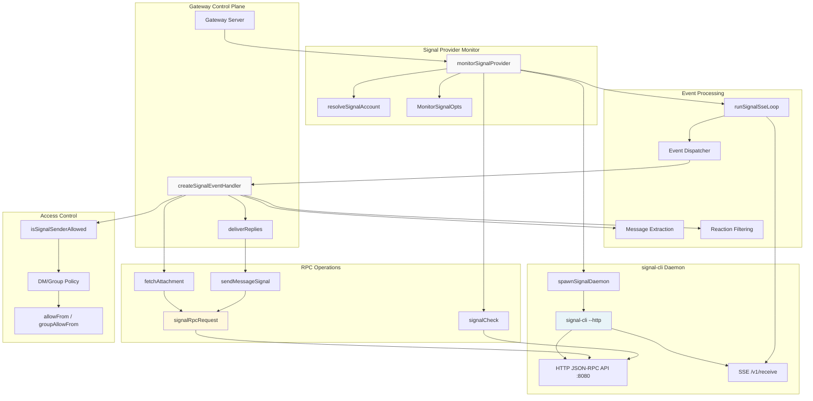
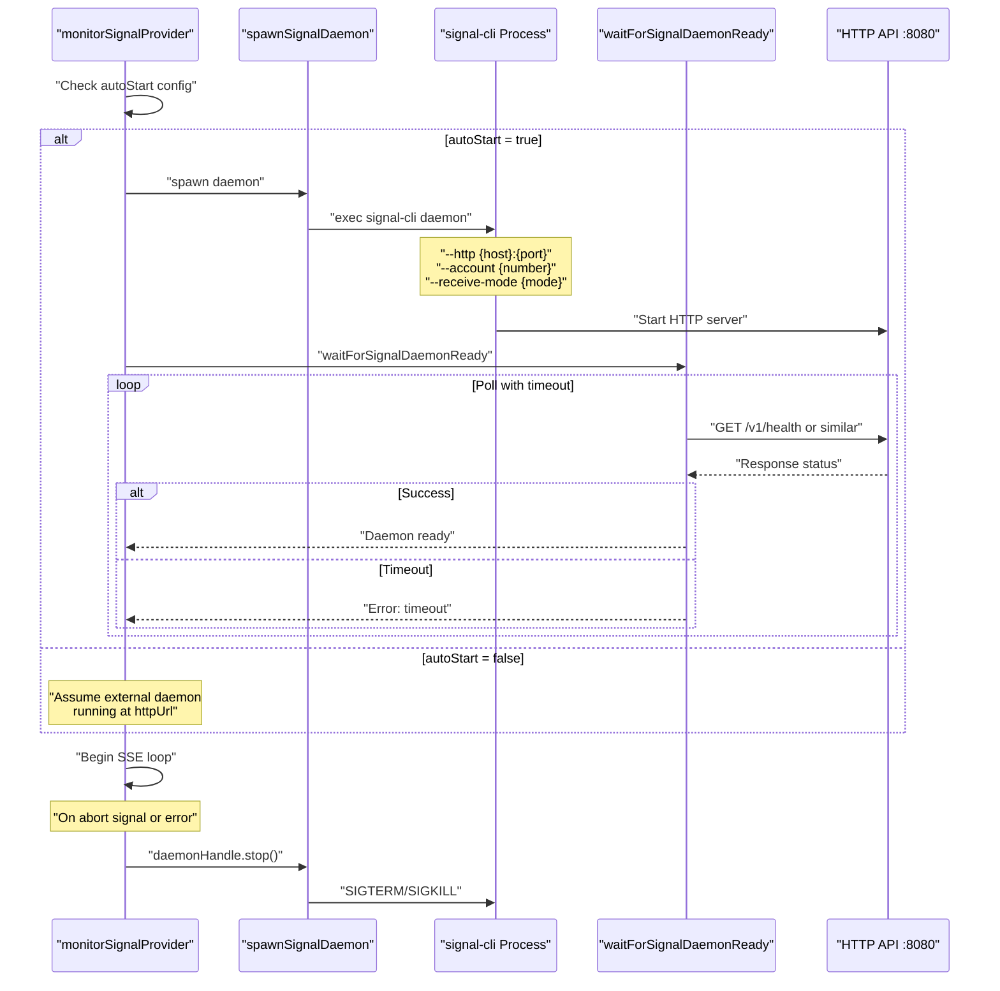
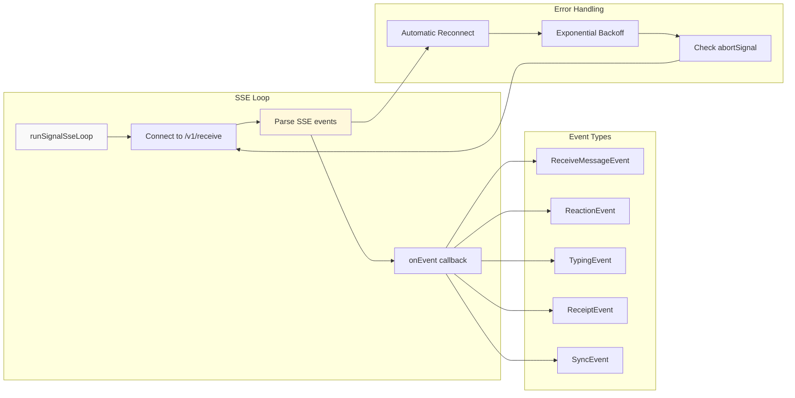
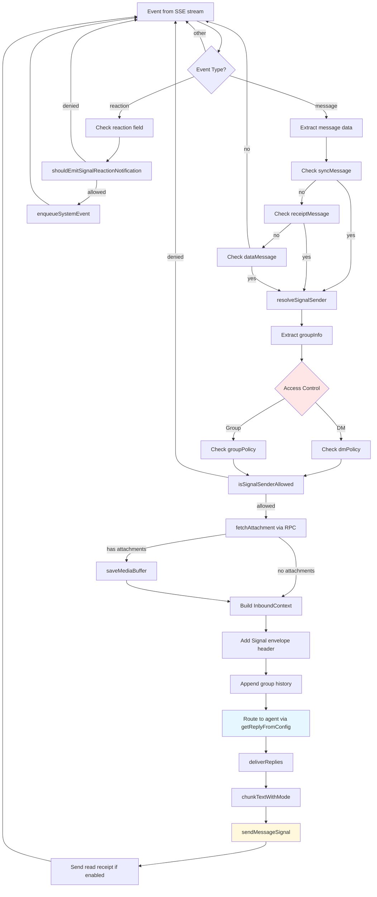
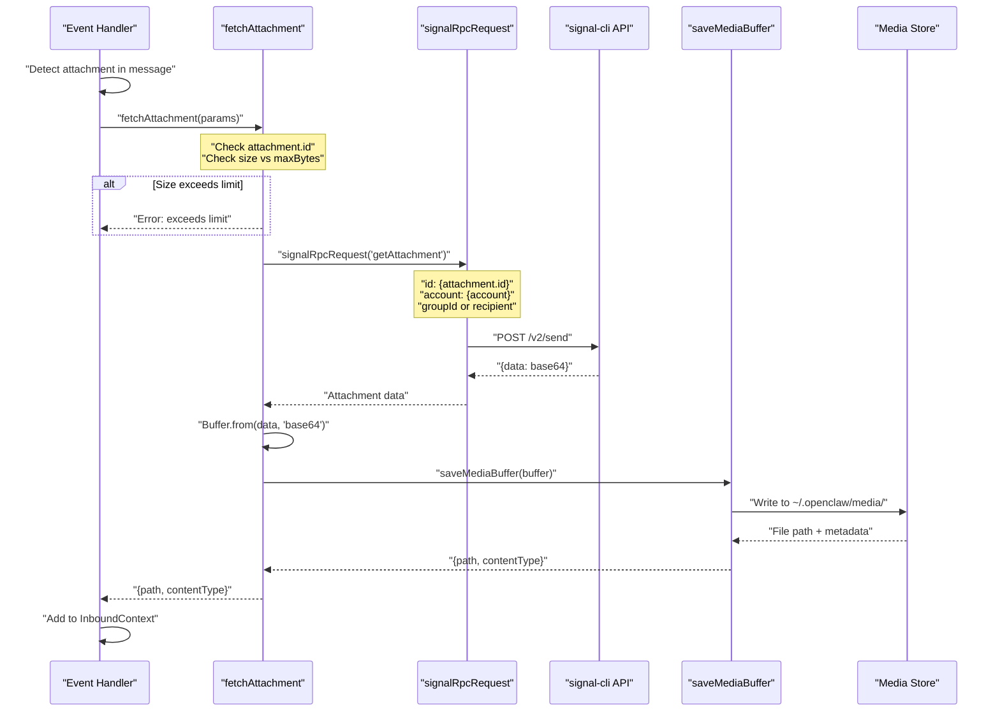
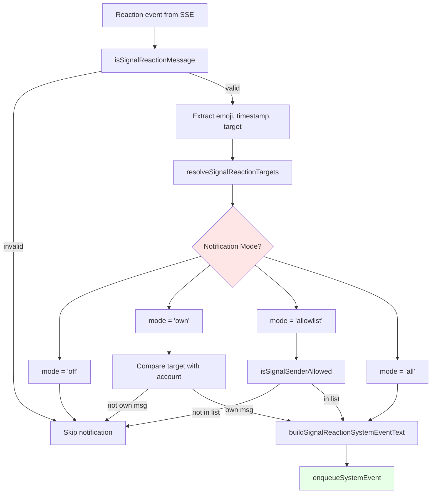
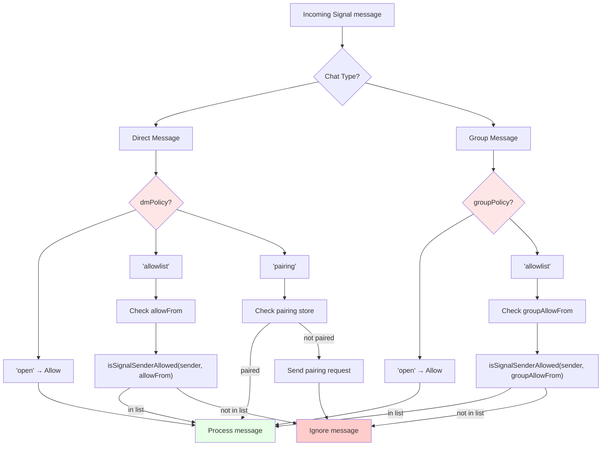
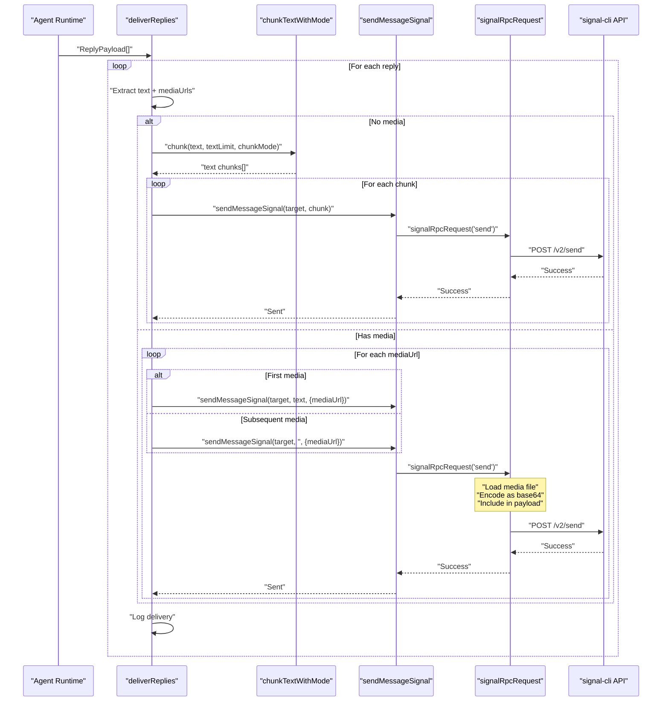

# Page: Signal Integration

# Signal Integration

<details>
<summary>Relevant source files</summary>

The following files were used as context for generating this wiki page:

- [README.md](README.md)
- [assets/avatar-placeholder.svg](assets/avatar-placeholder.svg)
- [docs/channels/zalo.md](docs/channels/zalo.md)
- [docs/channels/zalouser.md](docs/channels/zalouser.md)
- [scripts/clawtributors-map.json](scripts/clawtributors-map.json)
- [scripts/update-clawtributors.ts](scripts/update-clawtributors.ts)
- [scripts/update-clawtributors.types.ts](scripts/update-clawtributors.types.ts)
- [src/config/config.ts](src/config/config.ts)
- [src/discord/monitor.ts](src/discord/monitor.ts)
- [src/imessage/monitor.ts](src/imessage/monitor.ts)
- [src/index.test.ts](src/index.test.ts)
- [src/index.ts](src/index.ts)
- [src/signal/monitor.ts](src/signal/monitor.ts)
- [src/slack/monitor.ts](src/slack/monitor.ts)
- [src/telegram/bot.test.ts](src/telegram/bot.test.ts)
- [src/telegram/bot.ts](src/telegram/bot.ts)
- [src/web/auto-reply.ts](src/web/auto-reply.ts)
- [src/web/inbound.media.test.ts](src/web/inbound.media.test.ts)
- [src/web/inbound.test.ts](src/web/inbound.test.ts)
- [src/web/inbound.ts](src/web/inbound.ts)
- [src/web/test-helpers.ts](src/web/test-helpers.ts)
- [src/web/vcard.ts](src/web/vcard.ts)
- [tsconfig.json](tsconfig.json)
- [ui/src/styles.css](ui/src/styles.css)
- [ui/src/styles/layout.mobile.css](ui/src/styles/layout.mobile.css)

</details>


This document describes OpenClaw's Signal messaging integration, which uses `signal-cli` as the underlying transport. The integration spawns and manages a signal-cli daemon, consumes its Server-Sent Events (SSE) stream for incoming messages, and uses its JSON-RPC API for sending messages and fetching attachments.

For general channel concepts (routing, access control, session keys), see [Channel Routing and Access Control](#8.1). For other messaging platforms, see [WhatsApp Integration](#8.2), [Telegram Integration](#8.3), [Discord Integration](#8.4), and [Other Channels](#8.6).

---

## Architecture Overview

**Signal Integration Component Architecture**



**Sources:** [src/signal/monitor.ts:1-377]()

The Signal integration follows a daemon-based architecture where `monitorSignalProvider` orchestrates the entire lifecycle. It optionally spawns a signal-cli daemon process (if `autoStart` is enabled), waits for the HTTP API to become ready, then opens an SSE connection to receive events. Incoming events are dispatched to `createSignalEventHandler`, which applies access control, fetches attachments via JSON-RPC, routes messages to the agent system, and delivers replies back through the signal-cli API.

---

## Configuration

**Signal Account Configuration Structure**

The Signal integration is configured through the `channels.signal` section of `openclaw.json`, with per-account overrides supported via the `accounts` map:

| Configuration Key | Type | Default | Description |
|-------------------|------|---------|-------------|
| `account` | `string` | required | Signal account phone number (E.164 format) |
| `accountId` | `string` | auto-generated | Internal identifier for multi-account setups |
| `httpUrl` | `string` | `http://127.0.0.1:8080` | Base URL for signal-cli HTTP API |
| `autoStart` | `boolean` | `true` if no `httpUrl` | Whether to spawn signal-cli daemon |
| `cliPath` | `string` | `"signal-cli"` | Path to signal-cli executable |
| `httpHost` | `string` | `"127.0.0.1"` | Daemon HTTP bind address |
| `httpPort` | `number` | `8080` | Daemon HTTP port |
| `receiveMode` | `"on-start" \| "manual"` | `undefined` | signal-cli receive mode |
| `startupTimeoutMs` | `number` | `30000` | Max time to wait for daemon startup (clamped 1s-120s) |
| `dmPolicy` | `"open" \| "allowlist" \| "pairing"` | `"pairing"` | DM access policy |
| `groupPolicy` | `"open" \| "allowlist"` | `"allowlist"` | Group access policy |
| `allowFrom` | `string[]` | `[]` | Phone numbers or UUIDs allowed for DMs |
| `groupAllowFrom` | `string[]` | `allowFrom` | Phone numbers/UUIDs allowed in groups |
| `reactionNotifications` | `"off" \| "own" \| "allowlist" \| "all"` | `"own"` | Reaction notification mode |
| `reactionAllowlist` | `string[]` | `[]` | Users whose reactions trigger notifications (when mode=`"allowlist"`) |
| `ignoreAttachments` | `boolean` | `false` | Skip downloading attachments |
| `ignoreStories` | `boolean` | `false` | Skip story messages |
| `sendReadReceipts` | `boolean` | `false` | Send read receipts via daemon |
| `mediaMaxMb` | `number` | `8` | Max attachment size in MB |
| `blockStreaming` | `boolean` | `false` | Disable streaming replies |
| `historyLimit` | `number` | from `messages.groupChat.historyLimit` | Max group history entries |

**Sources:** [src/signal/monitor.ts:38-57](), [src/signal/monitor.ts:253-286]()

The `resolveSignalAccount` function merges account-specific overrides with channel-level defaults and applies global fallbacks. Phone numbers in access lists are automatically normalized to E.164 format via `normalizeE164`.

---

## Daemon Management

**Signal Daemon Lifecycle**



**Sources:** [src/signal/monitor.ts:288-311](), [src/signal/monitor.ts:318-328](), [src/signal/monitor.ts:145-170]()

When `autoStart` is enabled (the default if no `httpUrl` is provided), `monitorSignalProvider` calls `spawnSignalDaemon` to fork a signal-cli daemon process. The daemon is invoked with:
- `--http {httpHost}:{httpPort}` - HTTP API binding
- `--account {account}` - Signal account number
- `--receive-mode {receiveMode}` - Message fetch mode (`on-start` or `manual`)
- `--ignore-attachments` - If configured
- `--ignore-stories` - If configured  
- `--send-read-receipts` - If configured

The `waitForSignalDaemonReady` function polls the HTTP API using `signalCheck` (which performs a health check request) with exponential backoff until the daemon responds successfully or `startupTimeoutMs` is exceeded. The timeout is clamped between 1 second and 120 seconds.

On abort or error, the daemon handle's `stop()` method is called, which sends SIGTERM followed by SIGKILL if the process doesn't exit cleanly.

**Sources:** [src/signal/monitor.ts:312-328](), [src/signal/monitor.ts:372-375]()

---

## Event Stream

**SSE Connection and Event Dispatching**



**Sources:** [src/signal/monitor.ts:358-368]()

The `runSignalSseLoop` function establishes a persistent SSE connection to the signal-cli daemon's `/v1/receive` endpoint. It continuously reads Server-Sent Events and dispatches them to the provided `onEvent` callback. The loop handles:

- **Connection Failures**: Automatic reconnection with exponential backoff
- **Abort Signals**: Graceful shutdown when `abortSignal` is triggered
- **Event Parsing**: Extraction of JSON payloads from SSE data frames
- **Error Isolation**: Individual event handler failures don't break the stream

Each event received from signal-cli is passed to `createSignalEventHandler`, which wraps the core message processing logic. The handler is invoked asynchronously, with errors caught and logged without disrupting the event stream.

**Sources:** [src/signal/monitor.ts:363-367]()

---

## Message Processing

**Signal Event Handler Flow**



**Sources:** [src/signal/monitor.ts:330-356]()

The `createSignalEventHandler` function orchestrates the complete message processing pipeline:

1. **Event Classification**: Examines the event payload to determine if it's a message, reaction, typing indicator, or receipt
2. **Sender Resolution**: Extracts sender phone number/UUID via `resolveSignalSender` from the `source` or `sourceUuid` fields
3. **Group Detection**: Checks for `groupInfo` to distinguish DMs from group messages
4. **Access Control**: Applies `isSignalSenderAllowed` against `allowFrom` (DMs) or `groupAllowFrom` (groups) based on the active policy
5. **Attachment Fetching**: For messages with attachments, calls `fetchAttachment` which:
   - Issues `getAttachment` RPC with attachment ID
   - Receives base64-encoded data
   - Decodes and saves via `saveMediaBuffer`
   - Returns local file path
6. **Context Building**: Constructs `InboundContext` with:
   - Signal envelope header: `[Signal {name} {phone/uuid} {timestamp}]`
   - Message text or attachment placeholder
   - Sender metadata
   - Group history (if applicable)
7. **Agent Routing**: Calls `getReplyFromConfig` which routes to the appropriate agent and session
8. **Reply Delivery**: `deliverReplies` chunks text (if needed) and sends via `sendMessageSignal` RPC
9. **Read Receipts**: If `sendReadReceipts` is enabled and the daemon supports it, marks the message as read

**Sources:** [src/signal/monitor.ts:209-251](), [src/signal/monitor.ts:172-207]()

---

## Attachments

**Signal Attachment Fetching Architecture**



**Sources:** [src/signal/monitor.ts:172-207]()

The `fetchAttachment` function implements Signal attachment retrieval:

**Parameters**:
- `baseUrl`: signal-cli HTTP API base URL
- `account`: Signal account number (optional, inferred from config)
- `attachment`: Attachment metadata object with `id`, `contentType`, `filename`, `size`
- `sender`: Sender phone/UUID for DM attachments
- `groupId`: Group ID for group attachments
- `maxBytes`: Size limit (from `mediaMaxMb * 1024 * 1024`)

**Process**:
1. Validates `attachment.id` is present
2. Checks `attachment.size` against `maxBytes`, throwing if exceeded
3. Constructs RPC parameters with either `groupId` (for groups) or `recipient` (for DMs)
4. Calls `signalRpcRequest("getAttachment", params)` which:
   - POSTs to signal-cli's JSON-RPC endpoint
   - Receives response with base64-encoded `data` field
5. Decodes base64 to Buffer
6. Calls `saveMediaBuffer(buffer, contentType, "inbound", maxBytes)` which:
   - Writes to `~/.openclaw/media/inbound/`
   - Generates unique filename with extension from content type
   - Returns `{id, path, size, contentType}`
7. Returns `{path, contentType}` to caller

The attachment path is then included in the `InboundContext` and made available to the agent for processing.

**Sources:** [src/signal/monitor.ts:172-207]()

---

## Reactions

**Signal Reaction Notification System**

The Signal integration supports reaction notifications with fine-grained filtering via the `reactionNotifications` configuration:

| Mode | Behavior |
|------|----------|
| `"off"` | No reaction notifications |
| `"own"` | Only notify for reactions to bot's own messages (default) |
| `"allowlist"` | Only notify for reactions from users in `reactionAllowlist` |
| `"all"` | Notify for all reactions |

**Reaction Processing Flow**:



**Sources:** [src/signal/monitor.ts:95-103](), [src/signal/monitor.ts:105-131](), [src/signal/monitor.ts:133-143]()

**Reaction Validation** (`isSignalReactionMessage`):
- Requires non-empty `emoji` string
- Requires valid `targetSentTimestamp` (number > 0)
- Requires at least one target identifier (`targetAuthor` or `targetAuthorUuid`)

**Target Resolution** (`resolveSignalReactionTargets`):
- Extracts both UUID and phone number targets
- Returns array of `{kind: "phone" | "uuid", id: string, display: string}`
- Normalizes phone numbers to E.164 format

**Notification Filtering** (`shouldEmitSignalReactionNotification`):
- **"off"**: Returns `false` immediately
- **"own"**: Compares `account` (bot's number) with reaction targets. Matches both phone and UUID formats
- **"allowlist"**: Calls `isSignalSenderAllowed(sender, reactionAllowlist)` to check if reactor is authorized
- **"all"**: Returns `true` unconditionally

**Event Generation** (`buildSignalReactionSystemEventText`):
```
Signal reaction added: {emoji} by {actor} msg {messageId} [from {target}] [in {group}]
```

The event is enqueued to the session's system event stream via `enqueueSystemEvent`, making it available to the agent as contextual information.

**Sources:** [src/signal/monitor.ts:81-143]()

---

## Access Control

**Signal Access Control Decision Tree**



**Sources:** [src/signal/monitor.ts:256-286]()

The Signal integration enforces access control through two independent policy systems:

**DM Policy** (`dmPolicy`):
- **"open"**: All DMs accepted
- **"allowlist"**: Only DMs from numbers/UUIDs in `allowFrom` accepted
- **"pairing"**: Requires explicit pairing via pairing codes (similar to Telegram/WhatsApp pairing)

**Group Policy** (`groupPolicy`):
- **"open"**: All group messages accepted
- **"allowlist"**: Only group messages from numbers/UUIDs in `groupAllowFrom` accepted

**Sender Validation** (`isSignalSenderAllowed`):
The function matches sender identifiers against the allowlist, supporting both:
- **Phone numbers**: Normalized to E.164 format (`+15551234567`)
- **UUIDs**: Signal UUID format (`uuid:...` or raw UUID)

The `groupAllowFrom` list defaults to `allowFrom` if not explicitly configured, providing a single unified allowlist. Both lists are normalized via `normalizeAllowList` which:
1. Converts all entries to strings
2. Trims whitespace
3. Filters out empty entries

**Sources:** [src/signal/monitor.ts:71-73](), [src/signal/monitor.ts:270-279]()

---

## Reply Delivery

**Signal Reply Chunking and Delivery**



**Sources:** [src/signal/monitor.ts:209-251]()

The `deliverReplies` function handles reply delivery with automatic text chunking and media attachment support:

**Parameters**:
- `replies`: Array of `ReplyPayload` objects from agent
- `target`: Recipient phone number or group ID
- `baseUrl`: signal-cli API URL
- `account`: Signal account number
- `accountId`: Internal account identifier
- `textLimit`: Max text length per message (from config)
- `chunkMode`: `"length"` or `"newline"` chunking strategy
- `maxBytes`: Media size limit

**Text-Only Messages**:
1. Call `chunkTextWithMode(text, textLimit, chunkMode)` which:
   - **"length" mode**: Split at `textLimit` characters
   - **"newline" mode**: Split at newlines, respecting `textLimit`
2. Send each chunk via `sendMessageSignal(target, chunk, {...})`
3. Log delivery for each chunk

**Messages with Media**:
1. Iterate through `mediaUrls` array
2. Send first media with caption (full text)
3. Send subsequent media without caption (empty string)
4. Each call to `sendMessageSignal` with `mediaUrl` param:
   - Reads local media file from `mediaUrl`
   - Encodes as base64
   - Includes in RPC payload's `base64Attachments` field
5. Log delivery for each media item

The chunking mode is resolved via `resolveChunkMode(cfg, "signal", accountId)` which checks:
1. Signal-specific `channels.signal.chunkMode`
2. Global `messages.chunkMode`
3. Defaults to `"length"`

**Sources:** [src/signal/monitor.ts:209-251](), [src/signal/monitor.ts:268]()

---

## Error Handling and Reconnection

The Signal integration implements robust error handling at multiple levels:

**Daemon Startup Failures**:
- `waitForSignalDaemonReady` polls with exponential backoff up to `startupTimeoutMs`
- Logs progress after 10 seconds and every 10 seconds thereafter
- Throws if timeout exceeded, which propagates to caller

**SSE Connection Failures**:
- `runSignalSseLoop` automatically reconnects on connection drops
- Implements exponential backoff between reconnection attempts
- Respects `abortSignal` for clean shutdown
- Individual event parsing errors logged but don't break stream

**RPC Failures**:
- `signalRpcRequest` includes timeout handling
- Connection errors logged with context
- Retry logic handled by caller (e.g., attachment fetch retry on transient failures)

**Event Handler Failures**:
- Event handler wrapped in try-catch within `monitorSignalProvider`
- Errors logged via `runtime.error` but don't disrupt event stream
- Ensures one failing message doesn't prevent processing of subsequent messages

**Cleanup**:
```typescript
try {
  // ... daemon startup, SSE loop
} catch (err) {
  if (opts.abortSignal?.aborted) return;
  throw err;
} finally {
  opts.abortSignal?.removeEventListener("abort", onAbort);
  daemonHandle?.stop();
}
```

**Sources:** [src/signal/monitor.ts:318-376]()

---

## Integration with Channel Routing

The Signal integration seamlessly integrates with OpenClaw's channel routing system:

**Session Key Resolution**:
- **DM sessions**: `agent:{agentId}:signal:dm:{phone}`
- **Group sessions**: `agent:{agentId}:signal:group:{groupId}`

Session keys are resolved via `resolveAgentRoute` (called within the reply flow), which:
1. Determines agent binding based on `routing.bindings` config
2. Applies default agent if no binding matches
3. Constructs session key with Signal-specific peer identifier

**Message Routing**:
The `InboundContext` built by the event handler includes:
- `Channel: "signal"`
- `ChannelAccountId: accountId`
- `PeerId`: Phone number (DM) or group ID (group)
- `SenderId`: Sender phone/UUID
- `SenderName`: Display name from contact info
- `ChatType: "dm" | "group"`
- `WasMentioned`: Not applicable for Signal (no @ mentions)

This context is passed to `getReplyFromConfig`, which routes to the appropriate agent and session manager.

**Sources:** [src/signal/monitor.ts:330-356]()

---