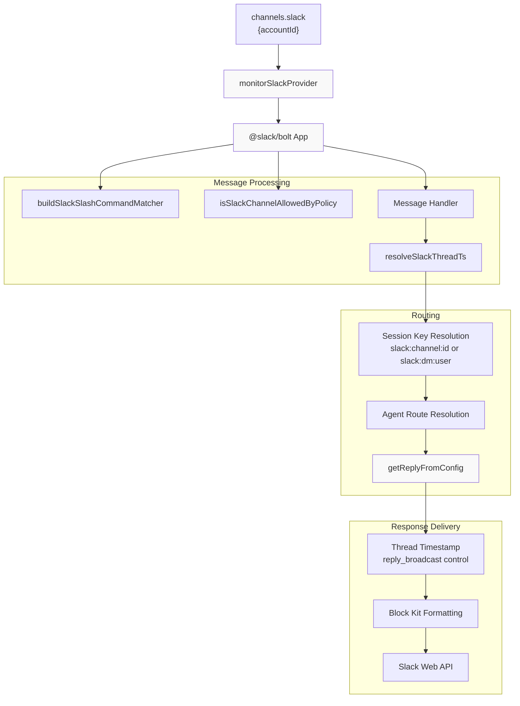
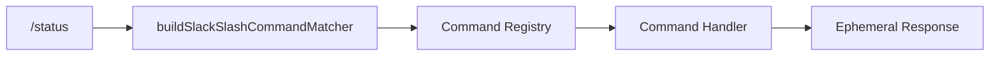
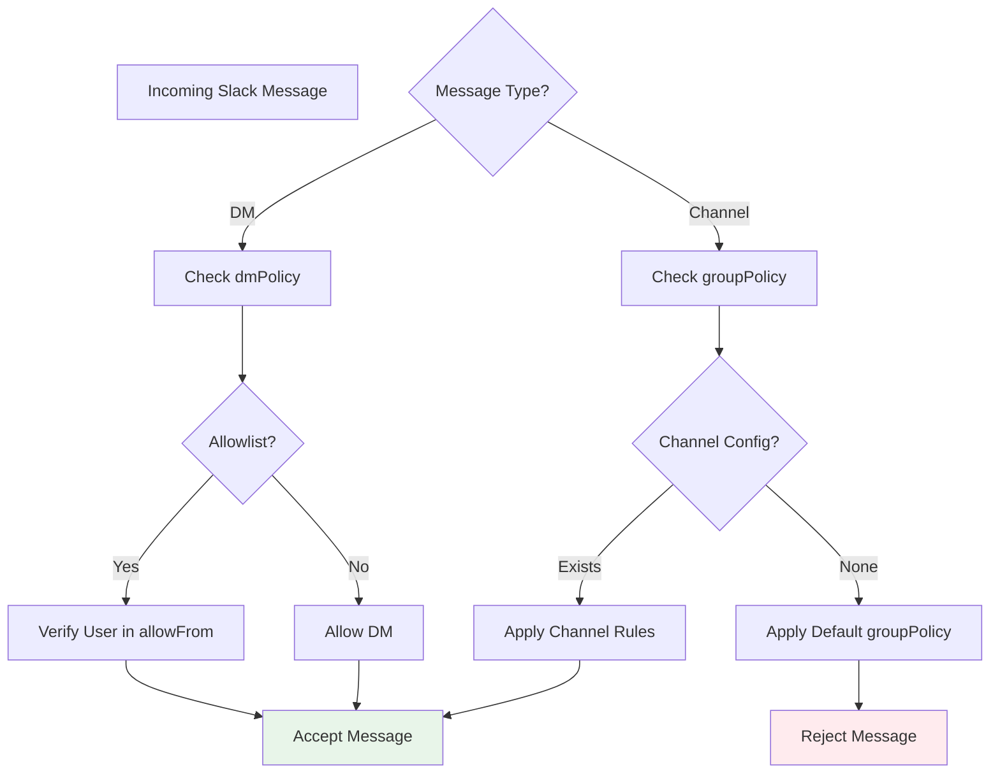
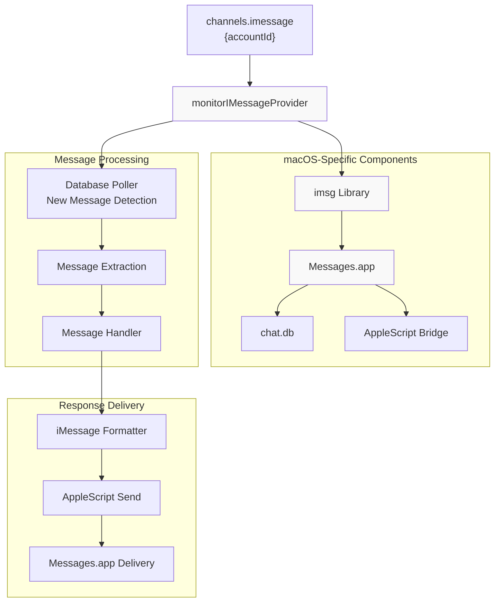
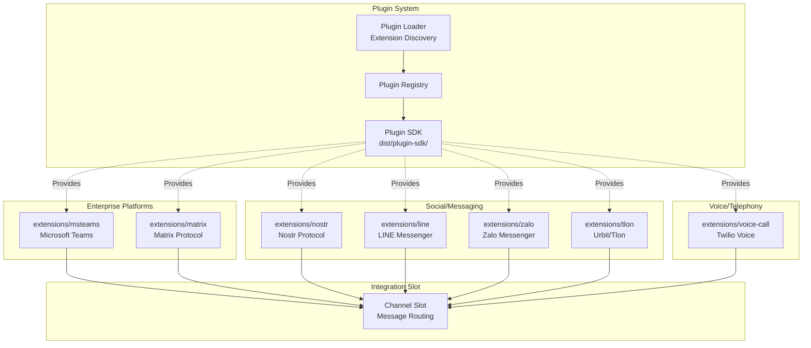
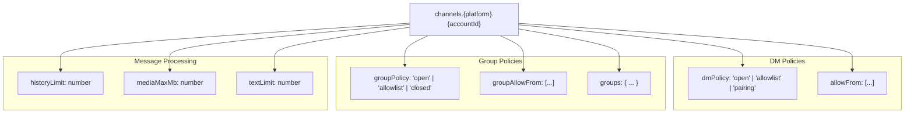

# Page: Other Channels

# Other Channels

<details>
<summary>Relevant source files</summary>

The following files were used as context for generating this wiki page:

- [README.md](README.md)
- [assets/avatar-placeholder.svg](assets/avatar-placeholder.svg)
- [docs/channels/zalo.md](docs/channels/zalo.md)
- [docs/channels/zalouser.md](docs/channels/zalouser.md)
- [scripts/clawtributors-map.json](scripts/clawtributors-map.json)
- [scripts/update-clawtributors.ts](scripts/update-clawtributors.ts)
- [scripts/update-clawtributors.types.ts](scripts/update-clawtributors.types.ts)
- [src/config/config.ts](src/config/config.ts)
- [src/discord/monitor.ts](src/discord/monitor.ts)
- [src/imessage/monitor.ts](src/imessage/monitor.ts)
- [src/index.test.ts](src/index.test.ts)
- [src/index.ts](src/index.ts)
- [src/signal/monitor.ts](src/signal/monitor.ts)
- [src/slack/monitor.ts](src/slack/monitor.ts)
- [src/telegram/bot.test.ts](src/telegram/bot.test.ts)
- [src/telegram/bot.ts](src/telegram/bot.ts)
- [src/web/auto-reply.ts](src/web/auto-reply.ts)
- [src/web/inbound.media.test.ts](src/web/inbound.media.test.ts)
- [src/web/inbound.test.ts](src/web/inbound.test.ts)
- [src/web/inbound.ts](src/web/inbound.ts)
- [src/web/test-helpers.ts](src/web/test-helpers.ts)
- [src/web/vcard.ts](src/web/vcard.ts)
- [tsconfig.json](tsconfig.json)
- [ui/src/styles.css](ui/src/styles.css)
- [ui/src/styles/layout.mobile.css](ui/src/styles/layout.mobile.css)

</details>


This page documents OpenClaw's integrations for Slack, iMessage, and extension-based messaging platforms. For WhatsApp, Telegram, Discord, and Signal integrations, see their dedicated pages ([8.2](#8.2), [8.3](#8.3), [8.4](#8.4), [8.5](#8.5)). For general channel routing and access control concepts, see [8.1](#8.1). For the plugin architecture that enables extension-based channels, see [10.1](#10.1).

---

## Slack Integration

OpenClaw provides native Slack integration through the Bolt framework, supporting slash commands, threaded conversations, and workspace-based routing.

### Slack Channel Architecture



**Sources**: [src/slack/monitor.ts:1-6]()

### Slack Configuration

Slack channels are configured under `channels.slack` with account-specific settings:

```json
{
  "channels": {
    "slack": {
      "main": {
        "botToken": "xoxb-...",
        "appToken": "xapp-...",
        "signingSecret": "...",
        "dmPolicy": "pairing",
        "allowFrom": ["U12345", "U67890"],
        "groupPolicy": "allowlist",
        "channels": {
          "C12345": { "requireMention": false },
          "C67890": { "requireMention": true }
        }
      }
    }
  }
}
```

| Configuration Field | Type | Description |
|-------------------|------|-------------|
| `botToken` | string | Slack bot token (xoxb-...) |
| `appToken` | string | Slack app-level token for Socket Mode (xapp-...) |
| `signingSecret` | string | Request signing secret for webhook verification |
| `dmPolicy` | string | DM access control: "open", "allowlist", or "pairing" |
| `allowFrom` | array | User IDs permitted for DMs (when using allowlist/pairing) |
| `groupPolicy` | string | Group/channel access control policy |
| `channels` | object | Per-channel configuration overrides |
| `channels.*.requireMention` | boolean | Whether bot mention is required in channel |

**Sources**: [src/slack/monitor.ts:1-6](), [src/config/config.ts:1-15]()

### Slack Slash Commands

Slack supports native slash commands that map to OpenClaw's command system. Commands are registered using `buildSlackSlashCommandMatcher`:



Commands can be:
- **Global commands**: Available in all conversations (e.g., `/status`, `/help`)
- **Channel-scoped**: Restricted to specific channels based on access groups
- **Ephemeral**: Responses visible only to the invoking user

**Sources**: [src/slack/monitor.ts:1]()

### Slack Threading Behavior

Slack conversations use thread timestamps (`ts`) for message threading. The `resolveSlackThreadTs` function determines whether replies should:

1. **Start new threads**: Reply to original message with `thread_ts`
2. **Continue threads**: Reply within existing thread using same `thread_ts`
3. **Broadcast to channel**: Use `reply_broadcast: true` to show in main channel

Threading behavior respects `replyToMode` configuration (see [8.3](#8.3) for similar Telegram behavior).

**Sources**: [src/slack/monitor.ts:4]()

### Slack Access Control

The `isSlackChannelAllowedByPolicy` function enforces channel-level access control:



**Sources**: [src/slack/monitor.ts:2]()

---

## iMessage Integration

OpenClaw provides iMessage integration exclusively on macOS through the `imsg` library, which interfaces with the native Messages.app database and AppleScript.

### iMessage Architecture



**Sources**: [src/imessage/monitor.ts:1-2]()

### iMessage Configuration

iMessage requires macOS and the Messages.app to be configured and logged in:

```json
{
  "channels": {
    "imessage": {
      "main": {
        "dmPolicy": "pairing",
        "allowFrom": ["+15555551234", "user@icloud.com"],
        "groupPolicy": "allowlist",
        "groups": {
          "chat123456": { "requireMention": false }
        },
        "pollIntervalMs": 1000,
        "historyLimit": 50
      }
    }
  }
}
```

| Configuration Field | Type | Description |
|-------------------|------|-------------|
| `dmPolicy` | string | DM access control policy |
| `allowFrom` | array | Phone numbers or email addresses for allowlist |
| `groupPolicy` | string | Group chat access control policy |
| `groups` | object | Per-group configuration (keyed by chat identifier) |
| `pollIntervalMs` | number | Database polling interval (default: 1000ms) |
| `historyLimit` | number | Maximum messages to load from group chat history |

### iMessage Implementation Details

The `monitorIMessageProvider` function implements the following workflow:

1. **Database Monitoring**: Polls `~/Library/Messages/chat.db` for new messages
2. **Identity Resolution**: Maps phone numbers and email addresses to contacts
3. **Group Chat Detection**: Identifies group chats via `chat` table records
4. **Message Extraction**: Reads message content, attachments, and metadata
5. **Session Routing**: Routes to appropriate agent session based on sender/chat
6. **Response Delivery**: Sends replies via AppleScript to Messages.app

**Limitations**:
- macOS-only (requires Messages.app)
- No media upload support (text-only responses)
- Polling-based (not real-time push)
- Requires Full Disk Access permission for `chat.db`

**Sources**: [src/imessage/monitor.ts:1-2]()

---

## Extension-Based Channels

OpenClaw supports 20+ additional messaging platforms through its plugin architecture. These channels are implemented as extensions in the `extensions/` directory and auto-load when configured.

### Available Extension Channels



**Sources**: High-level architecture diagram (Diagram 5 in context)

### Extension Channel Listing

| Extension | Platform | NPM Package | Status |
|-----------|----------|-------------|--------|
| `msteams` | Microsoft Teams | `@microsoft/agents-hosting` | Production |
| `matrix` | Matrix Protocol | `@vector-im/matrix-bot-sdk` | Production |
| `nostr` | Nostr Protocol | `nostr-tools` | Beta |
| `line` | LINE Messenger | `@line/bot-sdk` | Production |
| `tlon` | Urbit/Tlon | `@urbit/http-api` | Beta |
| `zalo` | Zalo Messenger | Custom implementation | Beta |
| `voice-call` | Twilio Voice | `twilio` | Production |

Additional extensions (15+) include custom integrations, workflow tools, and experimental protocols.

**Sources**: High-level architecture diagram (Diagram 5 in context)

### Extension Configuration Pattern

All extension-based channels follow a consistent configuration pattern:

```json
{
  "channels": {
    "{extensionName}": {
      "{accountId}": {
        // Extension-specific authentication
        "credentials": { ... },
        
        // Standard channel policies
        "dmPolicy": "pairing",
        "allowFrom": [...],
        "groupPolicy": "allowlist",
        
        // Extension-specific options
        "extensionOptions": { ... }
      }
    }
  }
}
```

The Gateway automatically discovers and loads extensions from `extensions/` by scanning for `package.json` files with the `openclaw.extensions` manifest field (see [10.1](#10.1) for plugin architecture details).

---

## Microsoft Teams

The `extensions/msteams` integration provides Microsoft Teams bot functionality through the `@microsoft/agents-hosting` package.

### Teams Configuration

```json
{
  "channels": {
    "msteams": {
      "main": {
        "appId": "...",
        "appPassword": "...",
        "dmPolicy": "allowlist",
        "allowFrom": ["user@contoso.com"],
        "groupPolicy": "allowlist",
        "teams": {
          "team-id-123": {
            "channels": {
              "channel-id-456": { "requireMention": true }
            }
          }
        }
      }
    }
  }
}
```

Teams-specific features:
- **Adaptive Cards**: Support for rich card-based responses
- **Team/Channel hierarchy**: Multi-level routing through teams and channels
- **Activity feed**: Integration with Teams activity notifications
- **Meeting integration**: Bot can join and respond in meetings

**Sources**: High-level architecture diagram (Diagram 5 in context)

---

## Matrix Protocol

The `extensions/matrix` integration provides Matrix protocol support via `@vector-im/matrix-bot-sdk`.

### Matrix Configuration

```json
{
  "channels": {
    "matrix": {
      "main": {
        "homeserverUrl": "https://matrix.org",
        "accessToken": "...",
        "dmPolicy": "pairing",
        "allowFrom": ["@user:matrix.org"],
        "groupPolicy": "allowlist",
        "rooms": {
          "!roomId:matrix.org": { "requireMention": false }
        }
      }
    }
  }
}
```

Matrix-specific features:
- **End-to-end encryption**: Optional E2EE support for secure messaging
- **Federation**: Cross-server messaging via Matrix federation
- **Rich media**: Support for files, images, and formatted messages
- **Room threading**: Thread-aware message routing

**Sources**: High-level architecture diagram (Diagram 5 in context)

---

## LINE Messenger

The `extensions/line` integration supports LINE messaging platform via `@line/bot-sdk`.

### LINE Configuration

```json
{
  "channels": {
    "line": {
      "main": {
        "channelAccessToken": "...",
        "channelSecret": "...",
        "dmPolicy": "open",
        "groupPolicy": "allowlist",
        "groups": {
          "C1234567890abcdef": { "requireMention": true }
        }
      }
    }
  }
}
```

LINE-specific features:
- **Rich messages**: Support for LINE's rich message templates
- **Quick replies**: Button-based quick reply options
- **Flex messages**: Custom card-based layouts
- **LINE Pay integration**: Optional payment handling

**Sources**: High-level architecture diagram (Diagram 5 in context)

---

## Nostr Protocol

The `extensions/nostr` integration provides Nostr protocol support via `nostr-tools`.

### Nostr Configuration

```json
{
  "channels": {
    "nostr": {
      "main": {
        "privateKey": "nsec1...",
        "relays": [
          "wss://relay.damus.io",
          "wss://relay.nostr.band"
        ],
        "dmPolicy": "pairing",
        "allowFrom": ["npub1..."]
      }
    }
  }
}
```

Nostr-specific features:
- **Decentralized**: No central server, messages broadcast to relays
- **Cryptographic identity**: npub/nsec key pairs for authentication
- **Relay selection**: Configurable relay endpoints
- **Note kind filtering**: Support for different Nostr event kinds

**Sources**: High-level architecture diagram (Diagram 5 in context)

---

## Tlon/Urbit

The `extensions/tlon` integration provides Urbit messaging via `@urbit/http-api`.

### Tlon Configuration

```json
{
  "channels": {
    "tlon": {
      "main": {
        "url": "http://localhost:8080",
        "code": "lidlut-tabwed-pillex-ridrup",
        "ship": "~sampel-palnet",
        "dmPolicy": "allowlist",
        "allowFrom": ["~zod", "~bus"]
      }
    }
  }
}
```

Tlon-specific features:
- **Ship-based identity**: Urbit ships as user identities
- **Graph store**: Urbit's graph-based message storage
- **Groups integration**: Native Urbit groups support
- **Local-first**: Typically runs against local Urbit ship

**Sources**: High-level architecture diagram (Diagram 5 in context)

---

## Zalo Messenger

The `extensions/zalo` integration provides Zalo messaging platform support.

### Zalo Configuration

```json
{
  "channels": {
    "zalo": {
      "main": {
        "appId": "...",
        "secretKey": "...",
        "oaId": "...",
        "dmPolicy": "open",
        "groupPolicy": "allowlist"
      }
    }
  }
}
```

Zalo-specific features:
- **Official Accounts**: Integration with Zalo OA (Official Account)
- **Mini apps**: Support for Zalo Mini App ecosystem
- **ZNS notifications**: Zalo Notification Service integration
- **Regional focus**: Popular in Vietnam and Southeast Asia

**Sources**: High-level architecture diagram (Diagram 5 in context)

---

## Voice Call Integration

The `extensions/voice-call` integration provides telephony support via Twilio.

### Voice Call Configuration

```json
{
  "channels": {
    "voice-call": {
      "main": {
        "accountSid": "AC...",
        "authToken": "...",
        "phoneNumber": "+15555551234",
        "dmPolicy": "allowlist",
        "allowFrom": ["+15555555678"],
        "voiceModel": "eleven-labs",
        "transcriptionProvider": "deepgram"
      }
    }
  }
}
```

Voice-specific features:
- **Inbound calls**: Answer incoming calls with agent responses
- **Outbound calls**: Initiate calls programmatically
- **Speech-to-text**: Transcribe caller audio using Deepgram or Whisper
- **Text-to-speech**: Synthesize agent responses using ElevenLabs or other TTS
- **Call routing**: Forward calls based on caller or time of day

**Sources**: High-level architecture diagram (Diagram 5 in context)

---

## Configuration Patterns Across Channels

All channels (native and extension-based) share common configuration patterns:

### Common Access Control Fields



### Shared Configuration Schema

| Field | Type | Default | Description |
|-------|------|---------|-------------|
| `dmPolicy` | enum | `"pairing"` | DM access control: open, allowlist, pairing |
| `allowFrom` | array | `[]` | List of permitted DM senders |
| `groupPolicy` | enum | `"allowlist"` | Group access control: open, allowlist, closed |
| `groupAllowFrom` | array | `[]` | List of permitted group members |
| `groups` | object | `{}` | Per-group configuration overrides |
| `historyLimit` | number | `50` | Max group messages to load for context |
| `mediaMaxMb` | number | `5` | Maximum media file size in MB |
| `textLimit` | number | `4000` | Maximum text chunk size for responses |
| `blockStreaming` | boolean | `false` | Disable streaming, send complete responses |
| `replyToMode` | enum | `"first"` | Threading behavior: first, all, none |

**Sources**: [src/config/config.ts:1-15](), [src/telegram/bot.ts:50-65](), [src/signal/monitor.ts:38-57]()

---

## Adding Custom Channel Extensions

To create a new channel extension, implement the Channel slot interface and register via plugin manifest. See [10.3](#10.3) for detailed plugin development guide.

### Minimal Channel Extension Structure

```
extensions/my-channel/
├── package.json          # Plugin manifest with openclaw.extensions
├── src/
│   ├── monitor.ts       # Channel monitoring loop
│   ├── send.ts          # Message sending
│   └── types.ts         # Type definitions
└── README.md
```

The `package.json` must declare the extension:

```json
{
  "name": "@openclaw/channel-my-platform",
  "openclaw": {
    "extensions": [
      {
        "type": "channel",
        "id": "my-platform",
        "config": {
          "schema": { /* TypeBox schema */ }
        }
      }
    ]
  }
}
```

Channel extensions must implement:
- **Monitor function**: Long-lived loop for receiving messages
- **Send function**: Deliver outbound replies to platform
- **Access control**: Integration with OpenClaw's policy system
- **Session routing**: Map platform conversations to session keys

**Sources**: High-level architecture diagram (Diagram 5 in context), [10.1](#10.1) Plugin System Overview

---