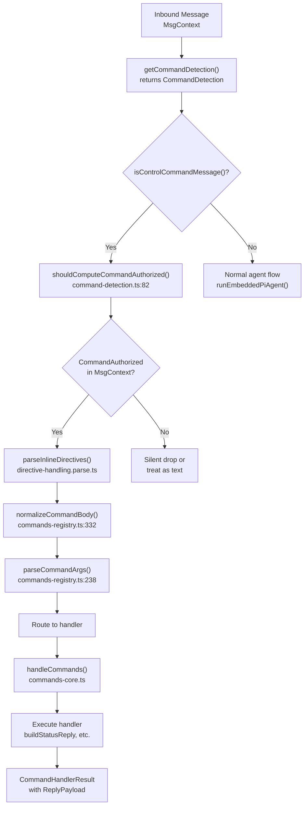
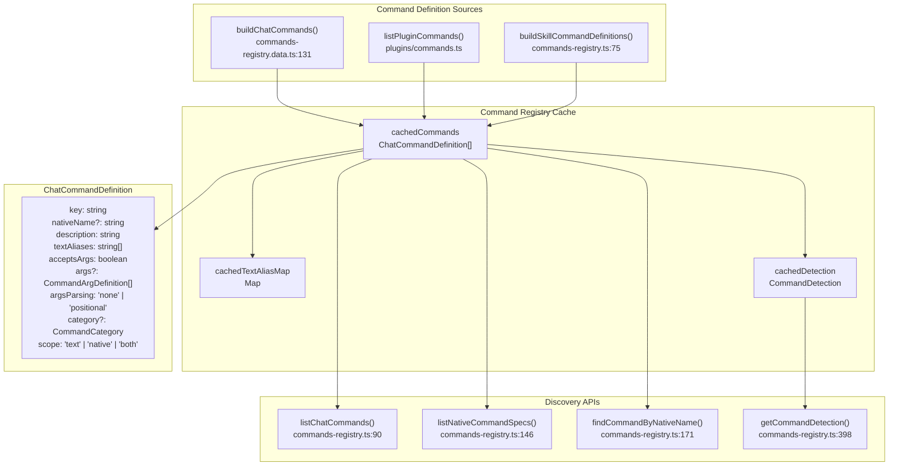
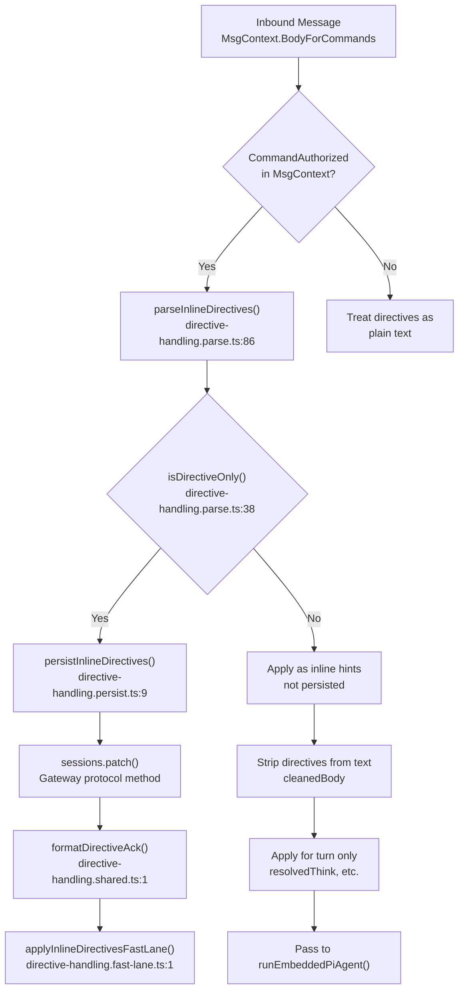
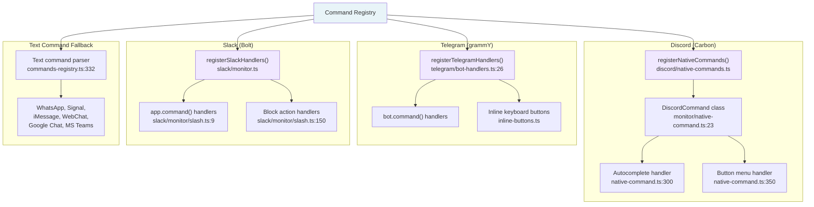
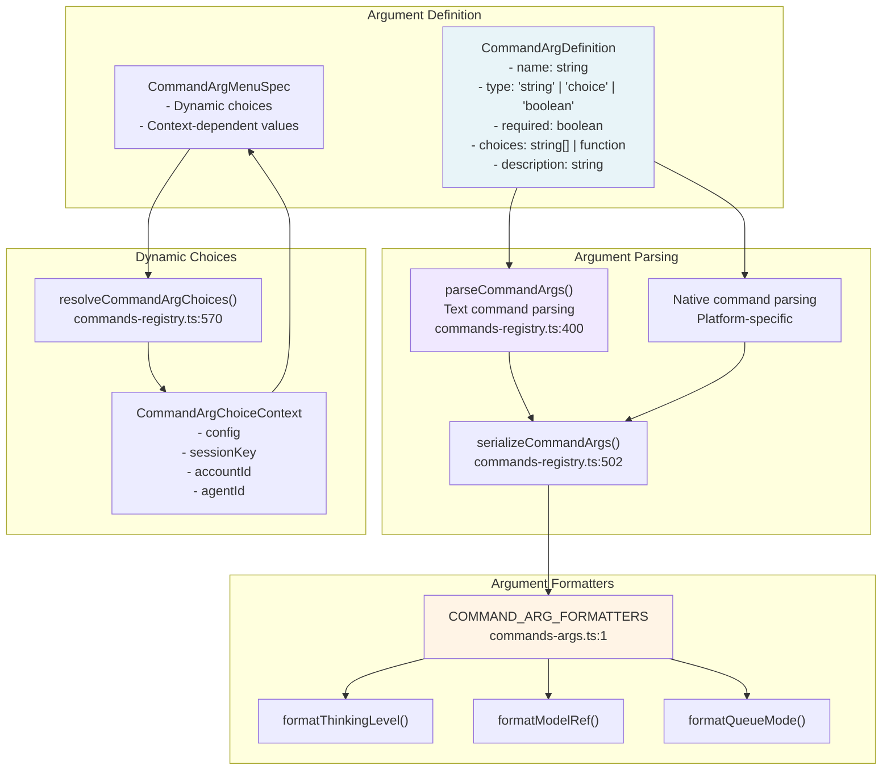
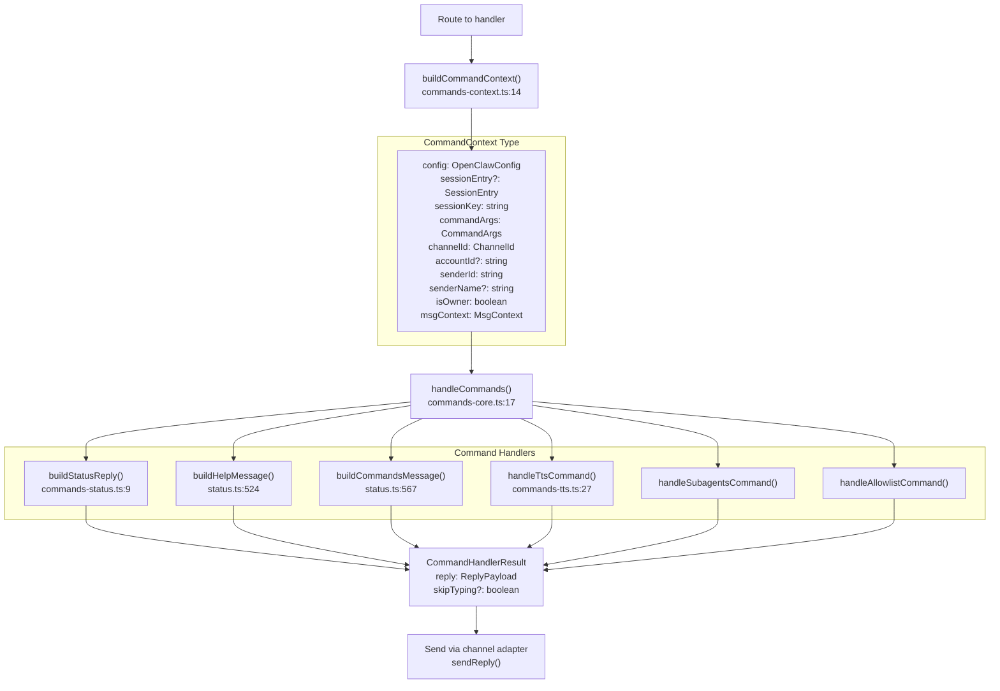
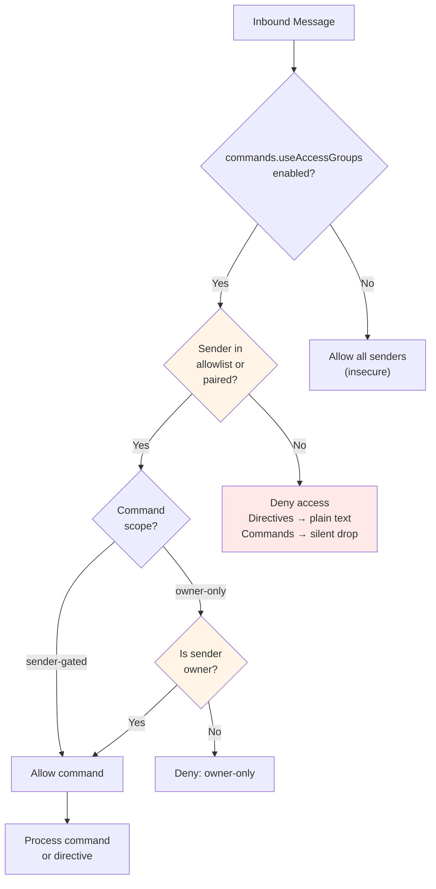

# Page: Commands and Directives

# Commands and Directives

<details>
<summary>Relevant source files</summary>

The following files were used as context for generating this wiki page:

- [docs/tools/slash-commands.md](docs/tools/slash-commands.md)
- [src/auto-reply/command-detection.ts](src/auto-reply/command-detection.ts)
- [src/auto-reply/commands-args.ts](src/auto-reply/commands-args.ts)
- [src/auto-reply/commands-registry.data.ts](src/auto-reply/commands-registry.data.ts)
- [src/auto-reply/commands-registry.test.ts](src/auto-reply/commands-registry.test.ts)
- [src/auto-reply/commands-registry.ts](src/auto-reply/commands-registry.ts)
- [src/auto-reply/commands-registry.types.ts](src/auto-reply/commands-registry.types.ts)
- [src/auto-reply/group-activation.ts](src/auto-reply/group-activation.ts)
- [src/auto-reply/reply.ts](src/auto-reply/reply.ts)
- [src/auto-reply/reply/commands-core.ts](src/auto-reply/reply/commands-core.ts)
- [src/auto-reply/reply/commands-status.ts](src/auto-reply/reply/commands-status.ts)
- [src/auto-reply/reply/commands-subagents.ts](src/auto-reply/reply/commands-subagents.ts)
- [src/auto-reply/reply/commands.test.ts](src/auto-reply/reply/commands.test.ts)
- [src/auto-reply/reply/commands.ts](src/auto-reply/reply/commands.ts)
- [src/auto-reply/reply/directive-handling.ts](src/auto-reply/reply/directive-handling.ts)
- [src/auto-reply/reply/subagents-utils.test.ts](src/auto-reply/reply/subagents-utils.test.ts)
- [src/auto-reply/reply/subagents-utils.ts](src/auto-reply/reply/subagents-utils.ts)
- [src/auto-reply/send-policy.ts](src/auto-reply/send-policy.ts)
- [src/auto-reply/status.test.ts](src/auto-reply/status.test.ts)
- [src/auto-reply/status.ts](src/auto-reply/status.ts)
- [src/auto-reply/templating.ts](src/auto-reply/templating.ts)

</details>


This page documents the command and directive system in OpenClaw. Commands are user-facing interactions (like `/status`, `/help`, `/model`) that trigger specific actions. Directives are special modifiers (like `/think`, `/verbose`, `/reasoning`) that control agent behavior and can be either inline hints or persistent session settings.

For detailed command reference and usage examples, see [Command Reference](#9.1). For platform-specific command implementations, see [Platform-Specific Commands](#9.2). For directive behavior details, see [Directives](#9.3).

## Command vs Directive Concepts

OpenClaw distinguishes between **commands** and **directives**:

### Commands
Standalone `/...` messages that trigger specific actions:
- `/status` - Show session and model status
- `/help` - Display help information
- `/reset` - Reset the current session
- `/compact` - Compact session history
- `/model` - Change model selection

Commands must generally be sent as standalone messages (the message starts with `/`). Some commands like `/help`, `/status`, `/commands`, and `/whoami` can also work as **inline shortcuts** when embedded in regular messages.

### Directives
Modifiers that control agent behavior, stripped from messages before the model sees them:
- `/think <level>` - Set thinking level
- `/verbose on|off` - Control verbosity
- `/reasoning on|off` - Control reasoning output
- `/elevated on|off` - Control elevated access
- `/exec host=... security=...` - Configure exec tool behavior
- `/model <name>` - Change model
- `/queue <mode>` - Configure queue behavior

Directives behave differently based on message content:
- **Inline hints** (when mixed with regular text): Applied for that turn only, not persisted
- **Directive-only messages** (message contains only directives): Persisted to session, acknowledged with confirmation

Sources: [docs/tools/slash-commands.md:1-20](), [src/auto-reply/reply/directives.ts:1-12]()

## Command Processing Architecture



**Command Detection Flow**

The command detection flow determines whether an inbound message is a command and routes it accordingly:

1. **Detection**: `getCommandDetection()` returns a `CommandDetection` object with exact command matches and a regex pattern. `isControlCommandMessage()` checks if the message starts with `/` and matches a registered command alias
2. **Access Control**: `shouldComputeCommandAuthorized()` determines if authorization needs to be checked based on `commands.useAccessGroups` config and command presence
3. **Directive Extraction**: `parseInlineDirectives()` identifies and strips directives from the message text, returning an `InlineDirectives` object
4. **Normalization**: `normalizeCommandBody()` removes Telegram-style `@botname` suffixes and normalizes command aliases (e.g., `/dock_telegram` → `/dock-telegram`)
5. **Argument Parsing**: `parseCommandArgs()` extracts command arguments based on the command's `args` definition array, returning `CommandArgs` with `raw` and `values` fields
6. **Routing**: Matched command is routed to `handleCommands()` which dispatches to specific handlers based on command key

Sources: [src/auto-reply/commands-registry.ts:332-397](), [src/auto-reply/commands-registry.ts:238-273](), [src/auto-reply/command-detection.ts:49-88](), [src/auto-reply/reply/commands-core.ts:1-100]()

## Command Registry System



**Command Registry Components**

The command registry aggregates commands from multiple sources and provides lookup interfaces:

- **`buildChatCommands()`**: Defines built-in commands using `defineChatCommand()` helper. Creates command specs for help, status, model, reset, compact, activation, tts, and dock commands. Returns array of `ChatCommandDefinition` objects
- **`listPluginCommands()`**: Queries active plugin registry via `getActivePluginRegistry()` for plugin-contributed commands
- **`buildSkillCommandDefinitions()`**: Converts `SkillCommandSpec[]` to `ChatCommandDefinition[]` for user-invocable skills
- **Text Alias Map**: Built by `getTextAliasMap()`, caches command text aliases (e.g., `/status`, `/whoami`, `/id`) mapped to `TextAliasSpec` with canonical form and `acceptsArgs` flag
- **Native Command Specs**: `listNativeCommandSpecs()` filters commands with `scope !== "text"` and `nativeName` defined, returning `NativeCommandSpec[]` for platform registration
- **Command Detection**: `getCommandDetection()` builds cached regex pattern and exact-match set for fast command detection
- **`ChatCommandDefinition`**: Core command metadata type defined in [src/auto-reply/commands-registry.types.ts:52-64]()

Command keys are internal identifiers (e.g., `dock:telegram`) while text aliases are user-facing (e.g., `/dock-telegram`). The `NATIVE_NAME_OVERRIDES` map at [src/auto-reply/commands-registry.ts:124-128]() provides platform-specific name mappings (e.g., Discord uses `/voice` instead of `/tts`).

Sources: [src/auto-reply/commands-registry.ts:39-169](), [src/auto-reply/commands-registry.data.ts:131-379](), [src/auto-reply/commands-registry.types.ts:52-64]()

## Directive Processing Flow



**Directive Processing Behavior**

Directive processing varies based on message content and sender authorization:

1. **Authorization Check**: Directives are only processed when `CommandAuthorized: true` in `MsgContext` (set by allowlist/pairing checks). Unauthorized senders see directives as plain text
2. **Extraction**: `parseInlineDirectives()` scans `BodyForCommands` and extracts directive tokens, returning `InlineDirectives` object with:
   - `thinkOverride?: ThinkLevel` - from `extractThinkDirective()` [src/auto-reply/reply/directives.ts:52-85]()
   - `verboseOverride?: VerboseLevel` - from `extractVerboseDirective()` [src/auto-reply/reply/directives.ts:87-108]()
   - `reasoningOverride?: ReasoningLevel` - from `extractReasoningDirective()` [src/auto-reply/reply/directives.ts:110-131]()
   - `elevatedOverride?: ElevatedLevel` - from `extractElevatedDirective()` [src/auto-reply/reply/directives.ts:133-154]()
   - `execOverride?: ExecDirective` - from `extractExecDirective()` [src/auto-reply/reply/exec.ts:8]()
   - `queueOverride?: QueueDirective` - from `extractQueueDirective()` [src/auto-reply/reply/queue.ts:9]()
3. **Directive-Only Detection**: `isDirectiveOnly()` checks if the message contains only directives (no other text). Returns `true` if `cleanedBody.trim().length === 0`
4. **Persistence Path**: `persistInlineDirectives()` calls `sessions.patch()` to update session store with new thinking level, verbose level, model override, etc. Returns formatted acknowledgement string
5. **Fast Lane**: `applyInlineDirectivesFastLane()` processes directive-only messages synchronously, bypassing queue and agent execution, sending immediate reply via channel adapter

Supported directive extractors:
- `extractThinkDirective()` - Extracts `/think <level>` (off, minimal, low, medium, high, xhigh, ultra)
- `extractVerboseDirective()` - Extracts `/verbose on|off|full` or `/v on|off|full`
- `extractReasoningDirective()` - Extracts `/reasoning on|off|stream` or `/reason on|off|stream`
- `extractElevatedDirective()` - Extracts `/elevated on|off|ask|full` or `/elev on|off|ask|full`
- `extractExecDirective()` - Extracts `/exec host=... security=... ask=... node=...`
- `extractQueueDirective()` - Extracts `/queue <mode> [debounce:Xms] [cap:N] [drop:policy]`

Sources: [src/auto-reply/reply/directive-handling.ts:1-6](), [src/auto-reply/reply/directive-handling.parse.ts:38-148](), [src/auto-reply/reply/directive-handling.persist.ts:9-178](), [src/auto-reply/reply/directives.ts:1-6]()

## Platform-Specific Command Implementations



**Native Command Registration**

Native commands are platform-specific slash commands that provide enhanced UX:

### Discord Commands
- Uses `@buape/carbon` library for command registration
- `DiscordCommand` class extends `Command` base class
- Autocomplete for dynamic option values (models, thinking levels, etc.)
- Button menus when required arguments are omitted
- Registration happens in `registerNativeCommands()` when `commands.native` is enabled

### Telegram Commands
- Uses `grammY` bot framework
- Commands registered via `bot.command()` handlers
- Inline keyboard buttons for option selection
- Forum thread support (topic IDs preserved in commands)
- Registration in `registerTelegramHandlers()`

### Slack Commands
- Uses `@slack/bolt` framework
- Commands registered via `app.command()` handlers
- Block action handlers for button interactions
- Requires manual slash command creation in Slack app settings
- Command list at `/slack-commands` endpoint for easy setup

### Text Command Fallback
All platforms support text commands as fallback. Channels without native command support (WhatsApp, Signal, iMessage, WebChat, Google Chat, MS Teams) rely exclusively on text command parsing.

Configuration:
- `commands.native: "auto"` - Auto-enable for Discord/Telegram, off for Slack
- `commands.text: true` - Enable text command parsing (default)
- Per-channel overrides: `channels.discord.commands.native`, etc.

Sources: [src/discord/monitor/native-command.ts:1-10](), [src/telegram/bot-handlers.ts:26-35](), [src/slack/monitor/slash.ts:1-15]()

## Command Argument System



**Argument Processing**

Command arguments are defined, parsed, and validated through a structured system:

1. **Argument Definition**: Each command declares its arguments via `CommandArgDefinition`:
   - `name`: Argument identifier
   - `type`: string, choice (enum), or boolean
   - `required`: Whether the argument is mandatory
   - `choices`: Static array or dynamic function returning available values
   - `description`: Help text for the argument

2. **Text Parsing**: `parseCommandArgs()` extracts arguments from text commands:
   - Simple space-separated values: `/model gpt-5`
   - Key-value pairs: `/exec host=gateway security=full`
   - Quoted values: `/message send --message "Hello world"`

3. **Native Parsing**: Platform-specific parsing from native command interactions:
   - Discord: Autocomplete options and select menus
   - Telegram: Inline keyboard buttons
   - Slack: Block kit select menus

4. **Serialization**: `serializeCommandArgs()` converts parsed arguments back to canonical text format for storage/display

5. **Dynamic Choices**: `resolveCommandArgChoices()` provides context-aware option lists:
   - Available models based on configured providers
   - Thinking levels filtered by model/provider support
   - Queue modes and their parameters

6. **Formatters**: `COMMAND_ARG_FORMATTERS` provide domain-specific argument formatting for display

Sources: [src/auto-reply/commands-registry.ts:400-502](), [src/auto-reply/commands-registry.types.ts:1-20](), [src/auto-reply/commands-args.ts:1-15]()

## Command Execution Flow



**Command Handler Execution**

Command handlers execute in a structured context with access to configuration and session state:

1. **Context Building**: `buildCommandContext()` at [src/auto-reply/reply/commands-context.ts:14-70]() assembles `CommandContext`:
   - `config`: Current `OpenClawConfig` from config loader
   - `sessionEntry`: Optional `SessionEntry` with history metadata, token counts, compaction count
   - `sessionKey`: Session identifier string (e.g., `agent:main:whatsapp:1234567890`)
   - `commandArgs`: Parsed `CommandArgs` with `raw` string and `values` map
   - `channelId`: Normalized channel identifier from `normalizeChannelId()`
   - `accountId`: Optional account ID for multi-account channels
   - `senderId`: Sender's unique identifier
   - `isOwner`: Boolean indicating if sender is first allowlist entry
   - `msgContext`: Original `MsgContext` with full message envelope

2. **Handler Dispatch**: `handleCommands()` at [src/auto-reply/reply/commands-core.ts:17-359]() routes to handlers based on command key:
   - **Status**: `buildStatusReply()` generates status with `buildStatusMessage()` [src/auto-reply/status.ts:327-486]()
   - **Help**: `buildHelpMessage()` formats grouped command list [src/auto-reply/status.ts:524-565]()
   - **Commands**: `buildCommandsMessage()` with pagination support via `buildCommandsMessagePaginated()` for Telegram [src/auto-reply/status.ts:567-647]()
   - **TTS**: `handleTtsCommand()` parses TTS actions (status, off, always, provider, limit, etc.) [src/auto-reply/reply/commands-tts.ts:27-225]()
   - **Subagents**: Manages sub-agent execution (list, stop, log, info, send)
   - **Allowlist**: Lists/adds/removes allowlist entries (requires `commands.config: true`)

3. **Response Structure**: Handlers return `CommandHandlerResult` at [src/auto-reply/reply/commands-types.ts:39-42]():
   - `reply: ReplyPayload` - Structured reply with text, attachments, routing info
   - `skipTyping?: boolean` - Flag to suppress typing indicators

4. **Delivery**: Response is sent via channel adapter's `sendReply()` function with proper routing to originating channel

Sources: [src/auto-reply/reply/commands.ts:1-8](), [src/auto-reply/reply/commands-context.ts:14-70](), [src/auto-reply/reply/commands-core.ts:17-359](), [src/auto-reply/reply/commands-status.ts:1-130](), [src/auto-reply/status.ts:327-647]()

## Configuration

Commands and directives are configured via the `commands` section in `openclaw.json`:

| Config Key | Type | Default | Description |
|------------|------|---------|-------------|
| `commands.native` | `boolean \| "auto"` | `"auto"` | Enable native slash commands. Auto: on for Discord/Telegram, off for Slack |
| `commands.nativeSkills` | `boolean \| "auto"` | `"auto"` | Register skill commands as native slash commands. Auto: on for Discord/Telegram, off for Slack |
| `commands.text` | `boolean` | `true` | Enable text command parsing (`/...` in messages) |
| `commands.bash` | `boolean` | `false` | Enable `! <cmd>` and `/bash <cmd>` for host shell commands (requires `tools.elevated` allowlists) |
| `commands.bashForegroundMs` | `number` | `2000` | Milliseconds to wait before backgrounding bash commands (`0` backgrounds immediately) |
| `commands.config` | `boolean` | `false` | Enable `/config` command for disk writes to `openclaw.json` |
| `commands.debug` | `boolean` | `false` | Enable `/debug` command for runtime-only config overrides (memory, not disk) |
| `commands.restart` | `boolean` | `false` | Enable `/restart` command for gateway restarts |
| `commands.useAccessGroups` | `boolean` | `true` | Enforce allowlist/pairing checks for commands and directives |

Configuration validation uses `OpenClawSchema` defined with Zod at [src/config/config.ts:1-50](). Command config is read by `isCommandEnabled()` at [src/auto-reply/commands-registry.ts:100-111]() and `shouldHandleTextCommands()` at [src/auto-reply/commands-registry.ts:556-585]().

### Per-Channel Overrides

Channel-specific command settings override global defaults. Defined in channel config schemas:

```json5
{
  channels: {
    discord: {
      commands: {
        native: true,          // Override global commands.native
        nativeSkills: false    // Disable skill commands on Discord
      }
    },
    telegram: {
      commands: {
        native: true,          // Enable native commands
        nativeSkills: true     // Enable skill commands
      }
    },
    slack: {
      commands: {
        native: false          // Slack requires manual slash command setup in app
      }
    }
  }
}
```

Channel overrides are resolved by `getNativeCommandSurfaces()` at [src/auto-reply/commands-registry.data.ts:496-541](). Text command handling respects channel-specific `native` settings via `shouldHandleTextCommands()`.

### Access Control

When `commands.useAccessGroups: true` (default), commands and directives are only processed for authorized senders:
- **Allowlisted users**: Listed in `channels.*.allowFrom`, `channels.*.dm.allowFrom`, or `channels.*.groups.*.allowFrom`
- **Paired users**: Approved via `openclaw pairing approve <channel> <code>` command
- **Owner**: First entry in allowlist (additional privileges for owner-only commands)

Authorization is checked by `shouldComputeCommandAuthorized()` at [src/auto-reply/command-detection.ts:82-88](). The result is stored in `MsgContext.CommandAuthorized` field.

Unauthorized behavior:
- Command-only messages: Silently ignored (no error sent)
- Inline commands in mixed messages: Treated as plain text, passed to model
- Directives: Not extracted by `parseInlineDirectives()`, treated as regular message content

Sources: [docs/tools/slash-commands.md:26-59](), [src/auto-reply/commands-registry.ts:100-111](), [src/auto-reply/commands-registry.ts:556-585](), [src/auto-reply/command-detection.ts:82-88]()

## Security and Authorization



**Command Authorization Model**

Command and directive authorization follows a multi-layer access control model:

1. **Global Toggle**: `commands.useAccessGroups` enables/disables all authorization checks
   - When `false`: All senders can use commands (insecure, not recommended)
   - When `true` (default): Enforces allowlist/pairing checks

2. **Sender Authorization**:
   - **Allowlisted**: User appears in `channels.*.allowFrom` or `channels.*.dm.allowFrom`
   - **Paired**: User completed pairing flow via `openclaw pairing approve`
   - **Owner**: First entry in allowlist (additional privileges)

3. **Command Scope**:
   - **owner-only**: Requires sender is owner (e.g., `/config`, `/debug`, `/restart`, `/send`)
   - **sender-gated**: Any authorized sender can use

4. **Unauthorized Behavior**:
   - Command-only messages: Silently dropped (no error sent)
   - Inline commands: Treated as plain text, passed to model
   - Directives: Not extracted, treated as regular message content

5. **Group Command Gating**:
   - Command-only messages from allowlisted senders bypass mention requirements
   - Ensures authorized users can always run commands even in mention-gated groups

6. **Special Cases**:
   - Inline shortcuts (`/help`, `/status`, `/commands`, `/whoami`) work in mixed messages
   - Fast-path: Command-only messages bypass queue and model for instant response

Sources: [docs/tools/slash-commands.md:19-20](), [src/auto-reply/commands-registry.ts:140-173](), [src/auto-reply/reply/directive-handling.parse.ts:54-85]()

## Command Categories and Scopes

Commands are organized by category and scope for access control and organization:

| Category | Commands | Description |
|----------|----------|-------------|
| **status** | `/status`, `/health`, `/context`, `/whoami` | System and session status queries |
| **configuration** | `/config`, `/debug`, `/allowlist` | Configuration management (requires elevated access) |
| **agent** | `/model`, `/think`, `/verbose`, `/reasoning`, `/elevated` | Agent behavior controls |
| **session** | `/reset`, `/new`, `/compact`, `/usage`, `/tts` | Session lifecycle management |
| **system** | `/restart`, `/stop`, `/send` | Gateway control (owner-only) |
| **help** | `/help`, `/commands`, `/skill` | Documentation and command discovery |

| Scope | Description | Example Commands |
|-------|-------------|------------------|
| **sender-gated** | Any authorized sender | `/status`, `/help`, `/model` |
| **owner-only** | Only the owner (first allowlist entry) | `/config`, `/debug`, `/restart`, `/send` |

Skill commands (user-invocable skills) are dynamically registered and treated as sender-gated by default. Skills can override this with `command-dispatch: tool` to route directly to a tool without model invocation.

Sources: [src/auto-reply/commands-registry.data.ts:10-50](), [src/auto-reply/commands-registry.types.ts:1-10]()

---