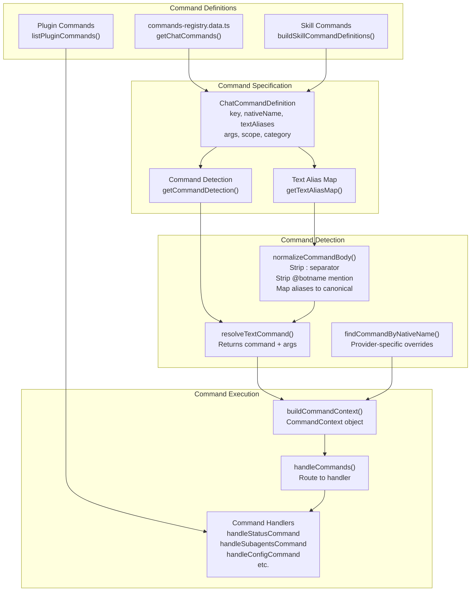
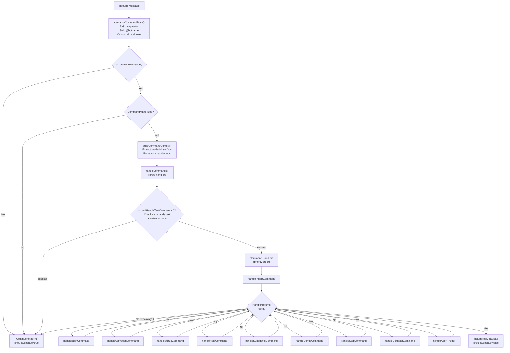
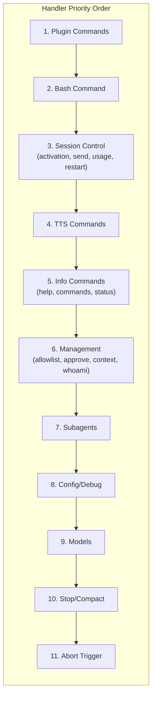
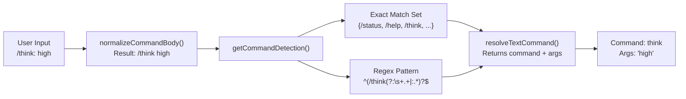

# Page: Command Reference

# Command Reference

<details>
<summary>Relevant source files</summary>

The following files were used as context for generating this wiki page:

- [docs/tools/slash-commands.md](docs/tools/slash-commands.md)
- [src/auto-reply/command-detection.ts](src/auto-reply/command-detection.ts)
- [src/auto-reply/commands-args.ts](src/auto-reply/commands-args.ts)
- [src/auto-reply/commands-registry.data.ts](src/auto-reply/commands-registry.data.ts)
- [src/auto-reply/commands-registry.test.ts](src/auto-reply/commands-registry.test.ts)
- [src/auto-reply/commands-registry.ts](src/auto-reply/commands-registry.ts)
- [src/auto-reply/commands-registry.types.ts](src/auto-reply/commands-registry.types.ts)
- [src/auto-reply/group-activation.ts](src/auto-reply/group-activation.ts)
- [src/auto-reply/reply.ts](src/auto-reply/reply.ts)
- [src/auto-reply/reply/commands-core.ts](src/auto-reply/reply/commands-core.ts)
- [src/auto-reply/reply/commands-status.ts](src/auto-reply/reply/commands-status.ts)
- [src/auto-reply/reply/commands-subagents.ts](src/auto-reply/reply/commands-subagents.ts)
- [src/auto-reply/reply/commands.test.ts](src/auto-reply/reply/commands.test.ts)
- [src/auto-reply/reply/commands.ts](src/auto-reply/reply/commands.ts)
- [src/auto-reply/reply/directive-handling.ts](src/auto-reply/reply/directive-handling.ts)
- [src/auto-reply/reply/subagents-utils.test.ts](src/auto-reply/reply/subagents-utils.test.ts)
- [src/auto-reply/reply/subagents-utils.ts](src/auto-reply/reply/subagents-utils.ts)
- [src/auto-reply/send-policy.ts](src/auto-reply/send-policy.ts)
- [src/auto-reply/status.test.ts](src/auto-reply/status.test.ts)
- [src/auto-reply/status.ts](src/auto-reply/status.ts)
- [src/auto-reply/templating.ts](src/auto-reply/templating.ts)

</details>


This document provides a complete reference for all built-in commands available in OpenClaw. Commands are text-based control messages that allow users to control agent behavior, inspect system state, and manage sessions without invoking the AI model. For information about inline directives (`:think`, `:model`, etc.) that modify model behavior, see [Directives](#9.4). For command authorization policies, see [Command Authorization](#9.2).

---

## Command Types

OpenClaw supports two command surfaces:

**Text Commands**: Messages beginning with `/` (e.g., `/status`, `/help`) parsed from chat text. Available on all channels.

**Native Commands**: Platform-specific command interfaces registered with messaging platforms (Discord slash commands, Telegram bot commands). Only available on platforms that support them (Discord, Telegram, Slack).

### Commands vs Directives

| Feature | Commands | Directives |
|---------|----------|------------|
| Prefix | `/command` | `/directive` or `:directive` |
| Execution | Handler function, no model invocation | Parsed and applied to model request |
| Persistence | Immediate, one-time action | May persist to session (directive-only messages) |
| Examples | `/status`, `/help`, `/compact` | `/think`, `/model`, `/verbose` |

**Key Distinction**: Commands (e.g., `/status`, `/stop`) are processed by dedicated handler functions and never reach the AI model. Directives (e.g., `/think high`, `/model gpt-5`) modify the agent's system prompt or tool availability and are stripped from the message before the model sees it.

**Inline Shortcuts**: A subset of commands (`/help`, `/commands`, `/status`, `/whoami`) work as inline shortcuts—they execute immediately when embedded in a message and the remaining text continues to the model. Example: `"hey /status what's the weather?"` triggers a status reply and then processes `"what's the weather?"`.

**Sources**: [docs/tools/slash-commands.md:9-26](), [src/auto-reply/reply/commands-core.ts:38-135]()

---

## Command Registry Architecture



**Sources**: [src/auto-reply/commands-registry.ts:45-518](), [src/auto-reply/commands-registry.data.ts:131-614]()

---

## Command Categories

Commands are organized into seven functional categories:

| Category | Purpose | Example Commands |
|----------|---------|-----------------|
| **Session** | Session lifecycle control | `/new`, `/reset`, `/compact`, `/stop` |
| **Options** | Agent behavior settings | `/think`, `/model`, `/verbose`, `/queue` |
| **Status** | Information display | `/status`, `/help`, `/commands`, `/context` |
| **Management** | Access control and config | `/allowlist`, `/config`, `/debug`, `/subagents` |
| **Media** | Voice and media features | `/tts` |
| **Tools** | Capability management | `/skill`, `/bash`, `/restart` |
| **Docks** | Reply routing | `/dock-telegram`, `/dock-discord` |

**Sources**: [src/auto-reply/status.ts:470-488](), [src/auto-reply/commands-registry.types.ts:5-12]()

---

## Complete Command Reference

### Session Commands

#### `/new [model_hint]`
**Aliases**: `/reset`  
**Scope**: Both (text and native)  
**Description**: Start a new session, clearing conversation history.  
**Parameters**:
- `model_hint` (optional): Model name or provider hint for the new session
**Authorization**: Requires authorization  
**Notes**: Text after an unrecognized model hint is treated as the first message body. Triggers `command:new` internal hook.

#### `/compact [instructions]`
**Scope**: Text only  
**Description**: Compact the session context by summarizing conversation history.  
**Parameters**:
- `instructions` (optional): Additional compaction instructions for the model
**Authorization**: Requires authorization  
**Notes**: Invokes model to summarize history, reducing context token usage. See [Context Overflow and Auto-Compaction](#5.5).

#### `/stop`
**Scope**: Both  
**Description**: Stop the currently running agent execution.  
**Authorization**: Requires authorization  
**Notes**: Aborts active model requests and clears pending queue items.

**Sources**: [src/auto-reply/commands-registry.data.ts:394-425](), [docs/tools/slash-commands.md:86-109]()

---

### Options Commands

#### `/think <level>`
**Aliases**: `/thinking`, `/t`  
**Scope**: Both  
**Description**: Set thinking level (extended thinking for reasoning models).  
**Parameters**:
- `level`: `off`, `minimal`, `low`, `medium`, `high`, `xhigh` (choices vary by provider/model)
**Authorization**: Directive authorization required  
**Notes**: Implemented as a directive. Persists to session when sent as directive-only message.

#### `/verbose <mode>`
**Aliases**: `/v`  
**Scope**: Both  
**Description**: Toggle verbose mode (shows tool execution details).  
**Parameters**:
- `mode`: `on`, `full`, `off`
**Authorization**: Directive authorization required  
**Notes**: `full` mode shows all tool output. Risky in groups (may expose sensitive data).

#### `/reasoning <mode>`
**Aliases**: `/reason`  
**Scope**: Both  
**Description**: Toggle reasoning visibility for models that support structured reasoning.  
**Parameters**:
- `mode`: `on`, `off`, `stream`
**Authorization**: Directive authorization required  
**Notes**: `stream` mode (Telegram only) shows reasoning in draft messages. `on` sends reasoning as separate message.

#### `/elevated <mode>`
**Aliases**: `/elev`  
**Scope**: Both  
**Description**: Toggle elevated mode (controls tool execution approval).  
**Parameters**:
- `mode`: `on`, `off`, `ask`, `full`
**Authorization**: Directive authorization required  
**Notes**: `full` skips exec approvals. `ask` prompts for each execution. Requires `tools.elevated.allowFrom` allowlist.

#### `/exec [options]`
**Scope**: Both  
**Description**: Configure exec defaults for session (host, security, approval).  
**Parameters**:
- `options`: Key-value pairs like `host=gateway security=full ask=off node=<id>`
**Authorization**: Directive authorization required  
**Notes**: Without arguments, displays current settings.

#### `/model [model_spec]`
**Aliases**: `/models`  
**Scope**: Both  
**Description**: Show or set the model for this session.  
**Parameters**:
- `model_spec` (optional): Model identifier (`provider/model`), alias, or number from picker
- Special: `list`, `status`
**Authorization**: Directive authorization required  
**Notes**: 
- `/model` or `/model list`: Show numbered model picker
- `/model <#>`: Select from picker
- `/model status`: Show detailed provider/auth info
- `/model openai/gpt-5.2`: Direct model selection

#### `/queue <mode> [options]`
**Scope**: Both  
**Description**: Adjust queue settings for message processing.  
**Parameters**:
- `mode`: `steer`, `interrupt`, `followup`, `collect`, `steer-backlog`
- `options`: Space-separated key:value pairs
  - `debounce:<duration>` (e.g., `500ms`, `2s`)
  - `cap:<number>` (max queue depth)
  - `drop:<policy>` (`old`, `new`, `summarize`)
**Authorization**: Directive authorization required  
**Notes**: Without arguments, displays current queue settings. See [Queue System](#9.4).

#### `/usage <mode>`
**Scope**: Both  
**Description**: Control per-response usage footer display.  
**Parameters**:
- `mode`: `off`, `tokens`, `full`, `cost`
**Authorization**: Requires authorization  
**Notes**: `cost` displays local cost summary from session logs.

**Sources**: [src/auto-reply/commands-registry.data.ts:427-559](), [docs/tools/slash-commands.md:94-101]()

---

### Status Commands

#### `/status`
**Scope**: Both  
**Description**: Show current session status, including model, context usage, queue settings, and runtime mode.  
**Authorization**: Requires authorization  
**Output Includes**:
- OpenClaw version and commit hash
- Model provider/model and authentication mode
- Token usage (input/output) and cost estimate (if API key mode)
- Context tokens (used/available) and compaction count
- Session key and last activity timestamp
- Runtime mode (direct/docker, sandbox mode)
- Think/verbose/reasoning/elevated levels
- Queue mode and depth
- Group activation mode (for group chats)
- Subagent count (if active)
- Provider usage/quota (if available)

#### `/help`
**Scope**: Both  
**Description**: Show abbreviated command help.  
**Authorization**: None (public)  
**Notes**: Displays common commands grouped by category. Inline shortcut.

#### `/commands [page]`
**Scope**: Both  
**Description**: List all available slash commands.  
**Parameters**:
- `page` (optional, Telegram only): Page number for paginated list
**Authorization**: None (public)  
**Notes**: Telegram surfaces paginate commands (8 per page). Inline shortcut.

#### `/context [mode]`
**Scope**: Both  
**Description**: Explain how context is built and what contributes to token usage.  
**Parameters**:
- `mode` (optional): `list`, `detail`, `json`
**Authorization**: Requires authorization  
**Output**:
- Default: Usage help and inline shortcut notice
- `list`: Per-file breakdown of workspace files
- `detail`: Detailed breakdown (files, tools, skills, system prompt)
- `json`: Machine-readable JSON format

#### `/whoami`
**Aliases**: `/id`  
**Scope**: Both  
**Description**: Show sender identity information.  
**Authorization**: None (public)  
**Output Includes**:
- Channel/provider
- User ID
- Username (if available)
- Chat type (direct/group)
- Sender allowlist format

**Sources**: [src/auto-reply/commands-registry.data.ts:133-248](), [src/auto-reply/status.ts:309-468](), [src/auto-reply/reply/commands-status.ts:103-249]()

---

### Management Commands

#### `/allowlist [action] [entries]`
**Scope**: Text only  
**Description**: Manage channel allowlist entries.  
**Parameters**:
- `action`: `list`, `add`, `remove`
- `entries`: Comma or space-separated sender IDs
**Authorization**: Requires `commands.config=true` and honors `configWrites` channel policy  
**Examples**:
```
/allowlist list
/allowlist add +15551234567
/allowlist remove user:12345
```

#### `/approve <id> <action>`
**Scope**: Both  
**Description**: Approve or deny pending exec approval requests.  
**Parameters**:
- `id`: Approval request ID
- `action`: `allow-once`, `allow-always`, `deny`
**Authorization**: Requires authorization

#### `/config <action> [path] [value]`
**Scope**: Both  
**Description**: Read or write `openclaw.json` configuration.  
**Parameters**:
- `action`: `show`, `get`, `set`, `unset`
- `path`: Config path (dot notation)
- `value`: Value for `set` action
**Authorization**: Requires `commands.config=true` (owner-only by default)  
**Examples**:
```
/config show
/config get messages.responsePrefix
/config set messages.responsePrefix="[openclaw]"
/config unset messages.responsePrefix
```
**Notes**: Changes are validated and written to disk. Persists across restarts.

#### `/debug <action> [path] [value]`
**Scope**: Both  
**Description**: Set runtime-only config overrides (memory, not disk).  
**Parameters**:
- `action`: `show`, `reset`, `set`, `unset`
- `path`: Config path (dot notation)
- `value`: Value for `set` action
**Authorization**: Requires `commands.debug=true` (owner-only by default)  
**Examples**:
```
/debug show
/debug set channels.whatsapp.allowFrom=["+1555"]
/debug reset
```
**Notes**: Overrides apply immediately but do not persist to disk.

#### `/activation <mode>`
**Scope**: Both  
**Description**: Set group activation mode (groups only).  
**Parameters**:
- `mode`: `mention`, `always`
**Authorization**: Requires authorization  
**Notes**: Controls whether agent responds to all messages (`always`) or only when mentioned (`mention`).

#### `/send <mode>`
**Scope**: Both  
**Description**: Set send policy override.  
**Parameters**:
- `mode`: `on`, `off`, `inherit`
**Authorization**: Owner-only  
**Notes**: Controls whether agent sends replies. `inherit` uses global policy.

#### `/subagents <action> [target] [args]`
**Scope**: Both  
**Description**: Manage long-running subagent processes.  
**Parameters**:
- `action`: `list`, `stop`, `log`, `info`, `send`
- `target`: Subagent identifier (index `#`, runId prefix, or session key)
- `args`: Action-specific arguments
**Authorization**: Requires authorization  
**Examples**:
```
/subagents list
/subagents stop 1
/subagents log 2 50 tools
/subagents info abc123
/subagents send 1 status update please
```
**Notes**: See [Subagent Management](#9.6) for detailed usage.

**Sources**: [src/auto-reply/commands-registry.data.ts:176-393](), [docs/tools/slash-commands.md:76-82]()

---

### Media Commands

#### `/tts [action] [value]`
**Aliases**: `/voice` (Discord native command only)  
**Scope**: Both  
**Description**: Control text-to-speech (TTS) for responses.  
**Parameters**:
- `action`: `on`, `off`, `always`, `inbound`, `tagged`, `status`, `provider`, `limit`, `summary`, `audio`, `help`
- `value`: Provider name, character limit, or custom text (action-dependent)
**Authorization**: Requires authorization  
**Examples**:
```
/tts status
/tts on
/tts provider edge
/tts limit 2000
/tts summary on
/tts audio Custom text to synthesize
```
**Notes**: See [TTS Documentation](/tts) for full details. Discord reserves `/tts` natively, so the native command is `/voice`.

**Sources**: [src/auto-reply/commands-registry.data.ts:199-241](), [docs/tools/slash-commands.md:84-85]()

---

### Tools Commands

#### `/skill <name> [input]`
**Scope**: Both  
**Description**: Run a skill by name.  
**Parameters**:
- `name`: Skill identifier
- `input` (optional): Skill input arguments
**Authorization**: Requires authorization (skill-specific allowlists apply)  
**Notes**: User-invocable skills are also registered as individual native commands (e.g., `/prose` for OpenProse).

#### `/bash <command>`
**Aliases**: `! <command>` (text only)  
**Scope**: Text only  
**Description**: Run host shell commands directly (host-only).  
**Parameters**:
- `command`: Shell command to execute
**Authorization**: Requires `commands.bash=true` AND `tools.elevated` allowlist  
**Special Commands**:
- `!poll` or `/bash poll [sessionId]`: Check output/status of running job
- `!stop` or `/bash stop [sessionId]`: Stop running job
**Notes**: One bash job per session. Use `!poll` for long-running commands. See [Background Process Execution](#6.5).

#### `/restart`
**Scope**: Both  
**Description**: Restart the OpenClaw gateway.  
**Authorization**: Requires `commands.restart=true` (disabled by default)  
**Notes**: Triggers graceful shutdown and relies on process supervisor to restart.

**Sources**: [src/auto-reply/commands-registry.data.ts:147-167,355-574](), [docs/tools/slash-commands.md:101-109]()

---

### Dock Commands

Dock commands switch the reply destination for subsequent messages in a session. Available for each configured channel dock.

#### `/dock-<channel>`
**Aliases**: `/dock_<channel>`  
**Examples**: `/dock-telegram`, `/dock-discord`, `/dock-slack`  
**Scope**: Both  
**Description**: Switch replies to the specified channel.  
**Authorization**: Requires authorization  
**Notes**: Native command names use underscore (`dock_telegram`). Text aliases support both hyphen and underscore.

**Sources**: [src/auto-reply/commands-registry.data.ts:51-78,575-578](), [docs/tools/slash-commands.md:88-90]()

---

## Command Execution Flow



**Sources**: [src/auto-reply/reply/commands-core.ts:38-135](), [src/auto-reply/commands-registry.ts:415-518]()

---

## Command Handler Registration

Command handlers follow a chain-of-responsibility pattern, returning `null` to pass control to the next handler:



**Handler Signature**:
```typescript
type CommandHandler = (
  params: HandleCommandsParams,
  allowTextCommands: boolean
) => Promise<CommandHandlerResult | null>
```

**Return Values**:
- `null`: Not handled, pass to next handler
- `{ shouldContinue: false }`: Handled, suppress model invocation, no reply
- `{ shouldContinue: false, reply: {...} }`: Handled, send reply, suppress model
- `{ shouldContinue: true }`: Handled, continue to model (e.g., directives, `/new` with args)

**Sources**: [src/auto-reply/reply/commands-core.ts:36-64](), [src/auto-reply/reply/commands-types.ts:1-54]()

---

## Command Detection and Normalization

### Text Command Detection

Command detection uses a two-phase approach:

1. **Exact Match**: Normalized command body matches known alias exactly
2. **Regex Match**: Command prefix matches and args validation passes



**Normalization Rules**:
1. Strip colon separator: `/think: high` → `/think high`
2. Strip bot username mentions (Telegram): `/status@openclaw` → `/status`
3. Map aliases to canonical: `/thinking` → `/think`, `/t` → `/think`
4. Validate args if command accepts them

**Sources**: [src/auto-reply/commands-registry.ts:365-500](), [src/auto-reply/command-detection.ts:10-88]()

---

## Platform-Specific Command Handling

### Native Command Surfaces

Native commands are registered on platforms that support them:

| Platform | Native Support | Notes |
|----------|---------------|-------|
| Discord | Yes | Slash commands with autocomplete |
| Telegram | Yes | Bot commands with button menus |
| Slack | Partial | Requires manual slash command creation per command |
| WhatsApp | No | Text commands only |
| Signal | No | Text commands only |
| iMessage | No | Text commands only |

**Configuration**:
```json
{
  "commands": {
    "native": "auto",
    "nativeSkills": "auto",
    "text": true
  }
}
```

- `native: "auto"`: Register on Discord/Telegram, off for Slack until commands added
- `native: true`: Force registration
- `native: false`: Clear previously registered commands

**Provider-Specific Overrides**:
```json
{
  "channels": {
    "discord": {
      "commands": {
        "native": true,
        "nativeSkills": false
      }
    }
  }
}
```

**Native Command Name Overrides**:
- Discord: `/tts` → `/voice` (Discord reserves `/tts`)

**Sources**: [docs/tools/slash-commands.md:28-67](), [src/auto-reply/commands-registry.data.ts:121-138]()

---

## Command Arguments and Menus

Commands can define structured arguments with type validation and choice menus:

### Argument Definition

```typescript
type CommandArgDefinition = {
  name: string;
  description: string;
  type: "string" | "number" | "boolean";
  required?: boolean;
  choices?: string[] | ((context) => string[]);
  captureRemaining?: boolean; // Capture all remaining text
}
```

### Argument Menus

Commands with choice-based arguments can display interactive menus on supported platforms:

**Configuration**:
```typescript
{
  key: "usage",
  args: [
    {
      name: "mode",
      choices: ["off", "tokens", "full", "cost"]
    }
  ],
  argsMenu: "auto" // Show menu when arg missing
}
```

**Menu Display**:
- **Discord**: Autocomplete dropdown (native commands only)
- **Telegram**: Inline button menu (when arg omitted)
- **Slack**: Ephemeral Block Kit buttons (when arg omitted)

**Sources**: [src/auto-reply/commands-registry.ts:295-363](), [src/auto-reply/commands-registry.types.ts:14-63]()

---

## Fast-Path Command Handling

Certain commands bypass the queue and execute immediately:

**Eligible Commands**:
- `/help`, `/commands`, `/status`, `/whoami` (inline shortcuts)
- Command-only messages from authorized senders

**Conditions**:
1. Message contains only a command (no additional text)
2. Sender is authorized (`CommandAuthorized=true`)
3. Command is in the fast-path allowlist

**Benefits**:
- No queue wait time
- No model invocation overhead
- Immediate response for status checks

**Group Behavior**: Command-only messages from authorized senders bypass mention requirements in groups.

**Sources**: [docs/tools/slash-commands.md:120-125]()

---

## Command Authorization

See [Command Authorization](#9.2) for detailed authorization rules and access control.

---

## Error Handling and Help Messages

### Command Not Found

Unknown commands are silently ignored (treated as normal text) unless the message is command-only from an authorized sender.

### Missing Arguments

Commands with required arguments return usage help:
```
⚙️ Usage: /subagents stop <id|#|all>
```

### Permission Denied

Unauthorized command attempts:
- **Command-only messages**: Silently ignored
- **Inline commands**: Treated as plain text, no execution

### Config Gating

Commands requiring config flags return error when disabled:
```
⚠️ /config is disabled. Set commands.config: true to enable.
```

**Sources**: [src/auto-reply/reply/commands-core.ts:66-135](), [src/auto-reply/reply/commands-subagents.ts:186-197]()

---