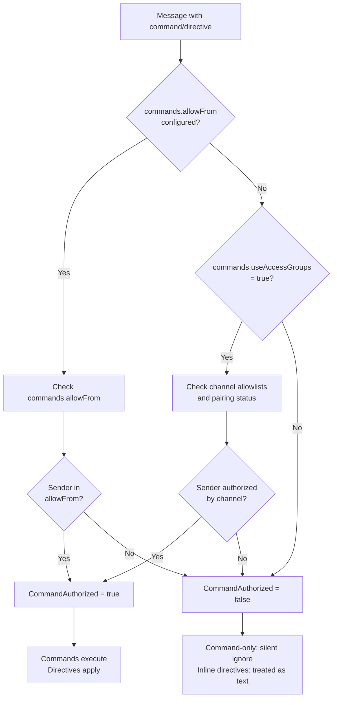
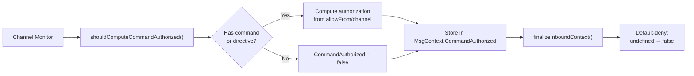
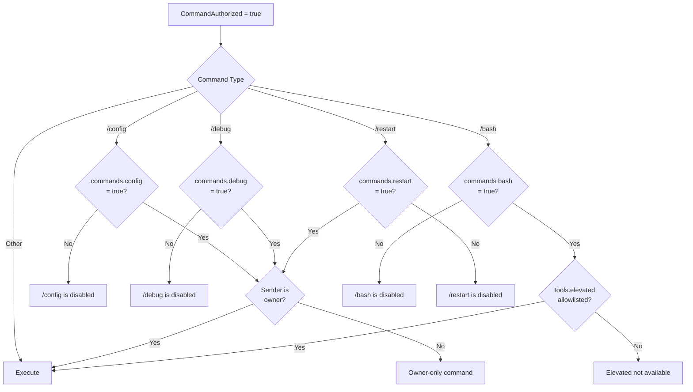
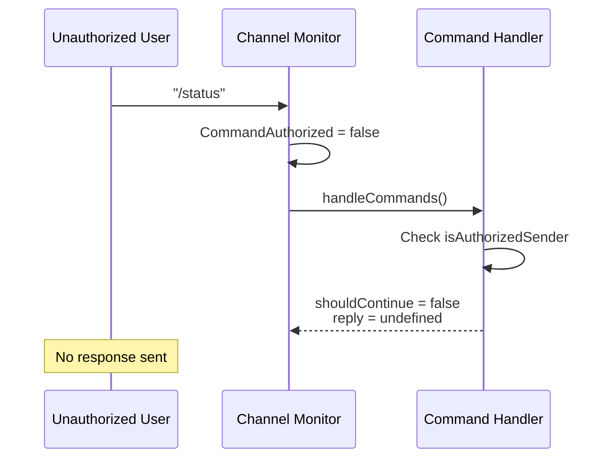
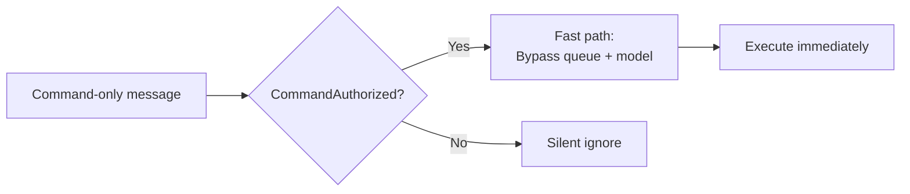

# Page: Command Authorization

# Command Authorization

<details>
<summary>Relevant source files</summary>

The following files were used as context for generating this wiki page:

- [docs/tools/slash-commands.md](docs/tools/slash-commands.md)
- [src/auto-reply/command-detection.ts](src/auto-reply/command-detection.ts)
- [src/auto-reply/commands-args.ts](src/auto-reply/commands-args.ts)
- [src/auto-reply/commands-registry.data.ts](src/auto-reply/commands-registry.data.ts)
- [src/auto-reply/commands-registry.test.ts](src/auto-reply/commands-registry.test.ts)
- [src/auto-reply/commands-registry.ts](src/auto-reply/commands-registry.ts)
- [src/auto-reply/commands-registry.types.ts](src/auto-reply/commands-registry.types.ts)
- [src/auto-reply/group-activation.ts](src/auto-reply/group-activation.ts)
- [src/auto-reply/reply.ts](src/auto-reply/reply.ts)
- [src/auto-reply/reply/commands-core.ts](src/auto-reply/reply/commands-core.ts)
- [src/auto-reply/reply/commands-status.ts](src/auto-reply/reply/commands-status.ts)
- [src/auto-reply/reply/commands-subagents.ts](src/auto-reply/reply/commands-subagents.ts)
- [src/auto-reply/reply/commands.test.ts](src/auto-reply/reply/commands.test.ts)
- [src/auto-reply/reply/commands.ts](src/auto-reply/reply/commands.ts)
- [src/auto-reply/reply/directive-handling.ts](src/auto-reply/reply/directive-handling.ts)
- [src/auto-reply/reply/subagents-utils.test.ts](src/auto-reply/reply/subagents-utils.test.ts)
- [src/auto-reply/reply/subagents-utils.ts](src/auto-reply/reply/subagents-utils.ts)
- [src/auto-reply/send-policy.ts](src/auto-reply/send-policy.ts)
- [src/auto-reply/status.test.ts](src/auto-reply/status.test.ts)
- [src/auto-reply/status.ts](src/auto-reply/status.ts)
- [src/auto-reply/templating.ts](src/auto-reply/templating.ts)

</details>


**Purpose**: Command authorization controls which senders can execute slash commands and inline directives. This gating mechanism prevents unauthorized users from issuing control commands, modifying session settings, or accessing sensitive operations. Authorization is computed per-message and stored in the `CommandAuthorized` context field.

For command syntax and available commands, see [Command Reference](#9.1). For platform-specific command surfaces, see [Platform-Specific Commands](#9.3).

---

## Authorization Sources

Command authorization resolves from multiple sources, with `commands.allowFrom` taking precedence when configured.

### Precedence Chain



**Sources**: [docs/tools/slash-commands.md:21-23](), [docs/tools/slash-commands.md:63-66]()

### Configuration Options

| Option | Type | Default | Description |
|--------|------|---------|-------------|
| `commands.allowFrom` | `Record<string, string[]>` | `undefined` | Per-provider allowlist. When set, becomes the exclusive authorization source. Use `"*"` for global default. |
| `commands.useAccessGroups` | `boolean` | `true` | When `commands.allowFrom` is not set, enforces channel allowlists and pairing. |

**Sources**: [docs/tools/slash-commands.md:63-66]()

---

## Authorization Flow

### Context Field: `CommandAuthorized`

The `CommandAuthorized` field is computed by channel monitors when a message contains command tokens or directives.



**Implementation**: [src/auto-reply/command-detection.ts:82-88]()

**Key Functions**:
- `shouldComputeCommandAuthorized()`: Determines if authorization should be computed based on message content
- `isControlCommandMessage()`: Detects command-only messages
- `hasInlineCommandTokens()`: Detects inline directives/shortcuts (e.g., "hey /status")

**Sources**: [src/auto-reply/command-detection.ts:82-88](), [src/auto-reply/command-detection.ts:67-80](), [src/auto-reply/templating.ts:143-149]()

### Command Context: `isAuthorizedSender`

Command handlers check `command.isAuthorizedSender` to gate execution.

```typescript
// Example from /status handler
if (!command.isAuthorizedSender) {
  logVerbose(`Ignoring /status from unauthorized sender: ${command.senderId || "<unknown>"}`);
  return undefined;
}
```

**Sources**: [src/auto-reply/reply/commands-status.ts:138-141](), [src/auto-reply/reply/commands-subagents.ts:176-181]()

---

## Authorization Decision Matrix

| Scenario | `commands.allowFrom` Set? | `commands.useAccessGroups` | Channel Allowlist | Result |
|----------|---------------------------|----------------------------|-------------------|--------|
| Sender in `allowFrom["*"]` | ✅ | N/A | N/A | ✅ Authorized |
| Sender in `allowFrom["telegram"]` (on Telegram) | ✅ | N/A | N/A | ✅ Authorized |
| Sender not in `allowFrom` | ✅ | N/A | N/A | ❌ Denied |
| Not set | ❌ | `true` | Sender paired/allowlisted | ✅ Authorized |
| Not set | ❌ | `true` | Sender not paired/allowlisted | ❌ Denied |
| Not set | ❌ | `false` | N/A | ❌ Denied |

**Sources**: [docs/tools/slash-commands.md:63-66]()

---

## Command-Specific Authorization Gates

Beyond basic command authorization, specific commands may require additional gates.

### Enablement Flags

Some commands are disabled by default and require explicit enablement:



**Sources**: [src/auto-reply/reply/commands.test.ts:110-130](), [docs/tools/slash-commands.md:61-62](), [docs/tools/slash-commands.md:59]()

### Owner-Only Commands

The following commands require the sender to be the owner (determined by channel-specific ownership rules):

- `/config`: Read/write `openclaw.json` (requires `commands.config: true`)
- `/debug`: Set runtime overrides (requires `commands.debug: true`)
- `/restart`: Restart OpenClaw (requires `commands.restart: true`)
- `/send`: Control send policy (owner-only)

**Sources**: [docs/tools/slash-commands.md:82](), [docs/tools/slash-commands.md:92]()

### Elevated Tool Requirements

The `/bash` command requires:
1. `commands.bash: true` (enablement flag)
2. `CommandAuthorized: true` (sender is authorized)
3. `tools.elevated` allowlists (sender allowed to use elevated tools)

**Sources**: [src/auto-reply/reply/commands.test.ts:93-108](), [docs/tools/slash-commands.md:59]()

---

## Behavior for Unauthorized Senders

### Command-Only Messages

Command-only messages from unauthorized senders are silently ignored:



**Sources**: [src/auto-reply/reply/commands-status.ts:138-141](), [docs/tools/slash-commands.md:125]()

### Inline Directives

Inline directives (e.g., `/think`, `/verbose`, `/model`) from unauthorized senders are treated as plain text and passed to the model:

```
Unauthorized: "let's /think about this problem"
→ Model sees: "let's /think about this problem"

Authorized: "let's /think about this problem"
→ Model sees: "let's about this problem" (with thinking enabled)
```

**Sources**: [docs/tools/slash-commands.md:21-23]()

### Inline Shortcuts

Certain commands (`/help`, `/commands`, `/status`, `/whoami`) work as inline shortcuts for authorized senders, but not for unauthorized senders:

```
Authorized: "hey /status"
→ Status reply sent immediately
→ Remaining text ("hey") continues through normal flow

Unauthorized: "hey /status"
→ Entire message "hey /status" continues through normal flow
```

**Sources**: [docs/tools/slash-commands.md:122-124]()

---

## Fast Path for Authorized Senders

Command-only messages from authorized senders bypass the queue and model inference:



Additionally, in group chats, command-only messages from authorized senders bypass mention requirements.

**Sources**: [docs/tools/slash-commands.md:120-121]()

---

## Configuration Examples

### Global Allowlist

```json
{
  "commands": {
    "allowFrom": {
      "*": ["user123", "+1234567890"]
    },
    "useAccessGroups": true
  }
}
```

When `commands.allowFrom` is set, only the specified users can execute commands, regardless of channel allowlists or pairing status.

### Per-Provider Allowlist

```json
{
  "commands": {
    "allowFrom": {
      "*": ["owner"],
      "telegram": ["user:123456", "user:789012"],
      "discord": ["user:987654321012345678"]
    }
  }
}
```

Provider-specific entries override the global `"*"` default for that provider.

### Channel Allowlists Only

```json
{
  "commands": {
    "useAccessGroups": true
  },
  "channels": {
    "whatsapp": {
      "allowFrom": ["+1234567890", "+4477123456"]
    },
    "telegram": {
      "dmPolicy": "pairing"
    }
  }
}
```

When `commands.allowFrom` is not set, authorization comes from channel-specific allowlists and pairing. Setting `useAccessGroups: false` would deny all command authorization.

### Sensitive Command Enablement

```json
{
  "commands": {
    "allowFrom": {
      "*": ["owner"]
    },
    "config": true,
    "debug": true,
    "bash": true,
    "restart": true
  },
  "tools": {
    "elevated": {
      "allowFrom": {
        "whatsapp": ["owner"]
      }
    }
  }
}
```

Even with command authorization, sensitive commands require explicit enablement flags and may have additional requirements (owner status, elevated tool access).

**Sources**: [docs/tools/slash-commands.md:28-67]()

---

## Summary

Command authorization is a default-deny system with multiple gates:

1. **Basic authorization**: `commands.allowFrom` (exclusive) or channel allowlists/pairing (when `useAccessGroups: true`)
2. **Command enablement**: Feature flags for sensitive commands (`config`, `debug`, `bash`, `restart`)
3. **Owner checks**: Owner-only commands require sender to be the owner
4. **Tool requirements**: Some commands require specific tool access (e.g., `tools.elevated` for `/bash`)

Unauthorized senders are denied silently (command-only messages) or have their directives treated as plain text (inline directives). Authorized senders benefit from fast-path execution and group mention bypass for command-only messages.

**Sources**: [docs/tools/slash-commands.md:21-23](), [docs/tools/slash-commands.md:63-66](), [docs/tools/slash-commands.md:120-125](), [src/auto-reply/command-detection.ts:82-88](), [src/auto-reply/templating.ts:143-149]()

---