# Page: Platform-Specific Commands

# Platform-Specific Commands

<details>
<summary>Relevant source files</summary>

The following files were used as context for generating this wiki page:

- [docs/tools/slash-commands.md](docs/tools/slash-commands.md)
- [src/auto-reply/command-detection.ts](src/auto-reply/command-detection.ts)
- [src/auto-reply/commands-args.ts](src/auto-reply/commands-args.ts)
- [src/auto-reply/commands-registry.data.ts](src/auto-reply/commands-registry.data.ts)
- [src/auto-reply/commands-registry.test.ts](src/auto-reply/commands-registry.test.ts)
- [src/auto-reply/commands-registry.ts](src/auto-reply/commands-registry.ts)
- [src/auto-reply/commands-registry.types.ts](src/auto-reply/commands-registry.types.ts)
- [src/auto-reply/group-activation.ts](src/auto-reply/group-activation.ts)
- [src/auto-reply/reply.ts](src/auto-reply/reply.ts)
- [src/auto-reply/reply/commands-core.ts](src/auto-reply/reply/commands-core.ts)
- [src/auto-reply/reply/commands-status.ts](src/auto-reply/reply/commands-status.ts)
- [src/auto-reply/reply/commands-subagents.ts](src/auto-reply/reply/commands-subagents.ts)
- [src/auto-reply/reply/commands.test.ts](src/auto-reply/reply/commands.test.ts)
- [src/auto-reply/reply/commands.ts](src/auto-reply/reply/commands.ts)
- [src/auto-reply/reply/directive-handling.ts](src/auto-reply/reply/directive-handling.ts)
- [src/auto-reply/reply/subagents-utils.test.ts](src/auto-reply/reply/subagents-utils.test.ts)
- [src/auto-reply/reply/subagents-utils.ts](src/auto-reply/reply/subagents-utils.ts)
- [src/auto-reply/send-policy.ts](src/auto-reply/send-policy.ts)
- [src/auto-reply/status.test.ts](src/auto-reply/status.test.ts)
- [src/auto-reply/status.ts](src/auto-reply/status.ts)
- [src/auto-reply/templating.ts](src/auto-reply/templating.ts)
- [src/discord/monitor.ts](src/discord/monitor.ts)
- [src/imessage/monitor.ts](src/imessage/monitor.ts)
- [src/signal/monitor.ts](src/signal/monitor.ts)
- [src/slack/monitor.ts](src/slack/monitor.ts)
- [src/telegram/bot.test.ts](src/telegram/bot.test.ts)
- [src/telegram/bot.ts](src/telegram/bot.ts)
- [src/web/auto-reply.ts](src/web/auto-reply.ts)
- [src/web/inbound.media.test.ts](src/web/inbound.media.test.ts)
- [src/web/inbound.test.ts](src/web/inbound.test.ts)
- [src/web/inbound.ts](src/web/inbound.ts)
- [src/web/test-helpers.ts](src/web/test-helpers.ts)
- [src/web/vcard.ts](src/web/vcard.ts)

</details>


This page documents how OpenClaw implements native slash commands on platforms that support them (Discord, Telegram, Slack). Native commands provide enhanced user experience through autocomplete, argument menus, and platform-specific UI components.

For information about text command parsing and directives (inline `/think`, `/model`, etc.), see [Directives](#9.3). For the complete list of available commands, see [Command Reference](#9.1).

---

## Command Registry Architecture

OpenClaw uses a unified command registry that defines commands once and adapts them to platform-specific formats. Commands are categorized by scope: `text` (text parsing only), `native` (platform native only), or `both`.

### Command Definition Structure

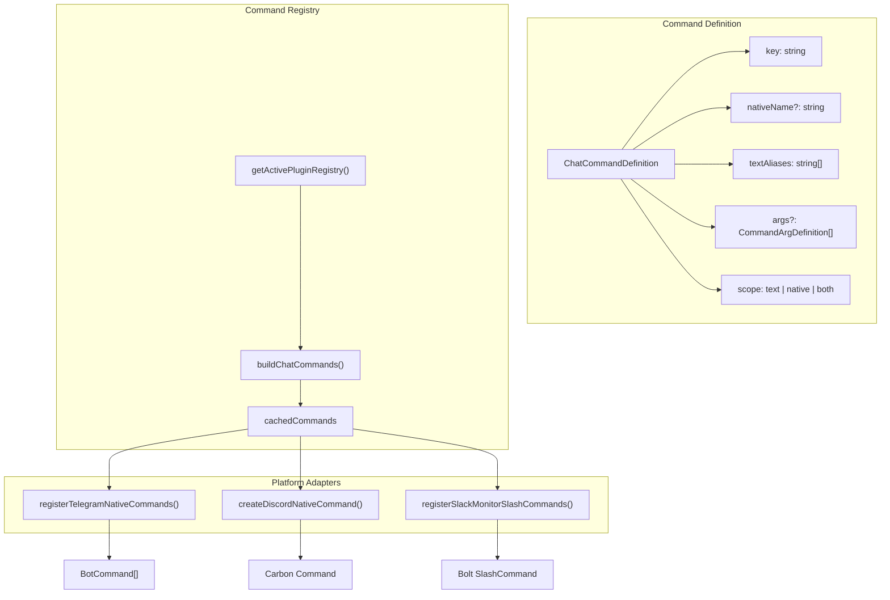

**Sources:** [src/auto-reply/commands-registry.ts:71-149](), [src/auto-reply/commands-registry.data.ts:26-46]()

### Command Resolution Flow

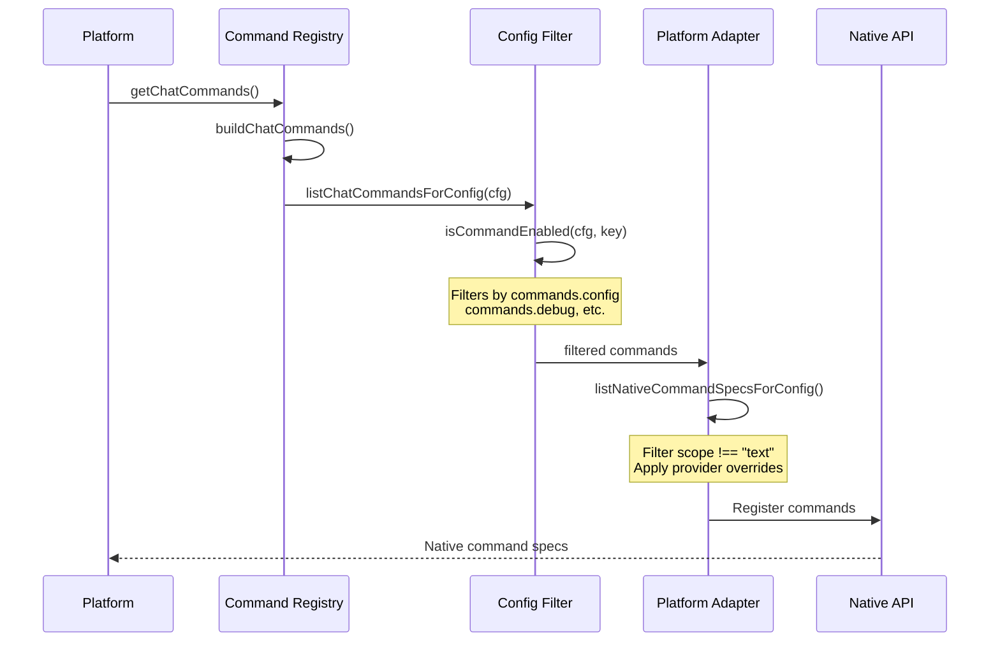

**Sources:** [src/auto-reply/commands-registry.ts:92-149](), [src/auto-reply/commands-registry.data.ts:122-149]()

---

## Telegram Native Commands

Telegram commands are registered via the Bot API's `setMyCommands` endpoint. The implementation uses grammY's throttler and sequentialization for rate-limiting and ordered message processing.

### Registration Process

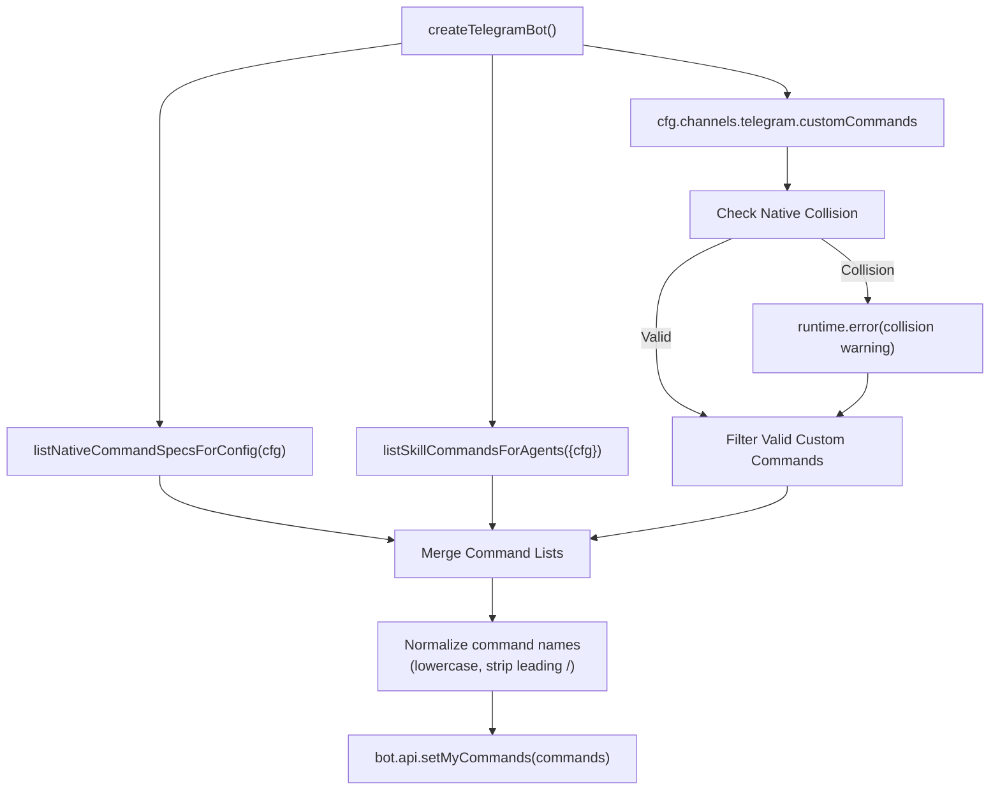

**Sources:** [src/telegram/bot-native-commands.ts:22-119](), [src/telegram/bot.test.ts:217-288]()

Telegram commands are set at bot startup:

1. **Native Commands** - `listNativeCommandSpecsForConfig()` retrieves all enabled built-in commands
2. **Skill Commands** - `listSkillCommandsForAgents()` generates commands for user-invocable skills
3. **Custom Commands** - `channels.telegram.customCommands` allows additional commands
4. **Collision Detection** - Custom commands that collide with native commands are filtered out and logged as errors
5. **Normalization** - Command names are normalized: lowercased, leading `/` stripped
6. **Registration** - Final command list sent to Telegram via `bot.api.setMyCommands()`

**Custom Command Validation:**
- Commands are normalized to lowercase with leading `/` stripped: `/Custom_Backup` → `custom_backup`
- Collisions with reserved native command names trigger `runtime.error()` and are ignored
- Non-colliding custom commands are appended to the native command list

### Command Handling

Telegram native commands trigger the `bot.command()` handler, which routes to the unified command processor:

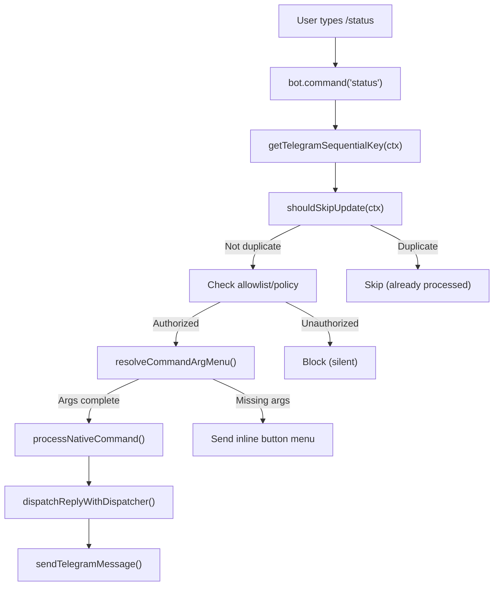

**Key Implementation Details:**

| Feature | Implementation | Code Reference |
|---------|---------------|----------------|
| **Sequential Processing** | `sequentialize(getTelegramSequentialKey)` ensures messages from same chat are processed in order | [src/telegram/bot.ts:148]() |
| **Sequential Key Pattern** | `telegram:{chatId}` for DMs, `telegram:{chatId}:topic:{threadId}` for forum topics | [src/telegram/bot.ts:67-110]() |
| **Deduplication** | `createTelegramUpdateDedupe()` prevents duplicate update processing via `updateId` tracking | [src/telegram/bot.ts:154-183]() |
| **Argument Parsing** | Commands with args use inline button menus when arguments are missing | [src/telegram/bot-native-commands.ts:154-298]() |
| **Callback Queries** | Button clicks trigger `bot.on("callback_query")` handler, re-routing to command execution | [src/telegram/bot.ts:364-476]() |

**Special Callback Handlers:**
- **Pagination Callbacks:** `/commands` with many commands shows paginated list with `commands_page_{N}` callback data
- **Arg Menu Callbacks:** Generic argument selection buttons with callback format `{commandKey}:{argValue}`

**Sources:** [src/telegram/bot.ts:67-110](), [src/telegram/bot.ts:148-224](), [src/telegram/bot-native-commands.ts:1-298]()

### Argument Menus

When a command requires arguments and none are provided, Telegram shows inline button menus:

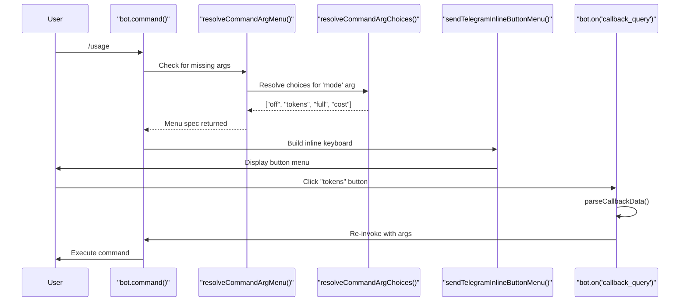

**Example:** `/usage` command without args shows buttons: `off | tokens | full | cost`

**Button Layout:**
- Up to 3 buttons per row (configurable)
- Callback data format: `{commandKey}:{argValue}` (e.g., `usage:tokens`)
- Button clicks trigger `callback_query` event, which re-routes through command handler

**Sources:** [src/telegram/bot-native-commands.ts:154-298](), [src/telegram/send.ts:320-402]()

---

## Discord Native Commands

Discord commands use the `@buape/carbon` library, which provides a higher-level abstraction over Discord's slash command API. Commands support autocomplete, choice lists, and button interactions.

### Command Registration

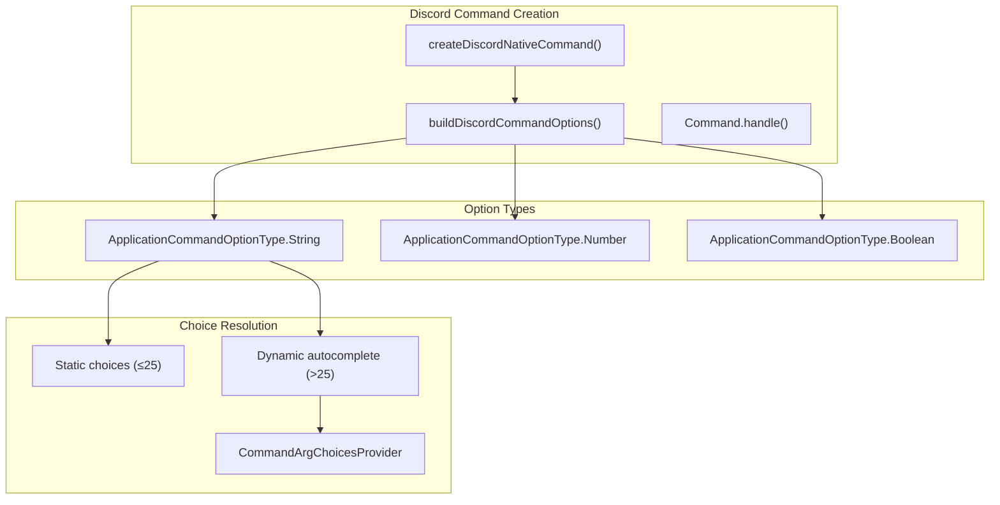

**Sources:** [src/discord/monitor/native-command.ts:60-118]()

Discord commands are created as Carbon `Command` instances:

```typescript
// Simplified structure from src/discord/monitor/native-command.ts
class DiscordNativeCommand extends Command {
  name = command.nativeName;
  description = command.description;
  options = buildDiscordCommandOptions({ command, cfg });
  
  async run(interaction: CommandInteraction) {
    // Access control checks
    // Argument parsing
    // Command dispatch
  }
}
```

### Argument Autocomplete

For commands with large choice lists (>25 items), Discord provides autocomplete:

**Autocomplete Flow:**

1. User types command → Discord shows autocomplete
2. User types partial match → `AutocompleteInteraction` fired
3. `resolveCommandArgChoices()` called with context
4. Filtered choices returned (max 25)

**Example:** `/model` command provides autocomplete for available models, filtered by user input.

**Sources:** [src/discord/monitor/native-command.ts:86-102]()

### Button Interactions for Argument Menus

When a command supports argument menus and no argument is provided, Discord shows ephemeral button menus:

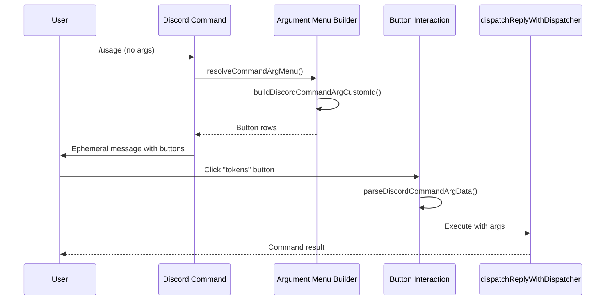

**Button Custom ID Format:** `cmdarg:command={cmd};arg={name};value={val};user={id}`

**Sources:** [src/discord/monitor/native-command.ts:199-230](), [src/discord/monitor/native-command.ts:450-550]()

### Provider-Specific Name Overrides

Discord reserves certain command names. OpenClaw applies overrides via `NATIVE_NAME_OVERRIDES`:

| Command Key | Default Name | Discord Override |
|-------------|--------------|------------------|
| `tts` | `/tts` | `/voice` |

**Implementation:** [src/auto-reply/commands-registry.ts:108-121]()

---

## Slack Slash Commands

Slack supports two modes: **legacy single command** (`/openclaw`) and **native per-command** slash commands. The native mode requires manually creating each command in the Slack App configuration.

### Configuration Modes

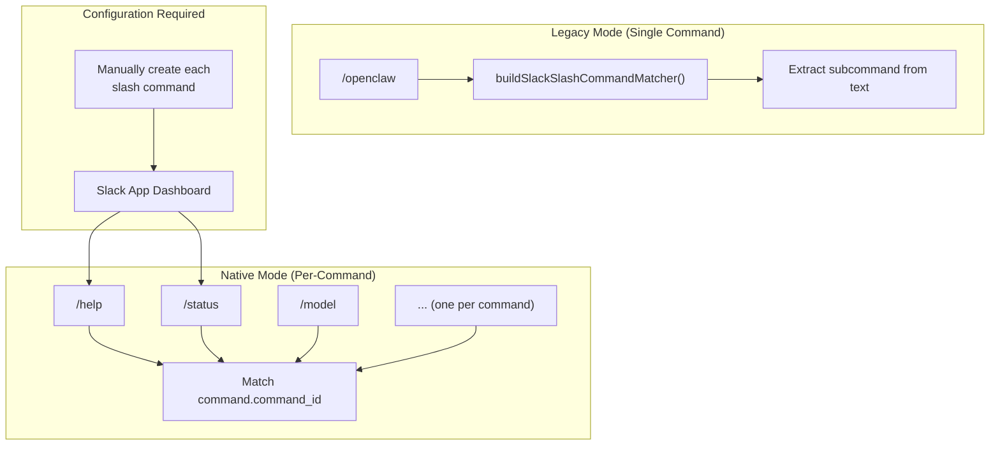

**Configuration:**

- **Legacy:** `channels.slack.slashCommand.command = "/openclaw"` (default)
- **Native:** `commands.native = true` or `channels.slack.commands.native = true`
  - **Important:** Native mode requires creating each command in the Slack App dashboard
  - Slack does not provide an API for programmatic command registration

**Command Matching:**
- **Legacy:** Uses `buildSlackSlashCommandMatcher()` to parse subcommand from text (e.g., `/openclaw status` → `status` command)
- **Native:** Matches `command.command_id` directly to command names

**Sources:** [src/slack/monitor/slash.ts:132-180](), [src/slack/monitor/commands.ts:1-48](), [docs/tools/slash-commands.md:52-56]()

### Argument Menu Implementation

Slack uses Block Kit buttons for argument selection:

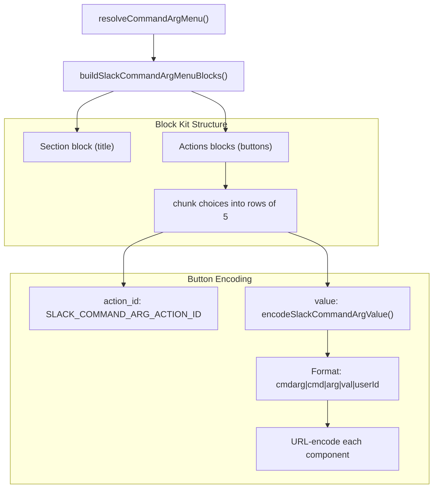

**Implementation Details:**

```typescript
// From src/slack/monitor/slash.ts:46-92
const SLACK_COMMAND_ARG_ACTION_ID = "openclaw_command_arg_select";

function encodeSlackCommandArgValue(params: {
  command: string;
  arg: string;
  value: string;
  userId: string;
}): string {
  const components = [
    "cmdarg",
    encodeURIComponent(params.command),
    encodeURIComponent(params.arg),
    encodeURIComponent(params.value),
    encodeURIComponent(params.userId),
  ];
  return components.join("|");
}
```

**Button Layout:**
- Maximum 5 buttons per action block (Slack Block Kit limit)
- Buttons chunked into rows using `chunkItems(choices, 5)`
- Each button's `value` encodes command context for callback routing

**Decoding on Callback:**
- `block_actions` event triggered when button clicked
- `action_id` matched to `SLACK_COMMAND_ARG_ACTION_ID`
- `value` decoded using `parseSlackCommandArgData()`
- Command re-executed with selected argument

**Sources:** [src/slack/monitor/slash.ts:46-130](), [src/slack/monitor/slash.ts:279-383]()

### Slash Command Handler Flow

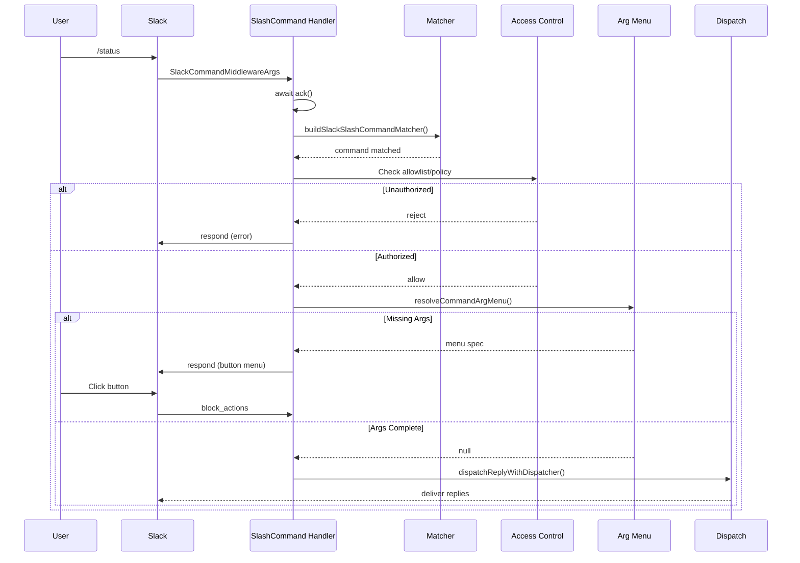

**Sources:** [src/slack/monitor/slash.ts:147-400]()

---

## Command Argument System

All platforms share a common argument definition and resolution system through the command registry.

### Argument Definition Structure

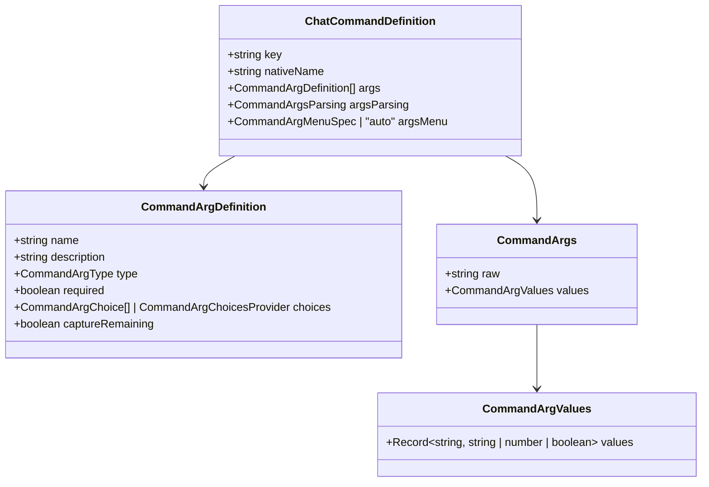

**Core Types:**

| Type | Values | Purpose |
|------|--------|---------|
| `CommandArgType` | `"string"` \| `"number"` \| `"boolean"` | Argument data type |
| `CommandArgsParsing` | `"none"` \| `"positional"` | Parsing strategy |
| `CommandArgMenuSpec` | `{ arg: string; title?: string }` \| `"auto"` | Menu configuration |

**Sources:** [src/auto-reply/commands-registry.types.ts:1-82]()

### Argument Parsing Modes

| Mode | Description | Implementation | Example |
|------|-------------|----------------|---------|
| `none` | No structured parsing, `args.raw` only | `parseCommandArgs()` returns `{ raw }` | `/compact [instructions]` |
| `positional` | Parse args by position | `parsePositionalArgs()` splits on whitespace | `/debug set tools.bash=true` |

**Parsing Pipeline:**

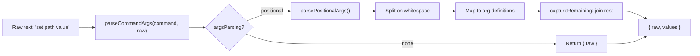

**Key Functions:**

- **`parseCommandArgs()`** - Entry point: [src/auto-reply/commands-registry.ts:235-250]()
- **`parsePositionalArgs()`** - Positional parser: [src/auto-reply/commands-registry.ts:185-206]()
- **`serializeCommandArgs()`** - Reverse conversion: [src/auto-reply/commands-registry.ts:252-270]()
- **`resolveCommandArgChoices()`** - Resolve static or dynamic choices: [src/auto-reply/commands-registry.ts:297-325]()
- **`resolveCommandArgMenu()`** - Determine if arg menu should be shown: [src/auto-reply/commands-registry.ts:327-363]()

**Sources:** [src/auto-reply/commands-registry.ts:185-363]()

### Dynamic Choice Providers

Commands can provide dynamic choices based on context:

```typescript
// Example from commands-registry.data.ts
{
  name: "level",
  type: "string",
  choices: ({ provider, model }) => {
    return listThinkingLevels({ provider, model });
  }
}
```

**Choice Resolution Context:**

- `cfg` - Current OpenClawConfig
- `provider` - Current model provider
- `model` - Current model
- `command` - Command definition
- `arg` - Argument definition

**Sources:** [src/auto-reply/commands-registry.ts:259-286](), [src/auto-reply/commands-registry.data.ts:1-300]()

---

## Platform Capability Comparison

| Feature | Discord | Telegram | Slack |
|---------|---------|----------|-------|
| **Native Registration** | Automatic (Carbon) | `bot.api.setMyCommands()` | Manual Slack App config |
| **Registration Timing** | On client ready | On bot startup | Pre-configured (manual) |
| **Autocomplete** | Yes (>25 choices) | No | No |
| **Argument Menus** | Ephemeral buttons | Inline buttons | Block Kit buttons |
| **Menu Button Layout** | Up to 5 columns | Up to 3 per row | Up to 5 per row |
| **Multi-Agent Support** | Session per user | Targets chat session | Session per user |
| **Custom Commands** | Via Carbon Command class | Via `customCommands` config | Via Slack App |
| **Choice Limit** | 25 per autocomplete | Unlimited inline buttons | 25 per action block |
| **Command Scope** | Guild/Global | Bot-wide | Workspace-wide |
| **Pagination Support** | No | Yes (via callback_query) | No |
| **Session Key Pattern** | `discord:slash:{userId}` | `CommandTargetSessionKey` | `slack:slash:{userId}` |

**Implementation References:**

| Platform | Registration Code | Handler Code |
|----------|------------------|--------------|
| Discord | [src/discord/monitor/native-command.ts:60-118]() | [src/discord/monitor/native-command.ts:199-450]() |
| Telegram | [src/telegram/bot-native-commands.ts:22-119]() | [src/telegram/bot-native-commands.ts:154-298]() |
| Slack | Manual (Slack App UI) | [src/slack/monitor/slash.ts:147-400]() |

**Sources:** [src/discord/monitor/native-command.ts:60-450](), [src/telegram/bot-native-commands.ts:22-298](), [src/slack/monitor/slash.ts:147-400]()

---

## Configuration Reference

### Enabling Native Commands

```json5
{
  commands: {
    // Global setting
    native: "auto",  // "auto" | true | false
    
    // Per-provider overrides
  },
  channels: {
    discord: {
      commands: {
        native: true,        // Override global
        nativeSkills: true   // Register skill commands
      }
    },
    telegram: {
      commands: {
        native: "auto"
      },
      customCommands: [
        { command: "backup", description: "Backup data" }
      ]
    },
    slack: {
      commands: {
        native: false  // Use legacy /openclaw mode
      },
      slashCommand: {
        command: "/openclaw",
        sessionPrefix: "slack:slash"
      }
    }
  }
}
```

**Auto Behavior:**

- **Discord:** On by default
- **Telegram:** On by default
- **Slack:** Off by default (requires manual Slack App configuration)

**Sources:** [docs/tools/slash-commands.md:26-51](), [src/config/commands.ts:1-100]()

### Native Skills Commands

Skills declared with `user-invocable: true` are automatically registered as native commands:

```json5
{
  commands: {
    nativeSkills: "auto"  // "auto" | true | false
  }
}
```

**Skill Command Generation:**

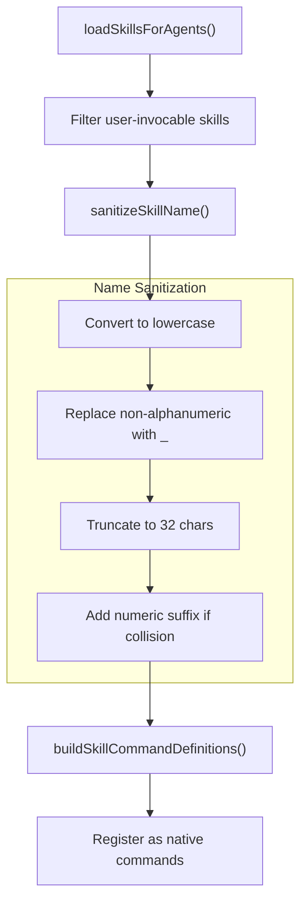

**Skill Command Naming:**

1. **Sanitization:** Skill name converted to `[a-z0-9_]` (max 32 chars)
2. **Collision Handling:** Numeric suffixes added: `skill_name`, `skill_name_2`, `skill_name_3`, etc.
3. **Command Routing:** 
   - Default: Forwards to model as normal request
   - `command-dispatch: tool`: Routes directly to skill tool (no model)

**Example:** Skill `my-skill-name` → command `/my_skill_name`

**Sources:** [docs/tools/slash-commands.md:52-59](), [src/auto-reply/skill-commands.ts:1-137](), [src/auto-reply/commands-registry.ts:72-84]()

---

## Implementation Notes

### Session Keys by Platform

Native commands use isolated session keys to avoid conflicts with text chat sessions:

| Platform | Session Key Pattern | Purpose |
|----------|---------------------|---------|
| Discord | `agent:{agentId}:discord:slash:{userId}` | Per-user slash command session |
| Telegram | `telegram:slash:{userId}` + CommandTargetSessionKey | Routes to chat session |
| Slack | `agent:{agentId}:slack:slash:{userId}` | Per-user slash command session |

**Exception:** `/stop` command targets the active chat session to abort the current run.

**Sources:** [docs/tools/slash-commands.md:183-190]()

### Access Control

Native commands respect the same access control as text commands:

1. **Allowlist/Policy Check** - `resolveCommandAuthorizedFromAuthorizers()`
2. **Group Policy** - `isDiscordGroupAllowedByPolicy()`, `isSlackChannelAllowedByPolicy()`
3. **DM Policy** - `dmPolicy: "pairing" | "allowlist" | "open" | "disabled"`

Unauthorized command invocations are silently ignored.

**Sources:** [src/discord/monitor/native-command.ts:200-250](), [src/slack/monitor/slash.ts:200-300](), [src/telegram/bot-native-commands.ts:50-150]()

### Error Handling

**Discord:** Unknown interaction errors (10062) are caught and logged as warnings (interaction expired).

**Telegram:** Rate limits handled by `apiThrottler()` middleware.

**Slack:** Ack timeout handling with early `await ack()`.

**Sources:** [src/discord/monitor/native-command.ts:170-197](), [src/telegram/bot.ts:142-147](), [src/slack/monitor/slash.ts:155-160]()

---